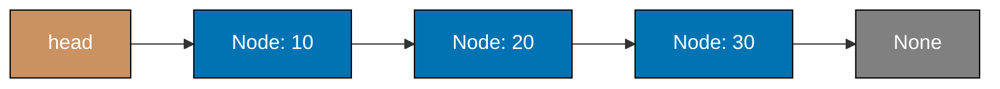
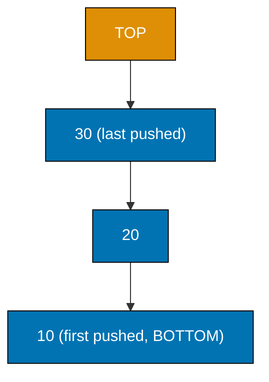
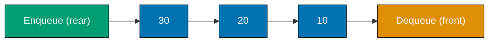
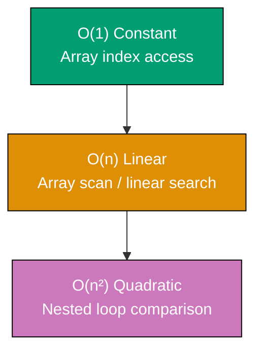
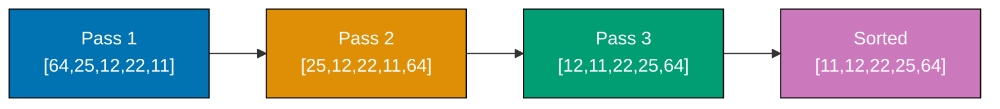
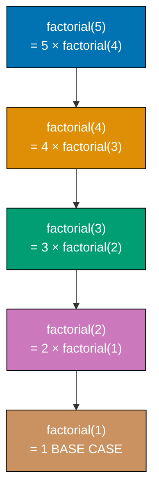

This tutorial covers foundational data structures and algorithms through 28 heavily annotated examples in C, Go, Python, and Java. Each example is self-contained and runnable. Coverage spans arrays, linked lists, stacks, queues, deques, basic sorting algorithms, linear search, basic recursion, and Big-O basics — building the mental models every software engineer needs.

## Arrays and Lists

### Example 1: Creating and Accessing Arrays

Arrays (Python lists) store elements in contiguous memory locations with zero-based indexing. Accessing any element by index is O(1) — the engine jumps directly to the memory address without scanning.




```c
// Example 1: Creating and Accessing Arrays

#include <stdio.h>

int main(void) {
    // Create an array with five integers
    int numbers[] = {10, 20, 30, 40, 50};
    // => numbers stores {10, 20, 30, 40, 50}
    // => C allocates contiguous memory on the stack for these values

    // Access elements by zero-based index
    int first = numbers[0];
    // => first is 10 — index 0 is the leftmost element
    // => Access is O(1): the CPU computes address = base + (index * sizeof(int))

    int length = sizeof(numbers) / sizeof(numbers[0]);
    // => length is 5 — computed at compile time from total size / element size

    int last = numbers[length - 1];
    // => last is 50 — C has no negative indexing; use length-1 for the final element

    int middle = numbers[2];
    // => middle is 30 — direct jump to index 2, no scanning needed

    printf("%d %d %d\n", first, last, middle);
    // => Output: 10 50 30

    // Read the length of the array
    printf("%d\n", length);
    // => Output: 5

    return 0;
}
```




```go
// Example 1: Creating and Accessing Arrays
package main

import "fmt"

func main() {
    // Create a slice (Go's dynamic array) with five integers
    numbers := []int{10, 20, 30, 40, 50}
    // => numbers stores [10, 20, 30, 40, 50]
    // => Go allocates contiguous memory backed by an underlying array

    // Access elements by zero-based index
    first := numbers[0]
    // => first is 10 — index 0 is the leftmost element
    // => Access is O(1): the CPU computes address = base + (index * element_size)

    last := numbers[len(numbers)-1]
    // => last is 50 — Go has no negative indexing; use len-1 for the final element

    middle := numbers[2]
    // => middle is 30 — direct jump to index 2, no scanning needed

    fmt.Println(first, last, middle)
    // => Output: 10 50 30

    // Read the length of the slice
    length := len(numbers)
    // => length is 5 — len() is O(1), stored in the slice header

    fmt.Println(length)
    // => Output: 5
}
```




```python
# Example 1: Creating and Accessing Arrays

# Create a list (Python's dynamic array) with five integers
numbers = [10, 20, 30, 40, 50]
# => numbers stores [10, 20, 30, 40, 50]
# => Internally, Python allocates contiguous memory for these values

# Access elements by zero-based index
first = numbers[0]
# => first is 10 — index 0 is the leftmost element
# => Access is O(1): the CPU computes address = base + (index * element_size)

last = numbers[-1]
# => last is 50 — negative index -1 wraps to the final element
# => Equivalent to numbers[len(numbers) - 1]

middle = numbers[2]
# => middle is 30 — direct jump to index 2, no scanning needed

print(first, last, middle)
# => Output: 10 50 30

# Read the length of the array
length = len(numbers)
# => length is 5 — Python tracks size internally, so len() is O(1)

print(length)
# => Output: 5
```




```java
// Example 1: Creating and Accessing Arrays

public class Example01 {
    public static void main(String[] args) {
        // Create an array with five integers
        int[] numbers = {10, 20, 30, 40, 50};
        // => numbers stores {10, 20, 30, 40, 50}
        // => Java allocates contiguous memory on the heap for these values

        // Access elements by zero-based index
        int first = numbers[0];
        // => first is 10 — index 0 is the leftmost element
        // => Access is O(1): the JVM computes address = base + (index * element_size)

        int last = numbers[numbers.length - 1];
        // => last is 50 — Java has no negative indexing; use length-1 for the final element

        int middle = numbers[2];
        // => middle is 30 — direct jump to index 2, no scanning needed

        System.out.println(first + " " + last + " " + middle);
        // => Output: 10 50 30

        // Read the length of the array
        int length = numbers.length;
        // => length is 5 — Java arrays store length as a field, so access is O(1)

        System.out.println(length);
        // => Output: 5
    }
}
```




**Key Takeaway:** Array indexing is O(1) because the CPU computes the memory address directly. Negative indices count from the end.

**Why It Matters:** In production, most data pipelines start with arrays. Knowing that indexing is O(1) while scanning is O(n) shapes every decision about when to use index-based lookups versus iteration. Python's list is a dynamic array that underpins lists, stacks, and many queue implementations throughout the standard library.

---

### Example 2: Modifying Arrays — Append, Insert, and Delete

Dynamic arrays grow automatically when you append. Insert and delete at arbitrary positions cost O(n) because Python must shift elements to maintain contiguous ordering.




```c
// Example 2: Modifying Arrays — Append, Insert, and Delete

#include <stdio.h>
#include <stdlib.h>
#include <string.h>

// Simple dynamic string array
typedef struct {
    char **items;
    int size;
    int capacity;
} StringArray;

void init(StringArray *a, int cap) {
    a->items = malloc(cap * sizeof(char *));
    a->size = 0;
    a->capacity = cap;
}

void append(StringArray *a, const char *s) {
    // Append adds to the end — amortized O(1)
    if (a->size == a->capacity) {
        a->capacity *= 2;
        a->items = realloc(a->items, a->capacity * sizeof(char *));
        // => Double capacity when full — amortized O(1) over many appends
    }
    a->items[a->size++] = strdup(s);
}

void insert_at(StringArray *a, int idx, const char *s) {
    // Insert at index — O(n) because elements shift right
    append(a, "");  // => Ensure space
    free(a->items[a->size - 1]);
    for (int i = a->size - 1; i > idx; i--) {
        a->items[i] = a->items[i - 1];
        // => Shift elements right to make room
    }
    a->items[idx] = strdup(s);
}

void remove_by_value(StringArray *a, const char *s) {
    // Remove by value — O(n) scan + O(n) shift
    for (int i = 0; i < a->size; i++) {
        if (strcmp(a->items[i], s) == 0) {
            free(a->items[i]);
            for (int j = i; j < a->size - 1; j++) {
                a->items[j] = a->items[j + 1];
                // => Shift remaining elements left to fill the gap
            }
            a->size--;
            return;
        }
    }
}

char *pop_end(StringArray *a) {
    // Pop from the end — O(1), no shifting needed
    return a->items[--a->size];
}

char *pop_at(StringArray *a, int idx) {
    // Pop from an arbitrary index — O(n) due to shifting
    char *removed = a->items[idx];
    for (int i = idx; i < a->size - 1; i++) {
        a->items[i] = a->items[i + 1];
    }
    a->size--;
    return removed;
}

void print_array(StringArray *a) {
    printf("[");
    for (int i = 0; i < a->size; i++) {
        if (i > 0) printf(", ");
        printf("%s", a->items[i]);
    }
    printf("]\n");
}

int main(void) {
    StringArray fruits;
    init(&fruits, 4);
    append(&fruits, "apple");
    append(&fruits, "banana");
    append(&fruits, "cherry");
    // => fruits is ["apple", "banana", "cherry"]

    append(&fruits, "date");
    // => fruits is ["apple", "banana", "cherry", "date"]
    print_array(&fruits);
    // => Output: [apple, banana, cherry, date]

    insert_at(&fruits, 1, "avocado");
    // => "avocado" goes to index 1; others shift right
    // => fruits is ["apple", "avocado", "banana", "cherry", "date"]
    print_array(&fruits);
    // => Output: [apple, avocado, banana, cherry, date]

    remove_by_value(&fruits, "banana");
    // => fruits is ["apple", "avocado", "cherry", "date"]
    print_array(&fruits);
    // => Output: [apple, avocado, cherry, date]

    char *popped = pop_end(&fruits);
    // => popped is "date"; fruits is ["apple", "avocado", "cherry"]
    printf("%s ", popped);
    print_array(&fruits);
    // => Output: date [apple, avocado, cherry]
    free(popped);

    char *removed = pop_at(&fruits, 0);
    // => removed is "apple"; fruits is ["avocado", "cherry"]
    printf("%s ", removed);
    print_array(&fruits);
    // => Output: apple [avocado, cherry]
    free(removed);

    // Cleanup
    for (int i = 0; i < fruits.size; i++) free(fruits.items[i]);
    free(fruits.items);
    return 0;
}
```




```go
// Example 2: Modifying Arrays — Append, Insert, and Delete
package main

import "fmt"

func main() {
    fruits := []string{"apple", "banana", "cherry"}
    // => fruits is ["apple", "banana", "cherry"]
    // => len(fruits) is 3

    // Append adds to the end — amortized O(1)
    fruits = append(fruits, "date")
    // => fruits is ["apple", "banana", "cherry", "date"]
    // => Go over-allocates capacity so most appends avoid reallocation
    fmt.Println(fruits)
    // => Output: [apple banana cherry date]

    // Insert at index 1 — O(n) because elements shift right
    fruits = append(fruits[:2], append([]string{"avocado"}, fruits[1:]...)...)
    // => Rebuild slice: [:1] + "avocado" + [1:]
    // => fruits is ["apple", "avocado", "banana", "cherry", "date"]
    // Simpler approach using slices.Insert (Go 1.21+):
    // fruits = slices.Insert(fruits, 1, "avocado")
    fmt.Println(fruits)
    // => Output: [apple avocado banana cherry date]

    // Remove by value — O(n) scan + O(n) shift
    for i, v := range fruits {
        if v == "banana" {
            fruits = append(fruits[:i], fruits[i+1:]...)
            break
        }
    }
    // => fruits is ["apple", "avocado", "cherry", "date"]
    fmt.Println(fruits)
    // => Output: [apple avocado cherry date]

    // Pop from the end — O(1), no shifting needed
    popped := fruits[len(fruits)-1]
    fruits = fruits[:len(fruits)-1]
    // => popped is "date"; fruits is ["apple", "avocado", "cherry"]
    fmt.Println(popped, fruits)
    // => Output: date [apple avocado cherry]

    // Pop from an arbitrary index — O(n) due to shifting
    removed := fruits[0]
    fruits = fruits[1:]
    // => removed is "apple"; fruits is ["avocado", "cherry"]
    fmt.Println(removed, fruits)
    // => Output: apple [avocado cherry]
}
```




```python
# Example 2: Modifying Arrays — Append, Insert, and Delete

fruits = ["apple", "banana", "cherry"]
# => fruits is ["apple", "banana", "cherry"]
# => len(fruits) is 3

# Append adds to the end — amortized O(1)
fruits.append("date")
# => fruits is ["apple", "banana", "cherry", "date"]
# => Python over-allocates memory so most appends avoid reallocation
# => Only occasional O(n) copy when capacity is exceeded

print(fruits)
# => Output: ['apple', 'banana', 'cherry', 'date']

# Insert at index 1 — O(n) because elements shift right
fruits.insert(1, "avocado")
# => "avocado" goes to index 1
# => "banana", "cherry", "date" each shift one position right
# => fruits is ["apple", "avocado", "banana", "cherry", "date"]

print(fruits)
# => Output: ['apple', 'avocado', 'banana', 'cherry', 'date']

# Remove by value — O(n) scan + O(n) shift
fruits.remove("banana")
# => Python scans left-to-right until "banana" is found
# => Remaining elements shift left to fill the gap
# => fruits is ["apple", "avocado", "cherry", "date"]

print(fruits)
# => Output: ['apple', 'avocado', 'cherry', 'date']

# Pop from the end — O(1), no shifting needed
popped = fruits.pop()
# => popped is "date" — the last element
# => fruits is ["apple", "avocado", "cherry"]

print(popped, fruits)
# => Output: date ['apple', 'avocado', 'cherry']

# Pop from an arbitrary index — O(n) due to shifting
removed = fruits.pop(0)
# => removed is "apple" — index 0 removed
# => "avocado" and "cherry" shift left
# => fruits is ["avocado", "cherry"]

print(removed, fruits)
# => Output: apple ['avocado', 'cherry']
```




```java
// Example 2: Modifying Arrays — Append, Insert, and Delete

import java.util.ArrayList;

public class Example02 {
    public static void main(String[] args) {
        ArrayList<String> fruits = new ArrayList<>();
        fruits.add("apple");
        fruits.add("banana");
        fruits.add("cherry");
        // => fruits is ["apple", "banana", "cherry"]
        // => size() is 3

        // Append adds to the end — amortized O(1)
        fruits.add("date");
        // => fruits is ["apple", "banana", "cherry", "date"]
        // => ArrayList over-allocates so most adds avoid reallocation
        System.out.println(fruits);
        // => Output: [apple, banana, cherry, date]

        // Insert at index 1 — O(n) because elements shift right
        fruits.add(1, "avocado");
        // => "avocado" goes to index 1
        // => "banana", "cherry", "date" each shift one position right
        // => fruits is ["apple", "avocado", "banana", "cherry", "date"]
        System.out.println(fruits);
        // => Output: [apple, avocado, banana, cherry, date]

        // Remove by value — O(n) scan + O(n) shift
        fruits.remove("banana");
        // => Scans left-to-right until "banana" is found
        // => Remaining elements shift left to fill the gap
        // => fruits is ["apple", "avocado", "cherry", "date"]
        System.out.println(fruits);
        // => Output: [apple, avocado, cherry, date]

        // Pop from the end — O(1), no shifting needed
        String popped = fruits.remove(fruits.size() - 1);
        // => popped is "date" — the last element
        // => fruits is ["apple", "avocado", "cherry"]
        System.out.println(popped + " " + fruits);
        // => Output: date [apple, avocado, cherry]

        // Pop from an arbitrary index — O(n) due to shifting
        String removed = fruits.remove(0);
        // => removed is "apple" — index 0 removed
        // => "avocado" and "cherry" shift left
        // => fruits is ["avocado", "cherry"]
        System.out.println(removed + " " + fruits);
        // => Output: apple [avocado, cherry]
    }
}
```




**Key Takeaway:** Append and end-pop are O(1). Insert, remove, and pop at arbitrary positions are O(n) due to element shifting.

**Why It Matters:** Production code that inserts or deletes frequently at the beginning or middle of a large list pays O(n) per operation. Recognizing this cost early drives engineers toward deques, linked lists, or index-based compaction strategies before performance degradation occurs in production.

---

### Example 3: Array Slicing

Slicing creates a new list containing a contiguous subrange. The syntax `list[start:stop:step]` follows the half-open interval convention — `stop` is excluded.




```c
// Example 3: Array Slicing

#include <stdio.h>

void print_array(int *arr, int len) {
    printf("[");
    for (int i = 0; i < len; i++) {
        if (i > 0) printf(", ");
        printf("%d", arr[i]);
    }
    printf("]\n");
}

int main(void) {
    int data[] = {0, 1, 2, 3, 4, 5, 6, 7, 8, 9};
    // => data holds integers 0 through 9 inclusive
    int n = 10;

    // Basic slice: indices 2 through 4 (index 5 excluded)
    int subset[3];
    for (int i = 0; i < 3; i++) subset[i] = data[2 + i];
    // => subset is {2, 3, 4}
    // => Manual copy into a NEW array — O(k) where k is slice length
    print_array(subset, 3);
    // => Output: [2, 3, 4]

    // First four elements (head)
    int head[4];
    for (int i = 0; i < 4; i++) head[i] = data[i];
    // => head is {0, 1, 2, 3}
    print_array(head, 4);
    // => Output: [0, 1, 2, 3]

    // Last three elements (tail)
    int tail[3];
    for (int i = 0; i < 3; i++) tail[i] = data[7 + i];
    // => tail is {7, 8, 9}
    print_array(tail, 3);
    // => Output: [7, 8, 9]

    // Step parameter: every other element
    int evens[5];
    for (int i = 0; i < 5; i++) evens[i] = data[i * 2];
    // => Step 2 selects indices 0, 2, 4, 6, 8
    // => evens is {0, 2, 4, 6, 8}
    print_array(evens, 5);
    // => Output: [0, 2, 4, 6, 8]

    // Reverse an array
    int reversed_data[10];
    for (int i = 0; i < n; i++) reversed_data[i] = data[n - 1 - i];
    // => Traverse right-to-left
    // => reversed_data is {9, 8, 7, 6, 5, 4, 3, 2, 1, 0}
    print_array(reversed_data, n);
    // => Output: [9, 8, 7, 6, 5, 4, 3, 2, 1, 0]

    return 0;
}
```




```go
// Example 3: Array Slicing
package main

import "fmt"

func main() {
    data := []int{0, 1, 2, 3, 4, 5, 6, 7, 8, 9}
    // => data holds integers 0 through 9 inclusive

    // Basic slice: indices 2 through 4 (index 5 excluded)
    subset := make([]int, 3)
    copy(subset, data[2:5])
    // => subset is [2, 3, 4]
    // => copy creates a new independent slice — O(k) where k is slice length
    // => NOTE: data[2:5] without copy shares underlying array with data
    fmt.Println(subset)
    // => Output: [2 3 4]

    // First four elements (head)
    head := make([]int, 4)
    copy(head, data[:4])
    // => head is [0, 1, 2, 3]
    fmt.Println(head)
    // => Output: [0 1 2 3]

    // Last three elements (tail)
    tail := make([]int, 3)
    copy(tail, data[7:])
    // => tail is [7, 8, 9]
    fmt.Println(tail)
    // => Output: [7 8 9]

    // Step parameter: every other element
    evens := []int{}
    for i := 0; i < len(data); i += 2 {
        evens = append(evens, data[i])
    }
    // => Step 2 selects indices 0, 2, 4, 6, 8
    // => evens is [0, 2, 4, 6, 8]
    fmt.Println(evens)
    // => Output: [0 2 4 6 8]

    // Reverse a slice
    reversedData := make([]int, len(data))
    for i, v := range data {
        reversedData[len(data)-1-i] = v
    }
    // => Traverse right-to-left
    // => reversedData is [9, 8, 7, 6, 5, 4, 3, 2, 1, 0]
    fmt.Println(reversedData)
    // => Output: [9 8 7 6 5 4 3 2 1 0]
}
```




```python
# Example 3: Array Slicing

data = [0, 1, 2, 3, 4, 5, 6, 7, 8, 9]
# => data holds integers 0 through 9 inclusive

# Basic slice: indices 2 through 4 (stop index 5 is excluded)
subset = data[2:5]
# => subset is [2, 3, 4]
# => Python copies those elements into a NEW list — O(k) where k is slice length
# => Original data is unchanged

print(subset)
# => Output: [2, 3, 4]

# Omitting start defaults to 0
head = data[:4]
# => head is [0, 1, 2, 3] — first four elements

print(head)
# => Output: [0, 1, 2, 3]

# Omitting stop defaults to end of list
tail = data[7:]
# => tail is [7, 8, 9] — last three elements

print(tail)
# => Output: [7, 8, 9]

# Step parameter: every other element
evens = data[::2]
# => Step 2 selects indices 0, 2, 4, 6, 8
# => evens is [0, 2, 4, 6, 8]

print(evens)
# => Output: [0, 2, 4, 6, 8]

# Reverse a list with step -1
reversed_data = data[::-1]
# => Step -1 traverses right-to-left
# => reversed_data is [9, 8, 7, 6, 5, 4, 3, 2, 1, 0]

print(reversed_data)
# => Output: [9, 8, 7, 6, 5, 4, 3, 2, 1, 0]
```




```java
// Example 3: Array Slicing

import java.util.Arrays;

public class Example03 {
    public static void main(String[] args) {
        int[] data = {0, 1, 2, 3, 4, 5, 6, 7, 8, 9};
        // => data holds integers 0 through 9 inclusive

        // Basic slice: indices 2 through 4 (index 5 excluded)
        int[] subset = Arrays.copyOfRange(data, 2, 5);
        // => subset is {2, 3, 4}
        // => copyOfRange creates a NEW array — O(k) where k is slice length
        // => Original data is unchanged
        System.out.println(Arrays.toString(subset));
        // => Output: [2, 3, 4]

        // First four elements (head)
        int[] head = Arrays.copyOfRange(data, 0, 4);
        // => head is {0, 1, 2, 3}
        System.out.println(Arrays.toString(head));
        // => Output: [0, 1, 2, 3]

        // Last three elements (tail)
        int[] tail = Arrays.copyOfRange(data, 7, data.length);
        // => tail is {7, 8, 9}
        System.out.println(Arrays.toString(tail));
        // => Output: [7, 8, 9]

        // Step parameter: every other element
        int[] evens = new int[5];
        for (int i = 0; i < 5; i++) {
            evens[i] = data[i * 2];
        }
        // => Step 2 selects indices 0, 2, 4, 6, 8
        // => evens is {0, 2, 4, 6, 8}
        System.out.println(Arrays.toString(evens));
        // => Output: [0, 2, 4, 6, 8]

        // Reverse an array
        int[] reversedData = new int[data.length];
        for (int i = 0; i < data.length; i++) {
            reversedData[i] = data[data.length - 1 - i];
        }
        // => Traverse right-to-left
        // => reversedData is {9, 8, 7, 6, 5, 4, 3, 2, 1, 0}
        System.out.println(Arrays.toString(reversedData));
        // => Output: [9, 8, 7, 6, 5, 4, 3, 2, 1, 0]
    }
}
```




**Key Takeaway:** Slicing returns a shallow copy; changes to the slice do not affect the original. The slice operation is O(k) where k is the number of elements copied.

**Why It Matters:** Slicing underpins data preprocessing, windowed computations, and batch splitting. Understanding that it creates a new object (not a view) prevents subtle bugs when engineers mutate slices expecting to modify the original data.

---

### Example 4: Iterating Over Arrays

Python provides multiple iteration patterns. Choose the one that best communicates intent: `for x in list` for values, `enumerate` for index-value pairs, and `range(len(...))` only when index arithmetic is unavoidable.




```c
// Example 4: Iterating Over Arrays

#include <stdio.h>

int main(void) {
    double temperatures[] = {22.1, 18.5, 30.0, 25.3, 19.8};
    // => five daily temperature readings in Celsius
    int n = 5;

    // Pattern 1: value-only iteration
    printf("Temperatures:\n");
    for (int i = 0; i < n; i++) {
        // => Each iteration: temperatures[i] gives the next value in sequence
        printf("  %.1f°C\n", temperatures[i]);
        // => Output: 22.1°C, 18.5°C, 30.0°C, 25.3°C, 19.8°C (one per line)
    }

    // Pattern 2: index + value
    printf("Indexed:\n");
    for (int i = 0; i < n; i++) {
        // => i is the index, temperatures[i] is the value
        printf("  Day %d: %.1f°C\n", i, temperatures[i]);
        // => Output: Day 0: 22.1°C, Day 1: 18.5°C, ...
    }

    // Pattern 3: building a transformed array
    double celsius[] = {22.1, 18.5, 30.0};
    // => three Celsius values
    double fahrenheit[3];
    for (int i = 0; i < 3; i++) {
        fahrenheit[i] = (celsius[i] * 9.0 / 5.0) + 32.0;
    }
    // => (22.1*9/5)+32 = 71.78, (18.5*9/5)+32 = 65.3, (30.0*9/5)+32 = 86.0
    printf("[%.2f, %.1f, %.1f]\n", fahrenheit[0], fahrenheit[1], fahrenheit[2]);
    // => Output: [71.78, 65.3, 86.0]

    // Pattern 4: accumulate a running total
    double total = 0;
    for (int i = 0; i < n; i++) {
        // => Add each temperature to the running sum
        total += temperatures[i];
        // => After each iteration: 22.1, 40.6, 70.6, 95.9, 115.7
    }
    double average = total / n;
    // => average is 115.7 / 5 = 23.14
    printf("Average: %.2f°C\n", average);
    // => Output: Average: 23.14°C

    return 0;
}
```




```go
// Example 4: Iterating Over Arrays
package main

import "fmt"

func main() {
    temperatures := []float64{22.1, 18.5, 30.0, 25.3, 19.8}
    // => five daily temperature readings in Celsius

    // Pattern 1: value-only iteration
    fmt.Println("Temperatures:")
    for _, temp := range temperatures {
        // => Each iteration: temp takes the next value in sequence
        fmt.Printf("  %.1f°C\n", temp)
        // => Output: 22.1°C, 18.5°C, 30.0°C, 25.3°C, 19.8°C (one per line)
    }

    // Pattern 2: index + value with range
    fmt.Println("Indexed:")
    for i, temp := range temperatures {
        // => range yields (index, value) pairs: (0,22.1), (1,18.5), ...
        fmt.Printf("  Day %d: %.1f°C\n", i, temp)
        // => Output: Day 0: 22.1°C, Day 1: 18.5°C, ...
    }

    // Pattern 3: building a transformed slice
    celsius := []float64{22.1, 18.5, 30.0}
    // => three Celsius values
    fahrenheit := make([]float64, len(celsius))
    for i, c := range celsius {
        fahrenheit[i] = (c * 9.0 / 5.0) + 32.0
    }
    // => (22.1*9/5)+32 = 71.78, (18.5*9/5)+32 = 65.3, (30.0*9/5)+32 = 86.0
    fmt.Println(fahrenheit)
    // => Output: [71.78 65.3 86]

    // Pattern 4: accumulate a running total
    total := 0.0
    for _, temp := range temperatures {
        // => Add each temperature to the running sum
        total += temp
        // => After each iteration: 22.1, 40.6, 70.6, 95.9, 115.7
    }
    average := total / float64(len(temperatures))
    // => average is 115.7 / 5 = 23.14
    fmt.Printf("Average: %.2f°C\n", average)
    // => Output: Average: 23.14°C
}
```




```python
# Example 4: Iterating Over Arrays

temperatures = [22.1, 18.5, 30.0, 25.3, 19.8]
# => five daily temperature readings in Celsius

# Pattern 1: value-only iteration (most Pythonic)
print("Temperatures:")
for temp in temperatures:
    # => Each iteration: temp takes the next value in sequence
    print(f"  {temp}°C")
    # => Output: 22.1°C, 18.5°C, 30.0°C, 25.3°C, 19.8°C (one per line)

# Pattern 2: index + value with enumerate
print("Indexed:")
for i, temp in enumerate(temperatures):
    # => enumerate yields (index, value) tuples: (0,22.1), (1,18.5), ...
    print(f"  Day {i}: {temp}°C")
    # => Output: Day 0: 22.1°C, Day 1: 18.5°C, ...

# Pattern 3: building a transformed list with list comprehension
celsius = [22.1, 18.5, 30.0]
# => three Celsius values

fahrenheit = [(c * 9/5) + 32 for c in celsius]
# => List comprehension applies formula to every element
# => (22.1*9/5)+32 = 71.78, (18.5*9/5)+32 = 65.3, (30.0*9/5)+32 = 86.0
# => fahrenheit is [71.78, 65.3, 86.0]

print(fahrenheit)
# => Output: [71.78, 65.3, 86.0]

# Pattern 4: accumulate a running total
total = 0
for temp in temperatures:
    # => Add each temperature to the running sum
    total += temp
    # => After each iteration: 22.1, 40.6, 70.6, 95.9, 115.7

average = total / len(temperatures)
# => average is 115.7 / 5 = 23.14

print(f"Average: {average:.2f}°C")
# => Output: Average: 23.14°C
```




```java
// Example 4: Iterating Over Arrays

public class Example04 {
    public static void main(String[] args) {
        double[] temperatures = {22.1, 18.5, 30.0, 25.3, 19.8};
        // => five daily temperature readings in Celsius

        // Pattern 1: value-only iteration (enhanced for loop)
        System.out.println("Temperatures:");
        for (double temp : temperatures) {
            // => Each iteration: temp takes the next value in sequence
            System.out.printf("  %.1f°C%n", temp);
            // => Output: 22.1°C, 18.5°C, 30.0°C, 25.3°C, 19.8°C (one per line)
        }

        // Pattern 2: index + value
        System.out.println("Indexed:");
        for (int i = 0; i < temperatures.length; i++) {
            // => i is the index, temperatures[i] is the value
            System.out.printf("  Day %d: %.1f°C%n", i, temperatures[i]);
            // => Output: Day 0: 22.1°C, Day 1: 18.5°C, ...
        }

        // Pattern 3: building a transformed array
        double[] celsius = {22.1, 18.5, 30.0};
        // => three Celsius values
        double[] fahrenheit = new double[celsius.length];
        for (int i = 0; i < celsius.length; i++) {
            fahrenheit[i] = (celsius[i] * 9.0 / 5.0) + 32.0;
        }
        // => (22.1*9/5)+32 = 71.78, (18.5*9/5)+32 = 65.3, (30.0*9/5)+32 = 86.0
        System.out.printf("[%.2f, %.1f, %.1f]%n", fahrenheit[0], fahrenheit[1], fahrenheit[2]);
        // => Output: [71.78, 65.3, 86.0]

        // Pattern 4: accumulate a running total
        double total = 0;
        for (double temp : temperatures) {
            // => Add each temperature to the running sum
            total += temp;
            // => After each iteration: 22.1, 40.6, 70.6, 95.9, 115.7
        }
        double average = total / temperatures.length;
        // => average is 115.7 / 5 = 23.14
        System.out.printf("Average: %.2f°C%n", average);
        // => Output: Average: 23.14°C
    }
}
```




**Key Takeaway:** Use `for x in list` when you need values, `enumerate` when you need both index and value, and list comprehensions to build transformed copies.

**Why It Matters:** Clear iteration patterns signal intent to reviewers and reduce bugs. Choosing list comprehensions over manual accumulation also keeps logic concise and often runs faster due to Python's internal optimizations, which matters when processing large datasets in data pipelines or analytics services.

---

### Example 5: Two-Dimensional Arrays

A 2D array is a list of lists. Row access is O(1); cell access `grid[row][col]` is two consecutive O(1) lookups. Nested loops visit every cell in O(rows × cols) time.




```c
// Example 5: Two-Dimensional Arrays

#include <stdio.h>

int main(void) {
    // Create a 3x3 grid representing a tic-tac-toe board
    char board[3][3] = {
        {'X', 'O', 'X'},   // => Row 0
        {'O', 'X', 'O'},   // => Row 1
        {'X', 'O', 'X'},   // => Row 2
    };
    // => board is a 2D array with 3 rows of 3 characters each

    // Access a single cell: row 1, column 2
    char cell = board[1][2];
    // => board[1] retrieves row 1 — O(1)
    // => board[1][2] retrieves 'O' from that row — second O(1)
    printf("%c\n", cell);
    // => Output: O

    // Modify a cell
    board[0][1] = 'X';
    // => board[0] is now {'X', 'X', 'X'} — row 0 updated

    // Iterate over all rows and columns
    printf("Full board:\n");
    for (int r = 0; r < 3; r++) {
        for (int c = 0; c < 3; c++) {
            printf("  [%d][%d] = %c\n", r, c, board[r][c]);
            // => Prints every cell's coordinates and value
        }
    }

    // Create a 4x4 zero matrix
    int matrix[4][4] = {0};
    // => All elements initialized to 0

    matrix[2][3] = 99;
    // => Only row 2, column 3 changes to 99
    printf("[%d, %d, %d, %d]\n", matrix[2][0], matrix[2][1], matrix[2][2], matrix[2][3]);
    // => Output: [0, 0, 0, 99]

    return 0;
}
```




```go
// Example 5: Two-Dimensional Arrays
package main

import "fmt"

func main() {
    // Create a 3x3 grid representing a tic-tac-toe board
    board := [][]string{
        {"X", "O", "X"},   // => Row 0
        {"O", "X", "O"},   // => Row 1
        {"X", "O", "X"},   // => Row 2
    }
    // => board is a slice of slices with 3 rows of 3 string elements each

    // Access a single cell: row 1, column 2
    cell := board[1][2]
    // => board[1] retrieves ["O", "X", "O"] — O(1)
    // => board[1][2] retrieves "O" from that row — second O(1)
    fmt.Println(cell)
    // => Output: O

    // Modify a cell
    board[0][1] = "X"
    // => board[0] is now ["X", "X", "X"] — row 0 updated

    // Iterate over all rows and columns
    fmt.Println("Full board:")
    for r, row := range board {
        for c, cellVal := range row {
            fmt.Printf("  [%d][%d] = %s\n", r, c, cellVal)
            // => Prints every cell's coordinates and value
        }
    }

    // Create a 4x4 zero matrix using slices
    matrix := make([][]int, 4)
    for i := range matrix {
        matrix[i] = make([]int, 4)
        // => Each row is a fresh slice — no aliasing between rows
    }

    matrix[2][3] = 99
    // => Only row 2, column 3 changes to 99
    fmt.Println(matrix[2])
    // => Output: [0 0 0 99]
}
```




```python
# Example 5: Two-Dimensional Arrays

# Create a 3x3 grid representing a tic-tac-toe board
board = [
    ["X", "O", "X"],   # => Row 0
    ["O", "X", "O"],   # => Row 1
    ["X", "O", "X"],   # => Row 2
]
# => board is a list of 3 lists, each with 3 string elements

# Access a single cell: row 1, column 2
cell = board[1][2]
# => board[1] retrieves ["O", "X", "O"] — O(1)
# => board[1][2] retrieves "O" from that row — second O(1)
# => cell is "O"

print(cell)
# => Output: O

# Modify a cell
board[0][1] = "X"
# => board[0] is now ["X", "X", "X"] — row 0 updated
# => board is now:
#    [["X", "X", "X"], ["O", "X", "O"], ["X", "O", "X"]]

# Iterate over all rows and columns
print("Full board:")
for row_index, row in enumerate(board):
    # => enumerate gives (0, row0), (1, row1), (2, row2)
    for col_index, cell_value in enumerate(row):
        # => Inner enumerate gives column index and cell value
        print(f"  [{row_index}][{col_index}] = {cell_value}")
        # => Prints every cell's coordinates and value

# Create a 4x4 zero matrix using list comprehension
matrix = [[0] * 4 for _ in range(4)]
# => [[0] * 4 creates a fresh list [0,0,0,0] each iteration
# => IMPORTANT: do NOT use [[0]*4]*4 — that reuses the same inner list
# => matrix is [[0,0,0,0],[0,0,0,0],[0,0,0,0],[0,0,0,0]]

matrix[2][3] = 99
# => Only row 2, column 3 changes to 99
# => matrix[2] is now [0, 0, 0, 99]

print(matrix[2])
# => Output: [0, 0, 0, 99]
```




```java
// Example 5: Two-Dimensional Arrays

import java.util.Arrays;

public class Example05 {
    public static void main(String[] args) {
        // Create a 3x3 grid representing a tic-tac-toe board
        String[][] board = {
            {"X", "O", "X"},   // => Row 0
            {"O", "X", "O"},   // => Row 1
            {"X", "O", "X"},   // => Row 2
        };
        // => board is a 2D array with 3 rows of 3 string elements each

        // Access a single cell: row 1, column 2
        String cell = board[1][2];
        // => board[1] retrieves {"O", "X", "O"} — O(1)
        // => board[1][2] retrieves "O" from that row — second O(1)
        System.out.println(cell);
        // => Output: O

        // Modify a cell
        board[0][1] = "X";
        // => board[0] is now {"X", "X", "X"} — row 0 updated

        // Iterate over all rows and columns
        System.out.println("Full board:");
        for (int r = 0; r < board.length; r++) {
            for (int c = 0; c < board[r].length; c++) {
                System.out.printf("  [%d][%d] = %s%n", r, c, board[r][c]);
                // => Prints every cell's coordinates and value
            }
        }

        // Create a 4x4 zero matrix
        int[][] matrix = new int[4][4];
        // => Java initializes all int elements to 0
        // => Each row is a separate array object — no aliasing

        matrix[2][3] = 99;
        // => Only row 2, column 3 changes to 99
        System.out.println(Arrays.toString(matrix[2]));
        // => Output: [0, 0, 0, 99]
    }
}
```




**Key Takeaway:** Use `[[val] * cols for _ in range(rows)]` to create 2D arrays — not `[[val] * cols] * rows`, which creates aliased rows sharing the same list object.

**Why It Matters:** 2D arrays model matrices, game boards, images (pixel grids), and adjacency matrices for graphs. The aliasing pitfall with `* rows` is one of the most common subtle bugs in Python; understanding memory layout prevents hours of debugging.

---

## Linked Lists

### Example 6: Singly Linked List — Structure and Traversal

A singly linked list stores elements in nodes, each holding a value and a pointer to the next node. Traversal is O(n); there is no direct index access.






```c
// Example 6: Singly Linked List — Structure and Traversal

#include <stdio.h>
#include <stdlib.h>

// A single element in a singly linked list
typedef struct Node {
    int value;            // => value holds the data for this node
    struct Node *next;    // => next points to the following Node, or NULL if tail
} Node;

// Create a new node on the heap
Node *new_node(int value) {
    Node *n = malloc(sizeof(Node));
    n->value = value;
    n->next = NULL;
    return n;
}

// Add a new node at the end of the list — O(n)
void append(Node **head, int value) {
    Node *nn = new_node(value);
    // => Allocate a new Node with the given value

    if (*head == NULL) {
        // => Empty list: new node becomes the head
        *head = nn;
        return;
    }

    Node *current = *head;
    // => Start at head, walk to the last node
    while (current->next != NULL) {
        // => Keep moving until we find a node whose next is NULL
        current = current->next;
    }
    current->next = nn;
    // => Attach the new node as the tail's successor
}

// Return all values by printing them — O(n)
void traverse(Node *head) {
    printf("[");
    Node *current = head;
    // => Begin at head; current will walk each node in turn
    while (current != NULL) {
        if (current != head) printf(", ");
        printf("%d", current->value);
        // => Print the value before advancing
        current = current->next;
        // => Move to the next node; stops when current becomes NULL
    }
    printf("]\n");
}

// Free all nodes
void free_list(Node *head) {
    while (head != NULL) {
        Node *tmp = head;
        head = head->next;
        free(tmp);
    }
}

int main(void) {
    // Build a list: 10 -> 20 -> 30
    Node *linked = NULL;
    append(&linked, 10);   // => head -> Node(10) -> NULL
    append(&linked, 20);   // => head -> Node(10) -> Node(20) -> NULL
    append(&linked, 30);   // => head -> Node(10) -> Node(20) -> Node(30) -> NULL

    traverse(linked);
    // => Output: [10, 20, 30]

    free_list(linked);
    return 0;
}
```




```go
// Example 6: Singly Linked List — Structure and Traversal
package main

import "fmt"

// Node is a single element in a singly linked list.
type Node struct {
    Value int   // => Value holds the data for this node
    Next  *Node // => Next points to the following Node, or nil if tail
}

// SinglyLinkedList with head pointer.
type SinglyLinkedList struct {
    Head *Node // => Head is nil for an empty list
}

// Append adds a new node at the end of the list — O(n).
func (ll *SinglyLinkedList) Append(value int) {
    newNode := &Node{Value: value}
    // => Allocate a new Node with the given value

    if ll.Head == nil {
        // => Empty list: new node becomes the head
        ll.Head = newNode
        return
    }

    current := ll.Head
    // => Start at head, walk to the last node
    for current.Next != nil {
        // => Keep moving until we find a node whose Next is nil
        current = current.Next
    }
    current.Next = newNode
    // => Attach the new node as the tail's successor
}

// Traverse returns all values as a slice — O(n).
func (ll *SinglyLinkedList) Traverse() []int {
    result := []int{}
    current := ll.Head
    // => Begin at head; current will walk each node in turn
    for current != nil {
        result = append(result, current.Value)
        // => Collect the value before advancing
        current = current.Next
        // => Move to the next node; stops when current becomes nil
    }
    return result
}

func main() {
    // Build a list: 10 -> 20 -> 30
    linked := &SinglyLinkedList{}
    linked.Append(10) // => Head -> Node(10) -> nil
    linked.Append(20) // => Head -> Node(10) -> Node(20) -> nil
    linked.Append(30) // => Head -> Node(10) -> Node(20) -> Node(30) -> nil

    fmt.Println(linked.Traverse())
    // => Output: [10 20 30]
}
```




```python
# Example 6: Singly Linked List — Structure and Traversal

class Node:
    """A single element in a singly linked list."""
    def __init__(self, value):
        # => value holds the data for this node
        self.value = value
        # => next points to the following Node, or None if this is the tail
        self.next = None

class SinglyLinkedList:
    """A singly linked list with head pointer."""
    def __init__(self):
        # => head is None for an empty list
        self.head = None

    def append(self, value):
        """Add a new node at the end of the list — O(n)."""
        new_node = Node(value)
        # => Allocate a new Node with the given value

        if self.head is None:
            # => Empty list: new node becomes the head
            self.head = new_node
            return

        current = self.head
        # => Start at head, walk to the last node
        while current.next is not None:
            # => Keep moving until we find a node whose next is None
            current = current.next
        current.next = new_node
        # => Attach the new node as the tail's successor

    def traverse(self):
        """Return all values as a Python list — O(n)."""
        result = []
        current = self.head
        # => Begin at head; current will walk each node in turn
        while current is not None:
            result.append(current.value)
            # => Collect the value before advancing
            current = current.next
            # => Move to the next node; stops when current becomes None
        return result

# Build a list: 10 -> 20 -> 30
linked = SinglyLinkedList()
linked.append(10)   # => head -> Node(10) -> None
linked.append(20)   # => head -> Node(10) -> Node(20) -> None
linked.append(30)   # => head -> Node(10) -> Node(20) -> Node(30) -> None

print(linked.traverse())
# => Output: [10, 20, 30]
```




```java
// Example 6: Singly Linked List — Structure and Traversal

import java.util.ArrayList;
import java.util.List;

public class Example06 {
    // A single element in a singly linked list
    static class Node {
        int value;    // => value holds the data for this node
        Node next;    // => next points to the following Node, or null if tail

        Node(int value) {
            this.value = value;
            this.next = null;
        }
    }

    // A singly linked list with head pointer
    static class SinglyLinkedList {
        Node head;    // => head is null for an empty list

        void append(int value) {
            // Add a new node at the end of the list — O(n)
            Node newNode = new Node(value);
            // => Allocate a new Node with the given value

            if (head == null) {
                // => Empty list: new node becomes the head
                head = newNode;
                return;
            }

            Node current = head;
            // => Start at head, walk to the last node
            while (current.next != null) {
                // => Keep moving until we find a node whose next is null
                current = current.next;
            }
            current.next = newNode;
            // => Attach the new node as the tail's successor
        }

        List<Integer> traverse() {
            // Return all values as a list — O(n)
            List<Integer> result = new ArrayList<>();
            Node current = head;
            // => Begin at head; current will walk each node in turn
            while (current != null) {
                result.add(current.value);
                // => Collect the value before advancing
                current = current.next;
                // => Move to the next node; stops when current becomes null
            }
            return result;
        }
    }

    public static void main(String[] args) {
        // Build a list: 10 -> 20 -> 30
        SinglyLinkedList linked = new SinglyLinkedList();
        linked.append(10);   // => head -> Node(10) -> null
        linked.append(20);   // => head -> Node(10) -> Node(20) -> null
        linked.append(30);   // => head -> Node(10) -> Node(20) -> Node(30) -> null

        System.out.println(linked.traverse());
        // => Output: [10, 20, 30]
    }
}
```




**Key Takeaway:** Linked list traversal is O(n) because every access starts from the head and follows pointers. There is no O(1) index jump like arrays provide.

**Why It Matters:** Linked lists appear in OS kernels (process scheduling queues), browser history navigation, and undo/redo chains. Understanding pointer-chasing costs drives decisions about when O(n) traversal is acceptable versus when an array's O(1) random access is worth the memory allocation overhead.

---

### Example 7: Singly Linked List — Prepend and Search

Prepend (inserting at the head) is O(1) because only the head pointer needs updating. Search is O(n) because we must walk nodes sequentially.




```c
// Example 7: Singly Linked List — Prepend and Search

#include <stdio.h>
#include <stdlib.h>
#include <stdbool.h>

typedef struct Node {
    int value;
    struct Node *next;
} Node;

Node *new_node(int value) {
    Node *n = malloc(sizeof(Node));
    n->value = value;
    n->next = NULL;
    return n;
}

// Insert a new node before the current head — O(1)
void prepend(Node **head, int value) {
    Node *nn = new_node(value);
    // => Create the new node first

    nn->next = *head;
    // => New node points to the old head (even if head is NULL)

    *head = nn;
    // => Update head to the new node — single pointer update, O(1)
}

// Return true if target exists in the list — O(n)
bool search(Node *head, int target) {
    Node *current = head;
    // => Start at head; must walk every node in worst case

    while (current != NULL) {
        if (current->value == target) {
            // => Found a match — return immediately
            return true;
        }
        current = current->next;
        // => Advance to next node
    }
    return false;
    // => Exhausted list without finding target
}

void traverse(Node *head) {
    printf("[");
    Node *cur = head;
    while (cur != NULL) {
        if (cur != head) printf(", ");
        printf("%d", cur->value);
        cur = cur->next;
    }
    printf("]\n");
}

void free_list(Node *head) {
    while (head) { Node *t = head; head = head->next; free(t); }
}

int main(void) {
    // Build list by prepending: each new element goes to the front
    Node *ll = NULL;
    prepend(&ll, 30);   // => head -> Node(30) -> NULL
    prepend(&ll, 20);   // => head -> Node(20) -> Node(30) -> NULL
    prepend(&ll, 10);   // => head -> Node(10) -> Node(20) -> Node(30) -> NULL

    traverse(ll);
    // => Output: [10, 20, 30]

    printf("%s\n", search(ll, 20) ? "true" : "false");
    // => Walk: 10 (no), 20 (yes!) — returns true after 2 steps
    // => Output: true

    printf("%s\n", search(ll, 99) ? "true" : "false");
    // => Walk: 10, 20, 30, NULL — exhausted — returns false
    // => Output: false

    free_list(ll);
    return 0;
}
```




```go
// Example 7: Singly Linked List — Prepend and Search
package main

import "fmt"

type Node struct {
    Value int
    Next  *Node
}

type SinglyLinkedList struct {
    Head *Node
}

// Prepend inserts a new node before the current head — O(1).
func (ll *SinglyLinkedList) Prepend(value int) {
    newNode := &Node{Value: value}
    // => Create the new node first

    newNode.Next = ll.Head
    // => New node points to the old head (even if head is nil)

    ll.Head = newNode
    // => Update head to the new node — single pointer update, O(1)
}

// Search returns true if target exists in the list — O(n).
func (ll *SinglyLinkedList) Search(target int) bool {
    current := ll.Head
    // => Start at head; must walk every node in worst case

    for current != nil {
        if current.Value == target {
            // => Found a match — return immediately
            return true
        }
        current = current.Next
        // => Advance to next node
    }
    return false
    // => Exhausted list without finding target
}

func (ll *SinglyLinkedList) Traverse() []int {
    result := []int{}
    current := ll.Head
    for current != nil {
        result = append(result, current.Value)
        current = current.Next
    }
    return result
}

func main() {
    // Build list by prepending: each new element goes to the front
    ll := &SinglyLinkedList{}
    ll.Prepend(30) // => Head -> Node(30) -> nil
    ll.Prepend(20) // => Head -> Node(20) -> Node(30) -> nil
    ll.Prepend(10) // => Head -> Node(10) -> Node(20) -> Node(30) -> nil

    fmt.Println(ll.Traverse())
    // => Output: [10 20 30] — prepended in reverse order, reads correctly

    fmt.Println(ll.Search(20))
    // => Walk: 10 (no), 20 (yes!) — returns true after 2 steps
    // => Output: true

    fmt.Println(ll.Search(99))
    // => Walk: 10, 20, 30, nil — exhausted — returns false
    // => Output: false
}
```




```python
# Example 7: Singly Linked List — Prepend and Search

class Node:
    def __init__(self, value):
        self.value = value   # => data payload for this node
        self.next = None     # => pointer to next node; None = tail

class SinglyLinkedList:
    def __init__(self):
        self.head = None     # => empty list has no head

    def prepend(self, value):
        """Insert a new node before the current head — O(1)."""
        new_node = Node(value)
        # => Create the new node first

        new_node.next = self.head
        # => New node points to the old head (even if head is None)

        self.head = new_node
        # => Update head to the new node — single pointer update, O(1)

    def search(self, target):
        """Return True if target exists in the list — O(n)."""
        current = self.head
        # => Start at head; must walk every node in worst case

        while current is not None:
            if current.value == target:
                # => Found a match — return immediately
                return True
            current = current.next
            # => Advance to next node
        return False
        # => Exhausted list without finding target

    def traverse(self):
        result, current = [], self.head
        while current:
            result.append(current.value)
            current = current.next
        return result

# Build list by prepending: each new element goes to the front
ll = SinglyLinkedList()
ll.prepend(30)   # => head -> Node(30) -> None
ll.prepend(20)   # => head -> Node(20) -> Node(30) -> None
ll.prepend(10)   # => head -> Node(10) -> Node(20) -> Node(30) -> None

print(ll.traverse())
# => Output: [10, 20, 30] — prepended in reverse order, reads correctly

print(ll.search(20))
# => Walk: 10 (no), 20 (yes!) — returns True after 2 steps
# => Output: True

print(ll.search(99))
# => Walk: 10, 20, 30, None — exhausted — returns False
# => Output: False
```




```java
// Example 7: Singly Linked List — Prepend and Search

import java.util.ArrayList;
import java.util.List;

public class Example07 {
    static class Node {
        int value;
        Node next;
        Node(int value) { this.value = value; this.next = null; }
    }

    static class SinglyLinkedList {
        Node head;  // => empty list has no head

        void prepend(int value) {
            // Insert a new node before the current head — O(1)
            Node newNode = new Node(value);
            // => Create the new node first

            newNode.next = head;
            // => New node points to the old head (even if head is null)

            head = newNode;
            // => Update head to the new node — single pointer update, O(1)
        }

        boolean search(int target) {
            // Return true if target exists in the list — O(n)
            Node current = head;
            // => Start at head; must walk every node in worst case

            while (current != null) {
                if (current.value == target) {
                    // => Found a match — return immediately
                    return true;
                }
                current = current.next;
                // => Advance to next node
            }
            return false;
            // => Exhausted list without finding target
        }

        List<Integer> traverse() {
            List<Integer> result = new ArrayList<>();
            Node current = head;
            while (current != null) {
                result.add(current.value);
                current = current.next;
            }
            return result;
        }
    }

    public static void main(String[] args) {
        // Build list by prepending: each new element goes to the front
        SinglyLinkedList ll = new SinglyLinkedList();
        ll.prepend(30);   // => head -> Node(30) -> null
        ll.prepend(20);   // => head -> Node(20) -> Node(30) -> null
        ll.prepend(10);   // => head -> Node(10) -> Node(20) -> Node(30) -> null

        System.out.println(ll.traverse());
        // => Output: [10, 20, 30] — prepended in reverse order, reads correctly

        System.out.println(ll.search(20));
        // => Walk: 10 (no), 20 (yes!) — returns true after 2 steps
        // => Output: true

        System.out.println(ll.search(99));
        // => Walk: 10, 20, 30, null — exhausted — returns false
        // => Output: false
    }
}
```




**Key Takeaway:** Prepend is O(1) because only the head pointer changes. Search is O(n) because there is no shortcut — every node must be checked in worst case.

**Why It Matters:** Prepend-heavy workloads (log prepending, newest-first feeds) use linked lists to avoid the O(n) shifting that arrays require. Search inefficiency motivates adding hash maps alongside linked lists for O(1) lookup — the pattern used in Python's `OrderedDict` and LRU cache implementations.

---

### Example 8: Singly Linked List — Delete a Node

Deleting a node by value requires finding its predecessor so we can re-link around it. Special handling is needed when the target is the head node.




```c
// Example 8: Singly Linked List — Delete a Node

#include <stdio.h>
#include <stdlib.h>

typedef struct Node {
    int value;
    struct Node *next;
} Node;

Node *new_node(int value) {
    Node *n = malloc(sizeof(Node));
    n->value = value;
    n->next = NULL;
    return n;
}

void append(Node **head, int value) {
    Node *nn = new_node(value);
    if (*head == NULL) { *head = nn; return; }
    Node *cur = *head;
    while (cur->next) cur = cur->next;
    cur->next = nn;
}

// Remove the first node with value == target — O(n)
void delete(Node **head, int target) {
    if (*head == NULL) {
        // => Empty list: nothing to delete
        return;
    }

    if ((*head)->value == target) {
        // => Target is the head node — special case
        Node *old = *head;
        *head = (*head)->next;
        // => Advance head one step; old head is freed
        free(old);
        return;
    }

    Node *prev = *head;
    Node *current = (*head)->next;
    // => prev trails one step behind current so we can re-link

    while (current != NULL) {
        if (current->value == target) {
            // => Found the node to remove
            prev->next = current->next;
            // => prev now points past current to current's successor
            free(current);
            // => Free the removed node's memory
            return;
        }
        prev = current;
        current = current->next;
        // => Both pointers advance together, maintaining the one-step gap
    }
}

void traverse(Node *head) {
    printf("[");
    Node *cur = head;
    while (cur) {
        if (cur != head) printf(", ");
        printf("%d", cur->value);
        cur = cur->next;
    }
    printf("]\n");
}

void free_list(Node *head) {
    while (head) { Node *t = head; head = head->next; free(t); }
}

int main(void) {
    Node *ll = NULL;
    int vals[] = {10, 20, 30, 40};
    for (int i = 0; i < 4; i++) append(&ll, vals[i]);
    // => ll: 10 -> 20 -> 30 -> 40 -> NULL

    delete(&ll, 20);
    // => prev=Node(10), current=Node(20) — match found
    // => Node(10).next = Node(30) — re-links around the deleted node
    // => ll: 10 -> 30 -> 40 -> NULL
    traverse(ll);
    // => Output: [10, 30, 40]

    delete(&ll, 10);
    // => Head is target — head becomes Node(30)
    // => ll: 30 -> 40 -> NULL
    traverse(ll);
    // => Output: [30, 40]

    free_list(ll);
    return 0;
}
```




```go
// Example 8: Singly Linked List — Delete a Node
package main

import "fmt"

type Node struct {
    Value int
    Next  *Node
}

type SinglyLinkedList struct {
    Head *Node
}

func (ll *SinglyLinkedList) Append(value int) {
    nn := &Node{Value: value}
    if ll.Head == nil {
        ll.Head = nn
        return
    }
    cur := ll.Head
    for cur.Next != nil {
        cur = cur.Next
    }
    cur.Next = nn
}

// Delete removes the first node with Value == target — O(n).
func (ll *SinglyLinkedList) Delete(target int) {
    if ll.Head == nil {
        // => Empty list: nothing to delete
        return
    }

    if ll.Head.Value == target {
        // => Target is the head node — special case
        ll.Head = ll.Head.Next
        // => Advance head one step; old head is garbage collected
        return
    }

    prev := ll.Head
    current := ll.Head.Next
    // => prev trails one step behind current so we can re-link

    for current != nil {
        if current.Value == target {
            // => Found the node to remove
            prev.Next = current.Next
            // => prev now points past current to current's successor
            // => current is now unreferenced — garbage collected
            return
        }
        prev = current
        current = current.Next
        // => Both pointers advance together, maintaining the one-step gap
    }
}

func (ll *SinglyLinkedList) Traverse() []int {
    result := []int{}
    cur := ll.Head
    for cur != nil {
        result = append(result, cur.Value)
        cur = cur.Next
    }
    return result
}

func main() {
    ll := &SinglyLinkedList{}
    for _, v := range []int{10, 20, 30, 40} {
        ll.Append(v)
    }
    // => ll: 10 -> 20 -> 30 -> 40 -> nil

    ll.Delete(20)
    // => prev=Node(10), current=Node(20) — match found
    // => Node(10).Next = Node(30) — re-links around the deleted node
    // => ll: 10 -> 30 -> 40 -> nil
    fmt.Println(ll.Traverse())
    // => Output: [10 30 40]

    ll.Delete(10)
    // => Head is target — head becomes Node(30)
    // => ll: 30 -> 40 -> nil
    fmt.Println(ll.Traverse())
    // => Output: [30 40]
}
```




```python
# Example 8: Singly Linked List — Delete a Node

class Node:
    def __init__(self, value):
        self.value = value
        self.next = None

class SinglyLinkedList:
    def __init__(self):
        self.head = None

    def append(self, value):
        new_node = Node(value)
        if not self.head:
            self.head = new_node
            return
        cur = self.head
        while cur.next:
            cur = cur.next
        cur.next = new_node

    def delete(self, target):
        """Remove the first node with value == target — O(n)."""
        if self.head is None:
            # => Empty list: nothing to delete
            return

        if self.head.value == target:
            # => Target is the head node — special case
            self.head = self.head.next
            # => Advance head one step; old head is now unreferenced (GC collects it)
            return

        prev = self.head
        current = self.head.next
        # => prev trails one step behind current so we can re-link

        while current is not None:
            if current.value == target:
                # => Found the node to remove
                prev.next = current.next
                # => prev now points past current to current's successor
                # => current is now unreferenced — garbage collected
                return
            prev = current
            current = current.next
            # => Both pointers advance together, maintaining the one-step gap

    def traverse(self):
        result, cur = [], self.head
        while cur:
            result.append(cur.value)
            cur = cur.next
        return result

ll = SinglyLinkedList()
for v in [10, 20, 30, 40]:
    ll.append(v)
# => ll: 10 -> 20 -> 30 -> 40 -> None

ll.delete(20)
# => prev=Node(10), current=Node(20) — match found
# => Node(10).next = Node(30) — re-links around the deleted node
# => ll: 10 -> 30 -> 40 -> None

print(ll.traverse())
# => Output: [10, 30, 40]

ll.delete(10)
# => Head is target — head becomes Node(30)
# => ll: 30 -> 40 -> None

print(ll.traverse())
# => Output: [30, 40]
```




```java
// Example 8: Singly Linked List — Delete a Node

import java.util.ArrayList;
import java.util.List;

public class Example08 {
    static class Node {
        int value;
        Node next;
        Node(int value) { this.value = value; this.next = null; }
    }

    static class SinglyLinkedList {
        Node head;

        void append(int value) {
            Node nn = new Node(value);
            if (head == null) { head = nn; return; }
            Node cur = head;
            while (cur.next != null) cur = cur.next;
            cur.next = nn;
        }

        void delete(int target) {
            // Remove the first node with value == target — O(n)
            if (head == null) {
                // => Empty list: nothing to delete
                return;
            }

            if (head.value == target) {
                // => Target is the head node — special case
                head = head.next;
                // => Advance head one step; old head is garbage collected
                return;
            }

            Node prev = head;
            Node current = head.next;
            // => prev trails one step behind current so we can re-link

            while (current != null) {
                if (current.value == target) {
                    // => Found the node to remove
                    prev.next = current.next;
                    // => prev now points past current to current's successor
                    // => current is now unreferenced — garbage collected
                    return;
                }
                prev = current;
                current = current.next;
                // => Both pointers advance together, maintaining the one-step gap
            }
        }

        List<Integer> traverse() {
            List<Integer> result = new ArrayList<>();
            Node cur = head;
            while (cur != null) { result.add(cur.value); cur = cur.next; }
            return result;
        }
    }

    public static void main(String[] args) {
        SinglyLinkedList ll = new SinglyLinkedList();
        for (int v : new int[]{10, 20, 30, 40}) ll.append(v);
        // => ll: 10 -> 20 -> 30 -> 40 -> null

        ll.delete(20);
        // => prev=Node(10), current=Node(20) — match found
        // => Node(10).next = Node(30) — re-links around the deleted node
        // => ll: 10 -> 30 -> 40 -> null
        System.out.println(ll.traverse());
        // => Output: [10, 30, 40]

        ll.delete(10);
        // => Head is target — head becomes Node(30)
        // => ll: 30 -> 40 -> null
        System.out.println(ll.traverse());
        // => Output: [30, 40]
    }
}
```




**Key Takeaway:** Deletion requires a trailing pointer (`prev`) to re-link around the removed node. Head deletion is a special case requiring direct head-pointer update.

**Why It Matters:** The trailing-pointer pattern appears throughout linked list operations (reverse, cycle detection, nth-from-end). Mastering it here prepares engineers for LeetCode-style interview problems and production systems where efficient in-place list manipulation reduces memory allocation overhead.

---

## Stacks

### Example 9: Stack Using a List — Push and Pop

A stack enforces Last-In First-Out (LIFO) access. Python lists implement stacks efficiently: `append` pushes to the top (O(1)) and `pop` removes from the top (O(1)).






```c
// Example 9: Stack Using an Array — Push and Pop

#include <stdio.h>
#include <stdlib.h>
#include <stdbool.h>

#define MAX_SIZE 100

typedef struct {
    int data[MAX_SIZE];  // => data is the underlying array; end = top of stack
    int top;             // => top is the index of the topmost element (-1 = empty)
} Stack;

void stack_init(Stack *s) {
    s->top = -1;
}

void push(Stack *s, int item) {
    // Add item to the top — O(1)
    if (s->top >= MAX_SIZE - 1) {
        fprintf(stderr, "stack overflow\n");
        exit(1);
    }
    s->data[++s->top] = item;
    // => Increment top then store — item is now the stack's top
}

int pop(Stack *s) {
    // Remove and return the top item — O(1)
    if (s->top < 0) {
        fprintf(stderr, "pop from empty stack\n");
        exit(1);
        // => Guard prevents popping an empty stack
    }
    return s->data[s->top--];
    // => Return value at top, then decrement — O(1)
}

int peek(Stack *s) {
    // Return the top item without removing it — O(1)
    if (s->top < 0) {
        fprintf(stderr, "peek at empty stack\n");
        exit(1);
    }
    return s->data[s->top];
}

bool is_empty(Stack *s) {
    return s->top < 0;
}

int size(Stack *s) {
    return s->top + 1;
}

int main(void) {
    Stack stack;
    stack_init(&stack);

    push(&stack, 10);   // => data is [10]
    push(&stack, 20);   // => data is [10, 20]
    push(&stack, 30);   // => data is [10, 20, 30] — 30 is top

    printf("%d\n", peek(&stack));  // => Output: 30 (top, not removed)
    printf("%d\n", size(&stack));  // => Output: 3

    int top = pop(&stack);  // => top is 30; data is [10, 20]
    printf("%d\n", top);    // => Output: 30

    top = pop(&stack);       // => top is 20; data is [10]
    printf("%d\n", peek(&stack)); // => Output: 10

    printf("%s\n", is_empty(&stack) ? "true" : "false"); // => Output: false

    return 0;
}
```




```go
// Example 9: Stack Using a Slice — Push and Pop
package main

import "fmt"

// Stack is a LIFO stack backed by a Go slice.
type Stack struct {
    data []int // => data is the underlying slice; end of slice = top of stack
}

// Push adds item to the top — O(1) amortized.
func (s *Stack) Push(item int) {
    s.data = append(s.data, item)
    // => append adds to the end of the slice, which is the stack's top
}

// Pop removes and returns the top item — O(1).
func (s *Stack) Pop() int {
    if s.IsEmpty() {
        panic("pop from empty stack")
        // => Guard prevents popping an empty stack (undefined behavior)
    }
    top := s.data[len(s.data)-1]
    s.data = s.data[:len(s.data)-1]
    // => Shrink the slice by one — O(1)
    return top
}

// Peek returns the top item without removing it — O(1).
func (s *Stack) Peek() int {
    if s.IsEmpty() {
        panic("peek at empty stack")
    }
    return s.data[len(s.data)-1]
    // => Last element without modifying the slice
}

// IsEmpty returns true if the stack has no elements.
func (s *Stack) IsEmpty() bool {
    return len(s.data) == 0
    // => len() is O(1) for Go slices
}

// Size returns number of elements.
func (s *Stack) Size() int {
    return len(s.data)
}

func main() {
    stack := &Stack{}
    stack.Push(10) // => data is [10]
    stack.Push(20) // => data is [10, 20]
    stack.Push(30) // => data is [10, 20, 30] — 30 is top

    fmt.Println(stack.Peek()) // => Output: 30 (top, not removed)
    fmt.Println(stack.Size()) // => Output: 3

    top := stack.Pop()       // => top is 30; data is [10, 20]
    fmt.Println(top)          // => Output: 30

    top = stack.Pop()         // => top is 20; data is [10]
    fmt.Println(stack.Peek()) // => Output: 10

    fmt.Println(stack.IsEmpty()) // => Output: false
}
```




```python
# Example 9: Stack Using a List — Push and Pop

class Stack:
    """LIFO stack backed by a Python list."""
    def __init__(self):
        self._data = []
        # => _data is the underlying list; end of list = top of stack

    def push(self, item):
        """Add item to the top — O(1) amortized."""
        self._data.append(item)
        # => append adds to the end of the list, which is the stack's top

    def pop(self):
        """Remove and return the top item — O(1)."""
        if self.is_empty():
            raise IndexError("pop from empty stack")
            # => Guard prevents popping an empty stack (undefined behavior)
        return self._data.pop()
        # => list.pop() removes and returns the last element — O(1)

    def peek(self):
        """Return the top item without removing it — O(1)."""
        if self.is_empty():
            raise IndexError("peek at empty stack")
        return self._data[-1]
        # => Index -1 accesses the last element without modifying the list

    def is_empty(self):
        """Return True if the stack has no elements."""
        return len(self._data) == 0
        # => len() is O(1) for Python lists

    def size(self):
        """Return number of elements."""
        return len(self._data)

stack = Stack()
stack.push(10)   # => _data is [10]
stack.push(20)   # => _data is [10, 20]
stack.push(30)   # => _data is [10, 20, 30] — 30 is top

print(stack.peek())  # => Output: 30 (top, not removed)
print(stack.size())  # => Output: 3

top = stack.pop()   # => top is 30; _data is [10, 20]
print(top)          # => Output: 30

top = stack.pop()   # => top is 20; _data is [10]
print(stack.peek()) # => Output: 10

print(stack.is_empty())  # => Output: False
```




```java
// Example 9: Stack Using an ArrayList — Push and Pop

import java.util.ArrayList;

public class Example09 {
    // LIFO stack backed by an ArrayList
    static class Stack {
        private ArrayList<Integer> data = new ArrayList<>();
        // => data is the underlying list; end of list = top of stack

        void push(int item) {
            // Add item to the top — O(1) amortized
            data.add(item);
            // => add appends to the end of the list, which is the stack's top
        }

        int pop() {
            // Remove and return the top item — O(1)
            if (isEmpty()) {
                throw new RuntimeException("pop from empty stack");
                // => Guard prevents popping an empty stack
            }
            return data.remove(data.size() - 1);
            // => remove(last index) removes and returns the last element — O(1)
        }

        int peek() {
            // Return the top item without removing it — O(1)
            if (isEmpty()) {
                throw new RuntimeException("peek at empty stack");
            }
            return data.get(data.size() - 1);
            // => Last element without modifying the list
        }

        boolean isEmpty() {
            return data.size() == 0;
            // => size() is O(1) for ArrayList
        }

        int size() {
            return data.size();
        }
    }

    public static void main(String[] args) {
        Stack stack = new Stack();
        stack.push(10);   // => data is [10]
        stack.push(20);   // => data is [10, 20]
        stack.push(30);   // => data is [10, 20, 30] — 30 is top

        System.out.println(stack.peek());  // => Output: 30 (top, not removed)
        System.out.println(stack.size());  // => Output: 3

        int top = stack.pop();  // => top is 30; data is [10, 20]
        System.out.println(top); // => Output: 30

        top = stack.pop();       // => top is 20; data is [10]
        System.out.println(stack.peek()); // => Output: 10

        System.out.println(stack.isEmpty()); // => Output: false
    }
}
```




**Key Takeaway:** Push and pop at the list's end are O(1). Never pop from the front of a list (O(n)) when implementing a stack.

**Why It Matters:** Stacks power function call frames, undo/redo in editors, expression evaluation, and backtracking algorithms (DFS). Python's own call stack is a stack. Implementing one correctly demonstrates understanding of LIFO semantics, which interviews frequently probe through balanced-parentheses and next-greater-element problems.

---

### Example 10: Stack Application — Balanced Parentheses

Checking whether parentheses, brackets, and braces are balanced is a classic stack application. Every opening symbol pushes to the stack; every closing symbol must match the top.




```c
// Example 10: Stack Application — Balanced Parentheses

#include <stdio.h>
#include <stdbool.h>
#include <string.h>

#define MAX_SIZE 256

bool is_balanced(const char *expression) {
    // Return true if every opening symbol has a matching closing symbol
    // in the correct nesting order — O(n) time, O(n) space
    char stack[MAX_SIZE];
    int top = -1;
    // => Stack accumulates unmatched opening symbols

    for (int i = 0; expression[i] != '\0'; i++) {
        char ch = expression[i];
        // => Process each character left-to-right

        if (ch == '(' || ch == '[' || ch == '{') {
            stack[++top] = ch;
            // => Opening symbol: push onto stack, wait for matching close
        } else if (ch == ')' || ch == ']' || ch == '}') {
            // => Closing symbol encountered
            if (top < 0) {
                // => No unmatched opening — structure is broken
                return false;
            }
            char expected;
            if (ch == ')') expected = '(';
            else if (ch == ']') expected = '[';
            else expected = '{';

            if (stack[top] != expected) {
                // => Top of stack doesn't match this closing symbol
                return false;
            }
            top--;
            // => Matched pair — remove the opening symbol from stack
        }
    }

    return top == -1;
    // => If stack is empty, every opening symbol was matched
}

int main(void) {
    printf("%s\n", is_balanced("({[]})") ? "true" : "false");
    // => Output: true

    printf("%s\n", is_balanced("([)]") ? "true" : "false");
    // => Output: false

    printf("%s\n", is_balanced("{[}") ? "true" : "false");
    // => Output: false

    printf("%s\n", is_balanced("") ? "true" : "false");
    // => Output: true

    return 0;
}
```




```go
// Example 10: Stack Application — Balanced Parentheses
package main

import "fmt"

func isBalanced(expression string) bool {
    // Return true if every opening symbol has a matching closing symbol
    // in the correct nesting order — O(n) time, O(n) space
    stack := []rune{}
    // => Stack accumulates unmatched opening symbols

    // Map each closing symbol to its expected opening symbol
    matching := map[rune]rune{')': '(', ']': '[', '}': '{'}

    for _, ch := range expression {
        // => Process each character left-to-right
        if ch == '(' || ch == '[' || ch == '{' {
            stack = append(stack, ch)
            // => Opening symbol: push onto stack, wait for matching close
        } else if ch == ')' || ch == ']' || ch == '}' {
            // => Closing symbol encountered
            if len(stack) == 0 {
                // => No unmatched opening — structure is broken
                return false
            }
            if stack[len(stack)-1] != matching[ch] {
                // => Top of stack doesn't match this closing symbol
                return false
            }
            stack = stack[:len(stack)-1]
            // => Matched pair — remove the opening symbol from stack
        }
    }

    return len(stack) == 0
    // => If stack is empty, every opening symbol was matched
}

func main() {
    fmt.Println(isBalanced("({[]})"))
    // => Output: true

    fmt.Println(isBalanced("([)]"))
    // => Output: false

    fmt.Println(isBalanced("{[}"))
    // => Output: false

    fmt.Println(isBalanced(""))
    // => Output: true
}
```




```python
# Example 10: Stack Application — Balanced Parentheses

def is_balanced(expression):
    """
    Return True if every opening symbol has a matching closing symbol
    in the correct nesting order — O(n) time, O(n) space.
    """
    stack = []
    # => Stack accumulates unmatched opening symbols

    # Map each closing symbol to its expected opening symbol
    matching = {')': '(', ']': '[', '}': '{'}
    # => When we see ')', the stack top must be '('

    for char in expression:
        # => Process each character left-to-right
        if char in '([{':
            stack.append(char)
            # => Opening symbol: push onto stack, wait for matching close
        elif char in ')]}':
            # => Closing symbol encountered
            if not stack:
                # => No unmatched opening — structure is broken
                return False
            if stack[-1] != matching[char]:
                # => Top of stack doesn't match this closing symbol
                # => Example: "[)" — top is '[' but we need ')'
                return False
            stack.pop()
            # => Matched pair — remove the opening symbol from stack

    return len(stack) == 0
    # => If stack is empty, every opening symbol was matched
    # => Remaining symbols = unmatched openings = unbalanced

# Test cases
print(is_balanced("({[]})"))
# => '(' pushed, '{' pushed, '[' pushed
# => ']' matches '[' — pop; '}' matches '{' — pop; ')' matches '(' — pop
# => Stack empty: Output: True

print(is_balanced("([)]"))
# => '(' pushed, '[' pushed
# => ')' closing: top is '[', matching[')'] is '(' — mismatch!
# => Output: False

print(is_balanced("{[}"))
# => '{' pushed, '[' pushed
# => '}' closing: top is '[', matching['}'] is '{' — mismatch!
# => Output: False

print(is_balanced(""))
# => No characters processed; stack is empty — Output: True
```




```java
// Example 10: Stack Application — Balanced Parentheses

import java.util.ArrayDeque;
import java.util.Deque;
import java.util.Map;

public class Example10 {
    static boolean isBalanced(String expression) {
        // Return true if every opening symbol has a matching closing symbol
        // in the correct nesting order — O(n) time, O(n) space
        Deque<Character> stack = new ArrayDeque<>();
        // => Stack accumulates unmatched opening symbols

        // Map each closing symbol to its expected opening symbol
        Map<Character, Character> matching = Map.of(')', '(', ']', '[', '}', '{');

        for (char ch : expression.toCharArray()) {
            // => Process each character left-to-right
            if (ch == '(' || ch == '[' || ch == '{') {
                stack.push(ch);
                // => Opening symbol: push onto stack, wait for matching close
            } else if (ch == ')' || ch == ']' || ch == '}') {
                // => Closing symbol encountered
                if (stack.isEmpty()) {
                    // => No unmatched opening — structure is broken
                    return false;
                }
                if (!stack.peek().equals(matching.get(ch))) {
                    // => Top of stack doesn't match this closing symbol
                    return false;
                }
                stack.pop();
                // => Matched pair — remove the opening symbol from stack
            }
        }

        return stack.isEmpty();
        // => If stack is empty, every opening symbol was matched
    }

    public static void main(String[] args) {
        System.out.println(isBalanced("({[]})"));
        // => Output: true

        System.out.println(isBalanced("([)]"));
        // => Output: false

        System.out.println(isBalanced("{[}"));
        // => Output: false

        System.out.println(isBalanced(""));
        // => Output: true
    }
}
```




**Key Takeaway:** The stack's LIFO property naturally enforces correct nesting: the most recently opened symbol must close before any earlier one.

**Why It Matters:** This exact algorithm runs inside code editors (syntax highlighting), compilers (parse tree construction), and JSON/XML validators. Interviewers use it to probe whether candidates understand LIFO semantics and can handle edge cases (empty stack before pop, leftover elements at end).

---

### Example 11: Stack Application — Reverse a String

Stacks reverse sequences naturally — push all characters, then pop them all. The first character pushed is the last popped.




```c
// Example 11: Stack Application — Reverse a String

#include <stdio.h>
#include <string.h>

void reverse_string(const char *text, char *out) {
    // Reverse a string using a stack — O(n) time, O(n) space
    int len = strlen(text);
    char stack[256];
    int top = -1;
    // => Stack will hold individual characters

    for (int i = 0; i < len; i++) {
        // => Push every character left-to-right
        stack[++top] = text[i];
        // => After "hello": stack is ['h','e','l','l','o']
        // => 'o' is the top
    }

    int idx = 0;
    while (top >= 0) {
        // => Pop until stack is empty — LIFO reverses the order
        out[idx++] = stack[top--];
        // => First pop: 'o', second: 'l', third: 'l', fourth: 'e', fifth: 'h'
    }
    out[idx] = '\0';
    // => Null-terminate the reversed string
}

int main(void) {
    char result[256];

    reverse_string("hello", result);
    printf("%s\n", result);
    // => Push: h,e,l,l,o — Pop: o,l,l,e,h
    // => Output: olleh

    reverse_string("Python", result);
    printf("%s\n", result);
    // => Push: P,y,t,h,o,n — Pop: n,o,h,t,y,P
    // => Output: nohtyP

    reverse_string("", result);
    printf("%s\n", result);
    // => Empty string: no pushes, no pops — Output: (empty string)

    reverse_string("a", result);
    printf("%s\n", result);
    // => Push: a — Pop: a — Output: a (single char reverses to itself)

    return 0;
}
```




```go
// Example 11: Stack Application — Reverse a String
package main

import "fmt"

func reverseString(text string) string {
    // Reverse a string using a stack — O(n) time, O(n) space
    stack := []rune{}
    // => Stack will hold individual characters (runes for Unicode support)

    for _, ch := range text {
        // => Push every character left-to-right
        stack = append(stack, ch)
        // => After "hello": stack is ['h','e','l','l','o']
        // => 'o' is the top
    }

    reversed := []rune{}
    for len(stack) > 0 {
        // => Pop until stack is empty — LIFO reverses the order
        top := stack[len(stack)-1]
        stack = stack[:len(stack)-1]
        reversed = append(reversed, top)
        // => First pop: 'o', second: 'l', third: 'l', fourth: 'e', fifth: 'h'
    }

    return string(reversed)
    // => Convert the reversed runes back into a string
}

func main() {
    fmt.Println(reverseString("hello"))
    // => Push: h,e,l,l,o — Pop: o,l,l,e,h
    // => Output: olleh

    fmt.Println(reverseString("Python"))
    // => Push: P,y,t,h,o,n — Pop: n,o,h,t,y,P
    // => Output: nohtyP

    fmt.Println(reverseString(""))
    // => Empty string: no pushes, no pops — Output: (empty string)

    fmt.Println(reverseString("a"))
    // => Push: a — Pop: a — Output: a (single char reverses to itself)
}
```




```python
# Example 11: Stack Application — Reverse a String

def reverse_string(text):
    """
    Reverse a string using a stack — O(n) time, O(n) space.
    This illustrates LIFO reversal; Python's text[::-1] is faster in practice.
    """
    stack = []
    # => Stack will hold individual characters

    for char in text:
        # => Push every character left-to-right
        stack.append(char)
        # => After "hello": stack is ['h','e','l','l','o']
        # => 'o' is the top

    reversed_chars = []
    while stack:
        # => Pop until stack is empty — LIFO reverses the order
        reversed_chars.append(stack.pop())
        # => First pop: 'o', second: 'l', third: 'l', fourth: 'e', fifth: 'h'

    return "".join(reversed_chars)
    # => Join the reversed characters into a single string

print(reverse_string("hello"))
# => Push: h,e,l,l,o — Pop: o,l,l,e,h
# => Output: olleh

print(reverse_string("Python"))
# => Push: P,y,t,h,o,n — Pop: n,o,h,t,y,P
# => Output: nohtyP

print(reverse_string(""))
# => Empty string: no pushes, no pops — Output: (empty string)

print(reverse_string("a"))
# => Push: a — Pop: a — Output: a (single char reverses to itself)
```




```java
// Example 11: Stack Application — Reverse a String

public class Example11 {
    static String reverseString(String text) {
        // Reverse a string using a stack — O(n) time, O(n) space
        char[] stack = new char[text.length()];
        int top = -1;
        // => Stack will hold individual characters

        for (char ch : text.toCharArray()) {
            // => Push every character left-to-right
            stack[++top] = ch;
            // => After "hello": stack is ['h','e','l','l','o']
            // => 'o' is the top
        }

        StringBuilder reversed = new StringBuilder();
        while (top >= 0) {
            // => Pop until stack is empty — LIFO reverses the order
            reversed.append(stack[top--]);
            // => First pop: 'o', second: 'l', third: 'l', fourth: 'e', fifth: 'h'
        }

        return reversed.toString();
        // => Build the reversed string from the StringBuilder
    }

    public static void main(String[] args) {
        System.out.println(reverseString("hello"));
        // => Push: h,e,l,l,o — Pop: o,l,l,e,h
        // => Output: olleh

        System.out.println(reverseString("Python"));
        // => Push: P,y,t,h,o,n — Pop: n,o,h,t,y,P
        // => Output: nohtyP

        System.out.println(reverseString(""));
        // => Empty string: no pushes, no pops — Output: (empty string)

        System.out.println(reverseString("a"));
        // => Push: a — Pop: a — Output: a (single char reverses to itself)
    }
}
```




**Key Takeaway:** Pushing a sequence then popping it yields the sequence in reverse — LIFO is inherently a reversal mechanism.

**Why It Matters:** This pattern appears in palindrome checking, undo-chain traversal, and recursive call unwinding. While Python's slice syntax is faster for strings, the explicit stack model builds intuition for why recursive algorithms automatically reverse order when unwinding — a key insight for understanding depth-first search, backtracking, and postorder tree traversal.

---

## Queues

### Example 12: Queue Using collections.deque — Enqueue and Dequeue

A queue enforces First-In First-Out (FIFO) access. `collections.deque` provides O(1) append on the right and O(1) popleft — the correct implementation for production queues.






```c
// Example 12: Queue Using an Array — Enqueue and Dequeue

#include <stdio.h>
#include <stdlib.h>
#include <stdbool.h>
#include <string.h>

#define MAX_SIZE 100

typedef struct {
    char *data[MAX_SIZE];
    int front;  // => Index of the front element
    int rear;   // => Index past the last element
    int count;  // => Number of elements currently in queue
} Queue;

void queue_init(Queue *q) {
    q->front = 0;
    q->rear = 0;
    q->count = 0;
}

void enqueue(Queue *q, const char *item) {
    // Add item to the rear — O(1)
    if (q->count >= MAX_SIZE) {
        fprintf(stderr, "queue overflow\n");
        exit(1);
    }
    q->data[q->rear] = strdup(item);
    q->rear = (q->rear + 1) % MAX_SIZE;
    // => Circular buffer: wrap rear around using modulo
    q->count++;
}

char *dequeue(Queue *q) {
    // Remove and return the front item — O(1)
    if (q->count == 0) {
        fprintf(stderr, "dequeue from empty queue\n");
        exit(1);
    }
    char *item = q->data[q->front];
    q->front = (q->front + 1) % MAX_SIZE;
    // => Circular buffer: advance front — O(1)
    // => No shifting needed unlike a naive array approach
    q->count--;
    return item;
}

const char *peek(Queue *q) {
    // Return the front item without removing — O(1)
    if (q->count == 0) {
        fprintf(stderr, "peek at empty queue\n");
        exit(1);
    }
    return q->data[q->front];
}

bool is_empty(Queue *q) { return q->count == 0; }
int size(Queue *q) { return q->count; }

int main(void) {
    Queue q;
    queue_init(&q);

    enqueue(&q, "first");    // => queue: ["first"]
    enqueue(&q, "second");   // => queue: ["first", "second"]
    enqueue(&q, "third");    // => queue: ["first", "second", "third"]

    printf("%s\n", peek(&q));    // => Output: first (front, not removed)
    printf("%d\n", size(&q));    // => Output: 3

    char *item = dequeue(&q);   // => Removes "first"
    printf("%s\n", item);        // => Output: first
    free(item);

    item = dequeue(&q);          // => Removes "second"
    printf("%s\n", item);        // => Output: second
    free(item);

    printf("%s\n", is_empty(&q) ? "true" : "false"); // => Output: false

    // Cleanup remaining
    while (!is_empty(&q)) free(dequeue(&q));
    return 0;
}
```




```go
// Example 12: Queue Using a Slice — Enqueue and Dequeue
package main

import "fmt"

// Queue is a FIFO queue backed by a Go slice.
type Queue struct {
    data []string // => data stores elements; front is index 0, rear is end
}

// Enqueue adds item to the rear — O(1) amortized.
func (q *Queue) Enqueue(item string) {
    q.data = append(q.data, item)
    // => append adds to the right (rear of queue)
}

// Dequeue removes and returns the front item — O(n) due to shift.
// For production, use container/list or a ring buffer for O(1) dequeue.
func (q *Queue) Dequeue() string {
    if q.IsEmpty() {
        panic("dequeue from empty queue")
    }
    item := q.data[0]
    q.data = q.data[1:]
    // => Remove the front element by reslicing
    return item
}

// Peek returns the front item without removing — O(1).
func (q *Queue) Peek() string {
    if q.IsEmpty() {
        panic("peek at empty queue")
    }
    return q.data[0]
    // => Index 0 is the front of the queue
}

// IsEmpty returns true if the queue has no elements.
func (q *Queue) IsEmpty() bool {
    return len(q.data) == 0
}

// Size returns number of elements.
func (q *Queue) Size() int {
    return len(q.data)
}

func main() {
    q := &Queue{}
    q.Enqueue("first")  // => data: ["first"]
    q.Enqueue("second") // => data: ["first", "second"]
    q.Enqueue("third")  // => data: ["first", "second", "third"]

    fmt.Println(q.Peek()) // => Output: first (front, not removed)
    fmt.Println(q.Size()) // => Output: 3

    item := q.Dequeue()   // => Removes "first"; data: ["second", "third"]
    fmt.Println(item)      // => Output: first

    item = q.Dequeue()     // => Removes "second"; data: ["third"]
    fmt.Println(item)      // => Output: second

    fmt.Println(q.IsEmpty()) // => Output: false (one element remains)
}
```




```python
# Example 12: Queue Using collections.deque — Enqueue and Dequeue

from collections import deque
# => deque (double-ended queue) is backed by a doubly-linked list of fixed blocks
# => Both append (right) and popleft (left) are O(1) — unlike list.pop(0) which is O(n)

class Queue:
    """FIFO queue backed by collections.deque."""
    def __init__(self):
        self._data = deque()
        # => _data is empty; rear is right end, front is left end

    def enqueue(self, item):
        """Add item to the rear — O(1)."""
        self._data.append(item)
        # => append adds to the right (rear of queue)

    def dequeue(self):
        """Remove and return the front item — O(1)."""
        if self.is_empty():
            raise IndexError("dequeue from empty queue")
        return self._data.popleft()
        # => popleft removes from the left (front of queue) — O(1)
        # => Using list.pop(0) here would be O(n) — a common performance mistake

    def peek(self):
        """Return the front item without removing — O(1)."""
        if self.is_empty():
            raise IndexError("peek at empty queue")
        return self._data[0]
        # => Index 0 is the front (left) of the deque

    def is_empty(self):
        return len(self._data) == 0

    def size(self):
        return len(self._data)

q = Queue()
q.enqueue("first")    # => _data: deque(['first'])
q.enqueue("second")   # => _data: deque(['first', 'second'])
q.enqueue("third")    # => _data: deque(['first', 'second', 'third'])

print(q.peek())       # => Output: first (front, not removed)
print(q.size())       # => Output: 3

item = q.dequeue()    # => Removes 'first'; _data: deque(['second', 'third'])
print(item)           # => Output: first

item = q.dequeue()    # => Removes 'second'; _data: deque(['third'])
print(item)           # => Output: second

print(q.is_empty())   # => Output: False (one element remains)
```




```java
// Example 12: Queue Using ArrayDeque — Enqueue and Dequeue

import java.util.ArrayDeque;
import java.util.Deque;

public class Example12 {
    // FIFO queue backed by ArrayDeque
    static class Queue {
        private Deque<String> data = new ArrayDeque<>();
        // => ArrayDeque provides O(1) add at rear and O(1) remove from front

        void enqueue(String item) {
            // Add item to the rear — O(1)
            data.addLast(item);
            // => addLast appends to the right (rear of queue)
        }

        String dequeue() {
            // Remove and return the front item — O(1)
            if (isEmpty()) {
                throw new RuntimeException("dequeue from empty queue");
            }
            return data.removeFirst();
            // => removeFirst removes from the left (front of queue) — O(1)
        }

        String peek() {
            // Return the front item without removing — O(1)
            if (isEmpty()) {
                throw new RuntimeException("peek at empty queue");
            }
            return data.peekFirst();
        }

        boolean isEmpty() { return data.isEmpty(); }
        int size() { return data.size(); }
    }

    public static void main(String[] args) {
        Queue q = new Queue();
        q.enqueue("first");    // => data: ["first"]
        q.enqueue("second");   // => data: ["first", "second"]
        q.enqueue("third");    // => data: ["first", "second", "third"]

        System.out.println(q.peek());  // => Output: first (front, not removed)
        System.out.println(q.size());  // => Output: 3

        String item = q.dequeue();     // => Removes "first"
        System.out.println(item);       // => Output: first

        item = q.dequeue();             // => Removes "second"
        System.out.println(item);       // => Output: second

        System.out.println(q.isEmpty()); // => Output: false (one element remains)
    }
}
```




**Key Takeaway:** Always use `collections.deque` for queues, not a plain list with `pop(0)`. The deque's O(1) popleft versus the list's O(n) pop(0) makes a critical performance difference at scale.

**Why It Matters:** Queues model task schedulers, print spoolers, BFS graph traversal, and producer-consumer pipelines. Using `list.pop(0)` in a queue serving millions of requests per day would cause O(n) degradation for every dequeue — the deque avoids this entirely with its doubly-linked block structure.

---

### Example 13: Queue Application — First-Come First-Served Simulation

A simple simulation where customers arrive in order and are served one at a time demonstrates queue semantics in a real-world context.




```c
// Example 13: Queue Application — First-Come First-Served Simulation

#include <stdio.h>
#include <string.h>

#define MAX_SIZE 100

typedef struct {
    char data[MAX_SIZE][64];
    int front, rear, count;
} Queue;

void queue_init(Queue *q) { q->front = 0; q->rear = 0; q->count = 0; }
void enqueue(Queue *q, const char *s) {
    strcpy(q->data[q->rear], s);
    q->rear = (q->rear + 1) % MAX_SIZE;
    q->count++;
}
const char *dequeue_str(Queue *q) {
    const char *item = q->data[q->front];
    q->front = (q->front + 1) % MAX_SIZE;
    q->count--;
    return item;
}

void simulate_service(const char *customers[], int n) {
    // Simulate a single-server queue — O(n)
    Queue queue;
    queue_init(&queue);
    for (int i = 0; i < n; i++) {
        enqueue(&queue, customers[i]);
    }
    // => Initialize queue with all customers in arrival order

    while (queue.count > 0) {
        // => Continue until all customers have been served
        const char *current = dequeue_str(&queue);
        // => Dequeue the customer who waited longest (FIFO)
        printf("  Serving: %s\n", current);
        // => In a real system, this is where processing logic would go
    }
}

int main(void) {
    const char *customers[] = {"Alice", "Bob", "Charlie", "Diana", "Eve"};
    // => Alice arrived first and will be served first (FIFO)

    printf("Service order:\n");
    simulate_service(customers, 5);
    // => Alice served first, then Bob, then Charlie, then Diana, then Eve

    printf("\nFIFO preserved: arrival order = service order\n");
    return 0;
}
```




```go
// Example 13: Queue Application — First-Come First-Served Simulation
package main

import "fmt"

func simulateService(customers []string) []string {
    // Simulate a single-server queue.
    // Returns the order in which customers are served — O(n).
    queue := make([]string, len(customers))
    copy(queue, customers)
    // => Initialize queue with all customers in arrival order
    // => Front of slice = next customer to serve

    servedOrder := []string{}
    // => Track the service sequence for verification

    for len(queue) > 0 {
        // => Continue until all customers have been served
        currentCustomer := queue[0]
        queue = queue[1:]
        // => Dequeue the customer who waited longest (FIFO)

        servedOrder = append(servedOrder, currentCustomer)
        // => Record that this customer was served

        fmt.Printf("  Serving: %s\n", currentCustomer)
        // => In a real system, this is where processing logic would go
    }

    return servedOrder
    // => Returns the complete service order
}

func main() {
    // Customers arrive in this order
    arrivingCustomers := []string{"Alice", "Bob", "Charlie", "Diana", "Eve"}
    // => Alice arrived first and will be served first (FIFO)

    fmt.Println("Service order:")
    result := simulateService(arrivingCustomers)
    // => Alice served first, then Bob, then Charlie, then Diana, then Eve

    fmt.Printf("\nFinal order: %v\n", result)
    // => Output: Final order: [Alice Bob Charlie Diana Eve]
    // => FIFO preserved: arrival order = service order
}
```




```python
# Example 13: Queue Application — First-Come First-Served Simulation

from collections import deque
# => deque for O(1) enqueue and dequeue

def simulate_service(customers):
    """
    Simulate a single-server queue.
    Returns the order in which customers are served — O(n).
    """
    queue = deque(customers)
    # => Initialize queue with all customers in arrival order
    # => Front of deque = next customer to serve

    served_order = []
    # => Track the service sequence for verification

    while queue:
        # => Continue until all customers have been served
        current_customer = queue.popleft()
        # => Dequeue the customer who waited longest (FIFO)
        # => popleft is O(1) on deque

        served_order.append(current_customer)
        # => Record that this customer was served

        print(f"  Serving: {current_customer}")
        # => In a real system, this is where processing logic would go

    return served_order
    # => Returns the complete service order

# Customers arrive in this order
arriving_customers = ["Alice", "Bob", "Charlie", "Diana", "Eve"]
# => Alice arrived first and will be served first (FIFO)

print("Service order:")
result = simulate_service(arriving_customers)
# => Alice served first, then Bob, then Charlie, then Diana, then Eve

print(f"\nFinal order: {result}")
# => Output: Final order: ['Alice', 'Bob', 'Charlie', 'Diana', 'Eve']
# => FIFO preserved: arrival order = service order
```




```java
// Example 13: Queue Application — First-Come First-Served Simulation

import java.util.ArrayDeque;
import java.util.ArrayList;
import java.util.Deque;
import java.util.List;

public class Example13 {
    static List<String> simulateService(String[] customers) {
        // Simulate a single-server queue.
        // Returns the order in which customers are served — O(n).
        Deque<String> queue = new ArrayDeque<>();
        for (String c : customers) queue.addLast(c);
        // => Initialize queue with all customers in arrival order
        // => Front of deque = next customer to serve

        List<String> servedOrder = new ArrayList<>();
        // => Track the service sequence for verification

        while (!queue.isEmpty()) {
            // => Continue until all customers have been served
            String currentCustomer = queue.removeFirst();
            // => Dequeue the customer who waited longest (FIFO)

            servedOrder.add(currentCustomer);
            // => Record that this customer was served

            System.out.println("  Serving: " + currentCustomer);
            // => In a real system, this is where processing logic would go
        }

        return servedOrder;
        // => Returns the complete service order
    }

    public static void main(String[] args) {
        // Customers arrive in this order
        String[] arrivingCustomers = {"Alice", "Bob", "Charlie", "Diana", "Eve"};
        // => Alice arrived first and will be served first (FIFO)

        System.out.println("Service order:");
        List<String> result = simulateService(arrivingCustomers);
        // => Alice served first, then Bob, then Charlie, then Diana, then Eve

        System.out.println("\nFinal order: " + result);
        // => Output: Final order: [Alice, Bob, Charlie, Diana, Eve]
        // => FIFO preserved: arrival order = service order
    }
}
```




**Key Takeaway:** A queue guarantees fairness — every item is processed in the exact order it arrived. No item is skipped or reordered.

**Why It Matters:** FIFO queues underpin message brokers (RabbitMQ, Kafka consumer groups), operating system CPU schedulers, and HTTP request handling in web servers. Understanding FIFO semantics prevents bugs where developers accidentally use stacks (LIFO) when they need fair, ordered processing.

---

## Deques

### Example 14: Deque — Double-Ended Operations

A deque (double-ended queue) supports O(1) push and pop at both ends. Python's `collections.deque` implements this with a doubly-linked list of memory blocks.




```c
// Example 14: Deque — Double-Ended Operations

#include <stdio.h>

#define MAX_SIZE 100

typedef struct {
    int data[MAX_SIZE];
    int front; // => Index of front element
    int rear;  // => Index past last element
    int count;
} Deque;

void deque_init(Deque *d) { d->front = 0; d->rear = 0; d->count = 0; }

void append_right(Deque *d, int val) {
    // Add to the right end — O(1)
    d->data[d->rear] = val;
    d->rear = (d->rear + 1) % MAX_SIZE;
    d->count++;
}

void append_left(Deque *d, int val) {
    // Add to the left end — O(1) with circular buffer
    d->front = (d->front - 1 + MAX_SIZE) % MAX_SIZE;
    d->data[d->front] = val;
    d->count++;
}

int pop_right(Deque *d) {
    // Remove from the right end — O(1)
    d->rear = (d->rear - 1 + MAX_SIZE) % MAX_SIZE;
    d->count--;
    return d->data[d->rear];
}

int pop_left(Deque *d) {
    // Remove from the left end — O(1)
    int val = d->data[d->front];
    d->front = (d->front + 1) % MAX_SIZE;
    d->count--;
    return val;
}

void print_deque(Deque *d) {
    printf("[");
    for (int i = 0; i < d->count; i++) {
        if (i > 0) printf(", ");
        printf("%d", d->data[(d->front + i) % MAX_SIZE]);
    }
    printf("]\n");
}

int main(void) {
    Deque dq;
    deque_init(&dq);

    // Add to the right end
    append_right(&dq, 10);  // => dq: [10]
    append_right(&dq, 20);  // => dq: [10, 20]
    append_right(&dq, 30);  // => dq: [10, 20, 30]

    // Add to the left end — O(1) with circular buffer
    append_left(&dq, 5);    // => dq: [5, 10, 20, 30]
    append_left(&dq, 1);    // => dq: [1, 5, 10, 20, 30]
    print_deque(&dq);
    // => Output: [1, 5, 10, 20, 30]

    // Remove from the right end
    int right = pop_right(&dq);
    // => right is 30; dq: [1, 5, 10, 20]
    printf("%d\n", right);
    // => Output: 30

    // Remove from the left end
    int left = pop_left(&dq);
    // => left is 1; dq: [5, 10, 20]
    printf("%d\n", left);
    // => Output: 1

    print_deque(&dq);
    // => Output: [5, 10, 20]

    // Bounded deque: sliding window of last 3 values
    Deque window;
    deque_init(&window);
    int vals[] = {1, 2, 3, 4, 5};
    for (int i = 0; i < 5; i++) {
        append_right(&window, vals[i]);
        if (window.count > 3) pop_left(&window);
        // => Manually evict oldest when size exceeds 3
    }
    print_deque(&window);
    // => Output: [3, 4, 5]

    return 0;
}
```




```go
// Example 14: Deque — Double-Ended Operations
package main

import "fmt"

// Deque implements a double-ended queue with a slice.
type Deque struct {
    data []int
}

func (d *Deque) AppendRight(val int) {
    // Add to the right end — O(1) amortized
    d.data = append(d.data, val)
}

func (d *Deque) AppendLeft(val int) {
    // Add to the left end — O(n) with slice (O(1) with container/list)
    d.data = append([]int{val}, d.data...)
}

func (d *Deque) PopRight() int {
    // Remove from the right end — O(1)
    val := d.data[len(d.data)-1]
    d.data = d.data[:len(d.data)-1]
    return val
}

func (d *Deque) PopLeft() int {
    // Remove from the left end
    val := d.data[0]
    d.data = d.data[1:]
    return val
}

func (d *Deque) Size() int { return len(d.data) }

func main() {
    dq := &Deque{}

    // Add to the right end (like a normal queue enqueue)
    dq.AppendRight(10) // => dq: [10]
    dq.AppendRight(20) // => dq: [10, 20]
    dq.AppendRight(30) // => dq: [10, 20, 30]

    // Add to the left end
    dq.AppendLeft(5)   // => dq: [5, 10, 20, 30]
    dq.AppendLeft(1)   // => dq: [1, 5, 10, 20, 30]
    fmt.Println(dq.data)
    // => Output: [1 5 10 20 30]

    // Remove from the right end
    right := dq.PopRight()
    // => right is 30; dq: [1, 5, 10, 20]
    fmt.Println(right)
    // => Output: 30

    // Remove from the left end
    left := dq.PopLeft()
    // => left is 1; dq: [5, 10, 20]
    fmt.Println(left)
    // => Output: 1

    fmt.Println(dq.data)
    // => Output: [5 10 20]

    // Bounded deque: sliding window of last 3 values
    window := &Deque{}
    for _, val := range []int{1, 2, 3, 4, 5} {
        window.AppendRight(val)
        if window.Size() > 3 {
            window.PopLeft()
            // => Manually evict oldest when size exceeds 3
        }
        // => 1: [1], 2: [1,2], 3: [1,2,3]
        // => 4: [2,3,4] — 1 evicted
        // => 5: [3,4,5] — 2 evicted
    }
    fmt.Println(window.data)
    // => Output: [3 4 5]
}
```




```python
# Example 14: Deque — Double-Ended Operations

from collections import deque
# => collections.deque: O(1) for appendleft, append, popleft, pop

dq = deque()
# => dq is empty; visualize as: [] with left and right ends accessible

# Add to the right end (like a normal queue enqueue)
dq.append(10)    # => dq: deque([10])
dq.append(20)    # => dq: deque([10, 20])
dq.append(30)    # => dq: deque([10, 20, 30])

# Add to the left end (O(1) — impossible efficiently with a plain list)
dq.appendleft(5)
# => dq: deque([5, 10, 20, 30])
# => list.insert(0, 5) would be O(n); deque.appendleft is O(1)

dq.appendleft(1)
# => dq: deque([1, 5, 10, 20, 30])

print(dq)
# => Output: deque([1, 5, 10, 20, 30])

# Remove from the right end
right = dq.pop()
# => right is 30; dq: deque([1, 5, 10, 20])
print(right)
# => Output: 30

# Remove from the left end
left = dq.popleft()
# => left is 1; dq: deque([5, 10, 20])
print(left)
# => Output: 1

print(dq)
# => Output: deque([5, 10, 20])

# Bounded deque: maxlen evicts oldest element on overflow
window = deque(maxlen=3)
# => window will hold at most 3 elements
# => When full, appending right evicts from left (and vice versa)

for val in [1, 2, 3, 4, 5]:
    window.append(val)
    # => 1: [1], 2: [1,2], 3: [1,2,3]
    # => 4: maxlen=3, so [2,3,4] — 1 evicted from left
    # => 5: [3,4,5] — 2 evicted from left

print(window)
# => Output: deque([3, 4, 5], maxlen=3) — sliding window of last 3 values
```




```java
// Example 14: Deque — Double-Ended Operations

import java.util.ArrayDeque;
import java.util.Deque;

public class Example14 {
    public static void main(String[] args) {
        Deque<Integer> dq = new ArrayDeque<>();
        // => ArrayDeque: O(1) for addFirst, addLast, removeFirst, removeLast

        // Add to the right end (like a normal queue enqueue)
        dq.addLast(10);  // => dq: [10]
        dq.addLast(20);  // => dq: [10, 20]
        dq.addLast(30);  // => dq: [10, 20, 30]

        // Add to the left end — O(1) with ArrayDeque
        dq.addFirst(5);  // => dq: [5, 10, 20, 30]
        dq.addFirst(1);  // => dq: [1, 5, 10, 20, 30]
        System.out.println(dq);
        // => Output: [1, 5, 10, 20, 30]

        // Remove from the right end
        int right = dq.removeLast();
        // => right is 30; dq: [1, 5, 10, 20]
        System.out.println(right);
        // => Output: 30

        // Remove from the left end
        int left = dq.removeFirst();
        // => left is 1; dq: [5, 10, 20]
        System.out.println(left);
        // => Output: 1

        System.out.println(dq);
        // => Output: [5, 10, 20]

        // Bounded deque: sliding window of last 3 values
        // Java ArrayDeque has no maxlen; enforce manually
        ArrayDeque<Integer> window = new ArrayDeque<>();
        for (int val : new int[]{1, 2, 3, 4, 5}) {
            window.addLast(val);
            if (window.size() > 3) {
                window.removeFirst();
                // => Evict oldest when size exceeds 3
            }
            // => 1: [1], 2: [1,2], 3: [1,2,3]
            // => 4: [2,3,4] — 1 evicted
            // => 5: [3,4,5] — 2 evicted
        }
        System.out.println(window);
        // => Output: [3, 4, 5]
    }
}
```




**Key Takeaway:** `deque` with `maxlen` implements a sliding window automatically — new elements push old ones out without any manual deletion code.

**Why It Matters:** Sliding window problems (moving average, recent N events, rate limiting) are common in real-time systems and data streams. The `maxlen` deque eliminates manual eviction logic and reduces bugs. Interview problems on sliding window maximum and minimum also map directly to deque operations.

---

### Example 15: Deque Application — Palindrome Check

A palindrome reads the same forwards and backwards. A deque lets us compare the front and back characters simultaneously by popping from both ends.




```c
// Example 15: Deque Application — Palindrome Check

#include <stdio.h>
#include <stdbool.h>
#include <string.h>
#include <ctype.h>

bool is_palindrome(const char *text) {
    // Check whether text is a palindrome (case-insensitive, ignores spaces) — O(n)
    char cleaned[256];
    int len = 0;

    // Normalize: lowercase, remove spaces
    for (int i = 0; text[i] != '\0'; i++) {
        if (text[i] != ' ') {
            cleaned[len++] = tolower(text[i]);
        }
    }
    // => "Race Car" -> "racecar"

    int left = 0;
    int right = len - 1;

    while (left < right) {
        // => Stop when pointers meet (0 or 1 char remaining)
        if (cleaned[left] != cleaned[right]) {
            // => Mismatch found — not a palindrome
            return false;
        }
        left++;
        right--;
        // => Move both ends inward — equivalent to popleft + pop
    }

    return true;
    // => All pairs matched — text is a palindrome
}

int main(void) {
    printf("%s\n", is_palindrome("racecar") ? "true" : "false");
    // => Output: true

    printf("%s\n", is_palindrome("hello") ? "true" : "false");
    // => h vs o — mismatch
    // => Output: false

    printf("%s\n", is_palindrome("A man a plan a canal Panama") ? "true" : "false");
    // => Cleaned: "amanaplanacanalpanama" — Output: true

    printf("%s\n", is_palindrome("a") ? "true" : "false");
    // => Single character — Output: true

    printf("%s\n", is_palindrome("ab") ? "true" : "false");
    // => a vs b — mismatch — Output: false

    return 0;
}
```




```go
// Example 15: Deque Application — Palindrome Check
package main

import (
    "fmt"
    "strings"
    "unicode"
)

func isPalindrome(text string) bool {
    // Check whether text is a palindrome (case-insensitive, ignores spaces) — O(n)
    // Normalize: lowercase, remove spaces
    cleaned := []rune{}
    for _, ch := range strings.ToLower(text) {
        if ch != ' ' {
            cleaned = append(cleaned, ch)
        }
    }
    // => "Race Car" -> "racecar"
    _ = unicode.ToLower // => imported for clarity; strings.ToLower used above

    left := 0
    right := len(cleaned) - 1

    for left < right {
        // => Stop when pointers meet (0 or 1 char remaining)
        if cleaned[left] != cleaned[right] {
            // => Mismatch found — not a palindrome
            return false
        }
        left++
        right--
        // => Move both ends inward — equivalent to popleft + pop
    }

    return true
    // => All pairs matched — text is a palindrome
}

func main() {
    fmt.Println(isPalindrome("racecar"))
    // => Output: true

    fmt.Println(isPalindrome("hello"))
    // => h vs o — mismatch
    // => Output: false

    fmt.Println(isPalindrome("A man a plan a canal Panama"))
    // => Cleaned: "amanaplanacanalpanama" — Output: true

    fmt.Println(isPalindrome("a"))
    // => Single character — Output: true

    fmt.Println(isPalindrome("ab"))
    // => a vs b — mismatch — Output: false
}
```




```python
# Example 15: Deque Application — Palindrome Check

from collections import deque
# => deque for O(1) popleft and pop

def is_palindrome(text):
    """
    Check whether text is a palindrome (case-insensitive, ignores spaces)
    using a deque — O(n) time, O(n) space.
    """
    # Normalize: lowercase, remove spaces
    cleaned = text.lower().replace(" ", "")
    # => "Race Car" -> "racecar"
    # => "A man a plan a canal Panama" -> "amanaplanacanalpanama"

    dq = deque(cleaned)
    # => Each character in cleaned becomes an element in the deque

    while len(dq) > 1:
        # => Stop when 0 or 1 character remains (single char is always palindrome)
        left_char = dq.popleft()
        # => Remove the leftmost character — O(1)
        right_char = dq.pop()
        # => Remove the rightmost character — O(1)
        if left_char != right_char:
            # => Mismatch found — not a palindrome
            return False

    return True
    # => All pairs matched — text is a palindrome

print(is_palindrome("racecar"))
# => d,e,q: r-a-c-e-c-a-r → compare r==r (pop), a==a (pop), c==c (pop), center='e' →True
# => Output: True

print(is_palindrome("hello"))
# => h vs o — mismatch immediately
# => Output: False

print(is_palindrome("A man a plan a canal Panama"))
# => Cleaned: "amanaplanacanalpanama"
# => All outer pairs match — Output: True

print(is_palindrome("a"))
# => Single character — loop never executes — Output: True

print(is_palindrome("ab"))
# => a vs b — mismatch — Output: False
```




```java
// Example 15: Deque Application — Palindrome Check

import java.util.ArrayDeque;
import java.util.Deque;

public class Example15 {
    static boolean isPalindrome(String text) {
        // Check whether text is a palindrome (case-insensitive, ignores spaces) — O(n)
        // Normalize: lowercase, remove spaces
        String cleaned = text.toLowerCase().replace(" ", "");
        // => "Race Car" -> "racecar"

        Deque<Character> dq = new ArrayDeque<>();
        for (char ch : cleaned.toCharArray()) {
            dq.addLast(ch);
        }
        // => Each character in cleaned becomes an element in the deque

        while (dq.size() > 1) {
            // => Stop when 0 or 1 character remains
            char leftChar = dq.removeFirst();
            // => Remove the leftmost character — O(1)
            char rightChar = dq.removeLast();
            // => Remove the rightmost character — O(1)
            if (leftChar != rightChar) {
                // => Mismatch found — not a palindrome
                return false;
            }
        }

        return true;
        // => All pairs matched — text is a palindrome
    }

    public static void main(String[] args) {
        System.out.println(isPalindrome("racecar"));
        // => Output: true

        System.out.println(isPalindrome("hello"));
        // => h vs o — mismatch — Output: false

        System.out.println(isPalindrome("A man a plan a canal Panama"));
        // => Cleaned: "amanaplanacanalpanama" — Output: true

        System.out.println(isPalindrome("a"));
        // => Single character — Output: true

        System.out.println(isPalindrome("ab"));
        // => a vs b — mismatch — Output: false
    }
}
```




**Key Takeaway:** Simultaneous O(1) access to both ends makes the deque ideal for bidirectional comparison problems without array index arithmetic.

**Why It Matters:** Palindrome checking is a foundational interview question, but the deque pattern generalizes to any problem requiring simultaneous front-back processing: two-pointer comparisons on linked lists, verifying mirror-image structures, and bidirectional BFS meeting-in-the-middle optimizations.

---

## Linear Search

### Example 16: Linear Search — Unsorted Array

Linear search scans every element from left to right until the target is found or the array is exhausted. Time complexity is O(n) worst case.




```c
// Example 16: Linear Search — Unsorted Array

#include <stdio.h>

int linear_search(int arr[], int n, int target) {
    // Search for target in arr, returning its index or -1 if not found.
    // Time: O(n) — must examine every element in the worst case.
    // Space: O(1) — no extra data structures needed.
    for (int i = 0; i < n; i++) {
        // => i iterates from 0 to n-1
        if (arr[i] == target) {
            // => Found the target at index i
            return i;
            // => Return immediately — no need to scan further
        }
    }
    return -1;
    // => Scanned every element without finding target
}


int main(void) {
    int data[] = {64, 25, 12, 22, 11};
    // => Unsorted array — binary search cannot be used here

    printf("%d\n", linear_search(data, 5, 22));
    // => Checks: 64 (no), 25 (no), 12 (no), 22 (yes!) — found at index 3
    // => Output: 3

    printf("%d\n", linear_search(data, 5, 99));
    // => Checks all 5 elements without finding 99 — worst case O(n)
    // => Output: -1

    return 0;
}
```




```go
// Example 16: Linear Search — Unsorted Array
package main

import "fmt"

func linearSearch(arr []int, target int) int {
    // Search for target in arr, returning its index or -1 if not found.
    // Time: O(n) — must examine every element in the worst case.
    // Space: O(1) — no extra data structures needed.
    for i := 0; i < len(arr); i++ {
        // => i iterates from 0 to len(arr)-1
        if arr[i] == target {
            // => Found the target at index i
            return i
            // => Return immediately — no need to scan further
        }
    }
    return -1
    // => Scanned every element without finding target
}

func linearSearchStr(arr []string, target string) int {
    for i, v := range arr {
        if v == target {
            return i
        }
    }
    return -1
}

func main() {
    data := []int{64, 25, 12, 22, 11}
    // => Unsorted array — binary search cannot be used here

    fmt.Println(linearSearch(data, 22))
    // => Checks: 64 (no), 25 (no), 12 (no), 22 (yes!) — found at index 3
    // => Output: 3

    fmt.Println(linearSearch(data, 99))
    // => Checks all 5 elements without finding 99 — worst case O(n)
    // => Output: -1

    // Linear search works on any slice type
    words := []string{"apple", "mango", "banana", "cherry"}
    fmt.Println(linearSearchStr(words, "banana"))
    // => Checks "apple" (no), "mango" (no), "banana" (yes!) — index 2
    // => Output: 2
}
```




```python
# Example 16: Linear Search — Unsorted Array

def linear_search(arr, target):
    """
    Search for target in arr, returning its index or -1 if not found.
    Time: O(n) — must examine every element in the worst case.
    Space: O(1) — no extra data structures needed.
    """
    for i in range(len(arr)):
        # => i iterates from 0 to len(arr)-1
        if arr[i] == target:
            # => Found the target at index i
            return i
            # => Return immediately — no need to scan further
    return -1
    # => Scanned every element without finding target

data = [64, 25, 12, 22, 11]
# => Unsorted array — binary search cannot be used here

print(linear_search(data, 22))
# => Checks: 64 (no), 25 (no), 12 (no), 22 (yes!) — found at index 3
# => Output: 3

print(linear_search(data, 99))
# => Checks all 5 elements without finding 99 — worst case O(n)
# => Output: -1

# Linear search works on any sequence type, including strings
words = ["apple", "mango", "banana", "cherry"]
print(linear_search(words, "banana"))
# => Checks "apple" (no), "mango" (no), "banana" (yes!) — index 2
# => Output: 2

# Using Python's built-in (equivalent result)
try:
    idx = data.index(22)
    # => list.index() also performs linear search — O(n)
    print(f"Built-in index: {idx}")
    # => Output: Built-in index: 3
except ValueError:
    print("Not found")
```




```java
// Example 16: Linear Search — Unsorted Array

public class Example16 {
    static int linearSearch(int[] arr, int target) {
        // Search for target in arr, returning its index or -1 if not found.
        // Time: O(n) — must examine every element in the worst case.
        // Space: O(1) — no extra data structures needed.
        for (int i = 0; i < arr.length; i++) {
            // => i iterates from 0 to arr.length-1
            if (arr[i] == target) {
                // => Found the target at index i
                return i;
                // => Return immediately — no need to scan further
            }
        }
        return -1;
        // => Scanned every element without finding target
    }

    static int linearSearch(String[] arr, String target) {
        for (int i = 0; i < arr.length; i++) {
            if (arr[i].equals(target)) return i;
        }
        return -1;
    }

    public static void main(String[] args) {
        int[] data = {64, 25, 12, 22, 11};
        // => Unsorted array — binary search cannot be used here

        System.out.println(linearSearch(data, 22));
        // => Checks: 64 (no), 25 (no), 12 (no), 22 (yes!) — found at index 3
        // => Output: 3

        System.out.println(linearSearch(data, 99));
        // => Checks all 5 elements without finding 99 — worst case O(n)
        // => Output: -1

        // Linear search works on any array type
        String[] words = {"apple", "mango", "banana", "cherry"};
        System.out.println(linearSearch(words, "banana"));
        // => Checks "apple" (no), "mango" (no), "banana" (yes!) — index 2
        // => Output: 2
    }
}
```




**Key Takeaway:** Linear search is the only option for unsorted data. It is O(n) in worst and average case, and O(1) best case (first element matches).

**Why It Matters:** Most real-world data is unsorted or arrives dynamically. Linear search is the fallback when no sorted index or hash map is available. Understanding its O(n) cost motivates building indexes (sorted structures, hash maps) for frequently queried fields — a core database design principle.

---

### Example 17: Linear Search — Finding All Occurrences

Rather than stopping at the first match, collecting all matching indices requires scanning the entire array. This is still O(n) but returns a list of positions.




```c
// Example 17: Linear Search — Finding All Occurrences

#include <stdio.h>

int find_all(int arr[], int n, int target, int indices[], int *count) {
    // Return all indices where target appears — O(n).
    // Unlike find-first, this always scans the entire array.
    *count = 0;
    for (int i = 0; i < n; i++) {
        if (arr[i] == target) {
            // => Another occurrence found
            indices[(*count)++] = i;
            // => Add index to results; do NOT break — keep scanning
        }
    }
    return *count;
    // => 0 if target not present; count of indices otherwise
}

void print_indices(int indices[], int count) {
    printf("[");
    for (int i = 0; i < count; i++) {
        if (i > 0) printf(", ");
        printf("%d", indices[i]);
    }
    printf("]\n");
}

int main(void) {
    int scores[] = {85, 92, 78, 92, 65, 92, 88};
    // => The value 92 appears at indices 1, 3, and 5
    int indices[10], count;

    find_all(scores, 7, 92, indices, &count);
    print_indices(indices, count);
    // => Scans all 7 elements; matches at index 1, 3, 5
    // => Output: [1, 3, 5]

    find_all(scores, 7, 100, indices, &count);
    print_indices(indices, count);
    // => Scans all 7 elements; no matches found
    // => Output: []

    find_all(scores, 7, 65, indices, &count);
    print_indices(indices, count);
    // => Match at index 4
    // => Output: [4]

    find_all(scores, 7, 92, indices, &count);
    printf("92 appears %d times\n", count);
    // => Output: 92 appears 3 times

    return 0;
}
```




```go
// Example 17: Linear Search — Finding All Occurrences
package main

import "fmt"

func findAll(arr []int, target int) []int {
    // Return a slice of all indices where target appears — O(n).
    // Unlike find-first, this always scans the entire array.
    indices := []int{}
    // => Accumulate all matching positions

    for i, value := range arr {
        // => range yields (index, value) pairs
        if value == target {
            // => Another occurrence found
            indices = append(indices, i)
            // => Add index to results; do NOT break — keep scanning
        }
    }

    return indices
    // => Empty slice if target not present; slice of indices otherwise
}

func main() {
    scores := []int{85, 92, 78, 92, 65, 92, 88}
    // => The value 92 appears at indices 1, 3, and 5

    positions := findAll(scores, 92)
    fmt.Println(positions)
    // => Scans all 7 elements; matches at index 1, 3, 5
    // => Output: [1 3 5]

    // No occurrences
    positions = findAll(scores, 100)
    fmt.Println(positions)
    // => Scans all 7 elements; no matches found
    // => Output: []

    // Single occurrence
    positions = findAll(scores, 65)
    fmt.Println(positions)
    // => Match at index 4
    // => Output: [4]

    // Count occurrences using the result
    count := len(findAll(scores, 92))
    fmt.Printf("92 appears %d times\n", count)
    // => Output: 92 appears 3 times
}
```




```python
# Example 17: Linear Search — Finding All Occurrences

def find_all(arr, target):
    """
    Return a list of all indices where target appears — O(n).
    Unlike find-first, this always scans the entire array.
    """
    indices = []
    # => Accumulate all matching positions

    for i, value in enumerate(arr):
        # => enumerate yields (index, value) pairs
        if value == target:
            # => Another occurrence found
            indices.append(i)
            # => Add index to results; do NOT break — keep scanning

    return indices
    # => Empty list if target not present; list of indices otherwise

scores = [85, 92, 78, 92, 65, 92, 88]
# => The value 92 appears at indices 1, 3, and 5

positions = find_all(scores, 92)
print(positions)
# => Scans all 7 elements; matches at index 1, 3, 5
# => Output: [1, 3, 5]

# No occurrences
positions = find_all(scores, 100)
print(positions)
# => Scans all 7 elements; no matches found
# => Output: []

# Single occurrence
positions = find_all(scores, 65)
print(positions)
# => Match at index 4; continues scanning (no more matches)
# => Output: [4]

# Count occurrences using the result
count = len(find_all(scores, 92))
print(f"92 appears {count} times")
# => Output: 92 appears 3 times
```




```java
// Example 17: Linear Search — Finding All Occurrences

import java.util.ArrayList;
import java.util.List;

public class Example17 {
    static List<Integer> findAll(int[] arr, int target) {
        // Return a list of all indices where target appears — O(n).
        // Unlike find-first, this always scans the entire array.
        List<Integer> indices = new ArrayList<>();
        // => Accumulate all matching positions

        for (int i = 0; i < arr.length; i++) {
            if (arr[i] == target) {
                // => Another occurrence found
                indices.add(i);
                // => Add index to results; do NOT break — keep scanning
            }
        }

        return indices;
        // => Empty list if target not present; list of indices otherwise
    }

    public static void main(String[] args) {
        int[] scores = {85, 92, 78, 92, 65, 92, 88};
        // => The value 92 appears at indices 1, 3, and 5

        List<Integer> positions = findAll(scores, 92);
        System.out.println(positions);
        // => Scans all 7 elements; matches at index 1, 3, 5
        // => Output: [1, 3, 5]

        // No occurrences
        positions = findAll(scores, 100);
        System.out.println(positions);
        // => Scans all 7 elements; no matches found
        // => Output: []

        // Single occurrence
        positions = findAll(scores, 65);
        System.out.println(positions);
        // => Match at index 4
        // => Output: [4]

        // Count occurrences using the result
        int count = findAll(scores, 92).size();
        System.out.println("92 appears " + count + " times");
        // => Output: 92 appears 3 times
    }
}
```




**Key Takeaway:** Finding all occurrences always costs O(n) because the entire array must be scanned regardless of where matches are found.

**Why It Matters:** Collecting all occurrences appears in log analysis (find all error lines), database full-table scans (no index on column), and text search. The performance cost motivates inverted indexes (used by search engines and databases) that map values to their positions for O(1) lookup instead of O(n) scanning.

---

## Big-O Basics

### Example 18: Big-O — O(1), O(n), and O(n²) in Practice

Big-O notation classifies how an algorithm's running time grows as input size n increases. These three complexities are the foundation of algorithmic analysis.






```c
// Example 18: Big-O — O(1), O(n), and O(n²) in Practice

#include <stdio.h>

// -----------------------------------------------------------
// O(1) — Constant time: work does not grow with input size
// -----------------------------------------------------------
int get_first(int arr[], int n) {
    // Always exactly one operation regardless of array length
    return arr[0];
    // => Index access: single memory read — O(1)
}

// -----------------------------------------------------------
// O(n) — Linear time: work grows proportionally with input size
// -----------------------------------------------------------
int find_max(int arr[], int n) {
    // Scan entire array to find the maximum — O(n)
    int maximum = arr[0];
    // => Start with first element as the current maximum
    for (int i = 1; i < n; i++) {
        // => Visit every element — n comparisons for n elements
        if (arr[i] > maximum) {
            maximum = arr[i];
        }
    }
    return maximum;
    // => Double the input size -> double the work
}

// -----------------------------------------------------------
// O(n²) — Quadratic: work grows as square of input size
// -----------------------------------------------------------
void find_duplicates(int arr[], int n) {
    // Check every pair for duplicates using nested loops — O(n²)
    for (int i = 0; i < n; i++) {
        // => Outer loop: n iterations
        for (int j = i + 1; j < n; j++) {
            // => Inner loop: up to n-1, n-2, ... 1 iterations
            // => Total pairs: n*(n-1)/2 — grows as n²
            if (arr[i] == arr[j]) {
                printf("(%d, %d) ", i, j);
            }
        }
    }
    printf("\n");
}

int main(void) {
    int data[] = {3, 1, 4, 1, 5, 9, 2, 6, 5};
    int n = 9;

    printf("%d\n", get_first(data, n));
    // => Output: 3 — one operation, always O(1)

    printf("%d\n", find_max(data, n));
    // => Output: 9 — scanned all 9 elements, O(n)

    find_duplicates(data, n);
    // => Compares 9*8/2 = 36 pairs; finds (1,3)->value 1, (4,8)->value 5
    // => Output: (1, 3) (4, 8)

    return 0;
}
```




```go
// Example 18: Big-O — O(1), O(n), and O(n²) in Practice
package main

import "fmt"

// -----------------------------------------------------------
// O(1) — Constant time: work does not grow with input size
// -----------------------------------------------------------
func getFirst(arr []int) int {
    // Always exactly one operation regardless of array length
    return arr[0]
    // => Index access: single memory read — O(1)
}

// -----------------------------------------------------------
// O(n) — Linear time: work grows proportionally with input size
// -----------------------------------------------------------
func findMax(arr []int) int {
    // Scan entire array to find the maximum — O(n)
    maximum := arr[0]
    // => Start with first element as the current maximum
    for _, item := range arr {
        // => Visit every element — n comparisons for n elements
        if item > maximum {
            maximum = item
        }
    }
    return maximum
    // => Double the input size -> double the work
}

// -----------------------------------------------------------
// O(n²) — Quadratic: work grows as square of input size
// -----------------------------------------------------------
func findDuplicates(arr []int) [][2]int {
    // Check every pair for duplicates using nested loops — O(n²)
    duplicates := [][2]int{}
    for i := 0; i < len(arr); i++ {
        // => Outer loop: n iterations
        for j := i + 1; j < len(arr); j++ {
            // => Inner loop: up to n-1, n-2, ... 1 iterations
            // => Total pairs: n*(n-1)/2 — grows as n²
            if arr[i] == arr[j] {
                duplicates = append(duplicates, [2]int{i, j})
            }
        }
    }
    return duplicates
}

func main() {
    data := []int{3, 1, 4, 1, 5, 9, 2, 6, 5}
    // => n = 9 elements

    fmt.Println(getFirst(data))
    // => Output: 3 — one operation, always O(1)

    fmt.Println(findMax(data))
    // => Output: 9 — scanned all 9 elements, O(n)

    dups := findDuplicates(data)
    // => Compares 9*8/2 = 36 pairs; finds (1,3)->value 1, (4,8)->value 5
    fmt.Println(dups)
    // => Output: [[1 3] [4 8]]
}
```




```python
# Example 18: Big-O — O(1), O(n), and O(n²) in Practice

# -----------------------------------------------------------
# O(1) — Constant time: work does not grow with input size
# -----------------------------------------------------------
def get_first(arr):
    """Always exactly one operation regardless of array length."""
    return arr[0]
    # => Index access: single memory read — O(1)
    # => get_first([1]) and get_first([1..1000000]) take the same time

# -----------------------------------------------------------
# O(n) — Linear time: work grows proportionally with input size
# -----------------------------------------------------------
def find_max(arr):
    """Scan entire array to find the maximum — O(n)."""
    maximum = arr[0]
    # => Start with first element as the current maximum
    for item in arr:
        # => Visit every element — n comparisons for n elements
        if item > maximum:
            maximum = item
    return maximum
    # => Double the input size → double the work

# -----------------------------------------------------------
# O(n²) — Quadratic: work grows as square of input size
# -----------------------------------------------------------
def find_duplicates(arr):
    """
    Check every pair for duplicates using nested loops — O(n²).
    Returns a list of (i, j) pairs where arr[i] == arr[j] and i < j.
    """
    duplicates = []
    for i in range(len(arr)):
        # => Outer loop: n iterations
        for j in range(i + 1, len(arr)):
            # => Inner loop: up to n-1, n-2, ... 1 iterations
            # => Total pairs: n*(n-1)/2 — grows as n² asymptotically
            if arr[i] == arr[j]:
                duplicates.append((i, j))
    return duplicates

data = [3, 1, 4, 1, 5, 9, 2, 6, 5]
# => n = 9 elements

print(get_first(data))
# => Output: 3 — one operation, always O(1)

print(find_max(data))
# => Output: 9 — scanned all 9 elements, O(n)

dups = find_duplicates(data)
# => Compares 9*8/2 = 36 pairs; finds (1,3)→value 1, (4,8)→value 5
print(dups)
# => Output: [(1, 3), (4, 8)]

# Growth demonstration: n=100 → O(n²) does 10,000 operations; n=1000 → 1,000,000
```




```java
// Example 18: Big-O — O(1), O(n), and O(n²) in Practice

import java.util.ArrayList;
import java.util.List;

public class Example18 {
    // -----------------------------------------------------------
    // O(1) — Constant time: work does not grow with input size
    // -----------------------------------------------------------
    static int getFirst(int[] arr) {
        // Always exactly one operation regardless of array length
        return arr[0];
        // => Index access: single memory read — O(1)
    }

    // -----------------------------------------------------------
    // O(n) — Linear time: work grows proportionally with input size
    // -----------------------------------------------------------
    static int findMax(int[] arr) {
        // Scan entire array to find the maximum — O(n)
        int maximum = arr[0];
        // => Start with first element as the current maximum
        for (int item : arr) {
            // => Visit every element — n comparisons for n elements
            if (item > maximum) {
                maximum = item;
            }
        }
        return maximum;
        // => Double the input size -> double the work
    }

    // -----------------------------------------------------------
    // O(n²) — Quadratic: work grows as square of input size
    // -----------------------------------------------------------
    static List<int[]> findDuplicates(int[] arr) {
        // Check every pair for duplicates using nested loops — O(n²)
        List<int[]> duplicates = new ArrayList<>();
        for (int i = 0; i < arr.length; i++) {
            // => Outer loop: n iterations
            for (int j = i + 1; j < arr.length; j++) {
                // => Inner loop: up to n-1, n-2, ... 1 iterations
                // => Total pairs: n*(n-1)/2 — grows as n²
                if (arr[i] == arr[j]) {
                    duplicates.add(new int[]{i, j});
                }
            }
        }
        return duplicates;
    }

    public static void main(String[] args) {
        int[] data = {3, 1, 4, 1, 5, 9, 2, 6, 5};
        // => n = 9 elements

        System.out.println(getFirst(data));
        // => Output: 3 — one operation, always O(1)

        System.out.println(findMax(data));
        // => Output: 9 — scanned all 9 elements, O(n)

        List<int[]> dups = findDuplicates(data);
        // => Compares 9*8/2 = 36 pairs; finds (1,3)->value 1, (4,8)->value 5
        for (int[] pair : dups) {
            System.out.printf("(%d, %d) ", pair[0], pair[1]);
        }
        System.out.println();
        // => Output: (1, 3) (4, 8)
    }
}
```




**Key Takeaway:** O(1) is ideal, O(n) is acceptable for most tasks, and O(n²) becomes painful for large n. A 1000-element input means 1 operation (O(1)), 1,000 operations (O(n)), or 1,000,000 operations (O(n²)).

**Why It Matters:** Understanding these three complexity classes is the foundation of every performance conversation in software engineering. Code reviews, architecture decisions, and system capacity planning all hinge on recognizing O(1) vs O(n) vs O(n²) patterns. The nested-loop duplicate-finder above becomes impractical at n=100,000 — a hash set reduces it to O(n).

---

## Basic Sorting Algorithms

### Example 19: Bubble Sort

Bubble sort repeatedly compares adjacent elements and swaps them if they are out of order. Large elements "bubble up" to the end. Time complexity is O(n²) average and worst case, O(n) best case (already sorted with early termination).






```c
// Example 19: Bubble Sort

#include <stdio.h>
#include <stdbool.h>

void bubble_sort(int arr[], int n) {
    // Sort an array in-place using bubble sort — O(n²) average, O(n) best
    for (int i = 0; i < n; i++) {
        // => i counts completed passes; after pass i, the last i elements are sorted
        bool swapped = false;
        // => Track whether any swap occurred in this pass

        for (int j = 0; j < n - i - 1; j++) {
            // => Inner loop: compare adjacent pairs, shrinking range each pass
            // => n-i-1 because the last i positions are already sorted
            if (arr[j] > arr[j + 1]) {
                // => Out-of-order pair found: swap them
                int temp = arr[j];
                arr[j] = arr[j + 1];
                arr[j + 1] = temp;
                swapped = true;
                // => Mark that we did work this pass
            }
        }

        if (!swapped) {
            // => No swaps means the array is fully sorted — exit early
            // => This optimization gives O(n) best case for sorted input
            break;
        }
    }
}

void print_array(int arr[], int n) {
    printf("[");
    for (int i = 0; i < n; i++) {
        if (i > 0) printf(", ");
        printf("%d", arr[i]);
    }
    printf("]\n");
}

int main(void) {
    int data[] = {64, 25, 12, 22, 11};
    int n = 5;

    bubble_sort(data, n);
    print_array(data, n);
    // => Output: [11, 12, 22, 25, 64]

    // Already sorted — early termination kicks in
    int sorted_data[] = {1, 2, 3, 4, 5};
    bubble_sort(sorted_data, 5);
    print_array(sorted_data, 5);
    // => Pass 1: no swaps — break immediately — O(n)
    // => Output: [1, 2, 3, 4, 5]

    return 0;
}
```




```go
// Example 19: Bubble Sort
package main

import "fmt"

func bubbleSort(arr []int) []int {
    // Sort a slice in-place using bubble sort — O(n²) average, O(n) best
    n := len(arr)
    for i := 0; i < n; i++ {
        // => i counts completed passes; after pass i, the last i elements are sorted
        swapped := false
        // => Track whether any swap occurred in this pass

        for j := 0; j < n-i-1; j++ {
            // => Inner loop: compare adjacent pairs, shrinking range each pass
            if arr[j] > arr[j+1] {
                // => Out-of-order pair found: swap them
                arr[j], arr[j+1] = arr[j+1], arr[j]
                swapped = true
            }
        }

        if !swapped {
            // => No swaps means the array is fully sorted — exit early
            break
        }
    }
    return arr
}

func main() {
    data := []int{64, 25, 12, 22, 11}
    result := bubbleSort(data)
    fmt.Println(result)
    // => Output: [11 12 22 25 64]

    // Already sorted — early termination
    sortedData := []int{1, 2, 3, 4, 5}
    result2 := bubbleSort(sortedData)
    fmt.Println(result2)
    // => Output: [1 2 3 4 5]
}
```




```python
# Example 19: Bubble Sort

def bubble_sort(arr):
    """
    Sort a list in-place using bubble sort — O(n²) average, O(n) best.
    Best case with early termination: already-sorted input does only one pass.
    """
    n = len(arr)
    # => n is the total number of elements to sort

    for i in range(n):
        # => i counts completed passes; after pass i, the last i elements are sorted
        swapped = False
        # => Track whether any swap occurred in this pass

        for j in range(0, n - i - 1):
            # => Inner loop: compare adjacent pairs, shrinking range each pass
            # => n-i-1 because the last i positions are already sorted
            if arr[j] > arr[j + 1]:
                # => Out-of-order pair found: swap them
                arr[j], arr[j + 1] = arr[j + 1], arr[j]
                # => Python tuple swap — no temporary variable needed
                swapped = True
                # => Mark that we did work this pass

        if not swapped:
            # => No swaps means the array is fully sorted — exit early
            # => This optimization gives O(n) best case for sorted input
            break

    return arr

data = [64, 25, 12, 22, 11]
# => Unsorted array — we want [11, 12, 22, 25, 64]

result = bubble_sort(data)
print(result)
# => Pass 1: [25,12,22,11,64] — 64 settled at end
# => Pass 2: [12,11,22,25,64] — 25 settled
# => Pass 3: [11,12,22,25,64] — 12 settled, no more swaps next pass
# => Output: [11, 12, 22, 25, 64]

# Already sorted — early termination kicks in
sorted_data = [1, 2, 3, 4, 5]
result2 = bubble_sort(sorted_data)
print(result2)
# => Pass 1: no swaps — swapped stays False — break immediately
# => Only ONE pass over n elements: O(n) for this case
# => Output: [1, 2, 3, 4, 5]
```




```java
// Example 19: Bubble Sort

import java.util.Arrays;

public class Example19 {
    static int[] bubbleSort(int[] arr) {
        // Sort an array in-place using bubble sort — O(n²) average, O(n) best
        int n = arr.length;

        for (int i = 0; i < n; i++) {
            // => i counts completed passes
            boolean swapped = false;

            for (int j = 0; j < n - i - 1; j++) {
                // => Compare adjacent pairs, shrinking range each pass
                if (arr[j] > arr[j + 1]) {
                    // => Out-of-order pair found: swap them
                    int temp = arr[j];
                    arr[j] = arr[j + 1];
                    arr[j + 1] = temp;
                    swapped = true;
                }
            }

            if (!swapped) {
                // => No swaps means fully sorted — exit early
                break;
            }
        }
        return arr;
    }

    public static void main(String[] args) {
        int[] data = {64, 25, 12, 22, 11};
        System.out.println(Arrays.toString(bubbleSort(data)));
        // => Output: [11, 12, 22, 25, 64]

        int[] sortedData = {1, 2, 3, 4, 5};
        System.out.println(Arrays.toString(bubbleSort(sortedData)));
        // => Output: [1, 2, 3, 4, 5]
    }
}
```




**Key Takeaway:** Bubble sort is the simplest sorting algorithm but rarely used in production due to O(n²) average complexity. The `swapped` flag optimization saves time on nearly-sorted data.

**Why It Matters:** Bubble sort teaches the fundamental sorting intuition: repeated passes progressively "settle" elements into place. While production code uses Python's built-in Timsort (O(n log n)), understanding bubble sort builds the mental model for why comparison-based sorting has lower bounds and motivates learning better algorithms.

---

### Example 20: Selection Sort

Selection sort repeatedly finds the minimum element in the unsorted portion and swaps it to the front. Unlike bubble sort, it makes at most n-1 swaps — useful when swapping is expensive. Time complexity is always O(n²).




```c
// Example 20: Selection Sort

#include <stdio.h>

void selection_sort(int arr[], int n) {
    // Sort an array in-place by repeatedly selecting the minimum — O(n²)
    for (int i = 0; i < n - 1; i++) {
        // => Positions 0..i-1 are already sorted
        int min_idx = i;
        // => Assume current position i holds the minimum initially

        for (int j = i + 1; j < n; j++) {
            // => Scan the unsorted portion for a smaller element
            if (arr[j] < arr[min_idx]) {
                min_idx = j;
                // => Found a new minimum; record its index
            }
        }

        if (min_idx != i) {
            // => Minimum is not already in place — swap it to position i
            int temp = arr[i];
            arr[i] = arr[min_idx];
            arr[min_idx] = temp;
            // => One swap per outer iteration at most — total swaps <= n-1
        }
    }
}

void print_array(int arr[], int n) {
    printf("[");
    for (int i = 0; i < n; i++) {
        if (i > 0) printf(", ");
        printf("%d", arr[i]);
    }
    printf("]\n");
}

int main(void) {
    int data[] = {64, 25, 12, 22, 11};
    selection_sort(data, 5);
    print_array(data, 5);
    // => Output: [11, 12, 22, 25, 64]

    return 0;
}
```




```go
// Example 20: Selection Sort
package main

import "fmt"

func selectionSort(arr []int) []int {
    // Sort a slice in-place by repeatedly selecting the minimum — O(n²)
    n := len(arr)
    for i := 0; i < n-1; i++ {
        // => Positions 0..i-1 are already sorted
        minIdx := i
        // => Assume current position i holds the minimum

        for j := i + 1; j < n; j++ {
            // => Scan the unsorted portion for a smaller element
            if arr[j] < arr[minIdx] {
                minIdx = j
            }
        }

        if minIdx != i {
            // => Minimum is not already in place — swap
            arr[i], arr[minIdx] = arr[minIdx], arr[i]
            // => One swap per outer iteration at most
        }
    }
    return arr
}

func main() {
    data := []int{64, 25, 12, 22, 11}
    fmt.Println(selectionSort(data))
    // => Output: [11 12 22 25 64]
}
```




```python
# Example 20: Selection Sort

def selection_sort(arr):
    """
    Sort a list in-place by repeatedly selecting the minimum — O(n²).
    Number of swaps is O(n) — optimal for write-expensive storage (e.g., flash memory).
    """
    n = len(arr)
    # => Outer loop runs n-1 times (last element auto-places)

    for i in range(n - 1):
        # => Positions 0..i-1 are already sorted
        # => Find the minimum of arr[i..n-1] and put it at position i

        min_idx = i
        # => Assume current position i holds the minimum initially

        for j in range(i + 1, n):
            # => Scan the unsorted portion for a smaller element
            if arr[j] < arr[min_idx]:
                min_idx = j
                # => Found a new minimum; record its index

        if min_idx != i:
            # => Minimum is not already in place — swap it to position i
            arr[i], arr[min_idx] = arr[min_idx], arr[i]
            # => One swap per outer iteration at most — total swaps ≤ n-1

    return arr

data = [64, 25, 12, 22, 11]
# => We want [11, 12, 22, 25, 64]

result = selection_sort(data)
print(result)
# => i=0: min of [64,25,12,22,11] is 11 at idx 4 → swap 64 and 11 → [11,25,12,22,64]
# => i=1: min of [25,12,22,64] is 12 at idx 2 → swap 25 and 12 → [11,12,25,22,64]
# => i=2: min of [25,22,64] is 22 at idx 3 → swap 25 and 22 → [11,12,22,25,64]
# => i=3: min of [25,64] is 25 at idx 3 → already in place, no swap
# => Output: [11, 12, 22, 25, 64]

# Compare with bubble sort: bubble sort does many swaps per pass
# Selection sort does at most 1 swap per pass — 4 swaps total for n=5
```




```java
// Example 20: Selection Sort

import java.util.Arrays;

public class Example20 {
    static int[] selectionSort(int[] arr) {
        // Sort an array in-place by repeatedly selecting the minimum — O(n²)
        int n = arr.length;

        for (int i = 0; i < n - 1; i++) {
            int minIdx = i;
            // => Assume current position i holds the minimum

            for (int j = i + 1; j < n; j++) {
                if (arr[j] < arr[minIdx]) {
                    minIdx = j;
                }
            }

            if (minIdx != i) {
                // => Swap minimum to position i
                int temp = arr[i];
                arr[i] = arr[minIdx];
                arr[minIdx] = temp;
                // => One swap per outer iteration at most
            }
        }
        return arr;
    }

    public static void main(String[] args) {
        int[] data = {64, 25, 12, 22, 11};
        System.out.println(Arrays.toString(selectionSort(data)));
        // => Output: [11, 12, 22, 25, 64]
    }
}
```




**Key Takeaway:** Selection sort minimizes the number of swaps to O(n), making it preferable over bubble sort when write operations are costly (e.g., writing to slow flash storage).

**Why It Matters:** Selection sort's O(n) write characteristic appears in embedded systems and EEPROM wear-leveling where each write reduces component lifespan. Understanding which metric (comparisons vs swaps vs memory) to minimize for a given hardware context is the kind of practical algorithmic reasoning that separates senior engineers from junior developers.

---

### Example 21: Insertion Sort

Insertion sort builds a sorted portion from left to right, inserting each new element into its correct position. It is efficient for small arrays and nearly-sorted data, with O(n) best case and O(n²) worst case.




```c
// Example 21: Insertion Sort

#include <stdio.h>

void insertion_sort(int arr[], int n) {
    // Sort an array in-place using insertion sort — O(n²) worst, O(n) best
    for (int i = 1; i < n; i++) {
        // => Consider arr[0..i-1] already sorted; insert arr[i] into that region
        int key = arr[i];
        // => key is the element we want to insert into the sorted left portion

        int j = i - 1;
        // => j starts at the last element of the sorted portion

        while (j >= 0 && arr[j] > key) {
            // => Shift element one position to the right
            arr[j + 1] = arr[j];
            j--;
            // => Move left through the sorted portion
        }

        arr[j + 1] = key;
        // => Place key in its correct sorted position
    }
}

void print_array(int arr[], int n) {
    printf("[");
    for (int i = 0; i < n; i++) {
        if (i > 0) printf(", ");
        printf("%d", arr[i]);
    }
    printf("]\n");
}

int main(void) {
    int data[] = {12, 11, 13, 5, 6};
    insertion_sort(data, 5);
    print_array(data, 5);
    // => Output: [5, 6, 11, 12, 13]

    int nearly[] = {1, 2, 3, 5, 4};
    insertion_sort(nearly, 5);
    print_array(nearly, 5);
    // => Only one element out of place — minimal shifting — near O(n)
    // => Output: [1, 2, 3, 4, 5]

    return 0;
}
```




```go
// Example 21: Insertion Sort
package main

import "fmt"

func insertionSort(arr []int) []int {
    // Sort a slice in-place using insertion sort — O(n²) worst, O(n) best
    for i := 1; i < len(arr); i++ {
        // => Consider arr[0..i-1] already sorted; insert arr[i] into that region
        key := arr[i]
        // => key is the element we want to insert

        j := i - 1
        for j >= 0 && arr[j] > key {
            // => Shift element one position to the right
            arr[j+1] = arr[j]
            j--
        }

        arr[j+1] = key
        // => Place key in its correct sorted position
    }
    return arr
}

func main() {
    data := []int{12, 11, 13, 5, 6}
    fmt.Println(insertionSort(data))
    // => Output: [5 6 11 12 13]

    nearly := []int{1, 2, 3, 5, 4}
    fmt.Println(insertionSort(nearly))
    // => Output: [1 2 3 4 5]
}
```




```python
# Example 21: Insertion Sort

def insertion_sort(arr):
    """
    Sort a list in-place using insertion sort — O(n²) worst, O(n) best.
    Efficient for small arrays (< 20 elements) and nearly-sorted data.
    Python's Timsort uses insertion sort for runs of length < 64.
    """
    for i in range(1, len(arr)):
        # => Consider arr[0..i-1] already sorted; insert arr[i] into that sorted region
        key = arr[i]
        # => key is the element we want to insert into the sorted left portion

        j = i - 1
        # => j starts at the last element of the sorted portion
        # => We will shift elements right until we find key's correct slot

        while j >= 0 and arr[j] > key:
            # => Shift element one position to the right
            arr[j + 1] = arr[j]
            # => This makes room for key
            j -= 1
            # => Move left through the sorted portion

        arr[j + 1] = key
        # => Place key in its correct sorted position
        # => j+1 is the first position where arr[j] <= key (or j == -1)

    return arr

data = [12, 11, 13, 5, 6]
# => We want [5, 6, 11, 12, 13]

result = insertion_sort(data)
print(result)
# => i=1: key=11 — shift 12 right → [12,12,13,5,6] → insert 11 at 0 → [11,12,13,5,6]
# => i=2: key=13 — 12 < 13, no shift needed → [11,12,13,5,6]
# => i=3: key=5  — shift 13,12,11 right → insert 5 at 0 → [5,11,12,13,6]
# => i=4: key=6  — shift 13,12,11 right, 5 < 6 stop → [5,6,11,12,13]
# => Output: [5, 6, 11, 12, 13]

# Nearly sorted — insertion sort shines here
nearly_sorted = [1, 2, 3, 5, 4]
result2 = insertion_sort(nearly_sorted)
print(result2)
# => Only one element (4) is out of place — minimal shifting needed
# => Very close to O(n) performance for this input
# => Output: [1, 2, 3, 4, 5]
```




```java
// Example 21: Insertion Sort

import java.util.Arrays;

public class Example21 {
    static int[] insertionSort(int[] arr) {
        // Sort an array in-place using insertion sort — O(n²) worst, O(n) best
        for (int i = 1; i < arr.length; i++) {
            int key = arr[i];
            // => key is the element we want to insert

            int j = i - 1;
            while (j >= 0 && arr[j] > key) {
                // => Shift element one position to the right
                arr[j + 1] = arr[j];
                j--;
            }

            arr[j + 1] = key;
            // => Place key in its correct sorted position
        }
        return arr;
    }

    public static void main(String[] args) {
        int[] data = {12, 11, 13, 5, 6};
        System.out.println(Arrays.toString(insertionSort(data)));
        // => Output: [5, 6, 11, 12, 13]

        int[] nearly = {1, 2, 3, 5, 4};
        System.out.println(Arrays.toString(insertionSort(nearly)));
        // => Output: [1, 2, 3, 4, 5]
    }
}
```




**Key Takeaway:** Insertion sort is optimal for nearly-sorted arrays and small n. Python's own Timsort uses insertion sort internally for short subarrays, validating its practical utility.

**Why It Matters:** Real-world data is often nearly sorted (log files with timestamps, live feeds arriving almost in order). Insertion sort's adaptive nature — O(n) for nearly-sorted input — makes it faster than quicksort or mergesort in these conditions. Recognizing input characteristics and choosing accordingly is the hallmark of experienced algorithm selection.

---

### Example 22: Comparing Sorting Algorithms

Seeing all three sorting algorithms process the same input side-by-side reinforces their behavioral differences and helps build intuition for choosing the right one.




```c
// Example 22: Comparing Sorting Algorithms

#include <stdio.h>
#include <stdbool.h>
#include <string.h>

void bubble_sort(int arr[], int n) {
    // Bubble sort — O(n²), many swaps
    for (int i = 0; i < n; i++) {
        bool swapped = false;
        for (int j = 0; j < n - i - 1; j++) {
            if (arr[j] > arr[j + 1]) {
                int t = arr[j]; arr[j] = arr[j + 1]; arr[j + 1] = t;
                swapped = true;
            }
        }
        if (!swapped) break;
    }
}

void selection_sort(int arr[], int n) {
    // Selection sort — O(n²), at most n swaps
    for (int i = 0; i < n - 1; i++) {
        int min_idx = i;
        for (int j = i + 1; j < n; j++) {
            if (arr[j] < arr[min_idx]) min_idx = j;
        }
        if (min_idx != i) {
            int t = arr[i]; arr[i] = arr[min_idx]; arr[min_idx] = t;
        }
    }
}

void insertion_sort(int arr[], int n) {
    // Insertion sort — O(n²) worst, O(n) best
    for (int i = 1; i < n; i++) {
        int key = arr[i];
        int j = i - 1;
        while (j >= 0 && arr[j] > key) {
            arr[j + 1] = arr[j];
            j--;
        }
        arr[j + 1] = key;
    }
}

void print_result(const char *name, int arr[], int n) {
    printf("%s: [", name);
    for (int i = 0; i < n; i++) {
        if (i > 0) printf(", ");
        printf("%d", arr[i]);
    }
    printf("]\n");
}

int main(void) {
    int test_data[] = {64, 34, 25, 12, 22, 11, 90};
    int n = 7;
    int copy[7];

    // Apply each algorithm to a fresh copy of the same test data
    memcpy(copy, test_data, sizeof(test_data));
    bubble_sort(copy, n);
    print_result("Bubble Sort", copy, n);

    memcpy(copy, test_data, sizeof(test_data));
    selection_sort(copy, n);
    print_result("Selection Sort", copy, n);

    memcpy(copy, test_data, sizeof(test_data));
    insertion_sort(copy, n);
    print_result("Insertion Sort", copy, n);

    // => All three produce: [11, 12, 22, 25, 34, 64, 90]
    printf("\nAll three produce identical sorted output.\n");
    return 0;
}
```




```go
// Example 22: Comparing Sorting Algorithms
package main

import "fmt"

func bubbleSort(arr []int) []int {
    // Bubble sort — O(n²), many swaps
    out := make([]int, len(arr))
    copy(out, arr) // => Work on a copy
    n := len(out)
    for i := 0; i < n; i++ {
        swapped := false
        for j := 0; j < n-i-1; j++ {
            if out[j] > out[j+1] {
                out[j], out[j+1] = out[j+1], out[j]
                swapped = true
            }
        }
        if !swapped {
            break
        }
    }
    return out
}

func selectionSort(arr []int) []int {
    // Selection sort — O(n²), at most n swaps
    out := make([]int, len(arr))
    copy(out, arr)
    n := len(out)
    for i := 0; i < n-1; i++ {
        minIdx := i
        for j := i + 1; j < n; j++ {
            if out[j] < out[minIdx] {
                minIdx = j
            }
        }
        if minIdx != i {
            out[i], out[minIdx] = out[minIdx], out[i]
        }
    }
    return out
}

func insertionSort(arr []int) []int {
    // Insertion sort — O(n²) worst, O(n) best
    out := make([]int, len(arr))
    copy(out, arr)
    for i := 1; i < len(out); i++ {
        key := out[i]
        j := i - 1
        for j >= 0 && out[j] > key {
            out[j+1] = out[j]
            j--
        }
        out[j+1] = key
    }
    return out
}

func main() {
    testData := []int{64, 34, 25, 12, 22, 11, 90}

    type algo struct {
        name string
        fn   func([]int) []int
    }
    algorithms := []algo{
        {"Bubble Sort", bubbleSort},
        {"Selection Sort", selectionSort},
        {"Insertion Sort", insertionSort},
    }

    for _, a := range algorithms {
        result := a.fn(testData)
        fmt.Printf("%s: %v\n", a.name, result)
    }
    // => All three produce: [11 12 22 25 34 64 90]

    fmt.Println("\nAll three produce identical sorted output.")
}
```




```python
# Example 22: Comparing Sorting Algorithms

import time
# => time module for measuring elapsed time

def bubble_sort(arr):
    """Bubble sort — O(n²), many swaps."""
    arr = arr[:]             # => Work on a copy; leave original unchanged
    n = len(arr)
    for i in range(n):
        swapped = False
        for j in range(0, n - i - 1):
            if arr[j] > arr[j + 1]:
                arr[j], arr[j + 1] = arr[j + 1], arr[j]
                swapped = True
        if not swapped:
            break
    return arr

def selection_sort(arr):
    """Selection sort — O(n²), at most n swaps."""
    arr = arr[:]             # => Work on a copy
    n = len(arr)
    for i in range(n - 1):
        min_idx = i
        for j in range(i + 1, n):
            if arr[j] < arr[min_idx]:
                min_idx = j
        if min_idx != i:
            arr[i], arr[min_idx] = arr[min_idx], arr[i]
    return arr

def insertion_sort(arr):
    """Insertion sort — O(n²) worst, O(n) best."""
    arr = arr[:]             # => Work on a copy
    for i in range(1, len(arr)):
        key = arr[i]
        j = i - 1
        while j >= 0 and arr[j] > key:
            arr[j + 1] = arr[j]
            j -= 1
        arr[j + 1] = key
    return arr

test_data = [64, 34, 25, 12, 22, 11, 90]
# => Same input for all three algorithms

algorithms = [
    ("Bubble Sort",    bubble_sort),
    ("Selection Sort", selection_sort),
    ("Insertion Sort", insertion_sort),
]

for name, sort_fn in algorithms:
    # => Apply each algorithm to the same test data
    result = sort_fn(test_data)
    # => All three should produce the same sorted output

    print(f"{name}: {result}")
    # => Bubble Sort:    [11, 12, 22, 25, 34, 64, 90]
    # => Selection Sort: [11, 12, 22, 25, 34, 64, 90]
    # => Insertion Sort: [11, 12, 22, 25, 34, 64, 90]

print("\nAll three produce identical sorted output.")
print("Choice depends on: input characteristics, swap cost, memory constraints.")
# => Bubble: simple, good for nearly-sorted with early termination
# => Selection: minimizes swaps — good for write-expensive storage
# => Insertion: best for small n and nearly-sorted data (used in Timsort)
```




```java
// Example 22: Comparing Sorting Algorithms

import java.util.Arrays;

public class Example22 {
    static int[] bubbleSort(int[] arr) {
        int[] copy = arr.clone(); // => Work on a copy
        int n = copy.length;
        for (int i = 0; i < n; i++) {
            boolean swapped = false;
            for (int j = 0; j < n - i - 1; j++) {
                if (copy[j] > copy[j + 1]) {
                    int t = copy[j]; copy[j] = copy[j + 1]; copy[j + 1] = t;
                    swapped = true;
                }
            }
            if (!swapped) break;
        }
        return copy;
    }

    static int[] selectionSort(int[] arr) {
        int[] copy = arr.clone();
        int n = copy.length;
        for (int i = 0; i < n - 1; i++) {
            int minIdx = i;
            for (int j = i + 1; j < n; j++) {
                if (copy[j] < copy[minIdx]) minIdx = j;
            }
            if (minIdx != i) {
                int t = copy[i]; copy[i] = copy[minIdx]; copy[minIdx] = t;
            }
        }
        return copy;
    }

    static int[] insertionSort(int[] arr) {
        int[] copy = arr.clone();
        for (int i = 1; i < copy.length; i++) {
            int key = copy[i];
            int j = i - 1;
            while (j >= 0 && copy[j] > key) {
                copy[j + 1] = copy[j];
                j--;
            }
            copy[j + 1] = key;
        }
        return copy;
    }

    public static void main(String[] args) {
        int[] testData = {64, 34, 25, 12, 22, 11, 90};

        System.out.println("Bubble Sort:    " + Arrays.toString(bubbleSort(testData)));
        System.out.println("Selection Sort: " + Arrays.toString(selectionSort(testData)));
        System.out.println("Insertion Sort: " + Arrays.toString(insertionSort(testData)));
        // => All three produce: [11, 12, 22, 25, 34, 64, 90]

        System.out.println("\nAll three produce identical sorted output.");
    }
}
```




**Key Takeaway:** All three algorithms produce correct sorted output; they differ in number of comparisons, swaps, and best-case behavior — not in correctness.

**Why It Matters:** Algorithm selection is a practical engineering skill. Picking bubble sort for a large unsorted array in a hot path is a real performance bug. Understanding when each algorithm excels prevents premature optimization and avoids the opposite mistake: using an overly complex algorithm for a 10-element array that insertion sort would sort faster.

---

## Basic Recursion

### Example 23: Factorial — Recursive vs Iterative

Factorial n! = n × (n-1) × ... × 1 is the canonical recursion example. Every recursive solution has a base case (n ≤ 1) and a recursive case (n × factorial(n-1)).






```c
// Example 23: Factorial — Recursive vs Iterative

#include <stdio.h>

long factorial_recursive(int n) {
    // Compute n! recursively — O(n) time, O(n) space (call stack depth)
    if (n <= 1) {
        // => Base case: factorial(0) = 1, factorial(1) = 1 by definition
        // => Without a base case, recursion never stops — stack overflow
        return 1;
    }
    return n * factorial_recursive(n - 1);
    // => Recursive case: defer to factorial(n-1), multiply by n when returning
}

long factorial_iterative(int n) {
    // Compute n! iteratively — O(n) time, O(1) space (no call stack growth)
    long result = 1;
    // => Accumulate the product starting from 1
    for (int i = 2; i <= n; i++) {
        // => Multiply by 2, 3, 4, ..., n in sequence
        result *= i;
    }
    return result;
}

int main(void) {
    printf("%ld\n", factorial_recursive(5));
    // => 5->4->3->2->1(base)->returns 1->2*1=2->3*2=6->4*6=24->5*24=120
    // => Output: 120

    printf("%ld\n", factorial_iterative(5));
    // => 1*2=2, 2*3=6, 6*4=24, 24*5=120
    // => Output: 120

    printf("%ld\n", factorial_recursive(0));
    // => Base case hit immediately — Output: 1

    printf("%ld\n", factorial_iterative(10));
    // => Output: 3628800

    return 0;
}
```




```go
// Example 23: Factorial — Recursive vs Iterative
package main

import "fmt"

func factorialRecursive(n int) int {
    // Compute n! recursively — O(n) time, O(n) space (call stack depth)
    if n <= 1 {
        // => Base case: factorial(0) = 1, factorial(1) = 1 by definition
        return 1
    }
    return n * factorialRecursive(n-1)
    // => Recursive case: defer to factorial(n-1), multiply by n when returning
}

func factorialIterative(n int) int {
    // Compute n! iteratively — O(n) time, O(1) space (no call stack growth)
    result := 1
    // => Accumulate the product starting from 1
    for i := 2; i <= n; i++ {
        // => Multiply by 2, 3, 4, ..., n in sequence
        result *= i
    }
    return result
}

func main() {
    fmt.Println(factorialRecursive(5))
    // => Output: 120

    fmt.Println(factorialIterative(5))
    // => Output: 120

    fmt.Println(factorialRecursive(0))
    // => Base case hit immediately — Output: 1

    fmt.Println(factorialIterative(10))
    // => Output: 3628800
}
```




```python
# Example 23: Factorial — Recursive vs Iterative

def factorial_recursive(n):
    """
    Compute n! recursively — O(n) time, O(n) space (call stack depth).
    Base case: n <= 1 returns 1 immediately.
    Recursive case: n * factorial(n-1) builds the answer on the way back.
    """
    if n <= 1:
        # => Base case: factorial(0) = 1, factorial(1) = 1 by definition
        # => Without a base case, recursion never stops — stack overflow
        return 1
    return n * factorial_recursive(n - 1)
    # => Recursive case: defer to factorial(n-1), multiply by n when returning
    # => factorial(5) waits for factorial(4), which waits for factorial(3), etc.

def factorial_iterative(n):
    """
    Compute n! iteratively — O(n) time, O(1) space (no call stack growth).
    Preferred in production: no stack overflow risk for large n.
    """
    result = 1
    # => Accumulate the product starting from 1
    for i in range(2, n + 1):
        # => Multiply by 2, 3, 4, ..., n in sequence
        result *= i
        # => result grows: 1, 2, 6, 24, 120 for n=5
    return result

print(factorial_recursive(5))
# => 5→4→3→2→1(base)→returns 1→2*1=2→3*2=6→4*6=24→5*24=120
# => Output: 120

print(factorial_iterative(5))
# => 1*2=2, 2*3=6, 6*4=24, 24*5=120
# => Output: 120

print(factorial_recursive(0))
# => Base case hit immediately — Output: 1

# Python's recursion limit is ~1000 by default
# factorial_recursive(2000) would raise RecursionError
# factorial_iterative(2000) works fine — no stack depth issue
print(factorial_iterative(10))
# => 3628800 — Output: 3628800
```




```java
// Example 23: Factorial — Recursive vs Iterative

public class Example23 {
    static long factorialRecursive(int n) {
        // Compute n! recursively — O(n) time, O(n) space (call stack depth)
        if (n <= 1) {
            // => Base case: factorial(0) = 1, factorial(1) = 1
            return 1;
        }
        return n * factorialRecursive(n - 1);
        // => Recursive case: defer to factorial(n-1), multiply by n
    }

    static long factorialIterative(int n) {
        // Compute n! iteratively — O(n) time, O(1) space
        long result = 1;
        for (int i = 2; i <= n; i++) {
            result *= i;
        }
        return result;
    }

    public static void main(String[] args) {
        System.out.println(factorialRecursive(5));
        // => Output: 120

        System.out.println(factorialIterative(5));
        // => Output: 120

        System.out.println(factorialRecursive(0));
        // => Base case — Output: 1

        System.out.println(factorialIterative(10));
        // => Output: 3628800
    }
}
```




**Key Takeaway:** Every recursive function needs a base case (stops recursion) and a recursive case (reduces the problem). Iterative versions save stack space and avoid Python's recursion limit.

**Why It Matters:** Recursion is foundational to tree/graph traversal, divide-and-conquer algorithms (merge sort, quicksort), and parsing nested structures. Python's default 1000-frame recursion limit means production code for deep recursion must use iteration or explicit stacks. Understanding the call stack depth cost drives when to prefer tail-call-optimized loops.

---

### Example 24: Fibonacci — Naive Recursion and Memoization

Naive Fibonacci recursion recomputes the same values exponentially. Memoization caches results, reducing complexity from O(2^n) to O(n).




```c
// Example 24: Fibonacci — Naive Recursion and Memoization

#include <stdio.h>

// -------------------------------------------
// Naive recursion — O(2^n) exponential time
// -------------------------------------------
int fib_naive(int n) {
    // Compute the nth Fibonacci number naively — exponential O(2^n)
    if (n <= 1) {
        // => Base cases: fib(0)=0, fib(1)=1
        return n;
    }
    return fib_naive(n - 1) + fib_naive(n - 2);
    // => Two recursive calls — binary tree of calls, O(2^n) total work
}

// -------------------------------------------
// Memoized recursion — O(n) time, O(n) space
// -------------------------------------------
long cache[100];
int cached[100]; // => 0 = not cached, 1 = cached

long fib_memo(int n) {
    // Compute nth Fibonacci with memoization — O(n) time, O(n) space
    if (n <= 1) return n;
    // => Base cases: no caching needed

    if (cached[n]) {
        return cache[n];
        // => Cache hit: return stored result without re-computing — O(1)
    }

    cache[n] = fib_memo(n - 1) + fib_memo(n - 2);
    // => Compute result from sub-problems (each computed only once)
    cached[n] = 1;
    // => Store result before returning to avoid future recomputation

    return cache[n];
}

int main(void) {
    for (int i = 0; i < 8; i++) {
        printf("fib(%d) = %d\n", i, fib_naive(i));
        // => fib(0)=0, fib(1)=1, fib(2)=1, ... fib(7)=13
    }

    printf("\nMemoized (same results, much faster for large n):\n");
    for (int i = 0; i < 100; i++) { cached[i] = 0; } // reset cache
    for (int i = 0; i < 8; i++) {
        printf("fib_memo(%d) = %ld\n", i, fib_memo(i));
    }

    // fib_naive(35) takes seconds; fib_memo(35) is near-instant
    for (int i = 0; i < 100; i++) { cached[i] = 0; }
    printf("\nfib_memo(35) = %ld\n", fib_memo(35));
    // => Output: fib_memo(35) = 9227465

    return 0;
}
```




```go
// Example 24: Fibonacci — Naive Recursion and Memoization
package main

import "fmt"

// -------------------------------------------
// Naive recursion — O(2^n) exponential time
// -------------------------------------------
func fibNaive(n int) int {
    // Compute the nth Fibonacci number naively — exponential O(2^n)
    if n <= 1 {
        // => Base cases: fib(0)=0, fib(1)=1
        return n
    }
    return fibNaive(n-1) + fibNaive(n-2)
    // => Two recursive calls — binary tree of calls, O(2^n)
}

// -------------------------------------------
// Memoized recursion — O(n) time, O(n) space
// -------------------------------------------
func fibMemo(n int, cache map[int]int) int {
    // Compute nth Fibonacci with memoization — O(n) time, O(n) space
    if n <= 1 {
        return n
    }

    if val, ok := cache[n]; ok {
        return val
        // => Cache hit: return stored result — O(1)
    }

    result := fibMemo(n-1, cache) + fibMemo(n-2, cache)
    // => Compute result from sub-problems (each computed only once)

    cache[n] = result
    // => Store result before returning

    return result
}

func main() {
    for i := 0; i < 8; i++ {
        fmt.Printf("fib(%d) = %d\n", i, fibNaive(i))
    }

    fmt.Println("\nMemoized (same results, much faster for large n):")
    cache := map[int]int{}
    for i := 0; i < 8; i++ {
        fmt.Printf("fib_memo(%d) = %d\n", i, fibMemo(i, cache))
    }

    cache2 := map[int]int{}
    fmt.Printf("\nfib_memo(35) = %d\n", fibMemo(35, cache2))
    // => Output: fib_memo(35) = 9227465
}
```




```python
# Example 24: Fibonacci — Naive Recursion and Memoization

# -------------------------------------------
# Naive recursion — O(2^n) exponential time
# -------------------------------------------
def fib_naive(n):
    """
    Compute the nth Fibonacci number naively — exponential O(2^n).
    fib(5) recomputes fib(3) twice, fib(2) three times, fib(1) five times.
    """
    if n <= 1:
        # => Base cases: fib(0)=0, fib(1)=1
        return n
    return fib_naive(n - 1) + fib_naive(n - 2)
    # => Two recursive calls — binary tree of calls, O(2^n) total work

# -------------------------------------------
# Memoized recursion — O(n) time, O(n) space
# -------------------------------------------
def fib_memo(n, cache=None):
    """
    Compute nth Fibonacci with memoization — O(n) time, O(n) space.
    Each unique n is computed exactly once; result stored in cache dict.
    """
    if cache is None:
        cache = {}
        # => Create cache dictionary on first call only

    if n in cache:
        return cache[n]
        # => Cache hit: return stored result without re-computing — O(1)

    if n <= 1:
        return n
        # => Base cases: no caching needed

    result = fib_memo(n - 1, cache) + fib_memo(n - 2, cache)
    # => Compute result from sub-problems (each computed only once)

    cache[n] = result
    # => Store result before returning to avoid future recomputation

    return result

for i in range(8):
    print(f"fib({i}) = {fib_naive(i)}")
    # => fib(0)=0, fib(1)=1, fib(2)=1, fib(3)=2, fib(4)=3, fib(5)=5, fib(6)=8, fib(7)=13

print("\nMemoized (same results, much faster for large n):")
for i in range(8):
    print(f"fib_memo({i}) = {fib_memo(i)}")
    # => Same values; dramatically faster because each fib(k) computed once

# fib_naive(35) takes seconds; fib_memo(35) is near-instant
print(f"\nfib_memo(35) = {fib_memo(35)}")
# => Output: fib_memo(35) = 9227465
```




```java
// Example 24: Fibonacci — Naive Recursion and Memoization

import java.util.HashMap;
import java.util.Map;

public class Example24 {
    // -------------------------------------------
    // Naive recursion — O(2^n) exponential time
    // -------------------------------------------
    static int fibNaive(int n) {
        if (n <= 1) return n;
        return fibNaive(n - 1) + fibNaive(n - 2);
        // => Two recursive calls — O(2^n)
    }

    // -------------------------------------------
    // Memoized recursion — O(n) time, O(n) space
    // -------------------------------------------
    static long fibMemo(int n, Map<Integer, Long> cache) {
        if (n <= 1) return n;

        if (cache.containsKey(n)) {
            return cache.get(n);
            // => Cache hit — O(1)
        }

        long result = fibMemo(n - 1, cache) + fibMemo(n - 2, cache);
        cache.put(n, result);
        // => Store result to avoid recomputation

        return result;
    }

    public static void main(String[] args) {
        for (int i = 0; i < 8; i++) {
            System.out.printf("fib(%d) = %d%n", i, fibNaive(i));
        }

        System.out.println("\nMemoized (same results, much faster for large n):");
        Map<Integer, Long> cache = new HashMap<>();
        for (int i = 0; i < 8; i++) {
            System.out.printf("fib_memo(%d) = %d%n", i, fibMemo(i, cache));
        }

        cache.clear();
        System.out.printf("%nfib_memo(35) = %d%n", fibMemo(35, cache));
        // => Output: fib_memo(35) = 9227465
    }
}
```




**Key Takeaway:** Memoization transforms overlapping-subproblem recursion from exponential to linear by caching each unique result. This is the foundation of dynamic programming.

**Why It Matters:** The naive-to-memoized Fibonacci transformation illustrates the core dynamic programming insight: overlapping subproblems computed repeatedly without caching turn linear-looking code into exponential execution. This pattern appears in route optimization, resource scheduling, and sequence alignment in bioinformatics — all production DP problems.

---

### Example 25: Recursive Sum and Binary Search (Recursive)

Applying recursion to a sorted array with binary search demonstrates divide-and-conquer: split the problem in half each time, reducing O(n) to O(log n).




```c
// Example 25: Recursive Sum and Binary Search (Recursive)

#include <stdio.h>

int recursive_sum(int arr[], int n) {
    // Sum all elements recursively — O(n) time, O(n) stack space
    if (n == 0) {
        // => Base case: empty array, contribution is 0
        return 0;
    }
    return arr[0] + recursive_sum(arr + 1, n - 1);
    // => First element plus sum of the rest (pointer arithmetic)
}

int binary_search_recursive(int arr[], int target, int low, int high) {
    // Search sorted arr[low..high] for target — O(log n)
    if (low > high) {
        // => Search space exhausted — target not in array
        return -1;
    }

    int mid = (low + high) / 2;
    // => Integer division gives the middle index

    if (arr[mid] == target) {
        // => Found the target at the midpoint
        return mid;
    } else if (arr[mid] < target) {
        // => Target is in the right half
        return binary_search_recursive(arr, target, mid + 1, high);
    } else {
        // => Target is in the left half
        return binary_search_recursive(arr, target, low, mid - 1);
    }
}

int main(void) {
    // Recursive sum
    int numbers[] = {1, 2, 3, 4, 5};
    printf("%d\n", recursive_sum(numbers, 5));
    // => 1 + sum([2,3,4,5]) -> ... -> 1+2+3+4+5 = 15
    // => Output: 15

    // Recursive binary search
    int sorted_arr[] = {2, 5, 8, 12, 16, 23, 38, 56, 72, 91};
    int n = 10;

    int idx = binary_search_recursive(sorted_arr, 23, 0, n - 1);
    printf("%d\n", idx);
    // => Call 1: mid=4, arr[4]=16 < 23 -> search [5..9]
    // => Call 2: mid=7, arr[7]=56 > 23 -> search [5..6]
    // => Call 3: mid=5, arr[5]=23 == 23 -> return 5
    // => Output: 5

    idx = binary_search_recursive(sorted_arr, 99, 0, n - 1);
    printf("%d\n", idx);
    // => 99 > all elements, search space exhausted
    // => Output: -1

    return 0;
}
```




```go
// Example 25: Recursive Sum and Binary Search (Recursive)
package main

import "fmt"

func recursiveSum(arr []int) int {
    // Sum all elements recursively — O(n) time, O(n) stack space
    if len(arr) == 0 {
        // => Base case: empty array, contribution is 0
        return 0
    }
    return arr[0] + recursiveSum(arr[1:])
    // => First element plus sum of the rest
}

func binarySearchRecursive(arr []int, target, low, high int) int {
    // Search sorted arr[low..high] for target — O(log n)
    if low > high {
        // => Search space exhausted — target not in array
        return -1
    }

    mid := (low + high) / 2
    // => Integer division gives the middle index

    if arr[mid] == target {
        return mid
    } else if arr[mid] < target {
        // => Target is in the right half
        return binarySearchRecursive(arr, target, mid+1, high)
    } else {
        // => Target is in the left half
        return binarySearchRecursive(arr, target, low, mid-1)
    }
}

func main() {
    // Recursive sum
    numbers := []int{1, 2, 3, 4, 5}
    fmt.Println(recursiveSum(numbers))
    // => Output: 15

    // Recursive binary search
    sortedArr := []int{2, 5, 8, 12, 16, 23, 38, 56, 72, 91}

    fmt.Println(binarySearchRecursive(sortedArr, 23, 0, len(sortedArr)-1))
    // => Output: 5

    fmt.Println(binarySearchRecursive(sortedArr, 99, 0, len(sortedArr)-1))
    // => Output: -1
}
```




```python
# Example 25: Recursive Sum and Binary Search (Recursive)

def recursive_sum(arr):
    """
    Sum all elements recursively — O(n) time, O(n) stack space.
    Base case: empty array sums to 0.
    Recursive case: first element plus sum of the rest.
    """
    if len(arr) == 0:
        # => Base case: empty array, contribution is 0
        return 0
    return arr[0] + recursive_sum(arr[1:])
    # => arr[1:] creates a new slice — this is O(n²) total due to slicing
    # => Shown for concept clarity; iterative sum is better in production

def binary_search_recursive(arr, target, low, high):
    """
    Search sorted arr[low..high] for target — O(log n).
    Divides the search space in half with each recursive call.
    """
    if low > high:
        # => Search space exhausted — target not in array
        return -1

    mid = (low + high) // 2
    # => Integer division gives the middle index
    # => Avoids overflow: prefer (low + high)//2 over (low+high)>>1 for clarity

    if arr[mid] == target:
        # => Found the target at the midpoint
        return mid
    elif arr[mid] < target:
        # => Target is in the right half — discard left half and midpoint
        return binary_search_recursive(arr, target, mid + 1, high)
        # => Search space halved: [mid+1 .. high]
    else:
        # => Target is in the left half — discard right half and midpoint
        return binary_search_recursive(arr, target, low, mid - 1)
        # => Search space halved: [low .. mid-1]

# Recursive sum example
numbers = [1, 2, 3, 4, 5]
print(recursive_sum(numbers))
# => 1 + sum([2,3,4,5]) → 1 + 2 + sum([3,4,5]) → ... → 1+2+3+4+5 = 15
# => Output: 15

# Recursive binary search example
sorted_arr = [2, 5, 8, 12, 16, 23, 38, 56, 72, 91]
# => 10 elements, sorted in ascending order

idx = binary_search_recursive(sorted_arr, 23, 0, len(sorted_arr) - 1)
print(idx)
# => Call 1: mid=4, arr[4]=16 < 23 → search [5..9]
# => Call 2: mid=7, arr[7]=56 > 23 → search [5..6]
# => Call 3: mid=5, arr[5]=23 == 23 → return 5
# => Output: 5 (index of 23)

idx = binary_search_recursive(sorted_arr, 99, 0, len(sorted_arr) - 1)
print(idx)
# => 99 > all elements, search space eventually becomes empty: low > high
# => Output: -1
```




```java
// Example 25: Recursive Sum and Binary Search (Recursive)

public class Example25 {
    static int recursiveSum(int[] arr, int n) {
        // Sum all elements recursively — O(n) time, O(n) stack space
        if (n == 0) {
            // => Base case: empty array, contribution is 0
            return 0;
        }
        return arr[n - 1] + recursiveSum(arr, n - 1);
        // => Last element plus sum of the rest
    }

    static int binarySearchRecursive(int[] arr, int target, int low, int high) {
        // Search sorted arr[low..high] for target — O(log n)
        if (low > high) {
            return -1;
        }

        int mid = (low + high) / 2;

        if (arr[mid] == target) {
            return mid;
        } else if (arr[mid] < target) {
            return binarySearchRecursive(arr, target, mid + 1, high);
        } else {
            return binarySearchRecursive(arr, target, low, mid - 1);
        }
    }

    public static void main(String[] args) {
        // Recursive sum
        int[] numbers = {1, 2, 3, 4, 5};
        System.out.println(recursiveSum(numbers, numbers.length));
        // => Output: 15

        // Recursive binary search
        int[] sortedArr = {2, 5, 8, 12, 16, 23, 38, 56, 72, 91};

        System.out.println(binarySearchRecursive(sortedArr, 23, 0, sortedArr.length - 1));
        // => Output: 5

        System.out.println(binarySearchRecursive(sortedArr, 99, 0, sortedArr.length - 1));
        // => Output: -1
    }
}
```




**Key Takeaway:** Binary search's O(log n) comes from halving the search space each call. Ten doublings of input size add only one extra call — a massive efficiency gain over linear search.

**Why It Matters:** Binary search appears everywhere sorted data exists: database index lookups, Git bisect for bug hunting, binary search on the answer space in optimization problems. Understanding the recursive structure builds intuition for divide-and-conquer algorithms like merge sort and quicksort that achieve O(n log n) by applying the same halving idea.

---

## Stacks and Recursion Connection

### Example 26: Simulating Recursion with an Explicit Stack

Every recursive function implicitly uses the call stack. Converting recursion to an explicit stack demonstrates this equivalence and removes Python's recursion depth limit.




```c
// Example 26: Simulating Recursion with an Explicit Stack

#include <stdio.h>

long factorial_explicit_stack(int n) {
    // Compute n! using an explicit stack instead of call stack recursion
    if (n <= 1) return 1;

    int stack[1000];
    int top = -1;
    // => stack simulates the call frames the OS would allocate

    // Phase 1: "push" all values from n down to 2
    int current = n;
    while (current > 1) {
        stack[++top] = current;
        // => Each push corresponds to one pending recursive call
        current--;
    }

    // Phase 2: "pop" and multiply (returning phase)
    long result = 1;
    while (top >= 0) {
        result *= stack[top--];
        // => Multiply in reverse push order: 2, 3, 4, ..., n
    }

    return result;
}

int main(void) {
    printf("%ld\n", factorial_explicit_stack(5));
    // => Push: [5, 4, 3, 2]; Pop: 1*2=2, 2*3=6, 6*4=24, 24*5=120
    // => Output: 120

    printf("%ld\n", factorial_explicit_stack(10));
    // => Output: 3628800

    printf("%ld\n", factorial_explicit_stack(20));
    // => Output: 2432902008176640000 (within long range)

    return 0;
}
```




```go
// Example 26: Simulating Recursion with an Explicit Stack
package main

import (
    "fmt"
    "math/big"
)

func factorialExplicitStack(n int) *big.Int {
    // Compute n! using an explicit stack instead of call stack recursion
    if n <= 1 {
        return big.NewInt(1)
    }

    stack := []int{}
    // => stack simulates the call frames the OS would allocate

    // Phase 1: "push" all values from n down to 2
    current := n
    for current > 1 {
        stack = append(stack, current)
        current--
    }

    // Phase 2: "pop" and multiply (returning phase)
    result := big.NewInt(1)
    for len(stack) > 0 {
        top := stack[len(stack)-1]
        stack = stack[:len(stack)-1]
        result.Mul(result, big.NewInt(int64(top)))
        // => Multiply in reverse push order: 2, 3, 4, ..., n
    }

    return result
}

func main() {
    fmt.Println(factorialExplicitStack(5))
    // => Output: 120

    fmt.Println(factorialExplicitStack(10))
    // => Output: 3628800

    // Works for large n — no goroutine stack limit issue
    fmt.Println(factorialExplicitStack(500))
    // => A very large integer — 1135 digits for 500!
}
```




```python
# Example 26: Simulating Recursion with an Explicit Stack

def factorial_explicit_stack(n):
    """
    Compute n! using an explicit stack instead of call stack recursion.
    Demonstrates that recursion and stack-based iteration are equivalent.
    O(n) time, O(n) space — same as recursive, but no system stack limit.
    """
    if n <= 1:
        return 1
        # => Base case: same as recursive version

    stack = []
    # => stack simulates the call frames the OS would allocate

    # Phase 1: "push" all values from n down to 2 (unwinding phase)
    current = n
    while current > 1:
        stack.append(current)
        # => Each push corresponds to one pending recursive call
        # => stack after loop: [n, n-1, n-2, ..., 2]
        current -= 1

    # Phase 2: "pop" and multiply (returning phase)
    result = 1
    # => Start with the base case value
    while stack:
        result *= stack.pop()
        # => Multiply in reverse push order: 2, 3, 4, ..., n
        # => Mirrors the return-and-multiply of the recursive version

    return result

print(factorial_explicit_stack(5))
# => Push phase: stack = [5, 4, 3, 2]
# => Pop phase: 1*2=2, 2*3=6, 6*4=24, 24*5=120
# => Output: 120

print(factorial_explicit_stack(10))
# => Output: 3628800

# Works for very large n without hitting Python's recursion limit
print(factorial_explicit_stack(500))
# => Would raise RecursionError with recursive version at default limit
# => Explicit stack handles it fine — just a list growing in heap memory
# => Output: (a very large integer — 1135 digits for 500!)
```




```java
// Example 26: Simulating Recursion with an Explicit Stack

import java.math.BigInteger;
import java.util.ArrayDeque;
import java.util.Deque;

public class Example26 {
    static BigInteger factorialExplicitStack(int n) {
        // Compute n! using an explicit stack instead of call stack recursion
        if (n <= 1) return BigInteger.ONE;

        Deque<Integer> stack = new ArrayDeque<>();
        // => stack simulates the call frames the JVM would allocate

        // Phase 1: "push" all values from n down to 2
        int current = n;
        while (current > 1) {
            stack.push(current);
            current--;
        }

        // Phase 2: "pop" and multiply (returning phase)
        BigInteger result = BigInteger.ONE;
        while (!stack.isEmpty()) {
            result = result.multiply(BigInteger.valueOf(stack.pop()));
            // => Multiply in reverse push order: 2, 3, 4, ..., n
        }

        return result;
    }

    public static void main(String[] args) {
        System.out.println(factorialExplicitStack(5));
        // => Output: 120

        System.out.println(factorialExplicitStack(10));
        // => Output: 3628800

        // Works for large n — no StackOverflowError
        System.out.println(factorialExplicitStack(500));
        // => A very large integer — 1135 digits for 500!
    }
}
```




**Key Takeaway:** Recursion and explicit stacks are equivalent mechanisms — recursion uses the CPU call stack implicitly while the explicit version uses a heap-allocated list. Choosing between them is a space and recursion-limit trade-off.

**Why It Matters:** Python's default recursion limit (~1000) is a practical concern. Production parsers, tree traversals on deep trees, and DFS on large graphs require explicit stacks. Converting a naturally recursive algorithm to iterative form is a common interview ask and a necessary skill for writing production-grade graph traversal code.

---

## Searching and Sorting Together

### Example 27: Linear Search on Structured Data

Real data is rarely flat integers. Linear search on a list of dictionaries (records) demonstrates how to apply the same O(n) scan to structured objects using a key function.




```c
// Example 27: Linear Search on Structured Data

#include <stdio.h>
#include <string.h>

typedef struct {
    int id;
    char name[32];
    char category[32];
    int price;
} Product;

// Find the first product matching a field — O(n)
const Product *search_by_name(Product products[], int n, const char *name) {
    for (int i = 0; i < n; i++) {
        if (strcmp(products[i].name, name) == 0) {
            return &products[i];
        }
    }
    return NULL;
    // => No record matched — return NULL
}

const Product *search_by_id(Product products[], int n, int id) {
    for (int i = 0; i < n; i++) {
        if (products[i].id == id) return &products[i];
    }
    return NULL;
}

// Find ALL products matching a category — O(n)
int search_all_by_category(Product products[], int n, const char *cat,
                           const Product *results[], int max) {
    int count = 0;
    for (int i = 0; i < n && count < max; i++) {
        if (strcmp(products[i].category, cat) == 0) {
            results[count++] = &products[i];
        }
    }
    return count;
}

int main(void) {
    Product products[] = {
        {1, "Laptop",     "Electronics", 999},
        {2, "Desk Chair", "Furniture",   299},
        {3, "Monitor",    "Electronics", 349},
        {4, "Keyboard",   "Electronics",  79},
        {5, "Bookshelf",  "Furniture",   149},
    };
    int n = 5;

    // Search for a product by name
    const Product *p = search_by_name(products, n, "Monitor");
    if (p) printf("Found: id=%d name=%s price=%d\n", p->id, p->name, p->price);
    // => Output: Found: id=3 name=Monitor price=349

    // Search by ID
    p = search_by_id(products, n, 4);
    if (p) printf("Found: id=%d name=%s price=%d\n", p->id, p->name, p->price);
    // => Output: Found: id=4 name=Keyboard price=79

    // Find all in a category
    const Product *results[10];
    int count = search_all_by_category(products, n, "Electronics", results, 10);
    printf("Electronics count: %d\n", count);
    // => Output: Electronics count: 3

    // Not found
    p = search_by_name(products, n, "Phone");
    printf("%s\n", p ? p->name : "NULL");
    // => Output: NULL

    return 0;
}
```




```go
// Example 27: Linear Search on Structured Data
package main

import "fmt"

type Product struct {
    ID       int
    Name     string
    Category string
    Price    int
}

// SearchByField finds the first product where the given field matches — O(n)
func searchByName(products []Product, name string) *Product {
    for i := range products {
        if products[i].Name == name {
            return &products[i]
        }
    }
    return nil
    // => No record matched
}

func searchByID(products []Product, id int) *Product {
    for i := range products {
        if products[i].ID == id {
            return &products[i]
        }
    }
    return nil
}

// SearchAllByCategory finds ALL products in a category — O(n)
func searchAllByCategory(products []Product, category string) []Product {
    results := []Product{}
    for _, p := range products {
        if p.Category == category {
            results = append(results, p)
        }
    }
    return results
}

func main() {
    products := []Product{
        {1, "Laptop", "Electronics", 999},
        {2, "Desk Chair", "Furniture", 299},
        {3, "Monitor", "Electronics", 349},
        {4, "Keyboard", "Electronics", 79},
        {5, "Bookshelf", "Furniture", 149},
    }

    // Search by name
    p := searchByName(products, "Monitor")
    if p != nil {
        fmt.Printf("Found: %+v\n", *p)
    }
    // => Output: Found: {ID:3 Name:Monitor Category:Electronics Price:349}

    // Search by ID
    p = searchByID(products, 4)
    if p != nil {
        fmt.Printf("Found: %+v\n", *p)
    }
    // => Output: Found: {ID:4 Name:Keyboard Category:Electronics Price:79}

    // Find all in a category
    electronics := searchAllByCategory(products, "Electronics")
    fmt.Printf("Electronics count: %d\n", len(electronics))
    // => Output: Electronics count: 3

    // Not found
    p = searchByName(products, "Phone")
    fmt.Println(p)
    // => Output: <nil>
}
```




```python
# Example 27: Linear Search on Structured Data

def search_by_field(records, field, value):
    """
    Find the first record where record[field] == value — O(n).
    Works on any list of dictionaries regardless of field type.
    Returns the matching record or None if not found.
    """
    for record in records:
        # => Iterate over every record in sequence
        if record.get(field) == value:
            # => dict.get(field) returns None if field missing — safe for partial records
            return record
            # => Return the first full matching record object

    return None
    # => No record matched — return None (consistent with Python conventions)

def search_all_by_field(records, field, value):
    """
    Find ALL records where record[field] == value — O(n).
    Always scans the entire list regardless of where matches appear.
    """
    return [r for r in records if r.get(field) == value]
    # => List comprehension collects every match in a single pass

# Sample product catalog
products = [
    {"id": 1, "name": "Laptop",     "category": "Electronics", "price": 999},
    {"id": 2, "name": "Desk Chair", "category": "Furniture",   "price": 299},
    {"id": 3, "name": "Monitor",    "category": "Electronics", "price": 349},
    {"id": 4, "name": "Keyboard",   "category": "Electronics", "price": 79},
    {"id": 5, "name": "Bookshelf",  "category": "Furniture",   "price": 149},
]

# Search for a product by name
result = search_by_field(products, "name", "Monitor")
print(result)
# => Scans: Laptop (no), Desk Chair (no), Monitor (yes!) — returns full record
# => Output: {'id': 3, 'name': 'Monitor', 'category': 'Electronics', 'price': 349}

# Search by ID
result = search_by_field(products, "id", 4)
print(result)
# => Output: {'id': 4, 'name': 'Keyboard', 'category': 'Electronics', 'price': 79}

# Find all records in a category
electronics = search_all_by_field(products, "category", "Electronics")
print(f"Electronics count: {len(electronics)}")
# => Scans all 5 records; matches ids 1, 3, 4
# => Output: Electronics count: 3

# Not found
result = search_by_field(products, "name", "Phone")
print(result)
# => Scans all 5 records — no match — Output: None
```




```java
// Example 27: Linear Search on Structured Data

import java.util.ArrayList;
import java.util.HashMap;
import java.util.List;
import java.util.Map;

public class Example27 {
    static Map<String, Object> searchByField(List<Map<String, Object>> records,
                                              String field, Object value) {
        // Find the first record where record[field] == value — O(n)
        for (Map<String, Object> record : records) {
            if (value.equals(record.get(field))) {
                return record;
            }
        }
        return null;
        // => No record matched
    }

    static List<Map<String, Object>> searchAllByField(
            List<Map<String, Object>> records, String field, Object value) {
        // Find ALL records matching — O(n)
        List<Map<String, Object>> results = new ArrayList<>();
        for (Map<String, Object> record : records) {
            if (value.equals(record.get(field))) {
                results.add(record);
            }
        }
        return results;
    }

    public static void main(String[] args) {
        List<Map<String, Object>> products = new ArrayList<>();
        products.add(Map.of("id", 1, "name", "Laptop",     "category", "Electronics", "price", 999));
        products.add(Map.of("id", 2, "name", "Desk Chair", "category", "Furniture",   "price", 299));
        products.add(Map.of("id", 3, "name", "Monitor",    "category", "Electronics", "price", 349));
        products.add(Map.of("id", 4, "name", "Keyboard",   "category", "Electronics", "price", 79));
        products.add(Map.of("id", 5, "name", "Bookshelf",  "category", "Furniture",   "price", 149));

        // Search by name
        Map<String, Object> result = searchByField(products, "name", "Monitor");
        System.out.println(result);
        // => Output: {name=Monitor, id=3, category=Electronics, price=349}

        // Search by ID
        result = searchByField(products, "id", 4);
        System.out.println(result);
        // => Output: {name=Keyboard, id=4, category=Electronics, price=79}

        // Find all in a category
        List<Map<String, Object>> electronics = searchAllByField(products, "category", "Electronics");
        System.out.println("Electronics count: " + electronics.size());
        // => Output: Electronics count: 3

        // Not found
        result = searchByField(products, "name", "Phone");
        System.out.println(result);
        // => Output: null
    }
}
```




**Key Takeaway:** Linear search applies equally to any sequence of records. The `record.get(field)` pattern handles missing keys gracefully without exceptions.

**Why It Matters:** This exact pattern runs in thousands of production systems: searching config lists, matching event records, filtering API responses before indexing. Understanding that O(n) linear search on a 1,000-record in-memory list is acceptable (microseconds) while the same scan on a 50-million-row database table is catastrophic drives when to add an index.

---

### Example 28: Sorting Structured Data with a Key Function

Python's built-in `sorted()` accepts a `key` argument — a function that extracts the comparison value. This separates the sorting algorithm from the data structure, enabling O(n log n) sorting on any structured data.




```c
// Example 28: Sorting Structured Data with a Key Function

#include <stdio.h>
#include <stdlib.h>
#include <string.h>

typedef struct {
    char name[16];
    int age;
    int salary;
    char department[16];
} Employee;

// Comparator: sort by age ascending
int cmp_by_age(const void *a, const void *b) {
    return ((Employee *)a)->age - ((Employee *)b)->age;
    // => Negative if a < b, zero if equal, positive if a > b
}

// Comparator: sort by salary descending
int cmp_by_salary_desc(const void *a, const void *b) {
    return ((Employee *)b)->salary - ((Employee *)a)->salary;
    // => Reversed comparison for descending order
}

// Comparator: sort by department asc, then salary desc
int cmp_by_dept_then_salary(const void *a, const void *b) {
    const Employee *ea = (const Employee *)a;
    const Employee *eb = (const Employee *)b;
    int dept = strcmp(ea->department, eb->department);
    if (dept != 0) return dept;
    // => Within same department, sort by salary descending
    return eb->salary - ea->salary;
}

void print_employees(Employee arr[], int n, const char *label) {
    printf("%s:\n", label);
    for (int i = 0; i < n; i++) {
        printf("  %s: age=%d salary=$%d dept=%s\n",
               arr[i].name, arr[i].age, arr[i].salary, arr[i].department);
    }
}

int main(void) {
    Employee employees[] = {
        {"Alice",   30, 85000, "Engineering"},
        {"Bob",     25, 72000, "Marketing"},
        {"Charlie", 35, 95000, "Engineering"},
        {"Diana",   28, 78000, "Marketing"},
        {"Eve",     32, 91000, "Engineering"},
    };
    int n = 5;
    Employee sorted[5];

    // Sort by age ascending
    memcpy(sorted, employees, sizeof(employees));
    qsort(sorted, n, sizeof(Employee), cmp_by_age);
    // => qsort uses an O(n log n) algorithm internally
    print_employees(sorted, n, "Sorted by age");
    // => Bob:25, Diana:28, Alice:30, Eve:32, Charlie:35

    // Sort by salary descending
    memcpy(sorted, employees, sizeof(employees));
    qsort(sorted, n, sizeof(Employee), cmp_by_salary_desc);
    print_employees(sorted, n, "\nSorted by salary (highest first)");
    // => Charlie:$95000, Eve:$91000, Alice:$85000, Diana:$78000, Bob:$72000

    // Sort by department, then salary desc
    memcpy(sorted, employees, sizeof(employees));
    qsort(sorted, n, sizeof(Employee), cmp_by_dept_then_salary);
    print_employees(sorted, n, "\nSorted by department, then salary desc");

    // Original unchanged
    printf("\nOriginal first: %s\n", employees[0].name);
    // => Output: Alice

    return 0;
}
```




```go
// Example 28: Sorting Structured Data with a Key Function
package main

import (
    "fmt"
    "sort"
)

type Employee struct {
    Name       string
    Age        int
    Salary     int
    Department string
}

func main() {
    employees := []Employee{
        {"Alice", 30, 85000, "Engineering"},
        {"Bob", 25, 72000, "Marketing"},
        {"Charlie", 35, 95000, "Engineering"},
        {"Diana", 28, 78000, "Marketing"},
        {"Eve", 32, 91000, "Engineering"},
    }

    // Sort by age ascending — sort.Slice uses O(n log n) internally
    byAge := make([]Employee, len(employees))
    copy(byAge, employees)
    sort.Slice(byAge, func(i, j int) bool {
        return byAge[i].Age < byAge[j].Age
    })
    fmt.Println("Sorted by age:")
    for _, e := range byAge {
        fmt.Printf("  %s: %d\n", e.Name, e.Age)
    }
    // => Bob:25, Diana:28, Alice:30, Eve:32, Charlie:35

    // Sort by salary descending
    bySalaryDesc := make([]Employee, len(employees))
    copy(bySalaryDesc, employees)
    sort.Slice(bySalaryDesc, func(i, j int) bool {
        return bySalaryDesc[i].Salary > bySalaryDesc[j].Salary
    })
    fmt.Println("\nSorted by salary (highest first):")
    for _, e := range bySalaryDesc {
        fmt.Printf("  %s: $%d\n", e.Name, e.Salary)
    }

    // Multi-key sort: department asc, then salary desc
    byDeptSalary := make([]Employee, len(employees))
    copy(byDeptSalary, employees)
    sort.Slice(byDeptSalary, func(i, j int) bool {
        if byDeptSalary[i].Department != byDeptSalary[j].Department {
            return byDeptSalary[i].Department < byDeptSalary[j].Department
        }
        return byDeptSalary[i].Salary > byDeptSalary[j].Salary
    })
    fmt.Println("\nSorted by department, then salary desc:")
    for _, e := range byDeptSalary {
        fmt.Printf("  %s: %s $%d\n", e.Department, e.Name, e.Salary)
    }

    // Original unchanged
    fmt.Printf("\nOriginal first employee: %s\n", employees[0].Name)
    // => Output: Alice
}
```




```python
# Example 28: Sorting Structured Data with a Key Function

# Sample employee records
employees = [
    {"name": "Alice",   "age": 30, "salary": 85000, "department": "Engineering"},
    {"name": "Bob",     "age": 25, "salary": 72000, "department": "Marketing"},
    {"name": "Charlie", "age": 35, "salary": 95000, "department": "Engineering"},
    {"name": "Diana",   "age": 28, "salary": 78000, "department": "Marketing"},
    {"name": "Eve",     "age": 32, "salary": 91000, "department": "Engineering"},
]

# Sort by age ascending — key extracts the comparison field
by_age = sorted(employees, key=lambda e: e["age"])
# => sorted() uses Timsort — O(n log n) stable sort
# => key=lambda e: e["age"] extracts age for each comparison
# => "stable" means employees with equal ages keep their original relative order

print("Sorted by age:")
for emp in by_age:
    print(f"  {emp['name']}: {emp['age']}")
    # => Bob:25, Diana:28, Alice:30, Eve:32, Charlie:35

# Sort by salary descending — reverse=True flips the order
by_salary_desc = sorted(employees, key=lambda e: e["salary"], reverse=True)
# => Highest salary first

print("\nSorted by salary (highest first):")
for emp in by_salary_desc:
    print(f"  {emp['name']}: ${emp['salary']:,}")
    # => Charlie:$95,000, Eve:$91,000, Alice:$85,000, Diana:$78,000, Bob:$72,000

# Multi-key sort: department first, then salary descending within each department
by_dept_then_salary = sorted(
    employees,
    key=lambda e: (e["department"], -e["salary"])
    # => Tuple comparison: sort by department string first
    # => Within same department, sort by negative salary (descending)
)

print("\nSorted by department, then salary desc:")
for emp in by_dept_then_salary:
    print(f"  {emp['department']}: {emp['name']} ${emp['salary']:,}")
    # => Engineering: Charlie $95,000
    # => Engineering: Eve $91,000
    # => Engineering: Alice $85,000
    # => Marketing: Diana $78,000
    # => Marketing: Bob $72,000

# sorted() returns a NEW list; original employees is unchanged
print(f"\nOriginal first employee: {employees[0]['name']}")
# => Output: Alice — original order preserved
```




```java
// Example 28: Sorting Structured Data with a Key Function

import java.util.ArrayList;
import java.util.Comparator;
import java.util.List;
import java.util.Map;

public class Example28 {
    public static void main(String[] args) {
        // Sample employee records using Map for flexibility
        record Employee(String name, int age, int salary, String department) {}

        List<Employee> employees = List.of(
            new Employee("Alice",   30, 85000, "Engineering"),
            new Employee("Bob",     25, 72000, "Marketing"),
            new Employee("Charlie", 35, 95000, "Engineering"),
            new Employee("Diana",   28, 78000, "Marketing"),
            new Employee("Eve",     32, 91000, "Engineering")
        );

        // Sort by age ascending — O(n log n) via Timsort
        List<Employee> byAge = new ArrayList<>(employees);
        byAge.sort(Comparator.comparingInt(Employee::age));

        System.out.println("Sorted by age:");
        for (Employee e : byAge) {
            System.out.printf("  %s: %d%n", e.name(), e.age());
        }
        // => Bob:25, Diana:28, Alice:30, Eve:32, Charlie:35

        // Sort by salary descending
        List<Employee> bySalaryDesc = new ArrayList<>(employees);
        bySalaryDesc.sort(Comparator.comparingInt(Employee::salary).reversed());

        System.out.println("\nSorted by salary (highest first):");
        for (Employee e : bySalaryDesc) {
            System.out.printf("  %s: $%,d%n", e.name(), e.salary());
        }

        // Multi-key: department asc, then salary desc
        List<Employee> byDeptSalary = new ArrayList<>(employees);
        byDeptSalary.sort(Comparator.comparing(Employee::department)
                                     .thenComparing(Comparator.comparingInt(Employee::salary).reversed()));

        System.out.println("\nSorted by department, then salary desc:");
        for (Employee e : byDeptSalary) {
            System.out.printf("  %s: %s $%,d%n", e.department(), e.name(), e.salary());
        }

        // Original unchanged (List.of is immutable, we copied)
        System.out.printf("%nOriginal first employee: %s%n", employees.get(0).name());
        // => Output: Alice
    }
}
```




**Key Takeaway:** Python's `sorted()` with a `key` function sorts any structured data in O(n log n) using Timsort. The `key` function avoids writing a custom comparator for every data shape.

**Why It Matters:** Sorting structured records appears in every reporting dashboard, API response ordering, and data pipeline. The `key` function pattern is idiomatic Python and generalizes to any field. Understanding that `sorted()` returns a new list (non-destructive) while `.sort()` mutates in place prevents subtle data corruption bugs in pipelines that share list references across multiple processing stages.
