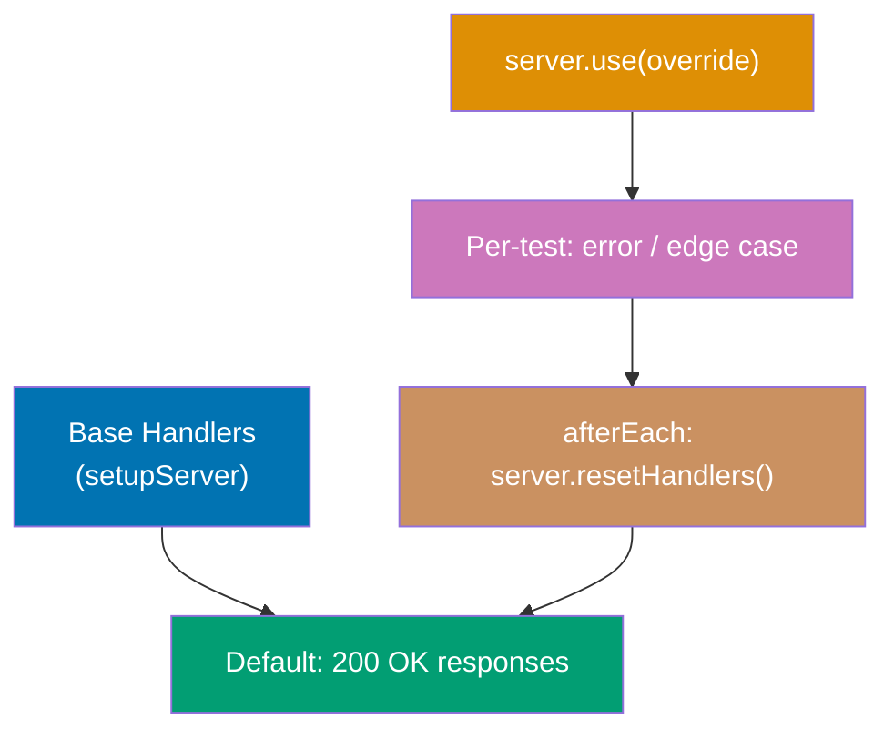
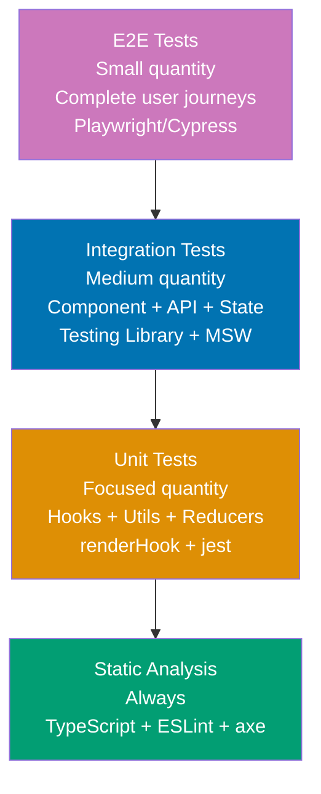

Master expert Testing Library patterns through 25 annotated examples covering production-grade testing strategies, custom query infrastructure, and large-scale testing architecture. Each example is self-contained and demonstrates patterns used in mature React codebases.

## MSW Integration Patterns (Examples 56-60)

### Example 56: MSW Handler Overrides Per Test

MSW's `server.use()` overrides specific handlers for individual tests. This enables testing error states and edge cases without modifying base server configuration.



**Code**:

```typescript
import { render, screen, waitFor } from "@testing-library/react";
import { http, HttpResponse } from "msw";
import { setupServer } from "msw/node";
import React, { useEffect, useState } from "react";

// Base handlers: default success responses
const server = setupServer(
  http.get("/api/products", () => {
    // => Default handler: returns 3 products
    return HttpResponse.json([
      { id: 1, name: "Widget A", price: 10 },
      { id: 2, name: "Widget B", price: 20 },
    ]);
  }),
  http.post("/api/cart", () => {
    // => Default handler: successful cart addition
    return HttpResponse.json({ success: true, cartId: "cart-123" });
  })
);

beforeAll(() => server.listen({ onUnhandledRequest: "error" }));
// => onUnhandledRequest: "error" fails tests that make unhandled requests
// => Catches missing handlers: any real API call fails loudly
afterEach(() => server.resetHandlers());
// => Resets overrides from server.use() after each test
afterAll(() => server.close());

function ProductCatalog() {
  const [products, setProducts] = useState<Array<{id: number; name: string; price: number}>>([]);
  const [error, setError] = useState<string | null>(null);
  const [loading, setLoading] = useState(true);

  useEffect(() => {
    fetch("/api/products")
      .then((r) => {
        if (!r.ok) throw new Error(`Server error: ${r.status}`);
        return r.json() as Promise<Array<{id: number; name: string; price: number}>>;
      })
      .then((data) => { setProducts(data); setLoading(false); })
      .catch((err: Error) => { setError(err.message); setLoading(false); });
  }, []);

  if (loading) return <p>Loading...</p>;
  if (error) return <p role="alert">{error}</p>;
  return <ul>{products.map((p) => <li key={p.id}>{p.name}: ${p.price}</li>)}</ul>;
}

test("renders products from default handler", async () => {
  render(<ProductCatalog />);
  await waitFor(() => {
    expect(screen.getAllByRole("listitem")).toHaveLength(2);
    // => Default handler returns 2 products
  });
  expect(screen.getByText("Widget A: $10")).toBeInTheDocument();
});

test("shows error on server 500 - handler override", async () => {
  server.use(
    http.get("/api/products", () => {
      // => Override: returns 500 for this test only
      // => After test: resetHandlers() restores default
      return new HttpResponse(null, { status: 500 });
    })
  );

  render(<ProductCatalog />);
  await waitFor(() => {
    expect(screen.getByRole("alert")).toHaveTextContent("Server error: 500");
    // => Error state shown when server returns 500
  });
});

test("handles empty product list", async () => {
  server.use(
    http.get("/api/products", () => {
      return HttpResponse.json([]);
      // => Override: empty array response
    })
  );

  render(<ProductCatalog />);
  await waitFor(() => {
    expect(screen.queryAllByRole("listitem")).toHaveLength(0);
    // => No products rendered for empty response
  });
});
```

**Key Takeaway**: Use `server.use()` to override handlers per test for error states and edge cases. The `afterEach(() => server.resetHandlers())` call ensures overrides don't leak between tests.

**Why It Matters**: Production applications need testing across all API response scenarios—success, empty, error, malformed data, and timeouts. Without per-test handler overrides, every error scenario requires a separate server configuration, leading to configuration sprawl. `server.use()` provides surgical override capability: the base handlers represent the happy path, individual test overrides simulate edge cases, and `resetHandlers()` ensures test isolation. This pattern scales from a few tests to hundreds without configuration complexity growth.

---

### Example 57: MSW Network Delay Simulation

Network latency is a real-world condition that exposes timing bugs. MSW can simulate delays to test loading states, race conditions, and timeout handling.

```typescript
import { render, screen, waitFor, waitForElementToBeRemoved } from "@testing-library/react";
import { http, HttpResponse, delay } from "msw";
// => delay: MSW utility for simulating network latency
import { setupServer } from "msw/node";
import React, { useEffect, useState } from "react";

const server = setupServer(
  http.get("/api/slow-data", async () => {
    // => async handler: enables delay simulation
    await delay(500);
    // => Simulates 500ms network latency
    // => delay: returns Promise that resolves after specified ms
    return HttpResponse.json({ content: "Loaded after delay" });
  }),
  http.get("/api/very-slow", async () => {
    await delay(2000);
    // => Simulates very slow response (2 seconds)
    // => Tests timeout handling and user feedback
    return HttpResponse.json({ content: "Finally loaded" });
  })
);

beforeAll(() => server.listen());
afterEach(() => server.resetHandlers());
afterAll(() => server.close());

function SlowLoader() {
  // => Component with visible loading state during delay
  const [data, setData] = useState<string | null>(null);
  const [loading, setLoading] = useState(true);

  useEffect(() => {
    fetch("/api/slow-data")
      .then((r) => r.json() as Promise<{ content: string }>)
      .then((d) => { setData(d.content); setLoading(false); });
  }, []);

  return (
    <div>
      {loading && (
        <div role="progressbar" aria-label="Loading content" aria-busy="true">
          {/* progressbar: communicates loading progress to screen readers */}
          Loading...
        </div>
      )}
      {data && <p>{data}</p>}
    </div>
  );
}

test("loading state visible during network delay", async () => {
  render(<SlowLoader />);

  const loader = screen.getByRole("progressbar", { name: "Loading content" });
  // => Loading state immediately visible
  expect(loader).toBeInTheDocument();
  expect(loader).toHaveAttribute("aria-busy", "true");
  // => aria-busy: communicates active loading to screen readers

  await waitForElementToBeRemoved(loader, { timeout: 2000 });
  // => Waits for loader to disappear (up to 2000ms)
  // => Fails if loader doesn't disappear within timeout

  expect(screen.getByText("Loaded after delay")).toBeInTheDocument();
  // => Content appeared after network delay resolved
  expect(screen.queryByRole("progressbar")).not.toBeInTheDocument();
  // => Loading indicator removed
});

test("delay can be overridden for fast tests", async () => {
  server.use(
    http.get("/api/slow-data", () => {
      // => Override: no delay for this test
      // => Speeds up test suite significantly
      return HttpResponse.json({ content: "Instant response" });
    })
  );

  render(<SlowLoader />);
  await waitFor(() => {
    expect(screen.getByText("Instant response")).toBeInTheDocument();
    // => Resolves immediately without delay
  });
});
```

**Key Takeaway**: Use MSW's `delay()` to simulate realistic network conditions. Override slow handlers with instant responses for test suite speed, while keeping realistic delay tests for loading state verification.

**Why It Matters**: Loading state bugs are invisible in fast development environments where APIs respond instantly. Production users on slow connections experience all loading states prominently—a spinner that persists indefinitely, a loading state that flashes too quickly to read, or a timeout that shows no recovery option are real UX failures. Delay simulation reveals these bugs by making the test environment match real network conditions. The performance optimization (overriding delays for most tests) ensures the test suite stays fast while specific loading state tests maintain realistic timing.

---

### Example 58: MSW for Complex API Workflows

Multi-step API workflows (create → read → update → delete) require stateful MSW handlers that maintain data across requests.

```typescript
import { render, screen, waitFor } from "@testing-library/react";
import userEvent from "@testing-library/user-event";
import { http, HttpResponse } from "msw";
import { setupServer } from "msw/node";
import React, { useEffect, useState } from "react";

// Stateful mock store
let mockItems: Array<{ id: number; name: string }> = [];
let nextId = 1;
// => Module-level state: persists across handler calls within a test
// => Reset in beforeEach to ensure test isolation

const server = setupServer(
  http.get("/api/items", () => {
    return HttpResponse.json(mockItems);
    // => Returns current mock store state
  }),
  http.post("/api/items", async ({ request }) => {
    const body = await request.json() as { name: string };
    // => Parses request body
    const newItem = { id: nextId++, name: body.name };
    // => Creates new item with auto-incrementing ID
    mockItems.push(newItem);
    // => Adds to mock store
    return HttpResponse.json(newItem, { status: 201 });
    // => 201 Created response
  }),
  http.delete("/api/items/:id", ({ params }) => {
    const id = Number(params.id);
    // => Extracts ID from URL parameter
    mockItems = mockItems.filter((item) => item.id !== id);
    // => Removes from mock store
    return new HttpResponse(null, { status: 204 });
    // => 204 No Content: successful deletion
  })
);

beforeAll(() => server.listen());
beforeEach(() => {
  mockItems = [];
  nextId = 1;
  // => Reset state before each test for isolation
});
afterEach(() => server.resetHandlers());
afterAll(() => server.close());

function ItemManager() {
  const [items, setItems] = useState<Array<{ id: number; name: string }>>([]);
  const [inputValue, setInputValue] = useState("");

  const loadItems = () => {
    fetch("/api/items")
      .then((r) => r.json() as Promise<Array<{ id: number; name: string }>>)
      .then(setItems);
  };

  useEffect(() => { loadItems(); }, []);

  const addItem = async () => {
    await fetch("/api/items", {
      method: "POST",
      headers: { "Content-Type": "application/json" },
      body: JSON.stringify({ name: inputValue }),
    });
    loadItems();
    setInputValue("");
  };

  const deleteItem = async (id: number) => {
    await fetch(`/api/items/${id}`, { method: "DELETE" });
    loadItems();
  };

  return (
    <div>
      <input aria-label="Item name" value={inputValue} onChange={(e) => setInputValue(e.target.value)} />
      <button onClick={addItem}>Add Item</button>
      <ul>
        {items.map((item) => (
          <li key={item.id}>
            {item.name}
            <button onClick={() => deleteItem(item.id)} aria-label={`Delete ${item.name}`}>
              Delete
            </button>
          </li>
        ))}
      </ul>
    </div>
  );
}

test("CRUD workflow: add then delete items", async () => {
  const user = userEvent.setup();
  render(<ItemManager />);

  await user.type(screen.getByLabelText("Item name"), "Widget");
  await user.click(screen.getByRole("button", { name: "Add Item" }));
  // => POST /api/items → mock store updated → GET /api/items → re-render

  await waitFor(() => {
    expect(screen.getByText("Widget")).toBeInTheDocument();
    // => Item appeared after add workflow
  });

  await user.click(screen.getByRole("button", { name: "Delete Widget" }));
  // => DELETE /api/items/1 → mock store updated → GET /api/items → re-render

  await waitFor(() => {
    expect(screen.queryByText("Widget")).not.toBeInTheDocument();
    // => Item removed after delete workflow
  });
});
```

**Key Takeaway**: Stateful MSW handlers (module-level data store) simulate real API data persistence, enabling CRUD workflow testing. Reset state in `beforeEach` for test isolation.

**Why It Matters**: CRUD workflows are the backbone of business applications—most features are some variation of create, read, update, delete. Testing these workflows requires an API that maintains state across multiple requests, which `jest.fn()` mocks can't simulate and real APIs make tests non-deterministic. Stateful MSW handlers provide the perfect middle ground: realistic HTTP semantics (correct status codes, response shapes) with full test control (known initial state, deterministic responses). Testing the complete CRUD cycle catches bugs at the integration seam between frontend state management and API communication.

---

### Example 59: MSW WebSocket Mocking

Real-time features use WebSockets. MSW supports WebSocket interception for testing real-time update components.

```typescript
import { render, screen, waitFor } from "@testing-library/react";
import { ws } from "msw";
// => ws: WebSocket handler builder (MSW v2+)
import { setupServer } from "msw/node";
import React, { useEffect, useState } from "react";

const chatServer = ws.link("wss://chat.example.com");
// => ws.link: creates WebSocket handler for specific URL

const server = setupServer(
  chatServer.addEventListener("connection", ({ client }) => {
    // => Intercepts new WebSocket connections
    // => client: represents the browser-side WebSocket
    client.send(JSON.stringify({ type: "welcome", message: "Connected to chat" }));
    // => Sends welcome message on connection
  })
);

beforeAll(() => server.listen());
afterEach(() => server.resetHandlers());
afterAll(() => server.close());

function ChatComponent() {
  // => Component using WebSocket for real-time updates
  const [messages, setMessages] = useState<string[]>([]);
  const [status, setStatus] = useState("Disconnected");

  useEffect(() => {
    const socket = new WebSocket("wss://chat.example.com");
    // => Creates WebSocket: MSW intercepts the connection

    socket.onopen = () => setStatus("Connected");
    // => onopen: fires when WebSocket connection established

    socket.onmessage = (event: MessageEvent<string>) => {
      const data = JSON.parse(event.data) as { type: string; message: string };
      // => Parses incoming JSON messages
      setMessages((prev) => [...prev, data.message]);
      // => Adds message to list
    };

    socket.onerror = () => setStatus("Error");
    // => onerror: fires on connection failure

    return () => socket.close();
    // => Cleanup: close WebSocket on unmount
  }, []);

  return (
    <div>
      <p role="status">Status: {status}</p>
      <ul>
        {messages.map((msg, i) => (
          <li key={i}>{msg}</li>
        ))}
      </ul>
    </div>
  );
}

test("WebSocket connection receives welcome message", async () => {
  render(<ChatComponent />);
  // => Component mounts, WebSocket connection initiated
  // => MSW intercepts, sends welcome message

  await waitFor(() => {
    expect(screen.getByRole("status")).toHaveTextContent("Status: Connected");
    // => onopen fired: status updated to Connected
  });

  await waitFor(() => {
    expect(screen.getAllByRole("listitem")).toHaveLength(1);
    // => Welcome message received and rendered
  });
  expect(screen.getByText("Connected to chat")).toBeInTheDocument();
  // => Welcome message content correct
});

test("WebSocket server push simulates incoming messages", async () => {
  render(<ChatComponent />);

  await waitFor(() => {
    expect(screen.getByText("Connected to chat")).toBeInTheDocument();
    // => Wait for initial connection
  });

  // Simulate server pushing a message to the client
  chatServer.addEventListener("connection", ({ client }) => {
    client.send(JSON.stringify({ type: "message", message: "Hello from server" }));
    // => Push message after initial welcome
  });

  await waitFor(() => {
    const items = screen.getAllByRole("listitem");
    expect(items.length).toBeGreaterThan(1);
    // => Additional messages arrived
  });
});
```

**Key Takeaway**: MSW's `ws` handler intercepts WebSocket connections, enabling testing of real-time UI without a real WebSocket server. Test both connection establishment and message handling.

**Why It Matters**: WebSocket testing was historically one of the hardest problems in frontend testing—no good mocking solution existed, forcing teams to either skip testing real-time features or build complex custom mock servers. MSW's WebSocket support brings the same interceptor pattern used for HTTP to WebSockets, making real-time feature testing as straightforward as REST API testing. Testing WebSocket components validates the complete real-time interaction: connection lifecycle, message parsing, state updates, and error handling—all without infrastructure dependencies.

---

### Example 60: MSW Request Assertions

Verifying that components send correct requests (correct URL, method, headers, body) is as important as verifying responses are handled correctly.

```typescript
import { render, screen, waitFor } from "@testing-library/react";
import userEvent from "@testing-library/user-event";
import { http, HttpResponse } from "msw";
import { setupServer } from "msw/node";
import React, { useState } from "react";

let capturedRequests: Request[] = [];
// => Captures requests for assertion
// => Module-level to persist across handler calls

const server = setupServer(
  http.post("/api/contact", async ({ request }) => {
    capturedRequests.push(request.clone());
    // => clone(): request body can only be read once
    // => Clone before reading to allow multiple reads
    return HttpResponse.json({ success: true });
  })
);

beforeAll(() => server.listen());
beforeEach(() => {
  capturedRequests = [];
  // => Reset before each test
});
afterEach(() => server.resetHandlers());
afterAll(() => server.close());

function ContactForm() {
  const [sent, setSent] = useState(false);

  const handleSubmit = async (e: React.FormEvent<HTMLFormElement>) => {
    e.preventDefault();
    const formData = new FormData(e.currentTarget);
    await fetch("/api/contact", {
      method: "POST",
      headers: {
        "Content-Type": "application/json",
        "X-Client-Version": "1.0.0",
        // => Custom header: included in every request
      },
      body: JSON.stringify({
        name: String(formData.get("name") ?? ""),
        email: String(formData.get("email") ?? ""),
        message: String(formData.get("message") ?? ""),
      }),
    });
    setSent(true);
  };

  if (sent) return <p>Message sent!</p>;
  return (
    <form onSubmit={handleSubmit}>
      <input name="name" aria-label="Name" defaultValue="Alice" />
      <input name="email" aria-label="Email" defaultValue="alice@example.com" />
      <textarea name="message" aria-label="Message" defaultValue="Hello!" />
      <button type="submit">Send</button>
    </form>
  );
}

test("form sends correct request structure", async () => {
  const user = userEvent.setup();
  render(<ContactForm />);

  await user.click(screen.getByRole("button", { name: "Send" }));
  // => Submits form with default values

  await waitFor(() => {
    expect(capturedRequests).toHaveLength(1);
    // => Exactly one request made
  });

  const request = capturedRequests[0];
  // => Get the captured request

  expect(request.method).toBe("POST");
  // => Correct HTTP method

  expect(request.headers.get("Content-Type")).toBe("application/json");
  // => Correct content type header

  expect(request.headers.get("X-Client-Version")).toBe("1.0.0");
  // => Custom header included

  const body = await request.json() as { name: string; email: string; message: string };
  // => Parse request body for assertion
  expect(body).toEqual({
    name: "Alice",
    email: "alice@example.com",
    message: "Hello!",
    // => All form fields included with correct values
  });

  expect(screen.getByText("Message sent!")).toBeInTheDocument();
  // => UI updated after successful submission
});
```

**Key Takeaway**: Capture requests in MSW handlers for assertion. Verify method, headers, and body structure to ensure components send correctly formatted API requests.

**Why It Matters**: Response handling testing (does the component show the right UI?) is only half of API integration testing. Request correctness testing (does the component send the right data?) is equally important and frequently omitted. Missing fields, wrong field names, incorrect serialization, and missing authentication headers are all request-side bugs that don't surface in response handling tests. MSW request capture provides the simplest way to assert on outgoing requests without mocking `fetch` directly, maintaining the realistic network-level testing that MSW is designed for.

---

## Custom Queries and Testing Infrastructure (Examples 61-64)

### Example 61: Building Custom Query Functions

Custom queries extend Testing Library with domain-specific element finders. They encapsulate complex selection logic into reusable, readable query functions.

```typescript
import { render, screen, queryHelpers, buildQueries } from "@testing-library/react";
// => queryHelpers: utilities for building custom queries
// => buildQueries: creates the full getBy/queryBy/findBy/getAllBy/queryAllBy/findAllBy family

// Custom query: finds elements by their data-icon attribute
const queryAllByIcon = (container: HTMLElement, iconName: string): HTMLElement[] => {
  // => container: DOM node to search within
  // => iconName: the icon name to find
  return Array.from(
    container.querySelectorAll(`[data-icon="${iconName}"]`)
    // => querySelectorAll: finds all elements with matching data-icon
  ) as HTMLElement[];
};

const getMultipleError = (container: HTMLElement, iconName: string) =>
  `Found multiple elements with icon: ${iconName}`;
// => Error message when multiple elements found (for getByIcon)

const getMissingError = (container: HTMLElement, iconName: string) =>
  `Unable to find element with icon: ${iconName}`;
// => Error message when no elements found (for getByIcon)

const [
  queryByIcon,
  getAllByIcon,
  getByIcon,
  findAllByIcon,
  findByIcon,
] = buildQueries(queryAllByIcon, getMultipleError, getMissingError);
// => buildQueries: generates all query variants from queryAll base function
// => Returns: queryBy, getAllBy, getBy, findAllBy, findBy

// Extend screen with custom queries
const customScreen = {
  ...screen,
  // => Spread screen: includes all standard queries
  getByIcon: (iconName: string) => getByIcon(document.body, iconName),
  // => Binds to document.body like standard screen queries
  queryByIcon: (iconName: string) => queryByIcon(document.body, iconName),
  getAllByIcon: (iconName: string) => getAllByIcon(document.body, iconName),
};

function IconButton({ icon, label }: { icon: string; label: string }) {
  // => Button with data-icon attribute for custom querying
  return (
    <button aria-label={label}>
      <span data-icon={icon} aria-hidden="true" />
      {/* data-icon: custom attribute for icon identification */}
      {/* aria-hidden: icon is decorative (label on button provides name) */}
      {label}
    </button>
  );
}

test("custom query finds elements by icon", () => {
  render(
    <div>
      <IconButton icon="save" label="Save document" />
      <IconButton icon="delete" label="Delete item" />
      <IconButton icon="edit" label="Edit content" />
    </div>
  );

  const saveIcon = customScreen.getByIcon("save");
  // => Custom query: finds element with data-icon="save"
  // => saveIcon: <span data-icon="save">
  expect(saveIcon).toBeInTheDocument();

  const editIcon = customScreen.getByIcon("edit");
  expect(editIcon).toHaveAttribute("data-icon", "edit");
  // => Custom attribute correctly set

  expect(customScreen.queryByIcon("nonexistent")).toBeNull();
  // => queryByIcon: returns null for missing icon (not throws)

  const allIcons = customScreen.getAllByIcon("save");
  // => getAllByIcon: would return array if multiple match
  expect(allIcons).toHaveLength(1);
  // => Only one save icon
});
```

**Key Takeaway**: Build custom queries with `buildQueries()` for domain-specific element selection. Extend `screen` with bound versions to match the standard Testing Library API.

**Why It Matters**: As applications grow, teams develop component patterns that don't map cleanly to standard queries. Icon components, custom data attributes, and domain-specific patterns (`getByDataCy`, `getByTestLocator`) appear in every large codebase. Custom queries encapsulate these patterns in one place instead of duplicating `querySelectorAll` calls across test files. Using `buildQueries()` generates all six query variants (get, query, find, getAll, queryAll, findAll) from a single implementation, providing consistent behavior and error messages that match Testing Library's patterns.

---

### Example 62: Testing Drag-and-Drop Interactions

Drag-and-drop requires simulating complex pointer event sequences. Testing Library's `userEvent` with pointer API enables realistic drag simulation.

```typescript
import { render, screen } from "@testing-library/react";
import userEvent from "@testing-library/user-event";
import { useState } from "react";

function DragDropList() {
  // => Simplified drag-and-drop list
  const [items, setItems] = useState(["Item A", "Item B", "Item C"]);
  const [dragging, setDragging] = useState<string | null>(null);

  const handleDragStart = (item: string) => (e: React.DragEvent) => {
    setDragging(item);
    e.dataTransfer.setData("text/plain", item);
    // => setData: stores drag payload
  };

  const handleDrop = (targetItem: string) => (e: React.DragEvent) => {
    e.preventDefault();
    if (!dragging || dragging === targetItem) return;
    // => Prevents dropping on itself

    const newItems = [...items];
    const fromIndex = items.indexOf(dragging);
    const toIndex = items.indexOf(targetItem);
    // => Calculate source and destination indices

    newItems.splice(fromIndex, 1);
    // => Remove from original position
    newItems.splice(toIndex, 0, dragging);
    // => Insert at new position

    setItems(newItems);
    setDragging(null);
  };

  return (
    <ul>
      {items.map((item) => (
        <li
          key={item}
          draggable
          // => draggable: enables HTML5 drag-and-drop API
          onDragStart={handleDragStart(item)}
          onDragOver={(e) => e.preventDefault()}
          // => onDragOver: must call preventDefault to allow drop
          onDrop={handleDrop(item)}
          data-testid={`item-${item.replace(" ", "-")}`}
          style={{ opacity: dragging === item ? 0.5 : 1 }}
          // => Visual feedback: dragged item becomes semi-transparent
        >
          {item}
        </li>
      ))}
    </ul>
  );
}

test("drag and drop reorders items via dataTransfer", async () => {
  render(<DragDropList />);

  const listItems = screen.getAllByRole("listitem");
  expect(listItems.map((li) => li.textContent)).toEqual(["Item A", "Item B", "Item C"]);
  // => Initial order verified

  const itemA = screen.getByTestId("item-Item-A");
  const itemC = screen.getByTestId("item-Item-C");

  // Simulate drag using fireEvent for HTML5 drag API
  const { fireEvent } = await import("@testing-library/react");
  // => fireEvent: lower-level event dispatcher for HTML5 drag events
  // => userEvent doesn't support HTML5 drag-and-drop directly

  fireEvent.dragStart(itemA, {
    dataTransfer: { setData: jest.fn(), getData: jest.fn(() => "Item A") },
    // => Mock dataTransfer: HTML5 drag API object
  });
  // => Simulates drag start on Item A

  fireEvent.dragOver(itemC, { preventDefault: jest.fn() });
  // => Simulates drag over Item C

  fireEvent.drop(itemC, {
    dataTransfer: { getData: jest.fn(() => "Item A") },
    // => Mock getData: returns dragged item name
  });
  // => Simulates drop on Item C

  const reorderedItems = screen.getAllByRole("listitem");
  // => Check new order after drop
  expect(reorderedItems[0]).toHaveTextContent("Item B");
  expect(reorderedItems[1]).toHaveTextContent("Item A");
  expect(reorderedItems[2]).toHaveTextContent("Item C");
  // => Item A moved to position 2 (after B, before C)
});
```

**Key Takeaway**: HTML5 drag-and-drop requires `fireEvent` with `dataTransfer` mocks. Use `fireEvent.dragStart`, `dragOver`, and `drop` in sequence to simulate drag-and-drop operations.

**Why It Matters**: Drag-and-drop is a power user feature that significantly improves productivity for list management, kanban boards, and file uploads. Testing it is challenging because the HTML5 drag API uses `dataTransfer` objects that don't exist in jsdom. Using `fireEvent` with mocked `dataTransfer` provides just enough simulation to test the drop logic and state management, even though it doesn't fully replicate all pointer events. For full drag-and-drop fidelity (including pointer capture and visual feedback), E2E tests with Playwright are necessary—component tests verify the business logic while E2E tests verify the UX.

---

### Example 63: Testing Virtualized Lists

Virtualized lists render only visible items for performance. Testing them requires understanding that off-screen items aren't in the DOM and using scrolling simulation.

```typescript
import { render, screen } from "@testing-library/react";
import { useState, useCallback } from "react";

interface VirtualizedListProps {
  items: string[];
  itemHeight: number;
  visibleCount: number;
}

function VirtualizedList({ items, itemHeight, visibleCount }: VirtualizedListProps) {
  // => Simplified virtualization: only renders visible window
  const [scrollTop, setScrollTop] = useState(0);
  // => scrollTop: tracks scroll position

  const startIndex = Math.floor(scrollTop / itemHeight);
  // => Calculates first visible item index
  const endIndex = Math.min(startIndex + visibleCount, items.length);
  // => Calculates last visible item index
  const visibleItems = items.slice(startIndex, endIndex);
  // => Only visible items: startIndex to endIndex

  const totalHeight = items.length * itemHeight;
  // => Total height for scroll container

  const handleScroll = useCallback((e: React.UIEvent<HTMLDivElement>) => {
    setScrollTop((e.target as HTMLDivElement).scrollTop);
    // => Updates visible window when user scrolls
  }, []);

  return (
    <div
      style={{ height: visibleCount * itemHeight, overflow: "auto" }}
      // => Container: fixed height with scroll
      onScroll={handleScroll}
      role="list"
      aria-label="Virtualized item list"
    >
      <div style={{ height: totalHeight, position: "relative" }}>
        {/* Inner div: full height for correct scroll bar */}
        {visibleItems.map((item, index) => (
          <div
            key={startIndex + index}
            role="listitem"
            style={{
              position: "absolute",
              top: (startIndex + index) * itemHeight,
              // => Absolute positioning within scroll container
              height: itemHeight,
            }}
          >
            {item}
          </div>
        ))}
      </div>
    </div>
  );
}

test("virtualized list renders only visible items", () => {
  const items = Array.from({ length: 1000 }, (_, i) => `Item ${i + 1}`);
  // => 1000 items: too many to render all at once

  render(
    <VirtualizedList
      items={items}
      itemHeight={40}
      // => Each item: 40px tall
      visibleCount={5}
      // => Shows 5 items at a time
    />
  );

  const listItems = screen.getAllByRole("listitem");
  // => getAllByRole: only finds rendered items (not all 1000)
  expect(listItems).toHaveLength(5);
  // => Only 5 items rendered: virtualization working

  expect(listItems[0]).toHaveTextContent("Item 1");
  // => First visible item is Item 1 (scroll position 0)
  expect(listItems[4]).toHaveTextContent("Item 5");
  // => Fifth visible item is Item 5

  expect(screen.queryByText("Item 100")).not.toBeInTheDocument();
  // => Item 100 is NOT in DOM: virtualization prevents rendering
  // => This is the key difference from non-virtualized lists
});

test("virtualized list shows different items after scroll", () => {
  const items = Array.from({ length: 100 }, (_, i) => `Item ${i + 1}`);
  const { container } = render(
    <VirtualizedList items={items} itemHeight={40} visibleCount={5} />
  );

  const scrollContainer = container.querySelector("[role=list]") as HTMLElement;
  // => Direct DOM access for scroll container

  Object.defineProperty(scrollContainer, "scrollTop", {
    writable: true,
    value: 400,
    // => Simulates scroll to 400px (item 10-14 visible)
  });
  scrollContainer.dispatchEvent(new Event("scroll"));
  // => Triggers scroll handler to recalculate visible items

  const listItems = screen.getAllByRole("listitem");
  // => After scroll: different items rendered
  expect(listItems[0]).toHaveTextContent("Item 11");
  // => First visible item changed after scroll
});
```

**Key Takeaway**: Virtualized lists only render visible items—test that non-visible items are absent from the DOM and that scrolling changes which items render.

**Why It Matters**: Virtualization is a critical performance optimization for lists of thousands of items—rendering all items would freeze the browser. Testing virtualization correctness ensures the windowing logic works (correct items visible, correct total height for scroll), but more importantly, it sets the expectation in tests that off-screen items don't exist in the DOM. Tests that assume all list items are queryable will fail with virtualized lists, requiring understanding of this constraint. This example demonstrates both the test adaptation needed (expect limited items) and the scroll simulation needed to test dynamic windowing.

---

### Example 64: Custom Render Utilities for Large Codebases

At scale, custom render utilities evolve into full test infrastructure layers. Building a composable render system prevents duplication and enforces team standards.

```typescript
import { render, RenderOptions, RenderResult } from "@testing-library/react";
import { MemoryRouter } from "react-router-dom";
import { createContext, useContext, ReactNode } from "react";

// Application contexts
const ThemeContext = createContext({ theme: "light" });
const AuthContext = createContext<{ userId: string | null; role: string }>({
  userId: null,
  role: "guest",
});
const FeatureFlagContext = createContext<{ flags: Record<string, boolean> }>({
  flags: {},
});

// Provider composition utility
function AllProviders({
  children,
  theme = "light",
  userId = null,
  role = "user",
  flags = {},
  initialRoute = "/",
}: {
  children: ReactNode;
  theme?: string;
  userId?: string | null;
  role?: string;
  flags?: Record<string, boolean>;
  initialRoute?: string;
}) {
  // => Composes all application providers into single wrapper
  // => Single wrapper: all tests use same provider hierarchy
  return (
    <MemoryRouter initialEntries={[initialRoute]}>
      {/* Router: must be outermost for Link/useNavigate to work */}
      <ThemeContext.Provider value={{ theme }}>
        <AuthContext.Provider value={{ userId, role }}>
          <FeatureFlagContext.Provider value={{ flags }}>
            {children}
          </FeatureFlagContext.Provider>
        </AuthContext.Provider>
      </ThemeContext.Provider>
    </MemoryRouter>
  );
}

// Extended options type
interface CustomRenderOptions extends Omit<RenderOptions, "wrapper"> {
  theme?: string;
  userId?: string | null;
  role?: string;
  flags?: Record<string, boolean>;
  initialRoute?: string;
}

// Custom render function
function customRender(
  ui: React.ReactElement,
  options: CustomRenderOptions = {}
): RenderResult {
  // => Destructures custom options from render options
  const { theme, userId, role, flags, initialRoute, ...renderOptions } = options;

  return render(ui, {
    wrapper: ({ children }) => (
      <AllProviders
        theme={theme}
        userId={userId}
        role={role}
        flags={flags}
        initialRoute={initialRoute}
      >
        {children}
      </AllProviders>
    ),
    // => wrapper: function component wrapping test UI
    ...renderOptions,
  });
}

// Example component using all contexts
function AdminPanel() {
  const { theme } = useContext(ThemeContext);
  const { userId, role } = useContext(AuthContext);
  const { flags } = useContext(FeatureFlagContext);

  if (role !== "admin") return <p>Access denied</p>;
  return (
    <div data-theme={theme}>
      <h1>Admin Panel</h1>
      <p>User: {userId}</p>
      {flags["new-dashboard"] && <p>New Dashboard Feature</p>}
    </div>
  );
}

test("renders admin panel for admin user", () => {
  customRender(<AdminPanel />, {
    userId: "admin-123",
    role: "admin",
    theme: "dark",
    flags: { "new-dashboard": true },
    // => All context values configured via options
  });

  expect(screen.getByRole("heading", { name: "Admin Panel" })).toBeInTheDocument();
  // => Admin sees panel content
  expect(screen.getByText("User: admin-123")).toBeInTheDocument();
  // => userId from AuthContext
  expect(screen.getByText("New Dashboard Feature")).toBeInTheDocument();
  // => Feature flag enabled
});

test("shows access denied for non-admin user", () => {
  customRender(<AdminPanel />, { role: "user" });
  // => Default guest role
  expect(screen.getByText("Access denied")).toBeInTheDocument();
  // => Role-based access control working
});

// Export for use across test files
export { customRender as render };
// => Export as 'render': replaces @testing-library/react render in test files
// => Import { render } from '../test-utils' instead of @testing-library/react
```

**Key Takeaway**: Build composable custom render utilities that accept context configuration as options. Export as `render` from a `test-utils` file so test files import from your utility, not directly from Testing Library.

**Why It Matters**: At scale (50+ components, multiple teams), test infrastructure inconsistency becomes a maintenance burden. Each team having a different way to set up providers, different default context values, and different utility functions means bugs from context mismatches and high onboarding costs for new team members. A shared `test-utils.tsx` with a well-documented custom render function standardizes test setup across the codebase. The pattern of exporting `render` (shadowing Testing Library's) means test files remain clean and don't expose implementation details of how providers are configured.

---

## Scale and CI Integration (Examples 65-70)

### Example 65: Test Data Builders

Test data builders create realistic, flexible test data without brittle hardcoded values. They make tests readable and resilient to data shape changes.

```typescript
import { render, screen } from "@testing-library/react";

// Interfaces
interface User {
  id: string;
  name: string;
  email: string;
  role: "admin" | "user" | "guest";
  active: boolean;
  createdAt: string;
}

interface Product {
  id: string;
  name: string;
  price: number;
  stock: number;
  category: string;
}

// Builder pattern
function buildUser(overrides: Partial<User> = {}): User {
  // => Factory function: creates complete User with sensible defaults
  // => overrides: Partial<User> allows changing any field
  return {
    id: "user-1",
    name: "Test User",
    email: "test@example.com",
    role: "user",
    active: true,
    createdAt: "2026-01-01T00:00:00Z",
    ...overrides,
    // => Spread at end: overrides take precedence over defaults
  };
}

function buildProduct(overrides: Partial<Product> = {}): Product {
  // => Factory for Product test data
  return {
    id: "product-1",
    name: "Test Product",
    price: 29.99,
    stock: 100,
    category: "general",
    ...overrides,
  };
}

// Components under test
function UserProfile({ user }: { user: User }) {
  return (
    <div>
      <h2>{user.name}</h2>
      <p>{user.email}</p>
      <span>{user.role}</span>
      {!user.active && <span role="status">Account inactive</span>}
    </div>
  );
}

function ProductCard({ product }: { product: Product }) {
  return (
    <div>
      <h3>{product.name}</h3>
      <p>${product.price.toFixed(2)}</p>
      {product.stock === 0 && <span>Out of stock</span>}
    </div>
  );
}

test("builder creates default user data", () => {
  const user = buildUser();
  // => Default user: all fields filled with sensible values
  render(<UserProfile user={user} />);

  expect(screen.getByText("Test User")).toBeInTheDocument();
  // => Default name used
  expect(screen.queryByRole("status")).not.toBeInTheDocument();
  // => Active user: no inactive warning
});

test("builder with overrides tests specific scenarios", () => {
  const inactiveAdmin = buildUser({
    name: "Alice Admin",
    role: "admin",
    active: false,
    // => Override only relevant fields for this test
  });
  // => inactiveAdmin: id, email, createdAt use defaults; name, role, active overridden

  render(<UserProfile user={inactiveAdmin} />);

  expect(screen.getByText("Alice Admin")).toBeInTheDocument();
  expect(screen.getByText("admin")).toBeInTheDocument();
  expect(screen.getByRole("status")).toHaveTextContent("Account inactive");
  // => Only testing what's unique to this scenario
});

test("out-of-stock product shows warning", () => {
  const outOfStock = buildProduct({ stock: 0, name: "Sold Out Widget" });
  // => Only override stock and name: other fields use defaults

  render(<ProductCard product={outOfStock} />);
  expect(screen.getByText("Out of stock")).toBeInTheDocument();
  expect(screen.getByText("Sold Out Widget")).toBeInTheDocument();
});
```

**Key Takeaway**: Test data builders with `Partial<T>` overrides create complete test objects with minimal per-test configuration. Override only the fields relevant to each test scenario.

**Why It Matters**: Hardcoded test data creates fragile tests—when a component's data type gains a required field, every test with hardcoded data breaks, requiring mass updates. Test data builders centralize data creation, making type changes require only one update. The `Partial<T>` override pattern enforces that every test object is complete and valid (TypeScript catches missing required fields in the builder) while minimizing per-test boilerplate. Well-named builders (`buildUser({ role: 'admin', active: false })`) make test intent clear without comments, serving as living documentation of the data scenarios the component handles.

---

### Example 66: Snapshot Testing with Caution

Snapshot tests capture component output and fail when it changes. Used carefully, they catch unexpected rendering changes; used carelessly, they become noise.

```typescript
import { render } from "@testing-library/react";

function Badge({ variant, children }: {
  variant: "success" | "warning" | "error";
  children: string;
}) {
  // => Simple presentational component: good candidate for snapshot
  const colors = {
    success: "badge-green",
    warning: "badge-yellow",
    error: "badge-red",
  };
  return (
    <span
      className={`badge ${colors[variant]}`}
      role="status"
      aria-label={`${variant} status: ${children}`}
    >
      {children}
    </span>
  );
}

test("Badge snapshot - success variant", () => {
  const { container } = render(<Badge variant="success">Completed</Badge>);
  // => container: rendered HTML element

  expect(container.firstChild).toMatchSnapshot();
  // => toMatchSnapshot: creates/compares snapshot file
  // => First run: creates snapshot in __snapshots__ directory
  // => Subsequent runs: compares against saved snapshot
  // => Fails if any rendering detail changes
});

// IMPORTANT: Snapshot tests are brittle for complex components
// Better approach: test behavior, not structure
test("Badge renders correct accessible attributes", () => {
  const { getByRole } = render(<Badge variant="error">Failed</Badge>);
  // => Behavioral test: more durable than snapshot
  const badge = getByRole("status");
  // => role="status": verified by role query

  expect(badge).toHaveTextContent("Failed");
  // => Content is correct
  expect(badge).toHaveAttribute("aria-label", "error status: Failed");
  // => Accessible label correct
  expect(badge).toHaveClass("badge-red");
  // => Correct visual variant class applied
});
```

**Key Takeaway**: Use snapshots for simple, stable presentational components where structure matters (design system atoms). Prefer behavioral tests for interactive components where structure may change but behavior should remain stable.

**Why It Matters**: Snapshot tests have a high false-positive rate—any insignificant rendering change (whitespace, class reorder, className update) fails the snapshot, requiring manual review of diffs to find real regressions among the noise. Teams that use snapshots for all components spend significant time updating snapshots for non-breaking changes, desensitizing them to real failures. The selective approach—snapshots for genuinely structural components (icon sets, design tokens), behavioral tests for everything else—maintains snapshot signal-to-noise ratio while preserving the value of catching accidental structural changes in components where structure is the contract.

---

### Example 67: Testing with Real Timers vs Fake Timers

`setTimeout`, `setInterval`, and `Date.now()` in components require careful timer control in tests. Fake timers eliminate test slowness from real delays.

```typescript
import { render, screen, act } from "@testing-library/react";
import { useState, useEffect } from "react";

function Countdown({ seconds }: { seconds: number }) {
  // => Countdown timer that decrements every second
  const [remaining, setRemaining] = useState(seconds);

  useEffect(() => {
    if (remaining <= 0) return;
    const timer = setInterval(() => {
      setRemaining((prev) => {
        if (prev <= 1) clearInterval(timer);
        return Math.max(0, prev - 1);
      });
    }, 1000);
    return () => clearInterval(timer);
    // => Cleanup: stop interval on unmount or remaining = 0
  }, []);

  return (
    <div>
      {remaining > 0 ? (
        <p role="timer" aria-live="polite">{remaining} seconds remaining</p>
      ) : (
        <p role="alert">Time&apos;s up!</p>
      )}
    </div>
  );
}

test("countdown decrements with fake timers", () => {
  jest.useFakeTimers();
  // => Replaces real timers with controlled fake timers
  // => setInterval, setTimeout, Date.now all under test control
  // => Test runs instantly: no real waiting

  render(<Countdown seconds={3} />);

  expect(screen.getByRole("timer")).toHaveTextContent("3 seconds remaining");
  // => Initial state: 3 seconds

  act(() => {
    jest.advanceTimersByTime(1000);
    // => Fast-forwards fake time by 1000ms
    // => setInterval fires once, state updates
  });
  expect(screen.getByRole("timer")).toHaveTextContent("2 seconds remaining");
  // => After 1 fake second: 2 remaining

  act(() => {
    jest.advanceTimersByTime(2000);
    // => Fast-forwards 2 more seconds
    // => setInterval fires twice more
  });
  expect(screen.getByRole("alert")).toHaveTextContent("Time's up!");
  // => Timer expired: "Time's up!" shown
  expect(screen.queryByRole("timer")).not.toBeInTheDocument();
  // => Countdown display replaced by expired message

  jest.useRealTimers();
  // => Restores real timers after test
  // => REQUIRED: fake timers affect all subsequent tests if not restored
});
```

**Key Takeaway**: Use `jest.useFakeTimers()` to test time-dependent components instantly. Always restore real timers with `jest.useRealTimers()` after tests. Wrap timer advances in `act()` to process state updates.

**Why It Matters**: Real timer tests make test suites slow—a 30-second countdown with real timers takes 30 seconds to test. Multiplied across a suite with dozens of time-dependent components, real timers add minutes to CI runtime. Fake timers solve this entirely: tests run in milliseconds regardless of the timer duration. The `jest.advanceTimersByTime()` API gives precise control over time progression, enabling tests that verify exactly which callbacks fire at which points in time—precision that's impossible with real timers. The `act()` wrapper ensures React processes all state updates triggered by timer callbacks before assertions.

---

### Example 68: Parallel Test Organization for Large Suites

Organizing tests by concern reduces coupling and improves parallelization. Understanding Testing Library patterns for large codebases prevents common scaling issues.

```typescript
import { render, screen } from "@testing-library/react";
import userEvent from "@testing-library/user-event";

// Component with multiple independent concerns
function UserDashboard({
  userId,
  notifications,
  onLogout,
}: {
  userId: string;
  notifications: Array<{ id: string; message: string }>;
  onLogout: () => void;
}) {
  return (
    <div>
      <header>
        <p>Welcome, {userId}</p>
        <button onClick={onLogout}>Logout</button>
      </header>
      <section aria-label="Notifications">
        <h2>Notifications</h2>
        {notifications.length === 0 ? (
          <p>No new notifications</p>
        ) : (
          <ul>
            {notifications.map((n) => (
              <li key={n.id}>{n.message}</li>
            ))}
          </ul>
        )}
      </section>
    </div>
  );
}

// Organized by concern: each describe block tests one aspect
describe("UserDashboard - User Identity", () => {
  // => Groups tests for user identification behavior
  test("displays userId in welcome message", () => {
    render(
      <UserDashboard userId="alice-42" notifications={[]} onLogout={jest.fn()} />
    );
    expect(screen.getByText("Welcome, alice-42")).toBeInTheDocument();
    // => Verifies userId rendering
  });
});

describe("UserDashboard - Logout", () => {
  // => Groups tests for logout functionality
  test("calls onLogout when logout button clicked", async () => {
    const onLogout = jest.fn();
    // => jest.fn(): creates mock function for assertion
    const user = userEvent.setup();
    render(
      <UserDashboard userId="alice" notifications={[]} onLogout={onLogout} />
    );

    await user.click(screen.getByRole("button", { name: "Logout" }));
    // => Clicks logout button

    expect(onLogout).toHaveBeenCalledTimes(1);
    // => toHaveBeenCalledTimes: verifies mock called exactly once
    // => Confirms logout handler invoked correctly
  });
});

describe("UserDashboard - Notifications", () => {
  // => Groups tests for notification display behavior
  test("shows empty state when no notifications", () => {
    render(
      <UserDashboard userId="alice" notifications={[]} onLogout={jest.fn()} />
    );
    expect(screen.getByText("No new notifications")).toBeInTheDocument();
  });

  test("renders notification list with all messages", () => {
    const notifications = [
      { id: "1", message: "System update available" },
      { id: "2", message: "Your report is ready" },
    ];
    render(
      <UserDashboard userId="alice" notifications={notifications} onLogout={jest.fn()} />
    );

    expect(screen.getAllByRole("listitem")).toHaveLength(2);
    expect(screen.getByText("System update available")).toBeInTheDocument();
    expect(screen.getByText("Your report is ready")).toBeInTheDocument();
    // => All notifications rendered
  });
});
```

**Key Takeaway**: Organize tests with `describe` blocks by concern. One assertion per test (or tightly related assertions) makes failures precise and tests parallelizable without shared state.

**Why It Matters**: Test organization at scale determines how quickly teams can find, understand, and fix test failures. A single 200-line test file with 40 assertions produces "UserDashboard test" failures that require reading the entire test to diagnose. `describe` blocks by concern produce "UserDashboard - Notifications > renders notification list" failures that pinpoint the exact broken behavior. Jest runs `describe` blocks independently, enabling parallel execution across CPU cores—well-organized test files maximize this parallelization. Teams that invest in test organization early save significant debugging time as the codebase grows.

---

### Example 69: Internationalization (i18n) Testing

Components that display translated text need testing across multiple locales. Testing i18n verifies that translations are applied correctly and that layout handles different text lengths.

```typescript
import { render, screen } from "@testing-library/react";
import { createContext, useContext, ReactNode } from "react";

// Simple i18n implementation
const translations = {
  en: {
    greeting: "Hello",
    logout: "Logout",
    items: (count: number) => `${count} item${count !== 1 ? "s" : ""}`,
  },
  id: {
    greeting: "Halo",
    logout: "Keluar",
    items: (count: number) => `${count} item`,
    // => Indonesian: no plural distinction
  },
  ar: {
    greeting: "مرحبا",
    // => Arabic greeting
    logout: "تسجيل الخروج",
    items: (count: number) => `${count} عنصر`,
    // => Arabic: "item" with count
  },
} as const;

type Locale = keyof typeof translations;

const I18nContext = createContext<{ t: typeof translations.en; locale: Locale }>({
  t: translations.en,
  locale: "en",
});

function I18nProvider({ children, locale }: { children: ReactNode; locale: Locale }) {
  return (
    <I18nContext.Provider value={{ t: translations[locale], locale }}>
      {children}
    </I18nContext.Provider>
  );
}

function Header({ itemCount }: { itemCount: number }) {
  const { t, locale } = useContext(I18nContext);
  return (
    <header dir={locale === "ar" ? "rtl" : "ltr"}>
      {/* dir: text direction - rtl for Arabic */}
      <h1>{t.greeting}</h1>
      <p>{t.items(itemCount)}</p>
      <button>{t.logout}</button>
    </header>
  );
}

function renderWithLocale(ui: React.ReactElement, locale: Locale) {
  // => Helper: renders component with specific locale
  return render(<I18nProvider locale={locale}>{ui}</I18nProvider>);
}

test("English locale renders English text", () => {
  renderWithLocale(<Header itemCount={3} />, "en");

  expect(screen.getByRole("heading")).toHaveTextContent("Hello");
  expect(screen.getByText("3 items")).toBeInTheDocument();
  // => English plural: "items"
  expect(screen.getByRole("button")).toHaveTextContent("Logout");
});

test("Indonesian locale renders Indonesian text", () => {
  renderWithLocale(<Header itemCount={1} />, "id");

  expect(screen.getByRole("heading")).toHaveTextContent("Halo");
  // => Indonesian greeting
  expect(screen.getByText("1 item")).toBeInTheDocument();
  // => Indonesian: no plural form
  expect(screen.getByRole("button")).toHaveTextContent("Keluar");
  // => Indonesian logout text
});

test("Arabic locale renders RTL direction", () => {
  const { container } = renderWithLocale(<Header itemCount={5} />, "ar");

  expect(screen.getByRole("heading")).toHaveTextContent("مرحبا");
  // => Arabic greeting text

  const header = container.querySelector("header");
  expect(header).toHaveAttribute("dir", "rtl");
  // => RTL direction applied for Arabic
  // => Verifies text direction handling, not just translation
});
```

**Key Takeaway**: Test i18n by rendering components with locale-specific providers and asserting on translated text. Test RTL layout (`dir="rtl"`) separately from text translation.

**Why It Matters**: Internationalization bugs are often invisible to developers who test only in their native locale. Untranslated strings, plural form errors, and broken RTL layouts are discovered by users in target markets—by which time the cost of fixing them is high. Testing each locale independently catches missing translation keys early (undefined values rather than translated strings), plural form edge cases (0 items vs 1 item vs many items), and layout direction handling. For applications targeting global markets, i18n tests are as important as accessibility tests for expanding the application's reach.

---

### Example 70: Performance Testing - Render Count Verification

Excessive re-renders degrade performance. Testing render counts during interactions catches performance regressions.

```typescript
import { render, screen } from "@testing-library/react";
import userEvent from "@testing-library/user-event";
import { memo, useState, useCallback, useContext, createContext } from "react";

let parentRenderCount = 0;
let childRenderCount = 0;
// => Module-level counters: track renders across component lifecycle

const CounterContext = createContext({ count: 0, increment: () => {} });

const ChildDisplay = memo(function ChildDisplay() {
  // => memo: prevents re-render if context value unchanged
  childRenderCount++;
  const { count } = useContext(CounterContext);
  return <p>Count: {count}</p>;
});

function ParentWithContext() {
  // => Parent manages state, provides via context
  const [count, setCount] = useState(0);
  const [unrelated, setUnrelated] = useState(0);
  // => unrelated: state that shouldn't cause child re-render

  const increment = useCallback(() => setCount((c) => c + 1), []);
  // => useCallback: stable function reference

  parentRenderCount++;
  // => Track parent render

  return (
    <CounterContext.Provider value={{ count, increment }}>
      <ChildDisplay />
      {/* ChildDisplay: reads context, should only re-render when count changes */}
      <button onClick={increment}>Increment Count</button>
      <button onClick={() => setUnrelated((u) => u + 1)}>
        Change Unrelated State
      </button>
      <p>Unrelated: {unrelated}</p>
    </CounterContext.Provider>
  );
}

test("memo prevents unnecessary child re-renders", async () => {
  parentRenderCount = 0;
  childRenderCount = 0;
  // => Reset counters for this test

  const user = userEvent.setup();
  render(<ParentWithContext />);

  expect(parentRenderCount).toBe(1);
  expect(childRenderCount).toBe(1);
  // => Initial render: both rendered once

  await user.click(screen.getByRole("button", { name: "Change Unrelated State" }));
  // => Changes unrelated state: parent re-renders
  // => Context value unchanged (count still 0)
  // => memo: prevents ChildDisplay re-render

  expect(parentRenderCount).toBe(2);
  // => Parent re-rendered (its state changed)
  expect(childRenderCount).toBe(1);
  // => STILL 1: memo + stable context value prevented re-render

  await user.click(screen.getByRole("button", { name: "Increment Count" }));
  // => Changes count: new context value
  // => memo detects context value change: allows re-render

  expect(parentRenderCount).toBe(3);
  // => Parent re-rendered
  expect(childRenderCount).toBe(2);
  // => ChildDisplay re-rendered: count in context changed
  expect(screen.getByText("Count: 1")).toBeInTheDocument();
  // => UI shows updated count
});
```

**Key Takeaway**: Track render counts with module-level counters to verify `React.memo` and `useCallback` optimizations work correctly. Test both the cases where re-renders should be prevented and where they should occur.

**Why It Matters**: Performance regressions from unnecessary re-renders are difficult to detect without explicit measurement. A component that re-renders 10 times per keypress instead of 1 time produces correct output but sluggish UX, especially in large component trees. Render count tests create a performance contract: "this optimization reduces re-renders from N to M per interaction." When the contract breaks (due to a refactor adding new context consumers or removing `useCallback`), the test fails immediately rather than waiting for performance profiling sessions or user complaints. This makes render count tests a form of performance regression testing integrated into the normal test workflow.

---

### Example 71: Testing Portals

React portals render components outside the normal DOM hierarchy (e.g., modals, tooltips rendered in `document.body`). Testing Library's `screen` queries work with portals because they search `document.body`.

```typescript
import { render, screen } from "@testing-library/react";
import userEvent from "@testing-library/user-event";
import { useState } from "react";
import { createPortal } from "react-dom";
// => createPortal: renders children into different DOM node

function Portal({ children }: { children: React.ReactNode }) {
  // => Renders children into document.body (outside parent DOM)
  return createPortal(
    children,
    document.body
    // => document.body: portal target (common for modals)
  );
}

function ToastNotification({ message, onDismiss }: {
  message: string;
  onDismiss: () => void;
}) {
  // => Toast rendered via portal - outside component tree
  return (
    <Portal>
      <div
        role="alert"
        aria-live="assertive"
        // => assertive: interrupts screen reader immediately
        style={{ position: "fixed", bottom: 20, right: 20 }}
        // => Fixed position: overlays content regardless of DOM position
      >
        {message}
        <button onClick={onDismiss} aria-label="Dismiss notification">
          ×
        </button>
      </div>
    </Portal>
  );
}

function App() {
  const [showToast, setShowToast] = useState(false);

  return (
    <div>
      <button onClick={() => setShowToast(true)}>Show Toast</button>
      <p>Main content</p>
      {showToast && (
        <ToastNotification
          message="Action completed successfully"
          onDismiss={() => setShowToast(false)}
        />
      )}
    </div>
  );
}

test("portal renders outside parent but queryable via screen", async () => {
  const user = userEvent.setup();
  const { container } = render(<App />);

  expect(screen.queryByRole("alert")).not.toBeInTheDocument();
  // => Toast not visible initially

  await user.click(screen.getByRole("button", { name: "Show Toast" }));
  // => Shows toast notification

  const toast = screen.getByRole("alert");
  // => screen searches document.body: finds portaled elements
  // => Works even though portal renders outside container
  expect(toast).toHaveTextContent("Action completed successfully");

  expect(container.querySelector("[role=alert]")).toBeNull();
  // => container.querySelector: DOES NOT find portal content
  // => Portal is outside container: in document.body directly
  // => This is the key difference: screen finds it, container doesn't

  await user.click(screen.getByRole("button", { name: "Dismiss notification" }));
  // => Dismisses toast

  expect(screen.queryByRole("alert")).not.toBeInTheDocument();
  // => Toast removed after dismiss
});
```

**Key Takeaway**: `screen` queries work with portals because they search `document.body`. Use `screen` (not `container.querySelector`) to find portaled elements like modals and toasts.

**Why It Matters**: Portals are the standard React pattern for modals, tooltips, and notifications that must visually overlay content regardless of where they appear in the component tree. Without portals, z-index stacking contexts and overflow:hidden on ancestor elements prevent proper overlay rendering. Understanding that `screen` searches `document.body` (while `container` only searches the render wrapper) prevents a common testing confusion where developers think portaled components are missing from the DOM when they're actually just outside the container. This distinction is crucial for teams using popular component libraries (Material UI, Radix UI) where all dialogs and overlays use portals.

---

### Example 72: Testing with React Query

React Query manages server state (data fetching, caching, synchronization). Testing React Query components requires provider setup and MSW for realistic API mocking.

```typescript
import { render, screen, waitFor } from "@testing-library/react";
import { QueryClient, QueryClientProvider, useQuery } from "@tanstack/react-query";
// => QueryClient: manages cache and configuration
// => QueryClientProvider: provides QueryClient to component tree
// => useQuery: fetches and caches server data
import { http, HttpResponse } from "msw";
import { setupServer } from "msw/node";

const server = setupServer(
  http.get("/api/user/:id", ({ params }) => {
    // => Handler: serves user data based on ID
    if (params.id === "404") {
      return new HttpResponse(null, { status: 404 });
    }
    return HttpResponse.json({ id: params.id, name: "Alice", email: "alice@example.com" });
  })
);

beforeAll(() => server.listen());
afterEach(() => server.resetHandlers());
afterAll(() => server.close());

function createTestQueryClient() {
  // => Creates fresh QueryClient for each test
  // => retry: false prevents automatic retries on error (speeds up tests)
  return new QueryClient({
    defaultOptions: {
      queries: { retry: false, staleTime: 0 },
      // => staleTime: 0 ensures fresh fetch in each test
      // => retry: false makes error tests fast (no retry delay)
    },
  });
}

function UserCard({ userId }: { userId: string }) {
  // => Component using React Query for data fetching
  const { data, isLoading, error } = useQuery({
    queryKey: ["user", userId],
    // => queryKey: unique cache key for this query
    queryFn: () =>
      fetch(`/api/user/${userId}`).then((r) => {
        if (!r.ok) throw new Error("User not found");
        return r.json() as Promise<{ id: string; name: string; email: string }>;
      }),
    // => queryFn: async function that fetches data
  });

  if (isLoading) return <p>Loading user...</p>;
  if (error) return <p role="alert">Error: {(error as Error).message}</p>;
  if (!data) return null;
  return (
    <div>
      <h2>{data.name}</h2>
      <p>{data.email}</p>
    </div>
  );
}

function renderWithQueryClient(ui: React.ReactElement) {
  // => Wraps component with fresh QueryClient for each test
  const queryClient = createTestQueryClient();
  return render(
    <QueryClientProvider client={queryClient}>
      {ui}
    </QueryClientProvider>
  );
}

test("React Query fetches and displays user data", async () => {
  renderWithQueryClient(<UserCard userId="123" />);

  expect(screen.getByText("Loading user...")).toBeInTheDocument();
  // => Loading state while query fetches

  await waitFor(() => {
    expect(screen.getByRole("heading")).toHaveTextContent("Alice");
    // => Data loaded and displayed
  });
  expect(screen.getByText("alice@example.com")).toBeInTheDocument();
  // => Full user data rendered
});

test("React Query handles fetch error", async () => {
  renderWithQueryClient(<UserCard userId="404" />);
  // => userId="404" triggers 404 response from MSW

  await waitFor(() => {
    expect(screen.getByRole("alert")).toHaveTextContent("Error: User not found");
    // => Error state rendered after failed query
  });
});
```

**Key Takeaway**: Create a fresh `QueryClient` per test with `retry: false` and `staleTime: 0`. Use `renderWithQueryClient` helper to wrap components. MSW handles the actual HTTP interception.

**Why It Matters**: React Query is one of the most widely used data management libraries in the React ecosystem. Testing React Query components requires solving two problems: providing the `QueryClient` context (preventing "No QueryClient found" errors) and controlling the API responses (preventing real network calls). A fresh QueryClient per test ensures no cache pollution between tests—a common source of inconsistent test behavior where one test's cached data affects another test's initial state. The `retry: false` configuration prevents the 3-retry delay that makes error tests slow and non-deterministic in timing.

---

### Example 73: Accessibility - Testing Complete User Flows

Accessibility testing should verify complete user journeys, not just individual components. End-to-end accessible workflows ensure the full user experience works with assistive technology.

```typescript
import { render, screen, within } from "@testing-library/react";
import userEvent from "@testing-library/user-event";
import { useState } from "react";

function ShoppingCart() {
  // => E-commerce cart with complete accessible workflow
  const [items, setItems] = useState([
    { id: 1, name: "Widget", quantity: 1, price: 10 },
    { id: 2, name: "Gadget", quantity: 2, price: 15 },
  ]);

  const updateQuantity = (id: number, quantity: number) => {
    setItems((prev) =>
      prev.map((item) => (item.id === id ? { ...item, quantity } : item))
    );
  };

  const removeItem = (id: number) => {
    setItems((prev) => prev.filter((item) => item.id !== id));
  };

  const total = items.reduce((sum, item) => sum + item.price * item.quantity, 0);

  return (
    <section aria-label="Shopping cart">
      <h2>Your Cart</h2>
      <table aria-label="Cart items">
        <thead>
          <tr>
            <th scope="col">Item</th>
            <th scope="col">Quantity</th>
            <th scope="col">Price</th>
            <th scope="col">Actions</th>
          </tr>
        </thead>
        <tbody>
          {items.map((item) => (
            <tr key={item.id}>
              <td>{item.name}</td>
              <td>
                <label htmlFor={`qty-${item.id}`} className="sr-only">
                  {/* sr-only: visually hidden but accessible to screen readers */}
                  Quantity for {item.name}
                </label>
                <input
                  id={`qty-${item.id}`}
                  type="number"
                  value={item.quantity}
                  min="1"
                  onChange={(e) => updateQuantity(item.id, Number(e.target.value))}
                  aria-label={`Quantity for ${item.name}`}
                />
              </td>
              <td>${(item.price * item.quantity).toFixed(2)}</td>
              <td>
                <button
                  onClick={() => removeItem(item.id)}
                  aria-label={`Remove ${item.name} from cart`}
                >
                  Remove
                </button>
              </td>
            </tr>
          ))}
        </tbody>
        <tfoot>
          <tr>
            <td colSpan={2}>Total:</td>
            <td aria-label={`Cart total: $${total.toFixed(2)}`}>
              ${total.toFixed(2)}
            </td>
            <td></td>
          </tr>
        </tfoot>
      </table>
    </section>
  );
}

test("accessible cart workflow: view, modify, remove items", async () => {
  const user = userEvent.setup();
  render(<ShoppingCart />);

  // Verify accessible structure
  expect(screen.getByRole("region", { name: "Shopping cart" })).toBeInTheDocument();
  // => role="region" (section element): named landmark
  expect(screen.getByRole("table", { name: "Cart items" })).toBeInTheDocument();
  // => Named table: screen readers announce context

  // Find and modify Widget quantity using scoped queries
  const table = screen.getByRole("table");
  const widgetQty = within(table).getByRole("spinbutton", { name: "Quantity for Widget" });
  // => spinbutton: ARIA role for number inputs
  // => within(table): scoped to table for precision

  await user.clear(widgetQty);
  await user.type(widgetQty, "3");
  // => Updates Widget quantity to 3
  // => Total should change from $40 to $45

  // Remove Gadget from cart
  await user.click(
    within(table).getByRole("button", { name: "Remove Gadget from cart" })
    // => Accessible label identifies which item is being removed
  );

  expect(screen.queryByText("Gadget")).not.toBeInTheDocument();
  // => Gadget removed
  expect(screen.getByRole("table")).toBeInTheDocument();
  // => Table still present with remaining items
});
```

**Key Takeaway**: Test complete accessible user workflows by combining role queries, `within()` scoping, and user interactions. Accessible names on interactive elements (`aria-label={`Remove ${item.name}`}`) make tests precise while validating accessibility simultaneously.

**Why It Matters**: End-to-end accessible workflow testing is the most valuable form of accessibility testing because it validates the complete user experience, not just individual component properties. A shopping cart where each button has a correct aria-label is accessible; a shopping cart where quantity updates work correctly, removals happen correctly, and totals update correctly is both accessible and functional. Testing complete workflows catches interaction-level accessibility bugs: focus management after removal, table structure that communicates row context, and live region updates that announce quantity and total changes to screen readers. This holistic testing is what separates accessible-by-accident from accessible-by-design.

---

### Example 74: Testing with Zustand State Management

Zustand is a lightweight state management library. Testing Zustand components requires resetting store state between tests to prevent state pollution.

```typescript
import { render, screen } from "@testing-library/react";
import userEvent from "@testing-library/user-event";
import { create } from "zustand";
// => create: creates a Zustand store

interface CounterStore {
  count: number;
  increment: () => void;
  decrement: () => void;
  reset: () => void;
}

const useCounterStore = create<CounterStore>((set) => ({
  // => create: initializes store with state and actions
  count: 0,
  increment: () => set((state) => ({ count: state.count + 1 })),
  // => set: updates store state immutably
  decrement: () => set((state) => ({ count: Math.max(0, state.count - 1) })),
  reset: () => set({ count: 0 }),
  // => reset: restores initial state
}));

function CounterDisplay() {
  // => Reads count from Zustand store
  const count = useCounterStore((state) => state.count);
  // => Selector: re-renders only when count changes
  return <p>Count: {count}</p>;
}

function CounterControls() {
  // => Reads actions from Zustand store
  const { increment, decrement, reset } = useCounterStore();
  // => Destructures actions: functions don't trigger re-renders
  return (
    <div>
      <button onClick={increment}>+</button>
      <button onClick={decrement}>-</button>
      <button onClick={reset}>Reset</button>
    </div>
  );
}

// Reset store before each test
beforeEach(() => {
  useCounterStore.getState().reset();
  // => getState(): direct store access for test setup
  // => reset(): restores count to 0
  // => REQUIRED: Zustand stores are global singletons
});

test("counter increments correctly", async () => {
  const user = userEvent.setup();
  render(
    <div>
      <CounterDisplay />
      <CounterControls />
    </div>
  );

  expect(screen.getByText("Count: 0")).toBeInTheDocument();
  // => Initial state: 0

  await user.click(screen.getByRole("button", { name: "+" }));
  await user.click(screen.getByRole("button", { name: "+" }));
  // => Increments twice

  expect(screen.getByText("Count: 2")).toBeInTheDocument();
  // => Count updated to 2

  await user.click(screen.getByRole("button", { name: "Reset" }));
  // => Resets to 0
  expect(screen.getByText("Count: 0")).toBeInTheDocument();
});

test("counter does not go below zero", async () => {
  const user = userEvent.setup();
  render(
    <div>
      <CounterDisplay />
      <CounterControls />
    </div>
  );

  await user.click(screen.getByRole("button", { name: "-" }));
  // => Decrement from 0: should stay at 0
  expect(screen.getByText("Count: 0")).toBeInTheDocument();
  // => Math.max(0, count - 1) prevents negative
});
```

**Key Takeaway**: Reset Zustand store state in `beforeEach` using `store.getState().reset()`. Zustand stores are global singletons—without reset, state from one test leaks into the next.

**Why It Matters**: Zustand's global singleton pattern means test isolation doesn't happen automatically—unlike React state which is local to each render, Zustand stores persist across tests. Without `beforeEach` reset, tests that increment the counter to 5 leave subsequent tests starting at 5 instead of 0, causing false failures in tests that assume initial state. The `getState()` API provides direct store access for test setup without rendering components, which is important for resetting complex stores with multiple state slices. This pattern—create the store, reset it in beforeEach, test through components—is the standard approach for any global state management library (Redux, MobX, Recoil) in Testing Library tests.

---

### Example 75: CI Integration and Test Configuration

Configuring Testing Library for CI environments ensures tests run consistently across local and pipeline environments.

```typescript
// jest.config.ts - Production CI configuration
// This example shows configuration patterns with inline annotations

const jestConfig = {
  testEnvironment: "jsdom",
  // => jsdom: browser-like environment for component tests
  // => Required for DOM APIs (document, window, HTML elements)

  setupFilesAfterFramework: ["@testing-library/jest-dom/vitest-matchers"],
  // => Note: for Vitest use vitest-matchers, for Jest use jest-matchers
  // => Adds toBeInTheDocument, toHaveTextContent, etc. to expect

  transform: {
    "^.+\\.(ts|tsx)$": ["ts-jest", {
      // => ts-jest: TypeScript transformer for Jest
      tsconfig: { jsx: "react-jsx" },
      // => jsx: "react-jsx" enables JSX without React import
    }],
  },

  testTimeout: 10000,
  // => 10s timeout: allows for async operations without false timeouts
  // => Default 5s may be too short for complex async component tests

  maxWorkers: "50%",
  // => 50%: uses half available CPU cores for parallel test execution
  // => Leaves resources for other CI processes
  // => Full parallelization (100%) can cause memory pressure in CI

  coverageThreshold: {
    global: {
      lines: 80,
      branches: 75,
      functions: 85,
      statements: 80,
      // => Minimum coverage thresholds for CI pass/fail
      // => Fail CI if coverage drops below these levels
    },
  },
};

// Example component demonstrating CI-friendly test pattern
import { render, screen } from "@testing-library/react";

function CIFriendlyComponent({ data }: { data: string }) {
  // => Component designed for testable, CI-safe patterns
  // => No random IDs, no Date.now() in rendering
  // => Deterministic output for consistent snapshots
  return (
    <article data-testid="content-article">
      <h2>Content</h2>
      <p>{data}</p>
    </article>
  );
}

test("deterministic rendering for CI consistency", () => {
  const testData = "Fixed test data - no random or time-based values";
  // => Fixed data: same on every run, in every environment
  render(<CIFriendlyComponent data={testData} />);

  const article = screen.getByTestId("content-article");
  // => testId query: acceptable when role queries insufficient
  expect(article).toBeInTheDocument();
  // => Article rendered

  expect(screen.getByRole("heading")).toHaveTextContent("Content");
  // => Role query: verifies accessible heading structure

  expect(screen.getByText(testData)).toBeInTheDocument();
  // => Fixed data appears deterministically
  // => No "Count: [random number]" or "Date: [today's date]" patterns
});
```

**Key Takeaway**: Configure `testTimeout`, `maxWorkers`, and `coverageThreshold` for CI. Write deterministic tests (no random IDs, no `Date.now()` in assertions) for consistent CI passes.

**Why It Matters**: Tests that pass locally but fail in CI are one of the most expensive development problems—they block releases, erode confidence in the test suite, and waste engineer time investigating false failures. CI-specific failures most commonly come from timing (tests too slow for lower CI timeouts), resource contention (too many workers saturating CI CPU/memory), non-deterministic data (random values, timestamps), and environment differences (window size, timezone). Configuring Testing Library for CI from the start—with appropriate timeouts, parallelization limits, and deterministic patterns—prevents these issues. Coverage thresholds automate quality enforcement, making CI the objective arbiter of testing standards rather than relying on manual review.

---

### Example 76: Debugging Failed Tests

Testing Library provides multiple debugging tools to understand what's in the DOM when tests fail. Knowing these tools reduces debugging time.

```typescript
import { render, screen, prettyDOM } from "@testing-library/react";
// => prettyDOM: formats DOM element as readable string for logging

function ComplexComponent({ items }: { items: Array<{ id: number; text: string; active: boolean }> }) {
  return (
    <div>
      {items.map((item) => (
        <div
          key={item.id}
          data-status={item.active ? "active" : "inactive"}
          role="listitem"
          className={item.active ? "item active" : "item"}
        >
          <span>{item.text}</span>
          {item.active && <span aria-label="Active indicator">●</span>}
        </div>
      ))}
    </div>
  );
}

test("debugging tools for test investigation", () => {
  const items = [
    { id: 1, text: "First item", active: true },
    { id: 2, text: "Second item", active: false },
  ];
  render(<ComplexComponent items={items} />);

  // Tool 1: screen.debug() - prints current DOM to console
  // screen.debug();
  // => Logs: <body><div>...full DOM tree...</div></body>
  // => Useful when assertion fails and you want to see DOM state

  // Tool 2: screen.debug(element) - prints specific element
  const firstItem = screen.getAllByRole("listitem")[0];
  // screen.debug(firstItem);
  // => Logs: <div data-status="active" role="listitem">...

  // Tool 3: prettyDOM(element) - returns formatted string
  const prettyOutput = prettyDOM(firstItem);
  // => prettyOutput: string with indented HTML of element
  // => Use console.log(prettyOutput) or include in custom error messages
  expect(prettyOutput).toContain("First item");
  // => In real debugging: console.log(prettyOutput) to inspect

  // Tool 4: screen.logTestingPlaygroundURL()
  // screen.logTestingPlaygroundURL();
  // => Logs URL to testing-playground.com with current DOM
  // => Open in browser to interactively find queries

  // Tool 5: Checking what queries would find
  const activeItems = screen.getAllByRole("listitem");
  expect(activeItems).toHaveLength(2);
  // => If this fails: debug() reveals DOM state to diagnose why

  expect(activeItems[0]).toHaveAttribute("data-status", "active");
  // => Attribute assertion: verifies active state rendered
  expect(activeItems[1]).toHaveAttribute("data-status", "inactive");
  // => Second item: inactive
});
```

**Key Takeaway**: Use `screen.debug()` to print current DOM state when assertions fail. Use `screen.logTestingPlaygroundURL()` to open an interactive query finder in the browser. Both tools are invaluable for diagnosing unexpected test failures.

**Why It Matters**: The most time-consuming part of test-driven development is diagnosing why a test fails. Without DOM visibility, developers guess at what the component rendered and write speculative fixes. `screen.debug()` provides immediate visibility into the actual DOM state at the point of failure, enabling precise diagnosis: "the element has `data-status='loading'` instead of `'active'`" is immediately actionable. Testing Playground (via `logTestingPlaygroundURL()`) goes further by suggesting the best query for each element interactively, teaching Testing Library's query patterns while solving immediate debugging needs.

---

### Example 77: Testing with Redux Toolkit

Redux Toolkit (RTK) is the modern Redux approach. Testing RTK components requires wrapping with a Redux `Provider` and optionally pre-populating store state.

```typescript
import { render, screen } from "@testing-library/react";
import userEvent from "@testing-library/user-event";
import { configureStore, createSlice } from "@reduxjs/toolkit";
// => configureStore: creates Redux store with sensible defaults
// => createSlice: creates actions and reducer from initial state
import { Provider } from "react-redux";
// => Provider: makes Redux store available to component tree
import { useSelector, useDispatch } from "react-redux";

// Redux slice
const todoSlice = createSlice({
  name: "todos",
  // => name: slice identifier in state
  initialState: [] as Array<{ id: number; text: string; done: boolean }>,
  reducers: {
    addTodo: (state, action: { payload: string }) => {
      state.push({ id: Date.now(), text: action.payload, done: false });
      // => push: RTK uses Immer for immutable updates via mutation syntax
    },
    toggleTodo: (state, action: { payload: number }) => {
      const todo = state.find((t) => t.id === action.payload);
      if (todo) todo.done = !todo.done;
      // => Find and toggle done status
    },
  },
});

const { addTodo, toggleTodo } = todoSlice.actions;
// => Destructures action creators from slice

function TodoList() {
  const todos = useSelector((state: { todos: typeof todoSlice.getInitialState }) => state.todos);
  // => useSelector: reads todos from Redux store
  const dispatch = useDispatch();
  // => useDispatch: dispatches actions to Redux store

  return (
    <ul>
      {todos.map((todo) => (
        <li key={todo.id}>
          <button
            onClick={() => dispatch(toggleTodo(todo.id))}
            aria-pressed={todo.done}
          >
            {todo.text}
          </button>
        </li>
      ))}
    </ul>
  );
}

function renderWithRedux(
  ui: React.ReactElement,
  preloadedState: Partial<{ todos: Array<{ id: number; text: string; done: boolean }> }> = {}
) {
  // => Creates fresh store for each test
  // => preloadedState: populates store with initial data
  const store = configureStore({
    reducer: { todos: todoSlice.reducer },
    preloadedState,
    // => preloadedState: bypasses normal initialization for test scenarios
  });
  return render(<Provider store={store}>{ui}</Provider>);
}

test("renders pre-populated Redux store state", () => {
  renderWithRedux(<TodoList />, {
    todos: [
      { id: 1, text: "Write tests", done: false },
      { id: 2, text: "Review PR", done: true },
    ],
    // => Preloaded: component renders with existing data immediately
  });

  expect(screen.getAllByRole("listitem")).toHaveLength(2);
  // => Both todos rendered from preloaded state

  const reviewButton = screen.getByRole("button", { name: "Review PR" });
  expect(reviewButton).toHaveAttribute("aria-pressed", "true");
  // => Done todo has aria-pressed="true"
});

test("toggles todo state via dispatch", async () => {
  const user = userEvent.setup();
  renderWithRedux(<TodoList />, {
    todos: [{ id: 1, text: "Write tests", done: false }],
  });

  await user.click(screen.getByRole("button", { name: "Write tests" }));
  // => Click dispatches toggleTodo(1) action
  // => Reducer updates done: false → true
  // => useSelector triggers re-render with new state

  expect(screen.getByRole("button", { name: "Write tests" })).toHaveAttribute(
    "aria-pressed", "true"
    // => aria-pressed updated to reflect done state
  );
});
```

**Key Takeaway**: Create a `renderWithRedux` helper that wraps with `Provider` using a fresh store. Use `preloadedState` to populate store with test data, avoiding the need to simulate all setup actions.

**Why It Matters**: Redux is the most widely used state management library in large React applications. Testing Redux components with `preloadedState` is dramatically more efficient than simulating all the actions needed to reach a specific state—a dashboard showing "3 pending orders" is easier to test by preloading that state than by simulating 3 order creation workflows. The fresh store per test ensures complete isolation: Redux global store state doesn't leak between tests. This pattern scales from simple counters to complex multi-slice stores with normalized data, making it the reliable foundation for Redux integration testing across large codebases.

---

### Example 78: Testing Component Libraries Integration

Testing components that wrap third-party UI libraries (Material UI, Chakra UI, Radix UI) requires understanding their accessibility patterns and portal rendering.

```typescript
import { render, screen } from "@testing-library/react";
import userEvent from "@testing-library/user-event";
import { useState } from "react";

// Simulates a third-party accessible select component
function AccessibleSelect({
  options,
  value,
  onChange,
  label,
}: {
  options: Array<{ value: string; label: string }>;
  value: string;
  onChange: (value: string) => void;
  label: string;
}) {
  // => Simulates Radix UI / Headless UI select pattern
  const [open, setOpen] = useState(false);
  const selectedOption = options.find((o) => o.value === value);

  return (
    <div>
      <label id={`${label}-label`}>{label}</label>
      <button
        role="combobox"
        // => combobox: ARIA role for select-like widgets
        aria-haspopup="listbox"
        // => aria-haspopup: indicates trigger opens a listbox
        aria-expanded={open}
        // => aria-expanded: communicates open/closed state
        aria-labelledby={`${label}-label`}
        onClick={() => setOpen(!open)}
      >
        {selectedOption?.label ?? "Select..."}
      </button>
      {open && (
        <ul
          role="listbox"
          // => listbox: ARIA role for dropdown option list
          aria-label={label}
        >
          {options.map((option) => (
            <li
              key={option.value}
              role="option"
              // => option: ARIA role for selectable items
              aria-selected={option.value === value}
              // => aria-selected: indicates current selection
              onClick={() => { onChange(option.value); setOpen(false); }}
            >
              {option.label}
            </li>
          ))}
        </ul>
      )}
    </div>
  );
}

function ColorPicker() {
  const [color, setColor] = useState("blue");
  const colors = [
    { value: "blue", label: "Blue" },
    { value: "green", label: "Green" },
    { value: "red", label: "Red" },
  ];

  return (
    <div>
      <AccessibleSelect
        options={colors}
        value={color}
        onChange={setColor}
        label="Favorite Color"
      />
      <p>Selected: {color}</p>
    </div>
  );
}

test("accessible select opens and selects options", async () => {
  const user = userEvent.setup();
  render(<ColorPicker />);

  const combobox = screen.getByRole("combobox", { name: "Favorite Color" });
  // => role="combobox": the trigger button
  // => Accessible name from aria-labelledby
  expect(combobox).toHaveAttribute("aria-expanded", "false");
  // => Closed initially

  await user.click(combobox);
  // => Opens the listbox

  expect(combobox).toHaveAttribute("aria-expanded", "true");
  // => aria-expanded updated to true
  expect(screen.getByRole("listbox")).toBeInTheDocument();
  // => Listbox appeared

  const greenOption = screen.getByRole("option", { name: "Green" });
  // => role="option": individual selectable item
  expect(greenOption).toHaveAttribute("aria-selected", "false");
  // => Not currently selected

  await user.click(greenOption);
  // => Selects Green option

  expect(screen.getByText("Selected: green")).toBeInTheDocument();
  // => Selection propagated to parent component
  expect(screen.queryByRole("listbox")).not.toBeInTheDocument();
  // => Listbox closed after selection

  expect(combobox).toHaveAttribute("aria-expanded", "false");
  // => Combobox back to closed state
});
```

**Key Takeaway**: Component libraries that follow WAI-ARIA patterns use `combobox`, `listbox`, and `option` roles. Query these roles to test accessible custom select components without relying on internal DOM structure.

**Why It Matters**: Third-party UI components (Radix UI, Headless UI, Material UI) implement WAI-ARIA design patterns that define specific role and attribute structures. Testing through these ARIA roles validates both that the library is implemented correctly AND that your usage of it is correct. When a component library update changes internal DOM structure but maintains the same ARIA roles, role-based tests continue to pass—they test the contract (accessibility semantics), not the implementation (DOM structure). This makes role-based testing particularly resilient to dependency updates, one of the most common sources of test breakage in component library-heavy codebases.

---

### Example 79: Testing Forms with File Uploads

File upload inputs require special handling. Testing them with `userEvent.upload()` simulates realistic file selection.

```typescript
import { render, screen, waitFor } from "@testing-library/react";
import userEvent from "@testing-library/user-event";
import { useState } from "react";

function FileUploadForm() {
  // => Form with file input and validation
  const [file, setFile] = useState<File | null>(null);
  const [error, setError] = useState<string | null>(null);
  const [uploaded, setUploaded] = useState(false);

  const handleFileChange = (e: React.ChangeEvent<HTMLInputElement>) => {
    const selectedFile = e.target.files?.[0] ?? null;
    // => files[0]: first selected file

    if (!selectedFile) {
      setFile(null);
      setError(null);
      return;
    }

    if (!selectedFile.type.startsWith("image/")) {
      setError("Only image files are allowed");
      setFile(null);
      return;
      // => Rejects non-image files
    }

    if (selectedFile.size > 1024 * 1024) {
      setError("File must be smaller than 1MB");
      setFile(null);
      return;
      // => Rejects files over 1MB
    }

    setFile(selectedFile);
    setError(null);
  };

  const handleSubmit = (e: React.FormEvent) => {
    e.preventDefault();
    if (file) setUploaded(true);
  };

  if (uploaded) return <p>File uploaded: {file?.name}</p>;

  return (
    <form onSubmit={handleSubmit}>
      <label htmlFor="file-input">Upload Image</label>
      <input
        id="file-input"
        type="file"
        accept="image/*"
        onChange={handleFileChange}
        aria-describedby={error ? "file-error" : undefined}
      />
      {error && <span id="file-error" role="alert">{error}</span>}
      {file && <p>Ready to upload: {file.name}</p>}
      <button type="submit" disabled={!file}>Upload</button>
    </form>
  );
}

test("accepts valid image file upload", async () => {
  const user = userEvent.setup();
  render(<FileUploadForm />);

  const imageFile = new File(["image content"], "photo.jpg", { type: "image/jpeg" });
  // => Creates mock File object
  // => args: [content, filename, { type }]
  // => size: content.length bytes

  await user.upload(screen.getByLabelText("Upload Image"), imageFile);
  // => user.upload: simulates file selection via input
  // => Dispatches change event with files array

  expect(screen.getByText("Ready to upload: photo.jpg")).toBeInTheDocument();
  // => File accepted: name displayed

  const uploadButton = screen.getByRole("button", { name: "Upload" });
  expect(uploadButton).toBeEnabled();
  // => Button enabled when valid file selected

  await user.click(uploadButton);
  expect(screen.getByText("File uploaded: photo.jpg")).toBeInTheDocument();
  // => Upload submitted successfully
});

test("rejects non-image file with error message", async () => {
  const user = userEvent.setup();
  render(<FileUploadForm />);

  const textFile = new File(["text content"], "document.txt", { type: "text/plain" });
  // => Non-image file

  await user.upload(screen.getByLabelText("Upload Image"), textFile);
  // => Uploads non-image: triggers validation

  expect(screen.getByRole("alert")).toHaveTextContent("Only image files are allowed");
  // => Validation error displayed
  expect(screen.getByRole("button", { name: "Upload" })).toBeDisabled();
  // => Upload disabled when invalid file
});
```

**Key Takeaway**: Use `userEvent.upload()` with `new File()` to simulate file selection. Test all validation paths: valid files, wrong type, oversized files. The `File` constructor creates realistic mock file objects with type and size properties.

**Why It Matters**: File upload is a high-friction interaction point in web applications—users encounter validation errors, size limits, and type restrictions frequently. Testing these paths validates that the error messages are clear and appear at the right time (immediately on selection, not deferred to submission), that the upload button state correctly reflects whether submission is possible, and that the validation logic handles edge cases (0-byte files, files right at the size limit). `userEvent.upload()` dispatches realistic change events on file inputs, matching browser behavior and enabling the same validation code paths that execute in production.

---

### Example 80: Testing Patterns Summary - The Testing Trophy

The testing trophy model guides how to allocate tests across testing levels for maximum confidence with minimum maintenance cost.



**Code**:

```typescript
import { render, screen } from "@testing-library/react";
import userEvent from "@testing-library/user-event";
import { renderHook } from "@testing-library/react";

// The Testing Trophy applied to a feature:
// Feature: User authentication

// Level 1: Static Analysis (Always)
// TypeScript catches prop type errors, ESLint catches unused vars
// jest-axe catches ARIA violations automatically
// Cost: 0 (already running)

// Level 2: Unit tests (few, focused)
// Test pure functions, reducers, custom hooks in isolation

function validateEmail(email: string): string | null {
  // => Pure function: ideal unit test target
  if (!email) return "Email required";
  if (!/^[^\s@]+@[^\s@]+\.[^\s@]+$/.test(email)) return "Invalid email";
  return null;
  // => null: valid email
}

test("Unit: validateEmail returns errors for invalid input", () => {
  expect(validateEmail("")).toBe("Email required");
  expect(validateEmail("notanemail")).toBe("Invalid email");
  expect(validateEmail("valid@example.com")).toBeNull();
  // => Pure function: no React, no DOM, fastest tests
});

// Level 3: Integration tests (most tests)
// Testing Library with MSW: component + API + state together

function LoginButton({ onLogin }: { onLogin: (email: string) => void }) {
  return (
    <button onClick={() => onLogin("test@example.com")}>Login</button>
  );
}

test("Integration: LoginButton calls onLogin with email", async () => {
  const onLogin = jest.fn();
  // => jest.fn(): mock function for integration boundary
  const user = userEvent.setup();
  render(<LoginButton onLogin={onLogin} />);

  await user.click(screen.getByRole("button", { name: "Login" }));
  // => Tests component + event + callback integration

  expect(onLogin).toHaveBeenCalledWith("test@example.com");
  // => Verifies integration between click event and callback
});

// Level 4: E2E tests (few, complete journeys)
// Playwright tests: "User can log in and see dashboard"
// Full stack, real browser, real API - covered in Playwright tutorials

test("Integration test represents the Testing Trophy sweet spot", () => {
  // This test demonstrates the principle:
  // - More coverage than unit tests (tests real component behavior)
  // - Faster than E2E tests (no browser startup, no real network)
  // - More maintainable than snapshot tests (tests behavior, not structure)
  expect(true).toBe(true);
  // => Symbolic: integration tests are the foundation of Testing Library usage
});
```

**Key Takeaway**: The Testing Trophy (Static → Unit → Integration → E2E) guides test allocation. Testing Library integration tests—components with MSW for APIs, userEvent for interactions—are the most valuable layer: they test real behavior faster than E2E, with broader coverage than unit tests.

**Why It Matters**: The Testing Trophy (Kent C. Dodds' model for Testing Library's creator) challenges the traditional testing pyramid's emphasis on unit tests. Unit tests of React components (testing render outputs, state transitions) provide limited value because they test implementation details that change frequently. Integration tests with Testing Library test user-observable behavior: does the button do the right thing when clicked? Does the form show the right error? These questions match what users care about. By focusing most testing effort at the integration level—where Testing Library excels—teams achieve high confidence in their applications with lower maintenance overhead than component unit tests or comprehensive E2E suites provide alone.
