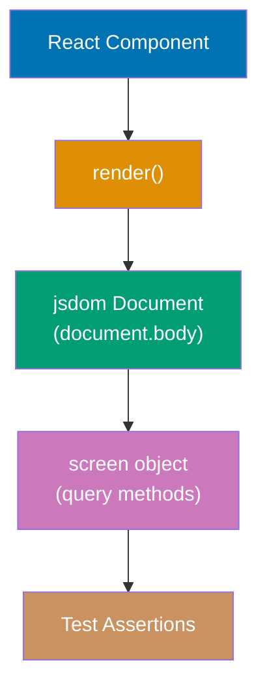
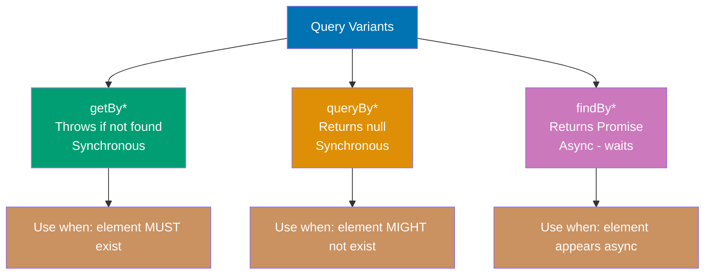

Learn Testing Library fundamentals through 28 annotated code examples. Each example is self-contained, runnable with `npx jest` or `npx vitest`, and heavily commented to show what each line does, expected behaviors, and intermediate DOM states.

## Core Render and Screen (Examples 1-5)

### Example 1: First Test with render() and screen

The `render()` function mounts a React component into a jsdom environment. The `screen` object provides query methods bound to `document.body`, making elements available for assertions.



**Code**:

```typescript
import { render, screen } from "@testing-library/react";
// => Imports core Testing Library utilities
// => render: mounts component into jsdom document
// => screen: global query object bound to document.body

function Greeting() {
  // => Simple React component for demonstration
  return <h1>Hello, World!</h1>;
  // => Renders an h1 element with text content
}

test("renders greeting", () => {
  // => Defines a synchronous test (no async needed for static content)
  render(<Greeting />);
  // => Mounts Greeting into jsdom
  // => DOM now contains: <h1>Hello, World!</h1>

  const heading = screen.getByText("Hello, World!");
  // => Queries DOM for element with exact text "Hello, World!"
  // => Returns HTMLElement if found, throws if not found
  // => heading: <h1>Hello, World!</h1>

  expect(heading).toBeInTheDocument();
  // => Asserts element exists in document.body
  // => Jest-dom matcher (from @testing-library/jest-dom)
  // => Passes: heading is mounted and visible
});
```

**Key Takeaway**: `render()` mounts components into jsdom and `screen` provides query methods. Always import from `@testing-library/react` for React component testing.

**Why It Matters**: Testing Library's `screen` object eliminates the need to destructure query methods from `render()` results (an older pattern). The global `screen` object is always synchronized with `document.body`, making tests more readable and consistent. The `toBeInTheDocument()` matcher from `@testing-library/jest-dom` provides semantic assertions that communicate intent clearly, improving test maintainability and reviewability across teams.

---

### Example 2: screen Object and Cleanup

Testing Library automatically cleans up the DOM after each test. Understanding this lifecycle prevents test pollution and false positives.

```typescript
import { render, screen } from "@testing-library/react";
// => Both from same package - render mounts, screen queries

function Counter() {
  // => Simple counter component for isolation testing
  return <div>Count: 0</div>;
  // => Static for simplicity, shows current count
}

test("first test - renders counter", () => {
  render(<Counter />);
  // => Mounts Counter into fresh jsdom
  // => DOM state: <div>Count: 0</div>

  expect(screen.getByText("Count: 0")).toBeInTheDocument();
  // => Finds element by text content
  // => Passes: text "Count: 0" is present
  // => After this test, cleanup() runs automatically
});

test("second test - DOM is clean", () => {
  // => New test starts with empty document.body
  // => Previous test's DOM has been removed by cleanup()

  expect(screen.queryByText("Count: 0")).toBeNull();
  // => queryByText: returns null if not found (vs getByText throws)
  // => Proves cleanup removed previous test's DOM
  // => toBeNull(): asserts element is not present
});
```

**Key Takeaway**: Testing Library calls `cleanup()` automatically after each test (via Jest's afterEach). Each test starts with a fresh DOM, preventing state leakage between tests.

**Why It Matters**: Automatic DOM cleanup is crucial for test reliability. Without it, elements from earlier tests persist in the DOM and cause false positives in later tests. Testing Library handles this transparently when used with Jest or Vitest, eliminating a common source of flaky tests in component test suites. This isolation guarantee means test order never affects test outcomes.

---

### Example 3: Rendering with Props

Components accept props that control rendering. Testing different prop combinations verifies component behavior across its full interface.

```typescript
import { render, screen } from "@testing-library/react";

interface AlertProps {
  // => TypeScript interface defines component's prop contract
  type: "success" | "error" | "warning";
  // => type: controls visual style and meaning
  message: string;
  // => message: the text content to display
}

function Alert({ type, message }: AlertProps) {
  // => Destructures props for clean access
  return (
    <div role="alert" data-testid={`alert-${type}`}>
      {/* role="alert": semantic role for assistive technologies */}
      {/* data-testid: escape hatch for testing by test ID */}
      <span>{type.toUpperCase()}: </span>
      {/* Displays type label in uppercase */}
      <span>{message}</span>
      {/* Displays the message content */}
    </div>
  );
}

test("renders success alert with message", () => {
  render(<Alert type="success" message="Operation completed" />);
  // => Renders Alert with specific prop values
  // => DOM: <div role="alert" data-testid="alert-success">SUCCESS: Operation completed</div>

  expect(screen.getByRole("alert")).toBeInTheDocument();
  // => Queries by ARIA role "alert"
  // => Accessibility-first query: preferred over querying by class

  expect(screen.getByText("Operation completed")).toBeInTheDocument();
  // => Verifies message prop renders correctly
  // => Finds element containing this exact text substring

  expect(screen.getByTestId("alert-success")).toBeInTheDocument();
  // => Queries by data-testid attribute
  // => Use sparingly: prefer role/text/label queries
});
```

**Key Takeaway**: Test components with different prop combinations to verify behavior across the full interface. Prefer `getByRole()` and `getByText()` over `getByTestId()` to write tests that reflect user experience.

**Why It Matters**: Prop-based testing validates component contracts—the agreement between a component and its consumers. Accessible role queries (`getByRole('alert')`) simultaneously test functionality and accessibility compliance, meaning a single assertion verifies both that the feature works and that screen readers can announce it. This efficiency is why Testing Library's query priority recommends role queries first.

---

### Example 4: render() Return Values

`render()` returns useful utilities beyond what `screen` provides. Understanding these return values enables targeted querying within specific container elements.

```typescript
import { render, screen } from "@testing-library/react";

function UserCard({ name, email }: { name: string; email: string }) {
  // => Component with two pieces of user data
  return (
    <article>
      {/* article: semantic element for self-contained content */}
      <h2>{name}</h2>
      {/* h2: heading for user name */}
      <p>{email}</p>
      {/* p: paragraph for email address */}
    </article>
  );
}

test("render return values", () => {
  const { container, unmount, rerender } = render(
    // => Destructures useful utilities from render result
    // => container: HTMLDivElement wrapping the rendered output
    // => unmount: function to unmount component (test cleanup effects)
    // => rerender: function to re-render with different props
    <UserCard name="Alice" email="alice@example.com" />
  );

  expect(container.querySelector("article")).toBeInTheDocument();
  // => container.querySelector: DOM query within container
  // => Useful when role/text queries are insufficient
  // => Returns the <article> element

  expect(screen.getByText("alice@example.com")).toBeInTheDocument();
  // => screen.getByText: searches entire document.body
  // => Equivalent to container.getByText for single-component tests

  rerender(<UserCard name="Bob" email="bob@example.com" />);
  // => Re-renders with new props (simulates state-driven prop changes)
  // => Triggers React re-render cycle
  // => DOM updates with new values

  expect(screen.getByText("Bob")).toBeInTheDocument();
  // => Verifies rerender updated the name
  expect(screen.queryByText("Alice")).not.toBeInTheDocument();
  // => Verifies old name is gone after rerender
  // => queryByText: returns null (not throws) if missing
});
```

**Key Takeaway**: Use `rerender()` to test component updates with new props. The `container` gives direct DOM access when semantic queries fall short. Prefer `screen` over `container` queries for readability.

**Why It Matters**: The `rerender()` function simulates real-world component behavior where parent components pass updated props to children. Testing prop updates verifies that components correctly reflect new data, catching bugs where components fail to update their display when data changes. This is especially critical for performance-optimized components using `React.memo` where incorrect equality checks prevent needed updates.

---

### Example 5: Rendering Lists and Multiple Elements

Components often render collections of data. Testing lists requires strategies for querying multiple elements and verifying their content.

```typescript
import { render, screen } from "@testing-library/react";

const fruits = ["Apple", "Banana", "Cherry"];
// => Sample data array for list rendering

function FruitList({ items }: { items: string[] }) {
  // => Component renders an unordered list from array
  return (
    <ul>
      {items.map((item) => (
        <li key={item}>{item}</li>
        // => Each fruit becomes a list item
        // => key: React's reconciliation key (use unique value)
      ))}
    </ul>
  );
}

test("renders all list items", () => {
  render(<FruitList items={fruits} />);
  // => Mounts FruitList with 3-item array
  // => DOM: <ul><li>Apple</li><li>Banana</li><li>Cherry</li></ul>

  const listItems = screen.getAllByRole("listitem");
  // => getAllByRole: returns array of all matching elements
  // => "listitem": ARIA role for <li> elements
  // => listItems: [<li>Apple</li>, <li>Banana</li>, <li>Cherry</li>]

  expect(listItems).toHaveLength(3);
  // => Verifies correct number of items rendered
  // => Passes: array has 3 elements

  expect(listItems[0]).toHaveTextContent("Apple");
  // => toHaveTextContent: checks element's text content
  // => Verifies first item is "Apple"

  fruits.forEach((fruit) => {
    // => Iterates through source data to verify each item
    expect(screen.getByText(fruit)).toBeInTheDocument();
    // => getByText: finds element with exact text match
    // => Verifies every fruit appears in the rendered list
  });
});
```

**Key Takeaway**: Use `getAllByRole()` to query multiple elements of the same type. `toHaveLength()` verifies count, individual item access via array index, and `forEach` loops for exhaustive data verification.

**Why It Matters**: List rendering is one of the most common React patterns. Testing that all items appear, in the right order, with correct content, validates the mapping logic and key assignment that drives React's reconciliation. A missing or duplicated item in a list is often invisible until caught by tests—user research shows incorrect lists are a leading cause of user frustration and data-entry errors in web applications.

---

## getByRole Queries (Examples 6-10)

### Example 6: getByRole - Buttons and Links

`getByRole()` is the highest-priority query in Testing Library's recommendation. It finds elements by their ARIA role, which matches how assistive technologies expose them to users.

```mermaid
%% Color Palette: Blue #0173B2, Orange #DE8F05, Teal #029E73, Purple #CC78BC, Brown #CA9161
graph TD
    Query["getByRole#40;role, options#41;"] --> Roles["ARIA Role Types"]
    Roles --> Button["button<br/>#40;<button>, role=button#41;"]
    Roles --> Link["link<br/>#40;<a href=...>#41;"]
    Roles --> Heading["heading<br/>#40;<h1>-<h6>#41;"]
    Roles --> TextBox["textbox<br/>#40;<input type=text>#41;"]

    style Query fill:#0173B2,color:#fff
    style Roles fill:#DE8F05,color:#fff
    style Button fill:#029E73,color:#fff
    style Link fill:#CC78BC,color:#fff
    style Heading fill:#CA9161,color:#fff
    style TextBox fill:#029E73,color:#fff
```



**Code**:

```typescript
import { render, screen } from "@testing-library/react";

function ActionBar() {
  // => Component with buttons and a link
  return (
    <div>
      <button>Save</button>
      {/* role="button" implicitly */}
      <button disabled>Delete</button>
      {/* disabled button: role="button" but not interactive */}
      <a href="/home">Go Home</a>
      {/* role="link" implicitly (has href) */}
    </div>
  );
}

test("getByRole queries for interactive elements", () => {
  render(<ActionBar />);
  // => Mounts ActionBar into jsdom

  const saveButton = screen.getByRole("button", { name: "Save" });
  // => getByRole("button"): finds elements with button role
  // => { name: "Save" }: filters by accessible name
  // => Accessible name comes from text content for buttons
  // => saveButton: <button>Save</button>

  expect(saveButton).toBeEnabled();
  // => toBeEnabled(): asserts button is not disabled
  // => Passes: Save button has no disabled attribute

  const deleteButton = screen.getByRole("button", { name: "Delete" });
  // => Finds Delete button by role and name
  // => deleteButton: <button disabled>Delete</button>

  expect(deleteButton).toBeDisabled();
  // => toBeDisabled(): asserts element has disabled attribute
  // => Passes: Delete button is disabled

  const homeLink = screen.getByRole("link", { name: "Go Home" });
  // => getByRole("link"): finds <a> elements with href
  // => { name: "Go Home" }: matches by link text
  // => homeLink: <a href="/home">Go Home</a>

  expect(homeLink).toHaveAttribute("href", "/home");
  // => toHaveAttribute: checks element attribute value
  // => Verifies link goes to correct destination
});
```

**Key Takeaway**: `getByRole()` with `{ name }` option is the most precise and accessibility-aligned query. It finds elements by how assistive technologies expose them, catching accessible name issues alongside functional ones.

**Why It Matters**: ARIA role queries test the user experience at the accessibility layer—the same layer screen readers, voice control software, and browser accessibility APIs use. A button found by `getByRole('button', { name: 'Save' })` is guaranteed to be keyboard-navigable, click-activatable, and announced correctly by screen readers. This eliminates an entire class of accessibility bugs that pure functionality testing misses, making Testing Library's role-first approach both efficient and correct.

---

### Example 7: getByRole - Headings and Structure

Headings convey document structure to both users and assistive technologies. Testing heading hierarchy verifies semantic HTML correctness.

```typescript
import { render, screen } from "@testing-library/react";

function ArticlePage() {
  // => Article with proper heading hierarchy
  return (
    <article>
      <h1>Main Article Title</h1>
      {/* h1: document title - only one per page */}
      <h2>Section One</h2>
      {/* h2: major section heading */}
      <p>Section content here.</p>
      <h2>Section Two</h2>
      {/* h2: another major section */}
      <h3>Subsection</h3>
      {/* h3: subsection under Section Two */}
    </article>
  );
}

test("heading hierarchy and levels", () => {
  render(<ArticlePage />);
  // => Mounts ArticlePage with heading structure

  const mainTitle = screen.getByRole("heading", { level: 1 });
  // => getByRole("heading"): finds heading elements (h1-h6)
  // => { level: 1 }: filters to h1 specifically
  // => mainTitle: <h1>Main Article Title</h1>

  expect(mainTitle).toHaveTextContent("Main Article Title");
  // => Verifies h1 contains correct text
  // => toHaveTextContent: checks text content of element

  const sectionHeadings = screen.getAllByRole("heading", { level: 2 });
  // => getAllByRole: returns array of all h2 elements
  // => level: 2 filters to h2 only (not h1 or h3)
  // => sectionHeadings: [<h2>Section One</h2>, <h2>Section Two</h2>]

  expect(sectionHeadings).toHaveLength(2);
  // => Verifies exactly 2 h2 headings exist
  // => Catches both missing and extra headings

  const subsection = screen.getByRole("heading", { level: 3 });
  // => Gets the single h3 element
  expect(subsection).toHaveTextContent("Subsection");
  // => Verifies subsection heading content
});
```

**Key Takeaway**: Use `getByRole("heading", { level: N })` to query specific heading levels. Testing heading structure validates semantic HTML that benefits SEO, screen reader navigation, and document outline tools.

**Why It Matters**: Document heading structure is the primary navigation mechanism for screen reader users—they navigate pages by jumping between headings the way sighted users scan visual sections. A broken heading hierarchy (skipped levels, multiple h1s, wrong nesting) makes pages nearly unusable with assistive technology. Testing heading roles ensures each component contributes correctly to the overall page structure, an accessibility requirement often invisible to visual testing approaches.

---

### Example 8: getByRole - Form Elements

Form elements have implicit ARIA roles based on their type attribute. Understanding these roles enables accessible-first form testing.

```typescript
import { render, screen } from "@testing-library/react";

function LoginForm() {
  // => Login form with labeled inputs
  return (
    <form>
      <label htmlFor="email">Email</label>
      {/* label: associates with input via htmlFor */}
      <input id="email" type="email" placeholder="Enter email" />
      {/* type="email": role="textbox" + email validation */}

      <label htmlFor="password">Password</label>
      <input id="password" type="password" />
      {/* type="password": no specific ARIA role, use getByLabelText */}

      <input type="checkbox" id="remember" />
      <label htmlFor="remember">Remember me</label>
      {/* checkbox: role="checkbox" implicitly */}

      <button type="submit">Sign In</button>
      {/* submit button: role="button" */}
    </form>
  );
}

test("form element roles", () => {
  render(<LoginForm />);
  // => Mounts form with various input types

  const emailInput = screen.getByRole("textbox", { name: "Email" });
  // => type="email" input has role="textbox"
  // => { name: "Email" }: matches by associated label text
  // => emailInput: <input id="email" type="email" ...>

  expect(emailInput).toBeInTheDocument();
  // => Verifies email input rendered correctly

  expect(emailInput).toHaveAttribute("placeholder", "Enter email");
  // => Checks placeholder attribute value

  const checkbox = screen.getByRole("checkbox", { name: "Remember me" });
  // => type="checkbox" has role="checkbox"
  // => Accessible name comes from associated label
  // => checkbox: <input type="checkbox" id="remember">

  expect(checkbox).not.toBeChecked();
  // => not.toBeChecked(): asserts checkbox is unchecked
  // => Initial state: unchecked

  const submitButton = screen.getByRole("button", { name: "Sign In" });
  // => type="submit" button has role="button"
  // => Accessible name from button text content
  expect(submitButton).toHaveAttribute("type", "submit");
  // => Verifies button is a submit button
});
```

**Key Takeaway**: Form inputs have implicit ARIA roles based on their `type` attribute. Use `getByRole("textbox", { name: "Label" })` to find labeled inputs in an accessible, precise way.

**Why It Matters**: Form accessibility is one of the most critical and most commonly broken aspects of web applications. Proper label association (via `htmlFor`/`id` pairs or `aria-label`) is not just a Testing Library requirement—it's the difference between forms that work with assistive technology and forms that exclude users with disabilities. Writing tests with role-based queries simultaneously validates functionality and accessibility compliance, making Testing Library tests more valuable than equivalent Enzyme tests.

---

### Example 9: getByRole - Tables and Navigation

Tables and navigation elements have rich ARIA role structures. Testing them validates semantic markup and accessible data presentation.

```typescript
import { render, screen } from "@testing-library/react";

function DataTable() {
  // => Simple data table with proper semantics
  return (
    <table>
      <thead>
        <tr>
          <th scope="col">Name</th>
          {/* scope="col": associates header with column */}
          <th scope="col">Score</th>
        </tr>
      </thead>
      <tbody>
        <tr>
          <td>Alice</td>
          <td>95</td>
        </tr>
        <tr>
          <td>Bob</td>
          <td>87</td>
        </tr>
      </tbody>
    </table>
  );
}

function SiteNav() {
  // => Navigation with semantic nav element
  return (
    <nav aria-label="Main navigation">
      {/* aria-label: provides accessible name for nav landmark */}
      <a href="/">Home</a>
      <a href="/about">About</a>
    </nav>
  );
}

test("table and navigation roles", () => {
  render(
    <div>
      <SiteNav />
      <DataTable />
    </div>
  );
  // => Renders both components together

  const nav = screen.getByRole("navigation", { name: "Main navigation" });
  // => role="navigation": matches <nav> element
  // => { name: "Main navigation" }: matches by aria-label value
  expect(nav).toBeInTheDocument();
  // => Verifies navigation landmark exists

  const table = screen.getByRole("table");
  // => role="table": matches <table> element
  // => No name option: only one table exists
  expect(table).toBeInTheDocument();

  const columnHeaders = screen.getAllByRole("columnheader");
  // => role="columnheader": matches <th scope="col"> elements
  // => Returns array of all column headers
  expect(columnHeaders).toHaveLength(2);
  // => Verifies both column headers rendered

  const rows = screen.getAllByRole("row");
  // => role="row": matches all <tr> elements (header + data rows)
  // => rows: [header row, Alice row, Bob row]
  expect(rows).toHaveLength(3);
  // => 1 header row + 2 data rows = 3 total
});
```

**Key Takeaway**: Tables and navigation landmarks have rich ARIA role vocabularies. Testing with these roles validates both semantic correctness and accessibility landmark navigation that screen reader users rely on.

**Why It Matters**: Landmark navigation (nav, main, aside, footer) allows screen reader users to jump directly to major page sections without reading everything. Data tables without proper header associations (`scope` attribute) become confusing spreadsheets for screen reader users who can't visually scan columns. Testing these structures with ARIA roles catches semantic markup errors that have severe accessibility consequences but zero visual impact, making them impossible to catch without accessibility-aware tests.

---

### Example 10: getByRole - Dialogs and Alerts

Modal dialogs and live regions have special ARIA roles. Testing them properly validates critical interaction patterns for assistive technology users.

```typescript
import { render, screen } from "@testing-library/react";
import { useState } from "react";

function ModalExample() {
  // => Component with toggle-able modal dialog
  const [isOpen, setIsOpen] = useState(false);
  // => isOpen: controls modal visibility

  return (
    <div>
      <button onClick={() => setIsOpen(true)}>Open Modal</button>
      {/* Trigger button to show modal */}
      {isOpen && (
        <div role="dialog" aria-modal="true" aria-label="Confirmation dialog">
          {/* role="dialog": semantic dialog role */}
          {/* aria-modal="true": tells screen readers content outside is inert */}
          {/* aria-label: provides accessible name for the dialog */}
          <h2>Are you sure?</h2>
          <p>This action cannot be undone.</p>
          <button onClick={() => setIsOpen(false)}>Confirm</button>
          <button onClick={() => setIsOpen(false)}>Cancel</button>
        </div>
      )}
      <div role="alert">
        {/* role="alert": live region, announced immediately by screen readers */}
        Status: Ready
      </div>
    </div>
  );
}

test("dialog and alert roles", () => {
  render(<ModalExample />);
  // => Mounts ModalExample, modal initially hidden

  expect(screen.queryByRole("dialog")).not.toBeInTheDocument();
  // => queryByRole: returns null (not throws) when not found
  // => Verifies modal is hidden initially

  const alertRegion = screen.getByRole("alert");
  // => role="alert": live region element
  // => Announced automatically by screen readers when content changes
  expect(alertRegion).toHaveTextContent("Status: Ready");
  // => Verifies alert content is correct

  const openButton = screen.getByRole("button", { name: "Open Modal" });
  // => Finds the trigger button by accessible name
  expect(openButton).toBeInTheDocument();
  // => Button is always present (not conditionally rendered)
});
```

**Key Takeaway**: Use `queryByRole()` (not `getByRole()`) to assert elements are absent—it returns null instead of throwing. Test conditional rendering with both presence and absence assertions.

**Why It Matters**: Modal dialogs and alert regions are high-stakes UI patterns where accessibility failures cause significant user harm. A dialog without `role="dialog"` and `aria-modal` doesn't trap focus or properly inform screen readers that background content is inert—users can inadvertently interact with obscured content. Alert roles trigger immediate screen reader announcements without focus change, critical for form validation errors and status updates. Testing these roles verifies the entire accessible interaction contract, not just visual rendering.

---

## getByText and Text Matching (Examples 11-14)

### Example 11: getByText - Exact and Partial Matching

`getByText()` finds elements by their text content. Understanding exact versus partial matching prevents both over-specific and under-specific queries.

```typescript
import { render, screen } from "@testing-library/react";

function ProductCard() {
  // => Product display component with various text elements
  return (
    <div>
      <h2>Premium Widget</h2>
      {/* Exact text: "Premium Widget" */}
      <p>This is a high-quality widget for professionals.</p>
      {/* Longer text with "widget" as substring */}
      <span>Price: $29.99</span>
      {/* Price with special characters */}
      <button>Add to Cart</button>
    </div>
  );
}

test("getByText matching strategies", () => {
  render(<ProductCard />);
  // => Mounts ProductCard

  const title = screen.getByText("Premium Widget");
  // => Exact match: finds element with text "Premium Widget"
  // => Matches <h2>Premium Widget</h2>
  // => Default: exact: true (full text content match)
  expect(title.tagName).toBe("H2");
  // => tagName: HTML element type in uppercase
  // => Verifies the h2 element was found

  const description = screen.getByText(/high-quality widget/i);
  // => Regex match: finds element containing "high-quality widget"
  // => /i flag: case-insensitive matching
  // => Finds the <p> element containing this phrase
  expect(description).toBeInTheDocument();

  const price = screen.getByText(/\$29\.99/);
  // => Regex with escaped special chars
  // => \$ matches literal dollar sign
  // => \. matches literal period (not any char)
  // => Finds <span>Price: $29.99</span>
  expect(price).toHaveTextContent("$29.99");
  // => toHaveTextContent: checks partial text match within element
});
```

**Key Takeaway**: Use string literals for exact matches, regex with `/i` for case-insensitive partial matches. Regex patterns are more resilient to minor text changes than exact strings.

**Why It Matters**: Text matching strategy impacts test maintainability significantly. Exact string matches break when copy changes (button labels, headings, error messages) even if behavior is correct. Regex patterns can match the semantic essence of text (e.g., `/error/i`) rather than the exact wording, making tests more durable. The balance is precision: too loose (e.g., `/the/`) matches unintended elements; too exact breaks on minor wording updates. Testing Library's flexible text matching API lets you choose the right precision level per situation.

---

### Example 12: getByText - Function Matchers and Normalization

Custom function matchers give full control over text matching logic. Text normalization handles whitespace and casing differences automatically.

```typescript
import { render, screen } from "@testing-library/react";

function FormattedContent() {
  // => Component with irregular whitespace and mixed casing
  return (
    <div>
      <p>  Welcome   to   Testing Library  </p>
      {/* Multiple spaces in text (normalized by default) */}
      <span>Status: ACTIVE</span>
      {/* All-caps text */}
      <div>
        <strong>Total:</strong> $150.00
        {/* Text split across elements */}
      </div>
    </div>
  );
}

test("text normalization and function matchers", () => {
  render(<FormattedContent />);
  // => Mounts FormattedContent

  const welcome = screen.getByText("Welcome to Testing Library");
  // => Default normalization collapses whitespace
  // => "  Welcome   to   Testing Library  " → "Welcome to Testing Library"
  // => getByText normalizes before comparison
  expect(welcome).toBeInTheDocument();

  const status = screen.getByText("Status: ACTIVE");
  // => Exact match works for all-caps text
  // => No normalization for case (exact: true by default)
  expect(status).toBeInTheDocument();

  const totalLabel = screen.getByText((content, element) => {
    // => Function matcher: receives (text, element) arguments
    // => content: normalized text content of element
    // => element: DOM node being tested
    return (
      element?.tagName === "STRONG" &&
      // => Checks element type
      content === "Total:"
      // => Checks exact text content
    );
    // => Returns true to select this element, false to skip
  });
  // => Function matchers enable complex, conditional matching
  expect(totalLabel).toBeInTheDocument();
  // => Finds the <strong>Total:</strong> element specifically
});
```

**Key Takeaway**: Testing Library normalizes whitespace by default—multiple spaces become single spaces, leading/trailing spaces are trimmed. Use function matchers when you need both text content and element type conditions.

**Why It Matters**: Text normalization prevents brittle tests that fail due to insignificant whitespace differences in component templates. HTML renders collapse multiple spaces visually, and tests should match this visual behavior rather than raw source text. Function matchers become essential when text content alone is insufficient—for example, when the same text appears in both a label and a tooltip, requiring element type disambiguation. This flexibility makes Testing Library adaptable to real-world component complexity without sacrificing query clarity.

---

### Example 13: getByLabelText - Form Label Queries

`getByLabelText()` finds form inputs by their associated label text. This is the highest-priority query for form inputs and validates label association.

```typescript
import { render, screen } from "@testing-library/react";

function RegistrationForm() {
  // => Form demonstrating various label association techniques
  return (
    <form>
      <label htmlFor="username">Username</label>
      <input id="username" type="text" />
      {/* htmlFor/id pair: standard association */}

      <label>
        Email Address
        <input type="email" />
        {/* Wrapping label: implicit association */}
      </label>

      <input
        type="text"
        aria-label="Search query"
        // aria-label: programmatic label (no visible label element)
        placeholder="Search..."
      />

      <input
        type="text"
        aria-labelledby="bio-label"
        // aria-labelledby: references label by ID
      />
      <span id="bio-label">Biography</span>
      {/* span with id acts as label via aria-labelledby */}
    </form>
  );
}

test("getByLabelText with different label types", () => {
  render(<RegistrationForm />);
  // => Mounts form with 4 different label patterns

  const usernameInput = screen.getByLabelText("Username");
  // => Finds input associated with label "Username"
  // => Matches via htmlFor="username" → id="username"
  // => usernameInput: <input id="username" type="text">
  expect(usernameInput).toBeInTheDocument();

  const emailInput = screen.getByLabelText("Email Address");
  // => Finds input wrapped inside label element
  // => Implicit association (wrapping label)
  // => emailInput: <input type="email">
  expect(emailInput).toHaveAttribute("type", "email");

  const searchInput = screen.getByLabelText("Search query");
  // => Finds input with matching aria-label attribute
  // => Matches programmatic label
  expect(searchInput).toHaveAttribute("placeholder", "Search...");

  const bioInput = screen.getByLabelText("Biography");
  // => Finds input with aria-labelledby pointing to "bio-label" span
  // => Reads text of referenced element as accessible name
  expect(bioInput).toBeInTheDocument();
});
```

**Key Takeaway**: `getByLabelText()` supports all four W3C label association techniques: `htmlFor`/`id`, wrapping label, `aria-label`, and `aria-labelledby`. Using it validates that your form inputs are properly labeled for assistive technology.

**Why It Matters**: Form label association is the accessibility requirement most frequently violated in web applications. Unlabeled inputs are invisible to screen reader users—the software announces "edit text" with no context about what to enter. `getByLabelText()` simultaneously tests that the input renders AND that it has a proper, accessible label. This dual validation is impossible to achieve with class-based or placeholder-based queries, making it the most valuable form testing query in Testing Library's arsenal.

---

### Example 14: getByPlaceholderText and getByAltText

These queries handle inputs without visible labels and images. They serve as fallbacks when label queries aren't applicable.

```typescript
import { render, screen } from "@testing-library/react";

function SearchBar() {
  // => Search input that uses placeholder instead of label
  // => Note: placeholder-only inputs have accessibility limitations
  return (
    <div>
      <input
        type="search"
        placeholder="Search products..."
        aria-label="Product search"
        // aria-label provided even with placeholder for accessibility
      />
    </div>
  );
}

function ImageGallery() {
  // => Gallery with descriptive image alt text
  return (
    <div>
      
      {/* Descriptive alt: describes image content for screen readers */}
      
      {/* Shorter alt for simpler images */}
      
      {/* Empty alt: decorative image (screen readers skip it) */}
    </div>
  );
}

test("placeholder and alt text queries", () => {
  render(
    <div>
      <SearchBar />
      <ImageGallery />
    </div>
  );
  // => Renders both components

  const searchInput = screen.getByPlaceholderText("Search products...");
  // => getByPlaceholderText: finds by placeholder attribute value
  // => Use as fallback when getByLabelText isn't available
  // => searchInput: <input type="search" placeholder="Search products...">
  expect(searchInput).toBeInTheDocument();

  const catImage = screen.getByAltText("Orange tabby cat sleeping on a couch");
  // => getByAltText: finds  by alt attribute value
  // => Validates images have descriptive, accurate alt text
  // => catImage: 
  expect(catImage).toBeInTheDocument();
  expect(catImage).toHaveAttribute("src", "/cat.jpg");

  const logoImage = screen.getByAltText("Company logo");
  // => Short alt text for logo images is acceptable
  expect(logoImage).toHaveAttribute("src", "/logo.svg");

  const decorativeImages = screen.queryAllByAltText("");
  // => queryAllByAltText: returns array of all empty-alt images
  // => Empty alt: decorative images intentionally have alt=""
  expect(decorativeImages).toHaveLength(1);
  // => Verifies exactly one decorative image
});
```

**Key Takeaway**: Use `getByPlaceholderText()` only when `getByLabelText()` isn't possible. Use `getByAltText()` to query images and simultaneously validate their alt text descriptions for accessibility compliance.

**Why It Matters**: Placeholder text is a poor substitute for visible labels—it disappears when users type, has lower color contrast, and some assistive technologies don't announce it reliably. Testing Library's query priority places `getByPlaceholderText()` below `getByLabelText()` for exactly this reason: using it in tests reveals accessibility issues. Alt text on images is a WCAG 2.1 Level A requirement—missing or incorrect alt text fails mandatory accessibility standards. `getByAltText()` makes these validations automatic side effects of functional testing.

---

## getByTestId and within() (Examples 15-17)

### Example 15: getByTestId - Test ID Escape Hatch

`getByTestId()` queries by `data-testid` attribute. It's Testing Library's escape hatch for situations where semantic queries aren't practical.

```typescript
import { render, screen } from "@testing-library/react";

function ComplexWidget() {
  // => Widget where semantic queries might conflict
  return (
    <div>
      <section data-testid="primary-section">
        {/* data-testid: test-only attribute for targeted querying */}
        <p>Primary content</p>
        <button>Action</button>
      </section>
      <section data-testid="secondary-section">
        {/* Second section with same element types */}
        <p>Secondary content</p>
        <button>Action</button>
        {/* Same button text - would be ambiguous with getByRole */}
      </section>
    </div>
  );
}

test("getByTestId for disambiguation", () => {
  render(<ComplexWidget />);
  // => Two sections each with a "Action" button

  const primarySection = screen.getByTestId("primary-section");
  // => getByTestId: finds element by data-testid attribute
  // => Precise: targets exact element regardless of content
  // => primarySection: <section data-testid="primary-section">

  expect(primarySection).toContainElement(
    screen.getByText("Primary content")
  );
  // => toContainElement: asserts element is inside another element
  // => Verifies primary section contains correct content

  const secondarySection = screen.getByTestId("secondary-section");
  // => Finds second section by test ID
  expect(secondarySection).toBeInTheDocument();

  // Demonstrates why testId is a last resort:
  const buttons = screen.getAllByRole("button", { name: "Action" });
  // => getAllByRole: finds BOTH "Action" buttons
  // => Returns array: [primary Action, secondary Action]
  expect(buttons).toHaveLength(2);
  // => Verifies both buttons exist
  // => Cannot distinguish which is which without context
});
```

**Key Takeaway**: Use `getByTestId()` as a last resort when semantic queries (`getByRole`, `getByText`, `getByLabelText`) can't uniquely identify elements. Prefer semantic queries that test accessibility attributes.

**Why It Matters**: The Testing Library priority order (role > label > placeholder > text > displayValue > altText > title > testId) reflects how users interact with applications. `data-testid` attributes have zero accessibility value—they're invisible to users and assistive technologies. Overusing `getByTestId()` produces tests that pass while accessibility breaks, creating false confidence. The escape hatch exists because some real-world components lack semantic differentiation, but teams should treat each `getByTestId()` as a cue to improve their component's semantic markup.

---

### Example 16: within() - Scoped Queries

`within()` scopes queries to a specific container element. It's essential when multiple instances of the same element appear at page level.

```typescript
import { render, screen, within } from "@testing-library/react";
// => within: imported alongside render and screen

function ProductList() {
  // => List of products with identical structure
  const products = [
    { id: 1, name: "Widget A", price: "$10.00", available: true },
    { id: 2, name: "Widget B", price: "$20.00", available: false },
  ];
  // => Two products with same DOM structure

  return (
    <ul>
      {products.map((product) => (
        <li key={product.id} data-testid={`product-${product.id}`}>
          {/* data-testid on list item for within() scoping */}
          <h3>{product.name}</h3>
          <span>{product.price}</span>
          <button disabled={!product.available}>
            {product.available ? "Add to Cart" : "Out of Stock"}
          </button>
        </li>
      ))}
    </ul>
  );
}

test("within() scopes queries to container", () => {
  render(<ProductList />);
  // => Renders two product list items

  const productA = screen.getByTestId("product-1");
  // => Gets the container for Widget A
  // => productA: <li data-testid="product-1">...</li>

  const addButtonA = within(productA).getByRole("button");
  // => within(productA): scopes all queries to productA element
  // => .getByRole("button"): finds button INSIDE productA only
  // => addButtonA: <button>Add to Cart</button> for Widget A
  expect(addButtonA).toBeEnabled();
  // => Widget A is available, button is enabled

  const productB = screen.getByTestId("product-2");
  // => Gets the container for Widget B

  const outOfStockButton = within(productB).getByRole("button");
  // => Finds button scoped to Widget B
  // => outOfStockButton: <button disabled>Out of Stock</button>
  expect(outOfStockButton).toBeDisabled();
  // => Widget B is unavailable, button is disabled

  within(productA).getByText("$10.00");
  // => Finds price text scoped to Widget A
  // => Prevents accidental match with Widget B's price
  within(productB).getByText("$20.00");
  // => Finds price text scoped to Widget B
});
```

**Key Takeaway**: `within(container)` scopes all query methods to a specific DOM subtree, eliminating ambiguity when identical structures repeat across the page.

**Why It Matters**: Page-level queries fail when component patterns repeat—two "Add to Cart" buttons, two "Delete" actions, multiple form groups. `within()` solves this precisely without resorting to brittle index-based access (`buttons[0]`, `buttons[1]`). Scoped queries express intent clearly: "find the button within product A's row," which is exactly how users think about interactions. This clarity also makes tests more resilient to reordering—the test continues to work correctly if products change position.

---

### Example 17: queryBy*and findBy* Introduction

The three query variant families serve different purposes: `getBy*` for elements that must exist, `queryBy*` for optional elements, `findBy*` for async elements.



**Code**:

```typescript
import { render, screen } from "@testing-library/react";

function ConditionalContent({ showMessage }: { showMessage: boolean }) {
  // => Conditionally rendered content
  return (
    <div>
      <h1>Main Content</h1>
      {showMessage && <p>Optional message</p>}
      {/* Conditional: only renders when showMessage is true */}
    </div>
  );
}

test("query variant comparison", () => {
  render(<ConditionalContent showMessage={false} />);
  // => Renders without optional message

  const heading = screen.getByText("Main Content");
  // => getByText: throws if not found
  // => Use when element MUST be present (assertion by query)
  // => heading: <h1>Main Content</h1>
  expect(heading).toBeInTheDocument();

  const message = screen.queryByText("Optional message");
  // => queryByText: returns null if not found (no throw)
  // => Use when testing absence of elements
  // => message: null (element not rendered)
  expect(message).not.toBeInTheDocument();
  // => not.toBeInTheDocument(): accepts null without error

  // findBy* is for async elements - covered in intermediate section
  // Usage: const element = await screen.findByText("Loaded content");
  // Waits up to 1000ms (default) for element to appear
});
```

**Key Takeaway**: Use `getBy*` when the element must exist (throws provides a clear error), `queryBy*` when testing absence, and `findBy*` (covered in intermediate) when waiting for async content.

**Why It Matters**: Choosing the wrong query variant produces misleading test failures. Using `getBy*` when testing absence throws a confusing error instead of a clean assertion failure. Using `queryBy*` when elements must exist silently passes when the element is missing—returning null without throwing means the subsequent assertion `expect(null).toBe(...)` fails with a less descriptive error. The three-variant system makes intent explicit and produces precise, debuggable test failures.

---

## User Events - Click and Type (Examples 18-22)

### Example 18: userEvent.setup() and click()

`@testing-library/user-event` simulates real browser interactions with realistic event sequences. Always call `userEvent.setup()` to create an instance with shared state.

```typescript
import { render, screen } from "@testing-library/react";
import userEvent from "@testing-library/user-event";
import { useState } from "react";

function ToggleButton() {
  // => Button that toggles between two states
  const [on, setOn] = useState(false);
  // => on: tracks toggle state
  return (
    <button
      onClick={() => setOn(!on)}
      // => onClick: toggles state on each click
      aria-pressed={on}
      // => aria-pressed: communicates toggle state to screen readers
    >
      {on ? "ON" : "OFF"}
      {/* Text reflects current state */}
    </button>
  );
}

test("userEvent click interactions", async () => {
  // => async: required for userEvent interactions
  const user = userEvent.setup();
  // => Creates userEvent instance with shared pointer/keyboard state
  // => Must be created before render for consistent behavior
  // => user: object with interaction methods

  render(<ToggleButton />);
  // => Mounts ToggleButton in initial "off" state

  const button = screen.getByRole("button");
  // => Finds toggle button by role
  // => Initial: <button aria-pressed="false">OFF</button>

  expect(button).toHaveTextContent("OFF");
  // => Verifies initial state is OFF
  expect(button).toHaveAttribute("aria-pressed", "false");
  // => Verifies aria-pressed reflects off state

  await user.click(button);
  // => Simulates full click sequence:
  // => pointerover, pointerenter, mouseover, mouseenter
  // => pointerdown, mousedown, pointerup, mouseup, click
  // => React's onClick handler fires, state updates to true

  expect(button).toHaveTextContent("ON");
  // => Verifies button text changed after click
  expect(button).toHaveAttribute("aria-pressed", "true");
  // => Verifies aria-pressed updated for screen readers

  await user.click(button);
  // => Second click toggles back to off
  expect(button).toHaveTextContent("OFF");
  // => State cycled back to initial
});
```

**Key Takeaway**: Always use `userEvent.setup()` before render and `await` each interaction. `userEvent.click()` dispatches a realistic event sequence matching actual browser behavior.

**Why It Matters**: `userEvent` dispatches the same sequence of pointer and mouse events that real browsers dispatch, meaning event handler bugs only apparent with real interactions are caught by tests. `fireEvent.click()` (the lower-level alternative) dispatches only a single `click` event, missing the `mousedown`, `mouseup`, and related events that many UI libraries listen to. Using `userEvent` prevents false positives where tests pass with `fireEvent` but fail in real browsers—particularly critical for drag-and-drop, context menus, and touch interactions.

---

### Example 19: userEvent.type() and Keyboard Input

`userEvent.type()` simulates keyboard input character by character, firing all relevant keyboard events. This tests input handling more realistically than `fireEvent.change()`.

```typescript
import { render, screen } from "@testing-library/react";
import userEvent from "@testing-library/user-event";
import { useState } from "react";

function SearchInput() {
  // => Controlled input with live character count
  const [value, setValue] = useState("");
  // => value: controlled input state

  return (
    <div>
      <label htmlFor="search">Search</label>
      <input
        id="search"
        type="text"
        value={value}
        onChange={(e) => setValue(e.target.value)}
        // => Controlled input: value driven by state
      />
      <span>{value.length} characters</span>
      {/* Live character count updates as user types */}
    </div>
  );
}

test("userEvent.type() simulates keyboard input", async () => {
  const user = userEvent.setup();
  // => Creates user instance

  render(<SearchInput />);
  // => Mounts with empty input

  const input = screen.getByLabelText("Search");
  // => Finds input by associated label
  // => Initial: <input value="">

  await user.type(input, "hello");
  // => Types each character: h, e, l, l, o
  // => For each character: keydown, keypress, input, keyup events
  // => React onChange fires for each input event
  // => After typing: input.value = "hello"

  expect(input).toHaveValue("hello");
  // => toHaveValue: checks input's current value
  // => Passes: value is "hello"

  expect(screen.getByText("5 characters")).toBeInTheDocument();
  // => Verifies character count updated correctly
  // => React re-rendered with new value length

  await user.clear(input);
  // => Clears input value (selects all and deletes)
  // => After clear: input.value = ""

  expect(input).toHaveValue("");
  // => Verifies input was cleared
  // => Character count should reset to 0
  expect(screen.getByText("0 characters")).toBeInTheDocument();
});
```

**Key Takeaway**: `user.type()` fires complete keyboard event sequences per character. Use `user.clear()` to empty inputs. Both properly trigger React controlled input update cycles.

**Why It Matters**: Input validation logic often depends on specific keyboard events (keydown for hotkey detection, input for real-time filtering, change for form submission). `userEvent.type()` dispatches all of these in the correct order, matching real browser behavior. `fireEvent.change()` dispatches only a single change event with a synthetic value—missing the keydown/keyup sequence means keyboard shortcut handlers, IME composition handlers, and input masking logic aren't tested. This gap has caused production bugs where tests passed but real keyboard input behaved incorrectly.

---

### Example 20: userEvent.keyboard() - Special Keys

`userEvent.keyboard()` types special keys and key combinations. This tests keyboard navigation, shortcuts, and modifier key interactions.

```typescript
import { render, screen } from "@testing-library/react";
import userEvent from "@testing-library/user-event";
import { useState } from "react";

function KeyboardDemo() {
  // => Component that responds to keyboard events
  const [lastKey, setLastKey] = useState("none");
  const [inputValue, setInputValue] = useState("");

  return (
    <div>
      <p>Last key: {lastKey}</p>
      <input
        type="text"
        aria-label="Text input"
        value={inputValue}
        onChange={(e) => setInputValue(e.target.value)}
        onKeyDown={(e) => setLastKey(e.key)}
        // => onKeyDown: captures key name for display
      />
      <button>Submit</button>
    </div>
  );
}

test("keyboard() special keys and combinations", async () => {
  const user = userEvent.setup();
  render(<KeyboardDemo />);

  const input = screen.getByLabelText("Text input");
  await user.click(input);
  // => Focus the input before keyboard interactions
  // => Required for keyboard events to reach the input

  await user.type(input, "hello world");
  // => Types full text into input
  // => input.value = "hello world"

  await user.keyboard("{End}");
  // => Presses End key: moves cursor to end of input
  // => {End}: Testing Library's key name syntax

  await user.keyboard("{Shift>}[Home]{/Shift}");
  // => {Shift>}: holds Shift key down
  // => [Home]: presses Home key while Shift held
  // => {/Shift}: releases Shift key
  // => Effect: selects all text from end to beginning

  await user.keyboard("{Backspace}");
  // => Presses Backspace: deletes selected text
  // => After: input.value = "" (all text was selected)

  expect(input).toHaveValue("");
  // => All text deleted by Shift+Home+Backspace sequence

  await user.keyboard("{Tab}");
  // => Presses Tab: moves focus to next focusable element
  // => Focus moves from input to Submit button

  expect(screen.getByRole("button", { name: "Submit" })).toHaveFocus();
  // => toHaveFocus(): asserts element has keyboard focus
  // => Tab moved focus to Submit button
});
```

**Key Takeaway**: Use `user.keyboard()` for special keys (`{Tab}`, `{Enter}`, `{Escape}`, `{Backspace}`) and combinations (`{Shift>}[Home]{/Shift}`). This syntax maps to real browser key events.

**Why It Matters**: Keyboard navigation is not optional—it's a WCAG 2.1 Level A requirement that all functionality be operable via keyboard. Users with motor disabilities, power users, and assistive technology users all depend on correct keyboard behavior. Testing Tab order, Enter to submit, Escape to dismiss, and arrow key navigation catches accessibility regressions that visual testing misses entirely. Many accessibility bugs are keyboard-only: a modal that doesn't trap focus or a dropdown that doesn't respond to arrow keys is invisible to mouse-only testing.

---

### Example 21: userEvent.selectOptions() and Form Controls

`userEvent.selectOptions()` handles select dropdowns. Understanding how to interact with all form control types enables comprehensive form testing.

```typescript
import { render, screen } from "@testing-library/react";
import userEvent from "@testing-library/user-event";
import { useState } from "react";

function PreferencesForm() {
  // => Form with select dropdown and radio buttons
  const [color, setColor] = useState("blue");
  const [size, setSize] = useState("medium");

  return (
    <form>
      <label htmlFor="color-select">Favorite Color</label>
      <select
        id="color-select"
        value={color}
        onChange={(e) => setColor(e.target.value)}
      >
        <option value="blue">Blue</option>
        <option value="green">Green</option>
        <option value="red">Red</option>
      </select>

      <fieldset>
        <legend>Size</legend>
        {/* fieldset + legend: groups related inputs with accessible name */}
        {["small", "medium", "large"].map((s) => (
          <label key={s}>
            <input
              type="radio"
              name="size"
              value={s}
              checked={size === s}
              onChange={() => setSize(s)}
            />
            {s.charAt(0).toUpperCase() + s.slice(1)}
          </label>
        ))}
      </fieldset>

      <p>Color: {color}, Size: {size}</p>
    </form>
  );
}

test("select and radio interactions", async () => {
  const user = userEvent.setup();
  render(<PreferencesForm />);

  const colorSelect = screen.getByLabelText("Favorite Color");
  // => Finds select by label
  // => Initial value: "blue"

  await user.selectOptions(colorSelect, "green");
  // => selectOptions: selects option by value, label, or element
  // => Fires change event on select element
  // => After: colorSelect.value = "green"
  expect(colorSelect).toHaveValue("green");
  // => toHaveValue on select: checks selected option value

  const mediumRadio = screen.getByRole("radio", { name: "Medium" });
  // => Finds radio button by role and accessible name
  // => Name comes from label text
  expect(mediumRadio).toBeChecked();
  // => Initial state: medium is selected

  const largeRadio = screen.getByRole("radio", { name: "Large" });
  await user.click(largeRadio);
  // => Clicks radio button to select it
  // => Deselects medium, selects large

  expect(largeRadio).toBeChecked();
  // => Large is now selected
  expect(mediumRadio).not.toBeChecked();
  // => Medium deselected when large selected

  expect(screen.getByText("Color: green, Size: large")).toBeInTheDocument();
  // => Verifies both selections reflected in displayed state
});
```

**Key Takeaway**: Use `user.selectOptions()` for dropdowns and `user.click()` for radio buttons. Both update controlled component state correctly through proper event dispatching.

**Why It Matters**: Select elements and radio groups are critical form controls with specific event sequences that `fireEvent` handles poorly. `user.selectOptions()` dispatches the correct sequence of events (pointerover, focus, change) that match browser behavior, including cases where onChange handlers validate or transform values. Testing form controls comprehensively—not just that they render, but that user interactions produce correct state changes—validates the full user workflow that determines whether a form is actually usable.

---

### Example 22: userEvent - Hover and Focus Events

Hover and focus interactions trigger visual states (tooltips, focus rings) and behavior (dropdown menus, keyboard trapping). Testing them validates interactive UI patterns.

```typescript
import { render, screen } from "@testing-library/react";
import userEvent from "@testing-library/user-event";
import { useState } from "react";

function TooltipButton() {
  // => Button with hover-activated tooltip
  const [showTooltip, setShowTooltip] = useState(false);

  return (
    <div>
      <button
        onMouseEnter={() => setShowTooltip(true)}
        // => Shows tooltip when mouse enters
        onMouseLeave={() => setShowTooltip(false)}
        // => Hides tooltip when mouse leaves
        onFocus={() => setShowTooltip(true)}
        // => Also shows on keyboard focus (accessibility requirement)
        onBlur={() => setShowTooltip(false)}
        // => Hides on blur
      >
        Hover me
      </button>
      {showTooltip && (
        <div role="tooltip">
          {/* role="tooltip": semantic tooltip role */}
          Extra information about this action
        </div>
      )}
    </div>
  );
}

test("hover and focus interactions", async () => {
  const user = userEvent.setup();
  render(<TooltipButton />);

  const button = screen.getByRole("button", { name: "Hover me" });

  expect(screen.queryByRole("tooltip")).not.toBeInTheDocument();
  // => Tooltip not visible before interaction

  await user.hover(button);
  // => Moves pointer over button
  // => Fires: pointerover, pointerenter, mouseover, mouseenter
  // => React's onMouseEnter fires, showTooltip becomes true
  expect(screen.getByRole("tooltip")).toBeInTheDocument();
  // => Tooltip appeared after hover

  await user.unhover(button);
  // => Moves pointer away from button
  // => Fires: pointerout, pointerleave, mouseout, mouseleave
  // => React's onMouseLeave fires, showTooltip becomes false
  expect(screen.queryByRole("tooltip")).not.toBeInTheDocument();
  // => Tooltip hidden after unhover

  await user.tab();
  // => Presses Tab: moves focus to the button (first focusable element)
  // => onFocus fires, showTooltip becomes true
  expect(screen.getByRole("tooltip")).toBeInTheDocument();
  // => Tooltip also appears on keyboard focus (accessibility feature)

  expect(button).toHaveFocus();
  // => Verifies button received keyboard focus
});
```

**Key Takeaway**: `user.hover()` and `user.unhover()` test mouse-triggered behaviors. Test both hover and focus for tooltips and dropdowns—WCAG requires all hover-triggered content to be keyboard accessible too.

**Why It Matters**: WCAG 2.1 Success Criterion 1.4.13 (Content on Hover or Focus) requires that content appearing on hover also appears on keyboard focus and can be dismissed without moving focus. Testing only hover behavior misses keyboard accessibility requirements. The `userEvent.hover()` API dispatches the complete pointer event sequence that triggers CSS `:hover` states and JavaScript handlers, revealing bugs in tooltip positioning, z-index, or dismiss logic that simpler event mocking cannot surface.

---

## Basic Form Testing (Examples 23-25)

### Example 23: Form Submission Testing

Testing form submission validates the complete user workflow: fill fields, submit form, verify outcome.

```typescript
import { render, screen } from "@testing-library/react";
import userEvent from "@testing-library/user-event";
import { useState } from "react";

function ContactForm() {
  // => Simple contact form with submission handling
  const [submitted, setSubmitted] = useState(false);
  const [formData, setFormData] = useState({ name: "", email: "" });

  const handleSubmit = (e: React.FormEvent) => {
    e.preventDefault();
    // => Prevents default browser form submission
    // => Allows JavaScript to handle submission
    setSubmitted(true);
    // => Updates state to show confirmation
  };

  if (submitted) {
    return <p>Thank you, {formData.name}! We&apos;ll contact {formData.email}.</p>;
    // => Confirmation message shown after submission
  }

  return (
    <form onSubmit={handleSubmit}>
      <label htmlFor="name">Full Name</label>
      <input
        id="name"
        type="text"
        value={formData.name}
        onChange={(e) => setFormData({ ...formData, name: e.target.value })}
      />
      <label htmlFor="email">Email</label>
      <input
        id="email"
        type="email"
        value={formData.email}
        onChange={(e) => setFormData({ ...formData, email: e.target.value })}
      />
      <button type="submit">Send Message</button>
    </form>
  );
}

test("complete form submission workflow", async () => {
  const user = userEvent.setup();
  render(<ContactForm />);

  await user.type(screen.getByLabelText("Full Name"), "Alice Smith");
  // => Types name into Full Name input
  // => input.value = "Alice Smith"

  await user.type(screen.getByLabelText("Email"), "alice@example.com");
  // => Types email into Email input
  // => input.value = "alice@example.com"

  await user.click(screen.getByRole("button", { name: "Send Message" }));
  // => Clicks submit button
  // => Fires click event, form onSubmit fires
  // => e.preventDefault() prevents page reload
  // => setSubmitted(true) triggers re-render

  expect(
    screen.getByText("Thank you, Alice Smith! We'll contact alice@example.com.")
  ).toBeInTheDocument();
  // => Verifies confirmation message rendered with correct data
  // => Form submission workflow completed successfully

  expect(screen.queryByRole("button", { name: "Send Message" })).not.toBeInTheDocument();
  // => Form replaced by confirmation message
  // => Submit button no longer in DOM
});
```

**Key Takeaway**: Test the complete form submission workflow: fill fields, submit, assert outcome. Use `user.type()` for inputs and `user.click()` for the submit button. Verify both the action and resulting state.

**Why It Matters**: Form testing is the highest-value component test category because forms are the primary data entry mechanism in business applications. A form that renders correctly but submits wrong data, loses data on submission, or shows wrong confirmation messages causes real business harm. End-to-end form flow testing (fill → submit → confirm) validates the entire user journey that converts intent into action, catching integration bugs between form state management and submission handlers.

---

### Example 24: Input Validation and Error Messages

Forms validate input before submission. Testing validation messages verifies that users receive clear feedback about input errors.

```typescript
import { render, screen } from "@testing-library/react";
import userEvent from "@testing-library/user-event";
import { useState } from "react";

function ValidatedInput() {
  // => Input with client-side validation
  const [value, setValue] = useState("");
  const [error, setError] = useState("");

  const validate = (val: string) => {
    // => Validation function: returns error message or empty string
    if (val.length < 3) return "Must be at least 3 characters";
    if (val.length > 20) return "Must be no more than 20 characters";
    if (!/^[a-zA-Z]+$/.test(val)) return "Letters only";
    return "";
    // => Empty string means valid
  };

  const handleChange = (e: React.ChangeEvent<HTMLInputElement>) => {
    const newValue = e.target.value;
    setValue(newValue);
    setError(validate(newValue));
    // => Validates on every keystroke
  };

  return (
    <div>
      <label htmlFor="username">Username</label>
      <input
        id="username"
        type="text"
        value={value}
        onChange={handleChange}
        aria-describedby={error ? "username-error" : undefined}
        // => aria-describedby: links input to error message
        // => Undefined when no error (removes attribute)
        aria-invalid={error ? "true" : "false"}
        // => aria-invalid: signals validation state to screen readers
      />
      {error && (
        <span id="username-error" role="alert">
          {/* role="alert": live region announces error to screen readers */}
          {error}
        </span>
      )}
    </div>
  );
}

test("input validation shows and hides errors", async () => {
  const user = userEvent.setup();
  render(<ValidatedInput />);

  const input = screen.getByLabelText("Username");

  await user.type(input, "ab");
  // => Types 2 characters - below 3 character minimum
  // => validate("ab") returns "Must be at least 3 characters"
  expect(screen.getByRole("alert")).toHaveTextContent(
    "Must be at least 3 characters"
  );
  // => Error message appeared
  expect(input).toHaveAttribute("aria-invalid", "true");
  // => aria-invalid="true" signals invalid state

  await user.clear(input);
  // => Clears input
  await user.type(input, "alice");
  // => Types valid username (5 letters)
  // => validate("alice") returns ""
  expect(screen.queryByRole("alert")).not.toBeInTheDocument();
  // => Error message gone when input is valid
  expect(input).toHaveAttribute("aria-invalid", "false");
  // => aria-invalid="false" signals valid state

  await user.type(input, "123");
  // => Types numbers into letters-only field
  // => validate("alice123") returns "Letters only"
  expect(screen.getByRole("alert")).toHaveTextContent("Letters only");
  // => Correct validation error for non-letter characters
});
```

**Key Takeaway**: Test validation by triggering it through real interactions (`user.type()`), then asserting on error message presence and ARIA attributes. This verifies both user feedback and screen reader announcements.

**Why It Matters**: Validation UX is a primary determinant of form completion rates. Vague, late, or missing error messages cause form abandonment—users don't know what they did wrong. Testing validation with `user.type()` ensures errors appear at the right time (on input change, on blur, or on submit), with the right content, and with correct ARIA attributes so screen readers can announce them. The `role="alert"` live region ensures errors are announced immediately, making validation accessible to users who can't see the visual error indicator.

---

### Example 25: Checkbox and Multi-Select Form Testing

Checkboxes enable multiple selections. Testing them validates checked state, indeterminate state, and group behavior.

```typescript
import { render, screen } from "@testing-library/react";
import userEvent from "@testing-library/user-event";
import { useState } from "react";

const options = ["Email", "SMS", "Push Notifications"];
// => Available notification preferences

function NotificationPreferences() {
  // => Multi-checkbox preference form
  const [selected, setSelected] = useState<string[]>([]);
  // => selected: array of chosen notification methods

  const toggle = (option: string) => {
    // => Adds or removes option from selected array
    setSelected((prev) =>
      prev.includes(option)
        ? prev.filter((o) => o !== option)
        // => Remove if already selected
        : [...prev, option]
        // => Add if not selected
    );
  };

  return (
    <fieldset>
      <legend>Notification Preferences</legend>
      {options.map((option) => (
        <label key={option}>
          <input
            type="checkbox"
            checked={selected.includes(option)}
            onChange={() => toggle(option)}
          />
          {option}
        </label>
      ))}
      <p>Selected: {selected.join(", ") || "none"}</p>
    </fieldset>
  );
}

test("checkbox multi-selection", async () => {
  const user = userEvent.setup();
  render(<NotificationPreferences />);

  const emailCheckbox = screen.getByRole("checkbox", { name: "Email" });
  const smsCheckbox = screen.getByRole("checkbox", { name: "SMS" });
  // => Find checkboxes by role and accessible name (label text)

  expect(emailCheckbox).not.toBeChecked();
  expect(smsCheckbox).not.toBeChecked();
  // => All unchecked initially

  await user.click(emailCheckbox);
  // => Click selects Email
  expect(emailCheckbox).toBeChecked();
  // => Email now checked
  expect(screen.getByText("Selected: Email")).toBeInTheDocument();
  // => Selected array shows "Email"

  await user.click(smsCheckbox);
  // => Click selects SMS as well
  expect(smsCheckbox).toBeChecked();
  // => Both Email and SMS now checked
  expect(screen.getByText("Selected: Email, SMS")).toBeInTheDocument();
  // => Both selections displayed

  await user.click(emailCheckbox);
  // => Click unchecks Email
  expect(emailCheckbox).not.toBeChecked();
  // => Email deselected
  expect(screen.getByText("Selected: SMS")).toBeInTheDocument();
  // => Only SMS remains selected
});
```

**Key Takeaway**: Test checkboxes with `user.click()` and verify state with `toBeChecked()` / `not.toBeChecked()`. Test the full selection cycle: check, multi-check, uncheck.

**Why It Matters**: Checkbox groups are deceptively complex: they manage array state, must prevent duplicate selections, and must correctly remove items on uncheck. Testing only "check" without "uncheck" leaves half the behavior untested. Accessibility-first queries (`getByRole('checkbox', { name })`) simultaneously verify that each checkbox has a proper label—checkboxes without labels are inaccessible to screen reader users who cannot see which option each checkbox represents.

---

## jest-dom Assertions (Examples 26-28)

### Example 26: Visibility and Presence Assertions

`@testing-library/jest-dom` extends Jest with semantic DOM assertions. Understanding the difference between presence and visibility prevents test false positives.

```typescript
import { render, screen } from "@testing-library/react";

function ConditionalUI() {
  // => Component with three different "hidden" patterns
  return (
    <div>
      <p>Always visible</p>

      <p style={{ display: "none" }}>Display none (hidden)</p>
      {/* display:none - not visible, not in layout */}

      <p style={{ visibility: "hidden" }}>Visibility hidden</p>
      {/* visibility:hidden - invisible but takes space */}

      <p hidden>HTML hidden attribute</p>
      {/* hidden attr - equivalent to display:none */}

      <p style={{ opacity: 0 }}>Opacity zero</p>
      {/* opacity:0 - invisible but interactable */}
    </div>
  );
}

test("visibility vs presence assertions", () => {
  render(<ConditionalUI />);

  expect(screen.getByText("Always visible")).toBeVisible();
  // => toBeVisible(): checks computed visibility
  // => Element has no hiding styles in ancestor chain
  // => Passes: element is fully visible

  expect(screen.getByText("Display none (hidden)")).not.toBeVisible();
  // => Element is in DOM but not visible
  // => display:none makes element not visible
  // => toBeInTheDocument() would pass, toBeVisible() fails

  expect(screen.getByText("Visibility hidden")).not.toBeVisible();
  // => visibility:hidden also makes element not visible
  // => Element still occupies space in layout

  expect(screen.getByText("HTML hidden attribute")).not.toBeVisible();
  // => HTML hidden attribute equivalent to display:none

  expect(screen.getByText("Opacity zero")).toBeVisible();
  // => opacity:0 is visible by toBeVisible() standards
  // => Element is in layout, just transparent
  // => Interaction can still occur (e.g., click events fire)
});
```

**Key Takeaway**: `toBeInTheDocument()` checks DOM presence; `toBeVisible()` checks computed visibility. Both are needed—an element can be present but hidden, or absent entirely.

**Why It Matters**: The distinction between presence and visibility catches real UI bugs. A component that renders `display: none` instead of conditionally rendering is in the document but not visible—`toBeInTheDocument()` passes while `toBeVisible()` fails, correctly catching the bug. Modal close animations, slide-out panels, and conditional sections often manipulate visibility rather than removing elements. Testing both presence and visibility provides comprehensive coverage of showing/hiding behavior in animation-heavy and dynamic UIs.

---

### Example 27: Value and Attribute Assertions

Jest-dom provides specialized matchers for input values, attributes, classes, and styles. These assertions are more readable and produce better error messages than generic `toBe()` checks.

```typescript
import { render, screen } from "@testing-library/react";

function InputShowcase() {
  // => Various input types to demonstrate value assertions
  return (
    <form>
      <input
        type="text"
        aria-label="Name"
        defaultValue="Alice"
        className="form-input required"
        data-priority="high"
      />
      {/* text input with default value, class, and data attribute */}

      <input
        type="checkbox"
        aria-label="Newsletter"
        defaultChecked={true}
      />
      {/* Checked checkbox */}

      <select aria-label="Country" defaultValue="us">
        <option value="us">United States</option>
        <option value="uk">United Kingdom</option>
      </select>
      {/* Select with default selection */}

      <input type="range" aria-label="Volume" min="0" max="100" defaultValue="75" />
      {/* Range input */}
    </form>
  );
}

test("value and attribute assertions", () => {
  render(<InputShowcase />);

  const nameInput = screen.getByLabelText("Name");
  expect(nameInput).toHaveValue("Alice");
  // => toHaveValue: checks text input's value property
  // => More readable than: expect(nameInput.value).toBe("Alice")

  expect(nameInput).toHaveClass("form-input");
  // => toHaveClass: checks element has specified CSS class
  // => nameInput has both "form-input" and "required" classes
  // => Partial match: passes even with additional classes

  expect(nameInput).toHaveClass("form-input", "required");
  // => Can check multiple classes in single assertion

  expect(nameInput).toHaveAttribute("data-priority", "high");
  // => toHaveAttribute: checks attribute name and value
  // => Verifies custom data attribute

  const checkbox = screen.getByLabelText("Newsletter");
  expect(checkbox).toBeChecked();
  // => toBeChecked: asserts checkbox/radio is checked
  // => Reads checked property, not attribute

  const select = screen.getByLabelText("Country");
  expect(select).toHaveValue("us");
  // => toHaveValue on select: checks selected option's value
  // => Returns value attribute of selected option

  const range = screen.getByLabelText("Volume");
  expect(range).toHaveValue("75");
  // => toHaveValue on range: checks numeric value as string
});
```

**Key Takeaway**: Jest-dom matchers (`toHaveValue`, `toHaveClass`, `toHaveAttribute`, `toBeChecked`) produce readable assertions and descriptive failure messages. Prefer them over direct property access comparisons.

**Why It Matters**: Test readability and debuggability are professional concerns that affect team productivity. `expect(input).toHaveValue("Alice")` reads as natural language and fails with "expected input to have value 'Alice' but received 'Bob'"—immediately actionable. `expect(input.value).toBe("Alice")` fails with "expected 'Bob' to be 'Alice'"—no context about which input or why. Better error messages reduce debugging time, and better-named assertions make tests self-documenting, reducing the need for additional comments in test files.

---

### Example 28: Focus, Required, and Disabled Assertions

Behavioral state assertions validate interactive component states that affect usability and accessibility.

```typescript
import { render, screen } from "@testing-library/react";
import userEvent from "@testing-library/user-event";

function AccessibleForm() {
  // => Form demonstrating interactive state assertions
  return (
    <form>
      <label htmlFor="required-field">Name (required)</label>
      <input
        id="required-field"
        type="text"
        required
        // => required: HTML validation attribute
        aria-required="true"
        // => aria-required: redundant but explicit for screen readers
      />

      <label htmlFor="optional-field">Nickname (optional)</label>
      <input id="optional-field" type="text" />
      {/* No required attribute */}

      <button type="submit">Submit</button>
      <button type="button" disabled>
        Disabled Action
      </button>
      {/* disabled: prevents interaction */}
    </form>
  );
}

test("focus, required, and disabled assertions", async () => {
  const user = userEvent.setup();
  render(<AccessibleForm />);

  const requiredInput = screen.getByLabelText("Name (required)");
  const optionalInput = screen.getByLabelText("Nickname (optional)");
  const submitButton = screen.getByRole("button", { name: "Submit" });
  const disabledButton = screen.getByRole("button", { name: "Disabled Action" });

  expect(requiredInput).toBeRequired();
  // => toBeRequired(): checks required attribute OR aria-required="true"
  // => Passes: input has required attribute

  expect(optionalInput).not.toBeRequired();
  // => Optional input has no required attribute
  // => Verifies field is truly optional

  expect(submitButton).toBeEnabled();
  // => toBeEnabled(): asserts element is interactive
  // => No disabled attribute on submit button

  expect(disabledButton).toBeDisabled();
  // => toBeDisabled(): checks disabled attribute
  // => Also works with aria-disabled="true"

  await user.tab();
  // => Tab to first focusable element (required input)
  // => Focus moves from body to first input

  expect(requiredInput).toHaveFocus();
  // => toHaveFocus(): asserts element has keyboard focus
  // => document.activeElement === requiredInput

  await user.tab();
  // => Tab to next focusable element
  expect(optionalInput).toHaveFocus();
  // => Focus moved to optional input

  await user.tab();
  // => Tab to submit button (disabled button is skipped)
  expect(submitButton).toHaveFocus();
  // => Disabled elements are removed from tab order
  // => Verifies disabled button is correctly non-focusable
});
```

**Key Takeaway**: Jest-dom's `toBeRequired()`, `toBeDisabled()`, `toBeEnabled()`, and `toHaveFocus()` test the behavioral state of form controls. Test the full tab order to verify keyboard navigation is correct.

**Why It Matters**: Disabled and required states have both functional and accessibility implications. A disabled button that incorrectly accepts clicks breaks user expectations and potentially the backend. A required field without proper ARIA attributes doesn't communicate mandatory status to screen reader users. Tab order testing validates that keyboard users can navigate forms efficiently—disabled elements correctly removed from tab order prevents keyboard traps, a critical WCAG 2.1 Level A failure where users cannot navigate away from a page section. These assertions make accessibility verification a natural part of functional testing.
