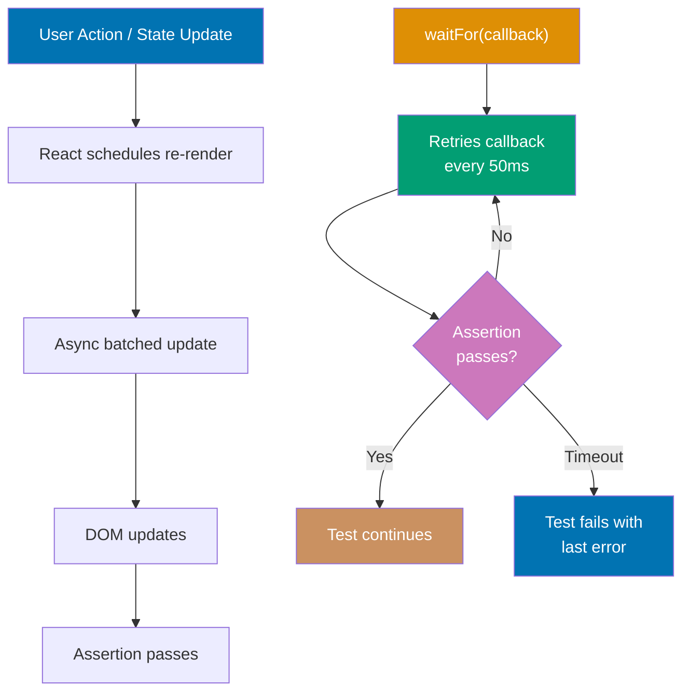
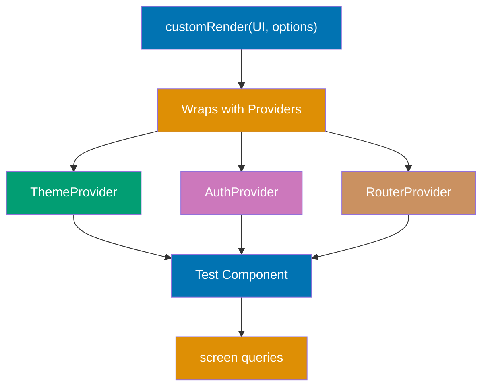

Build on Testing Library fundamentals through 27 annotated examples covering async testing, provider integration, hook testing, and production patterns. Each example is self-contained, runnable with `npx jest` or `npx vitest`, and demonstrates patterns used in real React applications.

## Async Testing Fundamentals (Examples 29-35)

### Example 29: waitFor - Waiting for DOM Updates

`waitFor()` retries an assertion until it passes or a timeout is reached. It solves the fundamental async challenge: React state updates are asynchronous, so assertions must wait for the DOM to reflect new state.



**Code**:

```typescript
import { render, screen, waitFor } from "@testing-library/react";
// => waitFor: retries assertion callback until pass or timeout
import userEvent from "@testing-library/user-event";
import { useState } from "react";

function AsyncCounter() {
  // => Counter with artificial async delay to simulate network/timer
  const [count, setCount] = useState(0);
  const [loading, setLoading] = useState(false);

  const increment = () => {
    setLoading(true);
    // => Shows loading state immediately
    setTimeout(() => {
      setCount((c) => c + 1);
      setLoading(false);
      // => State update fires after 100ms delay
    }, 100);
  };

  return (
    <div>
      {loading && <span>Loading...</span>}
      {/* Conditional loading indicator */}
      <p>Count: {count}</p>
      <button onClick={increment}>Increment</button>
    </div>
  );
}

test("waitFor retries assertion until DOM updates", async () => {
  const user = userEvent.setup();
  render(<AsyncCounter />);

  await user.click(screen.getByRole("button", { name: "Increment" }));
  // => Click fires synchronously, setTimeout starts
  // => loading = true, count still 0

  expect(screen.getByText("Loading...")).toBeInTheDocument();
  // => Synchronous assertion: loading state is immediate

  await waitFor(() => {
    // => waitFor: retries every 50ms, timeout 1000ms by default
    expect(screen.getByText("Count: 1")).toBeInTheDocument();
    // => Assertion inside: runs repeatedly until passes
    // => Passes after ~100ms when setTimeout fires
  });

  expect(screen.queryByText("Loading...")).not.toBeInTheDocument();
  // => After waitFor resolves, loading is gone
  // => Synchronous assertion - no waitFor needed
});
```

**Key Takeaway**: Wrap assertions about async state changes in `waitFor()`. The callback retries every 50ms until the assertion passes or the timeout (1000ms default) expires.

**Why It Matters**: React 18's concurrent rendering and batched state updates mean component DOM changes don't happen synchronously with state setter calls. Without `waitFor()`, tests assert on stale DOM state and produce false failures—or worse, false passes when the assertion accidentally matches stale content. `waitFor()` is the correct mechanism for all async DOM assertions, and understanding when to use it versus synchronous assertions is the critical skill that separates flaky test suites from reliable ones.

---

### Example 30: findBy\* Queries - Built-in Async Queries

`findBy*` queries combine `getBy*` behavior with `waitFor`. They're the most concise way to wait for elements that appear asynchronously.

```typescript
import { render, screen } from "@testing-library/react";
import { useState, useEffect } from "react";

function DataFetcher() {
  // => Component that loads data asynchronously
  const [data, setData] = useState<string | null>(null);
  const [error, setError] = useState<string | null>(null);

  useEffect(() => {
    // => Simulates async data fetch
    const timer = setTimeout(() => {
      setData("Loaded content from API");
      // => Simulates successful API response
    }, 100);
    return () => clearTimeout(timer);
    // => Cleanup: prevents state update after unmount
  }, []);

  if (error) return <p role="alert">{error}</p>;
  if (!data) return <p>Loading data...</p>;
  return <p>{data}</p>;
}

test("findBy* waits for async elements", async () => {
  render(<DataFetcher />);
  // => Component starts in loading state

  expect(screen.getByText("Loading data...")).toBeInTheDocument();
  // => Loading state immediately visible

  const content = await screen.findByText("Loaded content from API");
  // => findByText: equivalent to waitFor(() => screen.getByText(...))
  // => Returns Promise<HTMLElement>
  // => Waits up to 1000ms for element to appear
  // => content: <p>Loaded content from API</p>

  expect(content).toBeInTheDocument();
  // => Element found and in document
  // => Loading text should now be gone
  expect(screen.queryByText("Loading data...")).not.toBeInTheDocument();
  // => Loading replaced by loaded content

  // findByRole example
  render(<DataFetcher />);
  const loadedParagraph = await screen.findByRole("paragraph" as never);
  // => findByRole also available for async element waiting
  // => Less common but consistent with role-first query priority
  expect(loadedParagraph).toBeInTheDocument();
});
```

**Key Takeaway**: `findBy*` queries are `getBy*` wrapped in `waitFor`. Use them instead of `waitFor(() => screen.getByX())` for cleaner async element queries.

**Why It Matters**: The `findBy*` API reduces async test verbosity significantly. `await screen.findByText('Success')` expresses "wait for this text to appear" in a single readable line, versus the three-line `waitFor` equivalent. Beyond aesthetics, `findBy*` queries have slightly better error messages—they report what text or role was being waited for, rather than the generic "assertion failed" of a `waitFor` timeout. This query family is especially valuable for testing data-fetching components where the success state is the primary behavioral assertion.

---

### Example 31: waitForElementToBeRemoved

`waitForElementToBeRemoved()` waits for an element to disappear from the DOM. It's cleaner than `waitFor(() => expect(element).not.toBeInTheDocument())` and fails immediately if the element is already gone.

```typescript
import { render, screen, waitForElementToBeRemoved } from "@testing-library/react";
// => waitForElementToBeRemoved: waits for element removal from DOM
import { useState, useEffect } from "react";

function LoadingSpinner() {
  // => Component with loading state that clears after data loads
  const [loading, setLoading] = useState(true);
  const [message, setMessage] = useState("");

  useEffect(() => {
    const timer = setTimeout(() => {
      setLoading(false);
      setMessage("Data ready!");
      // => Simulates async operation completing
    }, 150);
    return () => clearTimeout(timer);
  }, []);

  return (
    <div>
      {loading && (
        <div role="status" aria-label="Loading">
          {/* role="status": polite live region (not urgent like alert) */}
          Loading, please wait...
        </div>
      )}
      {message && <p>{message}</p>}
    </div>
  );
}

test("waitForElementToBeRemoved - wait for loading to clear", async () => {
  render(<LoadingSpinner />);

  const loadingSpinner = screen.getByRole("status", { name: "Loading" });
  // => Capture reference before it disappears
  // => loadingSpinner: <div role="status" aria-label="Loading">

  expect(loadingSpinner).toBeInTheDocument();
  // => Verify initial loading state

  await waitForElementToBeRemoved(loadingSpinner);
  // => Waits until loadingSpinner is removed from DOM
  // => Retries every 50ms until element gone
  // => Fails immediately if element already removed
  // => Timeout: 1000ms default

  expect(screen.getByText("Data ready!")).toBeInTheDocument();
  // => After loading removed, data message appeared
  expect(screen.queryByRole("status")).not.toBeInTheDocument();
  // => Loading spinner completely gone
});
```

**Key Takeaway**: Use `waitForElementToBeRemoved()` when waiting for loading states, modals, or notifications to disappear. Pass the element reference directly for immediate detection of premature removal.

**Why It Matters**: Loading state testing is critical for user experience verification. Applications that leave loading spinners permanently visible, or that flash them incorrectly, create confusing experiences. `waitForElementToBeRemoved()` is more expressive than `waitFor` + not-assertion because it explicitly names the intent: "wait for this to disappear." It also provides better error messages—if the element disappears before being called, it throws "element was already removed," clearly indicating a test timing issue rather than a false pass.

---

### Example 32: Async User Events and Timing

Some user interactions trigger async sequences. Understanding how to coordinate async user actions with async DOM updates prevents race conditions in tests.

```typescript
import { render, screen, waitFor } from "@testing-library/react";
import userEvent from "@testing-library/user-event";
import { useState } from "react";

function AutoSave() {
  // => Input with debounced auto-save simulation
  const [value, setValue] = useState("");
  const [saved, setSaved] = useState(false);
  const [saving, setSaving] = useState(false);

  const handleChange = (e: React.ChangeEvent<HTMLInputElement>) => {
    setValue(e.target.value);
    setSaved(false);
    setSaving(false);
    // => Reset save status on new input
  };

  const handleBlur = () => {
    // => Triggers save when user leaves field
    if (value) {
      setSaving(true);
      setTimeout(() => {
        setSaving(false);
        setSaved(true);
        // => Simulates async save operation
      }, 200);
    }
  };

  return (
    <div>
      <label htmlFor="note">Note</label>
      <input
        id="note"
        value={value}
        onChange={handleChange}
        onBlur={handleBlur}
        // => onBlur: triggers when input loses focus
      />
      {saving && <span>Saving...</span>}
      {saved && <span>Saved!</span>}
      {/* Conditional status indicators */}
    </div>
  );
}

test("async user events with sequential timing", async () => {
  const user = userEvent.setup();
  render(<AutoSave />);

  const input = screen.getByLabelText("Note");

  await user.type(input, "My note content");
  // => Types text - no save triggered during typing
  expect(screen.queryByText("Saving...")).not.toBeInTheDocument();
  // => Save not triggered by typing alone

  await user.tab();
  // => Tab away from input - triggers onBlur
  // => onBlur fires: setSaving(true), setTimeout queued
  expect(screen.getByText("Saving...")).toBeInTheDocument();
  // => Saving indicator appears immediately after blur

  await waitFor(() => {
    expect(screen.getByText("Saved!")).toBeInTheDocument();
    // => Waits for setTimeout to complete (200ms)
    // => Saved! replaces Saving...
  });

  expect(screen.queryByText("Saving...")).not.toBeInTheDocument();
  // => Saving indicator replaced by Saved! indicator
});
```

**Key Takeaway**: Chain async user actions with `await` and use `waitFor()` for DOM updates that follow async operations triggered by those actions. Order matters: interact first, wait second.

**Why It Matters**: Auto-save, debounced search, and throttled interactions are common patterns where user actions trigger delayed async operations. Testing these requires understanding the event timeline: action fires synchronously, async operation starts, DOM updates after delay. Incorrect test sequencing (asserting before waiting, or waiting for the wrong thing) produces tests that pass incorrectly on fast machines and fail on slow CI servers. Understanding the action-wait-assert pattern is the foundation of reliable async component testing.

---

### Example 33: act() - Manual React Update Batching

`act()` wraps code that causes React state updates, ensuring React processes all updates before assertions. Most of the time, Testing Library handles `act()` automatically, but understanding it helps diagnose "act() warning" console errors.

```typescript
import { render, screen, act } from "@testing-library/react";
// => act: from @testing-library/react (wraps React's act from react-dom/test-utils)
import { useState, useEffect } from "react";

function TimedUpdate() {
  // => Component that updates state via timer (not user action)
  const [seconds, setSeconds] = useState(0);
  const [started, setStarted] = useState(false);

  const start = () => {
    setStarted(true);
    // => Starts the timer
  };

  useEffect(() => {
    if (!started) return;
    const interval = setInterval(() => {
      setSeconds((s) => s + 1);
      // => Increments every second
    }, 1000);
    return () => clearInterval(interval);
    // => Cleanup on unmount or when started changes
  }, [started]);

  return (
    <div>
      <p>Seconds: {seconds}</p>
      <button onClick={start}>Start Timer</button>
    </div>
  );
}

test("act() wraps state updates not triggered by userEvent", async () => {
  render(<TimedUpdate />);
  // => Initial: Seconds: 0, timer not started

  expect(screen.getByText("Seconds: 0")).toBeInTheDocument();

  // userEvent already wraps in act() internally
  const user = userEvent.setup({ delay: null });
  // => delay: null disables artificial delays for speed
  await user.click(screen.getByRole("button", { name: "Start Timer" }));
  // => userEvent.click automatically wraps in act()
  // => No manual act() needed for userEvent interactions

  await act(async () => {
    // => Manual act() for non-userEvent async state changes
    // => Wraps timer-driven state updates
    await new Promise((resolve) => setTimeout(resolve, 1100));
    // => Waits slightly more than 1 interval (1000ms)
  });
  // => React processes all state updates inside act()

  expect(screen.getByText("Seconds: 1")).toBeInTheDocument();
  // => Timer fired once, seconds incremented
});
```

**Key Takeaway**: `userEvent` wraps interactions in `act()` automatically. Use manual `act()` only for state changes driven by timers, intervals, or external events that Testing Library can't wrap automatically.

**Why It Matters**: The "not wrapped in act()" console warning is one of the most confusing messages in React testing. It occurs when state updates happen outside React's awareness—typically in setTimeout callbacks, WebSocket handlers, or external event emitters. These warnings indicate potential test reliability issues: the test may be asserting on intermediate state rather than final state. Understanding that `userEvent` handles `act()` automatically (covering 95% of cases) and when to use manual `act()` for the remaining 5% eliminates this entire class of warnings and the flaky tests they indicate.

---

### Example 34: Testing Async Error States

Components must gracefully handle async failures. Testing error states validates the complete async component lifecycle: loading, success, and failure paths.

```typescript
import { render, screen, waitFor } from "@testing-library/react";
import { useState, useEffect } from "react";

interface UserData {
  name: string;
  email: string;
}

function UserProfile({ userId }: { userId: string }) {
  // => Component with three states: loading, success, error
  const [user, setUser] = useState<UserData | null>(null);
  const [loading, setLoading] = useState(true);
  const [error, setError] = useState<string | null>(null);

  useEffect(() => {
    const fetchUser = async () => {
      setLoading(true);
      setError(null);
      try {
        if (userId === "invalid") {
          throw new Error("User not found");
          // => Simulates API 404 error
        }
        // Simulates successful API response
        await new Promise((resolve) => setTimeout(resolve, 50));
        setUser({ name: "Alice", email: "alice@example.com" });
      } catch (err) {
        setError(err instanceof Error ? err.message : "Unknown error");
      } finally {
        setLoading(false);
        // => Always clear loading, regardless of success/failure
      }
    };
    void fetchUser();
  }, [userId]);

  if (loading) return <p>Loading user...</p>;
  if (error) return <p role="alert">Error: {error}</p>;
  if (!user) return null;
  return (
    <div>
      <h2>{user.name}</h2>
      <p>{user.email}</p>
    </div>
  );
}

test("async success state", async () => {
  render(<UserProfile userId="123" />);
  expect(screen.getByText("Loading user...")).toBeInTheDocument();
  // => Initial loading state

  await waitFor(() => {
    expect(screen.getByText("Alice")).toBeInTheDocument();
    // => Waits for async fetch to complete
  });
  expect(screen.getByText("alice@example.com")).toBeInTheDocument();
  // => Full user data rendered
});

test("async error state", async () => {
  render(<UserProfile userId="invalid" />);
  // => "invalid" userId triggers simulated error

  await waitFor(() => {
    expect(screen.getByRole("alert")).toBeInTheDocument();
    // => Waits for error state to render
  });
  expect(screen.getByRole("alert")).toHaveTextContent("Error: User not found");
  // => Error message rendered with correct content
  expect(screen.queryByText("Loading user...")).not.toBeInTheDocument();
  // => Loading state cleared after error
});
```

**Key Takeaway**: Test all three async states: loading (synchronous assertion), success (after `waitFor`), and error (after `waitFor` with role="alert" assertion). Never test only the happy path.

**Why It Matters**: Production applications fail in all three states, but most component tests only cover success. Network failures, API downtime, and invalid data are operational realities—components that don't handle errors gracefully produce blank screens or infinite loading states that confuse users and lose business. Testing error states as thoroughly as success states ensures the error recovery paths work correctly. Error states also have accessibility requirements: errors must be announced to screen readers (via `role="alert"` or `aria-live`) and must provide actionable recovery instructions, not just "Something went wrong."

---

### Example 35: findAllBy\* and Multiple Async Elements

`findAllBy*` waits for multiple async elements to appear. It's useful when lists, grids, or repeated elements load asynchronously.

```typescript
import { render, screen } from "@testing-library/react";
import { useState, useEffect } from "react";

interface Product {
  id: number;
  name: string;
  inStock: boolean;
}

function ProductGrid() {
  // => Grid that loads product data asynchronously
  const [products, setProducts] = useState<Product[]>([]);

  useEffect(() => {
    setTimeout(() => {
      setProducts([
        { id: 1, name: "Widget A", inStock: true },
        { id: 2, name: "Widget B", inStock: false },
        { id: 3, name: "Widget C", inStock: true },
      ]);
      // => Simulates async product fetch
    }, 100);
  }, []);

  return (
    <ul>
      {products.length === 0 && <li>Loading products...</li>}
      {products.map((product) => (
        <li key={product.id}>
          {product.name}
          {product.inStock ? (
            <button>Add to Cart</button>
          ) : (
            <span>Out of Stock</span>
          )}
        </li>
      ))}
    </ul>
  );
}

test("findAllBy* waits for multiple async elements", async () => {
  render(<ProductGrid />);

  expect(screen.getByText("Loading products...")).toBeInTheDocument();
  // => Empty state before products load

  const listItems = await screen.findAllByRole("listitem");
  // => findAllByRole: waits for any listitem elements to appear
  // => Returns Promise<HTMLElement[]>
  // => Waits until at least one match exists, then returns all
  // => listItems: 3 <li> elements

  expect(listItems).toHaveLength(3);
  // => All 3 products loaded

  const addButtons = screen.getAllByRole("button", { name: "Add to Cart" });
  // => Synchronous after findAllBy: products are now in DOM
  // => Only in-stock products have buttons
  expect(addButtons).toHaveLength(2);
  // => Widget A and Widget C are in stock

  expect(screen.getByText("Out of Stock")).toBeInTheDocument();
  // => Widget B shows out of stock status
});
```

**Key Takeaway**: `findAllBy*` returns a promise that resolves to an array when elements appear. Use it for async lists, then use synchronous `getAllBy*` for subsequent queries in the same test.

**Why It Matters**: Async list rendering is one of the most common patterns in data-driven React applications—API responses populate product grids, search results, and content feeds. Testing that all items appear (not just one) after async loading validates the complete rendering pipeline. `findAllBy*` ensures the test waits for the full list rather than asserting on partial data, catching race conditions where only some items render due to batching bugs or incomplete state updates.

---

## Custom Render and Providers (Examples 36-40)

### Example 36: Custom render() with Context Providers

Most production React apps require context providers (theme, auth, router). A custom `render` function wraps components with required providers, eliminating repetition across test files.



**Code**:

```typescript
import { render, screen, RenderOptions } from "@testing-library/react";
// => RenderOptions: TypeScript type for render configuration
import { createContext, useContext, ReactNode } from "react";

// Theme context setup
const ThemeContext = createContext({ theme: "light" });
// => ThemeContext: provides theme value to component tree

function ThemeProvider({ children, theme = "light" }: { children: ReactNode; theme?: string }) {
  // => Provider wraps app with theme value
  return (
    <ThemeContext.Provider value={{ theme }}>
      {children}
    </ThemeContext.Provider>
  );
}

// Component under test
function ThemedButton() {
  // => Button that reads theme from context
  const { theme } = useContext(ThemeContext);
  // => useContext: reads theme value from nearest ThemeProvider
  return (
    <button data-theme={theme}>
      Theme: {theme}
    </button>
  );
}

// Custom render function - define in test-utils.tsx
function customRender(ui: React.ReactElement, options?: RenderOptions & { theme?: string }) {
  // => Custom render wraps UI with required providers
  const { theme = "light", ...renderOptions } = options ?? {};
  // => Extracts theme option, passes rest to render

  return render(
    <ThemeProvider theme={theme}>
      {ui}
      {/* Wraps test component with providers */}
    </ThemeProvider>,
    renderOptions
  );
}

test("custom render provides context to component", () => {
  customRender(<ThemedButton />);
  // => Renders with default light theme

  expect(screen.getByRole("button")).toHaveTextContent("Theme: light");
  // => Component reads theme from ThemeProvider
  expect(screen.getByRole("button")).toHaveAttribute("data-theme", "light");
});

test("custom render with dark theme option", () => {
  customRender(<ThemedButton />, { theme: "dark" });
  // => Passes custom theme through render options
  // => ThemeProvider receives theme="dark"

  expect(screen.getByRole("button")).toHaveTextContent("Theme: dark");
  // => Component reads dark theme from context
});
```

**Key Takeaway**: Create a custom `render` function that wraps components with required providers. Export it from a shared `test-utils` file and import it instead of `@testing-library/react` in test files.

**Why It Matters**: Repeating provider setup in every test file violates the DRY principle and makes provider changes expensive—adding a new required provider means updating every test file. A custom render function centralizes this setup, making it trivial to add providers. The Testing Library documentation explicitly recommends this pattern for production applications. Custom render functions also make test configuration explicit (passing `theme: 'dark'` is self-documenting) rather than relying on default context values that may not reflect the scenarios being tested.

---

### Example 37: Testing Components with React Router

Components that use routing hooks (`useNavigate`, `useParams`, `useLocation`) require a Router provider in tests. Wrapping with `MemoryRouter` or `BrowserRouter` enables testing navigation behavior.

```typescript
import { render, screen } from "@testing-library/react";
import userEvent from "@testing-library/user-event";
import { MemoryRouter, Routes, Route, useNavigate, useParams } from "react-router-dom";
// => MemoryRouter: in-memory router for testing (no browser history API)

function UserProfile() {
  // => Component using useParams to read URL parameter
  const { id } = useParams<{ id: string }>();
  // => useParams: reads route parameters from current URL
  // => id: string from /users/:id route
  return <h1>User Profile: {id}</h1>;
}

function NavigationButton() {
  // => Component using useNavigate for programmatic navigation
  const navigate = useNavigate();
  // => useNavigate: returns navigation function
  return (
    <button onClick={() => navigate("/users/42")}>
      View User 42
    </button>
  );
}

test("useParams reads route parameter", () => {
  render(
    <MemoryRouter initialEntries={["/users/123"]}>
      {/* initialEntries: sets initial URL for MemoryRouter */}
      <Routes>
        <Route path="/users/:id" element={<UserProfile />} />
        {/* Route: maps URL pattern to component */}
      </Routes>
    </MemoryRouter>
  );

  expect(screen.getByRole("heading")).toHaveTextContent("User Profile: 123");
  // => useParams extracted "123" from URL path
});

test("useNavigate changes route on click", async () => {
  const user = userEvent.setup();
  render(
    <MemoryRouter initialEntries={["/"]}>
      <Routes>
        <Route path="/" element={<NavigationButton />} />
        <Route path="/users/:id" element={<UserProfile />} />
        {/* Both routes defined for navigation to work */}
      </Routes>
    </MemoryRouter>
  );

  await user.click(screen.getByRole("button", { name: "View User 42" }));
  // => Click triggers navigate("/users/42")
  // => MemoryRouter updates URL in memory
  // => Route matching re-renders to UserProfile component

  expect(screen.getByRole("heading")).toHaveTextContent("User Profile: 42");
  // => Navigation occurred: UserProfile rendered with id=42
});
```

**Key Takeaway**: Use `MemoryRouter` with `initialEntries` to test routing-dependent components. Include both source and destination routes so navigation actions can render the target component.

**Why It Matters**: Navigation is a fundamental user interaction in single-page applications. Components using `useNavigate`, `useParams`, and `useSearchParams` are untestable without a Router context—they throw errors or return undefined values. `MemoryRouter` provides a full routing environment without browser history API dependencies, making tests portable across environments (CI, jsdom). Testing navigation correctness—that clicks go to the right routes with the right parameters—validates the user's journey through the application, catching routing bugs before they create confusing URL experiences in production.

---

### Example 38: renderHook - Testing Custom Hooks

`renderHook` tests custom React hooks in isolation, without requiring a wrapper component. It provides the hooks their React context (state, effects, context) while keeping tests focused on hook behavior.

```typescript
import { renderHook, act } from "@testing-library/react";
// => renderHook: renders a hook in isolation
// => act: wraps state-updating code (exported from testing-library)

import { useState, useCallback } from "react";

function useCounter(initialValue = 0) {
  // => Custom hook encapsulating counter logic
  const [count, setCount] = useState(initialValue);
  // => count: current counter value

  const increment = useCallback(() => setCount((c) => c + 1), []);
  // => increment: memoized function to increase count
  const decrement = useCallback(() => setCount((c) => c - 1), []);
  // => decrement: memoized function to decrease count
  const reset = useCallback(() => setCount(initialValue), [initialValue]);
  // => reset: restores initial value

  return { count, increment, decrement, reset };
  // => Returns object with state and actions
}

test("useCounter initial value", () => {
  const { result } = renderHook(() => useCounter(10));
  // => renderHook: renders hook in minimal component wrapper
  // => result: object with .current property
  // => result.current: return value of the hook

  expect(result.current.count).toBe(10);
  // => Accesses hook return value via result.current
  // => Initial value is 10 as passed
});

test("useCounter increment and decrement", () => {
  const { result } = renderHook(() => useCounter());
  // => Default initial value: 0

  act(() => {
    result.current.increment();
    // => Calls increment function from hook
    // => State update must be wrapped in act()
  });
  // => act() ensures React processes state update

  expect(result.current.count).toBe(1);
  // => count incremented from 0 to 1

  act(() => {
    result.current.decrement();
    result.current.decrement();
    // => Multiple calls in single act() batched together
  });
  expect(result.current.count).toBe(-1);
  // => count: 1 - 2 = -1

  act(() => {
    result.current.reset();
    // => Reset to initial value (0)
  });
  expect(result.current.count).toBe(0);
  // => count reset to initial 0
});
```

**Key Takeaway**: Use `renderHook` to test custom hooks directly. Access return values via `result.current`. Wrap all state-updating calls in `act()`.

**Why It Matters**: Custom hooks encapsulate stateful logic that would otherwise be coupled to component implementation. Testing hooks directly (with `renderHook`) separates the concern of "does the logic work" from "does the component render correctly"—two independent quality concerns. This separation makes hook tests faster, more focused, and more maintainable than testing hook behavior through component integration tests. When a hook test fails, the bug is clearly in the hook, not the component that uses it, reducing debugging time significantly.

---

### Example 39: renderHook with Providers and Async

Hooks that consume context or perform async operations need provider setup and async testing patterns. `renderHook` supports both through its `wrapper` option.

```typescript
import { renderHook, act, waitFor } from "@testing-library/react";
import { createContext, useContext, useState, ReactNode } from "react";

// Auth context for hook dependency
const AuthContext = createContext<{ userId: string | null }>({ userId: null });

function AuthProvider({ children, userId }: { children: ReactNode; userId: string | null }) {
  // => Provides userId to consuming hooks
  return (
    <AuthContext.Provider value={{ userId }}>
      {children}
    </AuthContext.Provider>
  );
}

function useCurrentUser() {
  // => Custom hook consuming auth context + async data fetch
  const { userId } = useContext(AuthContext);
  // => Reads userId from nearest AuthProvider
  const [userData, setUserData] = useState<{ name: string } | null>(null);
  const [loading, setLoading] = useState(!!userId);
  // => Start loading only if userId exists

  if (userId && !userData && loading) {
    // => Simplified fetch trigger (in real code: useEffect)
    setTimeout(() => {
      setUserData({ name: "Alice" });
      setLoading(false);
      // => Simulates async user fetch
    }, 50);
  }

  return { userId, userData, loading };
}

test("renderHook with context provider wrapper", async () => {
  const { result } = renderHook(() => useCurrentUser(), {
    wrapper: ({ children }) => (
      // => wrapper: wraps hook in provider hierarchy
      // => Receives children: the hook's test component
      <AuthProvider userId="user-123">
        {children}
      </AuthProvider>
    ),
  });
  // => Hook renders with AuthProvider context

  expect(result.current.userId).toBe("user-123");
  // => useContext reads userId from wrapper's AuthProvider
  expect(result.current.loading).toBe(true);
  // => Initial state: loading because userId exists

  await waitFor(() => {
    expect(result.current.loading).toBe(false);
    // => Waits for async user fetch to complete
  });

  expect(result.current.userData).toEqual({ name: "Alice" });
  // => User data loaded after async operation
});
```

**Key Takeaway**: Pass a `wrapper` option to `renderHook` to provide context dependencies. This is the hook equivalent of custom render's provider wrapping pattern.

**Why It Matters**: Custom hooks rarely exist in isolation—they consume auth context, theme context, or feature flag providers. Testing them without these dependencies produces incorrect results (undefined context values, missing feature flags) that don't reflect real usage. The `wrapper` option makes hook tests accurate by providing the exact context the hook expects in production. Combining `wrapper` with async `waitFor` assertions enables complete hook lifecycle testing: initial state, async resolution, and context-dependent behavior all in one focused test.

---

### Example 40: Testing React Context Consumer Components

Context-consuming components need provider setup in tests. Testing context integration verifies that components correctly read and respond to context values.

```typescript
import { render, screen } from "@testing-library/react";
import userEvent from "@testing-library/user-event";
import { createContext, useContext, useState, ReactNode } from "react";

// Notification context
interface NotificationContextType {
  notifications: string[];
  addNotification: (message: string) => void;
  clearAll: () => void;
}

const NotificationContext = createContext<NotificationContextType>({
  notifications: [],
  addNotification: () => {},
  clearAll: () => {},
});

function NotificationProvider({ children }: { children: ReactNode }) {
  // => Full provider with state management
  const [notifications, setNotifications] = useState<string[]>([]);
  const addNotification = (message: string) =>
    setNotifications((prev) => [...prev, message]);
  const clearAll = () => setNotifications([]);
  return (
    <NotificationContext.Provider value={{ notifications, addNotification, clearAll }}>
      {children}
    </NotificationContext.Provider>
  );
}

function NotificationBell() {
  // => Component reads notification count from context
  const { notifications } = useContext(NotificationContext);
  return (
    <button aria-label={`Notifications: ${notifications.length}`}>
      {notifications.length > 0 ? `(${notifications.length})` : "No notifications"}
    </button>
  );
}

function AddNotificationButton() {
  // => Component adds notifications via context
  const { addNotification } = useContext(NotificationContext);
  return (
    <button onClick={() => addNotification("New message!")}>
      Add Notification
    </button>
  );
}

test("context consumers react to shared state", async () => {
  const user = userEvent.setup();
  render(
    <NotificationProvider>
      <NotificationBell />
      <AddNotificationButton />
      {/* Both components share same context instance */}
    </NotificationProvider>
  );

  expect(screen.getByLabelText("Notifications: 0")).toBeInTheDocument();
  // => Bell shows 0 notifications initially
  expect(screen.getByText("No notifications")).toBeInTheDocument();

  await user.click(screen.getByRole("button", { name: "Add Notification" }));
  // => Adds notification via context

  expect(screen.getByLabelText("Notifications: 1")).toBeInTheDocument();
  // => Bell updates: reads new notifications array from context
  expect(screen.getByText("(1)")).toBeInTheDocument();
  // => Count displayed
});
```

**Key Takeaway**: Render context consumers inside their provider to test context integration. Test that context state changes propagate correctly to all consumers.

**Why It Matters**: Context is React's primary mechanism for sharing state across component boundaries without prop drilling. Testing context integration verifies the entire context pipeline: that providers initialize state correctly, that actions update shared state, and that all consumers re-render with new values. Context bugs are subtle—a provider that doesn't update consumers correctly, or a consumer that reads from the wrong context level, causes UI inconsistencies that are difficult to reproduce manually but straightforward to detect with integration tests.

---

## Form Testing Patterns (Examples 41-43)

### Example 41: Testing Form Validation Workflows

Production forms validate on blur, on change, and on submit. Testing all three validation triggers ensures users receive timely, accurate feedback.

```typescript
import { render, screen, waitFor } from "@testing-library/react";
import userEvent from "@testing-library/user-event";
import { useState } from "react";

function RegistrationForm() {
  // => Form with multiple validation modes
  const [errors, setErrors] = useState<Record<string, string>>({});
  const [submitted, setSubmitted] = useState(false);

  const validateEmail = (email: string) => {
    if (!email) return "Email is required";
    if (!/^[^\s@]+@[^\s@]+\.[^\s@]+$/.test(email)) return "Invalid email format";
    return "";
    // => Returns empty string if valid
  };

  const handleSubmit = (e: React.FormEvent<HTMLFormElement>) => {
    e.preventDefault();
    const formData = new FormData(e.currentTarget);
    const email = String(formData.get("email") ?? "");
    const emailError = validateEmail(email);
    if (emailError) {
      setErrors({ email: emailError });
      // => Shows error on submit attempt
    } else {
      setSubmitted(true);
    }
  };

  const handleEmailBlur = (e: React.FocusEvent<HTMLInputElement>) => {
    const error = validateEmail(e.target.value);
    setErrors((prev) => ({ ...prev, email: error }));
    // => Validates on blur (when user leaves field)
  };

  if (submitted) return <p>Registration complete!</p>;

  return (
    <form onSubmit={handleSubmit}>
      <label htmlFor="email">Email</label>
      <input
        id="email"
        name="email"
        type="email"
        onBlur={handleEmailBlur}
        aria-describedby={errors.email ? "email-error" : undefined}
        aria-invalid={errors.email ? "true" : "false"}
      />
      {errors.email && (
        <span id="email-error" role="alert">{errors.email}</span>
      )}
      <button type="submit">Register</button>
    </form>
  );
}

test("validates email on blur", async () => {
  const user = userEvent.setup();
  render(<RegistrationForm />);

  const emailInput = screen.getByLabelText("Email");
  await user.click(emailInput);
  await user.tab();
  // => Click to focus, Tab to blur (triggers onBlur)
  // => Empty field triggers: "Email is required"

  expect(screen.getByRole("alert")).toHaveTextContent("Email is required");
  // => Blur validation showed error

  await user.type(emailInput, "notanemail");
  // => Types invalid email format
  await user.tab();
  // => Blur triggers re-validation
  expect(screen.getByRole("alert")).toHaveTextContent("Invalid email format");
  // => Error updated to format validation message
});

test("validates and submits form", async () => {
  const user = userEvent.setup();
  render(<RegistrationForm />);

  await user.click(screen.getByRole("button", { name: "Register" }));
  // => Submit with empty email
  await waitFor(() => {
    expect(screen.getByRole("alert")).toHaveTextContent("Email is required");
    // => Submit shows validation errors
  });

  await user.type(screen.getByLabelText("Email"), "alice@example.com");
  await user.click(screen.getByRole("button", { name: "Register" }));
  // => Submit with valid email
  expect(screen.getByText("Registration complete!")).toBeInTheDocument();
  // => Valid submission succeeded
});
```

**Key Takeaway**: Test validation at each trigger point: blur, input change, and form submit. Use separate tests for each trigger to isolate validation behavior.

**Why It Matters**: Validation UX timing is as important as validation correctness. Showing errors before users have a chance to fill fields (validate on first render) is hostile UX. Showing errors only on submit (never on blur) is confusing for long forms. Testing each trigger point independently verifies that validation fires at exactly the right moment, neither too early (anxious) nor too late (unresponsive). This timing testing is impossible with snapshot tests or shallow rendering—it requires real interaction simulation that only `userEvent` provides.

---

### Example 42: Testing Modal Dialogs

Modals require testing open/close behavior, focus trapping, keyboard dismissal, and accessible role structure.

```typescript
import { render, screen, waitFor } from "@testing-library/react";
import userEvent from "@testing-library/user-event";
import { useState, useEffect, useRef } from "react";

function ConfirmationModal({ onConfirm, onCancel }: {
  onConfirm: () => void;
  onCancel: () => void;
}) {
  // => Modal with focus management
  const confirmButtonRef = useRef<HTMLButtonElement>(null);

  useEffect(() => {
    confirmButtonRef.current?.focus();
    // => Focus first action button when modal opens
    // => WCAG: focus must move to modal when it opens
  }, []);

  return (
    <div
      role="dialog"
      aria-modal="true"
      aria-labelledby="modal-title"
      aria-describedby="modal-desc"
    >
      <h2 id="modal-title">Confirm Delete</h2>
      <p id="modal-desc">This action cannot be undone. Are you sure?</p>
      <button ref={confirmButtonRef} onClick={onConfirm}>Confirm</button>
      <button onClick={onCancel}>Cancel</button>
    </div>
  );
}

function DeleteButton() {
  // => Button that opens confirmation modal
  const [showModal, setShowModal] = useState(false);
  const [deleted, setDeleted] = useState(false);

  return (
    <div>
      {!deleted && (
        <button onClick={() => setShowModal(true)}>Delete Item</button>
      )}
      {deleted && <p>Item deleted</p>}
      {showModal && (
        <ConfirmationModal
          onConfirm={() => { setDeleted(true); setShowModal(false); }}
          onCancel={() => setShowModal(false)}
        />
      )}
    </div>
  );
}

test("modal opens, has correct roles, and closes on confirm", async () => {
  const user = userEvent.setup();
  render(<DeleteButton />);

  expect(screen.queryByRole("dialog")).not.toBeInTheDocument();
  // => Modal hidden initially

  await user.click(screen.getByRole("button", { name: "Delete Item" }));
  // => Opens modal

  const modal = screen.getByRole("dialog", { name: "Confirm Delete" });
  // => getByRole("dialog"): finds element with role=dialog
  // => { name: "Confirm Delete" }: matches by aria-labelledby text
  expect(modal).toBeInTheDocument();

  const confirmButton = screen.getByRole("button", { name: "Confirm" });
  expect(confirmButton).toHaveFocus();
  // => Focus automatically moved to Confirm button on open

  await user.click(confirmButton);
  // => Confirms deletion

  await waitFor(() => {
    expect(screen.queryByRole("dialog")).not.toBeInTheDocument();
    // => Modal closed after confirmation
  });
  expect(screen.getByText("Item deleted")).toBeInTheDocument();
  // => Deletion confirmed
});

test("modal closes on cancel", async () => {
  const user = userEvent.setup();
  render(<DeleteButton />);
  await user.click(screen.getByRole("button", { name: "Delete Item" }));
  await user.click(screen.getByRole("button", { name: "Cancel" }));
  // => Cancels without confirming

  expect(screen.queryByRole("dialog")).not.toBeInTheDocument();
  // => Modal closed
  expect(screen.queryByText("Item deleted")).not.toBeInTheDocument();
  // => Item not deleted (cancel preserved state)
});
```

**Key Takeaway**: Test modals for correct role structure, focus management (WCAG requires focus to move to the modal), and that both confirm and cancel paths produce correct outcomes.

**Why It Matters**: Modal dialogs are high-stakes UI components where accessibility failures have severe consequences. WCAG 2.1 requires that focus moves to modals when they open, that focus is trapped inside while open, and that focus returns to the trigger element when closed. Testing these requirements with `toHaveFocus()` makes modal accessibility verification automatic and regression-proof. Additionally, modals that don't properly manage state on cancel (inadvertently performing the cancelled action) cause data loss and user trust issues that are often missed by visual testing.

---

### Example 43: Testing Navigation and Route Changes

Applications navigate between routes based on user actions. Testing navigation verifies that interactions correctly transition between application states.

```typescript
import { render, screen } from "@testing-library/react";
import userEvent from "@testing-library/user-event";
import { MemoryRouter, Routes, Route, Link, useNavigate } from "react-router-dom";

function HomePage() {
  return (
    <div>
      <h1>Home Page</h1>
      <Link to="/about">Go to About</Link>
      {/* Link: renders <a> with router-aware navigation */}
      <Link to="/users/42">View User 42</Link>
    </div>
  );
}

function AboutPage() {
  const navigate = useNavigate();
  // => useNavigate: programmatic navigation function
  return (
    <div>
      <h1>About Page</h1>
      <button onClick={() => navigate(-1)}>Go Back</button>
      {/* navigate(-1): browser history back navigation */}
    </div>
  );
}

function UserPage({ id }: { id?: string }) {
  return <h1>User {id}</h1>;
}

function App() {
  return (
    <Routes>
      <Route path="/" element={<HomePage />} />
      <Route path="/about" element={<AboutPage />} />
      <Route path="/users/:id" element={<UserPage id="42" />} />
    </Routes>
  );
}

test("Link navigation changes route", async () => {
  const user = userEvent.setup();
  render(
    <MemoryRouter initialEntries={["/"]}>
      <App />
    </MemoryRouter>
  );

  expect(screen.getByRole("heading", { name: "Home Page" })).toBeInTheDocument();
  // => Starts on home page

  await user.click(screen.getByRole("link", { name: "Go to About" }));
  // => Clicks Link: navigates to /about
  // => MemoryRouter handles in-memory navigation

  expect(screen.getByRole("heading", { name: "About Page" })).toBeInTheDocument();
  // => Route changed: About page rendered
  expect(screen.queryByRole("heading", { name: "Home Page" })).not.toBeInTheDocument();
  // => Home page unmounted

  await user.click(screen.getByRole("button", { name: "Go Back" }));
  // => navigate(-1): goes back in history

  expect(screen.getByRole("heading", { name: "Home Page" })).toBeInTheDocument();
  // => Back navigation returned to home page
});
```

**Key Takeaway**: Test navigation by clicking links and buttons, then asserting on the destination page's content. `MemoryRouter` with `initialEntries` controls starting location.

**Why It Matters**: Navigation testing validates the core user journey through an application. A broken link or incorrect route transition prevents users from reaching their intended destination—fundamentally breaking the product's value delivery. Testing with `getByRole("link")` additionally verifies that navigation elements are implemented as actual anchor tags (not div-based pseudo-links), which is a common accessibility violation. Non-anchor "links" aren't keyboard navigable and aren't announced correctly by screen readers, making accessible navigation testing an automatic quality gate for routing correctness.

---

## Accessibility Testing (Examples 44-46)

### Example 44: Accessible Queries as Accessibility Tests

The very act of using `getByRole()` and `getByLabelText()` is an accessibility test. When these queries fail, the component has accessibility issues, not just test issues.

```typescript
import { render, screen } from "@testing-library/react";

function InaccessibleForm() {
  // => BAD: Form without proper accessibility attributes
  return (
    <div>
      <div onClick={() => {}}>Click me</div>
      {/* No role: not announced as button */}
      <div className="input-field" />
      {/* No label, no role: completely opaque to screen readers */}
    </div>
  );
}

function AccessibleForm() {
  // => GOOD: Form with proper accessibility attributes
  return (
    <form>
      <label htmlFor="name">Full Name</label>
      {/* Visible label with htmlFor association */}
      <input id="name" type="text" required aria-required="true" />
      {/* Properly labeled input with required indicators */}
      <button type="submit">Submit Form</button>
      {/* Semantic button with descriptive text */}
    </form>
  );
}

test("accessible form elements are queryable by role", () => {
  render(<AccessibleForm />);
  // => Accessible form: all elements have semantic roles and labels

  expect(screen.getByLabelText("Full Name")).toBeInTheDocument();
  // => PASSES: input has associated label
  // => If this query fails: accessibility bug (no label association)

  expect(screen.getByRole("button", { name: "Submit Form" })).toBeInTheDocument();
  // => PASSES: button has semantic role and accessible name
  // => If this fails: accessibility bug (no button text or aria-label)

  expect(screen.getByRole("textbox", { name: "Full Name" })).toBeRequired();
  // => PASSES: input is labeled and required
  // => Tests both accessibility and functional requirement
});

test("inaccessible elements fail role queries", () => {
  render(<InaccessibleForm />);
  // => Inaccessible: div-based elements with no ARIA

  expect(screen.queryByRole("button")).not.toBeInTheDocument();
  // => No buttons found: the div "Click me" has no button role
  // => This failing assertion reveals: the div should be a <button>

  // The inaccessible form shows no properly labeled inputs:
  expect(screen.queryAllByRole("textbox")).toHaveLength(0);
  // => No inputs with textbox role found
  // => The div.input-field has no semantic meaning
});
```

**Key Takeaway**: Role-based queries are passive accessibility tests. When `getByRole('button', { name: 'X' })` fails, the element lacks proper ARIA role or accessible name—fix the component, not the test.

**Why It Matters**: Testing Library's query priority (role > label > placeholder > text > testId) was deliberately designed so that the most semantically correct queries are the easiest to use. This creates a virtuous cycle: components with poor accessibility are harder to test, motivating developers to fix accessibility rather than work around it. Every `getByRole()` call that passes is proof of accessible markup; every `getByRole()` that requires working around to `getByTestId()` is a signal that the component needs accessibility improvement. Testing becomes accessibility compliance.

---

### Example 45: jest-axe for Automated Accessibility Auditing

`jest-axe` integrates the `axe-core` accessibility engine with Jest. It automatically detects hundreds of accessibility violations as part of the test suite.

```typescript
import { render } from "@testing-library/react";
import { axe, toHaveNoViolations } from "jest-axe";
// => axe: runs axe-core audit on rendered HTML
// => toHaveNoViolations: jest matcher for axe results

expect.extend(toHaveNoViolations);
// => Adds toHaveNoViolations to Jest's matcher library
// => Required once per test file (or in jest setup)

function GoodForm() {
  // => Accessible form that should pass axe audit
  return (
    <form aria-label="Contact form">
      {/* aria-label: names the form landmark */}
      <label htmlFor="message">Message</label>
      <textarea id="message" aria-required="true" />
      <button type="submit">Send</button>
    </form>
  );
}

function BadForm() {
  // => Inaccessible form with known violations
  return (
    <div>
      <input type="text" />
      {/* VIOLATION: Input has no label */}
      
      {/* VIOLATION: Image has no alt text */}
      <div onClick={() => {}} role="button">
        {/* VIOLATION: Interactive div missing tabindex for keyboard access */}
        Click
      </div>
    </div>
  );
}

test("accessible form passes axe audit", async () => {
  const { container } = render(<GoodForm />);
  // => container: the rendered HTML element

  const results = await axe(container);
  // => axe: runs full accessibility audit on container
  // => Checks: color contrast, ARIA usage, keyboard access, etc.
  // => Returns results object with violations array

  expect(results).toHaveNoViolations();
  // => toHaveNoViolations: asserts violations array is empty
  // => Fails with detailed violation list if any found
});

test("inaccessible form has axe violations", async () => {
  const { container } = render(<BadForm />);
  const results = await axe(container);

  // Demonstrating that violations are detected:
  expect(results.violations.length).toBeGreaterThan(0);
  // => violations.length > 0: proves axe detected issues
  // => In real tests, you'd fix violations until toHaveNoViolations passes
});
```

**Key Takeaway**: Add `axe` checks to tests for components that are complex or frequently modified. `toHaveNoViolations()` catches a broad range of accessibility issues automatically, including color contrast, ARIA misuse, and missing attributes.

**Why It Matters**: `axe-core` (the engine behind `jest-axe`) is the industry-standard automated accessibility checker—it's embedded in browser DevTools, Lighthouse, and enterprise compliance tools. Adding axe tests to component tests creates a two-layer accessibility defense: structural testing via role queries (does the element have the right semantics?) and compliance testing via axe (does the component meet WCAG standards?). axe catches violations that human reviewers miss in large codebases: insufficient color contrast, missing ARIA references, and landmark structure issues are detectable automatically at zero extra development cost.

---

### Example 46: Testing ARIA Live Regions and Announcements

ARIA live regions announce content changes to screen readers without focus movement. Testing them ensures screen reader users receive the same real-time information as visual users.

```typescript
import { render, screen } from "@testing-library/react";
import userEvent from "@testing-library/user-event";
import { useState } from "react";

function SearchWithStatus() {
  // => Search component with accessible status announcements
  const [query, setQuery] = useState("");
  const [results, setResults] = useState<string[]>([]);
  const [status, setStatus] = useState("Enter a search term");

  const handleSearch = () => {
    if (!query.trim()) {
      setStatus("Please enter a search term");
      setResults([]);
      return;
    }
    // Simulates search
    const found = ["React", "Redux", "Router"].filter((item) =>
      item.toLowerCase().includes(query.toLowerCase())
    );
    setResults(found);
    setStatus(found.length > 0
      ? `Found ${found.length} result${found.length !== 1 ? "s" : ""}`
      : "No results found"
    );
    // => Updates status based on search results
  };

  return (
    <div>
      <label htmlFor="search-input">Search</label>
      <input
        id="search-input"
        value={query}
        onChange={(e) => setQuery(e.target.value)}
      />
      <button onClick={handleSearch}>Search</button>
      <div
        role="status"
        aria-live="polite"
        aria-atomic="true"
      >
        {/* role="status": polite live region */}
        {/* aria-live="polite": announces after current speech finishes */}
        {/* aria-atomic="true": announces entire region content on change */}
        {status}
      </div>
      <ul>
        {results.map((r) => <li key={r}>{r}</li>)}
      </ul>
    </div>
  );
}

test("live region updates with search status", async () => {
  const user = userEvent.setup();
  render(<SearchWithStatus />);

  const statusRegion = screen.getByRole("status");
  // => role="status": polite live region
  // => Initial content: "Enter a search term"
  expect(statusRegion).toHaveTextContent("Enter a search term");

  await user.type(screen.getByLabelText("Search"), "React");
  await user.click(screen.getByRole("button", { name: "Search" }));
  // => Performs search for "React"

  expect(statusRegion).toHaveTextContent("Found 1 result");
  // => Status updated: screen readers announce the change
  // => "polite" means announcement waits for current speech

  expect(screen.getAllByRole("listitem")).toHaveLength(1);
  // => Search result rendered

  await user.clear(screen.getByLabelText("Search"));
  await user.type(screen.getByLabelText("Search"), "xyz");
  await user.click(screen.getByRole("button", { name: "Search" }));
  // => Search with term that has no matches

  expect(statusRegion).toHaveTextContent("No results found");
  // => Status accurately reflects empty results
  // => Screen readers announce "No results found"
});
```

**Key Takeaway**: Test ARIA live regions by asserting on their text content after interactions. Live regions with `role="status"` or `role="alert"` announce changes to screen readers—testing their content verifies screen reader users receive correct information.

**Why It Matters**: Live regions bridge the gap between visual and auditory UI for screen reader users. A search result count that updates visually but fails to announce via live region leaves screen reader users in the dark—they complete a search and hear silence, not knowing if results appeared or if their query failed. Testing live region content ensures the auditory interface matches the visual interface. For complex interactive components (data grids, search, filtering), live region announcements are essential to usability—not a nice-to-have accessibility enhancement.

---

## Error Boundaries and Advanced Patterns (Examples 47-49)

### Example 47: Testing Error Boundaries

Error boundaries catch React rendering errors and display fallback UI. Testing them verifies the recovery path for unexpected component failures.

```typescript
import { render, screen } from "@testing-library/react";
import { Component, ErrorInfo, ReactNode } from "react";

class ErrorBoundary extends Component<
  { children: ReactNode; fallback: ReactNode },
  { hasError: boolean; error?: Error }
> {
  // => Error boundary: class component that catches rendering errors
  constructor(props: { children: ReactNode; fallback: ReactNode }) {
    super(props);
    this.state = { hasError: false };
  }

  static getDerivedStateFromError(error: Error) {
    // => Called when descendant throws during render
    // => Returns state update to show fallback UI
    return { hasError: true, error };
  }

  componentDidCatch(error: Error, errorInfo: ErrorInfo) {
    // => Called after error caught - log to error service
    console.error("Boundary caught:", error, errorInfo);
    // => In production: send to Sentry, Datadog, etc.
  }

  render() {
    if (this.state.hasError) {
      return this.props.fallback;
      // => Shows fallback when error caught
    }
    return this.props.children;
    // => Shows children normally
  }
}

function BrokenComponent({ shouldBreak }: { shouldBreak: boolean }) {
  // => Component that throws when shouldBreak is true
  if (shouldBreak) {
    throw new Error("Simulated render error");
    // => React catches this and passes to nearest error boundary
  }
  return <p>Component working normally</p>;
}

test("error boundary shows fallback on component error", () => {
  // Suppress expected error output during test
  const consoleSpy = jest.spyOn(console, "error").mockImplementation(() => {});
  // => Silences console.error: React logs caught errors by default
  // => In production tests, verify the error was logged instead

  render(
    <ErrorBoundary fallback={<p role="alert">Something went wrong</p>}>
      <BrokenComponent shouldBreak={true} />
    </ErrorBoundary>
  );

  expect(screen.getByRole("alert")).toHaveTextContent("Something went wrong");
  // => Fallback UI rendered when component throws
  // => Normal content replaced by fallback

  expect(screen.queryByText("Component working normally")).not.toBeInTheDocument();
  // => Broken component's normal output not shown

  consoleSpy.mockRestore();
  // => Restore console.error to original behavior
});

test("error boundary shows children when no error", () => {
  const consoleSpy = jest.spyOn(console, "error").mockImplementation(() => {});
  render(
    <ErrorBoundary fallback={<p>Error fallback</p>}>
      <BrokenComponent shouldBreak={false} />
    </ErrorBoundary>
  );

  expect(screen.getByText("Component working normally")).toBeInTheDocument();
  // => No error: children render normally
  expect(screen.queryByText("Error fallback")).not.toBeInTheDocument();
  // => Fallback hidden when no error

  consoleSpy.mockRestore();
});
```

**Key Takeaway**: Test error boundaries by rendering a component that throws and asserting on the fallback UI. Mock `console.error` to suppress React's error logging during tests.

**Why It Matters**: Error boundaries are React's mechanism for graceful degradation—preventing one component's failure from crashing the entire application. Without error boundaries, any unhandled rendering error produces a blank white screen and completely blocks user access. Testing error boundaries verifies that the recovery path works: users see a helpful error message with recovery options rather than a blank screen. This testing is especially critical for data-dependent components that may receive unexpected API shapes, where defensive rendering and proper error boundaries mean the difference between partial functionality and total failure.

---

### Example 48: Testing Suspense and Lazy Loading

React Suspense enables lazy loading with loading boundaries. Testing Suspense components requires understanding the render/suspend/resolve cycle.

```typescript
import { render, screen } from "@testing-library/react";
import { Suspense, lazy } from "react";

// Simulates a lazy-loaded component
function LazyContent() {
  // => This would normally be lazy(() => import('./HeavyComponent'))
  return <p>Heavy component loaded</p>;
}

function App() {
  // => App with Suspense boundary
  return (
    <Suspense fallback={<p aria-busy="true">Loading component...</p>}>
      {/* fallback: shown while lazy component loads */}
      {/* aria-busy="true": signals loading state to screen readers */}
      <LazyContent />
    </Suspense>
  );
}

function SuspenseWithData({ promise }: { promise: Promise<string> }) {
  // => Component demonstrating Suspense with data promise
  // => Note: Suspense data patterns use use() hook in React 19
  return (
    <Suspense fallback={<p role="progressbar" aria-label="Loading data">Loading...</p>}>
      {/* progressbar role: communicates loading progress to screen readers */}
      <p>Data component</p>
    </Suspense>
  );
}

test("Suspense shows fallback during loading", async () => {
  render(<App />);
  // => Synchronous: shows fallback OR content depending on timing

  // In real lazy() scenarios, fallback appears briefly:
  // expect(screen.getByText("Loading component...")).toBeInTheDocument();
  // Since LazyContent isn't truly lazy here, it renders immediately:
  expect(screen.getByText("Heavy component loaded")).toBeInTheDocument();
  // => Content rendered (not truly lazy in this test)
});

test("Suspense fallback is accessible", () => {
  render(
    <Suspense fallback={
      <div role="progressbar" aria-label="Loading page" aria-busy="true">
        {/* aria-busy: live region attribute indicating loading state */}
        Loading...
      </div>
    }>
      <LazyContent />
    </Suspense>
  );
  // => Suspense renders content or fallback

  // Verify the content loaded (Suspense resolved)
  expect(screen.getByText("Heavy component loaded")).toBeInTheDocument();
  // => If this passes: component resolved before this assertion
});
```

**Key Takeaway**: Suspense loading states should use `aria-busy="true"` or `role="progressbar"` to communicate loading to screen readers. Test that fallback content is accessible and that loaded content appears correctly.

**Why It Matters**: Lazy loading improves application performance by splitting code into smaller chunks, but the loading states it creates must be accessible. A Suspense fallback that displays visually but doesn't communicate its loading nature to screen readers leaves users uncertain whether content is coming or broken. `aria-busy="true"` signals that content is loading, equivalent to a visual spinner's communication. As React's Suspense model extends to data fetching (via the `use()` hook in React 19), testing Suspense behavior becomes increasingly important for applications that use server components or streaming rendering.

---

### Example 49: Testing Custom Hooks with Error Handling

Custom hooks that may throw or return error states need error path testing alongside happy path testing.

```typescript
import { renderHook, waitFor } from "@testing-library/react";

interface FetchState<T> {
  data: T | null;
  loading: boolean;
  error: string | null;
}

function useFetch<T>(url: string): FetchState<T> {
  // => Generic custom hook for data fetching
  // => Note: simplified for testing demonstration
  const [state, setState] = React.useState<FetchState<T>>({
    data: null,
    loading: true,
    error: null,
  });

  React.useEffect(() => {
    let cancelled = false;
    // => cancelled flag: prevents setState after unmount
    const fetchData = async () => {
      try {
        const response = await fetch(url);
        if (!response.ok) {
          throw new Error(`HTTP ${response.status}`);
          // => Throws on non-200 responses
        }
        const data: T = (await response.json()) as T;
        if (!cancelled) {
          setState({ data, loading: false, error: null });
          // => Only update if still mounted
        }
      } catch (error) {
        if (!cancelled) {
          setState({
            data: null,
            loading: false,
            error: error instanceof Error ? error.message : "Unknown error",
          });
        }
      }
    };
    void fetchData();
    return () => {
      cancelled = true;
    };
    // => Cleanup: prevents state update after unmount
  }, [url]);

  return state;
}

// Note: React import needed for useState/useEffect in this example
import React from "react";

test("useFetch handles successful response", async () => {
  global.fetch = jest.fn().mockResolvedValue({
    // => Mock fetch: returns successful response
    ok: true,
    json: () => Promise.resolve({ name: "Alice" }),
    // => json(): returns mock data
  }) as jest.Mock;

  const { result } = renderHook(() => useFetch<{ name: string }>("/api/user"));
  // => Renders hook with mocked fetch

  expect(result.current.loading).toBe(true);
  // => Initial: loading state

  await waitFor(() => {
    expect(result.current.loading).toBe(false);
    // => Wait for fetch to complete
  });

  expect(result.current.data).toEqual({ name: "Alice" });
  // => Data populated from mock response
  expect(result.current.error).toBeNull();
  // => No error on success
});

test("useFetch handles error response", async () => {
  global.fetch = jest.fn().mockResolvedValue({
    ok: false,
    status: 404,
    // => Mock 404 response
  }) as jest.Mock;

  const { result } = renderHook(() => useFetch("/api/missing"));

  await waitFor(() => {
    expect(result.current.loading).toBe(false);
    // => Wait for fetch to complete
  });

  expect(result.current.error).toBe("HTTP 404");
  // => Error state populated from thrown error message
  expect(result.current.data).toBeNull();
  // => No data on error
});
```

**Key Takeaway**: Test custom data-fetching hooks by mocking `fetch` globally and verifying all three states: loading, success (data populated), and error (error message set, data null).

**Why It Matters**: Data fetching is the most failure-prone operation in web applications—networks fail, APIs return errors, data shapes change. Custom hooks that encapsulate fetch logic need comprehensive error path testing to ensure error states are propagated correctly to consuming components. Testing hooks in isolation (with `renderHook`) is faster than integration testing through components, and produces clearer failure messages when bugs occur. The cancelled flag pattern (preventing state updates after unmount) is a common source of memory leak warnings—testing that the cleanup function works correctly catches this class of bug before production.

---

## Performance and Optimization Testing (Examples 50-55)

### Example 50: Testing React.memo Components

`React.memo` prevents re-renders when props haven't changed. Testing memoized components verifies that the optimization doesn't break functionality.

```typescript
import { render, screen } from "@testing-library/react";
import userEvent from "@testing-library/user-event";
import { memo, useState } from "react";

let renderCount = 0;
// => Counter to track renders (resets between tests)

const ExpensiveChild = memo(function ExpensiveChild({ value }: { value: string }) {
  // => memo: wraps component for shallow prop comparison
  // => Only re-renders when value prop changes
  renderCount++;
  // => Increments on every render
  return <p>Child value: {value}</p>;
});

function ParentComponent() {
  // => Parent with child that should only re-render when needed
  const [count, setCount] = useState(0);
  const [text, setText] = useState("initial");

  return (
    <div>
      <p>Count: {count}</p>
      <button onClick={() => setCount((c) => c + 1)}>Increment Count</button>
      <button onClick={() => setText("updated")}>Update Text</button>
      <ExpensiveChild value={text} />
    </div>
  );
}

test("memoized child renders only when its prop changes", async () => {
  renderCount = 0;
  // => Reset counter for this test

  const user = userEvent.setup();
  render(<ParentComponent />);
  // => Initial render: renderCount = 1

  expect(renderCount).toBe(1);
  // => Child rendered once on mount

  await user.click(screen.getByRole("button", { name: "Increment Count" }));
  // => Parent re-renders: count changes
  // => ExpensiveChild's value prop unchanged ("initial")
  // => React.memo prevents child re-render

  expect(renderCount).toBe(1);
  // => STILL 1: memoization prevented unnecessary re-render
  expect(screen.getByText("Child value: initial")).toBeInTheDocument();
  // => Child still shows correct value

  await user.click(screen.getByRole("button", { name: "Update Text" }));
  // => text prop changes: "initial" → "updated"
  // => React.memo detects prop change: allows re-render

  expect(renderCount).toBe(2);
  // => Now 2: re-render occurred because prop changed
  expect(screen.getByText("Child value: updated")).toBeInTheDocument();
  // => Child updated with new value
});
```

**Key Takeaway**: Test `React.memo` by counting renders with a module-level counter. Verify that unchanged props prevent re-renders while changed props trigger them correctly.

**Why It Matters**: `React.memo` is a common performance optimization that can introduce subtle bugs: if the equality comparison is wrong (or if the component uses a complex object as a prop that fails shallow comparison), the component either re-renders when it shouldn't (wasted computation) or doesn't re-render when it should (stale UI). Testing memoization behavior catches both failure modes. The render counter approach is intentionally simple—React's profiler tools give more detail, but this test-level verification ensures memo behavior is correct from a functional, user-observable perspective.

---

### Example 51: Testing useCallback and useMemo

`useCallback` and `useMemo` optimize function and value creation. Testing them verifies stability and recalculation behavior.

```typescript
import { renderHook, act } from "@testing-library/react";
import { useState, useCallback, useMemo } from "react";

function useComputedData(items: number[]) {
  // => Hook with memoized computations
  const [multiplier, setMultiplier] = useState(2);

  const doubled = useMemo(() => {
    // => useMemo: recalculates only when items or multiplier changes
    return items.map((n) => n * multiplier);
    // => Expensive computation (in real apps: sorting, filtering)
  }, [items, multiplier]);
  // => Dependency array: recomputes when these change

  const handleMultiplierChange = useCallback(
    (newMultiplier: number) => {
      // => useCallback: stable function reference
      setMultiplier(newMultiplier);
    },
    [],
    // => Empty deps: function never recreated after initial
  );

  return { doubled, multiplier, handleMultiplierChange };
}

test("useMemo recomputes when dependencies change", () => {
  const items = [1, 2, 3];
  const { result, rerender } = renderHook(
    ({ items: i }) => useComputedData(i),
    // => Passes items as initial argument
    { initialProps: { items } },
  );

  expect(result.current.doubled).toEqual([2, 4, 6]);
  // => Initial: items * 2

  act(() => {
    result.current.handleMultiplierChange(3);
    // => Changes multiplier: triggers useMemo recalculation
  });

  expect(result.current.doubled).toEqual([3, 6, 9]);
  // => Recomputed: items * 3

  const callbackRef = result.current.handleMultiplierChange;
  // => Captures reference to callback

  rerender({ items: [1, 2, 3] });
  // => Re-renders with same items array (new reference)

  expect(result.current.handleMultiplierChange).toBe(callbackRef);
  // => useCallback with empty deps: SAME function reference
  // => toBe: checks referential equality (same object in memory)
  // => Proves useCallback prevented function recreation
});
```

**Key Takeaway**: Test `useMemo` by changing dependencies and asserting recalculation. Test `useCallback` stability with `toBe` (referential equality) after re-renders.

**Why It Matters**: `useCallback` and `useMemo` are common over-optimizations that introduce bugs when dependency arrays are wrong. An empty `[]` dependency for `useMemo` with external state creates stale closure bugs—the computed value never updates even when underlying data changes. An incorrect `useCallback` dependency causes handlers that reference stale state, producing wrong values on interaction. Testing these hooks verifies that recalculation happens when it should (dependencies change) and doesn't happen when it shouldn't (same dependencies), providing confidence that the optimization is both correct and effective.

---

### Example 52: Testing Context with useReducer

`useReducer` combined with Context is a common state management pattern. Testing it validates that actions produce correct state transitions.

```typescript
import { render, screen } from "@testing-library/react";
import userEvent from "@testing-library/user-event";
import { createContext, useContext, useReducer, ReactNode } from "react";

type CartAction =
  | { type: "ADD_ITEM"; item: string }
  | { type: "REMOVE_ITEM"; item: string }
  | { type: "CLEAR" };

interface CartState {
  items: string[];
  count: number;
}

function cartReducer(state: CartState, action: CartAction): CartState {
  // => Reducer: pure function, state + action → new state
  switch (action.type) {
    case "ADD_ITEM":
      return { ...state, items: [...state.items, action.item], count: state.count + 1 };
    case "REMOVE_ITEM":
      return {
        ...state,
        items: state.items.filter((i) => i !== action.item),
        count: Math.max(0, state.count - 1),
      };
    case "CLEAR":
      return { items: [], count: 0 };
    default:
      return state;
  }
}

const CartContext = createContext<{ state: CartState; dispatch: React.Dispatch<CartAction> }>({
  state: { items: [], count: 0 },
  dispatch: () => {},
});

function CartProvider({ children }: { children: ReactNode }) {
  const [state, dispatch] = useReducer(cartReducer, { items: [], count: 0 });
  return <CartContext.Provider value={{ state, dispatch }}>{children}</CartContext.Provider>;
}

function CartDisplay() {
  const { state, dispatch } = useContext(CartContext);
  return (
    <div>
      <p>Items: {state.count}</p>
      <button onClick={() => dispatch({ type: "ADD_ITEM", item: "Widget" })}>Add Widget</button>
      <button onClick={() => dispatch({ type: "CLEAR" })}>Clear Cart</button>
      <ul>{state.items.map((item, i) => <li key={i}>{item}</li>)}</ul>
    </div>
  );
}

test("useReducer context state transitions", async () => {
  const user = userEvent.setup();
  render(
    <CartProvider>
      <CartDisplay />
    </CartProvider>
  );

  expect(screen.getByText("Items: 0")).toBeInTheDocument();
  // => Initial state: empty cart

  await user.click(screen.getByRole("button", { name: "Add Widget" }));
  // => Dispatches ADD_ITEM action
  // => Reducer: count + 1, items + "Widget"
  expect(screen.getByText("Items: 1")).toBeInTheDocument();
  // => State updated: count is 1
  expect(screen.getByRole("listitem")).toHaveTextContent("Widget");
  // => Item appeared in list

  await user.click(screen.getByRole("button", { name: "Add Widget" }));
  expect(screen.getByText("Items: 2")).toBeInTheDocument();
  // => Added second widget: count is 2

  await user.click(screen.getByRole("button", { name: "Clear Cart" }));
  // => Dispatches CLEAR action
  // => Reducer: items = [], count = 0
  expect(screen.getByText("Items: 0")).toBeInTheDocument();
  // => Cart cleared
  expect(screen.queryAllByRole("listitem")).toHaveLength(0);
  // => No items in list
});
```

**Key Takeaway**: Test `useReducer` with Context by dispatching actions through UI interactions and asserting on the resulting state reflected in the DOM. Test each action type at least once.

**Why It Matters**: `useReducer` with Context is the lightweight Redux alternative used extensively in mid-size React applications. Unlike Redux, it has no devtools or established testing patterns—Testing Library's integration tests are the primary quality gate. Testing state transitions through UI interactions (not direct dispatch calls) verifies the complete pipeline: user action → dispatch → reducer → context update → component re-render. Testing reducers in isolation (pure function tests) is valuable but insufficient—integration tests catch bugs in the dispatch call sites and context consumer connections that unit tests miss.

---

### Example 53: Testing with MSW (Mock Service Worker) Basics

MSW intercepts HTTP requests at the network level. Testing with MSW makes tests more realistic and portable than mock function patching.

```typescript
import { render, screen, waitFor } from "@testing-library/react";
import { http, HttpResponse } from "msw";
// => http: request handlers builder
// => HttpResponse: response factory
import { setupServer } from "msw/node";
// => setupServer: creates mock server for Node.js (test environment)

const server = setupServer(
  http.get("/api/users", () => {
    // => Intercepts GET requests to /api/users
    // => Returns mock response without hitting real API
    return HttpResponse.json([
      { id: 1, name: "Alice" },
      { id: 2, name: "Bob" },
    ]);
    // => HttpResponse.json: creates JSON response with correct headers
  })
);

// Setup and teardown
beforeAll(() => server.listen());
// => Start intercepting requests before tests
afterEach(() => server.resetHandlers());
// => Reset handlers after each test (removes per-test overrides)
afterAll(() => server.close());
// => Stop intercepting after all tests complete

function UserList() {
  // => Component that fetches users from API
  const [users, setUsers] = React.useState<Array<{id: number; name: string}>>([]);
  const [loading, setLoading] = React.useState(true);

  React.useEffect(() => {
    fetch("/api/users")
      .then((r) => r.json() as Promise<Array<{id: number; name: string}>>)
      .then((data) => { setUsers(data); setLoading(false); });
  }, []);

  if (loading) return <p>Loading users...</p>;
  return <ul>{users.map((u) => <li key={u.id}>{u.name}</li>)}</ul>;
}

import React from "react";

test("MSW intercepts fetch and returns mock data", async () => {
  render(<UserList />);
  // => Component mounts, useEffect triggers fetch("/api/users")
  // => MSW intercepts the request, returns mock JSON

  expect(screen.getByText("Loading users...")).toBeInTheDocument();
  // => Initial loading state

  await waitFor(() => {
    expect(screen.getAllByRole("listitem")).toHaveLength(2);
    // => Waits for MSW response to be processed
    // => Both users rendered
  });

  expect(screen.getByText("Alice")).toBeInTheDocument();
  expect(screen.getByText("Bob")).toBeInTheDocument();
  // => User names from MSW response are displayed
});
```

**Key Takeaway**: MSW intercepts HTTP requests at the network level, making tests test real `fetch()` calls with mock responses. Set up the server with `setupServer`, handle lifecycle with `beforeAll`/`afterEach`/`afterAll`.

**Why It Matters**: MSW is the industry gold standard for API mocking in component tests because it intercepts at the network boundary, not the JavaScript module level. This means the component's actual `fetch()` code runs—including error handling, response parsing, and retry logic—while the server interaction is controlled. Compared to mocking `global.fetch` directly (fragile, requires knowing implementation details) or mocking React Query hooks (bypasses the hooks themselves), MSW tests provide the highest confidence that API integration code is correct. The same MSW handlers can be reused in browser development mode, providing consistent mock data across testing and development.

---

### Example 54: Testing List Components with Dynamic Data

Lists that receive dynamic data need testing for render accuracy, updates, and edge cases (empty, single item, large sets).

```typescript
import { render, screen } from "@testing-library/react";
import userEvent from "@testing-library/user-event";
import { useState } from "react";

interface Task {
  id: number;
  text: string;
  done: boolean;
}

function TaskList() {
  // => Task list with add, complete, and filter functionality
  const [tasks, setTasks] = useState<Task[]>([]);
  const [input, setInput] = useState("");
  const [filter, setFilter] = useState<"all" | "active" | "done">("all");

  const addTask = () => {
    if (!input.trim()) return;
    setTasks((prev) => [...prev, { id: Date.now(), text: input, done: false }]);
    setInput("");
  };

  const toggleTask = (id: number) =>
    setTasks((prev) => prev.map((t) => t.id === id ? { ...t, done: !t.done } : t));

  const filtered = tasks.filter((t) => {
    if (filter === "active") return !t.done;
    if (filter === "done") return t.done;
    return true;
  });

  return (
    <div>
      <input
        aria-label="New task"
        value={input}
        onChange={(e) => setInput(e.target.value)}
      />
      <button onClick={addTask}>Add Task</button>
      <div role="group" aria-label="Filter tasks">
        {(["all", "active", "done"] as const).map((f) => (
          <button key={f} onClick={() => setFilter(f)} aria-pressed={filter === f}>
            {f.charAt(0).toUpperCase() + f.slice(1)}
          </button>
        ))}
      </div>
      {filtered.length === 0 && <p>No tasks</p>}
      <ul>
        {filtered.map((task) => (
          <li key={task.id}>
            <button onClick={() => toggleTask(task.id)} aria-pressed={task.done}>
              {task.text}
            </button>
          </li>
        ))}
      </ul>
    </div>
  );
}

test("task list add, complete, and filter workflow", async () => {
  const user = userEvent.setup();
  render(<TaskList />);

  expect(screen.getByText("No tasks")).toBeInTheDocument();
  // => Empty state initially

  await user.type(screen.getByLabelText("New task"), "Buy groceries");
  await user.click(screen.getByRole("button", { name: "Add Task" }));
  // => Adds first task

  await user.type(screen.getByLabelText("New task"), "Write tests");
  await user.click(screen.getByRole("button", { name: "Add Task" }));
  // => Adds second task

  expect(screen.getAllByRole("listitem")).toHaveLength(2);
  // => Both tasks rendered

  await user.click(screen.getByRole("button", { name: "Buy groceries" }));
  // => Marks "Buy groceries" as done
  expect(screen.getByRole("button", { name: "Buy groceries" })).toHaveAttribute(
    "aria-pressed", "true"
  );
  // => aria-pressed reflects done state

  await user.click(screen.getByRole("button", { name: "Active" }));
  // => Filters to active tasks only
  expect(screen.getAllByRole("listitem")).toHaveLength(1);
  // => Only "Write tests" is active
  expect(screen.queryByRole("button", { name: "Buy groceries" })).not.toBeInTheDocument();
  // => Done task hidden by filter
});
```

**Key Takeaway**: Test list components with multiple items through complete user workflows. Verify add, update, filter, and empty states separately to isolate functionality.

**Why It Matters**: List components are among the most common and most bug-prone React patterns. State management bugs (wrong item updated, stale closures in handlers, incorrect key behavior) produce subtle visual errors that are difficult to reproduce manually. Testing the complete workflow (add → complete → filter → verify) validates the interaction between list rendering, state updates, and derived state (filtered items). The `aria-pressed` attribute testing simultaneously verifies the accessible state communication that screen reader users depend on to know which tasks are complete.

---

### Example 55: Testing Controlled vs Uncontrolled Inputs

React components use controlled inputs (state-driven) or uncontrolled inputs (ref-driven). Understanding and testing both patterns prevents common form state bugs.

```typescript
import { render, screen } from "@testing-library/react";
import userEvent from "@testing-library/user-event";
import { useState, useRef } from "react";

function ControlledForm() {
  // => Controlled: React state drives input value
  const [name, setName] = useState("");
  const [submitted, setSubmitted] = useState<string | null>(null);

  return (
    <form onSubmit={(e) => {
      e.preventDefault();
      setSubmitted(name);
      // => Submits current state value
    }}>
      <label htmlFor="controlled-name">Name (controlled)</label>
      <input
        id="controlled-name"
        value={name}
        // => value from state: controlled input
        onChange={(e) => setName(e.target.value)}
        // => onChange: syncs state with input
      />
      <button type="submit">Submit</button>
      {submitted && <p>Submitted: {submitted}</p>}
    </form>
  );
}

function UncontrolledForm() {
  // => Uncontrolled: DOM drives input value via ref
  const nameRef = useRef<HTMLInputElement>(null);
  const [submitted, setSubmitted] = useState<string | null>(null);

  return (
    <form onSubmit={(e) => {
      e.preventDefault();
      setSubmitted(nameRef.current?.value ?? "");
      // => Reads value from DOM via ref on submit
    }}>
      <label htmlFor="uncontrolled-name">Name (uncontrolled)</label>
      <input
        id="uncontrolled-name"
        ref={nameRef}
        // => ref: captures DOM element reference
        defaultValue=""
        // => defaultValue: initial value (not state-driven)
      />
      <button type="submit">Submit</button>
      {submitted !== null && <p>Submitted: {submitted}</p>}
    </form>
  );
}

test("controlled input reflects typed value in real time", async () => {
  const user = userEvent.setup();
  render(<ControlledForm />);

  const input = screen.getByLabelText("Name (controlled)");
  await user.type(input, "Alice");
  // => Each character triggers onChange, updates state
  expect(input).toHaveValue("Alice");
  // => Value reflects React state

  await user.click(screen.getByRole("button", { name: "Submit" }));
  expect(screen.getByText("Submitted: Alice")).toBeInTheDocument();
  // => State value submitted correctly
});

test("uncontrolled input reads value from DOM on submit", async () => {
  const user = userEvent.setup();
  render(<UncontrolledForm />);

  const input = screen.getByLabelText("Name (uncontrolled)");
  await user.type(input, "Bob");
  // => Types into input; value stored in DOM (no state update)
  expect(input).toHaveValue("Bob");
  // => DOM value reflects typing

  await user.click(screen.getByRole("button", { name: "Submit" }));
  expect(screen.getByText("Submitted: Bob")).toBeInTheDocument();
  // => Ref reads DOM value on submit
});
```

**Key Takeaway**: Both controlled and uncontrolled inputs work identically from a user perspective—`user.type()` populates both. Controlled inputs reflect state in real time; uncontrolled inputs read from the DOM only when needed (typically on submit).

**Why It Matters**: The controlled vs uncontrolled distinction is a common source of React bugs. Mixing both patterns (using `value` without `onChange`, or combining `value` and `defaultValue`) creates "uncontrolled component changing to controlled" warnings and unpredictable behavior. Testing both patterns independently verifies that each works correctly and helps teams establish consistent patterns. Testing Library makes the patterns test identically—the test code is nearly the same for both—which is correct, since from the user's perspective, both input types behave the same way.
