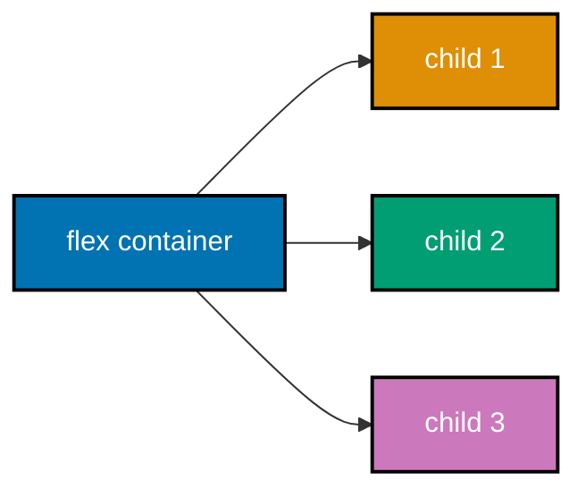
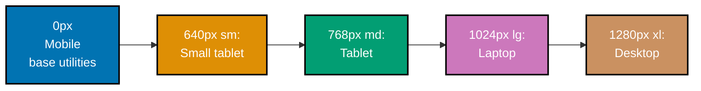

This beginner tutorial covers fundamental Tailwind CSS concepts through 28 heavily annotated examples. Each example maintains 1-2.25 comment lines per code line to ensure deep understanding of what each utility class does and why.

## Prerequisites

Before starting, ensure you understand:

- HTML structure and semantic elements
- CSS box model (margin, padding, border)
- Basic CSS properties (color, font, display)
- What class attributes do in HTML

## Group 1: Utility-First Philosophy

### Example 1: Your First Tailwind Element

Tailwind CSS uses single-purpose utility classes applied directly in HTML. Instead of writing custom CSS, you compose styles by combining utilities in the class attribute.

```html
<!-- => Traditional CSS approach requires writing custom CSS rules -->
<!-- => Tailwind approach: apply pre-built utilities directly in HTML -->

<!-- Traditional approach (without Tailwind) -->
<!-- <style> -->
<!--   .card { background: white; padding: 16px; border-radius: 8px; } -->
<!-- </style> -->
<!-- <div class="card">Content</div> -->

<!-- Tailwind utility-first approach -->
<div class="rounded-lg bg-white p-4">
  <!-- => bg-white: sets background-color to #ffffff (white) -->
  <!-- => p-4: sets padding to 1rem (16px) on all four sides -->
  <!-- => rounded-lg: sets border-radius to 0.5rem (8px) -->
  Hello, Tailwind!
  <!-- => Text content renders inside the styled div -->
</div>
```

**Key Takeaway**: Tailwind eliminates context-switching between HTML and CSS files. Style directly in HTML using composable utility classes.

**Why It Matters**: The utility-first approach removes two of the hardest problems in CSS: naming things and managing specificity. In production codebases, custom CSS class names become inconsistent over time (`card`, `card-new`, `card-v2`). Tailwind's utilities are pre-defined and predictable. When you see `p-4` you immediately know it's `padding: 1rem`. This predictability dramatically improves code review, onboarding, and maintenance across large teams building complex UIs.

### Example 2: Inline Styles vs Utility Classes

Utility classes are not the same as inline styles. They map to CSS variables, design tokens, and predefined scales that ensure visual consistency across your application.

```html
<!-- => Inline styles: arbitrary values, no design constraints -->
<div style="padding: 13px; color: #1a73e8; font-size: 17px;">
  <!-- => Inline styles are one-off values: no scale, no consistency -->
  Arbitrary inline styles
</div>

<!-- => Tailwind utilities: constrained design scale -->
<div class="p-3 text-lg text-blue-600">
  <!-- => p-3: padding from spacing scale (0.75rem = 12px), not arbitrary -->
  <!-- => text-blue-600: blue from consistent color palette (#2563eb) -->
  <!-- => text-lg: from type scale (1.125rem = 18px), not arbitrary -->
  Constrained design scale
</div>

<!-- => Design token comparison: -->
<!-- => p-3 = 0.75rem vs p-4 = 1rem (scale: 0, 0.5, 1, 1.5, 2, 2.5, 3...) -->
<!-- => text-blue-600: part of blue-50 through blue-950 palette -->
<!-- => text-lg: part of xs, sm, base, lg, xl, 2xl... type scale -->
```

**Key Takeaway**: Tailwind utilities map to design tokens (spacing scales, color palettes, type scales) rather than arbitrary values. This enforces visual consistency automatically.

**Why It Matters**: Design consistency is one of the hardest things to maintain at scale. When developers use arbitrary pixel values, UIs become visually inconsistent - buttons with 13px padding next to cards with 15px padding. Tailwind's constrained scales force every developer to choose from the same set of values. This means a junior developer using `p-4` and a senior developer using `p-4` produce exactly the same result - no negotiation, no bikeshedding, just consistent output.

## Group 2: Typography Utilities

### Example 3: Font Size and Weight

Tailwind provides a complete type scale from `text-xs` to `text-9xl` and font weight from `font-thin` to `font-black`. These utilities replace manual `font-size` and `font-weight` CSS declarations.

```html
<!-- => Font size scale demonstration -->
<div class="space-y-2">
  <!-- => space-y-2: adds margin-top: 0.5rem between children -->

  <p class="text-xs">Extra Small Text (12px)</p>
  <!-- => text-xs: font-size: 0.75rem; line-height: 1rem -->

  <p class="text-sm">Small Text (14px)</p>
  <!-- => text-sm: font-size: 0.875rem; line-height: 1.25rem -->

  <p class="text-base">Base Text (16px)</p>
  <!-- => text-base: font-size: 1rem; line-height: 1.5rem (default) -->

  <p class="text-lg">Large Text (18px)</p>
  <!-- => text-lg: font-size: 1.125rem; line-height: 1.75rem -->

  <p class="text-xl">Extra Large Text (20px)</p>
  <!-- => text-xl: font-size: 1.25rem; line-height: 1.75rem -->

  <p class="text-2xl">2XL Text (24px)</p>
  <!-- => text-2xl: font-size: 1.5rem; line-height: 2rem -->

  <p class="text-4xl font-bold">Bold 4XL Heading (36px)</p>
  <!-- => text-4xl: font-size: 2.25rem; line-height: 2.5rem -->
  <!-- => font-bold: font-weight: 700 -->

  <p class="text-4xl font-thin">Thin 4XL Heading (36px)</p>
  <!-- => font-thin: font-weight: 100 (very light) -->
</div>
```

**Key Takeaway**: Use `text-{size}` for font size and `font-{weight}` for weight. Both utilities map to predefined scales for consistent typography.

**Why It Matters**: Typography scales are fundamental to readable, professional interfaces. Tailwind's type scale follows proven typographic ratios. Using `text-base` for body copy and `text-2xl` for headings creates visual hierarchy automatically. Production apps consistently use 5-8 font sizes and 2-3 weights across the entire UI. Tailwind's predefined scale covers these needs without custom CSS, while the naming (`text-xs`, `text-sm`) makes size relationships immediately clear in code review.

### Example 4: Text Color

Text color utilities use the format `text-{color}-{shade}` where shades range from 50 (lightest) to 950 (darkest). Tailwind includes an extensive color palette out of the box.

```html
<!-- => Color palette with shade variants -->
<div class="space-y-1">
  <!-- => space-y-1: 0.25rem vertical spacing between children -->

  <p class="text-gray-400">Gray 400 - Placeholder text</p>
  <!-- => text-gray-400: color: #9ca3af (medium light gray) -->

  <p class="text-gray-700">Gray 700 - Body text</p>
  <!-- => text-gray-700: color: #374151 (dark gray, readable body copy) -->

  <p class="text-gray-900">Gray 900 - Heading text</p>
  <!-- => text-gray-900: color: #111827 (near black, high contrast) -->

  <p class="text-blue-600">Blue 600 - Link or primary action</p>
  <!-- => text-blue-600: color: #2563eb (standard blue for links) -->

  <p class="text-green-600">Green 600 - Success message</p>
  <!-- => text-green-600: color: #16a34a (accessible green for success) -->

  <p class="text-red-600">Red 600 - Error message</p>
  <!-- => text-red-600: color: #dc2626 (standard red for errors) -->

  <p class="text-yellow-600">Yellow 600 - Warning message</p>
  <!-- => text-yellow-600: color: #ca8a04 (amber/yellow for warnings) -->

  <p class="text-purple-600">Purple 600 - Accent or premium</p>
  <!-- => text-purple-600: color: #9333ea (purple for accent styling) -->
</div>
```

**Key Takeaway**: Use `text-{color}-{shade}` for text color. Shades 600-700 work for primary content; 400-500 for secondary/muted text; 900 for headings.

**Why It Matters**: Color consistency is essential for accessible, professional interfaces. Tailwind's 22-color palette with 11 shades each (50-950) covers virtually every design need. The shade system enforces accessible contrast ratios when used correctly - `text-gray-700` on white backgrounds meets WCAG AA standards. Production design systems often restrict developers to a subset of these colors, creating brand consistency. Tailwind's naming makes color tokens (`blue-600`) self-documenting in code, replacing arbitrary hex values that have no semantic meaning.

### Example 5: Text Alignment and Decoration

Text alignment (`text-left`, `text-center`, `text-right`, `text-justify`) and decoration utilities control how text is positioned and styled within its container.

```html
<!-- => Text alignment options -->
<div class="w-64 space-y-4">
  <!-- => w-64: width: 16rem (256px) - constrains container for visible alignment -->

  <p class="text-left">Left aligned (default for LTR languages)</p>
  <!-- => text-left: text-align: left (default browser behavior) -->

  <p class="text-center">Center aligned text</p>
  <!-- => text-center: text-align: center (useful for headings, CTAs) -->

  <p class="text-right">Right aligned text</p>
  <!-- => text-right: text-align: right (useful for numbers in tables) -->

  <p class="text-justify">Justified text stretches to fill both edges of the container like newspaper columns.</p>
  <!-- => text-justify: text-align: justify (use sparingly, can create odd gaps) -->

  <!-- => Text decoration utilities -->
  <p class="underline">Underlined text</p>
  <!-- => underline: text-decoration-line: underline -->

  <p class="line-through">Strikethrough text</p>
  <!-- => line-through: text-decoration-line: line-through (deleted/discounted) -->

  <p class="text-blue-600 no-underline">Link without underline</p>
  <!-- => no-underline: text-decoration-line: none (removes default link underline) -->

  <p class="uppercase">uppercased text becomes ALL CAPS</p>
  <!-- => uppercase: text-transform: uppercase -->

  <p class="capitalize">capitalize makes First Letter Uppercase</p>
  <!-- => capitalize: text-transform: capitalize -->
</div>
```

**Key Takeaway**: Use `text-{alignment}` for text positioning and utilities like `underline`, `line-through`, `uppercase` for text decoration and transformation.

**Why It Matters**: Text alignment and decoration control visual hierarchy and communicate semantic meaning. Center-aligned headings guide users' attention; right-aligned numbers enable easy comparison in data tables; strikethrough conveys deletion without removing content (essential for pricing displays showing original vs. discounted prices). These utilities appear constantly in production UIs. Knowing `text-center` exists prevents developers from writing `style="text-align: center"` which mixes presentation with structure.

### Example 6: Line Height and Letter Spacing

Line height (`leading-{size}`) and letter spacing (`tracking-{size}`) control text density and readability. These are often overlooked but critical for professional typography.

```html
<!-- => Line height (leading) utilities -->
<div class="max-w-xs space-y-4">
  <!-- => max-w-xs: max-width: 20rem (320px) - wraps text for visible effect -->

  <p class="text-base leading-none">
    <!-- => leading-none: line-height: 1 (no spacing between lines) -->
    Tight line height.<br />Good for single-line headings only.
  </p>

  <p class="text-base leading-snug">
    <!-- => leading-snug: line-height: 1.375 (snug multi-line text) -->
    Snug line height.<br />Better for compact UI like card titles.
  </p>

  <p class="text-base leading-normal">
    <!-- => leading-normal: line-height: 1.5 (browser default, readable) -->
    Normal line height.<br />Best for body copy paragraphs.
  </p>

  <p class="text-base leading-relaxed">
    <!-- => leading-relaxed: line-height: 1.625 (comfortable reading) -->
    Relaxed line height.<br />Great for long-form content and articles.
  </p>

  <!-- => Letter spacing (tracking) utilities -->
  <p class="text-lg font-bold tracking-tight">Tight Tracking Heading</p>
  <!-- => tracking-tight: letter-spacing: -0.025em (tighter for large headings) -->

  <p class="text-base tracking-normal">Normal Tracking Body</p>
  <!-- => tracking-normal: letter-spacing: 0em (default, no modification) -->

  <p class="text-sm tracking-wide uppercase">Wide Tracking Labels</p>
  <!-- => tracking-wide: letter-spacing: 0.025em (wider for small uppercase labels) -->
  <!-- => tracking-widest: 0.1em (maximum width, common for ALL CAPS labels) -->
</div>
```

**Key Takeaway**: Use `leading-{size}` to control line height for readability and `tracking-{size}` to adjust letter spacing for different text roles (headings, body, labels).

**Why It Matters**: Line height and letter spacing separate amateur from professional typography. Long-form content requires `leading-relaxed` or `leading-loose` to prevent text density from causing eye fatigue. Display headings at `text-5xl` benefit from `tracking-tight` to appear intentional rather than spaced out by accident. Production design systems define these explicitly - a `prose` class would set `leading-7` (1.75rem). These utilities give direct control without writing CSS rules, making typographic intentions explicit in the HTML structure.

## Group 3: Spacing Utilities

### Example 7: Padding

Padding utilities use the format `p-{size}` for all sides, `px-{size}` for horizontal, `py-{size}` for vertical, and `pt/pr/pb/pl-{size}` for individual sides. The number maps to multiples of 0.25rem (4px).

```html
<!-- => Padding demonstrations (visible with background colors) -->
<div class="space-y-3">
  <div class="bg-blue-100 p-4">
    <!-- => p-4: padding: 1rem (16px) on all four sides -->
    <!-- => bg-blue-100: very light blue background to see padding area -->
    All sides: p-4 = 16px padding everywhere
  </div>

  <div class="bg-blue-100 px-6 py-2">
    <!-- => px-6: padding-left: 1.5rem AND padding-right: 1.5rem -->
    <!-- => py-2: padding-top: 0.5rem AND padding-bottom: 0.5rem -->
    Horizontal px-6 + Vertical py-2 (button-style)
  </div>

  <div class="bg-blue-100 pt-8 pr-2 pb-2 pl-4">
    <!-- => pt-8: padding-top: 2rem -->
    <!-- => pb-2: padding-bottom: 0.5rem -->
    <!-- => pl-4: padding-left: 1rem -->
    <!-- => pr-2: padding-right: 0.5rem -->
    Individual sides: pt-8 pb-2 pl-4 pr-2
  </div>

  <!-- => Common padding patterns -->
  <button class="rounded bg-blue-600 px-4 py-2 text-white">
    <!-- => px-4 py-2: standard button padding (horizontal 1rem, vertical 0.5rem) -->
    <!-- => This creates the classic button aspect ratio -->
    Button with px-4 py-2
  </button>

  <div class="rounded-lg bg-gray-100 p-6">
    <!-- => p-6: 1.5rem padding, standard card padding -->
    Card with p-6 padding
  </div>
</div>
```

**Key Takeaway**: Use `p-{n}` for all-sides padding, `px-{n}`/`py-{n}` for axes, and `pt/pr/pb/pl-{n}` for individual sides. Numbers multiply by 4px (0.25rem).

**Why It Matters**: Consistent padding is the foundation of every UI component. Buttons need `px-4 py-2` for proper click targets. Cards use `p-6` for breathing room. Form inputs use `px-3 py-2` for text entry comfort. These patterns repeat across every production application. Tailwind's spacing scale (4px base unit) matches common design tools like Figma which also use 4px grids by default. When a designer specifies "16px padding", you immediately translate that to `p-4` - no arithmetic needed.

### Example 8: Margin

Margin utilities follow the same pattern as padding (`m-`, `mx-`, `my-`, `mt-`, `mr-`, `mb-`, `ml-`) and additionally include `auto` values for centering and spacing tricks.

```html
<!-- => Margin demonstrations -->
<div class="bg-gray-50 p-4">
  <!-- => Auto margins for centering -->
  <div class="mx-auto mb-4 w-32 bg-blue-200">
    <!-- => mx-auto: margin-left: auto AND margin-right: auto -->
    <!-- => This centers a block element with known width -->
    <!-- => w-32: width: 8rem (needed for mx-auto to work) -->
    <!-- => mb-4: margin-bottom: 1rem (space below this element) -->
    mx-auto centered
  </div>

  <!-- => Vertical spacing between elements -->
  <div class="mt-6 mb-2 bg-green-200">
    <!-- => mt-6: margin-top: 1.5rem (space above) -->
    <!-- => mb-2: margin-bottom: 0.5rem (space below) -->
    mt-6 above, mb-2 below
  </div>

  <!-- => Negative margins for overlapping effects -->
  <div class="-mt-2 bg-yellow-200">
    <!-- => -mt-2: margin-top: -0.5rem (pulls element up, overlapping above) -->
    <!-- => Negative margins are useful for overlapping cards, avatars -->
    -mt-2 pulls this up
  </div>

  <!-- => ml-auto pushes element to the right -->
  <div class="flex">
    <!-- => flex: display: flex -->
    <span class="bg-red-200 px-2">Left item</span>
    <span class="ml-auto bg-purple-200 px-2">ml-auto pushes right</span>
    <!-- => ml-auto: margin-left: auto (fills available space, pushing right) -->
  </div>
</div>
```

**Key Takeaway**: Use margin utilities for external spacing between elements. `mx-auto` centers block elements with known widths. `ml-auto` in flex containers pushes elements to opposite ends.

**Why It Matters**: Margin control is fundamental to layout composition. The `mx-auto` centering pattern is used in virtually every website's main content wrapper. `ml-auto` in navigation bars pushes login buttons to the right side. Negative margins enable overlay effects for avatar stacks and overlapping card designs. Understanding how `margin: auto` behaves in different layout contexts (block vs flex vs grid) is essential knowledge - Tailwind's explicit `mx-auto`, `ml-auto`, `mt-auto` make these behaviors explicit and intentional.

### Example 9: Space Between and Gap

The `space-x-{n}` and `space-y-{n}` utilities add consistent spacing between direct children. The `gap-{n}` utility works specifically in flex and grid containers.

```html
<!-- => space-y: adds margin-top to all children except first -->
<div class="space-y-4 bg-gray-50 p-4">
  <!-- => space-y-4: adds margin-top: 1rem to each child after the first -->
  <!-- => Equivalent to child+child { margin-top: 1rem } in CSS -->

  <div class="bg-blue-200 p-2">First item (no top margin)</div>
  <div class="bg-blue-200 p-2">Second item (margin-top: 1rem = 16px)</div>
  <!-- => 1rem gap appears between first and second -->
  <div class="bg-blue-200 p-2">Third item (margin-top: 1rem = 16px)</div>
</div>

<!-- => space-x: adds margin-left between flex children -->
<div class="mt-4 flex space-x-4 bg-gray-50 p-4">
  <!-- => space-x-4: adds margin-left: 1rem to each child after first -->
  <!-- => Requires flex to lay children horizontally -->

  <div class="bg-green-200 p-2">Item 1</div>
  <div class="bg-green-200 p-2">Item 2</div>
  <!-- => 1rem horizontal gap between items -->
  <div class="bg-green-200 p-2">Item 3</div>
</div>

<!-- => gap: works in flex and grid (preferred for grid) -->
<div class="mt-4 flex gap-4 bg-gray-50 p-4">
  <!-- => gap-4: gap: 1rem (applies both row and column gap) -->
  <!-- => Works like space-x-4 but cleaner for CSS grid -->
  <div class="bg-yellow-200 p-2">Item 1</div>
  <div class="bg-yellow-200 p-2">Item 2</div>
  <div class="bg-yellow-200 p-2">Item 3</div>
</div>

<!-- => gap-x and gap-y for separate control -->
<div class="mt-4 grid grid-cols-3 gap-x-6 gap-y-2 bg-gray-50 p-4">
  <!-- => grid-cols-3: 3-column grid -->
  <!-- => gap-x-6: column gap: 1.5rem (horizontal spacing) -->
  <!-- => gap-y-2: row gap: 0.5rem (vertical spacing) -->
  <div class="bg-purple-200 p-2">A1</div>
  <div class="bg-purple-200 p-2">A2</div>
  <div class="bg-purple-200 p-2">A3</div>
  <div class="bg-purple-200 p-2">B1</div>
  <div class="bg-purple-200 p-2">B2</div>
  <div class="bg-purple-200 p-2">B3</div>
</div>
```

**Key Takeaway**: Use `space-y-{n}` for vertical stacking, `space-x-{n}` for horizontal rows, and `gap-{n}` (with `gap-x`, `gap-y`) for grid layouts.

**Why It Matters**: Consistent spacing between elements is the most common layout challenge. Without a systematic approach, developers add `mb-4` to some elements, `mt-4` to others, creating double margins and inconsistency. `space-y-4` applies spacing uniformly to all children without manual per-element margins. Production component libraries use `space-y-4` for form fields, `space-x-2` for button groups, and `gap-6` for card grids. These utilities eliminate an entire category of spacing bugs while keeping HTML clean and semantic.

## Group 4: Sizing Utilities

### Example 10: Width and Height

Width utilities use `w-{size}` where size can be numeric (scale-based), fractions (`w-1/2`, `w-1/3`), keywords (`w-full`, `w-screen`, `w-auto`), or arbitrary values.

```html
<!-- => Width scale utilities -->
<div class="space-y-2 bg-gray-50 p-4">
  <div class="w-16 bg-blue-200 p-1">w-16 = 4rem (64px)</div>
  <!-- => w-16: width: 4rem = 64px (each unit = 0.25rem = 4px) -->

  <div class="w-32 bg-blue-200 p-1">w-32 = 8rem (128px)</div>
  <!-- => w-32: width: 8rem = 128px -->

  <div class="w-64 bg-blue-200 p-1">w-64 = 16rem (256px)</div>
  <!-- => w-64: width: 16rem = 256px -->

  <!-- => Fractional widths (percentage-based) -->
  <div class="flex gap-2">
    <div class="w-1/2 bg-green-200 p-1">w-1/2 (50%)</div>
    <!-- => w-1/2: width: 50% of parent -->
    <div class="w-1/2 bg-green-200 p-1">w-1/2 (50%)</div>
  </div>

  <div class="flex gap-2">
    <div class="w-1/3 bg-yellow-200 p-1">w-1/3 (33%)</div>
    <!-- => w-1/3: width: 33.333% -->
    <div class="w-2/3 bg-yellow-200 p-1">w-2/3 (67%)</div>
    <!-- => w-2/3: width: 66.667% -->
  </div>

  <!-- => Full width and max-width -->
  <div class="w-full bg-purple-200 p-1">w-full = 100% width</div>
  <!-- => w-full: width: 100% of parent container -->

  <div class="max-w-xs bg-red-200 p-1">max-w-xs constrains to 320px max</div>
  <!-- => max-w-xs: max-width: 20rem (320px) - responsive containment -->

  <!-- => Height utilities follow same pattern -->
  <div class="flex h-16 items-end gap-2">
    <!-- => h-16: height: 4rem (64px) for the flex container -->
    <!-- => items-end: aligns children to bottom -->
    <div class="h-4 w-8 bg-blue-300">h-4</div>
    <!-- => h-4: height: 1rem (16px) -->
    <div class="h-8 w-8 bg-blue-400">h-8</div>
    <!-- => h-8: height: 2rem (32px) -->
    <div class="h-12 w-8 bg-blue-500">h-12</div>
    <!-- => h-12: height: 3rem (48px) -->
  </div>
</div>
```

**Key Takeaway**: Use `w-{n}` for scale-based widths, `w-{fraction}` for percentage widths, `w-full` for 100%, and `max-w-{size}` to constrain maximum widths.

**Why It Matters**: Precise width control drives almost every layout decision. Sidebar navigation uses `w-64` for consistent width. Product images use `w-full` inside card containers for responsive behavior. Two-column layouts use `w-1/2`. Max-width constraints like `max-w-2xl` prevent content lines from becoming unreadably long on wide screens. Understanding the relationship between fixed widths (`w-64`), percentage widths (`w-1/2`), and max-widths (`max-w-xl`) is essential for responsive layout engineering in production applications.

### Example 11: Min/Max Constraints and Screen Sizes

Min and max constraints prevent layouts from breaking at extreme sizes. `min-w-`, `max-w-`, `min-h-`, `max-h-` utilities provide bounds on element dimensions.

```html
<!-- => Min/max width constraints -->
<div class="space-y-4 bg-gray-50 p-4">
  <!-- => max-w-lg centers content and prevents wide lines -->
  <div class="mx-auto max-w-lg bg-blue-100 p-4">
    <!-- => max-w-lg: max-width: 32rem (512px) -->
    <!-- => mx-auto: centers the constrained container -->
    max-w-lg container: stays at 512px max, shrinks responsively
  </div>

  <!-- => min-w prevents elements from collapsing too small -->
  <div class="flex gap-2">
    <button class="min-w-[80px] bg-blue-600 px-3 py-1 text-white">
      <!-- => min-w-[80px]: min-width: 80px (arbitrary value syntax) -->
      <!-- => Prevents button from shrinking smaller than 80px -->
      OK
    </button>
    <button class="min-w-[80px] bg-gray-600 px-3 py-1 text-white">Cancel</button>
  </div>

  <!-- => max-h with overflow for scrollable containers -->
  <div class="max-h-32 overflow-y-auto border border-gray-200 bg-white">
    <!-- => max-h-32: max-height: 8rem (128px) -->
    <!-- => overflow-y-auto: vertical scrollbar appears when content exceeds max-h -->
    <p class="p-2">Line 1 of content</p>
    <p class="p-2">Line 2 of content</p>
    <p class="p-2">Line 3 of content</p>
    <p class="p-2">Line 4 of content - triggers scroll</p>
    <p class="p-2">Line 5 of content</p>
    <p class="p-2">Line 6 of content</p>
  </div>

  <!-- => Screen size utilities -->
  <div class="w-screen bg-red-100 p-2">
    <!-- => w-screen: width: 100vw (full viewport width) -->
    <!-- => Use carefully - extends beyond parent padding -->
    w-screen = full viewport width
  </div>

  <div class="flex h-screen items-center justify-center bg-green-100">
    <!-- => h-screen: height: 100vh (full viewport height) -->
    <!-- => Perfect for hero sections and full-page layouts -->
    <!-- => items-center + justify-center: centers content in viewport -->
    h-screen hero section
  </div>
</div>
```

**Key Takeaway**: Use `max-w-{size}` to constrain content width for readability, `max-h-{n}` with `overflow-auto` for scrollable regions, and `h-screen` for full-viewport layouts.

**Why It Matters**: Unbounded layouts break at extreme viewport sizes. `max-w-prose` (65ch) is the research-backed optimal line length for reading. Hero sections require `h-screen` to fill the viewport without guessing pixel values. Chat interfaces use `max-h-96 overflow-y-auto` for message containers. Navigation drawers use `min-w-[240px]` to prevent collapsing. Every production application combines these constraints to handle the full range of devices from 320px mobile phones to 2560px desktop monitors.

## Group 5: Colors and Backgrounds

### Example 12: Background Colors and Opacity

Background color utilities use `bg-{color}-{shade}`. Opacity can be controlled with `bg-opacity-{n}` (v3) or the `/opacity` modifier.

```html
<!-- => Background color palette demonstration -->
<div class="space-y-2 p-4">
  <!-- => Neutral backgrounds (most common in UIs) -->
  <div class="border bg-white p-3">bg-white (#ffffff) - Cards, modals</div>
  <!-- => bg-white: background-color: #ffffff -->

  <div class="bg-gray-50 p-3">bg-gray-50 (#f9fafb) - Page backgrounds</div>
  <!-- => bg-gray-50: background-color: #f9fafb (very subtle gray) -->

  <div class="bg-gray-100 p-3">bg-gray-100 (#f3f4f6) - Sections, sidebar</div>
  <!-- => bg-gray-100: background-color: #f3f4f6 (light gray) -->

  <div class="bg-gray-900 p-3 text-white">bg-gray-900 - Dark mode background</div>
  <!-- => bg-gray-900: background-color: #111827 (near black) -->
  <!-- => text-white: ensures readable contrast on dark background -->

  <!-- => Semantic color backgrounds -->
  <div class="bg-blue-600 p-3 text-white">bg-blue-600 - Primary action</div>
  <!-- => bg-blue-600: background-color: #2563eb -->

  <div class="bg-green-100 p-3 text-green-800">bg-green-100 - Success toast</div>
  <!-- => bg-green-100: light green background for success states -->
  <!-- => text-green-800: dark green text ensures readable contrast -->

  <div class="bg-red-100 p-3 text-red-800">bg-red-100 - Error state</div>
  <!-- => bg-red-100: light red for error backgrounds -->

  <div class="bg-yellow-100 p-3 text-yellow-800">bg-yellow-100 - Warning</div>
  <!-- => bg-yellow-100: light yellow for warning states -->

  <!-- => Background with opacity modifier (Tailwind v3+) -->
  <div class="bg-blue-600/50 p-3 text-white">bg-blue-600/50 - 50% opacity</div>
  <!-- => bg-blue-600/50: background-color with 50% opacity (alpha channel) -->
  <!-- => /50 modifier: sets background-color opacity to 50% -->
</div>
```

**Key Takeaway**: Use `bg-{color}-{shade}` for background colors. Pair light backgrounds (100) with dark text (800) for readable status/alert patterns. Use `/opacity` modifier for transparent backgrounds.

**Why It Matters**: Background colors create visual hierarchy and communicate semantic meaning at a glance. Green backgrounds signal success; red signals danger; yellow signals warning - these are universal conventions that users understand without reading text. Light shade backgrounds (50-100) with dark text (700-900) provide sufficient contrast for WCAG AA compliance while being gentle on the eyes. The opacity modifier enables glassmorphism effects (frosted glass UI) and overlay backgrounds without separate CSS variables. Production design systems define exactly 4-6 semantic background colors for consistent meaning across the application.

### Example 13: Borders and Divide

Border utilities control border width (`border`, `border-{n}`), color (`border-{color}-{shade}`), style (`border-solid`, `border-dashed`), and radius (`rounded-{size}`).

```html
<!-- => Border utilities demonstration -->
<div class="space-y-3 p-4">
  <!-- => Border width options -->
  <div class="border p-3">border (1px) - default thin border</div>
  <!-- => border: border-width: 1px; border-style: solid (default) -->

  <div class="border-2 p-3">border-2 (2px) - slightly thicker</div>
  <!-- => border-2: border-width: 2px -->

  <div class="border-4 p-3">border-4 (4px) - thick border</div>
  <!-- => border-4: border-width: 4px -->

  <!-- => Border color -->
  <div class="border-2 border-blue-500 p-3">border-blue-500 - colored border</div>
  <!-- => border-blue-500: border-color: #3b82f6 -->

  <div class="border-2 border-dashed border-gray-400 p-3">border-dashed - dashed style</div>
  <!-- => border-dashed: border-style: dashed -->

  <!-- => Directional borders (top, right, bottom, left) -->
  <div class="border-b-2 border-blue-500 p-3">border-b-2 - bottom border only</div>
  <!-- => border-b-2: border-bottom-width: 2px -->
  <!-- => Used for tab underlines, section dividers, input focus indicators -->

  <div class="border-l-4 border-blue-600 pl-4">
    <!-- => border-l-4: border-left-width: 4px (accent/callout style) -->
    <!-- => pl-4: padding-left for text offset from border -->
    border-l-4 accent bar (blockquote/callout pattern)
  </div>

  <!-- => Divide utilities for children separation -->
  <div class="divide-y divide-gray-200 border border-gray-200 bg-white">
    <!-- => divide-y: adds border-top to each child after first -->
    <!-- => divide-gray-200: sets divider color to #e5e7eb -->
    <div class="p-3">Row 1</div>
    <div class="p-3">Row 2</div>
    <!-- => Divider line appears between Row 1 and Row 2 -->
    <div class="p-3">Row 3</div>
  </div>
</div>
```

**Key Takeaway**: Use `border-{n}` for width, `border-{color}-{shade}` for color, directional variants (`border-b`, `border-l`) for accent patterns, and `divide-y` to add separators between list items.

**Why It Matters**: Borders define UI boundaries and create visual structure. Table rows use `divide-y divide-gray-200` instead of adding `border-b` to every `<tr>`. Navigation items use `border-b-2 border-blue-500` for active state underlines. Callout boxes use `border-l-4 border-orange-500 pl-4` for that distinctive left-accent look seen in documentation sites and dashboards. The `divide-y` utility is particularly powerful because it applies borders between children without modifying individual child elements - essential when children are rendered from a list that can grow or shrink dynamically.

### Example 14: Border Radius

Border radius utilities (`rounded-{size}`) control corner rounding from sharp (`rounded-none`) to fully circular (`rounded-full`). Each side can be rounded independently.

```html
<!-- => Border radius options -->
<div class="flex flex-wrap gap-3 p-4">
  <div class="flex h-24 w-24 items-center justify-center rounded-none bg-blue-200 p-4 text-xs">
    <!-- => rounded-none: border-radius: 0 (sharp corners) -->
    rounded-none
  </div>

  <div class="flex h-24 w-24 items-center justify-center rounded bg-blue-200 p-4 text-xs">
    <!-- => rounded: border-radius: 0.25rem (4px, slight rounding) -->
    rounded (4px)
  </div>

  <div class="flex h-24 w-24 items-center justify-center rounded-lg bg-blue-200 p-4 text-xs">
    <!-- => rounded-lg: border-radius: 0.5rem (8px, card-style rounding) -->
    rounded-lg
  </div>

  <div class="flex h-24 w-24 items-center justify-center rounded-xl bg-blue-200 p-4 text-xs">
    <!-- => rounded-xl: border-radius: 0.75rem (12px, modern card style) -->
    rounded-xl
  </div>

  <div class="flex h-24 w-24 items-center justify-center rounded-2xl bg-blue-200 p-4 text-xs">
    <!-- => rounded-2xl: border-radius: 1rem (16px, large rounding) -->
    rounded-2xl
  </div>

  <div class="flex h-24 w-24 items-center justify-center rounded-full bg-blue-200 p-4 text-xs">
    <!-- => rounded-full: border-radius: 9999px (fully circular) -->
    <!-- => Use for avatars, badges, pill buttons -->
    rounded-full
  </div>

  <!-- => Directional border radius -->
  <button class="rounded-l-full bg-blue-600 px-4 py-2 text-white">
    <!-- => rounded-l-full: rounds left side fully (border-top-left and bottom-left) -->
    Left pill
  </button>
  <button class="rounded-r-full bg-blue-700 px-4 py-2 text-white">
    <!-- => rounded-r-full: rounds right side fully -->
    Right pill
  </button>
</div>
```

**Key Takeaway**: Use `rounded-{size}` for consistent corner rounding. `rounded-full` creates circles/pills; `rounded-lg` or `rounded-xl` creates modern card styles; `rounded` for subtle input field rounding.

**Why It Matters**: Border radius is the single most visible design choice in modern UI. Sharp corners feel corporate and rigid; excessive rounding feels playful and soft. The `rounded-xl` style (12px) dominates modern design systems from Apple to Google to Stripe. `rounded-full` for avatar images and notification badges is universal. Buttons typically use `rounded` to `rounded-lg`. Understanding the radius scale lets you match any design specification precisely. Production design systems often enforce specific radius values via custom config, ensuring all components match the brand's corner rounding philosophy.

## Group 6: Flexbox Layout

### Example 15: Flex Container Basics

The `flex` utility enables flexbox layout on an element, making direct children flex items. Direction, alignment, and wrapping control how children arrange themselves.



```html
<!-- => flex makes children line up in a row by default -->
<div class="flex gap-2 bg-gray-50 p-4">
  <!-- => flex: display: flex (enables flexbox) -->
  <!-- => gap-2: gap: 0.5rem between flex children -->
  <!-- => Default flex-direction: row (left to right) -->

  <div class="bg-blue-200 p-2">Item 1</div>
  <div class="bg-blue-200 p-2">Item 2</div>
  <div class="bg-blue-200 p-2">Item 3</div>
  <!-- => Children stack horizontally with 0.5rem gaps -->
</div>

<!-- => flex-col stacks children vertically -->
<div class="mt-4 flex flex-col gap-2 bg-gray-50 p-4">
  <!-- => flex-col: flex-direction: column (top to bottom) -->
  <div class="bg-green-200 p-2">Item 1 (top)</div>
  <div class="bg-green-200 p-2">Item 2 (middle)</div>
  <div class="bg-green-200 p-2">Item 3 (bottom)</div>
</div>

<!-- => justify-content controls main axis distribution -->
<div class="mt-4 flex justify-between bg-gray-50 p-4">
  <!-- => justify-between: justify-content: space-between -->
  <!-- => Pushes items to opposite ends with equal space between -->
  <div class="bg-yellow-200 p-2">Left</div>
  <div class="bg-yellow-200 p-2">Center</div>
  <div class="bg-yellow-200 p-2">Right</div>
</div>

<!-- => items-center vertically centers in a row -->
<div class="mt-4 flex h-24 items-center gap-4 bg-gray-50 p-4">
  <!-- => items-center: align-items: center -->
  <!-- => h-24: height: 6rem - makes vertical centering visible -->
  <div class="h-8 bg-purple-200 p-2">Short</div>
  <div class="bg-purple-200 p-6">Tall item</div>
  <div class="h-10 bg-purple-200 p-2">Medium</div>
  <!-- => All items aligned to vertical center of container -->
</div>
```

**Key Takeaway**: Use `flex` to enable flexbox. `flex-row` (default) arranges horizontally; `flex-col` arranges vertically. `justify-{value}` controls main axis; `items-{value}` controls cross axis alignment.

**Why It Matters**: Flexbox is the foundation of modern web layout, and Tailwind's flex utilities make it immediately readable. Navigation bars use `flex items-center justify-between` for logo-left, links-center, actions-right pattern. Card layouts use `flex flex-col justify-between` for consistent footer positioning. Button groups use `flex items-center gap-2` for icon-text combinations. Understanding `justify-content` vs `align-items` is the key flexbox concept - `justify` controls distribution along the main axis, `items` controls alignment on the cross axis.

### Example 16: Flex Alignment and Justify

The full set of justify-content and align-items values covers every alignment scenario from navigation bars to centered heroes to space-distributed toolbars.

```html
<!-- => All justify-content options (horizontal distribution in flex-row) -->
<div class="space-y-2 p-4">
  <div class="flex justify-start gap-2 bg-blue-50 p-2">
    <!-- => justify-start: justify-content: flex-start (default, items at left) -->
    <div class="bg-blue-200 px-3 py-1">A</div>
    <div class="bg-blue-200 px-3 py-1">B</div>
    <div class="bg-blue-200 px-3 py-1">C</div>
    <span class="ml-auto text-xs text-gray-500">justify-start</span>
  </div>

  <div class="flex justify-center gap-2 bg-green-50 p-2">
    <!-- => justify-center: justify-content: center (items centered) -->
    <div class="bg-green-200 px-3 py-1">A</div>
    <div class="bg-green-200 px-3 py-1">B</div>
    <div class="bg-green-200 px-3 py-1">C</div>
    <span class="ml-auto text-xs text-gray-500">justify-center</span>
  </div>

  <div class="flex justify-end gap-2 bg-yellow-50 p-2">
    <!-- => justify-end: justify-content: flex-end (items at right) -->
    <div class="bg-yellow-200 px-3 py-1">A</div>
    <div class="bg-yellow-200 px-3 py-1">B</div>
    <div class="bg-yellow-200 px-3 py-1">C</div>
    <span class="ml-auto text-xs text-gray-500">justify-end</span>
  </div>

  <div class="flex justify-between bg-purple-50 p-2">
    <!-- => justify-between: justify-content: space-between (items at edges, space between) -->
    <div class="bg-purple-200 px-3 py-1">Logo</div>
    <div class="bg-purple-200 px-3 py-1">Nav</div>
    <div class="bg-purple-200 px-3 py-1">Login</div>
    <!-- => Perfect for navbar: logo left, nav center, action right -->
  </div>

  <div class="flex justify-around bg-red-50 p-2">
    <!-- => justify-around: space-around (equal space around each item) -->
    <div class="bg-red-200 px-3 py-1">A</div>
    <div class="bg-red-200 px-3 py-1">B</div>
    <div class="bg-red-200 px-3 py-1">C</div>
  </div>

  <div class="flex justify-evenly bg-teal-50 p-2">
    <!-- => justify-evenly: space-evenly (equal space including edges) -->
    <div class="bg-teal-200 px-3 py-1">A</div>
    <div class="bg-teal-200 px-3 py-1">B</div>
    <div class="bg-teal-200 px-3 py-1">C</div>
  </div>
</div>
```

**Key Takeaway**: `justify-between` for navigation bars (logo, nav, actions), `justify-center` for centered content, `justify-evenly` for equal-spaced menus. These six options cover every distribution need.

**Why It Matters**: Correct use of justify-content transforms cluttered interfaces into polished layouts. The `justify-between` pattern is the most common in production - every navigation bar, every toolbar, every card footer with "cancel + confirm" buttons uses it. `justify-center` is the go-to for hero CTAs and empty state messages. Production developers who confuse `space-between`, `space-around`, and `space-evenly` create subtle alignment bugs that are hard to spot in isolation but visually jarring when the full UI is seen. Tailwind's explicit naming makes these choices intentional and reviewable.

### Example 17: Flex Grow, Shrink, and Wrap

Flex grow/shrink controls how items distribute available space. Flex wrap allows items to break onto multiple lines instead of overflowing.

```html
<!-- => flex-1 makes item fill available space -->
<div class="flex gap-2 bg-gray-50 p-4">
  <div class="bg-blue-200 px-3 py-2">Fixed</div>
  <!-- => This item takes only its natural width -->

  <div class="flex-1 bg-green-200 px-3 py-2">
    <!-- => flex-1: flex: 1 1 0% (can grow and shrink, starts at 0) -->
    <!-- => Fills ALL remaining space after fixed items -->
    flex-1 fills remaining space
  </div>

  <div class="bg-blue-200 px-3 py-2">Fixed</div>
</div>

<!-- => Two flex-1 items share space equally -->
<div class="mt-4 flex gap-2 bg-gray-50 p-4">
  <div class="flex-1 bg-purple-200 px-3 py-2">flex-1 (50%)</div>
  <!-- => Each flex-1 gets equal share of available space -->
  <div class="flex-1 bg-purple-200 px-3 py-2">flex-1 (50%)</div>
</div>

<!-- => grow vs shrink behavior -->
<div class="mt-4 flex w-64 gap-2 bg-gray-50 p-4">
  <!-- => w-64: narrow container to see shrink behavior -->

  <div class="shrink-0 bg-yellow-200 p-2">
    <!-- => shrink-0: flex-shrink: 0 (refuses to shrink below natural size) -->
    shrink-0 (stays full)
  </div>

  <div class="bg-red-200 p-2">
    <!-- => default: flex-shrink: 1 (will shrink to fit container) -->
    Shrinks to fit container
  </div>
</div>

<!-- => flex-wrap allows line breaking -->
<div class="mt-4 flex w-64 flex-wrap gap-2 bg-gray-50 p-4">
  <!-- => flex-wrap: flex-wrap: wrap (items break to next line) -->
  <!-- => w-64: narrow container forces wrapping -->
  <div class="bg-blue-200 px-3 py-1">Tag One</div>
  <div class="bg-blue-200 px-3 py-1">Tag Two</div>
  <div class="bg-blue-200 px-3 py-1">Tag Three</div>
  <!-- => Items wrap to next line when container is full -->
  <div class="bg-blue-200 px-3 py-1">Tag Four</div>
  <div class="bg-blue-200 px-3 py-1">Tag Five</div>
</div>
```

**Key Takeaway**: Use `flex-1` to fill remaining space, `shrink-0` to prevent shrinking (icons, avatars), and `flex-wrap` to allow items to break onto multiple lines (tag lists, responsive navigation).

**Why It Matters**: Flex grow and shrink are essential for dynamic content scenarios. Search bars use `flex-1` inside nav to fill available space between logo and actions. Avatar images use `shrink-0` to prevent distortion when sibling text overflows. Tag clouds and filter chips use `flex-wrap gap-2` to automatically arrange variable numbers of items. Production forms pair `flex` with `flex-1` on input fields and `shrink-0` on submit buttons so the button never shrinks while the input expands to fill available width. Understanding these three behaviors handles 90% of flex layout challenges.

## Group 7: Grid Layout

### Example 18: CSS Grid Basics

CSS Grid enables two-dimensional layouts with explicit control over rows and columns. The `grid` utility activates grid layout, and `grid-cols-{n}` defines column count.

```html
<!-- => Basic grid layout -->
<div class="grid grid-cols-3 gap-4 p-4">
  <!-- => grid: display: grid (activates CSS Grid) -->
  <!-- => grid-cols-3: grid-template-columns: repeat(3, minmax(0, 1fr)) -->
  <!-- => gap-4: gap: 1rem between grid cells -->

  <div class="bg-blue-200 p-4">Col 1</div>
  <div class="bg-blue-200 p-4">Col 2</div>
  <div class="bg-blue-200 p-4">Col 3</div>
  <!-- => Three equal columns, each 1fr of available width -->
  <div class="bg-blue-200 p-4">Col 1</div>
  <div class="bg-blue-200 p-4">Col 2</div>
  <div class="bg-blue-200 p-4">Col 3</div>
  <!-- => Auto-fills into 3-column rows -->
</div>

<!-- => Common grid patterns -->
<div class="mt-4 grid grid-cols-2 gap-6 p-4">
  <!-- => grid-cols-2: two equal columns -->

  <div class="rounded-lg bg-green-100 p-4">
    <h3 class="font-bold">Feature Card 1</h3>
    <p class="text-sm text-gray-600">Description</p>
  </div>

  <div class="rounded-lg bg-green-100 p-4">
    <h3 class="font-bold">Feature Card 2</h3>
    <p class="text-sm text-gray-600">Description</p>
  </div>
</div>

<!-- => Grid with column spanning -->
<div class="mt-4 grid grid-cols-4 gap-4 p-4">
  <!-- => 4-column grid for spanning demonstrations -->

  <div class="col-span-4 bg-purple-200 p-4">
    <!-- => col-span-4: grid-column: span 4 / span 4 (full width) -->
    Header (col-span-4: full width)
  </div>

  <div class="col-span-3 bg-purple-300 p-4">
    <!-- => col-span-3: spans 3 of 4 columns -->
    Main Content (col-span-3)
  </div>

  <div class="bg-purple-400 p-4">Sidebar (1 col)</div>
  <!-- => Implicit 1 column: takes remaining space -->
</div>
```

**Key Takeaway**: Use `grid grid-cols-{n}` for equal-column layouts. `col-span-{n}` lets cells span multiple columns for complex layouts like main + sidebar.

**Why It Matters**: CSS Grid solves the hardest layout problems in a single declaration. A `grid-cols-3 gap-6` replaces dozens of lines of manual CSS positioning for feature grids, product cards, and image galleries. The `col-span` pattern creates magazine-style layouts without floats or absolute positioning. Production marketing pages use `grid-cols-1 md:grid-cols-2 lg:grid-cols-3` for responsive card grids that work on all devices. Understanding grid column spanning is essential for dashboard layouts where a chart might span 2 columns while metrics occupy individual cells.

### Example 19: Grid Template Areas and Auto-Fit

Auto-fit with `minmax` creates intrinsically responsive grids that adjust column count based on available space. This pattern eliminates most media query needs for card grids.

```html
<!-- => Auto-fit grid: automatically adjusts column count -->
<div class="grid gap-4 p-4" style="grid-template-columns: repeat(auto-fit, minmax(200px, 1fr))">
  <!-- => style attribute needed: Tailwind doesn't ship auto-fit directly in v3 -->
  <!-- => auto-fit: fills row with as many columns as fit at minimum 200px -->
  <!-- => minmax(200px, 1fr): each column minimum 200px, maximum 1fr -->
  <!-- => At 600px: 3 columns. At 400px: 2 columns. At 200px: 1 column -->

  <div class="rounded bg-blue-200 p-4">Card 1</div>
  <div class="rounded bg-blue-200 p-4">Card 2</div>
  <div class="rounded bg-blue-200 p-4">Card 3</div>
  <div class="rounded bg-blue-200 p-4">Card 4</div>
  <div class="rounded bg-blue-200 p-4">Card 5</div>
</div>

<!-- => Arbitrary grid columns with Tailwind v3 arbitrary values -->
<div class="mt-4 grid grid-cols-[1fr_2fr_1fr] gap-4 p-4">
  <!-- => grid-cols-[1fr_2fr_1fr]: custom 1:2:1 ratio columns -->
  <!-- => Arbitrary values use [] with _ for spaces -->
  <div class="bg-green-200 p-4">Sidebar (1fr)</div>
  <div class="bg-green-300 p-4">Main (2fr)</div>
  <div class="bg-green-200 p-4">Sidebar (1fr)</div>
</div>

<!-- => Named grid rows -->
<div class="mt-4 grid h-48 grid-rows-3 gap-2 p-4">
  <!-- => grid-rows-3: grid-template-rows: repeat(3, minmax(0, 1fr)) -->
  <!-- => h-48: height: 12rem (makes rows visible) -->
  <div class="bg-yellow-200 p-2">Row 1 (1fr)</div>
  <div class="bg-yellow-300 p-2">Row 2 (1fr)</div>
  <div class="bg-yellow-400 p-2">Row 3 (1fr)</div>
</div>
```

**Key Takeaway**: Use `grid-cols-{n}` for fixed columns, arbitrary value syntax `grid-cols-[1fr_2fr]` for custom ratios, and inline style for `auto-fit` responsive grids.

**Why It Matters**: The auto-fit/minmax pattern is one of the most powerful CSS Grid features. A single line replaces complex media query breakpoints for card grids. Pinterest-style boards, product listings, and blog grids all benefit from automatic column adjustment. Custom ratio columns (`grid-cols-[2fr_3fr]`) are essential for main+sidebar layouts with specific proportional requirements. Understanding when to use fixed `grid-cols-3` vs dynamic auto-fit grids is a key architectural decision - fixed columns for predictable interfaces, auto-fit for content-driven displays where item count varies.

## Group 8: Responsive Design

### Example 20: Mobile-First Responsive Prefixes

Tailwind uses a mobile-first responsive system. Utilities without prefixes apply to all sizes; prefixed utilities (`sm:`, `md:`, `lg:`, `xl:`, `2xl:`) apply at that breakpoint and above.



```html
<!-- => Mobile-first: start with mobile styles, layer up with breakpoints -->

<!-- => Typography: small on mobile, larger on desktop -->
<h1 class="text-2xl font-bold md:text-3xl lg:text-4xl xl:text-5xl">
  <!-- => text-2xl: 1.5rem on all sizes (mobile default) -->
  <!-- => md:text-3xl: overrides to 1.875rem at 768px+ -->
  <!-- => lg:text-4xl: overrides to 2.25rem at 1024px+ -->
  <!-- => xl:text-5xl: overrides to 3rem at 1280px+ -->
  Responsive Heading
</h1>

<!-- => Grid: 1 column mobile, 2 on tablet, 3 on desktop -->
<div class="mt-4 grid grid-cols-1 gap-4 md:grid-cols-2 lg:grid-cols-3">
  <!-- => grid-cols-1: single column on mobile (no prefix = all sizes) -->
  <!-- => md:grid-cols-2: two columns at 768px and above -->
  <!-- => lg:grid-cols-3: three columns at 1024px and above -->

  <div class="rounded bg-blue-200 p-4">Card 1</div>
  <div class="rounded bg-blue-200 p-4">Card 2</div>
  <div class="rounded bg-blue-200 p-4">Card 3</div>
</div>

<!-- => Visibility: hide on mobile, show on desktop -->
<div class="mt-4">
  <div class="block bg-yellow-200 p-4 md:hidden">
    <!-- => block: display: block (visible on mobile) -->
    <!-- => md:hidden: display: none at 768px+ (hidden on tablet/desktop) -->
    Mobile menu (visible on small screens)
  </div>

  <div class="hidden gap-4 bg-green-200 p-4 md:flex">
    <!-- => hidden: display: none on mobile -->
    <!-- => md:flex: display: flex at 768px+ (desktop navigation) -->
    <a href="#">Home</a>
    <a href="#">About</a>
    <a href="#">Contact</a>
  </div>
</div>
```

**Key Takeaway**: Apply base utilities for mobile, then add `sm:`, `md:`, `lg:` prefixes to override at larger breakpoints. Mobile-first means you design for small screens first, then enhance for larger screens.

**Why It Matters**: Mobile-first responsive design is the industry standard because it forces you to prioritize content for constrained screens before adding complexity for larger ones. Approximately 60% of web traffic comes from mobile devices. Tailwind's prefix system makes responsive decisions explicit in HTML - `grid-cols-1 md:grid-cols-2 lg:grid-cols-3` reads like documentation. This transparency means any developer can understand the responsive behavior without inspecting CSS or browser DevTools. Production codebases live and die by responsive correctness, and Tailwind's explicit prefixes prevent the most common failure mode: desktop-first designs that break on mobile.

### Example 21: Responsive Padding, Spacing, and Typography

Real-world responsive design requires adjusting spacing and typography across breakpoints to maintain proper proportions on all device sizes.

```html
<!-- => Responsive page layout with adjusted spacing -->
<div class="px-4 py-8 md:px-8 md:py-12 lg:px-16 lg:py-16">
  <!-- => px-4: 1rem horizontal padding on mobile -->
  <!-- => md:px-8: 2rem at tablet -->
  <!-- => lg:px-16: 4rem at desktop (breathing room increases with viewport) -->
  <!-- => py-8: 2rem vertical, scales with viewport for proportional whitespace -->

  <!-- => Responsive text size and weight -->
  <p class="max-w-prose text-base leading-relaxed md:text-lg md:leading-loose">
    <!-- => text-base: 1rem on mobile (comfortable reading) -->
    <!-- => md:text-lg: 1.125rem on tablet (slightly larger for desktop reading) -->
    <!-- => leading-relaxed → leading-loose: more space between lines on desktop -->
    <!-- => max-w-prose: constrains to ~65 characters (optimal reading width) -->
    Body text that adjusts its size and line height across breakpoints for optimal readability.
  </p>

  <!-- => Responsive flex direction: vertical on mobile, horizontal on desktop -->
  <div class="mt-8 flex flex-col gap-4 md:flex-row">
    <!-- => flex-col: vertical stack on mobile -->
    <!-- => md:flex-row: horizontal row on tablet/desktop -->
    <!-- => gap-4 applies in both directions -->

    <div class="flex-1 rounded-lg bg-blue-100 p-4">
      <h3 class="text-lg font-semibold">Feature 1</h3>
      <p class="text-sm text-gray-600">Description of feature one</p>
    </div>

    <div class="flex-1 rounded-lg bg-green-100 p-4">
      <h3 class="text-lg font-semibold">Feature 2</h3>
      <p class="text-sm text-gray-600">Description of feature two</p>
    </div>
  </div>
</div>
```

**Key Takeaway**: Apply responsive prefixes to any utility - padding, font size, flex direction. Mobile-first layering means fewer overrides and cleaner code than desktop-first approaches.

**Why It Matters**: Responsive spacing is as important as responsive layouts. A card with `p-4` (16px padding) on mobile looks appropriate, but the same card needs `p-6` or `p-8` on desktop to maintain visual proportion at larger scales. Typography transitions from `text-base` to `text-lg` improve legibility at different viewing distances. The `flex-col md:flex-row` pattern is one of the most common in production - feature comparisons, pricing sections, and benefit lists all need to stack vertically on mobile and lay out horizontally on desktop. Tailwind's direct breakpoint control makes these decisions explicit and predictable.

## Group 9: Interactive States

### Example 22: Hover and Focus States

State variants (`hover:`, `focus:`, `active:`, `disabled:`) apply utilities conditionally when those states are active. These replace pseudo-class CSS rules.

```html
<!-- => Hover state examples -->
<div class="space-y-4 p-4">
  <!-- => Button with hover state changes -->
  <button class="rounded bg-blue-600 px-4 py-2 text-white hover:bg-blue-700">
    <!-- => bg-blue-600: normal state background -->
    <!-- => hover:bg-blue-700: darker background on hover -->
    <!-- => Tailwind adds transition automatically in newer versions? NO - add transition manually -->
    Hover to darken
  </button>

  <!-- => With smooth transition -->
  <button class="rounded bg-blue-600 px-4 py-2 text-white transition-colors duration-200 hover:bg-blue-700">
    <!-- => transition-colors: transition: color, background-color, border-color, ... -->
    <!-- => duration-200: transition-duration: 200ms (quick but visible) -->
    <!-- => Smooth color change on hover -->
    Smooth hover transition
  </button>

  <!-- => Focus state for accessibility -->
  <input
    class="rounded border border-gray-300 px-3 py-2 focus:border-blue-500 focus:ring-2 focus:ring-blue-500/20 focus:outline-none"
    placeholder="Click to focus"
  />
  <!-- => focus:outline-none: removes default browser outline -->
  <!-- => focus:border-blue-500: blue border on focus (replaces outline) -->
  <!-- => focus:ring-2: adds box-shadow ring of 2px -->
  <!-- => focus:ring-blue-500/20: ring color with 20% opacity -->

  <!-- => Hover text color change -->
  <a href="#" class="text-blue-600 hover:text-blue-800 hover:underline">
    <!-- => hover:text-blue-800: darker blue on hover -->
    <!-- => hover:underline: underline appears on hover (subtle link style) -->
    Hover this link
  </a>

  <!-- => Active state (while pressed) -->
  <button class="rounded bg-blue-600 px-4 py-2 text-white hover:bg-blue-700 active:bg-blue-900">
    <!-- => active:bg-blue-900: darkest blue while button is being pressed -->
    Click me (active state)
  </button>
</div>
```

**Key Takeaway**: Use `hover:`, `focus:`, and `active:` prefixes before any utility to apply it conditionally. Always include `transition-colors` for smooth state changes and proper `focus:` states for keyboard accessibility.

**Why It Matters**: Interactive states are critical for usability and accessibility. Without hover feedback, users don't know elements are clickable - this causes confusion and reduces conversion rates. Focus states are mandatory for keyboard and screen reader users. WCAG 2.1 requires visible focus indicators for all interactive elements. The `focus:outline-none focus:ring-2` pattern replaces browser default outlines with custom ring styles that match your design system. Production accessibility audits specifically check for visible focus indicators - missing them is a WCAG AA failure that can cause legal liability for enterprise applications.

### Example 23: Disabled and Visited States

The `disabled:` and `visited:` variants handle form element disabled states and link visited states respectively. These communicate interaction history and availability.

```html
<!-- => Disabled state for form elements -->
<div class="space-y-4 p-4">
  <!-- => Button with disabled state -->
  <button
    class="rounded bg-blue-600 px-4 py-2 text-white hover:bg-blue-700 disabled:cursor-not-allowed disabled:opacity-50 disabled:hover:bg-blue-600"
    disabled
  >
    <!-- => disabled:opacity-50: 50% opacity when disabled attribute present -->
    <!-- => disabled:cursor-not-allowed: changes cursor to "no" symbol -->
    <!-- => disabled:hover:bg-blue-600: prevents hover darkening when disabled -->
    <!-- => disabled HTML attribute activates disabled: variants -->
    Disabled Button
  </button>

  <!-- => Input with disabled state -->
  <input
    class="rounded border border-gray-300 bg-white px-3 py-2 disabled:cursor-not-allowed disabled:bg-gray-100 disabled:text-gray-500"
    value="Read-only value"
    disabled
  />
  <!-- => disabled:bg-gray-100: gray background signals disabled state -->
  <!-- => disabled:text-gray-500: muted text for disabled input -->

  <!-- => Loading state with opacity and cursor -->
  <button class="cursor-wait rounded bg-blue-600 px-4 py-2 text-white opacity-75">
    <!-- => opacity-75: slightly dimmed to signal loading state -->
    <!-- => cursor-wait: shows hourglass/spinner cursor -->
    Loading...
  </button>

  <!-- => Visited link state -->
  <div class="space-y-2">
    <a href="#visited-example" class="block text-blue-600 visited:text-purple-600 hover:underline">
      <!-- => visited:text-purple-600: changes color after link has been visited -->
      <!-- => This is commonly disabled in modern designs for privacy reasons -->
      Link changes color when visited
    </a>
  </div>
</div>
```

**Key Takeaway**: Use `disabled:opacity-50 disabled:cursor-not-allowed` for standard disabled button styling. These variants apply when the HTML `disabled` attribute is present, so no JavaScript needed.

**Why It Matters**: Disabled states prevent user confusion and frustration. A submit button that looks identical whether enabled or disabled causes users to click it repeatedly thinking the page is broken. The `disabled:opacity-50 disabled:cursor-not-allowed` combination is the universal standard - visually dimmed plus a "no" cursor makes the state immediately obvious. This is especially critical in multi-step forms where subsequent fields unlock only after earlier fields are complete. The cursor-not-allowed feedback prevents "why isn't this working?" support tickets. Production applications use disabled states extensively in form validation, permission controls, and loading states.

### Example 24: Focus-Visible and Focus-Within

`focus-visible:` applies only for keyboard focus (not mouse click), while `focus-within:` applies to a parent when any child is focused. These enable sophisticated accessibility patterns.

```html
<!-- => focus-visible: keyboard focus only (not mouse click) -->
<div class="space-y-4 p-4">
  <button
    class="rounded bg-gray-200 px-4 py-2 focus:outline-none focus-visible:ring-2 focus-visible:ring-blue-500 focus-visible:ring-offset-2"
  >
    <!-- => focus:outline-none: removes default browser outline for ALL focus -->
    <!-- => focus-visible:ring-2: only shows ring for keyboard navigation -->
    <!-- => focus-visible:ring-offset-2: adds 2px space between element and ring -->
    <!-- => Mouse clicks don't show the ring; Tab key does -->
    Keyboard-only focus ring
  </button>

  <!-- => focus-within: parent responds when any child is focused -->
  <div
    class="rounded-lg border-2 border-gray-200 p-4 transition-all focus-within:border-blue-500 focus-within:shadow-md"
  >
    <!-- => focus-within:border-blue-500: border turns blue when input inside is focused -->
    <!-- => focus-within:shadow-md: shadow appears on the container on focus -->
    <!-- => Creates "card activates on focus" pattern for form groups -->
    <label class="mb-1 block text-sm font-medium text-gray-700"> Email Address </label>
    <input
      class="w-full rounded border border-gray-300 px-3 py-2 focus:outline-none"
      type="email"
      placeholder="you@example.com"
    />
    <!-- => focus:outline-none: input removes its own outline -->
    <!-- => Parent div provides the visual focus indicator via focus-within -->
  </div>
</div>
```

**Key Takeaway**: Use `focus-visible:` for keyboard-only focus styles (prevents mouse click outlines), and `focus-within:` to style a parent container when any child receives focus.

**Why It Matters**: Keyboard accessibility is non-negotiable for WCAG AA compliance. The `focus-visible` approach solves the classic dilemma: mouse users don't want visible focus rings, but keyboard users need them. Before `focus-visible`, developers removed focus rings entirely (accessibility failure) or kept them for everyone (visual noise for mouse users). The `focus-within` pattern is powerful for form groups - highlighting the entire field container (label + input + help text) when the input is focused creates clear visual context. Modern design systems use these variants to build accessible, polished form components without JavaScript.

## Group 10: Display and Positioning

### Example 25: Display Utilities

Display utilities (`block`, `inline`, `inline-block`, `hidden`, `flex`, `grid`, `table`) control how elements participate in the document flow.

```html
<!-- => Display utility examples -->
<div class="space-y-4 p-4">
  <!-- => block: takes full width, starts on new line -->
  <span class="block bg-blue-200 p-2">
    <!-- => block: display: block (span normally inline, now full-width block) -->
    This span is display: block (full width)
  </span>

  <!-- => inline: flows with text -->
  <p class="bg-gray-100 p-2">
    Normal text with
    <span class="inline bg-yellow-200 px-1">inline span</span>
    <!-- => inline: display: inline (default for span, no width/height control) -->
    flowing inline.
  </p>

  <!-- => inline-block: block with inline flow -->
  <p class="bg-gray-100 p-2">
    Text with
    <span class="inline-block rounded bg-green-200 px-3 py-1">inline-block</span>
    <!-- => inline-block: inline flow but accepts width/height/padding like block -->
    <!-- => Useful for badges, tags, and labels within text -->
    that has padding and still flows inline.
  </p>

  <!-- => hidden: removes from layout entirely -->
  <div class="hidden bg-red-200 p-2">
    <!-- => hidden: display: none (not rendered, takes no space) -->
    This is hidden (you cannot see this text)
  </div>

  <!-- => invisible vs hidden -->
  <div class="invisible bg-purple-200 p-2">
    <!-- => invisible: visibility: hidden (takes space but not visible) -->
    invisible: takes space but not visible
  </div>

  <!-- => Responsive display toggling -->
  <div class="block bg-orange-200 p-2 md:hidden">
    <!-- => block: visible on mobile -->
    <!-- => md:hidden: hidden on tablet and above -->
    Mobile only content
  </div>

  <div class="hidden bg-teal-200 p-2 md:block">
    <!-- => hidden: hidden on mobile -->
    <!-- => md:block: visible on tablet and above -->
    Desktop only content
  </div>
</div>
```

**Key Takeaway**: Use `block` to make inline elements full-width, `inline-block` for inline flow with block properties, `hidden` to remove from layout, and combine with responsive prefixes for show/hide at breakpoints.

**Why It Matters**: Controlling display context is fundamental to layout composition. Converting `<span>` tags to `block` for full-width error messages, using `inline-block` for tag chips that accept padding, and toggling visibility with responsive prefixes are patterns that appear in every production codebase. The distinction between `hidden` (removes from layout) and `invisible` (hides but preserves space) is critical - using the wrong one causes layout shifts. Mobile/desktop content toggling via `block md:hidden` and `hidden md:block` is used in nearly every responsive navigation component.

### Example 26: Position and Z-Index

Position utilities control element stacking and layering. Understanding `relative`, `absolute`, `fixed`, and `sticky` is essential for modals, tooltips, dropdowns, and sticky headers.

```html
<!-- => Position utilities demonstration -->
<div class="space-y-8 p-4">
  <!-- => relative + absolute positioning -->
  <div class="relative h-32 bg-blue-100 p-8">
    <!-- => relative: position: relative (becomes positioning context for children) -->
    Relative container
    <div class="absolute top-2 right-2 rounded-full bg-red-500 px-2 py-1 text-xs text-white">
      <!-- => absolute: position: absolute (removed from flow, positioned to nearest relative ancestor) -->
      <!-- => top-2: top: 0.5rem (from relative container's top edge) -->
      <!-- => right-2: right: 0.5rem (from relative container's right edge) -->
      NEW badge
    </div>
    <!-- => Absolute child positions relative to the parent's border box -->
  </div>

  <!-- => fixed: viewport-relative positioning -->
  <!-- NOTE: Not demonstrating live fixed - would overlay the whole demo -->
  <!-- Real usage: -->
  <!-- <nav class="fixed top-0 left-0 right-0 bg-white shadow-sm z-50"> -->
  <!-- => fixed: position: fixed (stays in place during scroll) -->
  <!-- => top-0 left-0 right-0: stretches across top of viewport -->
  <!-- => z-50: z-index: 50 (above other content) -->

  <!-- => sticky: sticks within scrolling parent -->
  <div class="h-40 overflow-y-auto bg-gray-100">
    <!-- => h-40: limited height triggers scroll -->
    <!-- => overflow-y-auto: enables scrolling -->
    <div class="sticky top-0 z-10 bg-white p-2 font-semibold shadow-sm">
      <!-- => sticky: position: sticky (relative until scroll threshold, then fixed within parent) -->
      <!-- => top-0: sticks to top of scrolling container -->
      <!-- => z-10: z-index: 10 (above scrolling content) -->
      Sticky Section Header
    </div>
    <p class="p-3">Item 1 - scroll to see sticky header stay</p>
    <p class="p-3">Item 2</p>
    <p class="p-3">Item 3</p>
    <p class="p-3">Item 4 (header is still visible above)</p>
  </div>

  <!-- => z-index stacking -->
  <div class="relative h-20">
    <div class="absolute inset-0 z-0 bg-blue-300">z-0 (bottom)</div>
    <!-- => inset-0: top/right/bottom/left: 0 (fills container) -->
    <!-- => z-0: z-index: 0 -->
    <div class="absolute inset-2 z-10 bg-green-300">z-10 (middle)</div>
    <!-- => inset-2: offset 0.5rem from each edge -->
    <!-- => z-10: z-index: 10 (above z-0) -->
    <div class="absolute inset-4 z-20 flex items-center justify-center bg-yellow-300">z-20 (top)</div>
    <!-- => z-20: z-index: 20 (above z-10) -->
  </div>
</div>
```

**Key Takeaway**: `relative` creates a positioning context for `absolute` children. `fixed` positions to the viewport. `sticky` positions within scroll containers. `z-{n}` controls stacking order.

**Why It Matters**: Understanding position context is the key to implementing overlapping UI patterns. Notification badges use `absolute top-0 right-0` on a `relative` parent. Tooltips use `absolute` positioning within a hover-triggered `relative` wrapper. Sticky navigation headers require `sticky top-0 z-50` to remain above scrolling content. Modals use `fixed inset-0` to fill the entire viewport. The `relative`/`absolute` parent-child relationship is conceptually the hardest part of CSS positioning - Tailwind's explicit utilities make the relationship visible in the HTML structure itself.

## Group 11: Overflow and Visibility

### Example 27: Overflow Control

Overflow utilities control what happens when content exceeds its container. `overflow-hidden`, `overflow-auto`, and `overflow-scroll` are the core options.

```html
<!-- => Overflow utility demonstrations -->
<div class="space-y-4 p-4">
  <!-- => overflow-hidden: clips content at container boundary -->
  <div class="h-16 w-48 overflow-hidden bg-blue-100">
    <!-- => overflow-hidden: overflow: hidden (clips content, enables rounded corners on images) -->
    <!-- => w-48 h-16: fixed size makes overflow visible -->
    This is a long text that will be clipped when it exceeds the container boundaries
    <!-- => Text after ~48px height is invisible (clipped) -->
  </div>

  <!-- => overflow-auto: scrollbar only when needed -->
  <div class="h-16 w-48 overflow-auto bg-green-100">
    <!-- => overflow-auto: overflow: auto (adds scrollbar only when content overflows) -->
    <p>Paragraph 1 with enough content</p>
    <p>Paragraph 2 forces scrolling</p>
    <p>Paragraph 3 adds more</p>
  </div>

  <!-- => overflow-x-hidden: prevents horizontal scroll -->
  <div class="w-48 overflow-x-hidden bg-yellow-100">
    <!-- => overflow-x-hidden: overflow-x: hidden (clips horizontal overflow) -->
    <!-- => Essential for preventing horizontal page scroll from absolute/wide elements -->
    <div class="w-96 bg-yellow-200 p-2">Wide child (clips at parent boundary)</div>
    <!-- => w-96 is wider than w-48 parent, but overflow-x-hidden clips it -->
  </div>

  <!-- => overflow-hidden for rounded images (most common use) -->
  <div class="h-20 w-20 overflow-hidden rounded-full bg-gray-200">
    <!-- => rounded-full: sets border-radius to 9999px -->
    <!-- => overflow-hidden: clips image to circular boundary -->
    <!-- => Without overflow-hidden, image corners would show outside circle -->
    
    <!-- => object-cover: object-fit: cover (fills container, crops to fit) -->
  </div>

  <!-- => truncate: single-line text overflow with ellipsis -->
  <div class="w-48">
    <p class="truncate text-gray-700">
      <!-- => truncate: overflow: hidden; white-space: nowrap; text-overflow: ellipsis -->
      <!-- => Forces single-line and adds ... when text overflows -->
      Very long text that gets truncated with an ellipsis when it overflows
    </p>
  </div>
</div>
```

**Key Takeaway**: Use `overflow-hidden` to clip content (required for rounded image avatars). `overflow-auto` for scrollable containers. `truncate` for single-line text with ellipsis.

**Why It Matters**: Overflow management prevents layout-breaking bugs in production. Without `overflow-hidden` on a `rounded-full` avatar container, the image corners poke out of the circle. Without `overflow-x-hidden` on the body, a single absolutely-positioned element that extends off-screen creates a horizontal scrollbar on the entire page. `truncate` is essential for table cells, card titles, and list items where text length is dynamic (user-generated content). The `max-h-{n} overflow-y-auto` pattern is used in every dropdown menu, combobox, and multi-select component to handle variable-length option lists.

### Example 28: Cursor and Pointer Events

Cursor utilities change the mouse cursor appearance to communicate interactivity. Pointer events control whether elements respond to mouse interaction.

```html
<!-- => Cursor utilities for interactive feedback -->
<div class="space-y-4 p-4">
  <!-- => Cursor options communicating interaction state -->
  <div class="flex flex-wrap gap-3">
    <div class="cursor-pointer rounded bg-blue-200 px-4 py-2">
      <!-- => cursor-pointer: cursor: pointer (hand cursor, signals clickable) -->
      cursor-pointer (clickable)
    </div>

    <div class="cursor-not-allowed rounded bg-gray-200 px-4 py-2 opacity-50">
      <!-- => cursor-not-allowed: cursor: not-allowed (disabled/unavailable) -->
      cursor-not-allowed (disabled)
    </div>

    <div class="cursor-move rounded bg-green-200 px-4 py-2">
      <!-- => cursor-move: cursor: move (draggable item) -->
      cursor-move (draggable)
    </div>

    <div class="cursor-text rounded bg-yellow-200 px-4 py-2">
      <!-- => cursor-text: cursor: text (I-beam, signals text input area) -->
      cursor-text (text input)
    </div>

    <div class="cursor-wait rounded bg-purple-200 px-4 py-2">
      <!-- => cursor-wait: cursor: wait (spinner, signals loading) -->
      cursor-wait (loading)
    </div>

    <div class="cursor-crosshair rounded bg-red-200 px-4 py-2">
      <!-- => cursor-crosshair: cursor: crosshair (precision selection) -->
      cursor-crosshair (select)
    </div>
  </div>

  <!-- => pointer-events: controls mouse interaction -->
  <div class="relative">
    <a href="#" class="block rounded bg-blue-600 px-4 py-2 text-center text-white"> Underlying Link </a>
    <div class="pointer-events-none absolute inset-0 rounded bg-gray-900/50">
      <!-- => pointer-events-none: pointer-events: none (mouse clicks pass through) -->
      <!-- => Overlay is visible but doesn't block clicks on the link below -->
      <!-- => Used for visual overlays, tooltips, and decorative elements -->
      <span class="p-1 text-xs text-white">Overlay (clicks pass through)</span>
    </div>
  </div>

  <!-- => select utilities for text selection -->
  <div class="space-y-2">
    <p class="rounded bg-gray-100 p-2 select-all">
      <!-- => select-all: user-select: all (single click selects everything) -->
      Click once to select all this text
    </p>
    <p class="rounded bg-gray-100 p-2 select-none">
      <!-- => select-none: user-select: none (prevents text selection) -->
      This text cannot be selected (useful for UI labels, buttons)
    </p>
  </div>
</div>
```

**Key Takeaway**: Use `cursor-pointer` for all clickable elements without native pointer behavior (divs, spans). `cursor-not-allowed` for disabled states. `pointer-events-none` for decorative overlays that shouldn't block interaction.

**Why It Matters**: Cursor feedback is one of the fastest ways to communicate interactivity. Without `cursor-pointer` on a custom div acting as a button, users hover over it and see a text cursor - confusing and unprofessional. `pointer-events-none` enables layered UI patterns: decorative gradient overlays on images, loading spinners that don't block the underlying action button, and watermarks that don't interfere with form interaction. `select-none` prevents accidental text selection on buttons and labels during rapid clicks. `select-all` on code snippets and API keys makes copying instant with a single click - a small UX improvement with significant user satisfaction impact.
