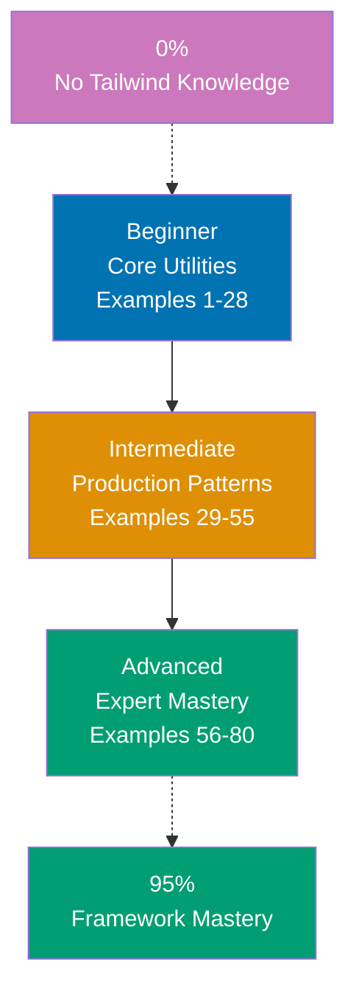

**Want to learn Tailwind CSS through code?** This by-example tutorial provides 80 heavily annotated examples covering 95% of Tailwind CSS. Master utility-first styling, responsive design, customization, and production patterns through working HTML rather than lengthy explanations.

## What Is By-Example Learning?

By-example learning is a **code-first approach** where you learn concepts through annotated, working examples rather than narrative explanations. Each example shows:

1. **What the code does** - Brief explanation of the Tailwind concept
2. **How it works** - A focused, heavily commented code example
3. **Key Takeaway** - A pattern summary highlighting the key takeaway
4. **Why It Matters** - Production context, when to use, deeper significance

This approach works best when you already understand HTML and CSS fundamentals. You learn Tailwind's utility model, responsive system, and customization options by studying real code rather than theoretical descriptions.

## What Is Tailwind CSS?

Tailwind CSS is a **utility-first CSS framework** that provides low-level utility classes for building custom designs directly in HTML. Key distinctions:

- **Not a component library**: Tailwind provides utilities, not pre-built components like Bootstrap
- **Utility-first**: Apply single-purpose classes directly in HTML rather than writing custom CSS
- **Responsive by default**: Every utility has responsive variants (sm:, md:, lg:, xl:, 2xl:)
- **Highly customizable**: Configure design tokens (colors, spacing, typography) in tailwind.config.js or CSS-first in v4
- **JIT engine**: Generates only the CSS you actually use, keeping bundle sizes minimal

## Learning Path



## Coverage Philosophy: 95% Through 80 Examples

The **95% coverage** means you'll understand Tailwind CSS deeply enough to build production user interfaces with confidence. It doesn't mean you'll know every edge case or plugin—those come with experience.

The 80 examples are organized progressively:

- **Beginner (Examples 1-28)**: Foundation utilities (typography, spacing, sizing, colors, flexbox, grid, responsive design, states)
- **Intermediate (Examples 29-55)**: Production patterns (custom configuration, dark mode, animations, @apply, arbitrary values, group/peer modifiers, gradients)
- **Advanced (Examples 56-80)**: Expert mastery (plugins, design systems, Tailwind v4 CSS-first config, JIT internals, performance, accessibility, migration patterns)

Together, these examples cover **95% of what you'll use** in production Tailwind CSS applications.

## Annotation Density: 1-2.25 Comments Per Code Line

**CRITICAL**: All examples maintain **1-2.25 comment lines per code line PER EXAMPLE** to ensure deep understanding.

**What this means**:

- Simple lines get 1 annotation explaining what the utility class does
- Complex lines get 2+ annotations explaining behavior, responsive breakpoints, and design intent
- Use `<!-- => -->` notation in HTML to show what each class produces

**Example**:

```html
<!-- => Card container with shadow and rounded corners -->
<div class="max-w-sm rounded-xl bg-white p-6 shadow-lg">
  <!-- => bg-white: background-color: #ffffff -->
  <!-- => shadow-lg: box-shadow with larger spread -->
  <!-- => rounded-xl: border-radius: 0.75rem -->
  <!-- => p-6: padding: 1.5rem on all sides -->
  <!-- => max-w-sm: max-width: 24rem (384px) -->

  <!-- => Heading with large bold blue text -->
  <h2 class="text-2xl font-bold text-blue-600">
    <!-- => text-2xl: font-size: 1.5rem, line-height: 2rem -->
    <!-- => font-bold: font-weight: 700 -->
    <!-- => text-blue-600: color: #2563eb -->
    Card Title
  </h2>
</div>
```

This density ensures each example is self-contained and fully comprehensible without external documentation.

## Structure of Each Example

All examples follow a consistent five-part format:

````
### Example N: Descriptive Title

2-3 sentence explanation of the concept.

```html
<!-- Heavily annotated HTML example -->
<!-- showing the Tailwind pattern in action -->
```

**Key Takeaway**: 1-2 sentence summary.

**Why It Matters**: 50-100 words explaining significance in production applications.
````

**Code annotations**:

- `<!-- => -->` shows what each Tailwind class produces (CSS property: value)
- Inline comments explain design intent and when to use each utility
- Class names are self-documenting
- Responsive variants show breakpoint behavior

## What's Covered

### Core Utilities

- **Typography**: font-size, font-weight, text-color, text-align, line-height, letter-spacing
- **Spacing**: padding, margin, gap (all sides, directional, responsive)
- **Sizing**: width, height, min/max constraints, aspect-ratio
- **Colors**: background colors, text colors, border colors, opacity variants

### Layout System

- **Flexbox**: flex, flex-direction, justify-content, align-items, flex-wrap, flex-grow/shrink
- **Grid**: grid-cols, grid-rows, col-span, row-span, grid-flow, place-items
- **Positioning**: relative, absolute, fixed, sticky, inset, z-index
- **Display**: block, inline, inline-block, hidden, flex, grid

### Responsive Design

- **Breakpoints**: sm (640px), md (768px), lg (1024px), xl (1280px), 2xl (1536px)
- **Mobile-first**: Default styles apply mobile, breakpoint prefixes apply upward
- **Responsive utilities**: Any utility can have a responsive variant

### Interactive States

- **Pseudo-classes**: hover:, focus:, active:, disabled:, visited:
- **Focus-visible**: Keyboard navigation accessibility
- **Group hover**: Parent-triggered child state changes

### Customization

- **tailwind.config.js**: Extending theme with custom values
- **Custom colors**: Design token integration
- **CSS variables**: Dynamic theming with CSS custom properties
- **@apply**: Extracting repeated utility combinations

### Advanced Patterns

- **Dark mode**: class strategy for controlled dark mode
- **Animations**: transition, animate-\*, custom keyframes
- **Gradients**: bg-gradient-to-_, from-_, via-_, to-_ utilities
- **Ring utilities**: focus rings, outline management
- **Arbitrary values**: [value] syntax for one-off styles

### Production Patterns

- **Component extraction**: When to extract vs inline utilities
- **Design systems**: Consistent tokens, spacing scales, color palettes
- **Performance**: Purging unused CSS, bundle size optimization
- **Tailwind v4**: CSS-first configuration, @theme directive

## What's NOT Covered

We exclude topics that belong in specialized tutorials:

- **Headless UI**: Pre-built accessible components (separate tutorial)
- **shadcn/ui deep dive**: Component library internals (brief integration overview only)
- **PostCSS internals**: Build tooling configuration details
- **CSS-in-JS**: Emotion, styled-components (different paradigm)
- **CSS animations deep dive**: Animation libraries like Framer Motion

For these topics, see dedicated tutorials and library documentation.

## Prerequisites

### Required

- **HTML fundamentals**: HTML structure, semantic elements, class attributes
- **CSS basics**: Box model, display properties, positioning, basic selectors
- **Web development experience**: You've built web pages before

### Recommended

- **Responsive design concepts**: Media queries, mobile-first thinking
- **Design fundamentals**: Spacing scales, color systems, typography basics
- **Modern tooling**: npm/yarn basics, command-line usage

### Not Required

- **Advanced CSS**: Flexbox/grid expertise (Tailwind makes these easy)
- **CSS preprocessors**: Sass/Less experience not needed
- **JavaScript**: Not required for beginner examples (needed for advanced patterns)

## Getting Started

Before starting the examples, ensure you have a basic setup:

```bash
# Install Tailwind CSS in a project
npm install -D tailwindcss
npx tailwindcss init

# Or use a CDN for quick experimentation (not for production)
# Add to HTML <head>:
# <script src="https://cdn.tailwindcss.com"></script>
```

For quick experimentation, the [Tailwind CSS Play](https://play.tailwindcss.com) environment lets you run examples without any local setup.

## How to Use This Guide

### 1. Choose Your Starting Point

- **New to Tailwind?** Start with Beginner (Example 1)
- **CSS framework experience** (Bootstrap, Bulma)? Start with Intermediate (Example 29)
- **Building specific feature?** Search for relevant example topic

### 2. Read the Example

Each example has five parts:

- **Explanation** (2-3 sentences): What Tailwind concept, why it exists, when to use it
- **Code** (heavily commented): Working HTML showing the pattern with class-by-class annotations
- **Key Takeaway** (1-2 sentences): Distilled essence of the pattern
- **Why It Matters** (50-100 words): Production context and deeper significance

### 3. Run the Code

Paste each example into [Tailwind CSS Play](https://play.tailwindcss.com) to see results instantly, or run locally:

```bash
# Quick local test with CDN
# Create index.html with <script src="https://cdn.tailwindcss.com"></script>
# Open in browser
```

### 4. Modify and Experiment

Change utility classes, add responsive variants, swap colors. Experimentation builds intuition faster than reading.

### 5. Reference as Needed

Use this guide as a reference when building UIs. Search for relevant examples and adapt utility patterns to your code.

## Ready to Start?

Choose your learning path:

- **Beginner** - Start here if new to Tailwind. Build foundation understanding through 28 core utility examples.
- **Intermediate** - Jump here if you know Tailwind basics. Master production patterns through 27 examples.
- **Advanced** - Expert mastery through 25 advanced examples covering plugins, design systems, and Tailwind v4.

Or jump to specific topics by searching for relevant example keywords (flexbox, grid, responsive, dark mode, animations, etc.).
