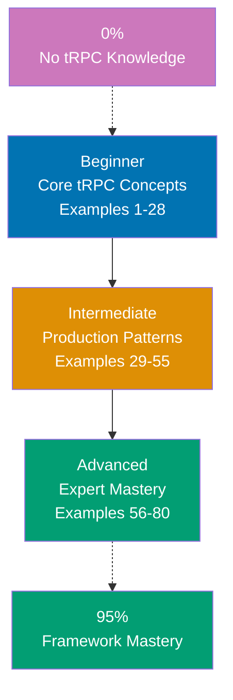

**Want to learn tRPC through code?** This by-example tutorial provides 80 heavily annotated examples covering 95% of tRPC v11. Master type-safe APIs, routers, procedures, middleware, subscriptions, and production patterns through working code rather than lengthy explanations.

## What Is By-Example Learning?

By-example learning is a **code-first approach** where you learn concepts through annotated, working examples rather than narrative explanations. Each example shows:

1. **What the code does** - Brief explanation of the tRPC concept
2. **How it works** - A focused, heavily commented code example
3. **Key Takeaway** - A pattern summary highlighting the key takeaway
4. **Why It Matters** - Production context, when to use, deeper significance

This approach works best when you already understand TypeScript and have some API development experience. You learn tRPC's router model, procedure system, and React Query integration by studying real code rather than theoretical descriptions.

## What Is tRPC?

tRPC is a **TypeScript-first framework for building type-safe APIs** that eliminates the need for REST endpoint documentation or GraphQL schemas. Key distinctions:

- **End-to-end type safety**: Your TypeScript types flow from backend to frontend without codegen steps
- **No schema definition**: Define procedures directly in TypeScript; types infer automatically
- **React Query integration**: First-class hooks for data fetching, caching, and mutations
- **Framework agnostic**: Works with Express, Fastify, Next.js, Nuxt, and standalone servers
- **Zero runtime overhead**: All type magic happens at compile time; runtime is thin adapters

## Learning Path



## Coverage Philosophy: 95% Through 80 Examples

The **95% coverage** means you understand tRPC deeply enough to build production APIs with confidence. It does not mean you will know every edge case or advanced optimization—those come with experience.

The 80 examples are organized progressively:

- **Beginner (Examples 1-28)**: Foundation concepts (initTRPC, routers, query procedures, mutation procedures, input validation with Zod, context, error handling, output types, middleware)
- **Intermediate (Examples 29-55)**: Production patterns (nested routers, auth middleware, subscriptions, React Query hooks, optimistic updates, infinite queries, batching, SSR, error formatting)
- **Advanced (Examples 56-80)**: Expert mastery (custom links, WebSocket transport, testing with createCaller, integration testing, Next.js App Router, performance optimization, type inference utilities, migration patterns)

Together, these examples cover **95% of what you will use** in production tRPC applications.

## Annotation Density: 1-2.25 Comments Per Code Line

**CRITICAL**: All examples maintain **1-2.25 comment lines per code line PER EXAMPLE** to ensure deep understanding.

**What this means**:

- Simple lines get 1 annotation explaining purpose or result
- Complex lines get 2+ annotations explaining behavior, types, and side effects
- Use `// =>` notation to show expected values, outputs, or state changes

**Example**:

```typescript
// server.ts
import { initTRPC } from "@trpc/server"; // => Import tRPC core factory function

const t = initTRPC.create(); // => Creates tRPC instance with default config
// => t exposes router(), procedure, and middleware builders

const appRouter = t.router({
  // => router() groups procedures under a namespace
  hello: t.procedure // => Define a procedure named "hello"
    .query(() => "Hello, tRPC!"), // => .query() marks this as a read-only GET-style operation
  // => Returns string "Hello, tRPC!" with full TypeScript inference
});

export type AppRouter = typeof appRouter; // => Export inferred router type for client use
// => Client imports this type (not value) for end-to-end type safety
```

This density ensures each example is self-contained and fully comprehensible without external documentation.

## Structure of Each Example

All examples follow a consistent five-part format:

````
### Example N: Descriptive Title

2-3 sentence explanation of the concept.

```typescript
// Heavily annotated code example
// showing the tRPC pattern in action
````

**Key Takeaway**: 1-2 sentence summary.

**Why It Matters**: 50-100 words explaining significance in production applications.

````

**Code annotations**:

- `// =>` shows expected output, type inference, or results
- Inline comments explain what each line does and why
- Variable names are self-documenting
- Type annotations make data flow explicit

## What's Covered

### Core tRPC Concepts

- **Router Setup**: `initTRPC`, `t.router()`, `t.procedure`, AppRouter type export
- **Query Procedures**: Read-only operations, input validation, return types
- **Mutation Procedures**: Write operations, side effects, input/output schemas
- **Input Validation**: Zod schemas, optional inputs, complex types
- **Context**: Request context creation, typed context, middleware context augmentation

### Type Safety System

- **Type Inference**: End-to-end inference from server to client
- **Input Types**: Zod-based runtime validation with TypeScript inference
- **Output Types**: Explicit output schemas, type narrowing
- **Error Types**: TRPCError types, custom error codes
- **Router Types**: AppRouter type export, inferRouterInputs/inferRouterOutputs

### Procedure Patterns

- **Middleware**: Procedure middleware, context augmentation, auth guards
- **Chaining**: `.use()` for middleware composition
- **Protected Procedures**: Reusable procedure bases with auth
- **Rate Limiting**: Request throttling in middleware

### React Query Integration

- **useQuery**: Data fetching with caching and refetching
- **useMutation**: Write operations with loading/error states
- **useUtils**: Cache invalidation and optimistic updates
- **useInfiniteQuery**: Cursor-based pagination
- **Batching**: Automatic request batching

### Advanced Features

- **Subscriptions**: WebSocket-based real-time updates
- **Custom Links**: Middleware in the HTTP transport layer
- **SSR Integration**: `createServerSideHelpers` for Next.js SSR
- **App Router**: Next.js 13+ App Router patterns

### Production Patterns

- **Testing**: `createCaller` for unit testing, integration test patterns
- **Monorepo**: Shared type packages, workspace patterns
- **Error Formatting**: Custom error formatting for production
- **Performance**: Batching, deduplication, caching strategies
- **Migration**: Gradual tRPC adoption into existing codebases

## What's NOT Covered

We exclude topics that belong in specialized tutorials:

- **Advanced Zod**: Deep Zod validation patterns (covered in Zod tutorial)
- **Advanced React Query**: Deep React Query features unrelated to tRPC
- **Database Integrations**: Prisma, Drizzle ORM patterns (separate tutorials)
- **Authentication Libraries**: NextAuth, Auth.js deep dives
- **Deployment Infrastructure**: Docker, Kubernetes, Vercel configuration
- **WebSocket Servers**: Raw WebSocket implementation details

For these topics, see dedicated tutorials and framework documentation.

## Prerequisites

### Required

- **TypeScript**: Intermediate level (generics, utility types, type inference)
- **Node.js**: Basic familiarity (modules, async/await)
- **API concepts**: REST or GraphQL experience helpful
- **Programming experience**: You have built APIs or full-stack apps before

### Recommended

- **React**: For the React Query integration examples
- **Zod**: Basic familiarity with schema validation
- **Express or Next.js**: For framework integration examples

### Not Required

- **tRPC experience**: This guide assumes you are new to tRPC
- **GraphQL**: Not necessary; tRPC replaces it, not extends it
- **gRPC**: Different technology; no overlap needed

## Getting Started

Before starting the examples, set up a minimal tRPC project:

```bash
npm create t3-app@latest my-trpc-app
# Select TypeScript, tRPC, and choose your framework
cd my-trpc-app
npm install
npm run dev
````

Or set up manually:

```bash
mkdir trpc-examples && cd trpc-examples
npm init -y
npm install @trpc/server @trpc/client zod
npm install -D typescript @types/node ts-node
```

## How to Use This Guide

### 1. Choose Your Starting Point

- **New to tRPC?** Start with Beginner (Example 1)
- **Know REST/GraphQL?** Start with Beginner—tRPC differs enough to warrant starting fresh
- **Building specific feature?** Search for relevant example topic

### 2. Read the Example

Each example has five parts:

- **Explanation** (2-3 sentences): What tRPC concept, why it exists, when to use it
- **Code** (heavily commented): Working TypeScript code showing the pattern
- **Key Takeaway** (1-2 sentences): Distilled essence of the pattern
- **Why It Matters** (50-100 words): Production context and deeper significance

### 3. Run the Code

Most examples are standalone TypeScript modules you can run with ts-node:

```bash
npx ts-node example.ts
```

### 4. Modify and Experiment

Change procedure names, add new fields, break things on purpose. Experimentation builds intuition faster than reading.

### 5. Reference as Needed

Use this guide as a reference when building features. Search for relevant examples and adapt patterns to your code.

## Ready to Start?

Choose your learning path:

- **Beginner** - Start here if new to tRPC. Build foundation understanding through 28 core examples.
- **Intermediate** - Jump here if you know tRPC basics. Master production patterns through 27 examples.
- **Advanced** - Expert mastery through 25 advanced examples covering performance, testing, and integration.

Or jump to specific topics by searching for relevant example keywords (router, procedure, middleware, subscription, React Query, testing, Next.js, etc.).
