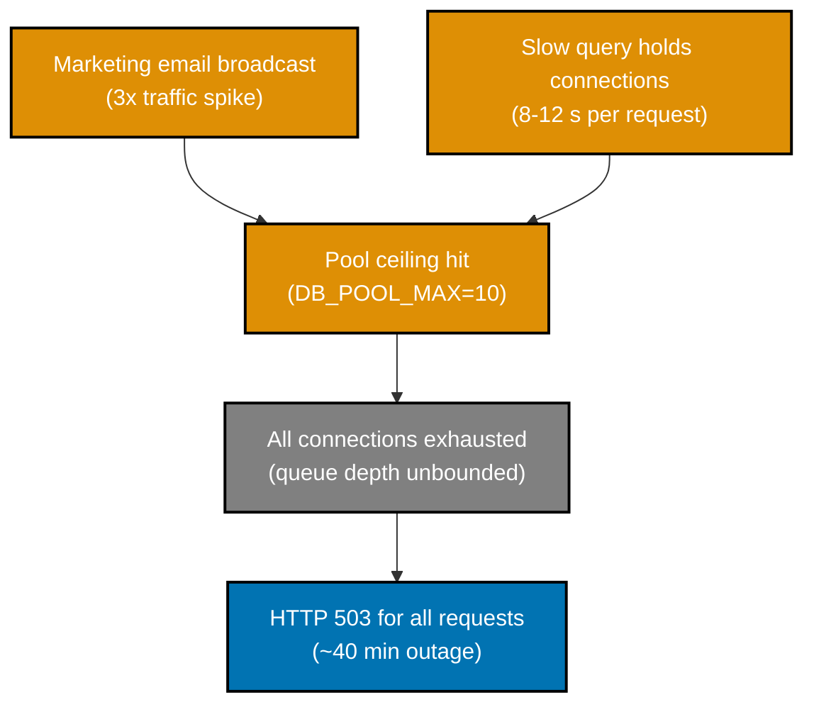

# Post-Mortem: sample-be-service — DB Connection Pool Exhaustion

| Field              | Value                                      |
| ------------------ | ------------------------------------------ |
| Incident date      | 2025-01-15                                 |
| Investigation date | 2025-01-15                                 |
| Severity           | Sev-3 — Moderate                           |
| Status             | Resolved                                   |
| Author             | Platform on-call (blameless retrospective) |

## Background

`sample-be-service` is a clearly-illustrative placeholder name — **this is not a real service in this repository**. It represents a generic Node.js REST API backed by a PostgreSQL database, deployed as a single-instance container behind a load balancer. The service handles read-heavy product-catalog requests and configures its database client with a fixed-size connection pool.

The pool size was set at service initialization and had never been revisited since the original deployment. Connection pool settings lived in application environment configuration (stored in `.env.local`; the actual connection string `<db-connection-string>` is not committed). No pool-utilization metric was instrumented in the monitoring stack prior to this incident.

## Summary

> **Illustrative sample — not a real incident.** This post-mortem is a fabricated example created to demonstrate the blameless post-mortem format for the `ose-primer` template repository. No real service, users, or data were affected.

On 2025-01-15, a marketing-driven traffic spike pushed `sample-be-service` past its statically configured PostgreSQL connection-pool ceiling. The service began returning HTTP 503 errors to all incoming requests at approximately 14:08 WIB. A monitoring alert fired at 14:08 WIB, the on-call engineer identified the root cause at 14:28 WIB, and service was fully restored at 14:47 WIB after raising the pool limit and restarting the container. No data was lost and the incident self-resolved with the workaround in place.

## Impact

- **Affected service**: `sample-be-service` (product-catalog read path)
- **User impact**: Approximately 100% of requests to the service returned HTTP 503 during the degraded window; downstream consumers received empty catalog responses
- **Duration**: ~40 minutes (14:08–14:47 WIB)
- **Data loss**: None
- **MTTD**: ~8 minutes — pool-saturation monitoring alert fired at 14:08 WIB, approximately 8 minutes after load began rising steeply at ~14:00 WIB
- **MTTR**: ~40 minutes — from first alert (14:08 WIB) to full service restoration (14:47 WIB)
- **Workaround availability**: Service restart with raised pool limit was sufficient; no rollback or failover was required

## Detection

A pool-saturation composite alert (`db_pool_wait_queue_depth > 10` for 2 consecutive minutes AND `http_5xx_rate > 0.5` for 1 minute) fired in the monitoring system at 14:08 WIB and paged the Platform on-call engineer. (**Monitoring Alert**)

The alert fired because the `db_pool_wait_queue_depth` metric had been instrumented by the observability team during a previous sprint, even though no explicit saturation threshold had been tuned for production traffic levels. The alert existing at all was partially coincidental — it had been added as a default template metric, not as a deliberately tuned saturation guard.

## Timeline

| Time (WIB UTC+7) | Event                                                                                                                                           |
| ---------------- | ----------------------------------------------------------------------------------------------------------------------------------------------- |
| 2025-01-15 13:58 | Marketing campaign email broadcast triggers above-normal traffic to product-catalog endpoint                                                    |
| 2025-01-15 14:00 | Inbound request rate approximately 3× baseline; pool connection demand begins rising steeply                                                    |
| 2025-01-15 14:06 | Pool fully saturated; new requests begin queuing behind connection wait; slow-query path holds connections open beyond expected duration        |
| 2025-01-15 14:08 | `db_pool_wait_queue_depth` and `http_5xx_rate` thresholds breached; monitoring alert pages on-call engineer                                     |
| 2025-01-15 14:12 | On-call engineer acknowledges alert and begins investigation; confirms 503 responses via `<service-host>/healthz`                               |
| 2025-01-15 14:18 | Engineer reviews application logs (sanitized; connection strings appear as `<db-connection-string>`); identifies pool exhaustion error messages |
| 2025-01-15 14:22 | Engineer identifies slow-query path (`/api/v1/catalog/search`) holding connections open for 8–12 s                                              |
| 2025-01-15 14:28 | Root cause confirmed: pool ceiling `DB_POOL_MAX=10` too low for current peak concurrency; no autoscaling configured                             |
| 2025-01-15 14:35 | Engineer raises `DB_POOL_MAX` from 10 to 30 in environment configuration; initiates container restart                                           |
| 2025-01-15 14:47 | Container restarts complete; 503 error rate drops to zero; service fully restored                                                               |
| 2025-01-15 15:10 | Post-mortem write-up started; action items drafted                                                                                              |

## Root Cause

The connection pool ceiling (`DB_POOL_MAX=10`) was a static value set at initial service deployment and never re-evaluated against actual peak concurrency. The service had no mechanism — alerting, autoscaling, or circuit-breaking — to detect pool saturation before it became total. When demand exceeded the ceiling, all new requests queued indefinitely for a connection, and the queue depth grew faster than connections were released, resulting in a total availability failure for the service.

The root cause is a systemic absence of pool-capacity governance: no process existed to review pool limits as traffic patterns evolved, and no guard existed to shed load gracefully before the pool was fully exhausted.

## Trigger

A marketing team email campaign broadcast at 13:58 WIB drove inbound traffic approximately 3× above the service's baseline load. This spike was not communicated to the Platform team in advance and was not anticipated in the capacity model. The higher concurrency pushed the connection demand past the static pool ceiling of 10 connections within approximately 8 minutes.

The trigger (the traffic spike) was consequential only because the root cause condition (no pool-saturation guard and a statically undersized pool) already existed. A sufficiently sized or dynamically managed pool would have absorbed the spike without an outage.

## Contributing Factors

- **No advance notice of marketing campaign**: The Platform team had no awareness of the email campaign and no opportunity to pre-scale or warn stakeholders. No cross-team change-communication process was in place for marketing-driven load events.
- **Connection leak on slow-query path**: The `/api/v1/catalog/search` endpoint held database connections open for 8–12 seconds due to a missing query result-set limit combined with an unindexed `ILIKE` search predicate. This reduced effective pool throughput and exacerbated saturation.
- **Pool limit never re-evaluated**: The `DB_POOL_MAX=10` value was chosen at initial deployment for a much lower traffic baseline. No periodic capacity-review process existed to revisit this value.
- **No graceful saturation handling**: The service did not implement connection-wait timeouts, backpressure, or request shedding. Pool exhaustion caused immediate 503s rather than a degraded-but-functional response.
- **Alert threshold not tuned for production**: The pool-saturation alert existed as a default template metric rather than a deliberately calibrated production threshold. The alert fired during the incident, but it was not optimally tuned and could have fired earlier with a tighter threshold.

## Resolution & Mitigations

**Applied fix (immediate):**

- Raised `DB_POOL_MAX` from 10 to 30 in the service environment configuration (stored in `.env.local`; value `<db-connection-string>` not committed)
- Restarted the `sample-be-service` container to apply the new pool limit
- Confirmed 503 error rate dropped to zero within 2 minutes of restart

**Open root-cause fixes (tracked in Action Items):**

- Add an explicitly tuned pool-saturation alert with validated thresholds for production traffic levels (P0)
- Fix the connection leak on the `/api/v1/catalog/search` slow-query path by adding a `LIMIT` clause and indexing the search predicate (P1)
- Establish a cross-team change-communication process so the Platform team receives advance notice of marketing campaigns expected to drive load spikes (P1)
- Add a peak-concurrency load test to the CI/CD pipeline to catch pool-ceiling regressions before production (P2)
- Implement connection-wait timeouts and graceful request shedding to bound degradation during future pool-saturation events (P2)

## Action Items

| #   | Action                                                                                        | Owner        | Priority | Ticket                                   | Status   |
| --- | --------------------------------------------------------------------------------------------- | ------------ | -------- | ---------------------------------------- | -------- |
| 1   | Add tuned DB pool-saturation alerting with validated production thresholds                    | Platform     | P0       | plans/backlog/db-pool-alerting/          | Resolved |
| 2   | Fix connection leak on `/api/v1/catalog/search`: add LIMIT clause and index search predicate  | Backend Team | P1       | plans/backlog/catalog-search-slow-query/ | Resolved |
| 3   | Establish cross-team change-communication process for marketing-driven load events            | Platform     | P1       | —                                        | Resolved |
| 4   | Add peak-concurrency load test to CI/CD pipeline to catch pool-ceiling regressions pre-deploy | Backend Team | P2       | —                                        | Resolved |
| 5   | Implement connection-wait timeouts and graceful request shedding in sample-be-service         | Backend Team | P2       | —                                        | Resolved |

## What Went Well

- **Alert fired automatically**: The pool-saturation monitoring alert — even though it was a default template metric rather than a deliberately tuned guard — fired within 8 minutes of load rising and paged the on-call engineer before the situation had time to cascade further. Without it, detection could have been delayed by 20–30 minutes or more.
- **Root cause identified quickly**: Once alerted, the on-call engineer confirmed the root cause within 20 minutes using application logs alone. Log messages were clear and searchable.
- **Recovery was simple and fast**: Raising the pool limit and restarting the container was a low-risk, reversible action that restored service in under 15 minutes. No rollback, database migration, or escalation was required.
- **No data loss**: The pool exhaustion caused availability degradation only; no writes were partially committed and no data corruption occurred.
- **Where we got lucky**: The spike occurred at 14:00 WIB on a weekday during staffed hours. Had it occurred overnight or on a weekend, the MTTR could have been 2–4 hours depending on on-call response time. The fact that this hit during business hours is luck, not resilience — the system would have behaved identically at 03:00 WIB.

## Lessons Learned

- **Static pool limits are a latency bomb**: Any connection pool configured once at deployment and never revisited will eventually become a ceiling that real traffic hits. Pool limits must be part of a periodic capacity-review process tied to observed peak concurrency.
- **"Default template" alerts are not the same as tuned production alerting**: An alert that fires coincidentally during an incident is not evidence of good observability. Thresholds need deliberate calibration against production traffic distributions.
- **Slow-query paths are pool-capacity multipliers**: A query that holds a connection open for 8–12 seconds effectively reduces a pool of 10 to fewer than 2 usable slots at moderate concurrency. Connection-holding bugs need to be treated as reliability defects, not just performance concerns.
- **Marketing-to-engineering change communication is a reliability surface**: Traffic spikes driven by marketing actions are predictable and preventable outages when communication channels exist. The absence of such a channel is a systemic gap, not a one-off coordination failure.
- **Graceful degradation prevents total unavailability**: A service that returns HTTP 503 for 100% of requests during pool saturation provides no value. Connection-wait timeouts and request shedding would have allowed partial service (cached or degraded responses) instead of a total outage.

## References

**In-repo (illustrative — fictional references matching the fabricated scenario):**

- `plans/backlog/db-pool-alerting/` — action item plan for pool-saturation alerting (to be created)
- `plans/backlog/catalog-search-slow-query/` — action item plan for slow-query fix (to be created)
- [Post-Mortem Convention](../../../repo-governance/conventions/structure/post-mortems.md) — authoritative standard this document follows
- [No Secrets in Committed Files](../../../repo-governance/conventions/security/no-secrets-in-committed-files.md) — applied throughout; connection strings appear as `<db-connection-string>`

**Industry sources:**

- Allspaw, J. (2012). _Blameless PostMortems and a Just Culture_. Etsy Code as Craft. <https://www.etsy.com/codeascraft/blameless-postmortems>
- Beyer, B. et al. (2016). _Site Reliability Engineering_, Chapter 15: Postmortem Culture: Learning from Failure. Google. <https://sre.google/sre-book/postmortem-culture/>

## Supporting Data

The causal chain below illustrates how the trigger (traffic spike) propagated through the existing systemic conditions (static pool ceiling, no saturation guard, connection leak) to produce the outage.

