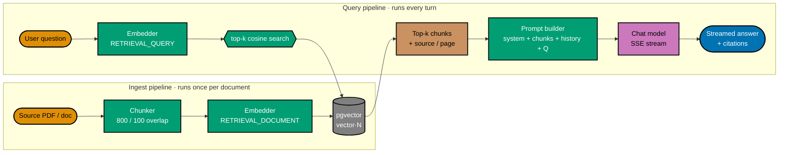
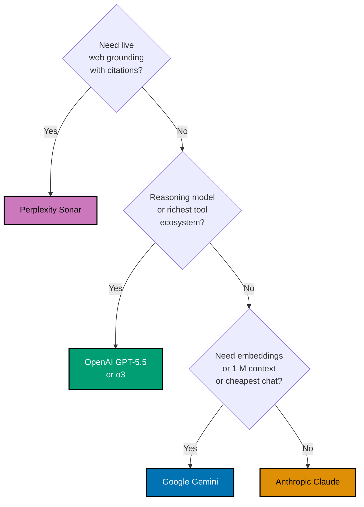

# AI Application Development

**Audience**: software engineers comfortable with HTTP APIs, SQL, and React, but with
little or no prior exposure to building LLM-backed applications. Read this before
working on any AI-shaped plan or app in this repository (e.g., the `investment-oracle`
desktop app) so the rest of the technical material parses without surprises. Nothing
here is plan-internal — it is generic working knowledge.

This primer is generic. Vendor-specific details — model ids, SDK install,
streaming idioms, embeddings, pricing — live in four companion docs that
extend this one, plus one cross-cutting testing companion:

- [Anthropic API Primer](./anthropic-api.md)
- [Google Gemini API Primer](./google-gemini-api.md)
- [OpenAI API Primer](./openai-api.md)
- [Perplexity Sonar API Primer](./perplexity-api.md)
- [Testing AI Applications](./testing-ai-apps.md) — cross-cutting playbook
  for unit / integration / e2e on both BE and FE

## Why this primer exists

AI-app codebases lean on idioms — embeddings, RAG, streaming SSE, prompt assembly,
guardrails, cost caps, multi-provider routing, eval — that have become standard but
are not yet baseline for general-purpose engineers. If you skip this primer you will
still be able to **type** AI-app code; you may not understand **why** each piece
exists or which knobs are safe to turn. Plans that build AI features in this repo
should explicitly require reading this document as a prerequisite for execution.

## Section map

1. [The LLM black box](#1-the-llm-black-box)
2. [Tokens, context windows, and why size matters](#2-tokens-context-windows-and-why-size-matters)
3. [Prompts, messages, and roles](#3-prompts-messages-and-roles)
4. [Streaming responses](#4-streaming-responses)
5. [Embeddings and semantic similarity](#5-embeddings-and-semantic-similarity)
6. [Vector databases and pgvector](#6-vector-databases-and-pgvector)
7. [Retrieval-Augmented Generation (RAG)](#7-retrieval-augmented-generation-rag)
8. [Chunking strategies](#8-chunking-strategies)
9. [Multi-document retrieval](#9-multi-document-retrieval)
10. [Vendor choice and direct APIs](#10-vendor-choice-and-direct-apis)
11. [Persistent chat sessions vs stateless completions](#11-persistent-chat-sessions-vs-stateless-completions)
12. [Production guardrails](#12-production-guardrails)
13. [Evaluation and the lack of unit tests for LLM output](#13-evaluation-and-the-lack-of-unit-tests-for-llm-output)
14. [Cost: where it goes and how to bound it](#14-cost-where-it-goes-and-how-to-bound-it)
15. [Determinism, caching, and CI](#15-determinism-caching-and-ci)
16. [Glossary](#16-glossary)
17. [Where this is referenced](#17-where-this-is-referenced)

---

## 1. The LLM black box

A large language model exposes a single primitive: `completion(prompt) -> text`. The
completion is non-deterministic by default — same input, different output. For chat
models the primitive is `chat(messages) -> text` where `messages` is an ordered list
of `{role, content}` objects (see §3).

Two things follow:

- **No state**: the model has no memory between calls. Anything it should "remember"
  must be passed in on every request. This is the single biggest mental shift coming
  from CRUD: there is no equivalent of a session-on-the-server. Every call is a pure
  function from `messages` to text.
- **No grounding**: the model only knows what was in its training data plus what you
  put in the messages right now. It does not look anything up. If you want it to
  answer questions about a specific document, you must paste relevant excerpts from
  that document into the messages — see §7 RAG.

In this repo's AI demos the LLM is reached through each vendor's official SDK
directly — Anthropic, Google, OpenAI, Perplexity. There is no shared proxy in
the critical path. §10 covers the rationale.

## 2. Tokens, context windows, and why size matters

Models do not see characters or words. They see **tokens** — sub-word units produced
by a tokenizer. Roughly: 1 token ≈ 4 English characters ≈ 0.75 English words. A 2000-
word document is around 2700 tokens.

Each model has a **context window**: the maximum number of tokens that fit in a
single call (counting both the messages you send and the response you receive). Claude
Haiku 4.5 has a 200k-token window; Gemini 2.5 Flash Lite has 1M. Bigger is not free —
see §14 cost.

Practical consequences:

- A 50-page PDF is ~25k tokens. It fits in the window directly. But sending the whole
  PDF on every chat call costs N×25k tokens of input on every turn, which is
  expensive and slow. RAG (§7) is the standard fix. (Long-context Gemini variants
  push the window to 1M and make whole-document Q&A viable for some workloads —
  see the [Gemini primer](./google-gemini-api.md).)
- Conversation history grows linearly with turns. By turn 30 a chatty session is
  already at thousands of tokens of just history. This is why `messages` (the list)
  is the unit of cost, not just the latest user message.
- Token counts are needed for two things: (a) cost cap accounting (cap session and
  daily totals), (b) trimming the conversation if it approaches the window. The
  `tiktoken` library is the typical input-counting tool; outputs from non-OpenAI
  providers are usually approximated by character heuristics or read from the
  provider's own usage block.

## 3. Prompts, messages, and roles

A chat call has a list of messages, each with a `role`:

| Role        | Purpose                                                                                     |
| ----------- | ------------------------------------------------------------------------------------------- |
| `system`    | Configures the model's behaviour for the whole conversation. Tone, refusal policy, persona. |
| `user`      | What the human said.                                                                        |
| `assistant` | What the model said in a previous turn. Echoed back so the model has continuity.            |

A typical request body for a chat call (shape varies by vendor; this is the
generic OpenAI-style shape, with Anthropic and Gemini using equivalent fields
under different names):

```json
{
  "model": "claude-haiku-4-5",
  "messages": [
    { "role": "system", "content": "You answer questions about a PDF. Cite page numbers." },
    { "role": "user", "content": "What does the document say about retries?" },
    { "role": "assistant", "content": "Section 4 of the PDF specifies exponential backoff…" },
    { "role": "user", "content": "And the maximum retry count?" }
  ],
  "stream": true
}
```

Model ids use **hyphen-separated** version parts (`claude-haiku-4-5`,
`gemini-2.5-flash-lite`) — not dots. Each vendor primer pins the exact ids
their API accepts.

Typical RAG-shaped assembly: `[system, ...retrieved_chunks_as_system,
...prior_messages_from_db, latest_user_message]`. See §7.

A **prompt** typically means the assembled messages list, not a single string. Sloppy
use of the word — "the prompt" — usually refers to the system message plus whatever
scaffolding wraps user text.

## 4. Streaming responses

LLMs generate one token at a time, left to right. A non-streaming call waits until
generation finishes, then returns the full string. A streaming call sends each token
as soon as it's produced.

Three reasons to stream:

- **Latency you can feel**: a Haiku-tier model produces ~80 tokens/sec. A 300-token
  answer takes ~4 seconds total but the first token arrives in under 500 ms. Users
  perceive the streaming version as 4× snappier even though the total time is
  identical.
- **Early abort**: if the model goes off the rails, you can close the connection and
  stop being charged for the rest.
- **Live UI affordances**: render token-by-token, run streaming content filters,
  update token-usage counters as you go.

The wire format is **Server-Sent Events (SSE)** — a one-way, text-oriented HTTP
streaming protocol older than WebSockets. The body is `text/event-stream` and each
"frame" looks like:

```text
data: {"delta": "Hello"}

data: {"delta": " world"}

data: [DONE]
```

Blank line between frames is required. The `[DONE]` sentinel is convention, not part
of SSE; it lets the client know to stop reading without parsing the response close.

Typical FastAPI implementation: `sse_starlette.EventSourceResponse` with an
`async_generator` yielding `{"data": ...}`. Typical Next.js consumption: a Route
Handler proxies the upstream SSE body unchanged; `@ai-sdk/react`'s `useChat` hook
consumes it on the client and triggers re-renders per frame.

## 5. Embeddings and semantic similarity

An **embedding** is a fixed-size numeric vector (e.g., 1536 floats) that encodes the
**meaning** of a piece of text. Two texts with similar meaning have embeddings whose
**cosine similarity** is close to 1; unrelated texts approach 0; opposites approach
-1.

```text
"The cat sat on the mat."   → [0.014, -0.221, 0.007, …, 0.063]   # 1536 dims
"A feline rested on a rug." → [0.018, -0.215, 0.011, …, 0.060]   # very similar
"The diesel engine seized." → [-0.331, 0.092, …, -0.118]         # different
```

You don't read the numbers. You compare them.

Where the vector comes from:

- A separate model — the **embedding model** — trained specifically to map text to a
  meaning-preserving vector space.
- Endpoint shape is similar to chat: send text + model id, receive a vector.
  Each vendor names the route slightly differently (Gemini exposes
  `models.embed_content`).
- This repo standardises on `gemini-embedding-001` configured to 768 output
  dimensions for AI demos. Anthropic does not ship an embedding endpoint, so
  even when chat is served by Anthropic the embedding step is served by
  Google. See the [Gemini primer §Embeddings](./google-gemini-api.md#embeddings-the-headline-feature).

Why it matters: keyword search ("retry") misses synonyms ("backoff", "re-attempt").
Embedding-similarity search finds them. That is the entire trick behind RAG.

## 6. Vector databases and pgvector

Once you have embeddings, you need to find the top-k nearest vectors to a query
vector quickly. A **vector database** is any storage with that primitive.

Options:

- Dedicated services: Pinecone, Weaviate, Qdrant, Milvus.
- In-process libraries: `chromadb`, `lancedb`, `faiss`.
- **Postgres with the `pgvector` extension** — adds a `vector(N)` column type plus
  similarity operators (`<=>` for cosine distance). This is the default for AI demos
  in this repo because every CRUD demo already runs Postgres in docker-compose;
  reusing it adds zero infra.

Operator quick reference:

| Operator | Distance metric        | Range   |
| -------- | ---------------------- | ------- |
| `<->`    | Euclidean (L2)         | [0, ∞)  |
| `<=>`    | Cosine distance        | [0, 2]  |
| `<#>`    | Negative inner product | (-∞, ∞) |

Cosine distance is `1 - cosine_similarity`, so smaller is better. Most RAG retrieval
SQL in this repo uses `<=>`.

Indexing: a sequential scan over a table of N vectors is O(N) per query — fine for
demos, slow at scale. pgvector ships two approximate-nearest-neighbour indexes:
**ivfflat** (faster builds, lower recall) and **hnsw** (slower builds, higher
recall). Demos use `ivfflat` because the corpus is tiny.

## 7. Retrieval-Augmented Generation (RAG)

The standard pattern for "answer questions about my documents":

```text
1. Ingest:    docs → chunks → embeddings → vector DB
2. Query:     user question → embedding → top-k similar chunks
3. Assemble:  prompt = [system, chunks-as-context, history, user question]
4. Generate:  send prompt to chat model, stream response
```



Why it works: §1 says LLMs only know what's in their training data plus what you
hand them on each call. §6 lets you pick the **most relevant** slice of your private
docs cheaply. RAG glues the two together so the model can answer about your data
without fine-tuning anything.

Why it's not magic:

- Recall failures: if the right chunk has weak similarity to the query, it won't be
  retrieved, and the model has nothing to cite. Hybrid search (BM25 + vectors) and
  re-ranking are common upgrades; demos in this repo skip both.
- Hallucination: even with the right chunks, the model can still invent. Mitigations
  are prompt instructions ("only answer from the provided excerpts"), citations,
  and downstream evaluation (§13). Don't ship a RAG product without thinking about
  this; demos surface raw model output and let the reader judge.

## 8. Chunking strategies

You can't embed an entire 50-page PDF as one vector — the embedding would average
across all topics and become uninformative. So you split into **chunks**, each
embedded separately.

Trade-offs:

| Strategy            | Pro                            | Con                                      |
| ------------------- | ------------------------------ | ---------------------------------------- |
| Fixed-token windows | Simple, predictable            | Cuts mid-sentence; loses context         |
| Sentence boundaries | Reads naturally                | Variable-length; harder to budget tokens |
| Recursive splitting | Respects markdown / paragraphs | Implementation complexity                |
| Semantic splitting  | Best context preservation      | Slow, requires extra model calls         |

Demos in this repo use **fixed token windows with overlap** (typical defaults: 800
tokens, 100-token overlap). Overlap means a sentence cut at the boundary still
appears intact in the next chunk. This is good enough for a demo; production RAG
systems typically use recursive splitting or library helpers
(`langchain.text_splitter`, `llama-index` parsers).

## 9. Multi-document retrieval

When a session attaches multiple documents, the retrieval set is the union of chunks
across all attached documents. SQL handles this naturally:

```sql
SELECT id, doc_id, page, text,
       1 - (embedding <=> :q) AS similarity
FROM doc_chunks
WHERE doc_id IN (SELECT doc_id FROM session_docs WHERE session_id = :s)
ORDER BY embedding <=> :q
LIMIT :k;
```

The result set may interleave chunks from different documents. Pass them all to the
prompt with their `doc_id` and `page` so the model can cite which document a fact
came from. No per-document balancing — if document A is more relevant, all top-k may
come from A; that's the desired behaviour.

## 10. Vendor choice and direct APIs

Anthropic, Google, Perplexity, OpenAI, Mistral, Meta, and many smaller vendors
each ship their own SDK and pricing. Two ways to handle that:

1. **Direct vendor SDKs.** Wire each vendor's official SDK into the backend.
   Pay full latency cost (no proxy hop). Use vendor-specific features
   (Anthropic prompt caching, Gemini Files API, Perplexity citations) without
   compromise. **This is the default in this repo.**
2. **Proxy aggregators** (OpenRouter, LiteLLM, Portkey). One OpenAI-shaped
   API, many models behind it. Cuts integration work for breadth-first
   prototypes. Costs an extra network hop and obscures vendor-specific
   features.

The repo standardises on direct SDKs because:

- Demos teach **what each vendor actually looks like**, not what a proxy
  flattened it into. A reader cloning the template should be able to lift the
  vendor wiring straight into a production codebase.
- Vendor-specific features (PDF input shapes, prompt caching, citations,
  embedding task types) matter once the demo grows beyond toy.
- Ops cost: one extra dependency per vendor SDK, but no extra network hop.

Convention in this repo:

- Model ids use **hyphen-separated** version parts (`claude-haiku-4-5`,
  `gemini-2.5-flash-lite`). The earlier dot-separated convention was a proxy
  artifact and is retired.
- The default chat pairing is **Anthropic Claude Haiku 4.5** (premium-quality
  small model) and **Google Gemini 2.5 Flash-Lite** (cheap-tier alternative).
- Embeddings always come from Google: `gemini-embedding-001` at 768
  dimensions.
- Live web grounding, when needed, comes from Perplexity Sonar.

For vendor-specific install, auth, request shape, streaming, mocking: read
the four companion docs ([Anthropic](./anthropic-api.md),
[Gemini](./google-gemini-api.md), [OpenAI](./openai-api.md),
[Perplexity](./perplexity-api.md)).

### Vendor choice — quick decision tree



Most production stacks reach for **two** of the four: Anthropic or
OpenAI for chat, Gemini for embeddings (since Anthropic ships none).
Perplexity is the third lane only when the live-web-citation shape is
the product.

## 11. Persistent chat sessions vs stateless completions

§1 said the model has no memory. So how do real chat products feel like they
remember? They store the message history in **their own database** and re-send it on
every call.

A persistent chat **session** is a server-owned thread:

| Attribute        | Stateless completion  | Persistent session                |
| ---------------- | --------------------- | --------------------------------- |
| Server state     | None                  | `sessions` row + `messages` rows  |
| History source   | Whatever client sends | Loaded from DB on each turn       |
| Survives reload  | No                    | Yes (URL contains the session id) |
| Allows analytics | No                    | Yes (you own the data)            |
| Allows retention | No                    | Yes (delete the row to forget)    |

Production AI products almost always use sessions; demos in this repo do too, so the
durable-thread shape is reusable. The chat endpoint is typically scoped under
`POST /api/v1/sessions/{id}/messages` rather than a free-floating `/chat`.

## 12. Production guardrails

Three layers, ordered before/around/after the model call:

### Rate limiting

Cap the number of requests per IP per unit time. Stops a single client from running
the bill up or DoS-ing the backend. Implementations range from in-process token
buckets (`slowapi` is the typical Python choice) to Redis-backed distributed
limiters.

### Content filtering

Two kinds:

- **Input moderation**: scan the user message before calling the LLM. Reject obvious
  abuse, prompt injection, or out-of-scope requests.
- **Output moderation**: scan the model's response (or each streaming chunk) before
  delivering. Catches the cases where the input was clean but the model produced
  problematic output.

Real systems plug a moderation provider here (Anthropic moderation, OpenAI
moderation, custom classifier). Demos in this repo ship a regex blocklist behind a
`ContentFilter` Protocol so a real provider can be swapped in without touching
callers.

### Cost cap

Track tokens consumed per session and per day; reject calls once a budget threshold
is exceeded. Token counts come from the response usage block (Anthropic / OpenAI
include this in their non-streaming responses; for streams you count yourself).
Prevents a runaway loop or a viral demo from melting your bill.

A typical schema: `token_usage(session_id, usage_date, input_tokens, output_tokens)`,
upserted on each turn, with `429 token_budget_exceeded` returned when limits are
hit.

## 13. Evaluation and the lack of unit tests for LLM output

You cannot write `assert chat("What is 2+2?") == "4"` and expect it to pass forever
— even with `temperature=0` the response wording varies. So how do you test?

Three layers, all of which the AI demos in this repo use:

- **Structural assertions**: assert the response is well-formed JSON / SSE / has the
  right schema. Stable across runs.
- **Mocked-LLM tests**: replace the network call with a fixture (cassette). Asserts
  **what we sent** (model id, prompt content, retrieval results) — not what came
  back. Demos toggle this with a `MOCK_LLM_PROVIDERS=true` flag that intercepts
  outbound `httpx` traffic to every vendor base URL (`api.anthropic.com`,
  `generativelanguage.googleapis.com`, `api.perplexity.ai`).
- **Eval suites** (out of scope for most demos): hand-curated inputs scored against
  rubric (factuality, format adherence, refusal correctness). Run periodically, not
  on every CI build, because they cost real money. Tools: Promptfoo, Langfuse,
  Inspect AI, Evidently, plus rolling-your-own pytest fixtures.

The takeaway: **every CI test must be deterministic and offline**. Real-LLM smoke
runs are workflow-dispatch only. The full playbook — three levels on the
BE, two levels on the FE, with cassette shapes per vendor, real-vendor
smoke wiring, vector-retrieval testing, and PII-masking testing — lives
in the companion [Testing AI Applications](./testing-ai-apps.md) doc.

## 14. Cost: where it goes and how to bound it

Pricing is per-million tokens, charged separately for input and output. Indicative
2026-Q2 list prices direct from each vendor:

| Model                   | Vendor     | Input $/M | Output $/M |
| ----------------------- | ---------- | --------: | ---------: |
| `claude-haiku-4-5`      | Anthropic  |      1.00 |       5.00 |
| `claude-sonnet-4-6`     | Anthropic  |      3.00 |      15.00 |
| `gemini-2.5-flash-lite` | Google     |      0.10 |       0.40 |
| `gemini-2.5-flash`      | Google     |      0.30 |       2.50 |
| `gemini-embedding-001`  | Google     |      0.15 |          — |
| `sonar`                 | Perplexity |      1.00 |       1.00 |

Perplexity also charges a per-request search fee on top of token cost
(see the [Perplexity primer](./perplexity-api.md#pricing-2026-q2)).

A back-of-envelope chat turn for a typical RAG-shaped backend:

- 4 retrieved chunks × 800 tokens = 3200 input tokens.
- Conversation history: another ~2000 tokens by turn 5.
- User question: 100 tokens.
- Model writes 400 tokens.
- Total Haiku 4.5 cost: 5300 × $1/M + 400 × $5/M ≈ **$0.0073 per turn**.

Multiply by users and turns for the production estimate. The §12 cost cap is the
defensive layer; product-side, the levers are: cheaper model, smaller chunks, fewer
chunks (lower top-k), shorter system prompt, history truncation past N turns, and
embedding-call deduplication (don't re-embed the same query twice).

## 15. Determinism, caching, and CI

Three operational realities to know:

- **`temperature=0`** reduces variance but does not eliminate it across providers,
  versions, or even minor backend updates. Treat it as a hint, not a guarantee.
- **Provider prompt caching** (Anthropic) and context caching (Gemini) can
  knock 50–90% off cost on repeated prefixes. Out of scope for most demos but
  worth knowing it exists; see the vendor primers for the per-vendor flag.
- **CI must not call real models** unless you have explicit dispatch + budget
  awareness. Demos in this repo default every test target to
  `MOCK_LLM_PROVIDERS=true`. Real-vendor smoke runs are workflow-dispatch only.

## 16. Glossary

| Term               | Plain definition                                                                                                                         |
| ------------------ | ---------------------------------------------------------------------------------------------------------------------------------------- |
| LLM                | Large language model. Statistical text generator behind every chat endpoint.                                                             |
| Token              | Sub-word unit. Models bill per token, both for input and output.                                                                         |
| Context window     | Maximum tokens per call (input + output). Claude Haiku 4.5 = 200k.                                                                       |
| Embedding          | Fixed-size numeric vector encoding meaning. Demos use 768-dim vectors from `gemini-embedding-001`.                                       |
| Cosine similarity  | Dot product of two unit vectors. Measures meaning closeness; range [-1, 1].                                                              |
| Vector DB          | Storage that supports fast top-k similarity queries. Default in this repo: Postgres + pgvector.                                          |
| Chunk              | A bounded slice of a document, embedded as one vector.                                                                                   |
| RAG                | Retrieval-Augmented Generation. Retrieve chunks, paste into prompt, generate answer.                                                     |
| top-k              | The number of best-matching chunks to return from a similarity query (typically 4).                                                      |
| Prompt             | The assembled list of messages sent to the chat endpoint.                                                                                |
| System message     | Persona / behaviour configuration message at the start of `messages`.                                                                    |
| Streaming          | Token-by-token response delivery via SSE.                                                                                                |
| SSE                | Server-Sent Events. One-way HTTP streaming with `text/event-stream`.                                                                     |
| Session            | Server-persisted chat thread. Survives reload because history lives in the DB.                                                           |
| Multi-document RAG | Retrieval scoped to multiple source documents in one query.                                                                              |
| Vendor primer      | Per-vendor extension of this doc covering install, request shape, streaming, mocking. Four exist: Anthropic, Gemini, OpenAI, Perplexity. |
| Guardrail          | Pre-/post-model layer enforcing rate limit, content rules, or budget limits.                                                             |
| Hallucination      | Model output that is fluent but factually wrong.                                                                                         |
| Eval               | Measurement of LLM output quality against a rubric or held-out test set. Distinct from unit tests.                                       |
| Token budget       | Per-session or per-day cap on tokens consumed; demos reject with `429 token_budget_exceeded`.                                            |
| Mocked-LLM test    | Test that intercepts the LLM call and returns a fixture so CI is deterministic and free.                                                 |
| Tokenizer          | Converts strings to token ids. Different models use different tokenizers; `tiktoken` ships several.                                      |

## 17. Where this is referenced

Plans and apps that build AI features in this repo are expected to require this
primer as prerequisite reading. Examples:

- `plans/in-progress/2026-04-27__add-investment-oracle-app/` — adds the
  `investment-oracle` desktop demo (Tauri 2 shell, Python/FastAPI sidecar,
  React+Vite FE, Playwright E2E pair); cites this document and all three
  vendor primers in its delivery checklist as required reading.

Future AI plans should cite this document the same way and may extend it with
domain-specific addenda rather than redefining the same vocabulary inline.

## Related

- [Anthropic API Primer](./anthropic-api.md) — model lineup, SDK install,
  streaming, PDF input, the no-embeddings caveat
- [Google Gemini API Primer](./google-gemini-api.md) — long context,
  embeddings via `gemini-embedding-001`, cheap chat
- [OpenAI API Primer](./openai-api.md) — Responses API vs Chat Completions,
  GPT-5.x and o3, reasoning-effort knob, built-in tools
- [Perplexity Sonar API Primer](./perplexity-api.md) — web-grounded answers,
  citations, when not to use it
- [Testing AI Applications](./testing-ai-apps.md) — cross-cutting testing
  playbook for unit / integration / e2e on BE and FE
- [Software Engineering](../README.md) — parent index
- [Explanation](../../README.md) — Diátaxis explanation root
- [Behavior-Driven Development](../development/behavior-driven-development-bdd/README.md) — Gherkin scenarios used for AI feature acceptance criteria
- [Test-Driven Development](../development/test-driven-development-tdd/README.md) — relevant for the structural-assertion layer in §13
