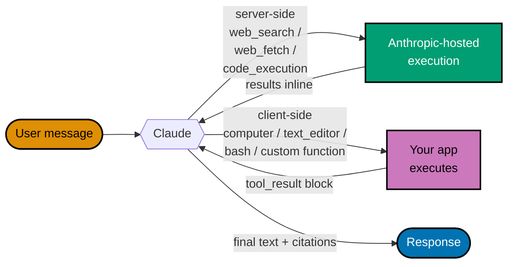

# Anthropic API Primer

**Audience**: software engineers wiring Anthropic Claude into a backend, having
read the [AI Application Development primer](./README.md) first. This doc is
vendor-specific reference framed as explanation: read top-to-bottom on first
exposure, dip in by section thereafter. All facts dated 2026-04-27.

## When to reach for Anthropic

Reach for Anthropic when the workload is:

- Multi-step reasoning over private context (long PDFs, internal codebases,
  proprietary specs) where output quality matters more than per-token cost.
- Tool use / agentic loops (the Anthropic SDK has a fluent tool-use API and
  models trained for it).
- Latency-sensitive UX where Haiku's ~80 tok/s and ~500 ms first-token are the
  product.

Skip Anthropic when:

- You need embeddings — Anthropic does **not** ship an embeddings endpoint.
  Pair Claude with Gemini's `gemini-embedding-001` (see the
  [Gemini primer](./google-gemini-api.md)) or with Voyage AI per Anthropic's
  own recommendation.
- You need live web search grounding — see the
  [Perplexity primer](./perplexity-api.md).

## Model lineup (2026-Q2)

Anthropic surfaces models by family (Haiku, Sonnet, Opus) and version (4.5,
4.6, …). Each model has both a **dated id** (immutable, version-pinned) and an
**alias** (resolves to the latest minor). For reproducible CI, use the dated
id. For demos and exploratory work, the alias is fine.

| Model      | Tier         | Alias               | Dated id                         | Context window | Status     |
| ---------- | ------------ | ------------------- | -------------------------------- | -------------- | ---------- |
| Haiku 4.5  | small / fast | `claude-haiku-4-5`  | `claude-haiku-4-5-20251001`      | 200 k tokens   | current    |
| Sonnet 4.5 | mid          | `claude-sonnet-4-5` | `claude-sonnet-4-5-20250929`     | 200 k tokens   | **legacy** |
| Sonnet 4.6 | mid          | `claude-sonnet-4-6` | (dated suffix per release notes) | 1 M tokens     | current    |

Notes:

- Model ids use **hyphens** between version parts (`claude-haiku-4-5`), not
  dots. A previous repo convention used dots; that was wrong and is being
  retired across all docs and demos.
- Sonnet 4.5 still works but Anthropic now classes it as legacy. New work
  picks Sonnet 4.6 unless a deliberate reason exists.
- Verify the current set at any time:
  [models overview](https://platform.claude.com/docs/en/about-claude/models/overview).

## SDKs and authentication

Two officially supported SDKs:

| Language   | Package             | Latest version (2026-04-27) | Repo                                                     |
| ---------- | ------------------- | --------------------------: | -------------------------------------------------------- |
| Python     | `anthropic`         |                      0.97.0 | <https://github.com/anthropics/anthropic-sdk-python>     |
| TypeScript | `@anthropic-ai/sdk` |                      0.90.0 | <https://github.com/anthropics/anthropic-sdk-typescript> |

Both SDKs read `ANTHROPIC_API_KEY` from the environment by default. For server
deployment use a secret manager; for local dev use `.env` (gitignored) plus an
`.env.example` shipping placeholders only.

## Minimal request — Python

```python
from anthropic import Anthropic

client = Anthropic()  # reads ANTHROPIC_API_KEY

resp = client.messages.create(
    model="claude-haiku-4-5",
    max_tokens=1024,
    messages=[{"role": "user", "content": "Summarise this 10-K in 3 bullets."}],
)
print(resp.content[0].text)
```

## Minimal request — TypeScript

```ts
import Anthropic from "@anthropic-ai/sdk";

const client = new Anthropic(); // reads ANTHROPIC_API_KEY

const resp = await client.messages.create({
  model: "claude-haiku-4-5",
  max_tokens: 1024,
  messages: [{ role: "user", content: "Summarise this 10-K in 3 bullets." }],
});
console.log(resp.content[0].type === "text" ? resp.content[0].text : "");
```

## Streaming

Both SDKs ship a fluent streaming helper that wraps the underlying SSE wire
format and exposes a simple text-stream iterator.

```python
with client.messages.stream(
    model="claude-haiku-4-5",
    max_tokens=1024,
    messages=[{"role": "user", "content": "Stream three short bullets."}],
) as stream:
    for chunk in stream.text_stream:
        print(chunk, end="", flush=True)
    final = stream.get_final_message()  # full response with usage block
```

```ts
const stream = client.messages.stream({
  model: "claude-haiku-4-5",
  max_tokens: 1024,
  messages: [{ role: "user", content: "Stream three short bullets." }],
});
for await (const event of stream) {
  if (event.type === "content_block_delta" && event.delta.type === "text_delta") {
    process.stdout.write(event.delta.text);
  }
}
const final = await stream.finalMessage();
```

For details — including how to inject streaming chunks into a
`sse-starlette.EventSourceResponse` to forward them to a browser — see the
[official streaming guide](https://platform.claude.com/docs/en/build-with-claude/streaming).

## PDF input

Anthropic accepts PDFs as a first-class content block. For a 200 k-context
model (Haiku 4.5, Sonnet 4.5):

- **Maximum 100 pages per request** (the higher 600-page limit applies only to
  1 M-context models).
- **Maximum request size 32 MB** including all encoded content.
- Three delivery shapes: URL reference (Anthropic fetches), inline base64, or
  Files API `file_id` (upload once, reference many times).

```python
import base64, pathlib

pdf_bytes = pathlib.Path("aapl-fy2024-10k.pdf").read_bytes()
encoded = base64.standard_b64encode(pdf_bytes).decode()

resp = client.messages.create(
    model="claude-haiku-4-5",
    max_tokens=2048,
    messages=[{
        "role": "user",
        "content": [
            {"type": "document", "source": {
                "type": "base64",
                "media_type": "application/pdf",
                "data": encoded,
            }},
            {"type": "text", "text": "Identify the three biggest risks."},
        ],
    }],
)
```

For RAG-style workloads where a single PDF exceeds 100 pages or the total
prompt blows past the context window, do not send the PDF whole — embed and
retrieve top-k chunks (see §5–§7 of the [main primer](./README.md)).

## The no-embeddings caveat

Anthropic intentionally does not ship an embedding endpoint:

> Anthropic does not offer its own embedding model. One embeddings provider
> that has a wide variety of options and capabilities encompassing all of the
> above considerations is Voyage AI.
>
> — [Anthropic embeddings docs](https://platform.claude.com/docs/en/build-with-claude/embeddings)

Practical consequences for an AI app that pairs Anthropic with RAG:

- Pick **one** embedding provider and stick to it across the whole pipeline.
  Mixing providers breaks the vector space — a chunk embedded by Voyage cannot
  be compared with a query embedded by Gemini.
- Demos in this repo standardise on `gemini-embedding-001` (768-dim
  configuration) for the embedding step regardless of which provider serves
  chat. See the [Gemini primer](./google-gemini-api.md) §Embeddings.

## Context-window economics

Both 200 k and 1 M context options exist; bigger is not always better:

| Use case                                                  | Recommended model | Why                                                 |
| --------------------------------------------------------- | ----------------- | --------------------------------------------------- |
| Chat over RAG-retrieved chunks (top-k ≤ 8, ≤ 10 k tokens) | Haiku 4.5         | Cheapest; latency feels instant                     |
| Long-document analysis (single 50 k–150 k token doc)      | Haiku 4.5         | Fits in 200 k window with conversation history room |
| Multi-document analysis (≥ 200 k combined input)          | Sonnet 4.6        | 1 M window swallows the entire corpus               |
| Tool-use loops with intermediate scratchpad turns         | Sonnet 4.6        | Better instruction following on multi-step plans    |

Long context is also expensive — every token is billed every turn. RAG (§7 of
the main primer) almost always beats raw long-context for cost.

## Prompt caching (briefly)

Anthropic offers prompt caching for repeated prefixes (system prompt, large
fixed context). Cached writes cost more than uncached input on the first turn
but ~90 % less on subsequent turns. Out of scope for most demos but worth
knowing it exists when a system prompt grows large enough to dominate per-turn
cost. See the [prompt-caching docs](https://platform.claude.com/docs/en/build-with-claude/prompt-caching).

## Tools and built-in capabilities

Anthropic exposes a richer tool surface than most vendors. Tools split into
two flavours:

- **Server-side tools** — Anthropic executes them; you receive results
  inside the response (web search, web fetch, code execution).
- **Client-side tools** — Anthropic emits a structured action; your
  application executes it and feeds the result back (computer use, text
  editor, bash). Versioned by date suffix (e.g., `_20251124`).

| Tool                       | Type string (current)                  | Side          | Notes                                                                                                           |
| -------------------------- | -------------------------------------- | ------------- | --------------------------------------------------------------------------------------------------------------- |
| Web search                 | `web_search_20260209`                  | server        | $10 per 1 000 searches plus input tokens for results. Citations always included.                                |
| Web fetch                  | `web_fetch_20260209`                   | server        | Server-side URL retrieval; pairs with web search for "open this result" patterns.                               |
| Code execution             | `code_execution_20260120`              | server        | Sandboxed Python + Bash. **Free** when combined with web search or web fetch.                                   |
| Computer use               | `computer_20251124`                    | client        | Beta header `anthropic-beta: computer-use-2025-11-24`. Sub-actions: screenshot, click, type, scroll, drag, etc. |
| Text editor                | `text_editor_20250728`                 | client        | Commands: `view`, `str_replace`, `create`, `insert`. Tool name `str_replace_based_edit_tool`.                   |
| Bash                       | `bash_20250124`                        | client        | Persistent shell session. No interactive commands.                                                              |
| MCP connector              | `mcp_toolset`                          | server        | Beta header `mcp-client-2025-11-20`. Connects Claude to any remote MCP server.                                  |
| Tool search (regex / BM25) | `tool_search_tool_regex_20251119`      | server        | For deferred-load patterns over large tool catalogs.                                                            |
| Memory                     | `memory_20250818`                      | client        | Persistent memory across sessions.                                                                              |
| Custom function            | (no type — `tool_use` blocks)          | client        | Standard JSON-schema tool declarations.                                                                         |
| Files API                  | `anthropic-beta: files-api-2025-04-14` | (input shape) | Upload-once, reference by `file_id` in `document` blocks. Free for ops; tokens billed when used.                |

### Custom function calling

```python
weather_tool = {
    "name": "get_weather",
    "description": "Get the current weather for a city.",
    "input_schema": {
        "type": "object",
        "properties": {"city": {"type": "string"}},
        "required": ["city"],
    },
}

resp = client.messages.create(
    model="claude-haiku-4-5",
    max_tokens=1024,
    tools=[weather_tool],
    messages=[{"role": "user", "content": "What's the weather in Madrid?"}],
)

if resp.stop_reason == "tool_use":
    tool_block = next(b for b in resp.content if b.type == "tool_use")
    # Execute tool_block.input["city"] yourself, send the result back as a
    # new user message with a tool_result block.
```

### Server-side web search

```python
resp = client.messages.create(
    model="claude-haiku-4-5",
    max_tokens=2048,
    tools=[{
        "type": "web_search_20260209",
        "name": "web_search",
        "max_uses": 5,
        "allowed_domains": ["docs.python.org", "peps.python.org"],
    }],
    messages=[{"role": "user", "content": "What changed in Python 3.13?"}],
)
# Citations live inside content blocks of type "web_search_tool_result".
```

In a private-corpus RAG pipeline (the shape this repo's demos use)
**don't enable web search** — it pulls in unverified public content
alongside your retrieved chunks. Reach for it only when the demo's job
is grounded-on-the-public-web answers, in which case Perplexity Sonar is
also a candidate (see [Perplexity primer](./perplexity-api.md)).

## Additional features (not "tools" but worth knowing)

| Feature             | Mechanism                                                                                            | Notes                                                                                                                 |
| ------------------- | ---------------------------------------------------------------------------------------------------- | --------------------------------------------------------------------------------------------------------------------- |
| Message Batches API | `POST /v1/messages/batches` with a list of standard Messages requests                                | **50 % discount** on input + output. Most batches finish < 1 hour; max 24 h SLA. Up to 300 k output tokens with beta. |
| Prompt caching      | `"cache_control": {"type": "ephemeral"}` on content blocks (default 5-min TTL; opt-in `"ttl": "1h"`) | Cache writes 1.25× (5-min) or 2× (1-hour) base input rate; reads 0.10×. Default TTL switched 1h → 5min on 2026-03-06. |
| Citations           | `"citations": {"enabled": true}` on `document` content blocks                                        | Response includes `char_location` / `page_location` / `content_block_location` blocks. `cited_text` not billed.       |
| Vision input        | `image` content blocks (base64 / URL / Files API `file_id`)                                          | All current Claude models. JPEG, PNG, GIF, WebP.                                                                      |
| Extended thinking   | `"thinking": {"type": "enabled", "budget_tokens": N}`                                                | Supported on Claude 4.5/4.1/4. **Not supported** on Opus 4.7 (returns 400) — adaptive thinking replaces it.           |
| Adaptive thinking   | `"thinking": {"type": "adaptive", "effort": "low"/"medium"/"high"}`                                  | Recommended for Opus 4.7, Sonnet 4.6, Opus 4.6. Interleaves reasoning between tool calls automatically.               |
| Files API           | `anthropic-beta: files-api-2025-04-14` header; reference by `file_id` in document/image blocks       | Free for ops (upload / list / delete); content billed as input tokens when used. ≤ 500 MB / file, ≤ 500 GB / org.     |

### Tool flow visualised



The split matters operationally: server-side tools mean Anthropic's
infrastructure makes outbound calls (and the egress shows Anthropic IPs,
not yours); client-side tools route through **your** infrastructure, so
you control the credentials, audit trail, and blast radius.

## Indonesia data residency

For products subject to Indonesian regulation (UU PDP No. 27/2022; OJK
POJK 11/POJK.03/2022 for commercial banks; BSSN/Komdigi PSE
registration), where the Claude API call physically runs matters. Two
truths to anchor on:

1. **Anthropic's direct API has no Indonesian region.**
   `api.anthropic.com` exposes only `inference_geo: "us"` or `"global"`.
   Workspace data at rest is US-only. There is no APAC option as of
   2026-04-27.
   ([data residency docs](https://platform.claude.com/docs/en/build-with-claude/data-residency))
2. **Claude on Amazon Bedrock has an Indonesia region.** AWS
   `ap-southeast-3` (Jakarta) is live. Claude Opus 4.7 supports
   **in-region** processing in Jakarta. Claude Haiku 4.5, Sonnet 4.5/4.6,
   Opus 4.5/4.6 are reachable from `ap-southeast-3` only via **Global
   Cross-Region Inference (CRIS)** — data at rest stays in Indonesia, but
   inference compute can route to any of 20+ AWS regions.
   ([AWS announcement](https://aws.amazon.com/blogs/machine-learning/global-cross-region-inference-for-latest-anthropic-claude-opus-sonnet-and-haiku-models-on-amazon-bedrock-in-thailand-malaysia-singapore-indonesia-and-taiwan/),
   [region compatibility](https://docs.aws.amazon.com/bedrock/latest/userguide/models-region-compatibility.html))

Practical guidance:

- For workloads handling Indonesian personal data and required to keep
  inference on-shore: **Bedrock `ap-southeast-3` with the Opus 4.7
  in-region profile**. Validate the model's deployment type in the
  Bedrock console at deployment time — AWS is rolling out in-region
  support to additional Claude models continuously.
- For non-Opus-4.7 models on Bedrock Jakarta, the **CRIS path keeps data
  at rest in Indonesia** but ships inference traffic across borders;
  this often satisfies POJK 11 record-keeping and OJK PIT-SE requirements
  for non-OJK-tier-1 workloads, but not full PDP-strict on-shore
  processing.
- For workloads that can use the direct API: the cross-border transfer
  must satisfy UU PDP Article 56(2)(iv) — adequacy (no regulator yet),
  binding contractual safeguards, or explicit data-subject consent. Pre-
  and post-transfer reports to Komdigi may be required.
- Foreign electronic system providers reaching Indonesian users must
  register as **PSE Private Scope** (PP 71/2019) — unrelated to where
  the LLM runs, but a parallel obligation that this primer flags so it
  is not overlooked.

## Reference cost (2026-Q2)

Indicative public list prices per million tokens; verify current values at
[platform.claude.com/pricing](https://platform.claude.com/pricing) before
publishing user-facing budget tools.

| Model      | Input | Output |
| ---------- | ----: | -----: |
| Haiku 4.5  | $1.00 |  $5.00 |
| Sonnet 4.5 | $3.00 | $15.00 |
| Sonnet 4.6 | $3.00 | $15.00 |

A 5-turn RAG-shaped chat session at ~5 k input / ~400 output tokens per turn
costs about $0.04 on Haiku — the cost cap layer in §12 of the main primer
exists to bound the worst case, not the steady state.

## CI mocking pattern

Real Anthropic calls are non-deterministic and cost money — neither belongs in
CI. The convention in this repo: route the SDK through `httpx` (which both
Python SDKs use under the hood) and inject a fixture via `pytest-httpx`.

```python
import json
import pytest
from httpx import Response

@pytest.fixture
def mock_anthropic(httpx_mock):
    httpx_mock.add_response(
        url="https://api.anthropic.com/v1/messages",
        method="POST",
        json={
            "id": "msg_test_001",
            "type": "message",
            "role": "assistant",
            "content": [{"type": "text", "text": "FIXTURE_RESPONSE"}],
            "model": "claude-haiku-4-5",
            "stop_reason": "end_turn",
            "usage": {"input_tokens": 10, "output_tokens": 5},
        },
    )
    return httpx_mock
```

Tests then assert on:

- the **outbound request** the SDK produced (model id, message shape,
  headers) — the fingerprint of what we sent;
- the **side effects** the handler had (DB rows written, usage row upserted);
- the **structural shape** of the response the handler emitted (well-formed
  SSE / JSON, schema correct);
- never on the **prose** of the LLM output.

See the main primer §13 for the determinism rationale and the
[Testing AI Applications](./testing-ai-apps.md) primer for the full
playbook (unit / integration / e2e cassette patterns, vendor-mocking
flow, real-vendor smoke wiring).

## Related

- [AI Application Development](./README.md) — generic primer covering tokens,
  embeddings, RAG, streaming, guardrails, evaluation, cost
- [Google Gemini API Primer](./google-gemini-api.md) — paired vendor doc;
  embeddings live there
- [OpenAI API Primer](./openai-api.md) — paired vendor doc; reasoning models
  and built-in tools
- [Perplexity API Primer](./perplexity-api.md) — when web-grounded answers are
  the requirement
- [Testing AI Applications](./testing-ai-apps.md) — cross-cutting
  testing playbook (unit / integration / e2e cassette patterns)
- [Anthropic API docs](https://platform.claude.com/docs/) — authoritative
  reference, supersedes anything here on conflict
