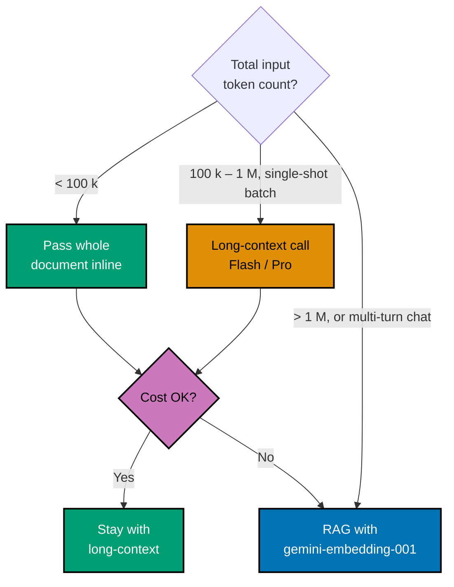

# Google Gemini API Primer

**Audience**: software engineers wiring Gemini into a backend, having read the
[AI Application Development primer](./README.md) first. All facts dated
2026-04-27. The Gemini API is the cheapest credible path to (a) very long
context, (b) embeddings, and (c) a low-cost chat tier — three reasons the
demos in this repo lean on it heavily.

## When to reach for Gemini

Reach for Gemini when the workload is:

- **Embeddings** — Gemini ships the only embedding model in the lineup of the
  three vendors covered here. Even when chat is served by Anthropic or
  Perplexity, embeddings will usually come from `gemini-embedding-001`.
- **Long context** — Flash and Flash-Lite both expose a 1 M-token input
  window. Useful for passing several whole 10-Ks in one call when RAG would
  add complexity for marginal gain.
- **Cost-sensitive chat** — Flash-Lite is the cheapest credible chat tier in
  the lineup; ideal for high-volume background tasks (batch summarisation,
  classification).

Skip Gemini when:

- You need top-tier reasoning quality on a hard problem — Anthropic Sonnet is
  usually a better default.
- You need live web search grounding — see the [Perplexity primer](./perplexity-api.md).

## Model lineup (2026-Q2)

| Model                 | Tier                | Model id                | Context window | Output limit |
| --------------------- | ------------------- | ----------------------- | -------------- | ------------ |
| Gemini 2.5 Flash-Lite | small / cheap       | `gemini-2.5-flash-lite` | 1 048 576 in   | 65 536 out   |
| Gemini 2.5 Flash      | mid / fast          | `gemini-2.5-flash`      | 1 048 576 in   | 65 536 out   |
| Gemini 2.5 Pro        | premium / reasoning | `gemini-2.5-pro`        | 1 048 576 in   | 65 536 out   |

Notes:

- Model ids are **hyphen-separated** (`gemini-2.5-flash-lite`), not dot-separated.
- Stable ids carry no date suffix; preview suffixes like
  `gemini-2.5-flash-lite-preview-09-2025` are deprecated. New code uses the
  bare stable id.
- Verify the current set at any time:
  [Gemini models reference](https://ai.google.dev/gemini-api/docs/models).

## SDKs and authentication

Google ships a **unified GenAI SDK** (`google-genai`) that targets both the
Gemini API and Vertex AI from one client surface. The older
`google-generativeai` package is **legacy** and no longer recommended.

| Language   | Package         | Latest version (2026-04-27) | Repo                                         |
| ---------- | --------------- | --------------------------: | -------------------------------------------- |
| Python     | `google-genai`  |                      1.73.1 | <https://github.com/googleapis/python-genai> |
| TypeScript | `@google/genai` |                (npm latest) | <https://github.com/googleapis/js-genai>     |

Both SDKs read `GOOGLE_API_KEY` (or `GEMINI_API_KEY` in newer docs) from the
environment. Vertex AI deployments switch to ADC; the unified client picks the
right path automatically once `vertexai=True` is set.

## Minimal request — Python

```python
from google import genai

client = genai.Client()  # reads GOOGLE_API_KEY

resp = client.models.generate_content(
    model="gemini-2.5-flash",
    contents="Summarise this 10-K in three bullets.",
)
print(resp.text)
```

## Minimal request — TypeScript

```ts
import { GoogleGenAI } from "@google/genai";

const ai = new GoogleGenAI({}); // reads GOOGLE_API_KEY

const resp = await ai.models.generateContent({
  model: "gemini-2.5-flash",
  contents: "Summarise this 10-K in three bullets.",
});
console.log(resp.text);
```

## Streaming

```python
stream = client.models.generate_content_stream(
    model="gemini-2.5-flash",
    contents="Stream three short bullets.",
)
for chunk in stream:
    print(chunk.text, end="", flush=True)
```

```ts
const stream = await ai.models.generateContentStream({
  model: "gemini-2.5-flash",
  contents: "Stream three short bullets.",
});
for await (const chunk of stream) {
  process.stdout.write(chunk.text ?? "");
}
```

The wire format is SSE; the SDK abstracts it. To forward chunks unchanged
through a `sse-starlette.EventSourceResponse`, yield `{"data": chunk.text}`
on each iteration. See the [streaming docs](https://ai.google.dev/gemini-api/docs/text-generation).

## PDF input

Gemini accepts PDFs through two paths:

- **Inline parts**: small PDFs (up to ~20 MB) base64-encoded into a content
  part with `mime_type: "application/pdf"`. Same call cycle as a text prompt.
- **Files API**: upload once (up to 2 GB), reference by `file_uri` in
  subsequent calls. Cheaper across many turns over the same document; files
  expire after 48 h.

```python
from google.genai import types
import pathlib

pdf = client.files.upload(path=pathlib.Path("aapl-fy2024-10k.pdf"))

resp = client.models.generate_content(
    model="gemini-2.5-flash",
    contents=[pdf, "Identify the three biggest risks."],
)
```

For a 50-page 10-K (~50 k tokens) the inline path is fine. For a 500-page
master document or a session that asks twenty questions of the same PDF, the
Files API is the right tool.

## Embeddings (the headline feature)

`gemini-embedding-001` is the current GA embedding model. Defaults and knobs:

| Parameter               | Default | Allowed                                                           | Notes                                                    |
| ----------------------- | ------: | ----------------------------------------------------------------- | -------------------------------------------------------- |
| `output_dimensionality` |    3072 | 768, 1536, 3072 (recommended)                                     | Matryoshka representation: same model, truncated vectors |
| `task_type`             |    none | `RETRIEVAL_QUERY`, `RETRIEVAL_DOCUMENT`, `SEMANTIC_SIMILARITY`, … | Tunes the projection for the use case                    |

**Why pick 768 instead of 3072 for a demo?** Vector storage is linear in
dimensions; pgvector ivfflat performance degrades faster on higher-dim
vectors. 768 dims is the sweet spot for most demos: 4× less storage and CPU
than 3072 with negligible recall loss on small corpora.

```python
embed = client.models.embed_content(
    model="gemini-embedding-001",
    contents=["The cat sat on the mat."],
    config=types.EmbedContentConfig(
        output_dimensionality=768,
        task_type="RETRIEVAL_DOCUMENT",
    ),
)
print(len(embed.embeddings[0].values))  # 768
```

For RAG, **always** call with `task_type="RETRIEVAL_DOCUMENT"` when embedding
chunks for storage and `task_type="RETRIEVAL_QUERY"` when embedding the user
question. The model produces different (but compatible) projections optimised
for each side of the search.

For the conceptual side of embeddings (cosine similarity, vector spaces, why
keyword search fails) see §5–§7 of the [main primer](./README.md).

## The 1 M-token context window

Long context is genuinely useful in three patterns:

1. **Whole-document Q&A without RAG.** A 200 k-token PDF fits five times over;
   skip chunking, embedding, retrieval — paste the document directly. Lower
   complexity for batch jobs that don't need conversation memory.
2. **Multi-document fusion.** Pass three 200 k-token reports in one prompt and
   ask the model to compare. Beats stitching three RAG calls together.
3. **Tool-use scratchpads.** Long tool-call traces fit naturally; no risk of
   the model losing context mid-loop.

Long context is **not** a free lunch:

- Every input token is billed every turn — a 500 k-token prompt across 5
  conversational turns costs as much as 2.5 M input tokens.
- Latency grows superlinearly past ~200 k tokens; first-token latency on a
  full 1 M prompt can exceed 10 s.
- The model still pays attention; quality on facts buried mid-document
  ("needle in haystack") is materially below quality on facts at the start or
  end. RAG narrows the model's attention to relevant slices and often wins on
  quality despite a smaller token count.

In short: long context is a tool, not a default. The default is RAG.

## Tools and built-in capabilities

Gemini bundles three execution surfaces under the `tools` request field:

| Tool                    | Type / config                                                             | What it does                                                                                                                 | Status  |
| ----------------------- | ------------------------------------------------------------------------- | ---------------------------------------------------------------------------------------------------------------------------- | ------- |
| Google Search grounding | `{"google_search": {}}`                                                   | Model decides when to query Google Search; results grounded with citations. Returns `groundingMetadata` (chunks + supports). | GA      |
| Code execution          | `{"code_execution": {}}`                                                  | Sandboxed Python; the model writes and runs code, returns stdout / files. **Free** beyond standard tokens.                   | GA      |
| URL context             | `{"url_context": {}}`                                                     | Browses up to 20 URLs per request (text, images, PDFs). Max 34 MB / URL. No paywalled / Workspace / video.                   | Preview |
| Function calling        | `{"functionDeclarations": [{"name": ..., "parameters": OpenAPI-schema}]}` | Custom developer tools; model returns structured `functionCall` objects.                                                     | GA      |
| Files API               | `client.files.upload(path=...)` then reference `file_uri` in `contents`   | Upload once (≤ 2 GB), reuse for 48 h. Free during TTL.                                                                       | GA      |
| Live API                | WSS connection (`wss://...`) — not a `tools[]` entry                      | Bidirectional audio + video real-time streaming with barge-in.                                                               | Preview |

```python
from google import genai
from google.genai import types

resp = client.models.generate_content(
    model="gemini-2.5-flash",
    contents="What changed in the latest Python release?",
    config=types.GenerateContentConfig(
        tools=[
            types.Tool(google_search=types.GoogleSearch()),
            types.Tool(code_execution=types.ToolCodeExecution()),
        ],
    ),
)

# Citations
for chunk in resp.candidates[0].grounding_metadata.grounding_chunks:
    print(chunk.web.uri)
```

Tools combine cleanly: a Gemini 3-class request can do Google Search and
function calling in one turn and circulate the resulting context through
subsequent turns.

For a private-corpus RAG demo (this repo's shape) prefer **Files API
plus your own pgvector retrieval** — Google Search grounding crosses the
trust boundary into public web data, which is rarely what a private-doc
demo wants.

## Additional features and APIs

| Feature                 | Mechanism                                                                                                                                                  | Notes                                                                                                                  |
| ----------------------- | ---------------------------------------------------------------------------------------------------------------------------------------------------------- | ---------------------------------------------------------------------------------------------------------------------- |
| Native image generation | `generateContent` with `responseModalities: ["IMAGE", "TEXT"]` on `gemini-2.5-flash-image`, `gemini-3.1-flash-image-preview`, `gemini-3-pro-image-preview` | "Nano Banana" family. Multi-turn edits; up to 14 reference images for style consistency. SynthID watermarked.          |
| Native TTS              | `generateContent` with `response_modalities: ["AUDIO"]` and `SpeechConfig` (single or multi-speaker)                                                       | Models: `gemini-3.1-flash-tts-preview`, `gemini-2.5-flash-preview-tts`, `gemini-2.5-pro-preview-tts`. PCM 24 kHz mono. |
| Gemini Batch API        | `POST /v1beta/models/{model}:batchGenerateContent` (inline ≤ 20 MB or JSONL ≤ 2 GB)                                                                        | **50 % discount**; 24 h SLA. Supports structured outputs, function calling, multimodal inputs.                         |
| Context caching         | Implicit (auto) or explicit (`POST /v1beta/cachedContents`) — pass `cached_content` in request                                                             | **75–90 %** cache-read discount. Min 32 768 tokens. Storage $4.50/M-tok-h (Pro) / $1.00/M-tok-h (Flash).               |
| Structured output       | `GenerationConfig` with `responseMimeType: "application/json"` + `responseSchema` (subset OpenAPI)                                                         | Property order matches schema. Pydantic / Zod interop. `responseMimeType: "text/x.enum"` for enum-only.                |
| Thinking mode           | Gemini 2.5: `thinkingConfig.thinkingBudget` (`0`, `128–32768`, or `-1` = dynamic). Gemini 3: `thinkingLevel` (`minimal`/`low`/`medium`/`high`)             | Thinking tokens billed at output rate. Cannot disable on Gemini 3.1 Pro.                                               |

### Tool / feature flow visualised

```mermaid
%% Color Palette: Blue #0173B2 | Orange #DE8F05 | Teal #029E73 | Purple #CC78BC | Gray #808080 | Brown #CA9161
flowchart LR
    PROMPT([User contents]):::user --> GEM{{Gemini model}}
    GEM -->|tools=[google_search]| GS[Google Search<br/>+ groundingMetadata]:::server
    GEM -->|tools=[code_execution]| CE[Sandboxed<br/>Python]:::server
    GEM -->|tools=[url_context]| URL[URL fetch ≤ 20 URLs]:::server
    GEM -->|tools=[functionDeclarations]| FN[Custom tool<br/>your app runs]:::client
    GEM -->|response_modalities=AUDIO| TTS[(PCM 24 kHz)]:::audio
    GEM -->|response_modalities=IMAGE| IMG[(Image bytes)]:::image
    GS --> OUT([Final<br/>response]):::out
    CE --> OUT
    URL --> OUT
    FN --> OUT
    TTS --> OUT
    IMG --> OUT

    classDef user fill:#DE8F05,stroke:#000000,color:#000000,stroke-width:2px
    classDef server fill:#029E73,stroke:#000000,color:#FFFFFF,stroke-width:2px
    classDef client fill:#CC78BC,stroke:#000000,color:#000000,stroke-width:2px
    classDef audio fill:#CA9161,stroke:#000000,color:#000000,stroke-width:2px
    classDef image fill:#808080,stroke:#000000,color:#FFFFFF,stroke-width:2px
    classDef out fill:#0173B2,stroke:#000000,color:#FFFFFF,stroke-width:2px
```

### Long-context vs RAG decision



## Indonesia data residency

For products subject to Indonesian regulation (UU PDP No. 27/2022; OJK
POJK 11/POJK.03/2022; BSSN/Komdigi PSE registration), Gemini's residency
story is more constrained than Anthropic's:

1. **Direct Gemini API has no region pinning.**
   `generativelanguage.googleapis.com` is a global endpoint. Indonesia is
   on the access-availability list, but the API does not expose a
   regional parameter.
   ([available-regions](https://ai.google.dev/gemini-api/docs/available-regions))
2. **Vertex AI `asia-southeast2` (Jakarta) is live, but Gemini foundation
   models are NOT confirmed deployed there as of 2026-04-27.** Vertex
   AI Agent Engine is GA in `asia-southeast2`; Gemini 2.5 Flash's
   official regional list includes `asia-southeast1` (Singapore) but
   **not** `asia-southeast2`. Gemini 3.x regional matrices are not
   publicly published per-region as of this writing.
   ([Gemini 2.5 Flash region list](https://docs.cloud.google.com/vertex-ai/generative-ai/docs/models/gemini/2-5-flash))
3. **Practical fallback for APAC: `asia-southeast1` (Singapore).** This
   is a cross-border transfer from Indonesia to Singapore — UU PDP
   Article 56(2)(iv) compliance is required: adequacy (no regulator
   yet), binding contractual safeguards via Google Cloud's standard
   data-processing terms, or explicit data-subject consent. Pre- and
   post-transfer reports to Komdigi may be required for sensitive data.

Google Cloud publishes an [OJK compliance page](https://cloud.google.com/security/compliance/ojk-indonesia)
that acknowledges Indonesian financial-sector context but does not
include a Gemini-specific UU PDP statement. Foreign electronic system
providers reaching Indonesian users must additionally register as **PSE
Private Scope** (PP 71/2019).

If strict on-shore inference is mandatory, Gemini is currently the
**weakest** of the four vendors for Indonesia residency. Pair an
Indonesia-resident chat model (Anthropic Claude on Bedrock Jakarta) with
Gemini's embedding endpoint accessed via Singapore — and account for the
cross-border transfer of embedding payloads in your DPIA.

## Reference cost (2026-Q2)

Indicative pricing per million tokens; verify at
[ai.google.dev/pricing](https://ai.google.dev/pricing) before publishing.

| Model                  | Input | Output |
| ---------------------- | ----: | -----: |
| Gemini 2.5 Flash-Lite  | $0.10 |  $0.40 |
| Gemini 2.5 Flash       | $0.30 |  $2.50 |
| Gemini 2.5 Pro         | $1.25 | $10.00 |
| `gemini-embedding-001` | $0.15 |      — |

Gemini Flash-Lite is roughly an order of magnitude cheaper than Anthropic
Haiku at comparable quality for short Q&A tasks; it is the go-to demo default
for cost-sensitive runs.

## CI mocking pattern

Same shape as Anthropic — intercept the `httpx` layer that the SDK uses,
return a fixture, and assert on the outbound request and side effects rather
than the response prose.

```python
import pytest

@pytest.fixture
def mock_gemini_chat(httpx_mock):
    httpx_mock.add_response(
        url__regex=r".*generativelanguage\.googleapis\.com.*generateContent.*",
        method="POST",
        json={
            "candidates": [{"content": {"parts": [{"text": "FIXTURE"}]}}],
            "usageMetadata": {"promptTokenCount": 10, "candidatesTokenCount": 1},
        },
    )

@pytest.fixture
def mock_gemini_embed(httpx_mock):
    httpx_mock.add_response(
        url__regex=r".*generativelanguage\.googleapis\.com.*embedContent.*",
        method="POST",
        json={"embedding": {"values": [0.0] * 768}},
    )
```

Real-LLM smoke tests live behind a workflow-dispatch flag, not on every CI
run. See the main primer §13 for the full determinism strategy.

## Related

- [AI Application Development](./README.md) — generic primer covering tokens,
  embeddings, RAG, streaming, guardrails, evaluation, cost
- [Anthropic API Primer](./anthropic-api.md) — paired vendor doc; chat lives
  there for premium-quality reasoning
- [OpenAI API Primer](./openai-api.md) — paired vendor doc; reasoning models
  and built-in tools
- [Perplexity API Primer](./perplexity-api.md) — when web-grounded answers are
  the requirement
- [Gemini API docs](https://ai.google.dev/gemini-api/docs) — authoritative
  reference, supersedes anything here on conflict
