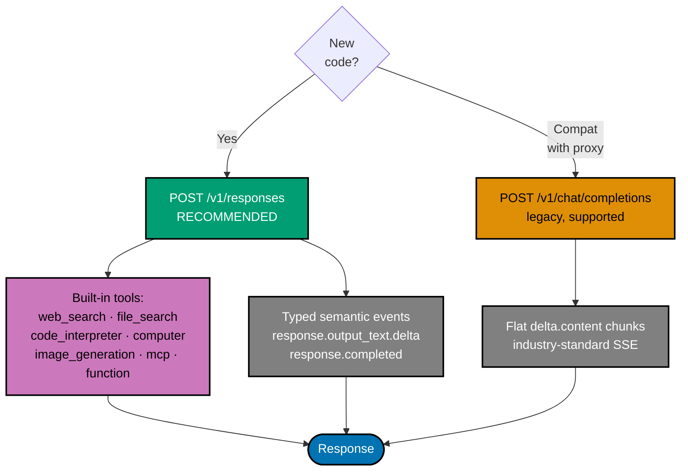

# OpenAI API Primer

**Audience**: software engineers wiring OpenAI into a backend, having read
the [AI Application Development primer](./README.md) first. All facts dated
2026-04-27. OpenAI's distinguishing feature in 2026 is breadth — the
Responses API ships built-in web search, file search, code interpreter,
computer use, and remote MCP server support without external
orchestration. Pick OpenAI when tool ecosystem and reasoning models
matter; pick the others when (Anthropic) coding-product safety, (Gemini)
cost or embeddings, or (Perplexity) live web grounding matter more.

## When to reach for OpenAI

Reach for OpenAI when the workload is:

- **Agentic tool orchestration** — the Responses API exposes web search,
  file search, code interpreter, and computer use as first-class tools.
  Cuts external orchestration to a single call.
- **Pure reasoning** — `o3` and the `gpt-5.5` reasoning effort knob give
  configurable chain-of-thought budgets. The right tool for spec
  validation, complex code review, math-heavy analysis.
- **Function calling and structured outputs** — the deepest, oldest
  function-calling stack of any vendor. Library tooling tends to be
  OpenAI-shaped first, every-other-vendor second.
- **PDF input with built-in RAG** — the Responses API File Search tool
  supersedes most uses of the older Assistants API and gives an
  out-of-the-box document-RAG primitive without a separate vector store.

Skip OpenAI when:

- You need the cheapest credible chat tier — Gemini Flash-Lite is roughly
  10× cheaper for short Q&A. See the [Gemini primer](./google-gemini-api.md).
- You need live web grounding with citations as first-class output —
  Perplexity Sonar bundles retrieval and generation. See the
  [Perplexity primer](./perplexity-api.md).
- Your product is a coding assistant — Anthropic Claude has the
  larger market share in coding integrations (Cursor, Windsurf). See
  the [Anthropic primer](./anthropic-api.md).

## Model lineup (2026-Q2)

| Model                    | Tier      | Context window | Notes                                                                |
| ------------------------ | --------- | -------------- | -------------------------------------------------------------------- |
| `gpt-5.5`                | flagship  | 1 M tokens     | General-purpose chat, coding, reasoning. Recommended starting point. |
| `gpt-5.4`                | mid       | 1 M tokens     | Cheaper than 5.5 for everyday coding and professional tasks.         |
| `gpt-5.4-mini`           | small     | 400 K tokens   | Cheapest flagship variant. Coding, computer use, subagents.          |
| `o3`                     | reasoning | (per docs)     | Configurable `reasoning.effort` (`low` / `medium` / `high`).         |
| `text-embedding-3-small` | embedding | n/a            | 1 536 dim default; reducible via `dimensions` parameter.             |
| `text-embedding-3-large` | embedding | n/a            | 3 072 dim default; reducible via `dimensions` parameter.             |

Notes:

- `gpt-4o`, `gpt-4.1`, `gpt-4.1-mini`, and the original `o4-mini` were
  **retired on 2026-02-13**. New code targets the GPT-5.x family or `o3`.
- Verify the current set at any time:
  [OpenAI models reference](https://developers.openai.com/api/docs/models).

## Responses API vs Chat Completions

OpenAI now exposes two HTTP surfaces:

- `POST /v1/responses` — the **recommended** surface for new projects,
  GA. Streams typed semantic events (`response.output_text.delta`,
  `response.completed`, etc.). Built-in tools live here (web search,
  file search, code interpreter, computer use, MCP).
- `POST /v1/chat/completions` — the **legacy** surface, still supported
  indefinitely "as an industry standard." Same model lineup is reachable.
  Streams `delta.content` chunks. Many third-party integrations target
  this surface.

Pick Responses API for new code. Use Chat Completions only when an
existing OpenAI-compatible proxy (LiteLLM, OpenRouter, Perplexity at
`api.perplexity.ai`) requires its shape.

## SDKs and authentication

| Language   | Package  | Latest version (2026-04-27) | Repo                                      |
| ---------- | -------- | --------------------------: | ----------------------------------------- |
| Python     | `openai` |                      2.32.0 | <https://github.com/openai/openai-python> |
| TypeScript | `openai` |                      6.34.0 | <https://github.com/openai/openai-node>   |

Both SDKs read `OPENAI_API_KEY` from the environment by default.
Authorization header is `Authorization: Bearer ${OPENAI_API_KEY}`.

## Minimal request — Python (Responses API)

```python
from openai import OpenAI

client = OpenAI()  # reads OPENAI_API_KEY

resp = client.responses.create(
    model="gpt-5.5",
    input="Summarise this 10-K in three bullets.",
)
print(resp.output_text)
```

## Minimal request — Python (Chat Completions, legacy)

```python
from openai import OpenAI

client = OpenAI()

resp = client.chat.completions.create(
    model="gpt-5.5",
    messages=[{"role": "user", "content": "Summarise this 10-K in three bullets."}],
)
print(resp.choices[0].message.content)
```

## Minimal request — TypeScript (Responses API)

```ts
import OpenAI from "openai";

const client = new OpenAI(); // reads OPENAI_API_KEY

const resp = await client.responses.create({
  model: "gpt-5.5",
  input: "Summarise this 10-K in three bullets.",
});
console.log(resp.output_text);
```

## Streaming

Both APIs support SSE. Activate with `stream: true` (TS) /
`stream=True` (Python) and iterate.

```python
stream = client.responses.create(
    model="gpt-5.5",
    input="Stream three short bullets.",
    stream=True,
)
for event in stream:
    if event.type == "response.output_text.delta":
        print(event.delta, end="", flush=True)
```

```ts
const stream = await client.responses.create({
  model: "gpt-5.5",
  input: "Stream three short bullets.",
  stream: true,
});
for await (const event of stream) {
  if (event.type === "response.output_text.delta") {
    process.stdout.write(event.delta);
  }
}
```

The Responses API streams **typed** events with a `type` discriminator;
the Chat Completions API streams flat `delta.content` chunks. The
Responses-API event shape is more structured and easier to filter
(reasoning summaries, tool calls, content deltas) but requires a richer
client.

## PDF input

Both APIs accept PDFs directly:

- **Inline**: base64-encoded into a `file` content part with
  `mime_type: "application/pdf"`.
- **Files API**: upload once via `POST /v1/files`, reference by `file_id`
  on subsequent calls.

Limits: **100 pages per request, 32 MB total content per request** across
all file inputs. Models must have vision capability (the entire GPT-5.x
family does).

```python
from openai import OpenAI

client = OpenAI()

uploaded = client.files.create(
    file=open("aapl-fy2024-10k.pdf", "rb"),
    purpose="user_data",
)

resp = client.responses.create(
    model="gpt-5.5",
    input=[{
        "role": "user",
        "content": [
            {"type": "input_file", "file_id": uploaded.id},
            {"type": "input_text", "text": "Identify the three biggest risks."},
        ],
    }],
)
```

For RAG over a corpus that exceeds 100 pages or 32 MB, switch from raw
PDF input to the **File Search tool** inside the Responses API — it
chunks, embeds, and retrieves under the hood without you wiring pgvector.
For full pipeline control (which the demos in this repo prefer), keep
embedding and retrieval in your own service layer per the
[main primer §6–§7](./README.md).

## Embeddings

Two GA models. Both support the **`dimensions`** parameter (Matryoshka
representation) to truncate the output vector at request time without
retraining.

| Model                    | Default dim | Configurable to | $/1M (standard) |
| ------------------------ | ----------: | --------------- | --------------: |
| `text-embedding-3-small` |       1 536 | 256–1 536       |           $0.02 |
| `text-embedding-3-large` |       3 072 | 256–3 072       |           $0.13 |

```python
embed = client.embeddings.create(
    model="text-embedding-3-small",
    input=["The cat sat on the mat."],
    dimensions=768,
)
print(len(embed.data[0].embedding))  # 768
```

A reasonable default for new RAG demos is `text-embedding-3-small` at
768 dimensions — same vector size as Gemini Flash embeddings, comparable
recall on small-to-medium corpora, lowest cost in the OpenAI lineup.

Demos in this repo standardise on **Gemini** embeddings
(`gemini-embedding-001` at 768 dims) — Anthropic ships no embedding
endpoint, so a single embedding vendor for the whole demo set keeps the
vector space consistent. OpenAI embeddings are the next-best alternative
when a project chooses OpenAI as its sole vendor.

## Reasoning models and `reasoning.effort`

`o3` and `gpt-5.5` both expose a reasoning-effort knob that trades
thinking-token spend against quality:

| Effort    | When to use                                               |
| --------- | --------------------------------------------------------- |
| `none`    | Skip reasoning entirely; fastest, cheapest                |
| `minimal` | Light reasoning for simple decisions                      |
| `low`     | Default for routine code review / classification          |
| `medium`  | **Default for `gpt-5.5`** — balanced quality and cost     |
| `high`    | Hard reasoning problems; willing to pay for thinking time |
| `xhigh`   | (`gpt-5.5` only) maximum thinking budget                  |

```python
resp = client.responses.create(
    model="gpt-5.5",
    input="Is this code race-free? <code excerpt>",
    reasoning={"effort": "high"},
)
```

`o3` is the right pick when reasoning **is** the product (spec
checking, theorem-style analysis); `gpt-5.5` is the right pick for
mixed reasoning + tool-use workloads.

## Tools (Responses API)

OpenAI's distinguishing surface in 2026 is the breadth of built-in tools
inside the Responses API. Declare them inside the `tools` array on a
single request:

| Tool             | Type               | What it does                                                                  | Pricing notes                                                  |
| ---------------- | ------------------ | ----------------------------------------------------------------------------- | -------------------------------------------------------------- |
| Web search       | `web_search`       | Server-side web search; results grounded with citations.                      | $10 / 1 000 calls (reasoning models) or $25 / 1 000 (standard) |
| File search      | `file_search`      | Server-side RAG over uploaded files in a vector store.                        | $0.10 / GB-day storage + $2.50 / 1 000 tool calls              |
| Code interpreter | `code_interpreter` | Sandboxed Python; reads / writes container files; persists within a session.  | $0.03 / container session                                      |
| Computer use     | `computer`         | Browser / OS automation; returns `screenshot`, `click`, `type`, etc. actions. | Standard token pricing + execution overhead                    |
| Image generation | `image_generation` | Built-in `gpt-image-1`; streams progressive previews.                         | Per image, by resolution / quality tier                        |
| MCP servers      | `mcp`              | Connects to a remote Model Context Protocol server; loads its tools.          | No extra fee — billed only on output tokens                    |
| Custom functions | `function`         | Developer-defined JSON-schema tools; standard parallel + strict-mode support. | Standard token pricing                                         |

```python
resp = client.responses.create(
    model="gpt-5.5",
    input="Find papers from 2026 on AGI safety, summarise the latest, and chart citation counts.",
    tools=[
        {"type": "web_search"},
        {"type": "code_interpreter"},
    ],
)
print(resp.output_text)
```

### MCP remote servers

Loading an external MCP server is one entry in the `tools` array:

```python
resp = client.responses.create(
    model="gpt-5.5",
    input="Plan a release.",
    tools=[{
        "type": "mcp",
        "server_url": "https://mcp.example.com/sse",
        "server_label": "release-tools",
        "allowed_tools": ["create_release", "list_pending"],
    }],
)
```

Use `allowed_tools` to limit the surface area the model sees; large
catalogs balloon prompt tokens.

### Custom function calling

```python
tools = [{
    "type": "function",
    "name": "get_weather",
    "description": "Get the current weather for a city.",
    "parameters": {
        "type": "object",
        "properties": {"city": {"type": "string"}},
        "required": ["city"],
    },
}]
```

In a private-corpus RAG demo (this repo's shape) prefer **your own
pgvector pipeline** over `file_search` — file_search trades transparency
and cost-control for convenience, and the demos in this repo deliberately
expose the retrieval layer as part of the teaching material.

## Additional features and APIs

Beyond the Responses-API tool array, OpenAI ships several adjacent
surfaces and request flags worth knowing:

| Feature                   | Mechanism                                                                                                                     | Notes                                                                                                                         |
| ------------------------- | ----------------------------------------------------------------------------------------------------------------------------- | ----------------------------------------------------------------------------------------------------------------------------- |
| Realtime API              | `wss://api.openai.com/v1/realtime?model=gpt-realtime` (WebSocket) or WebRTC `POST /v1/realtime/calls` (browser) or SIP (VoIP) | Speech-to-speech voice agents. Typical 300–500 ms response latency. Max 60-minute session.                                    |
| Structured Outputs        | `"response_format": {"type": "json_schema", "json_schema": {"name": ..., "strict": true, "schema": {...}}}`                   | Schema-level enforcement. Available per-tool via `"strict": true` in function definitions.                                    |
| Batches API               | `POST /v1/batches` with `input_file_id` (JSONL via Files API), `endpoint`, `completion_window: "24h"`                         | **50 % discount** on input + output for all models. Up to 50 000 requests / 200 MB input file. Stacks with prompt caching.    |
| Parallel function calling | `"parallel_tool_calls": true` (default) / `false`                                                                             | Multiple tool calls per turn. Supported on most GPT-4o / GPT-5 models; not on `o3`. Disable on `gpt-4.1-nano`.                |
| Hosted Connectors         | Tools entry `{"type": "connector", "connector_id": "...", "access_token": "..."}`                                             | OpenAI-maintained MCP wrappers for GitHub, SharePoint, Drive, Dropbox, Box, Outlook, Gmail, Calendar, Linear, HubSpot, Teams. |
| Reasoning summaries       | `"reasoning": {"summary": "auto"/"concise"/"detailed"}`                                                                       | Surfaces summarised CoT in `reasoning` output items. Raw tokens not exposed. Best in Responses API.                           |
| Persistent CI containers  | `POST /v1/containers` with `memory_limit` (`1g`/`4g`/`16g`/`64g`); reference by `container` in tool config                    | Auto-created if not specified. Expires after 20 min idle. Treat as ephemeral; persist outputs to your store.                  |
| Vision input              | `{"type": "input_image", "image_url": "..." \| "data:image/...;base64,...", "detail": "auto"/"original"}`                     | All GPT-4o+ and GPT-5 models. Multiple images per request.                                                                    |
| Prompt caching            | Automatic on repeated prefixes (no opt-in flag)                                                                               | ~50 % discount on cached input. Stacks with Batches API.                                                                      |
| Legacy Assistants API     | `POST /v1/assistants/...`                                                                                                     | Superseded by Responses API + File Search + MCP. Maintained but not the recommended surface for new code.                     |
| Standalone TTS            | `POST /v1/audio/speech`                                                                                                       | Separate non-realtime TTS endpoint; outside the Responses-API tool surface.                                                   |

### Responses API vs Chat Completions — surface map



## Indonesia data residency

For products subject to Indonesian regulation (UU PDP No. 27/2022; OJK
POJK 11/POJK.03/2022; BSSN/Komdigi PSE registration), OpenAI is the
**most constrained** of the four vendors:

1. **Direct OpenAI API has no Indonesian region.** `api.openai.com` is
   a US endpoint. OpenAI's Asia data-residency programme (May 2025)
   covers Japan, India, Singapore, South Korea — **not** Indonesia.
   ([OpenAI data residency announcement](https://openai.com/index/introducing-data-residency-in-asia/))
2. **Azure OpenAI Service is not yet deployed in Azure Indonesia
   Central.** Indonesia Central is a live Azure infrastructure region
   (launched 2025) but the Azure AI Foundry / Azure OpenAI region list
   does not include it as of 2026-04-27. Nearest confirmed Azure OpenAI
   region: `Southeast Asia` (Singapore).
   ([Azure Foundry region support](https://learn.microsoft.com/en-us/azure/foundry/reference/region-support))
3. **All paths cross the border.** Indonesia → Singapore (Azure
   Southeast Asia) or Indonesia → US (direct API). UU PDP Article
   56(2)(iv) compliance is required: adequacy (no regulator yet),
   binding contractual safeguards (Microsoft DPA / OpenAI DPA), or
   explicit data-subject consent. Pre- and post-transfer reports to
   Komdigi may apply.

Practical guidance:

- For Indonesia-personal-data workloads, **prefer Anthropic on Bedrock
  Jakarta** unless an OpenAI-only feature (Realtime voice, Computer Use
  GA, hosted Connectors, image generation in Responses API) is the
  product.
- If OpenAI is non-negotiable, use **Azure OpenAI on Southeast Asia
  (Singapore)** for the shortest cross-border hop and the strongest
  enterprise contractual posture (Microsoft DPA + region pinning at
  rest in Singapore).
- Watch the Azure Indonesia Central rollout — Microsoft is extending
  Azure OpenAI region-by-region; check the Foundry region list before
  every deployment.

Foreign electronic system providers reaching Indonesian users must
additionally register as **PSE Private Scope** (PP 71/2019).

## Reference cost (2026-Q2)

Indicative pricing per million tokens; verify at
[developers.openai.com/api/docs/pricing](https://developers.openai.com/api/docs/pricing)
before publishing.

| Model                    | Input | Output |
| ------------------------ | ----: | -----: |
| `gpt-5.5`                | $5.00 | $30.00 |
| `gpt-5.4`                | $2.50 | $15.00 |
| `gpt-5.4-mini`           | $0.75 |  $4.50 |
| `o3`                     | $2.00 |  $8.00 |
| `text-embedding-3-small` | $0.02 |      — |
| `text-embedding-3-large` | $0.13 |      — |

Batch pricing (50 % discount) and prompt caching (~50 % discount on
repeated prefixes) compound. For high-volume offline jobs, the Batch API
is materially cheaper than the synchronous path.

## CI mocking pattern

Same shape as the other vendor primers — intercept the `httpx` layer the
SDK uses, return a fixture, assert on the outbound request and side
effects rather than response prose.

```python
import pytest

@pytest.fixture
def mock_openai_responses(httpx_mock):
    httpx_mock.add_response(
        url="https://api.openai.com/v1/responses",
        method="POST",
        json={
            "id": "resp_test",
            "object": "response",
            "model": "gpt-5.5",
            "output_text": "FIXTURE",
            "usage": {"input_tokens": 10, "output_tokens": 1},
        },
    )

@pytest.fixture
def mock_openai_chat(httpx_mock):
    httpx_mock.add_response(
        url="https://api.openai.com/v1/chat/completions",
        method="POST",
        json={
            "id": "chat_test",
            "model": "gpt-5.5",
            "choices": [{
                "index": 0,
                "message": {"role": "assistant", "content": "FIXTURE"},
                "finish_reason": "stop",
            }],
            "usage": {"prompt_tokens": 10, "completion_tokens": 1, "total_tokens": 11},
        },
    )
```

A handler test typically asserts (a) the outbound JSON included
`reasoning.effort` if reasoning was requested, (b) the response was
persisted to the DB, (c) the SSE stream terminated cleanly. Never on
`FIXTURE` prose.

## Related

- [AI Application Development](./README.md) — generic primer covering
  tokens, embeddings, RAG, streaming, guardrails, evaluation, cost
- [Anthropic API Primer](./anthropic-api.md) — paired vendor doc;
  premium-quality reasoning over private context
- [Google Gemini API Primer](./google-gemini-api.md) — paired vendor
  doc; long context, embeddings, cheap chat
- [Perplexity Sonar API Primer](./perplexity-api.md) — paired vendor
  doc; web-grounded answers with citations
- [OpenAI API docs](https://developers.openai.com/api/docs) —
  authoritative reference, supersedes anything here on conflict
