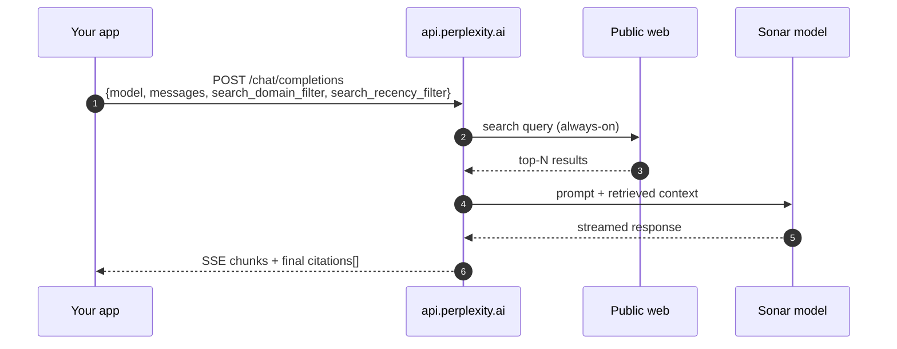

# Perplexity Sonar API Primer

**Audience**: software engineers wiring Perplexity Sonar into a backend, having
read the [AI Application Development primer](./README.md) first. All facts
dated 2026-04-27. Sonar fills a niche neither Anthropic nor Gemini fills cheaply
on their own: live, dated, citation-backed answers from the public web in a
single API call.

## When to reach for Perplexity

Reach for Sonar when the question is:

- About **current or recent public-web information** — pricing pages, release
  notes, news, today's exchange rates, vendor announcements.
- One where the **citations themselves are the deliverable** — research notes,
  fact-checking pipelines, evidence-tagged summaries.
- Cheap and disposable enough that wrapping a separate retrieval layer around
  Anthropic or Gemini would be over-engineering.

Skip Sonar when:

- The corpus is **private** (internal docs, contracts, codebases). Sonar
  searches the public web; it cannot read your private store. Use
  Anthropic / Gemini with your own RAG pipeline instead.
- You need **fine-grained control over retrieval** (filtering, re-ranking,
  hybrid BM25+vectors). Sonar bundles retrieval and generation into one opaque
  call; you cannot inspect or rescore the documents it pulled.
- You want a **standalone retrieval layer** separate from generation. Sonar
  always generates; you pay for both legs every call.

## Model lineup (2026-Q2)

All Sonar models are web-grounded. There is no offline-only Sonar variant.

| Model id              | Tier          | Use case                                                       |
| --------------------- | ------------- | -------------------------------------------------------------- |
| `sonar`               | small / cheap | Fast factual lookups; citation-backed answers under one second |
| `sonar-pro`           | mid           | Multi-turn follow-ups; ~2× more citations than `sonar`         |
| `sonar-reasoning-pro` | reasoning     | Chain-of-thought analysis with live web search                 |
| `sonar-deep-research` | exhaustive    | Long-running research producing a comprehensive report         |

`sonar-reasoning` (without the `-pro` suffix) appears in some third-party
docs but is not listed on the official models page; treat it as unverified
and prefer `sonar-reasoning-pro`.

Verify the current set at any time:
[Sonar models page](https://docs.perplexity.ai/docs/sonar/models).

## API shape — OpenAI-compatible

Perplexity exposes its API at `https://api.perplexity.ai` with an
OpenAI-compatible `/chat/completions` endpoint. The OpenAI SDK works directly
when pointed at the Perplexity base URL — no separate Perplexity SDK is
required, though one exists for projects that want native semantics.

Authentication: `Authorization: Bearer ${PERPLEXITY_API_KEY}`.

## Minimal request — Python

```python
from openai import OpenAI

client = OpenAI(
    api_key=os.environ["PERPLEXITY_API_KEY"],
    base_url="https://api.perplexity.ai",
)

resp = client.chat.completions.create(
    model="sonar",
    messages=[{"role": "user", "content": "What did Anthropic ship this week?"}],
)
print(resp.choices[0].message.content)
print(resp.citations)  # array of source URLs
```

## Minimal request — TypeScript

```ts
import OpenAI from "openai";

const client = new OpenAI({
  apiKey: process.env.PERPLEXITY_API_KEY,
  baseURL: "https://api.perplexity.ai",
});

const resp = await client.chat.completions.create({
  model: "sonar",
  messages: [{ role: "user", content: "What did Anthropic ship this week?" }],
});
console.log(resp.choices[0].message.content);
console.log((resp as { citations?: string[] }).citations);
```

## Streaming

Identical pattern to OpenAI: pass `stream: true` (TS) / `stream=True` (Python)
and iterate. The wire format is SSE.

```python
stream = client.chat.completions.create(
    model="sonar",
    messages=[{"role": "user", "content": "Stream three short bullets."}],
    stream=True,
)
for chunk in stream:
    delta = chunk.choices[0].delta.content
    if delta:
        print(delta, end="", flush=True)
```

Caveat: at least one community proxy (LiteLLM via
[issue #13777](https://github.com/BerriAI/litellm/issues/13777)) drops the
`citations` field when streaming. The native OpenAI SDK against
`api.perplexity.ai` directly preserves them — but the field arrives on the
final chunk, not interleaved per token. Buffer accordingly.

## Citations and grounding

Every Sonar response includes a top-level `citations` field — an array of
source URLs the model consulted. `sonar-pro` returns roughly twice as many
citations per query as `sonar`.

```json
{
  "id": "...",
  "model": "sonar",
  "choices": [{ "message": { "role": "assistant", "content": "Per Anthropic..." } }],
  "citations": ["https://www.anthropic.com/news/...", "https://docs.anthropic.com/...", "..."],
  "usage": { "prompt_tokens": 12, "completion_tokens": 87 }
}
```

Surface citations in your UI; that is the whole point of using Sonar over a
plain LLM call. A common pattern: render the citation array as a numbered
footnote list and let the model interleave `[1]` `[2]` markers in the prose
via system prompt instruction.

## Search controls

Two parameters refine what Sonar searches:

| Parameter               | Type            | Effect                                                                                |
| ----------------------- | --------------- | ------------------------------------------------------------------------------------- |
| `search_domain_filter`  | array of string | Allowlist or denylist up to 20 domains. Prefix `-` for denylist (e.g., `-reddit.com`) |
| `search_recency_filter` | string          | Restrict to `hour`, `day`, `week`, `month`, or `year`                                 |

```python
resp = client.chat.completions.create(
    model="sonar",
    messages=[{"role": "user", "content": "Latest US PCE inflation print?"}],
    extra_body={
        "search_domain_filter": ["bls.gov", "bea.gov", "-reddit.com"],
        "search_recency_filter": "month",
    },
)
```

Use `search_domain_filter` to lock the demo to authoritative domains for any
production-shaped use case. Without it, Sonar may cite low-quality
aggregators.

## Tool surface and what is missing

Sonar's tool surface is deliberately narrow. The product is "search +
generation in one hop"; everything that does not fit that frame is out of
scope.

| Capability                 | Available?                                 | Notes                                                                                    |
| -------------------------- | ------------------------------------------ | ---------------------------------------------------------------------------------------- |
| Always-on web search       | yes (built into every call; not togglable) | The whole reason to use Sonar. No `tools[]` entry needed.                                |
| `search_domain_filter`     | yes                                        | Allow- and deny-list up to 20 domains.                                                   |
| `search_recency_filter`    | yes                                        | `hour` / `day` / `week` / `month` / `year`.                                              |
| Image input (vision)       | yes                                        | OpenAI-shaped `image_url` content blocks inside messages.                                |
| `reasoning_effort` knob    | yes (on `sonar-reasoning-pro` and similar) | `minimal` / `low` / `medium` / `high`.                                                   |
| Custom function calling    | **no**                                     | Sonar does not expose `tools[]` for developer-declared tools.                            |
| File search / vector store | **no**                                     | Bring your own RAG (Anthropic + Gemini embeddings) if you need private-corpus retrieval. |
| Code execution             | **no**                                     | Use OpenAI's `code_interpreter` or Anthropic's `code_execution` for that.                |
| Computer use               | **no**                                     | Use OpenAI / Anthropic.                                                                  |

Boundary framing: if a workload needs **both** live web grounding **and**
something else from the table above (custom tools, computer use, code
execution), Sonar alone is not enough. Either pair Sonar with a second
vendor for the missing capability, or move the whole workload to OpenAI
(`web_search` tool inside the Responses API gets you live grounding plus
the rest of OpenAI's tool ecosystem in one call).

## Additional features

Sonar's tool surface is narrow but its **request-shape knobs** are rich.
Beyond `search_domain_filter` and `search_recency_filter` already
covered:

| Feature                    | Request shape                                                                                                    | Notes                                                                                                                 |
| -------------------------- | ---------------------------------------------------------------------------------------------------------------- | --------------------------------------------------------------------------------------------------------------------- |
| Async deep-research        | `POST /v1/async/sonar` with `model: "sonar-deep-research"` + standard chat body; poll `GET /v1/async/sonar/{id}` | Eliminates HTTP-timeout risk on long-running deep-research queries. Pairs with `reasoning_effort`.                    |
| Structured outputs         | `"response_format": {"type": "json_schema", "json_schema": {"name": "...", "schema": {...}}}`                    | First request with a new schema may take 10–30 s to prepare; subsequent calls are fast.                               |
| `return_related_questions` | top-level boolean                                                                                                | Adds an array of suggested follow-up queries to the response.                                                         |
| `return_images`            | top-level boolean                                                                                                | Includes image search-result URLs alongside text. **Tier-2+ only.**                                                   |
| `web_search_options`       | `{"search_mode": "academic"}` (Agent API surface)                                                                | Prioritises scholarly / journal sources. Confirm exposure on the standard `/chat/completions` surface for your model. |
| Date filters (absolute)    | `search_after_date_filter`, `search_before_date_filter` — `MM/DD/YYYY`                                           | Combine for a publication-date range; complements relative `search_recency_filter`.                                   |
| Last-modified filters      | `last_updated_after_filter`, `last_updated_before_filter` — `MM/DD/YYYY`                                         | Targets last-modification timestamp rather than publication date.                                                     |
| `reasoning_effort`         | `"reasoning_effort": "minimal"/"low"/"medium"/"high"` — applies to `sonar-deep-research`                         | Trades latency / cost for analytical depth. Available in sync and async modes.                                        |
| Image input (vision)       | OpenAI-shape `{"type": "image_url", "image_url": {"url": "..."}}` content blocks                                 | Text + image multimodal queries on supported Sonar models.                                                            |

### Single-hop search + generation flow



The whole point: **search and generation in one HTTP hop.** Sonar bills
both legs (per-token + per-request search fee). For workloads where the
search and generation steps benefit from independent control — your own
re-ranker between them, or different vendors per leg — Sonar is the
wrong shape; pair Anthropic / Gemini / OpenAI with your own retrieval
layer instead.

## Indonesia data residency

For products subject to Indonesian regulation (UU PDP No. 27/2022; OJK
POJK 11/POJK.03/2022; BSSN/Komdigi PSE registration), Perplexity is the
**weakest of the four vendors** for residency:

1. **Sonar API runs in US datacenters only.** Perplexity has confirmed
   on its public communications that "Sonar Reasoning is uncensored and
   hosted in US datacenters" — and the rest of the Sonar family is
   hosted on US AWS. There are no APAC regional endpoints.
   ([Perplexity statement](https://x.com/perplexity_ai/status/1884409454675759211))
2. **No hyperscaler partnership for APAC.** A Perplexity–NVIDIA EU
   sovereign AI partnership (June 2025) gave EU customers an in-EU
   path; no analogous Indonesia or Southeast Asia arrangement has been
   announced.
3. **Cross-border transfer is unavoidable.** Every Sonar call is a
   transfer from Indonesia to the US. UU PDP Article 56(2)(iv) requires
   adequacy (no regulator yet), binding contractual safeguards, or
   **explicit data-subject consent** — the last is usually the only
   workable mechanism for a public-facing AI feature on Sonar.

Practical guidance:

- If Indonesia residency is a hard requirement, **do not use Perplexity
  Sonar**. Use the Anthropic / Bedrock Jakarta path with your own RAG
  pipeline, or Azure OpenAI in Singapore — both have stronger residency
  posture.
- If Sonar's web-grounded answer shape is the product, isolate the
  feature so it never touches Indonesian personal data: use it for
  market-research tasks, public-information lookups, or in
  contexts where the user's identity and PII are not part of the
  prompt.

Foreign electronic system providers reaching Indonesian users must
additionally register as **PSE Private Scope** (PP 71/2019) regardless
of where the LLM runs.

## Pricing (2026-Q2)

Sonar bills both **per-token** like a normal chat API **and** a
**per-request search fee** that varies with the configured search context
size. This makes a single Sonar call materially more expensive than a
comparable Anthropic Haiku call — but Sonar bundles retrieval into the same
hop, so the fair comparison is Sonar vs. (Haiku + your own search
infrastructure).

| Model                 | Input $/M | Output $/M | Per-1k-request search fee |
| --------------------- | --------: | ---------: | ------------------------: |
| `sonar`               |     $1.00 |      $1.00 |                $5–6 (low) |
| `sonar-pro`           |     $3.00 |     $15.00 |            $8–10 (medium) |
| `sonar-reasoning-pro` |  (varies) |   (varies) |             $12–14 (high) |
| `sonar-deep-research` |  (varies) |   (varies) |                  (varies) |

Per-request fees are tiered by the `search_context_size` parameter
(`low` / `medium` / `high`). Verify current values at
[docs.perplexity.ai/docs/getting-started/pricing](https://docs.perplexity.ai/docs/getting-started/pricing)
before publishing user-facing budget tools.

## Rate limits

Tier-based, calibrated against cumulative lifetime spend on the account.

| Tier   | Spend threshold | `sonar` / `sonar-pro` / `sonar-reasoning-pro` RPM | `sonar-deep-research` RPM |
| ------ | --------------- | ------------------------------------------------: | ------------------------: |
| Tier 0 | $0 (new)        |                                                50 |                         5 |
| Tier 5 | $5 000+         |                                             4 000 |                       100 |

For demos and low-volume use, Tier 0 is comfortable. For batch / production,
plan around the cumulative-spend ladder.

## Sonar vs Anthropic vs Gemini — the boundary

A short framing for picking the right tool:

- **Sonar**: live, dated, public-web grounded. Citations are first-class
  output. Search and generation in one hop. Useful when "what is the current
  X?" is the literal question.
- **Anthropic Claude**: best-quality reasoning over context you provide. No
  built-in search; pair with your own RAG pipeline. Useful when the input is
  a private corpus and reasoning depth matters.
- **Google Gemini**: cheapest credible chat tier, only embedding model among
  the three, 1 M-token context. Useful for embeddings (always), long-context
  (sometimes), cheap chat (often).

In this repo, the canonical pattern is:

- The `web-research-maker` agent handles in-session research that may use
  WebFetch or WebSearch — humans rarely call Sonar directly during
  development.
- Sonar is wired into a demo backend only when the demo scenario itself is
  about "web-grounded answers" — surfacing live release notes, validating a
  governance claim against current vendor docs, or letting a chatbot answer
  factual questions about today's world.

## CI mocking pattern

Same shape as the other vendor primers — intercept `httpx` and assert on the
outbound request, the surfaced `citations` array, and downstream side
effects. Never assert on the prose.

```python
import pytest

@pytest.fixture
def mock_perplexity(httpx_mock):
    httpx_mock.add_response(
        url="https://api.perplexity.ai/chat/completions",
        method="POST",
        json={
            "id": "cmpl_test",
            "model": "sonar",
            "choices": [{
                "index": 0,
                "message": {"role": "assistant", "content": "FIXTURE"},
                "finish_reason": "stop",
            }],
            "citations": ["https://example.com/source-1", "https://example.com/source-2"],
            "usage": {"prompt_tokens": 5, "completion_tokens": 1, "total_tokens": 6},
        },
    )
```

A handler test typically asserts (a) that `search_domain_filter` was passed
through correctly to the outbound JSON, (b) that the `citations` array was
persisted to the DB alongside the response, and (c) that the response shape
emitted to the FE matches the contract — never on `FIXTURE` prose.

## Related

- [AI Application Development](./README.md) — generic primer covering tokens,
  embeddings, RAG, streaming, guardrails, evaluation, cost
- [Anthropic API Primer](./anthropic-api.md) — paired vendor doc for premium
  reasoning over private context
- [Google Gemini API Primer](./google-gemini-api.md) — paired vendor doc for
  embeddings, long context, cheap chat
- [OpenAI API Primer](./openai-api.md) — paired vendor doc; reasoning models
  and built-in tools
- [Perplexity Sonar docs](https://docs.perplexity.ai/) — authoritative
  reference, supersedes anything here on conflict
