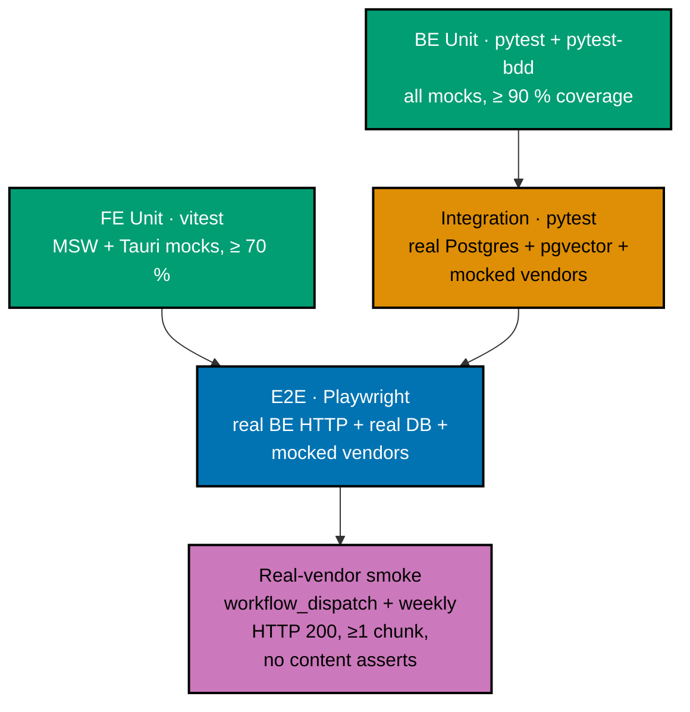
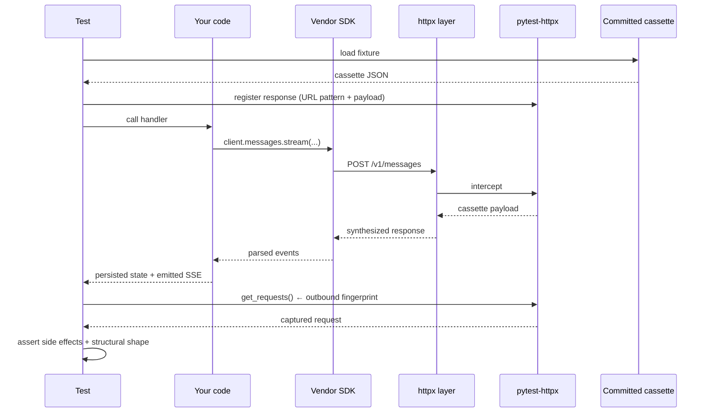
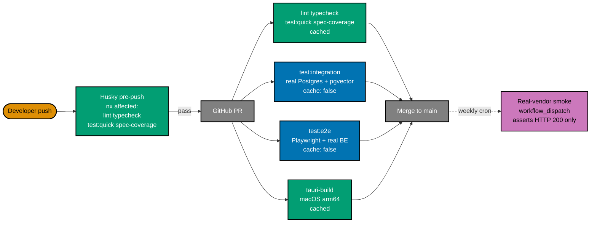

# Testing AI Applications

**Audience**: software engineers who have read the
[main AI primer](./README.md) §13 and want the full playbook for
shipping LLM-backed apps with confidence — three levels on the backend,
two levels on the frontend, deterministic in CI, with explicit ways to
exercise real vendors when warranted.

This doc is generic. Vendor-specific cassette shapes and SDK details
live in the four vendor primers:
[Anthropic](./anthropic-api.md),
[Gemini](./google-gemini-api.md),
[OpenAI](./openai-api.md),
[Perplexity](./perplexity-api.md).

## Why AI testing is different

CRUD code is deterministic. Same input → same output. Tests can assert
on prose, return values, exact rows. AI code is **non-deterministic by
default** and **expensive** to run. Eight realities the test strategy
must absorb:

1. **Wording variance.** Same prompt → different sentences across runs,
   even at `temperature=0`.
2. **Token-count variance.** Output length drifts even with seed pinning.
3. **Streaming chunk boundaries.** SSE frames split mid-word in
   different places per call.
4. **Provider-side model updates.** "Claude Haiku 4.5" today is not
   byte-identical to "Claude Haiku 4.5" a month from now.
5. **Provider-side latency.** Sub-second one day, multi-second the next.
6. **Embedding drift.** Floating-point output of an embedding endpoint
   can change across SDK versions.
7. **ivfflat / approximate retrieval.** Same query → slightly different
   top-k order across runs.
8. **Cost.** Real LLM calls bill real money. CI runs hundreds of
   variations per push; multiply.

The test pyramid below is shaped by those realities, not by ideology.

## The test pyramid for AI apps



The shape:

| Level             | BE                                        | FE                             |
| ----------------- | ----------------------------------------- | ------------------------------ |
| Unit              | mocked vendor HTTP + Gherkin; ≥ 90 %      | mocked BE + Tauri APIs; ≥ 70 % |
| Integration       | real Postgres + pgvector + mocked vendors | (not applicable — see below)   |
| E2E               | real BE HTTP + real DB + mocked vendors   | real BE + `vite preview` build |
| Real-vendor smoke | workflow-dispatch only                    | workflow-dispatch only         |

`test:quick` = `test:unit` + coverage validation. CI's pre-push hook
runs `test:quick` for affected projects only. Full suite per push, full
real-vendor smoke per week.

## Backend testing

### Level 1 · Unit (`test:unit`)

The widest layer. Everything mockable is mocked: vendor HTTP, the
filesystem (where avoidable), the system clock (`freezegun`), random
sources. Reference DB is in-process SQLite or a fresh ephemeral
Postgres only if a feature genuinely requires it; the strict line is
"unit tests must be cacheable in `nx`".

Stack:

- `pytest` + `pytest-bdd` — Gherkin scenarios under
  `specs/apps/<app>/be/gherkin/` are bound by step implementations in
  `tests/unit/`.
- `pytest-asyncio` — async-native tests for the async FastAPI codebase.
- `pytest-httpx` — intercepts the `httpx` layer that every modern
  vendor SDK uses. Returns scripted responses; captures outbound
  requests.
- `freezegun` — lock the wall clock for deterministic timestamps.
- `coverage` (LCOV) — measured at this level only. Threshold ≥ 90 %.
- `ruff` — lint.
- `pyright` — typecheck.

Pattern — one cassette per vendor:

```python
# tests/conftest.py
import json
import pytest

@pytest.fixture
def mock_anthropic(httpx_mock):
    httpx_mock.add_response(
        url="https://api.anthropic.com/v1/messages",
        method="POST",
        json={
            "id": "msg_test_001",
            "type": "message",
            "role": "assistant",
            "content": [{"type": "text", "text": "FIXTURE_REPORT"}],
            "model": "claude-haiku-4-5",
            "stop_reason": "end_turn",
            "usage": {"input_tokens": 100, "output_tokens": 50},
        },
    )
    return httpx_mock

@pytest.fixture
def mock_gemini_embed(httpx_mock):
    httpx_mock.add_response(
        url__regex=r".*generativelanguage\.googleapis\.com.*embedContent.*",
        method="POST",
        json={"embedding": {"values": [0.0] * 768}},
    )
    return httpx_mock

@pytest.fixture
def mock_perplexity(httpx_mock):
    httpx_mock.add_response(
        url="https://api.perplexity.ai/chat/completions",
        method="POST",
        json={
            "id": "cmpl_test",
            "model": "sonar",
            "choices": [{
                "index": 0,
                "message": {"role": "assistant", "content": "FIXTURE_GROUNDING"},
                "finish_reason": "stop",
            }],
            "citations": ["https://example.com/source-1"],
            "usage": {"prompt_tokens": 5, "completion_tokens": 1, "total_tokens": 6},
        },
    )
    return httpx_mock
```

Pattern — Gherkin-driven test:

```gherkin
# specs/apps/investment-oracle/be/gherkin/report.feature
Feature: Report generation

  Scenario: Generate a report uses the configured chat model
    Given an analysis with two attached sources
    And MOCK_LLM_PROVIDERS is true
    When the user requests POST /api/v1/analyses/{id}/report
    Then the response is 200 with content-type text/event-stream
    And the outbound request to the chat provider used model "claude-haiku-4-5"
    And the database has one row in "report_revisions" with kind="generation"
```

```python
# tests/unit/test_report.py
import json
from pytest_bdd import scenarios, when, then

scenarios("../../specs/apps/investment-oracle/be/gherkin/report.feature")

@when('the user requests POST /api/v1/analyses/{id}/report')
async def request_report(analysis_id, client):
    return await client.post(f"/api/v1/analyses/{analysis_id}/report")

@then('the outbound request to the chat provider used model "claude-haiku-4-5"')
def outbound_request_used_correct_model(mock_anthropic):
    [request] = mock_anthropic.get_requests(url="https://api.anthropic.com/v1/messages")
    body = json.loads(request.content)
    assert body["model"] == "claude-haiku-4-5"
    # NEVER assert on body["messages"][0]["content"] containing specific prose.
    # DO assert structural shape:
    assert isinstance(body["messages"], list)
    assert "max_tokens" in body
```

What unit tests assert:

- **Outbound-request fingerprint**: model id, system prompt content,
  retrieved chunks, `max_tokens`, tool definitions, headers.
- **Side effects**: rows written to DB (`reports`, `report_revisions`,
  `token_usage`), files created, queues enqueued.
- **Structural shape**: response is well-formed SSE / JSON, schema
  matches contract, status code correct.
- **Snapshot of cassette response**: deterministic because the cassette
  is.

What unit tests **never** assert:

- The prose of an LLM response.
- "Contains the word 'risk'" — even keyword presence flakes.

### Level 2 · Integration (`test:integration`)

Real Postgres + pgvector via `docker-compose.integration.yml`. Vendor
HTTP still mocked via the same cassettes. PDF parser (`pypdf`) runs for
real against a fixture PDF.

This level catches:

- Migration / schema drift (the unit DB and the prod DB diverge).
- pgvector-specific behaviour (ivfflat index build, cosine-distance
  operator, vector-dimension constraints).
- Real PDF-extraction quirks (encrypted PDFs, malformed pages,
  non-Latin scripts).
- Connection pool exhaustion.

`cache: false` in `nx.json` because docker-compose state is not
hashable. Pre-push hooks skip this level; CI runs it on every push.

Pattern:

```python
# tests/integration/test_ingest.py
import pathlib
import pytest

@pytest.mark.asyncio
async def test_ingest_apple_10k_writes_chunks(
    integration_db,        # fixture spinning up docker-compose Postgres
    mock_gemini_embed,     # vendor HTTP still mocked
):
    pdf_bytes = pathlib.Path(
        "plans/in-progress/2026-04-27__add-investment-oracle-app/fixture/aapl-fy2024-10k.pdf"
    ).read_bytes()
    source_id = await ingest_pdf(pdf_bytes, filename="aapl.pdf")

    rows = await integration_db.fetch(
        "SELECT page, length(text) AS len FROM source_chunks WHERE source_id = $1 ORDER BY page",
        source_id,
    )
    assert len(rows) > 0
    assert all(0 < r["len"] < 4000 for r in rows)   # chunk size sanity
```

Same Gherkin features run against this level — only the step
implementations differ (real DB instead of mocked).

### Level 3 · E2E (`test:e2e`)

Full stack on the BE side: Playwright (or `httpx` directly via a Python
E2E harness) drives the real running FastAPI sidecar. DB is real.
Vendor HTTP is **still mocked** — E2E is not a real-vendor test, it
just adds the HTTP boundary on top of integration.

Why mock vendors at E2E too:

- Determinism: a flaky vendor breaks E2E for reasons unrelated to your
  code.
- Cost: E2E runs hundreds of times per week; real vendors at that
  cadence is unreasonable.
- The thing E2E is meant to catch — broken HTTP wiring, header issues,
  SSE chunk boundaries, FastAPI dependency-injection misconfig — does
  not require real vendor responses.

Stack:

- Playwright + `playwright-bdd` — same Gherkin features as unit and
  integration.
- `webServer` config in `playwright.config.ts` boots
  `uvicorn investment_oracle_be.main:app --port 8501` before the
  test session starts.
- `MOCK_LLM_PROVIDERS=true` env var keeps cassettes active during the
  E2E session.

Pattern:

```ts
// apps/investment-oracle-be-e2e/tests/report.spec.ts
import { test, expect } from "@playwright/test";

test("generate report streams six sections via SSE", async ({ request }) => {
  const sources = await request.post("/api/v1/sources", {
    multipart: { file: { name: "tiny.pdf", mimeType: "application/pdf", buffer: tinyPdfBuffer } },
  });
  const sourceId = (await sources.json()).source_id;

  const analysis = await request.post("/api/v1/analyses", {
    data: { name: "test", source_ids: [sourceId], model: "claude-haiku-4-5" },
  });
  const analysisId = (await analysis.json()).id;

  const stream = await request.post(`/api/v1/analyses/${analysisId}/report`);
  expect(stream.headers()["content-type"]).toContain("text/event-stream");

  const body = await stream.text();
  expect(body).toMatch(/data: /);
  expect(body).toContain("[DONE]");
});
```

## Frontend testing

### Level 1 · Unit (`test:unit`)

Vitest + `@testing-library/react`. All BE HTTP mocked via MSW. All
Tauri APIs mocked via `@tauri-apps/api/__mocks__`. TypeScript-strict
(`tsc --noEmit` zero errors). Coverage threshold ≥ 70 %.

Why 70 % and not 90 % like BE: FE coverage on the API / auth /
Tauri-shell paths is structurally limited because those paths exist to
be mocked. The 70 % threshold reflects the realistic ceiling once
mocks subtract from measurable coverage.

Stack:

- `vitest` + `@testing-library/react` + `jsdom`.
- `msw` (Mock Service Worker) — intercepts `fetch` + `EventSource` /
  `fetch-event-source`.
- `@tauri-apps/api/__mocks__` — manual mocks for `invoke`, `event`,
  `path`, `shell`.
- `oxlint` — fast lint.
- `tsc --noEmit` — typecheck.

Pattern — MSW handler for SSE:

```ts
// src/test/msw-handlers.ts
import { http, HttpResponse } from "msw";

export const handlers = [
  http.post("http://127.0.0.1:8501/api/v1/analyses/:id/report", () => {
    const stream = new ReadableStream({
      start(controller) {
        const enc = new TextEncoder();
        controller.enqueue(enc.encode('data: {"delta":"## Executive Summary\\n\\n"}\n\n'));
        controller.enqueue(enc.encode('data: {"delta":"Apple shows strong "}\n\n'));
        controller.enqueue(enc.encode("data: [DONE]\n\n"));
        controller.close();
      },
    });
    return new HttpResponse(stream, {
      headers: { "Content-Type": "text/event-stream" },
    });
  }),
];
```

Pattern — component test with streamed SSE:

```ts
// src/components/ReportEditor.test.tsx
import { render, screen, waitFor } from "@testing-library/react";
import userEvent from "@testing-library/user-event";

test("streams generated report into the editor pane", async () => {
  render(<ReportEditor analysisId="a-1" />);
  await userEvent.click(screen.getByRole("button", { name: /generate/i }));

  await waitFor(() => {
    expect(screen.getByText(/Executive Summary/)).toBeInTheDocument();
  });
  await waitFor(() => {
    expect(screen.getByText(/Apple shows strong/)).toBeInTheDocument();
  });
});
```

What FE unit tests assert:

- DOM shape after a state transition.
- That a user action triggered the right MSW handler (count + URL).
- That a streamed chunk lands in the right pane.
- That a Tauri-API mock was invoked with the right args.

What FE unit tests **never** assert:

- LLM prose. Even at the FE.
- Pixel-exact rendering — that is visual-regression territory, separate
  from this primer.

### Level 2 · E2E (`test:e2e`)

Playwright drives a `vite preview` build of the FE in a real browser
against a real running FastAPI sidecar. Vendor HTTP still mocked. Tauri
shell **not** in the loop — verified manually instead, see Phase 22 of
the [investment-oracle delivery checklist](../../../../plans/in-progress/2026-04-27__add-investment-oracle-app/delivery.md).

Why no Tauri-shell automated E2E:

- `tauri-driver` (WebDriver) is platform-specific and requires
  per-target-triple builds.
- Headless Tauri is unreliable across CI runners.
- The Tauri shell adds a thin Rust process + IPC; it does not change
  the UX semantics that E2E is meant to validate.

What E2E catches that unit doesn't:

- Real CSS / layout against a real browser engine.
- Cross-component navigation.
- Real (mocked-vendor) BE responses, including HTTP error envelopes.
- Real `EventSource` / `fetch-event-source` against real `text/event-stream`.

### Why no integration level on the FE

It is a deliberate convention, locked in by `crud-fe-*` precedent. Two
levels — unit (mocked everything) and E2E (mocked vendors only) —
cover the FE testing surface without the cost of a third tier.

A "mocked-BE-only-but-real-component-tree" tier would catch nothing
that unit + E2E don't already catch, and would duplicate the MSW
infrastructure unnecessarily.

## LLM determinism strategy

Repeating the four-pattern rule from
[main primer §13](./README.md#13-evaluation-and-the-lack-of-unit-tests-for-llm-output)
because this is the single most-misapplied idea in AI testing:

### Allowed assertion patterns

| Pattern                       | What it asserts                                                                                    | Why deterministic                                                    |
| ----------------------------- | -------------------------------------------------------------------------------------------------- | -------------------------------------------------------------------- |
| Outbound-request fingerprint  | The request **your code built** before sending — model id, body, headers                           | Inputs + your code = deterministic; the network has not happened yet |
| Side-effect assertions        | DB rows / files / queue messages your handler wrote                                                | Mocked vendor returns scripted response → side effects are scripted  |
| Structural shape              | Status code 200, well-formed SSE (frames blank-line-separated, ends `[DONE]`), JSON matches schema | The shape is yours, not the model's                                  |
| Snapshot of cassette response | Byte-for-byte equality with the committed cassette                                                 | The cassette itself is committed and unchanged across runs           |

### Forbidden assertion patterns

| Anti-pattern                                        | Why it flakes                                                   |
| --------------------------------------------------- | --------------------------------------------------------------- |
| `assert "risk" in resp.text`                        | Model output drifts; even keyword presence will eventually fail |
| `assert resp.text == "Apple's risks include …"`     | Wording drift on every call                                     |
| `assert response.choices[0].message.content == "…"` | Same as above; cassette is fine, real call is not               |
| `assert len(resp.text) == 1247`                     | Token-count drift                                               |
| `assert resp.text.startswith("Apple")`              | Streaming chunk boundaries can land mid-word                    |

The rule of thumb: **assert on what you control, not on what the model
chose**.

## Cassette structure per vendor

The same cassette idea, four different on-the-wire shapes. Commit
cassettes under `apps/<app>-be/tests/fixtures/cassettes/`.

### Anthropic (`/v1/messages`)

```json
{
  "url": "https://api.anthropic.com/v1/messages",
  "method": "POST",
  "match_request": {
    "body_contains": ["claude-haiku-4-5", "structured Markdown report"]
  },
  "response": {
    "status": 200,
    "headers": { "content-type": "text/event-stream" },
    "stream": [
      "event: message_start\ndata: {\"type\":\"message_start\",\"message\":{\"id\":\"msg_test\",\"model\":\"claude-haiku-4-5\"}}\n\n",
      "event: content_block_start\ndata: {\"type\":\"content_block_start\",\"index\":0,\"content_block\":{\"type\":\"text\",\"text\":\"\"}}\n\n",
      "event: content_block_delta\ndata: {\"type\":\"content_block_delta\",\"index\":0,\"delta\":{\"type\":\"text_delta\",\"text\":\"## Executive Summary\\n\\n\"}}\n\n",
      "event: content_block_delta\ndata: {\"type\":\"content_block_delta\",\"index\":0,\"delta\":{\"type\":\"text_delta\",\"text\":\"FIXTURE\"}}\n\n",
      "event: content_block_stop\ndata: {\"type\":\"content_block_stop\",\"index\":0}\n\n",
      "event: message_stop\ndata: {\"type\":\"message_stop\",\"usage\":{\"input_tokens\":100,\"output_tokens\":3}}\n\n"
    ]
  }
}
```

### Google Gemini (`generateContent`, `embedContent`)

```json
{
  "url": "https://generativelanguage.googleapis.com/v1beta/models/gemini-2.5-flash-lite:streamGenerateContent",
  "method": "POST",
  "response": {
    "status": 200,
    "stream": [
      "data: {\"candidates\":[{\"content\":{\"parts\":[{\"text\":\"## Executive Summary\\n\\nFIXTURE\"}]},\"finishReason\":\"STOP\"}],\"usageMetadata\":{\"promptTokenCount\":100,\"candidatesTokenCount\":4}}\n\n"
    ]
  }
}
```

```json
{
  "url": "https://generativelanguage.googleapis.com/v1beta/models/gemini-embedding-001:embedContent",
  "method": "POST",
  "response": {
    "status": 200,
    "json": { "embedding": { "values": [0.0] } }
  }
}
```

### OpenAI (`/v1/responses`, `/v1/chat/completions`)

```json
{
  "url": "https://api.openai.com/v1/responses",
  "method": "POST",
  "response": {
    "status": 200,
    "stream": [
      "event: response.created\ndata: {\"type\":\"response.created\",\"response\":{\"id\":\"resp_test\",\"model\":\"gpt-5.5\"}}\n\n",
      "event: response.output_text.delta\ndata: {\"type\":\"response.output_text.delta\",\"delta\":\"## Executive Summary\\n\\n\"}\n\n",
      "event: response.output_text.delta\ndata: {\"type\":\"response.output_text.delta\",\"delta\":\"FIXTURE\"}\n\n",
      "event: response.completed\ndata: {\"type\":\"response.completed\",\"response\":{\"usage\":{\"input_tokens\":100,\"output_tokens\":3}}}\n\n"
    ]
  }
}
```

### Perplexity (`/chat/completions`)

```json
{
  "url": "https://api.perplexity.ai/chat/completions",
  "method": "POST",
  "response": {
    "status": 200,
    "json": {
      "id": "cmpl_test",
      "model": "sonar",
      "choices": [
        {
          "index": 0,
          "message": { "role": "assistant", "content": "FIXTURE_GROUNDING" },
          "finish_reason": "stop"
        }
      ],
      "citations": ["https://example.com/source-1", "https://example.com/source-2"],
      "usage": { "prompt_tokens": 5, "completion_tokens": 1, "total_tokens": 6 }
    }
  }
}
```

Cassettes are checked in. Treat them like fixtures — when the vendor
SDK changes the wire shape, regenerate the cassette and commit; when
the prompt-builder changes, regenerate; when both change, regenerate
and re-snapshot. Drift between your code and the cassette is a real
test failure that demands a deliberate fix.

## Vendor-mocking flow



The same flow on the FE swaps `httpx` / `pytest-httpx` for `fetch` /
MSW; everything else is identical.

## Real-vendor smoke

The one place real vendors are exercised. Live in a separate workflow
file, not in `test:unit` / `test:integration` / `test:e2e`.

Pattern:

- Trigger: `workflow_dispatch` + `schedule: 'cron: "0 2 * * 0"'` (weekly,
  Sunday 02:00 UTC).
- Env: `MOCK_LLM_PROVIDERS=false`, real `*_API_KEY` from secrets.
- Budget guardrail: cost cap forced to a low value (e.g. $0.50) so a
  bug cannot melt the bill.
- Assertions: HTTP 200, content-type `text/event-stream`, ≥ 1 chunk
  arrived, SSE stream terminated cleanly with `[DONE]` or vendor
  equivalent. **Never on content.**
- Failure handling: report to a dashboard, do not block merges. The
  smoke job exists to detect vendor-side regressions, not to gate code
  changes.

```yaml
# .github/workflows/smoke-real-vendors.yml
name: Smoke (real vendors)
on:
  workflow_dispatch:
  schedule:
    - cron: "0 2 * * 0"

jobs:
  smoke:
    runs-on: ubuntu-latest
    env:
      MOCK_LLM_PROVIDERS: "false"
      ANTHROPIC_API_KEY: ${{ secrets.ANTHROPIC_API_KEY }}
      GOOGLE_API_KEY: ${{ secrets.GOOGLE_API_KEY }}
      PERPLEXITY_API_KEY: ${{ secrets.PERPLEXITY_API_KEY }}
      COST_CAP_PER_DAY_USD: "0.50"
    steps:
      - uses: actions/checkout@v4
      - run: npm ci
      - run: npx nx run investment-oracle-be:test:smoke-real
```

## Vector retrieval testing

ivfflat is **approximate** — same query may return slightly different
top-k order across runs. Tests must accommodate.

| What to test                                             | What to assert                                                 |
| -------------------------------------------------------- | -------------------------------------------------------------- |
| Top-k contains the expected set                          | Returned ids ⊆ expected superset; never exact order            |
| Cosine-distance threshold filtering                      | Numeric threshold, not rank                                    |
| Embedding dimensions match `vector(N)` schema constraint | Inserts succeed for matching dim; fail for mismatched dim      |
| Index existence after migration                          | `\d+ source_chunks` shows the ivfflat index                    |
| Backfill idempotence                                     | Re-running ingest does not duplicate chunks (UNIQUE on sha256) |

For unit tests of retrieval, **insert deterministic vectors via
fixtures**, not by calling a real embedding endpoint. A 768-dim vector
of mostly zeros with one or two non-zero positions makes cosine
distance trivially predictable while still exercising pgvector
correctly.

```python
def make_test_vector(salt: int, dim: int = 768) -> list[float]:
    v = [0.0] * dim
    v[salt % dim] = 1.0
    return v   # Each `salt` produces a vector orthogonal to others.
```

## PII masking testing

When the demo includes a `PIIMasker` layer (see e.g. the
[investment-oracle plan](../../../../plans/in-progress/2026-04-27__add-investment-oracle-app/tech-docs.md#piimasker-protocol)),
the testing question is _"did raw PII actually leave the BE?"_. The
test answers by reading the captured outbound request body.

```python
import re
import pytest

NIK_RE = re.compile(r"\b\d{16}\b")
NPWP_RE = re.compile(r"\b\d{2}\.\d{3}\.\d{3}\.\d-\d{3}\.\d{3}\b")
PHONE_ID_RE = re.compile(r"\b(\+62|08)\d{8,12}\b")
EMAIL_RE = re.compile(r"\b[A-Za-z0-9._%+-]+@[A-Za-z0-9.-]+\.[A-Z|a-z]{2,}\b")

@pytest.mark.parametrize("vendor_url", [
    "https://api.anthropic.com/v1/messages",
    "https://generativelanguage.googleapis.com/v1beta/models/gemini-2.5-flash-lite:streamGenerateContent",
    "https://generativelanguage.googleapis.com/v1beta/models/gemini-embedding-001:embedContent",
    "https://api.perplexity.ai/chat/completions",
])
def test_no_raw_pii_on_the_wire(httpx_mock, vendor_url, prompt_with_pii):
    httpx_mock.add_response(url=vendor_url, json={})
    invoke_handler_with(prompt_with_pii)
    for request in httpx_mock.get_requests(url=vendor_url):
        body = request.content.decode()
        assert NIK_RE.search(body) is None,   f"raw NIK leaked to {vendor_url}"
        assert NPWP_RE.search(body) is None,  f"raw NPWP leaked to {vendor_url}"
        assert PHONE_ID_RE.search(body) is None
        assert EMAIL_RE.search(body) is None
```

Add a parallel test on the response side: after `PIIMasker.unmask()`,
the persisted Markdown should have placeholders restored to original
PII shape — but only when the original shape genuinely came from the
user, never from the model.

## Tooling matrix

| Concern            | Backend (Python)                 | Frontend (TypeScript)                            |
| ------------------ | -------------------------------- | ------------------------------------------------ |
| Test runner        | `pytest`                         | `vitest`                                         |
| BDD binding        | `pytest-bdd`                     | `playwright-bdd` (E2E only) / hand-rolled (unit) |
| Async              | `pytest-asyncio`                 | native `async`/`await` + vitest                  |
| HTTP mocking       | `pytest-httpx`                   | `msw`                                            |
| Time mocking       | `freezegun`                      | `vi.useFakeTimers()`                             |
| Coverage format    | `coverage.py` LCOV               | `vitest --coverage` LCOV (via c8)                |
| Coverage threshold | ≥ 90 %                           | ≥ 70 %                                           |
| Lint               | `ruff`                           | `oxlint`                                         |
| Typecheck          | `pyright`                        | `tsc --noEmit`                                   |
| E2E                | Playwright + `playwright-bdd`    | Playwright + `playwright-bdd`                    |
| DB fixture         | `docker-compose.integration.yml` | (consumed via real BE only)                      |
| Real-vendor flag   | `MOCK_LLM_PROVIDERS=false`       | `MOCK_LLM_PROVIDERS=false` (BE inherits)         |

## CI orchestration

Use `nx affected` to run only the changed projects. Cache aggressively
where possible:

| Target             | Cacheable | When it runs                          |
| ------------------ | :-------: | ------------------------------------- |
| `lint`             |    yes    | pre-push, PR                          |
| `typecheck`        |    yes    | pre-push, PR                          |
| `test:quick`       |    yes    | pre-push, PR (unit + coverage)        |
| `test:integration` |    no     | PR (real DB)                          |
| `test:e2e`         |    no     | PR (real BE HTTP)                     |
| `spec-coverage`    |    yes    | pre-push, PR (Gherkin → step binding) |
| `tauri-build`      |    yes    | PR (macOS arm64 only)                 |
| Real-vendor smoke  |    n/a    | workflow-dispatch + weekly cron       |

`spec-coverage` is the often-forgotten target: it asserts every
Gherkin scenario in `specs/.../*.feature` has a binding step
implementation in `tests/`. Catches drift when a feature file is
edited but the test impls are not, or vice versa.

Pre-push hook (Husky) runs only the cacheable targets so the developer
experience stays fast; the slow targets (`test:integration`, `test:e2e`)
land in CI on push, not locally.

## Mermaid: full CI shape



## Common pitfalls

A short field guide of the mistakes most often seen on AI testing
work in this repo:

| Pitfall                                           | Why it bites                                                                 | Fix                                                                            |
| ------------------------------------------------- | ---------------------------------------------------------------------------- | ------------------------------------------------------------------------------ |
| Asserting on LLM prose                            | Drifts; flakes; eventually fails                                             | Switch to outbound-fingerprint or side-effect assertion                        |
| Forgetting `MOCK_LLM_PROVIDERS=true` in a CI lane | Real vendor calls run; bill rises; CI flakes when vendor is slow             | Set the env var at the workflow level, not per-step                            |
| Cassette and prompt-builder drift                 | Cassette matched the old prompt; new prompt produces different request shape | Treat cassette regen as a deliberate test action; commit alongside             |
| ivfflat order assertion                           | Approximate index returns different order across runs                        | Assert membership, not order                                                   |
| Real PDFs in E2E                                  | E2E becomes slow and CI cost balloons                                        | Use a tiny synthetic PDF (≤ 10 KB) for E2E; keep real fixtures for integration |
| FE integration tier                               | Adds a third layer that catches nothing unit + e2e don't                     | Stay at two-tier on FE                                                         |
| Asserting timestamp values                        | Wall clock moves between writes                                              | `freezegun` (BE) or `vi.useFakeTimers()` (FE)                                  |
| Coverage gate on the wrong level                  | Coverage measured at integration → swings on flaky DB tests                  | Measure coverage only at unit level                                            |
| Smoke tests block merges                          | Vendor downtime blocks unrelated changes                                     | Smoke is workflow-dispatch only; failures report, do not gate                  |

## Related

- [AI Application Development](./README.md) — main primer (read this first)
- [Anthropic API Primer](./anthropic-api.md)
- [Google Gemini API Primer](./google-gemini-api.md)
- [OpenAI API Primer](./openai-api.md)
- [Perplexity Sonar API Primer](./perplexity-api.md)
- [Behavior-Driven Development](../development/behavior-driven-development-bdd/README.md)
  — the Gherkin discipline this primer assumes
- [Test-Driven Development](../development/test-driven-development-tdd/README.md)
  — the structural-assertion mindset that makes AI testing tractable
