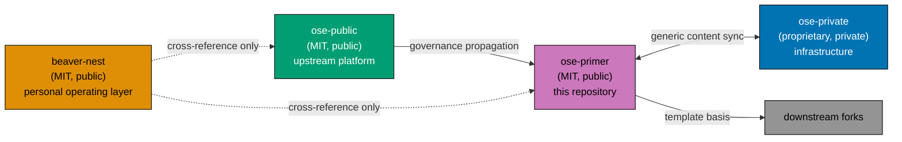

# Related Repositories

`ose-primer` is one of four sibling repositories in the Open Sharia Enterprise (OSE) family. The four repositories cross-reference each other directly — there is no parent container repository, no submodule wiring, and no shared workspace. This reference catalogues each sibling, its visibility, its license, and its relationship to `ose-primer`.

The canonical rules governing this family live in the [Repository Ecosystem Convention](../../repo-governance/conventions/structure/repository-ecosystem.md). This document is the catalogue those rules mandate.

## Repository Catalogue

| Repository                                                 | Visibility | License     | Purpose                                                                                         | Relationship to `ose-primer`                                                                                    |
| ---------------------------------------------------------- | ---------- | ----------- | ----------------------------------------------------------------------------------------------- | --------------------------------------------------------------------------------------------------------------- |
| [`ose-public`](https://github.com/wahidyankf/ose-public)   | Public     | MIT         | Main OSE platform monorepo; upstream source of governance, conventions, agents, and skills      | **Upstream.** Governance artifacts originate there and propagate here.                                          |
| [`ose-primer`](https://github.com/wahidyankf/ose-primer)   | Public     | MIT         | Repository template — clean MIT starting point for new OSE-style polyglot Nx monorepos          | This repository.                                                                                                |
| [`ose-private`](https://github.com/wahidyankf/ose-private) | Private    | Proprietary | Private product operations and infrastructure for authorized maintainers                        | Listed for ecosystem context only; no private implementation detail or infrastructure flows into this template. |
| [`beaver-nest`](https://github.com/wahidyankf/beaver-nest) | Public     | MIT         | BeaverNest — a personal operating layer (assistant, content builder, posting helper, workflows) | Cross-reference only. Scaffolded from this family but syncs no content in either direction.                     |

## Terminology — "the OSE repos"

When a request says **"all of the OSE repositories"**, **"all of the OSE repos"**, **"all four
repos"**, or any equivalent collective phrase, it means exactly these four, and nothing else:

| #   | Repository    |
| --- | ------------- |
| 1   | `ose-public`  |
| 2   | `ose-primer`  |
| 3   | `ose-private` |
| 4   | `beaver-nest` |

Four consequences worth stating, because each has been a real source of ambiguity:

- **`beaver-nest` is always included.** The collective term is **not** a synonym for the three-repo
  parity loop. `beaver-nest` sits outside that loop but is a full family member.
- **Only these four.** Other repositories that happen to sit in the same parent directory on a
  developer machine are not part of the set.
- **A change is incomplete until it lands in all four.** "Applied to the OSE repos" means four
  repositories, not "the ones where it was convenient".
- **Landing in all four is not the same as landing identically in all four.** Each repository's
  footprint differs — a convention may reference a document one repo does not have, or govern a
  surface that is empty there. Adapt per repository and say what differed; do not skip the repo, and
  do not force an artefact that does not fit it.

If a change genuinely should not apply to one of the four, name which one and why. Silently narrowing
the set is the failure this definition exists to prevent.

## Lineage

Colours follow the repository's [color-blind friendly palette](../../repo-governance/conventions/formatting/diagrams.md). Solid arrows are content flows. Dashed arrows are documentation cross-references only — no content sync crosses them.

## Family Membership Versus Content Sync

These are two separate questions, and conflating them is the most common error when reading this catalogue.

- **Family membership** covers all four repositories. Every one of them MUST name the other three, with GitHub URLs, in its `README.md`, its `AGENTS.md`, and its own copy of this catalogue.
- **Content sync** covers only three — `ose-public`, `ose-primer`, and `ose-private`. Generic content (governance docs, agents, skills, conventions, workflows, tooling) is kept aligned across those, with `ose-primer` as the shared upstream template.

`beaver-nest` is a full family member that participates in **no** content sync. It scaffolded from this ecosystem, but no parity plan targets it, and adopting a family change there is a deliberate decision made inside that repository.

## Propagation Summary

Governance, conventions, agents, and skills flow `ose-public → ose-primer → downstream forks`.
Private operational material does not flow into this template. `ose-primer` is a downstream
template, not an upstream source: changes made here do not automatically flow back.

## Sync cadence across repos

The propagation summary above states **what** flows between repos; this states **how often** each
sibling is brought current with `ose-public` — the three repos in the content-sync loop differ, and
the difference is deliberate, not an oversight:

- **`ose-private`** — kept **in real time**. `rhino-cli` and the shared `repo-governance/` content
  (conventions, workflows, agent definitions) propagate to `ose-private` as they land in
  `ose-public`, not on a batched schedule. That repo backs live authorized-maintainer and
  infrastructure operations, so governance and tooling drift there is costly immediately, not just
  eventually.
- **`ose-primer`** (this repository) — kept on a **delayed** sync. As the reusable polyglot starter
  template, `ose-primer` does not need every `ose-public` governance change the moment it lands;
  batching updates conserves the review and propagation cost of a sync that public downstream
  adopters do not need on a real-time cadence.
- **`beaver-nest`** — **not synced** on an ongoing basis, consistent with its full exclusion from the
  content-sync loop above. BeaverNest is planned to merge back into `ose-public` in the near term, so
  investing in an ongoing sync mechanism for a repo expected to be reabsorbed is not worth the cost;
  its `rhino-cli` fork and governance content are addressed at merge time instead.

Keeping the family aligned is a **manual** discipline — there is no automated sync agent. Coordinated changes that must land in more than one repository are authored via the [plan-multi-repo-parity-planning workflow](../../repo-governance/workflows/plan/plan-multi-repo-parity-planning.md), then executed within each repository.

## Licensing

`ose-public`, `ose-primer`, and `beaver-nest` are **MIT throughout**. See [LICENSING-NOTICE.md](../../LICENSING-NOTICE.md) for this repository's details. Consumers who fork `ose-primer` can build proprietary or open products on top without restriction.

`ose-private` is **proprietary**. It is listed here for ecosystem awareness; contributors to `ose-primer` are not expected to have access. Proprietary `ose-private` content MUST NOT flow into this MIT-licensed template.

## Non-Goals for this document

- This document does not describe parity mechanics or release cadence; those live in the multi-repo parity planning workflows under `repo-governance/workflows/plan/`.
- This document does not enumerate every file-by-file classification. Per-gap classification is decided during each parity planning pass.
- This document does not describe how to clone, set up, or build any sibling; that belongs in each sibling's own README.

## Links

- [Repository Ecosystem Convention](../../repo-governance/conventions/structure/repository-ecosystem.md) — the canonical rules for this family.
- [plan-multi-repo-parity-planning](../../repo-governance/workflows/plan/plan-multi-repo-parity-planning.md) — authoring coordinated multi-repo changes.
- External: <https://github.com/wahidyankf/ose-public>
- External: <https://github.com/wahidyankf/ose-primer>
- External: <https://github.com/wahidyankf/ose-private>
- External: <https://github.com/wahidyankf/beaver-nest>
