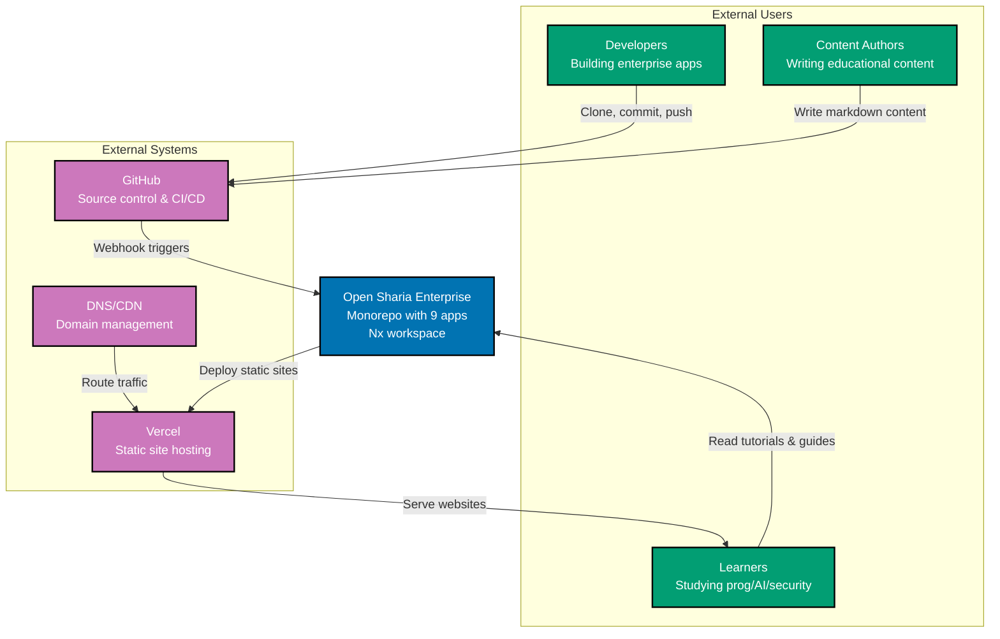

# System Architecture

> **Note:** This document is a work in progress (WIP/Draft). Content and diagrams are subject to change as the platform evolves.

Comprehensive reference for the Open Sharia Enterprise platform architecture, including application inventory, interactions, deployment infrastructure, and CI/CD pipelines.

## System Overview

Open Sharia Enterprise is a monorepo-based platform built with Nx, containing multiple applications that serve different aspects of the Sharia-compliant enterprise ecosystem. The system follows a microservices-style architecture where applications are independent but share common libraries and build infrastructure.

**Key Characteristics:**

- **Monorepo Architecture**: Nx workspace with multiple independent applications
- **Trunk-Based Development**: All development on `main` branch
- **Automated Quality Gates**: Git hooks + GitHub Actions + Nx caching
- **Deployment**: Vercel for static sites and web applications
- **Build Optimization**: Nx affected builds ensure only changed code is rebuilt

## C4 Model Architecture

The system architecture is documented using the C4 model (Context, Container, Component, Code) to provide multiple levels of abstraction suitable for different audiences.

### C4 Level 1: System Context

Shows how the Open Sharia Enterprise platform fits into the world, including users and external systems.

**Key Relationships:**

- **Developers & Authors**: Interact with GitHub (source of truth) to build applications and create content
- **Learners**: Access educational content via Vercel-hosted sites (crud-fs-ts-nextjs, crud-fs-ts-nextjs)
- **GitHub**: Central hub for CI/CD automation and quality gates
- **Vercel**: Automated deployment platform for Next.js applications and web applications

## Contents

- [Applications & Containers](./applications.md) - Application inventory, C4 Level 2 container diagram, interactions
- [Components & Code](./components.md) - C4 Level 3 component diagrams, Level 4 code architecture
- [Deployment](./deployment.md) - Deployment architecture, environment branches, Vercel configuration
- [CI/CD Pipeline](./ci-cd.md) - Git hooks, GitHub Actions workflows, Nx build system, development workflow
- [Technology Stack](./technology-stack.md) - Stack summary, quality tools, future considerations
