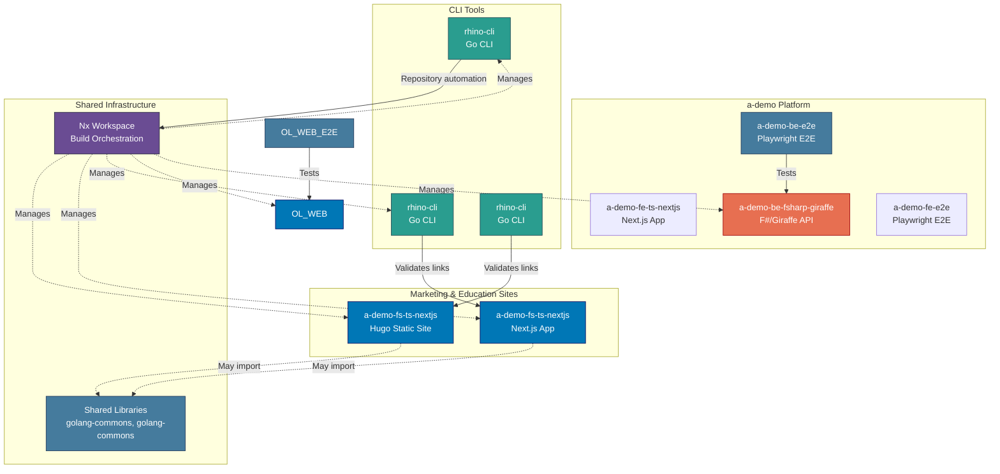

# Applications & Containers

Application inventory and C4 Level 2 container diagram for the Open Sharia Enterprise platform.

## Applications Inventory

The platform consists of 9 applications across 4 technology stacks:

### Frontend Applications (Hugo Static Sites)

#### a-demo-fs-ts-nextjs

- **Purpose**: Marketing and documentation website for a-demo
- **URL**: <https://example.com>
- **Technology**: Hugo 0.156.0 Extended + PaperMod theme
- **Deployment**: Vercel (via `prod-a-demo-fs-ts-nextjs` branch)
- **Build Command**: `nx build a-demo-fs-ts-nextjs`
- **Dev Command**: `nx dev a-demo-fs-ts-nextjs`

### Web Applications (Next.js)

#### a-demo-fs-ts-nextjs

- **Purpose**: Educational platform for programming, AI, and security
- **URL**: <https://example.com>
- **Technology**: Next.js 16 (App Router) + TypeScript + tRPC
- **Languages**: Bilingual (default English)
- **Deployment**: Vercel (via `prod-a-demo-fs-ts-nextjs` branch)
- **Build Command**: `nx build a-demo-fs-ts-nextjs`
- **Dev Command**: `nx dev a-demo-fs-ts-nextjs`

### CLI Tools (Go)

#### rhino-cli

- **Purpose**: Link validation for a-demo-fs-ts-nextjs content
- **Language**: Go 1.26
- **Build Command**: `nx build rhino-cli`
- **Features**:
  - Link validation for a-demo-fs-ts-nextjs content
- **Usage**: Runs as part of a-demo-fs-ts-nextjs quality checks

#### rhino-cli

- **Purpose**: Repository management and automation
- **Language**: Go 1.26
- **Build Command**: `nx build rhino-cli`
- **Location**: `apps/rhino-cli/`
- **Status**: Active development

#### rhino-cli

- **Purpose**: a-demo site link validation
- **Language**: Go 1.26
- **Build Command**: `nx build rhino-cli`
- **Features**:
  - Validates all internal links in a-demo-fs-ts-nextjs content
  - Text, JSON, and markdown output formats
- **Usage**: Runs as first step of `a-demo-fs-ts-nextjs`'s `test:quick` target

### Web Applications (Next.js)

#### a-demo-fe-ts-nextjs

- **Purpose**: Landing and promotional website for a-demo
- **URL**: <https://www.example.com>
- **Technology**: Next.js 16 (App Router) + React 19 + TailwindCSS
- **Deployment**: Vercel (via `prod-a-demo-web` branch)
- **Build Command**: `nx build a-demo-fe-ts-nextjs`
- **Dev Command**: `nx dev a-demo-fe-ts-nextjs`
- **Features**:
  - Radix UI / shadcn-ui component library
  - Cookie-based authentication
  - JSON data files for content
  - Production Dockerfile with standalone output

### Backend Services

#### a-demo-be-fsharp-giraffe

- **Purpose**: REST API backend for a-demo (F#/Giraffe implementation)
- **Technology**: F# + Giraffe + .NET
- **Build Command**: `nx build a-demo-be-fsharp-giraffe`
- **Dev Command**: `nx dev a-demo-be-fsharp-giraffe`
- **Features**:
  - AltCover code coverage enforcement (>=90%)
  - Production Dockerfile with multi-stage build
  - OpenAPI 3.1 contract-first development

### E2E Test Suites (Playwright)

#### a-demo-fe-e2e

- **Purpose**: End-to-end tests for a-demo-fe-ts-nextjs
- **Technology**: Playwright
- **Run Command**: `nx run a-demo-fe-e2e:test:e2e`

#### a-demo-be-e2e

- **Purpose**: End-to-end tests for a-demo-be-fsharp-giraffe REST API
- **Technology**: Playwright
- **Run Command**: `nx run a-demo-be-e2e:test:e2e`

#### a-demo-be-e2e

- **Purpose**: End-to-end tests for a-demo-be-java-springboot REST API
- **Technology**: Playwright
- **Run Command**: `nx run a-demo-be-e2e:test:e2e`
- **Location**: `apps/a-demo-be-e2e/`

## C4 Level 2: Container Diagram

Shows the high-level technical building blocks (containers) of the system. In C4 terminology, a "container" is a deployable/executable unit (web app, database, file system, etc.), not a Docker container.

## Application Interactions

**Independent Application Suites:**

Marketing & Education Sites:

- a-demo-fs-ts-nextjs: Fully independent static site
- a-demo-fs-ts-nextjs: Next.js fullstack content platform (with CLI link validation)

CLI Tools:

- rhino-cli: Validates links in a-demo-fs-ts-nextjs content
- rhino-cli: Repository management automation

**Build-Time Dependencies:**

- All applications managed by Nx workspace
- CLI tools executed during build processes
- Shared libraries may be imported at build time via `@open-sharia-enterprise/[lib-name]`

**Link Validation Pipeline (a-demo-fs-ts-nextjs):**

rhino-cli validates internal links in a-demo-fs-ts-nextjs content as part of the quality gate.
