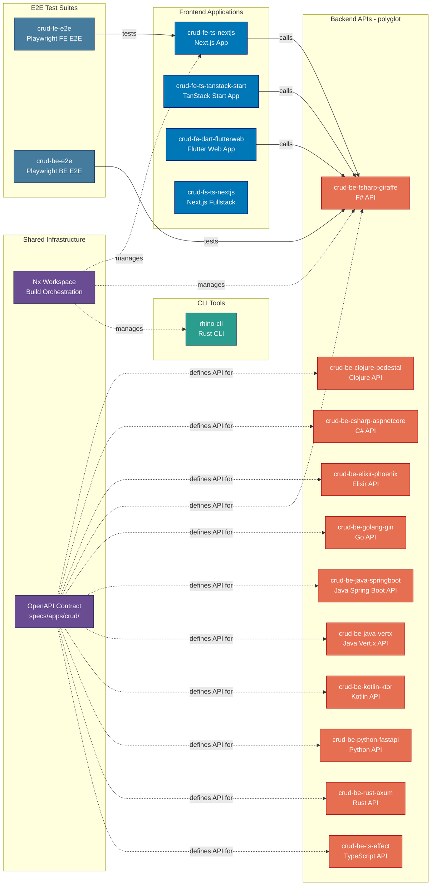

# Applications & Containers

Application inventory and C4 Level 2 container diagram for the platform.

## 📋 Applications Inventory

The platform consists of 19 applications across multiple technology stacks.

### Backend Services (`apps/crud-be-*`)

| App                         | Language / Framework | Build Command                        |
| --------------------------- | -------------------- | ------------------------------------ |
| `crud-be-clojure-pedestal`  | Clojure + Pedestal   | `nx build crud-be-clojure-pedestal`  |
| `crud-be-csharp-aspnetcore` | C# + ASP.NET Core    | `nx build crud-be-csharp-aspnetcore` |
| `crud-be-elixir-phoenix`    | Elixir + Phoenix     | `nx build crud-be-elixir-phoenix`    |
| `crud-be-fsharp-giraffe`    | F# + Giraffe         | `nx build crud-be-fsharp-giraffe`    |
| `crud-be-golang-gin`        | Go + Gin             | `nx build crud-be-golang-gin`        |
| `crud-be-java-springboot`   | Java + Spring Boot   | `nx build crud-be-java-springboot`   |
| `crud-be-java-vertx`        | Java + Vert.x        | `nx build crud-be-java-vertx`        |
| `crud-be-kotlin-ktor`       | Kotlin + Ktor        | `nx build crud-be-kotlin-ktor`       |
| `crud-be-python-fastapi`    | Python + FastAPI     | `nx build crud-be-python-fastapi`    |
| `crud-be-rust-axum`         | Rust + Axum          | `nx build crud-be-rust-axum`         |
| `crud-be-ts-effect`         | TypeScript + Effect  | `nx build crud-be-ts-effect`         |

All backend services implement the same OpenAPI contract (`specs/apps/crud/containers/contracts/`). Each is an independent deployable REST API.

### Frontend Applications (`apps/crud-fe-*`)

| App                         | Language / Framework        | Build Command                        |
| --------------------------- | --------------------------- | ------------------------------------ |
| `crud-fe-dart-flutterweb`   | Dart + Flutter Web          | `nx build crud-fe-dart-flutterweb`   |
| `crud-fe-ts-nextjs`         | TypeScript + Next.js        | `nx build crud-fe-ts-nextjs`         |
| `crud-fe-ts-tanstack-start` | TypeScript + TanStack Start | `nx build crud-fe-ts-tanstack-start` |

### Fullstack Application

| App                 | Language / Framework | Build Command                |
| ------------------- | -------------------- | ---------------------------- |
| `crud-fs-ts-nextjs` | TypeScript + Next.js | `nx build crud-fs-ts-nextjs` |

### E2E Test Suites

| App           | Purpose                                   | Run Command                   |
| ------------- | ----------------------------------------- | ----------------------------- |
| `crud-be-e2e` | End-to-end tests for all `crud-be-*` APIs | `nx run crud-be-e2e:test:e2e` |
| `crud-fe-e2e` | End-to-end tests for `crud-fe-*` apps     | `nx run crud-fe-e2e:test:e2e` |

### CLI Tools

| App         | Language | Purpose                          | Build Command        |
| ----------- | -------- | -------------------------------- | -------------------- |
| `rhino-cli` | Rust     | Repository management automation | `nx build rhino-cli` |

## 🏗️ C4 Level 2: Container Diagram

Shows the high-level technical building blocks (containers) of the system. In C4 terminology, a "container" is a deployable/executable unit (web app, API, CLI, etc.), not a Docker container.

## 🔄 Application Interactions

**Contract-First Design:**

All backend services (`crud-be-*`) implement the same OpenAPI 3.1 contract defined in
`specs/apps/crud/containers/contracts/`. They are independently deployable and
interchangeable — frontends can point to any backend.

**Frontend ↔ Backend:**

- Frontend apps (`crud-fe-*`, `crud-fs-ts-nextjs`) call backend REST APIs
- All backends expose the same endpoints per the OpenAPI contract

**E2E Test Suites:**

- `crud-be-e2e` — tests backend APIs against the OpenAPI contract
- `crud-fe-e2e` — tests frontend user flows via Playwright

**CLI Tools:**

- `rhino-cli` — repository management automation (Rust implementation)

**Build-Time Dependencies:**

- All applications managed by Nx workspace
- Backend apps consume code from `libs/` (codegen, commons)
- Shared OpenAPI contract consumed by backend apps and E2E suites

## 🔗 Related Documentation

- [Monorepo Structure Reference](../monorepo-structure.md) — Folder layout and naming conventions
- [Project Dependency Graph](../project-dependency-graph.md) — Nx dependency relationships
- [C4 Architecture Model](../../explanation/software-engineering/architecture/c4-architecture-model/README.md) — C4 diagram standards
