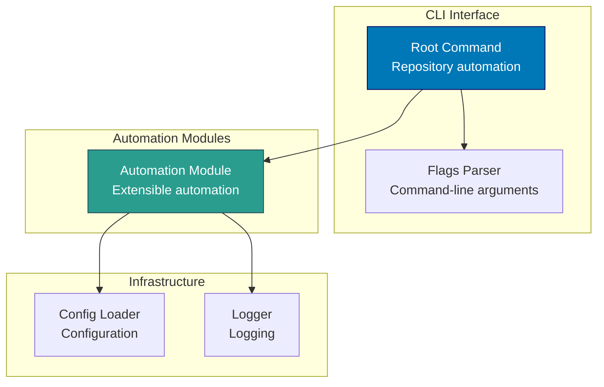

# Components & Code Architecture

C4 Level 3 component diagrams and Level 4 code architecture for the Open Sharia Enterprise platform.

## 🏗️ C4 Level 3: Component Diagrams

Shows the internal components within each container. Components are groupings of related functionality behind a well-defined interface.

### crud-fs-ts-nextjs Components (Next.js Fullstack App)

`crud-fs-ts-nextjs` is a Next.js 16 fullstack application using the App Router with tRPC for type-safe API routes. It serves as a demo educational platform with bilingual support (default English). See the [Applications inventory](./applications.md) for full details.

### rhino-cli-go Components (Go CLI Tool)

**Component Responsibilities:**

- **Root Command**: CLI entry point, command routing, help text
- **Links Check Command**: Validate internal links in crud-fs-ts-nextjs content

### rhino-cli-rust Components (Rust CLI Tool)

**Component Responsibilities:**

- **Root Command**: CLI entry point for repository automation tasks
- **Automation Module**: Extensible module system for automation workflows
- **Config Loader**: Load butler-specific configuration

### crud-fs-ts-nextjs Components (Next.js Fullstack Platform)

**Component Responsibilities:**

- **Next.js App Router**: Static generation and routing for educational content
- **tRPC API**: Backend API for content retrieval, search, and navigation
- **Bilingual Support**: Default English with Indonesian content

## 📋 C4 Level 4: Code Architecture

Shows implementation details for critical components. Focus on Go CLI tool package structures and key implementation patterns.

### rhino-cli-go Package Structure (Go)

rhino-cli-go now provides only `links check` for validating internal links in crud-fs-ts-nextjs content. Title update and navigation regeneration commands are not applicable to Next.js apps.
