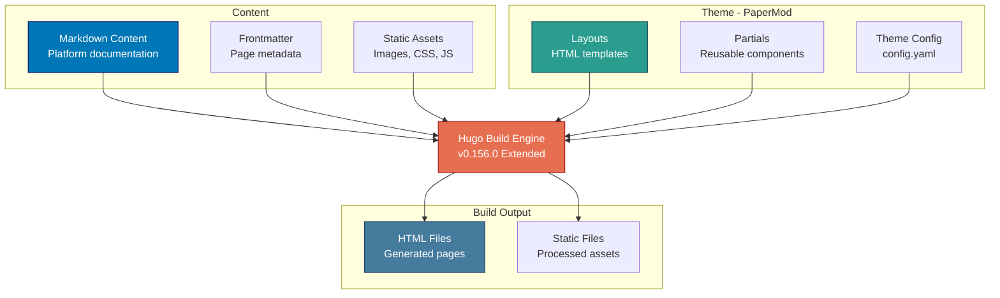
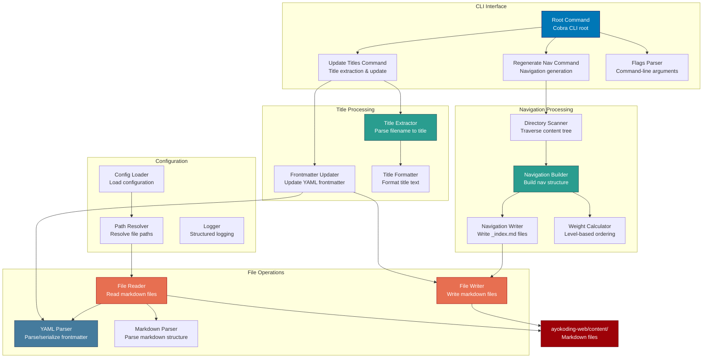
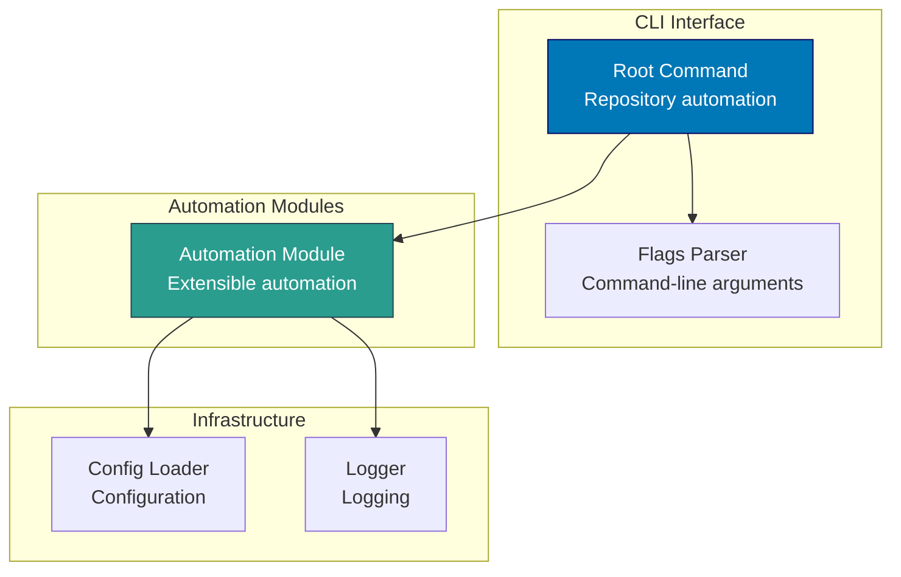
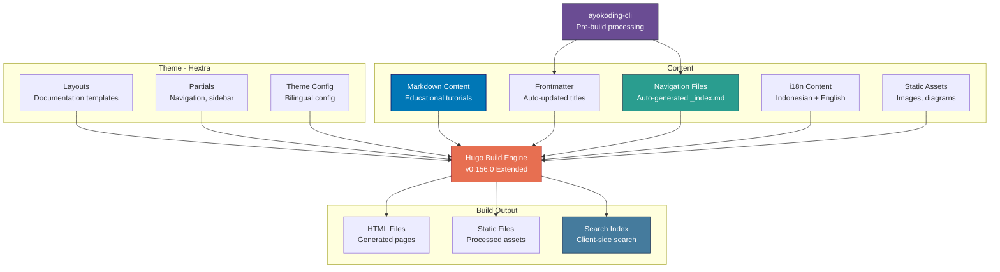
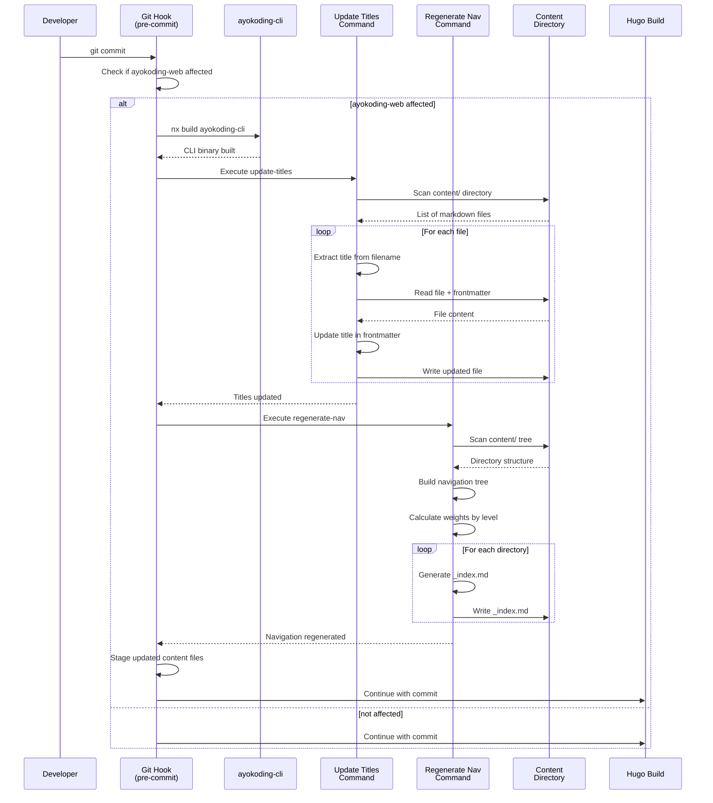

# Components & Code Architecture

C4 Level 3 component diagrams and Level 4 code architecture for the Open Sharia Enterprise platform.

## C4 Level 3: Component Diagrams

Shows the internal components within each container. Components are groupings of related functionality behind a well-defined interface.

### oseplatform-web Components (Hugo Static Site)



**Component Responsibilities:**

- **Markdown Content**: Platform marketing and documentation content
- **Layouts**: PaperMod theme templates for page structure
- **Theme Config**: Site configuration, navigation menus, theme settings

### ayokoding-cli Components (Go CLI Tool)



**Component Responsibilities:**

- **Root Command**: CLI entry point, command routing, help text
- **Title Extractor**: Extract title from filename pattern (e.g., `01__intro.md` -> "Intro")
- **Frontmatter Updater**: Update YAML frontmatter in markdown files
- **Navigation Scanner**: Recursively scan content directory structure
- **Navigation Builder**: Build hierarchical navigation structure
- **Weight Calculator**: Calculate level-based ordering (level 1 = 100, level 2 = 200, etc.)
- **YAML Parser**: Parse and serialize YAML frontmatter

### rhino-cli Components (Go CLI Tool)



**Component Responsibilities:**

- **Root Command**: CLI entry point for repository automation tasks
- **Automation Module**: Extensible module system for automation workflows
- **Config Loader**: Load butler-specific configuration

### ayokoding-web Components (Hugo Static Site)



**Component Responsibilities:**

- **ayokoding-cli**: Pre-build processing (title updates, navigation generation)
- **Markdown Content**: Programming, AI, and security educational content
- **Navigation Files**: Auto-generated navigation structure with level-based weights
- **i18n Content**: Bilingual support (Indonesian primary, English secondary)
- **Search Index**: Client-side search for documentation

## C4 Level 4: Code Architecture

Shows implementation details for critical components. Focus on Go CLI tool package structures and key implementation patterns.

### ayokoding-cli Package Structure (Go)

```mermaid
classDiagram
    class main {
        +main() void
    }

    class RootCmd {
        +Execute() error
        -initConfig() void
    }

    class UpdateTitlesCmd {
        +Run() error
        -scanContentDir() []string
        -updateFile(path) error
    }

    class RegenerateNavCmd {
        +Run() error
        -buildNavigationTree() NavTree
        -writeIndexFiles(tree) error
    }

    class TitleExtractor {
        +ExtractFromFilename(path) string
        -parseFilename(name) string
        -formatTitle(raw) string
    }

    class FrontmatterUpdater {
        +UpdateTitle(path, title) error
        -readFile(path) ([]byte, error)
        -parseFrontmatter(content) map[string]interface{}
        -serializeFrontmatter(data) []byte
        -writeFile(path, content) error
    }

    class NavigationScanner {
        +ScanDirectory(root) NavTree
        -walkDir(path) error
        -isMarkdownFile(path) bool
        -extractMetadata(path) Metadata
    }

    class NavigationBuilder {
        +BuildTree(files) NavTree
        -calculateWeights(tree) NavTree
        -sortByWeight(nodes) []NavNode
    }

    class WeightCalculator {
        +CalculateWeight(level) int
        +GetLevelFromPath(path) int
    }

    class NavWriter {
        +WriteIndexFiles(tree) error
        -generateIndexContent(node) string
        -writeFile(path, content) error
    }

    class FileReader {
        +ReadMarkdown(path) (string, error)
        +ParseYAML(content) (map[string]interface{}, error)
    }

    class FileWriter {
        +WriteMarkdown(path, content) error
        +SerializeYAML(data) ([]byte, error)
    }

    class Config {
        -string ContentDir
        -string BaseURL
        -bool Verbose
        +Load() error
        +Validate() error
    }

    class Logger {
        +Info(msg) void
        +Error(msg) void
        +Debug(msg) void
    }

    main --> RootCmd
    RootCmd --> UpdateTitlesCmd
    RootCmd --> RegenerateNavCmd
    RootCmd --> Config
    UpdateTitlesCmd --> TitleExtractor
    UpdateTitlesCmd --> FrontmatterUpdater
    UpdateTitlesCmd --> FileReader
    UpdateTitlesCmd --> FileWriter
    RegenerateNavCmd --> NavigationScanner
    RegenerateNavCmd --> NavigationBuilder
    RegenerateNavCmd --> NavWriter
    NavigationBuilder --> WeightCalculator
    NavWriter --> FileWriter
    FrontmatterUpdater --> FileReader
    FrontmatterUpdater --> FileWriter
    UpdateTitlesCmd --> Logger
    RegenerateNavCmd --> Logger
```

**Go Package Design Patterns:**

- **Command Pattern**: Cobra-based CLI with subcommands
- **Single Responsibility**: Each struct handles one specific task
- **Dependency Injection**: Explicit dependencies passed to constructors
- **Error Handling**: Explicit error returns, no exceptions
- **Interface Abstraction**: FileReader/FileWriter interfaces for testability
- **Configuration Management**: Centralized config loading and validation
- **Structured Logging**: Consistent logging throughout the application

### Key Sequence Diagrams

**Content Processing Flow (ayokoding-cli + ayokoding-web):**


