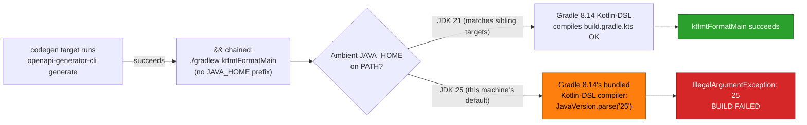

# Fix crud-be-kotlin-ktor codegen JDK/Gradle mismatch

**Status**: Backlog

## Context

`nx run crud-be-kotlin-ktor:typecheck` — and therefore the whole `test:quick` pre-push gate for
`crud-be-kotlin-ktor` — fails on a fresh (cold-cache) run whenever the ambient `JAVA_HOME`/`java` on
`PATH` resolves to a JDK newer than the version Gradle 8.14's bundled Kotlin-DSL script compiler
supports (confirmed: JDK 25). `typecheck` depends on Nx target `codegen`, and `codegen`'s command
chains two sub-commands: `openapi-generator-cli generate && (cd apps/crud-be-kotlin-ktor && ./gradlew
ktfmtFormatMain)`. The first sub-command (code generation) succeeds unconditionally. The second
(`./gradlew ktfmtFormatMain`) fails with `java.lang.IllegalArgumentException: 25` — a genuine, fully
reproduced toolchain incompatibility, not a flake.

**Root cause (verified by direct reproduction, 2026-08-08)**: every other gradle-invoking Nx target
in `apps/crud-be-kotlin-ktor/project.json` (`build`, `dev`, `test:coverage`, `test:unit`, `lint`,
`typecheck`, `deps:audit`) prefixes its `./gradlew` invocation with
`JAVA_HOME=${JAVA_HOME_21_X64:-$(ls -d ${SDKMAN_DIR:-$HOME/.sdkman}/candidates/java/21* 2>/dev/null | head -1)}`,
forcing Gradle to run on a JDK 21 install. The `codegen` target's chained `./gradlew ktfmtFormatMain`
sub-command is the **only** gradle invocation in the file missing that prefix — a shell `VAR=val cmd`
prefix binds only to the immediately-following simple command, not to anything appended after `&&`.
Without the prefix, `./gradlew` inherits whatever JDK is first on `PATH` (JDK 25 on this machine, via
`~/.sdkman/candidates/java/current -> 25-tem`), and Gradle 8.14 does not support running its
Kotlin-DSL compiler on JDK 25 (JDK 25 support lands in Gradle 9.1.0+, not 8.x — see
[gradle/gradle#35111](https://github.com/gradle/gradle/issues/35111)).



**Fix verified**: re-running the identical command with `JAVA_HOME` pinned to a JDK 21 install
(`JAVA_HOME=/Users/wkf/.sdkman/candidates/java/21.0.3-ms ./gradlew ktfmtFormatMain`) succeeds —
`BUILD SUCCESSFUL in 11s`. This is the same JDK 21 install every sibling target already uses; adding
the identical prefix to the `codegen` target's chained sub-command is the minimal, evidence-backed
fix. [Repo-grounded]

## Design decision — remediation scope (needs user confirmation)

This plan was authored by a non-interactive subagent invocation, so the mandatory pre-write grill
could not run through the interactive multiple-choice tool. The choice below reflects the
recommended option from the reasoning that would otherwise have been put to the user as a structured
question — **please confirm or override before this plan leaves `backlog/`**:

> **How should the reproduced bug be remediated?**
>
> - **Minimal parity fix (chosen, applied below)**: add the same `JAVA_HOME` override to `codegen`'s
>   `ktfmtFormatMain` sub-command, matching the pattern already used by 6 sibling targets. Verified
>   to fix the reproduced failure with zero other changes; zero Gradle/plugin compatibility risk.
> - **Systemic JDK pin via asdf**: add a `java` line to `.tool-versions` repo-wide. Bigger blast
>   radius (every contributor shell); spun out to
>   [`plans/ideas/q2-not-urgent-important/kotlin-gradle-jdk-toolchain-convergence.md`](../../ideas/q2-not-urgent-important/kotlin-gradle-jdk-toolchain-convergence.md)
>   as deferred future work rather than blocking this fix.
> - **Systemic Gradle bump to 9.1+**: removes JDK pinning need entirely, but is a major-version jump
>   needing its own Kotlin-DSL/Ktor/Kover/detekt/ktfmt-gradle-plugin compatibility pass. Also spun out
>   to the same idea brief above.
> - **Other / chat about this**: if neither the chosen fix nor the two deferred alternatives fit,
>   raise it before promoting this plan out of `backlog/`.

**Rationale for the recommendation**: the minimal fix is the only option already reproduced and
verified working, carries zero risk to the other 6 already-passing targets, and does not block on
external plugin-compatibility research. The two systemic alternatives are real, but neither is
required to close the reproduced bug — they are captured as their own idea brief so the "class, not
just the site" question stays visible without inflating this plan's scope. See
[Grilling-With-Options Convention](../../../repo-governance/development/workflow/grilling-with-options.md)
for why this would normally be a structured multiple-choice question rather than a unilateral pick.

## Scope

**In scope**:

- `apps/crud-be-kotlin-ktor/project.json` — add the missing `JAVA_HOME` override to the `codegen`
  target's chained `./gradlew ktfmtFormatMain` sub-command.
- A full audit of every `./gradlew`-invoking line in this one file (7 total) to confirm no other
  instance of the same missing-override bug exists (confirmed during investigation: only `codegen`
  is affected; the other 6 already carry the override).
- Verifying the fix closes the reproduced failure and that the pre-existing 6 correctly-pinned
  targets remain unaffected.

**Out of scope**:

- Any change to the Gradle wrapper version, the JDK 21 compile target
  (`sourceCompatibility`/`jvmTarget` in `build.gradle.kts`), or a repo-wide asdf JDK pin — deferred to
  [`plans/ideas/q2-not-urgent-important/kotlin-gradle-jdk-toolchain-convergence.md`](../../ideas/q2-not-urgent-important/kotlin-gradle-jdk-toolchain-convergence.md).
- Any other app's toolchain (`crud-be-kotlin-ktor` is the only app in this repo with a `gradlew`
  invocation — confirmed via `grep -rl "gradlew" apps/*/project.json`).
- Any change to the demo app's observable API behavior — this is a build-pipeline fix only.

## Business Rationale (condensed BRD)

**Why this exists**: `test:quick` for `crud-be-kotlin-ktor` is part of the repo's pre-push quality
gate (per `AGENTS.md` — `nx affected -t build,test:quick,lint`). A build-tooling bug that fails
non-deterministically depending on a contributor's ambient JDK version silently blocks that gate for
anyone whose machine defaults to a JDK newer than 21 — exactly the failure mode this session
reproduced.

**Affected roles**: solo maintainer (no sign-off ceremony); any AI agent running the pre-push gate on
`crud-be-kotlin-ktor` inherits this failure on a cold Nx cache.

**Success metric**: `nx run crud-be-kotlin-ktor:codegen --skip-nx-cache` and
`nx run crud-be-kotlin-ktor:typecheck --skip-nx-cache` both exit 0 under an ambient JDK 25 shell,
observed directly (not a projected/estimated number). [Repo-grounded — observable command exit code]

**Business-scope non-goals**: no change to `crud-be-kotlin-ktor`'s runtime behavior, API contract, or
deployed artifact; this is purely a developer-facing build-pipeline correctness fix.

**Business risks and mitigations**:

- **Risk**: the fix could regress the 6 already-working gradle targets if the edit is imprecise.
  **Mitigation**: the change is a single-line, single-target edit; Phase 1 re-runs `test:quick`
  (which exercises `typecheck`, `lint`, `test:unit`, `test:coverage`, `test:specs` — all of which
  transitively depend on `codegen`) to confirm no regression.
- **Risk**: the fix could be masked by a warm Nx cache and appear to work without actually being
  exercised. **Mitigation**: Phase 0's baseline and Phase 1's verification both explicitly pass
  `--skip-nx-cache` to force the real `./gradlew ktfmtFormatMain` invocation to run.

## Product Requirements (condensed PRD)

**Product overview**: a build-pipeline-only fix; no product-facing surface changes.

**Persona**: a contributor (human or AI agent) running the pre-push quality gate on
`crud-be-kotlin-ktor` from a shell whose ambient JDK is newer than 21.

**User story**: As a contributor whose machine defaults to a JDK newer than 21, I want
`nx run crud-be-kotlin-ktor:codegen` to succeed regardless of my ambient `JAVA_HOME`, so that the
pre-push `test:quick` gate for this app does not fail for a toolchain reason unrelated to my actual
code changes.

**Acceptance criteria (Gherkin)**:

```gherkin
Feature: crud-be-kotlin-ktor codegen JDK independence

  Scenario: codegen succeeds under an ambient JDK the Gradle wrapper does not itself support
    Given a shell whose ambient JAVA_HOME resolves to a JDK Gradle 8.14 cannot run its Kotlin-DSL compiler on
    When "nx run crud-be-kotlin-ktor:codegen --skip-nx-cache" is executed
    Then the command exits 0
    And the "ktfmtFormatMain" sub-step reports "BUILD SUCCESSFUL"

  Scenario: the pre-existing JDK-21-pinned targets remain unaffected by the fix
    Given the codegen target's JAVA_HOME override has just been added
    When "nx run crud-be-kotlin-ktor:test:quick --skip-nx-cache" is executed
    Then the command exits 0
    And "typecheck", "lint", "test:unit", "test:coverage", and "test:specs" each report success
```

**Product scope**: in-scope is exactly the `codegen` target's chained sub-command; out-of-scope is
every other target definition (unmodified, already correct).

**Product-level risks**: none beyond the business risks above — no product surface is touched.

## Technical Approach

**Architecture**: no architectural change. `apps/crud-be-kotlin-ktor/project.json`'s `codegen`
target's `command` string gets one additive edit: an env-var prefix on its second, `&&`-chained
sub-command, mirroring the prefix already present verbatim on 6 sibling targets in the same file.

**Design decision**: apply the minimal parity fix (see "Design decision — remediation scope" above
for the full reasoning and the two deferred alternatives).

**Dependencies**: none added or changed. JDK 21 is already installed and already relied on by the 6
correctly-pinned targets (`sdkman` candidates `21.0.1-tem` and `21.0.3-ms` confirmed present on the
investigating machine; CI/other machines rely on the same `${SDKMAN_DIR:-$HOME/.sdkman}/candidates/java/21*`
glob fallback already baked into every sibling target).

**Testing strategy**: this is a build-configuration fix with no unit-testable code path of its own —
verification is direct command reproduction (documented above) plus the full `test:quick` aggregate
gate, not a RED/GREEN/REFACTOR unit-test cycle. The two Gherkin scenarios above map to Phase 1's
direct command-execution steps (no new automated test file is warranted for a one-line Nx target
command edit).

**Specs & Gherkin Completeness exemption**: this plan does not touch `apps/`/`libs/` observable
behavior — only Nx build-tooling command wiring — so the `specs/` Gherkin-companion requirement from
[Feature Change Completeness Convention](../../../repo-governance/development/quality/feature-change-completeness.md)
does not apply. Stated explicitly per that convention's exemption clause.

**UI-design-funnel / Rule-15 / Rule-16 exemption**: no UI surface and no API contract change — none
of the UI-bearing-plan, Rule-15 (web triad retest), or Rule-16 (API exploratory retest) requirements
apply.

**Vercel MCP probe**: not applicable — `crud-be-kotlin-ktor` is a JVM backend with no `vercel.json`
and no `prod-*`/`stag-*` deploy branch in this repo's `git branch -r`.

**File-Impact Analysis**:

```text
.
└── apps/
    └── crud-be-kotlin-ktor/
        └── project.json  [E] — codegen target's command: add
                               "JAVA_HOME=${JAVA_HOME_21_X64:-$(ls -d ${SDKMAN_DIR:-$HOME/.sdkman}/candidates/java/21* 2>/dev/null | head -1)} "
                               prefix to the chained "./gradlew ktfmtFormatMain" sub-command only —
                               single-line edit, no other targets touched
```

### More Detail

The exact edit (current line 10 of `apps/crud-be-kotlin-ktor/project.json`):

```diff
- "command": "npx openapi-generator-cli generate -i $(pwd)/specs/apps/crud/containers/contracts/generated/openapi-bundled.yaml -g kotlin -o $(pwd)/apps/crud-be-kotlin-ktor/generated-contracts --model-package com.demobektkt.contracts --additional-properties=library=jvm-ktor,serializationLibrary=kotlinx_serialization,dateLibrary=kotlinx-datetime --global-property=models,modelDocs=false,apiDocs=false && (cd apps/crud-be-kotlin-ktor && ./gradlew ktfmtFormatMain)"
+ "command": "npx openapi-generator-cli generate -i $(pwd)/specs/apps/crud/containers/contracts/generated/openapi-bundled.yaml -g kotlin -o $(pwd)/apps/crud-be-kotlin-ktor/generated-contracts --model-package com.demobektkt.contracts --additional-properties=library=jvm-ktor,serializationLibrary=kotlinx_serialization,dateLibrary=kotlinx-datetime --global-property=models,modelDocs=false,apiDocs=false && (cd apps/crud-be-kotlin-ktor && JAVA_HOME=${JAVA_HOME_21_X64:-$(ls -d ${SDKMAN_DIR:-$HOME/.sdkman}/candidates/java/21* 2>/dev/null | head -1)} ./gradlew ktfmtFormatMain)"
```

## Worktree

Worktree path: `worktrees/crud-kotlin-codegen-jdk-fix/`

Optional manual pre-provisioning (run from repo root):

```bash
claude --worktree crud-kotlin-codegen-jdk-fix
```

The plan-execution Step 0 gate enters this worktree by default: it auto-provisions from the latest
`origin/main` when missing, syncs with `origin/main` before implementing, and — capped at one per
repository per plan and reused across every delivery unit landed there — is removed immediately once
the plan is done using this repo, not deferred to archival.

See [Worktree Path Convention](../../../repo-governance/conventions/structure/worktree-path.md) and
[Plans Organization Convention §Worktree Specification](../../../repo-governance/conventions/structure/plans.md#worktree-specification).

## Delivery Mode: worktree-to-pr

`worktree-to-pr` is mandatory in `ose-primer` — `main` is branch-protected against direct pushes,
including for repository admins, so `worktree-to-origin-main` and `main-to-origin-main` have no
executable path here. This plan's single delivery boundary (Phase 1) opens one draft PR, runs the
PR-Review Maker→Fixer Cycle, and merges `[AI]` by default once the hardened preconditions hold.

## Delivery Checklist

> **Legend** — `[AI]`: an agent performs the step (the default; unmarked steps are `[AI]`).
> `[HUMAN]`: only a human can do it (physical action, out-of-band approval, real-secret or
> privileged-credential handling). `[AI+HUMAN]`: agent prepares, human approves or finishes.
>
> **Phase Gate** — every phase ends with a `### Phase N Gate` (must-pass verification) plus a
> `> **Pause Safety**:` note (the safe-to-stop state and the single command to resume). A phase
> is not complete until its gate is green; do not start phase N+1 while any gate check fails.

### Phase 0: Environment Setup and Baseline

> _Executor: repo-setup-manager_
>
> **No PR for this phase.** Phase 0 is local setup and baseline only: it opens no PR, pushes no
> branch, runs no PR-Review Maker→Fixer Cycle, and merges nothing. The earliest phase that may open
> a PR is Phase 1; this plan's `learnings.md` (already pre-populated with the root-cause entry) rides
> the Phase 1 PR.

- [ ] [AI] Install dependencies in the root worktree: `npm install` — acceptance: exits 0,
      `node_modules/` synchronized
- [ ] [AI] Converge the full polyglot toolchain in the root worktree: `npm run doctor -- --fix` —
      acceptance: exits 0 with no unresolved drift
- [ ] [AI] Record the ambient JDK on this machine: `java -version` — acceptance: output captured
      verbatim in the Phase 0 gate notes below (expected: a JDK newer than 21, reproducing the bug's
      trigger condition; if the ambient JDK happens to already be 21, note this explicitly — the bug
      will not reproduce on this run and Phase 1's fix should still be applied for correctness but the
      "before" repro step becomes a documented skip, not a failure)
- [ ] [AI] Reproduce the failure with a cold Nx cache: `nx run crud-be-kotlin-ktor:codegen --skip-nx-cache`
      — acceptance: if ambient JDK != 21, command exits non-zero with
      `java.lang.IllegalArgumentException: <ambient JDK major version>` in the output; if ambient JDK
      == 21, command exits 0 (documented skip per the note above)
- [ ] [AI] Record the baseline: capture the full stderr/stdout of the reproduction command above into
      this checklist (inline, or `evidence/phase-0-repro.log` if longer than ~30 lines) — acceptance:
      the exact exception class and message are visible in the recorded baseline

### Phase 0 Gate

> All checks below must pass before starting Phase 1.

- [ ] [AI] `npm install` exited 0 and `npm run doctor -- --fix` reports no unresolved drift
- [ ] [AI] The baseline reproduction result (failure under ambient JDK != 21, or documented skip under
      JDK == 21) is recorded verbatim in this checklist or in `evidence/phase-0-repro.log`
- [ ] [AI] Nothing was pushed and no PR exists for this branch — run both, reading the printed
      number: `git ls-remote --heads origin "$(git branch --show-current)" | grep -c .` returns `0`,
      and `gh pr list --head "$(git branch --show-current)" --json number --jq 'length'` returns `0`

> **Pause Safety**: only the local toolchain was verified and the baseline recorded — no code change
> exists yet, nothing is pushed, and no PR exists. Safe to stop indefinitely. To resume: re-run the
> baseline reproduction command and confirm the recorded result still matches.

### Phase 1: Fix, Verify, and Deliver

> Delivery boundary — this phase opens the plan's only PR.

- [ ] [AI] Edit `apps/crud-be-kotlin-ktor/project.json`: in the `codegen` target's `command` string,
      prefix the chained `./gradlew ktfmtFormatMain` sub-command with
      `JAVA_HOME=${JAVA_HOME_21_X64:-$(ls -d ${SDKMAN_DIR:-$HOME/.sdkman}/candidates/java/21* 2>/dev/null | head -1)}`
      (exact diff in `tech-docs` / "More Detail" above) — acceptance: the edited line matches the
      diff's `+` side exactly; no other line in the file changes
  - _Suggested executor: `swe-kotlin-dev`_
- [ ] [AI] Grep-audit every `gradlew` line in the same file to confirm no other instance of the same
      missing-override bug: `grep -n "gradlew" apps/crud-be-kotlin-ktor/project.json` — acceptance:
      all 7 matching lines now carry the `JAVA_HOME=` prefix (already true for 6 of the 7 before this
      phase; this step verifies the 7th now does too)
- [ ] [AI] Re-run the reproduction command with the fix applied, forcing a cold cache:
      `nx run crud-be-kotlin-ktor:codegen --skip-nx-cache` — acceptance: exits 0, output contains
      `BUILD SUCCESSFUL`
- [ ] [AI] Run the full aggregate gate to confirm no regression on the other 6 targets:
      `nx run crud-be-kotlin-ktor:test:quick --skip-nx-cache` — acceptance: exits 0; `typecheck`,
      `lint`, `test:unit`, `test:coverage`, `test:specs` each report success in the output
- [ ] [AI] Update `learnings.md` in this plan folder: mark the pre-populated entry's routing as
      terminal (already drafted as "routed inline, terminal" — confirm the wording still matches the
      actual fix applied in this phase; adjust only if the applied fix diverged from the plan)
      — acceptance: the entry's final sentence states a terminal routing decision, no open question
      left dangling

#### Local Quality Gates (Before Push)

- [ ] Run affected typecheck: `nx affected -t typecheck` — acceptance: exits 0
- [ ] Run affected linting: `nx affected -t lint` — acceptance: exits 0
- [ ] Run affected quick tests: `nx affected -t test:quick` — acceptance: exits 0 (this already
      exercises `crud-be-kotlin-ktor:test:quick`, which subsumes `typecheck`/`lint` above for that
      project; the repo-wide `nx affected` invocation additionally confirms no other project was
      inadvertently marked affected by this single-file change)
- [ ] Fix ALL failures found — including preexisting issues not caused by your changes
- [ ] Re-run failing checks to confirm resolution
- [ ] Verify zero failures before pushing

> **Important**: Fix ALL failures found during quality gates, not just those caused by your changes.
> This follows the root cause orientation principle — proactively fix preexisting errors encountered
> during work. Do not defer or skip existing issues. Commit preexisting fixes separately with
> appropriate conventional commit messages.

#### Commit Guidelines

- [ ] Commit changes thematically — group related changes into logically cohesive commits
- [ ] Follow Conventional Commits format: `<type>(<scope>): <description>` — e.g.
      `fix(crud-be-kotlin-ktor): pin JAVA_HOME on codegen's chained ktfmtFormatMain call`
- [ ] Split different domains/concerns into separate commits (the `project.json` fix and the
      `learnings.md` terminal-routing update may share one commit — both are the same plan's own
      artifact)
- [ ] Do NOT bundle unrelated changes into a single commit

- [ ] [AI] Provision the worktree if not already present: `git worktree add worktrees/crud-kotlin-codegen-jdk-fix -b crud-kotlin-codegen-jdk-fix origin/main`
      — acceptance: worktree directory exists and is on the new branch
- [ ] [AI] Commit and push to origin `crud-kotlin-codegen-jdk-fix`: `git push -u origin crud-kotlin-codegen-jdk-fix`
      — acceptance: `git ls-remote --heads origin crud-kotlin-codegen-jdk-fix | grep -c .` returns `1`
- [ ] [AI] Open a draft PR against `main`: `gh pr create --draft --title "fix(crud-be-kotlin-ktor): pin JAVA_HOME on codegen's chained gradlew call" --body "..."`
      — acceptance: `gh pr list --head crud-kotlin-codegen-jdk-fix --json number --jq 'length'`
      returns `1`

#### Post-Push CI Verification

- [ ] Monitor the PR's GitHub Actions check run — acceptance: all checks eventually report a
      conclusion (not left `in_progress` indefinitely)
- [ ] Verify ALL CI checks pass — no exceptions
- [ ] If any CI check fails, fix immediately and push a follow-up commit
- [ ] Repeat until ALL GitHub Actions pass with zero failures
- [ ] Do NOT proceed to the merge step until CI is fully green

- [ ] [AI] Run the PR-Review Maker→Fixer Cycle (3 CI-gated cycles: `pr-review-scout-maker` → nine
      discipline specialists → `pr-review-synthesis-maker` → `pr-review-fixer`, per the
      [PR Review Quality Gate workflow](../../../repo-governance/workflows/pr/pr-review-quality-gate.md))
      — acceptance: 3 cycles completed, each gated by a green CI run, final cycle has zero
      unresolved findings above LOW
- [ ] [AI] Mark the PR ready for review: `gh pr ready` — acceptance: PR draft status is `false`
- [ ] [AI] Merge the PR once the hardened preconditions hold (all CI green, review cycle complete,
      no unresolved findings): `gh pr merge --squash` — acceptance: `gh pr view --json state --jq .state`
      returns `MERGED`

### Phase 1 Gate

> All checks below must pass before starting Phase 2.

- [ ] [AI] `nx run crud-be-kotlin-ktor:codegen --skip-nx-cache` exits 0 with `BUILD SUCCESSFUL` in
      the output
- [ ] [AI] `nx run crud-be-kotlin-ktor:test:quick --skip-nx-cache` exits 0
- [ ] [AI] The PR is merged: `gh pr view --json state --jq .state` returns `MERGED`
- [ ] [AI] `main` is green on the merge commit: the merge commit's check run reports `success`

> **Pause Safety**: the fix is merged to `main` and verified green. Safe to stop indefinitely — no
> further code changes are pending. To resume: confirm `git log origin/main -1 --oneline` shows the
> merge commit and re-run `nx run crud-be-kotlin-ktor:codegen --skip-nx-cache` against `main` to
> reconfirm.

### Phase 2: Knowledge Capture

> The one generalizable learning surfaced by this plan was already triaged and routed inline during
> Phase 1 (the fix itself IS the routing — see `learnings.md`). This phase is verification-only; it
> produces no further code or doc changes and therefore needs no additional PR.

- [ ] [AI] Re-read `learnings.md` in this plan folder and confirm the entry's routing sentence states
      a terminal decision ("routed inline, terminal") that matches what Phase 1 actually did
      — acceptance: no open question remains in the entry
- [ ] [AI] Confirm the deferred systemic-option idea brief still exists and is still indexed:
      `test -f plans/ideas/q2-not-urgent-important/kotlin-gradle-jdk-toolchain-convergence.md &&
  grep -c "kotlin-gradle-jdk-toolchain-convergence" plans/ideas/README.md` — acceptance: file
      exists and the grep count is `1`
- [ ] [AI] Confirm no code-homed learning was left inline outside this plan's own scope — the only
      code change this plan produced is the `project.json` line already merged in Phase 1
      — acceptance: `git log --oneline main -5` shows exactly the Phase 1 commit(s) for this plan,
      no stray follow-up commits

### Phase 2 Gate

> All checks below must pass before Plan Archival.

- [ ] [AI] `learnings.md`'s entry is in a terminal state (routed inline, confirmed matching the
      actual Phase 1 fix)
- [ ] [AI] The deferred idea brief exists, is indexed in `plans/ideas/README.md`, and needs no further
      action from this plan
- [ ] [AI] No code-homed learning landed inline outside this plan's own scope

> **Pause Safety**: `learnings.md` is fully triaged; no future process depends on querying it later.
> Safe to stop. To resume: re-read `learnings.md` and confirm the entry is still terminal.

### Plan Archival

- [ ] Verify ALL delivery checklist items are ticked
- [ ] Verify the Knowledge Capture phase is complete — `learnings.md`'s entry reached a terminal
      state (routed inline) and both the secret/sensitivity gate (no secrets present — this entry
      discusses only public build-tooling behavior) and the repo-relevance gate (this is
      `ose-primer`-only content, no infra-private material) were applied
- [ ] Verify ALL quality gates pass (local + CI)
- [ ] Verify no manual UI/API assertion sections are required (stated exemption above — build-tooling
      fix only, no observable behavior change)
- [ ] Verify Rule-15/Rule-16 retests are not applicable (stated exemption above)
- [ ] Rename and move: `git mv plans/backlog/crud-kotlin-codegen-jdk-fix plans/done/YYYY-MM-DD__crud-kotlin-codegen-jdk-fix` using today's actual completion date
- [ ] Update `plans/backlog/README.md` — remove the plan entry
- [ ] Update `plans/done/README.md` — add the plan entry with completion date
- [ ] Commit the archival: `chore(plans): move crud-kotlin-codegen-jdk-fix to done`

## Quality Gates

- Local: `nx affected -t typecheck lint test:quick` must exit 0 before push.
- CI: the PR's GitHub Actions check run must be fully green before merge (see Post-Push CI
  Verification above).
- No new dependency, no version bump, no CVE surface change — no `deps:audit` re-run is required
  beyond the existing target's normal cadence.

## Verification

Direct reproduction, already performed and recorded above (see Context section): the exact failing
command (`./gradlew ktfmtFormatMain` under ambient JDK 25) was run and its `IllegalArgumentException:
25` captured verbatim; the exact fixed command (`JAVA_HOME=<jdk21-path> ./gradlew ktfmtFormatMain`)
was then run and confirmed `BUILD SUCCESSFUL in 11s`. Phase 1 re-applies the same verification inside
the actual Nx target wiring (`nx run crud-be-kotlin-ktor:codegen --skip-nx-cache`) rather than a raw
`./gradlew` call, to prove the fix through the same entry point the pre-push gate itself uses.
