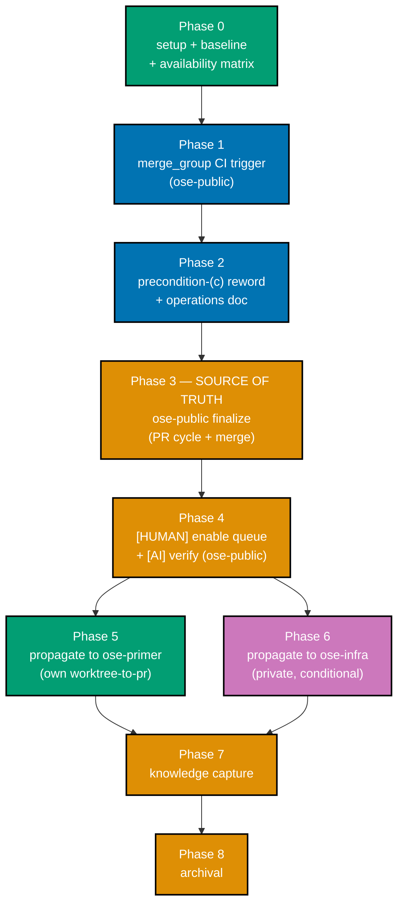

# Delivery Checklist — Merge-Queue Adoption

> **Legend** — `[AI]`: an agent performs the step (the default; unmarked steps are `[AI]`).
> `[HUMAN]`: only a human can do it (physical action, out-of-band approval, real-secret or
> privileged-credential handling). `[AI+HUMAN]`: agent prepares, human approves or finishes.
>
> **Delivery Mode**: `worktree-to-pr` (repo default). **`[AI]` merges by default** once the five
> hardened preconditions hold; the only `[HUMAN]` steps are the **repo-settings enablement toggles**
> (an agent must not change repository security/settings) and their explicit resume signals.
>
> **Inherited decisions** (from `worktree-to-pr-hardening`): **D7** — adopt a merge queue (now owned by
> this plan); **D10** — GitHub-native mechanism, **re-opened by MQ-1** (see below). **Plan-local forks
> MQ-1/MQ-2/MQ-3** are surfaced in
> [tech-docs.md §Open Decisions](./tech-docs.md#open-decisions-grill-at-execution-if-any-fork-is-live)
> and confirmed at execution, not pre-resolved.
>
> **MQ-1 gates real enablement, not phase execution**: live verification confirms all three repos are
> personal (User)-owned, and GitHub merge queue requires organization ownership. Phases 0–3
> (investigation + scaffolding) execute unconditionally — they land forward-looking, harmless
> preparation (a `merge_group` trigger is inert without an enabled queue — cited at
> [tech-docs.md §Rollback](./tech-docs.md#rollback)). **Phases 4–6 always execute
> too, but each branches on MQ-1's resolution**: real `[HUMAN]` enablement if MQ-1 unblocks that repo,
> otherwise a recorded deferral naming MQ-1 as the resume condition — see
> [tech-docs.md §MQ-1](./tech-docs.md#mq-1--github-merge-queue-is-unavailable-for-all-three-repos-today-organization-ownership-gate).
>
> **Three-repo parity scope** — Phases 0–4 deliver + enable in `ose-public` (the **source of truth**).
> Phases 5 (`ose-primer`) and 6 (`ose-infra`) propagate the identical scaffolding, **each as its own
> `worktree-to-pr` delivery**, with **enablement conditional per repo** on the Phase 0 availability
> matrix and, under today's facts, on MQ-1 resolving per repo. The two downstream phases are
> independent of each other.

## Worktree

Worktree path: `worktrees/merge-queue-adoption/` (gitignored; routed by the repo-local `WorktreeCreate`
hook). The `## Worktree` / `## Delivery Mode` sections describe the **`ose-public`** delivery; each
downstream phase provisions its own worktree in its own repo.

Optional manual pre-provisioning (run from repo root):

```bash
claude --worktree merge-queue-adoption
```

See [Worktree Path Convention](../../../repo-governance/conventions/structure/worktree-path.md) and
[Plans Organization Convention §Worktree Specification](../../../repo-governance/conventions/structure/plans.md#worktree-specification).

## Delivery Mode: worktree-to-pr

Work in `worktrees/merge-queue-adoption/`; open a draft PR against `main`; run the **PR-Review
Maker→Fixer Cycle** (3 sequential CI-gated cycles) before an `[AI]` merge once the five hardened
preconditions hold. Git-mechanical steps are `[AI]`. This plan **dogfoods** the queue: its own
downstream PRs merge through the queue once it is enabled. **Phase 0 opens no PR** — it is setup,
baseline, and availability investigation only, so it pushes no branch and merges nothing; the
earliest PR belongs to Phase 1
([§Phase 0 Opens No PR](../../../repo-governance/conventions/structure/plans.md#phase-0-opens-no-pr--the-earliest-pr-is-phase-1-hard-rule)).

## Dependency DAG



**ose-public (source of truth)**: Phases 0–2 are sequential in one worktree/one draft PR; Phase 3 runs
the review cycle + merge once; Phase 4 is the post-merge `[HUMAN]` enablement (the CI trigger must be on
`main` before the queue is enabled).

**Propagation (downstream)**: Phases 5 (`ose-primer`) and 6 (`ose-infra`) depend on Phase 4 and are
independent of each other — they may run in parallel. Enablement in each is **conditional** on the
Phase 0 matrix. Knowledge Capture (Phase 7) and Archival (Phase 8) run once, after all repos are done.

## Commit Guidelines

Applies to every phase's commits in every repo (`ose-public`, `ose-primer`, `ose-infra`):

- [ ] Commit changes thematically — group related changes into logically cohesive commits
- [ ] Follow Conventional Commits format: `<type>(<scope>): <description>`
- [ ] Split different domains/concerns into separate commits — e.g. the `merge_group` CI-trigger change
      (Phase 1), the precondition-(c) reword across the governance surfaces (Phase 2), and the new
      `merge-queue-operations.md` file (Phase 2) as separate commits where practical
- [ ] Do NOT bundle unrelated fixes into a single commit

---

## Phase 0: Setup, Baseline & Availability Investigation

> _Suggested executor: `repo-setup-manager` for baseline; `web-researcher` for availability._

- [ ] [AI] Add this plan to `plans/backlog/README.md`'s Planned Projects list (Standalone plans
      subsection) with a one-line description, so Phase 8's "remove the entry" step has a real target
      — acceptance: `grep -c "merge-queue-adoption" plans/backlog/README.md` returns 0 **before** this
      step and ≥ 1 **after** it
- [ ] [AI] Provision the `ose-public` worktree and initialize the toolchain: `npm install` then
      `npm run doctor -- --fix` — acceptance: both exit 0; `node_modules/` synchronized
- [ ] [AI] Confirm a clean baseline: `npx nx affected -t typecheck lint test:quick specs:coverage` is
      green on an unmodified tree and the markdown gate (`npm run lint:md`) passes — acceptance: all
      four Nx targets exit 0 (0 projects affected is an acceptable pass for typecheck/test:quick/
      specs:coverage on this docs+CI-config-only plan) and `npm run lint:md` exits 0; fix ALL failures
      found, not just those this plan would introduce (root cause orientation)
- [ ] [AI] Probe repository owner type first, per repo — the **primary** availability check:
      `gh api repos/<owner>/<repo> --jq '.owner.type'` (run for `ose-public`, `ose-primer`, and
      `ose-infra`) — acceptance: each returns `Organization` or `User`, recorded verbatim
- [ ] [AI] Investigate merge-queue availability via `web-researcher` (GitHub docs: merge queue
      availability by **owner type** — organization vs personal account, not visibility or plan) to
      corroborate the owner-type probe — acceptance: a cited answer confirming the owner-type gate
- [ ] [AI] Only if any repo's owner type is `Organization`: probe that repo via `gh api`
      (e.g. `gh api repos/<owner>/<repo>/rulesets`, and the branch protection for `main`) to confirm
      whether a merge-queue rule can actually be created — acceptance: an `available` / `unavailable` verdict
      recorded for that repo with its evidence (skip this step entirely for any `User`-owned repo — a
      ruleset probe cannot distinguish "not offered" from "not yet configured", so owner type alone is
      conclusive there)
- [ ] [AI] Record the **availability matrix** in `tech-docs.md` (the "Owner type (verified)" and
      "Availability (verified)" columns) and, if all three repos remain `User`-owned, confirm the MQ-1
      fork presents all four options (A/B/C/D) rather than a per-repo conditional deferral
      — acceptance: `grep -c "Unavailable" tech-docs.md` reflects a filled-in verdict for all three
      repos and the MQ-1 section lists options A through D
- [ ] [AI] Confirm forks MQ-1/MQ-2/MQ-3 with the maintainer (or record the recommended default taken)
      — acceptance: each fork carries a chosen option in `tech-docs.md`; Phases 4/5/6 each branch
      independently on MQ-1's resolution (real enablement if unblocked, a recorded deferral naming
      MQ-1 otherwise) — none of them is skipped outright

### Phase 0 Gate

> All checks below must pass before starting Phase 1.

- [ ] [AI] Toolchain green; clean baseline established (all four Nx targets + markdown gate)
- [ ] [AI] Owner-type probe run for all three repos; availability matrix filled in and web-cited +
      `gh api`-verified
- [ ] [AI] MQ-1/MQ-2/MQ-3 resolved (chosen or defaulted with a recorded rationale)

> **Pause Safety**: no repo state changed yet — only investigation. Safe to stop. To resume: re-read the
> availability matrix in `tech-docs.md`.

---

## Phase 1: `merge_group` CI Trigger (ose-public)

- [ ] [AI] Identify the workflow(s) whose checks are **required** for merge on `main` (MQ-2 → default:
      required-only) — acceptance: the target workflow file path(s) named, each confirmed to host a
      required check
- [ ] [AI] Add the `merge_group` event to the target workflow's `on:` block, reusing the existing
      `pull_request` job set (no new/divergent jobs) — acceptance:
      `grep -c "merge_group" <workflow>` ≥ 1 **after** the edit and `= 0` **before** it
- [ ] [AI] Run `actionlint` on the modified workflow — acceptance: `actionlint <workflow>` exits 0
- [ ] [AI] Confirm no other precondition/protocol behavior changed in this phase (trigger-only change)
      — acceptance: the diff touches only the workflow `on:` block

### Phase 1 Gate

> All checks below must pass before starting Phase 2.

- [ ] [AI] The gating workflow lists `merge_group` and `actionlint` passes
- [ ] [AI] The `merge_group` jobs are identical to the `pull_request` jobs (queued CI == branch CI)

> **Pause Safety**: the trigger is inert until the queue is enabled (Phase 4) — a `merge_group` event
> simply never fires yet ([cited at §Rollback](./tech-docs.md#rollback)). Safe to stop mid-PR. To
> resume: re-open the draft PR diff.

---

## Phase 2: Precondition-(c) Reword + Operations Doc (ose-public)

- [ ] [AI] Enumerate **every** governance surface that restates precondition (c) before editing — a
      single repo-wide `grep -rln` scoped to `repo-governance/` is **not sufficient** here: it is
      structurally blind to root-level `AGENTS.md`, and a single-line grep cannot match
      `conventions/structure/plans.md`'s restatement because it wraps across a line break. Use a
      per-file check against the hardcoded list below instead — acceptance: for each of
      `repo-governance/development/workflow/pr-merge-protocol.md`,
      `repo-governance/workflows/pr/pr-review-quality-gate.md`,
      `repo-governance/workflows/plan/plan-quality-gate.md`,
      `repo-governance/conventions/structure/plans.md`, and `AGENTS.md`, run
      `grep -c "up-to-date with the latest\|non-destructively up to date" <file>` and confirm it
      returns ≥ 1 for every file (`pr-merge-protocol.md` returns 2 via this token — §The Rule and
      §Agent Workflow §Before Merging — **plus two further restatements** that must be checked manually
      because their phrasing does not share the literal searched token: the compact worked example under
      §The Precondition Summary ("up to date (fast-forwarded, no rewrite)") **and** the `## Examples`
      PASS worked example ("(c) branch vs main: up to date")); the reword targets **all five**
      files (`pr-merge-protocol.md`'s four sites, plus one each in the other four), not just
      `pr-merge-protocol.md`
- [ ] [AI] Reword **precondition (c)** congruently in each enumerated file so it is satisfied by the
      queue's speculative merge where a queue is enabled, **retaining the manual non-destructive
      branch-up-to-date form as the explicit fallback** — acceptance: in every file, (c)'s text names
      both the queue path and the manual fallback; `grep -c "merge queue" <each file>` returns `0`
      **before** the reword and **≥ 1 after**, for each
- [ ] [AI] Update **both** worked-example `(c)` lines in `pr-merge-protocol.md` — the one under
      §The Precondition Summary (`(c) branch vs main:    up to date (fast-forwarded, no rewrite)`) **and**
      the one in the `## Examples` → PASS block (`(c) branch vs main: up to date`) — so each shows the
      queue-satisfied path alongside the manual-fallback path for (c) — acceptance: both example lines
      name the queue's speculative-merge satisfaction and the non-destructive-forward-update fallback,
      consistent with the reworded (c) prose above them; `grep -c "(c) branch vs main" pr-merge-protocol.md`
      = 2 and neither line is left in the old queue-unaware form
- [ ] [AI] Verify preconditions (a), (b), (d), (e) and the `(a)`–`(e)` lettering are **unchanged in
      every edited file** — acceptance: a `git diff` across all reworded files shows edits confined to
      the (c) block(s); `pr-merge-protocol.md`'s §Agent-Workflow copy and the normative
      `pr-review-quality-gate.md` copy remain congruent with §The Rule (no (a)-(d)-vs-(a)-(e) drift)
- [ ] [AI] Author `repo-governance/development/workflow/merge-queue-operations.md` covering the queue ×
      3-cycle review, the `[AI]`-automerge-via-queue path (`gh pr merge --auto` enqueues), and the
      1-PR↔1-worktree preservation — acceptance: the file exists and names all three interactions
- [ ] [AI] Cross-link the new operations doc from `pr-merge-protocol.md` and confirm every internal link
      resolves — acceptance: `rhino-cli md links validate` (scoped to the changed files) reports zero
      broken links

### Phase 2 Gate

> All checks below must pass before starting Phase 3.

- [ ] [AI] (c) reworded with a retained manual fallback **in every restatement surface**
      (`pr-merge-protocol.md` ×3, `pr-review-quality-gate.md`, `plan-quality-gate.md`, `plans.md`,
      `AGENTS.md`); (a)/(b)/(d)/(e) and lettering verbatim in each; no cross-surface
      (a)-(d)-vs-(a)-(e) drift
- [ ] [AI] Operations doc authored and cross-linked; markdown + links gates green

> **Pause Safety**: docs are self-consistent whether or not the queue is ever enabled (the fallback
> keeps (c) valid). Safe to stop. To resume: re-read the (c) block and the operations doc.

---

## Phase 3: ose-public Finalization — Source of Truth (PR-Review Cycle + Merge)

- [ ] [AI] Warm the Nx cache for affected targets, then run the local pre-push gates
      (`npx nx affected -t typecheck lint test:quick specs:coverage` + `npm run lint:md`) — acceptance:
      all green; fix ALL failures found, not just those caused by this plan's changes (root cause
      orientation)
- [ ] [AI] Open (or un-draft) the draft PR against `ose-public` `main`: `gh pr create --draft --base main`
      (or `gh pr ready` to un-draft an existing PR) — acceptance: PR exists, CI triggered
- [ ] [AI] Monitor the workflow(s) identified in Phase 1 ("workflow(s) whose checks are required for
      merge") for this PR's CI run — acceptance: the named workflow's run is visible via
      `gh pr checks <PR>` and reaches a conclusion
- [ ] [AI] Run the **PR-Review Maker→Fixer Cycle** (3 sequential CI-gated cycles) — acceptance: 3 cycles
      complete; 0 CRITICAL + 0 HIGH outstanding
- [ ] [AI] Verify the five hardened merge preconditions (a)–(e) hold — acceptance: each precondition
      checked and recorded (note: (c) is still the **manual** form here, as the queue is not yet enabled
      in `ose-public`)
- [ ] [AI] Merge the PR (`[AI]` default actor once preconditions hold) — acceptance: PR merged to
      `ose-public` `main`; CI green; the `merge_group` trigger is now on `main`

### Phase 3 Gate

> All checks below must pass before starting Phase 4.

- [ ] [AI] PR merged to `ose-public` `main`; post-merge CI green
- [ ] [AI] `main` now carries the `merge_group` trigger + the (c) reword + the operations doc

> **Pause Safety**: the change set is either merged to `main` or green-and-ready on the draft PR. Safe to
> stop between cycles (CI-gated) and safe to stop after merge (Phase 4 is an independent follow-on that
> branches on MQ-1 — see the header note). To resume: re-check `gh pr checks <PR>`, or (post-merge)
> start Phase 4.

---

## Phase 4: Enable the Queue in ose-public (`[HUMAN]` toggle if unblocked, else record the MQ-1 deferral)

> **Branches on MQ-1**, not on the original "expected: yes, public repo" assumption. Live verification
> (Phase 0) confirms `ose-public` is personal (User)-owned; GitHub merge queue requires organization
> ownership. This phase's actual enablement work only runs if MQ-1 resolves to a state where
> `ose-public` has a queue to enable (Option A once an org migration lands, or Option B once a
> `web-researcher` pass confirms the chosen third-party queue's setup path — the runbook below is
> GitHub-native and would need adapting to that vendor's flow under Option B). Under MQ-1 Option C or D,
> or while MQ-1 remains unresolved, this phase branches to recording a deferral instead — see
> [tech-docs.md §MQ-1](./tech-docs.md#mq-1--github-merge-queue-is-unavailable-for-all-three-repos-today-organization-ownership-gate).

- [ ] [AI] **Branch on MQ-1's resolution**: if MQ-1 resolved to a state where `ose-public` has an
      enablable queue (Option A org migration complete, or Option B vendor confirmed), prepare the
      exact enablement runbook — the branch-protection-rule / ruleset path targeting `main` with
      **"Require merge queue"** checked, plus MQ-3 batch settings; **otherwise** (Option C, Option D, or
      unresolved) write the **deferral** into `merge-queue-operations.md` naming MQ-1 as the resume
      condition — acceptance: exactly one of {runbook prepared, deferral recorded} is present (an agent
      does **not** apply any settings itself either way)
- [ ] [HUMAN] _(only if a runbook was prepared)_ Enable the merge queue in `ose-public` repository
      settings per the runbook — an agent must not change repo settings
      — handoff: the agent surfaces the runbook and stops; **resume signal**: the human confirms
      "ose-public merge queue enabled"
- [ ] [AI] _(only if a runbook was prepared)_ Verify the queue is active via `gh api` (the
      ruleset/branch-protection reports the merge-queue requirement on `main`); **else** confirm the
      deferral names MQ-1 as the limitation and the resume condition — acceptance: the `gh api` response
      shows the merge-queue rule present and required, **or** a complete deferral is recorded
- [ ] [AI] _(only if enabled)_ Smoke-check the `[AI]`-automerge-via-queue path on a trivial no-op PR (or
      the next real PR): `gh pr merge --auto` enqueues rather than direct-merges — acceptance: the PR
      enters the queue and lands only after speculative CI passes; skip this step if this repo's queue
      was not enabled

### Phase 4 Gate

> All checks below must pass before starting Phase 5.

- [ ] [AI] `ose-public` queue **either** confirmed enabled via `gh api` **or** a written deferral naming
      MQ-1 is present in `merge-queue-operations.md`
- [ ] [AI] _(only if enabled)_ `[AI]` automerge verified to enqueue (not bypass) the queue

> **Pause Safety**: whichever branch was taken (enabled, or deferred-pending-MQ-1) is idempotent and
> reversible; the fallback (c) still governs either way. Safe to stop. To resume: re-check MQ-1's
> resolution in `tech-docs.md`, then re-run the `gh api` verification if a runbook was prepared.

---

## Phase 5: Propagate to ose-primer (own worktree-to-pr)

> Depends on Phase 4; **independent of Phase 6** — may run in parallel. A **separate `worktree-to-pr`
> delivery in the `ose-primer` repo**. **Re-verify the bare-repo topology at execution time** (see
> [tech-docs.md §Bare-repo topology caveat](./tech-docs.md#bare-repo-topology-caveat-re-verify-at-execution-time)).
> The scaffolding sub-steps land regardless of MQ-1 (three-repo parity of the _documents_ holds either
> way); the enablement sub-steps branch on MQ-1 exactly as Phase 4 does.

- [ ] [AI] Re-verify `ose-primer` topology (`git -C <ose-primer> rev-parse --is-bare-repository`) and
      select the matching git method — acceptance: topology confirmed; method selected
- [ ] [AI] Provision a worktree from the latest `origin/main` of `ose-primer`; `npm install` then
      `npm run doctor -- --fix` — acceptance: both exit 0
- [ ] [AI] Port the identical scaffolding landed in `ose-public` Phase 1–2 (the `merge_group` trigger on
      the per-repo gating workflow, the precondition-(c) reword, the operations doc) into `ose-primer`
      — acceptance: the doc diff matches `ose-public`; the workflow trigger is added to `ose-primer`'s
      own gating workflow; no rhino-cli files touched
- [ ] [AI] Run local gates: `npx nx affected -t typecheck lint test:quick specs:coverage` +
      `npm run lint:md` + `actionlint` on the modified workflow — acceptance: all green; fix ALL
      failures found, not just those caused by this plan's changes
- [ ] [AI] Open a draft PR against `ose-primer` `main`: `gh pr create --draft --base main` — acceptance:
      PR exists, CI triggered
- [ ] [AI] Monitor `ose-primer`'s own gating workflow (the one just ported/modified above) for this PR's
      CI run — acceptance: the named workflow's run is visible via `gh pr checks <PR>` and reaches a
      conclusion
- [ ] [AI] Run the PR-Review Maker→Fixer Cycle (3 sequential CI-gated cycles) — acceptance: 3 cycles
      complete; 0 CRITICAL + 0 HIGH outstanding
- [ ] [AI] Merge the PR once the five preconditions hold (`[AI]` default actor) — acceptance:
      `ose-primer` PR merged to its `main`; CI green
- [ ] [AI] **Branch on MQ-1's resolution**: if MQ-1 resolved to a state where `ose-primer` has an
      enablable queue, prepare the `ose-primer` enablement runbook; **otherwise** write the deferral
      into `ose-primer`'s operations doc naming MQ-1 as the resume condition — acceptance: exactly one
      of {runbook prepared, deferral recorded} is present
- [ ] [HUMAN] _(only if a runbook was prepared)_ Enable the merge queue in `ose-primer` settings per the
      runbook — an agent must not change repo settings — **resume signal**: the human confirms
      "ose-primer merge queue enabled"
- [ ] [AI] _(only if a runbook was prepared)_ Verify via `gh api` that `ose-primer`'s queue is active;
      **else** confirm the deferral names MQ-1 and the resume condition — acceptance: the rule is
      present and required, **or** a complete deferral is recorded

### Phase 5 Gate

> All checks below must pass before starting Phase 7 (jointly with Phase 6).

- [ ] [AI] `ose-primer` carries the identical scaffolding (no rhino-cli boundary crossed)
- [ ] [AI] `ose-primer` PR merged; queue **either** confirmed enabled via `gh api` **or** a written
      deferral naming MQ-1 is present

> **Pause Safety**: `ose-primer` is either fully propagated-and-enabled or propagated-and-deferred, or
> green-and-ready on its PR; `ose-public` is unaffected. Safe to stop. To resume: re-check the
> `ose-primer` PR / `gh api` state.

---

## Phase 6: Propagate to ose-infra (own worktree-to-pr, private — conditional enablement)

> Depends on Phase 4; **independent of Phase 5**. A **separate `worktree-to-pr` delivery in the private
> `ose-infra` repo**. `ose-infra` carries the shared governance/CI scaffolding but never cross-routes
> infra-private content. **Re-verify the bare-repo topology at execution time.** The scaffolding
> sub-steps land regardless of MQ-1; the enablement sub-steps branch on MQ-1 exactly as Phase 4 does —
> `ose-infra`'s blocker is now the **same** organization-ownership gate as `ose-public`/`ose-primer`,
> not a separate private-repo plan-tier limitation.

- [ ] [AI] Re-verify `ose-infra` topology and select the matching git method — acceptance: confirmed
- [ ] [AI] Provision a worktree from `origin/main`; `npm install` then `npm run doctor -- --fix`
      — acceptance: both exit 0
- [ ] [AI] Port the identical scaffolding (trigger + (c) reword + operations doc) into `ose-infra`,
      keeping all infra-private content untouched and never cross-routed — acceptance: doc diff matches
      `ose-public`; no infra-private material altered; no rhino-cli files touched
- [ ] [AI] Run local gates: `npx nx affected -t typecheck lint test:quick specs:coverage` +
      `npm run lint:md` + `actionlint` on the modified workflow — acceptance: all green; fix ALL
      failures found, not just those caused by this plan's changes
- [ ] [AI] Open a draft PR against `ose-infra` `main`: `gh pr create --draft --base main` — acceptance:
      PR exists, CI triggered
- [ ] [AI] Monitor `ose-infra`'s own gating workflow (the one just ported/modified above), including its
      self-hosted-runner jobs, for this PR's CI run — acceptance: the named workflow's run is visible
      via `gh pr checks <PR>` and reaches a conclusion
- [ ] [AI] Run the PR-Review Maker→Fixer Cycle (3 sequential CI-gated cycles) — acceptance: 3 cycles
      complete; 0 CRITICAL + 0 HIGH outstanding
- [ ] [AI] Merge the PR once the five preconditions hold (`[AI]` default actor) — acceptance:
      `ose-infra` PR merged to its `main`; CI green
- [ ] [AI] **Branch on MQ-1's resolution**: if MQ-1 resolved to a state where `ose-infra` has an
      enablable queue (Option A org migration complete, or Option B vendor confirmed), prepare the
      enablement runbook; **otherwise** (Option C, Option D, or unresolved) write the **conditional
      deferral** into `ose-infra`'s operations doc naming MQ-1 as the resume condition — acceptance:
      exactly one of {runbook prepared, deferral recorded} is present
- [ ] [HUMAN] _(only if MQ-1 unblocked this repo)_ Enable the queue in `ose-infra` settings per the
      runbook — **resume signal**: the human confirms "ose-infra merge queue enabled"
- [ ] [AI] _(only if MQ-1 unblocked this repo)_ Verify via `gh api`; **else** confirm the deferral names
      MQ-1 as the limitation and the resume condition — acceptance: queue confirmed enabled, **or** a
      complete deferral is recorded

### Phase 6 Gate

> All checks below must pass before starting Phase 7 (jointly with Phase 5).

- [ ] [AI] `ose-infra` carries the identical scaffolding (no rhino-cli boundary crossed; no
      infra-private content altered)
- [ ] [AI] `ose-infra` PR merged; queue **either** confirmed enabled via `gh api` **or** a written
      conditional deferral naming MQ-1 is present

> **Pause Safety**: `ose-infra` is propagated-and-(enabled|deferred) or green-and-ready on its PR;
> `ose-public`/`ose-primer` unaffected. Safe to stop. To resume: re-check the `ose-infra` PR /
> deferral state.

---

## Phase 7: Knowledge Capture

> _Triage every surviving `learnings.md` entry before archival. See the
> [Knowledge Capture Convention](../../../repo-governance/development/quality/knowledge-capture.md)._

- [ ] [AI] Apply the litmus test to every `learnings.md` entry — keep only if a durable surface would
      catch it automatically next time; discard the rest with a one-line reason — acceptance: every
      entry has a route or a discard reason
- [ ] [AI] Apply the **secret/sensitivity gate** — sanitize any secret/token/private hostname to a
      `<placeholder>`, or discard if unsanitizable — acceptance: `learnings.md` contains no raw secret
- [ ] [AI] Apply the **repo-relevance gate** — infra-private content stays in `ose-infra` only; never
      cross-route it here — acceptance: no infra-private content in routed output
- [ ] [AI] Route each surviving learning to exactly one durable home (non-code homes inline or as a
      `plans/backlog/` follow-up; code homes ALWAYS a separate backlog plan) — acceptance: every entry
      records its terminal routing state
- [ ] [AI] If nothing generalizable surfaced, record the explicit escape:
      `No generalizable learnings — <one-line reason>` — acceptance: `learnings.md` is never silently empty

### Phase 7 Gate

> All checks below must pass before starting Phase 8.

- [ ] [AI] Every `learnings.md` entry is terminal (routed inline, filed as backlog, or discarded), or
      the explicit "none" escape is present
- [ ] [AI] No code-homed learning landed inline in this plan's own commits/PR

> **Pause Safety**: `learnings.md` fully triaged (or explicitly empty). Safe to stop. To resume: re-read
> `learnings.md` and confirm every entry is terminal.

---

## Phase 8: Plan Archival

> **Documented exception to the archival-in-PR rule** — accepted, not re-derived on re-check: the
> [Archival-in-PR done-definition item](../../../repo-governance/workflows/plan/plan-execution.md#8-finalization-and-archival-sequential)
> requires the `git mv plans/... plans/done/...` step to land **inside the delivering PR itself**, not
> as a separate post-merge commit. This plan deliberately deviates from that default: it spans phases
> that structurally must follow the `ose-public` merge — post-merge enablement (Phase 4) and cross-repo
> propagation (Phases 5–6) cannot happen before Phase 3 merges, since the `merge_group` trigger must be
> on `main` first — so there is no single delivering PR the archival move could fold into. Archival
> instead lands in its own small follow-up commit/PR once all phases are genuinely complete (each of
> Phases 4/5/6 either enabled or carrying a recorded MQ-1 deferral), consistent with the DAG's "cleanup
> is the terminal node" pattern [Repo-grounded — AGENTS.md §Agent Workflow Orchestration]. This carve-out
> is the accepted resolution for this plan; a future check against the archival-in-PR rule should treat
> this note as the answer, not re-flag the deferred archival as a violation.

- [ ] [AI] Verify ALL delivery checklist items are ticked (conditional Phase 4/5/6 enablement counts as
      done when a deferral naming MQ-1 is recorded instead)
- [ ] [AI] Verify all three repos delivered: `ose-public` (Phase 3), `ose-primer` (Phase 5), and
      `ose-infra` (Phase 6) each merged the identical scaffolding to their respective `main`; enablement
      recorded (enabled or deferred-pending-MQ-1) for all three
- [ ] [AI] Verify the Knowledge Capture phase is complete (every `learnings.md` entry terminal or the
      "none" escape present; both safety gates applied)
- [ ] [AI] Verify ALL quality gates pass (local + CI) and the PRs merged
- [ ] [AI] Move and date-stamp: `git mv plans/in-progress/merge-queue-adoption plans/done/YYYY-MM-DD__merge-queue-adoption`
      using today's date — acceptance: folder relocated under `plans/done/` with a date prefix
- [ ] [AI] Update `plans/backlog/README.md` (remove the entry) and, if it passed through `in-progress`,
      `plans/in-progress/README.md`
- [ ] [AI] Update `plans/done/README.md` — add the plan entry with completion date
- [ ] [AI] Update any other READMEs referencing this plan (including `worktree-to-pr-hardening`'s
      deferral pointer)
- [ ] [AI] Commit the archival: `chore(plans): move merge-queue-adoption to done`

### Phase 8 Gate

> All checks below must pass to consider the plan fully delivered and archived.

- [ ] [AI] Every delivery checklist item across all nine phases (Phase 0 through Phase 8) is ticked, with
      each of Phases 4/5/6 recorded as either enabled or carrying an explicit MQ-1 deferral
- [ ] [AI] All three repos (`ose-public`, `ose-primer`, `ose-infra`) merged the identical CI-trigger +
      protocol/doc scaffolding to their respective `main`
- [ ] [AI] Knowledge Capture (Phase 7) is complete — every `learnings.md` entry terminal or the explicit
      "none" escape recorded
- [ ] [AI] The plan folder is relocated to `plans/done/YYYY-MM-DD__merge-queue-adoption/` and every index
      README referencing it (`plans/backlog/README.md`, `plans/done/README.md`, and the
      `worktree-to-pr-hardening` deferral pointer) is updated

> **Pause Safety**: archival is a pure move + index update — safe to stop at any point. The plan's
> substantive change set is already merged across all repos before this phase runs, so an interrupted
> archival leaves no half-delivered work. To resume: re-check whether the folder has moved to
> `plans/done/` and whether the index READMEs list it.

<!-- -->

> **Note**: This plan starts in `plans/backlog/`. When work begins it moves to `plans/in-progress/`
> (pure move, no date prefix) per the [Plans Organization Convention](../../../repo-governance/conventions/structure/plans.md);
> the date prefix is added only at this archival step.
