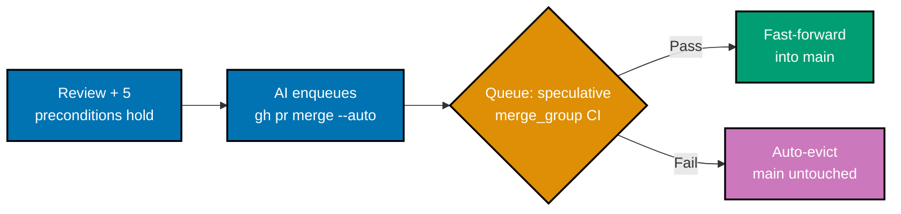
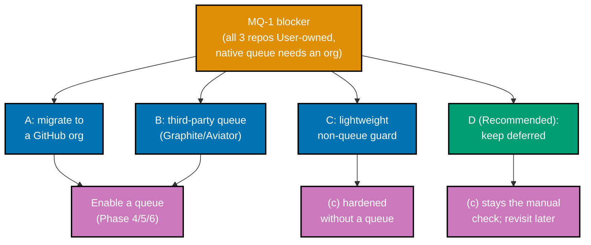

# Technical Design — Merge-Queue Adoption

## Provenance

This plan carries forward the merge-queue research that was authored inside the PR reviewer-discipline
hardening work (see the
[PR reviewer-discipline convention](../../../repo-governance/development/quality/pr-review-disciplines.md)) as decisions **D7** (adopt vs
defer) and **D10** (mechanism), then **removed from that plan's scope** on 2026-07-23 when the
maintainer reported no merge-queue toggle in the repo's branch settings. All web-cited claims below
**SHOULD be re-verified via `web-researcher`** before execution, per the
[Plan Anti-Hallucination Convention](../../../repo-governance/development/quality/plan-anti-hallucination.md#web-research-delegation-lower-threshold-for-plans).

## What a merge queue does (and why it fits precondition (c))

The [PR Merge Protocol](../../../repo-governance/development/workflow/pr-merge-protocol.md) requires
**five hardened preconditions** (a)–(e) before any merge. **Precondition (c)** is "the branch is
**non-destructively up to date** with the latest `origin/main` at merge time." Under **concurrent**
`worktree-to-pr` merges, a static per-PR check cannot guarantee (c): PR-A and PR-B are each green
against base `X`; A merges → `main` is now `X+A`; B is silently stale against `X+A` and may carry a
semantic (not textual) conflict that no per-PR check saw.

A **merge queue** enforces (c) structurally:

1. A ready PR is **added to the queue** rather than merged directly.
2. The queue builds a **speculative merge** — the PR rebased/merged onto the current queue head — and
   runs CI on **that** artifact (the GitHub `merge_group` event).
3. If the speculative CI **passes**, the PR fast-forwards into `main`; if it **fails**, the PR is
   **auto-evicted** and `main` is untouched.
4. Each PR is still an **independent merge point** — the queue orders them but does not batch their
   identities — so the strict **1-PR ↔ 1-worktree** model is preserved.

This is precisely "(c) holds under concurrency": every PR is CI-validated against the exact `main` it
will land on, in order.



The 3-cycle PR-Review Maker→Fixer Cycle and the five hardened preconditions gate entry to the queue;
the queue itself is a pure **integration** step, never a review step. **This whole pipeline is
conditional on MQ-1 unlocking a queue at all** — under today's facts (all three repos User-owned), it
does not run anywhere yet.

## Availability matrix (Phase 0 — investigate, do not assume)

Merge-queue availability is **not universal**, and the gate is **repository owner type**
(organization vs personal User account) — **not** repository visibility or account plan tier, as an
earlier version of this document assumed:

> "Any team that is part of a **managed organization** with public repositories and GitHub Enterprise
> Cloud users will be able to enable this feature on their respective repository."
> — [GitHub Blog: "GitHub Merge Queue is generally available"](https://github.blog/news-insights/product-news/github-merge-queue-is-generally-available/)
> [Web-cited, accessed 2026-07-23]

A second, independent source states the same constraint explicitly: pull request merge queues are
available in any public repository owned by an organization, or in private repositories owned by
organizations using GitHub Enterprise Cloud — merge queues are **not** available for repositories
owned by personal user accounts, regardless of plan tier
([GitHub Community Discussion #51483](https://github.com/orgs/community/discussions/51483)
[Web-cited, accessed 2026-07-23]).

| Repo         | Owner type (verified)                                            | Availability (verified)                  | Verify at execution                                                                    |
| ------------ | ---------------------------------------------------------------- | ---------------------------------------- | -------------------------------------------------------------------------------------- |
| `ose-public` | `User` (`gh api repos/wahidyankf/ose-public --jq '.owner.type'`) | **Unavailable — personal-account-owned** | Re-run the `.owner.type` probe; re-check only if ownership migrates to an org          |
| `ose-primer` | `User` (`gh api repos/wahidyankf/ose-primer --jq '.owner.type'`) | **Unavailable — personal-account-owned** | Re-run the `.owner.type` probe; re-check only if ownership migrates to an org          |
| `ose-infra`  | `User` (`gh api repos/wahidyankf/ose-infra --jq '.owner.type'`)  | **Unavailable — personal-account-owned** | Re-run the `.owner.type` probe; private visibility is **not** the limiting factor here |

[Repo-grounded — verified 2026-07-23, all three `gh api` calls returned `User`]

Phase 0 **records the actual matrix** by running the `.owner.type` probe as the **primary** check
(before any ruleset/branch-protection probe, since a ruleset probe cannot distinguish "no queue
because not offered" from "no queue because not yet configured"). The maintainer's original "can't
find the setting" observation is **fully explained** by owner type: the feature is not offered to
personal-account repos at all, so there was no classic-branch-protection-vs-rulesets UI confusion to
resolve — the setting genuinely does not exist for these repos today. Because all three repos share
the identical `User` owner type, this is **one shared blocker**, not three independent per-repo gaps —
see **decision MQ-1** below.

> **Where the toggle lives** (for the `[HUMAN]` runbook, **conditional on MQ-1 unlocking availability**
> for at least one repo): GitHub merge queue is enabled via a **branch protection rule** or a
> **repository ruleset** targeting `main`, with **"Require merge queue"** checked. It is **not** a
> top-level repo setting — it hangs off the branch/ruleset protection for the target branch. This
> section remains accurate only if MQ-1 resolves to organization ownership (Option A); re-verify the
> exact UI path via `web-researcher` at execution time regardless.

## Mechanism decision (carried from D10 — GitHub-native; **re-opened by MQ-1**)

> **This decision is now entangled with MQ-1.** D10 chose GitHub-native merge queue when mechanism was
> assumed to be the only open question. It turns out GitHub-native merge queue is **itself gated on
> organization ownership** — the exact blocker MQ-1 exists to resolve. If MQ-1 resolves to **Option A**
> (migrate to an org), D10's GitHub-native choice still holds. If MQ-1 resolves to **Option B**
> (third-party queue), the table below becomes live again and Graphite/Aviator move from "alternatives
> only" to the actual candidate.

| Mechanism                        | Fit                                                                                                                                                                                                                                                                                                                                                                                                                                                                                                                                                                                                                          | Trade                                                                |
| -------------------------------- | ---------------------------------------------------------------------------------------------------------------------------------------------------------------------------------------------------------------------------------------------------------------------------------------------------------------------------------------------------------------------------------------------------------------------------------------------------------------------------------------------------------------------------------------------------------------------------------------------------------------------------- | -------------------------------------------------------------------- |
| **GitHub-native** _(D10 choice)_ | Speculative `merge_group` CI, FIFO, auto-eviction; the repo already uses `gh`/GitHub, so no new vendor; no third-party trust surface. **Requires organization ownership** — blocked today, same as this plan's core premise.                                                                                                                                                                                                                                                                                                                                                                                                 | Less sophisticated batching than stack-aware queues                  |
| **Graphite stack-aware queue**   | CI once on the stack head, binary-search failure isolation, each PR still an independent merge point. Ramp Engineering reported a "74% decrease in median time between merges, with engineers merging PRs up to 3x faster" after adopting it — [Graphite Blog: "How we built the first stack-aware merge queue"](https://graphite.com/blog/the-first-stack-aware-merge-queue) [Web-cited, accessed 2026-07-23]. **Does not require GitHub organization ownership** [Unverified — re-verify via `web-researcher` before choosing MQ-1 Option B; not independently confirmed for personal-account repos during this fix pass]. | Adds a third-party vendor dependency + trust surface                 |
| **Aviator parallel queues**      | Strong monorepo support, parallel lanes                                                                                                                                                                                                                                                                                                                                                                                                                                                                                                                                                                                      | Another vendor + more setup; ownership-model requirements unverified |

**GitHub-native** remains D10's choice **conditional on MQ-1 resolving to organization ownership**
(Option A). If MQ-1 instead resolves to a third-party queue (Option B), this table is the starting
point for re-deciding mechanism — Graphite is the stronger-evidenced candidate pending the ownership-
requirement re-verification noted above. Either native or stack-aware keeps each PR an independent
merge point.

## What this plan changes

1. **CI trigger** — add `merge_group` to the `on:` of the workflow(s) that must gate the merge (the
   same workflow(s) that run the required `pull_request` checks). The `merge_group` jobs **reuse the
   existing `pull_request` job set** so queued CI == branch CI. `[AI]` YAML change; `actionlint`-clean.

   ```yaml
   on:
     pull_request:
     merge_group: # speculative-merge CI for the queue
   ```

2. **Precondition (c) reword — across every governance file that restates it** — `[AI]` doc change. (c)
   becomes **satisfiable by the queue's speculative merge** where a queue is enabled, and **retains the
   manual non-destructive branch-up-to-date form as the fallback** for branches/repos without a queue.
   The (a)–(e) lettering and preconditions (a), (b), (d), (e) stay **verbatim**. Critically, precondition
   (c) is **restated in multiple governance surfaces that must stay congruent** — editing only
   `pr-merge-protocol.md` would recreate the exact (a)-(d)-vs-(a)-(e) drift those docs explicitly warn
   against. The reword must land congruently in **all** of: `pr-merge-protocol.md` (which states (c)
   **four times** — §The Rule, §Agent Workflow §Before Merging, the illustrative example under
   §The Precondition Summary, and the `## Examples` PASS worked example); **`pr-review-quality-gate.md`** — the file `pr-merge-protocol.md` names
   as the **normative source** of the preconditions, and where `pr-review-synthesis-maker`/`pr-review-fixer`
   actually read them; `plan-quality-gate.md`; `plans.md` §Delivery Mode; and **`AGENTS.md` §Delivery
   Mode** (repo root) — the same (c) restatement, on a single unwrapped line, a site the original
   enumeration omitted despite it being a root-level surface every agent reads. All five keep (a), (b),
   (d), (e) verbatim. `repo-governance/development/workflow/README.md`'s one-line index blurb also
   contains the phrase and is matched by the Task-1 grep in `delivery.md` Phase 2, but it is a catalog
   summary of `pr-merge-protocol.md`'s content — never itself read normatively by any agent — so it is
   **excluded** from the reword set; its wording is expected to drift briefly and gets caught by the
   next `repo-rules-checker` pass, not by this plan.

3. **Merge-queue operations doc** — `[AI]`. Covers three interactions:
   - **× 3-cycle review** — the queue runs **after** the PR-Review Maker→Fixer Cycle completes and the
     five preconditions hold; the queue is the _integration_ step, not a review step.
   - **× `[AI]` automerge** — `[AI]` remains the default merge actor; with a queue, "merge" means
     **add to queue** (`gh pr merge --auto --squash` enqueues rather than merging directly when a queue
     guards the branch). The doc states this explicitly so the `[AI]`-merges-by-default posture keeps
     working.
   - **× 1-PR↔1-worktree** — each PR keeps its own worktree and its own queue entry; the queue orders,
     it does not merge identities.

4. **`[HUMAN]` enablement runbook** — the exact branch-protection/ruleset toggle per repo. An agent
   **prepares** the runbook and **verifies afterward** via `gh api`; a human performs the toggle. Agents
   must not change repository security/settings.

## The `[AI]`-automerge-via-queue interaction (the subtle part)

Today `[AI]` automerge means: preconditions hold → merge the PR. With a queue guarding `main`, a direct
merge is **rejected by branch protection**; the correct action is to **enqueue**. `gh pr merge --auto`
adds the PR to the queue and lets GitHub merge it once the speculative CI passes
[Unverified — re-verify via `web-researcher` / `gh --help` at execution; independent reports (e.g.
`cli/cli#5653`, "`gh pr merge --auto` does not work with merge queues") suggest this behavior is not
uniformly reliable across `gh` CLI versions/configurations]. The operations doc must make this the
documented `[AI]` path so automation does not fight the queue, and Phase 4 includes a smoke-check of
this exact behavior before relying on it. This plan **dogfoods** it: its own `ose-primer`/`ose-infra`
propagation PRs merge through the queue once enabled — **conditional on MQ-1 unlocking a queue at
all** (see [§Open Decisions — MQ-1](#mq-1--github-merge-queue-is-unavailable-for-all-three-repos-today-organization-ownership-gate)).

## rhino-cli byte-identity note

This plan touches **no `apps/rhino-cli` code and none of its specs** — only `.github/workflows/` CI
config and `repo-governance/` docs. The [SDLC Gate Standard's rhino-cli byte-identity boundary](../../../docs/reference/sdlc-gate-standard.md#rhino-cli-byte-identity-boundary)
is therefore **not engaged**. Note that `.github/workflows/` content **legitimately differs per repo**
(e.g. `ose-infra` carries the self-hosted runner stack), so the `merge_group` trigger is added
**per-repo**, not byte-copied.

## Bare-repo topology caveat (re-verify at execution time)

`ose-primer` and `ose-infra` have historically been **BARE repos with worktrees**
[Unverified — re-verify via `git -C <repo> rev-parse --is-bare-repository` at execution], while
`ose-public` is a normal working tree. This topology **changes over time and MUST be re-verified** (`git -C <repo> rev-parse --is-bare-repository`) before any git op in those repos; use the
bare-repo method (`-c core.bare=false --work-tree=…`, or `GIT_DIR`/`GIT_WORK_TREE` for tooling) when it
holds.

## Risks

| Risk                                                                                | Impact                                   | Mitigation                                                                                            |
| ----------------------------------------------------------------------------------- | ---------------------------------------- | ----------------------------------------------------------------------------------------------------- |
| Merge queue unavailable for **all three repos** (personal-account-owned, confirmed) | Blocks all enablement, not just one repo | Phase 0 matrix leads with `.owner.type`; ship scaffolding anyway; MQ-1 records the fork + resume path |
| Agent changes repo security settings                                                | Guardrail violation                      | Enablement is `[HUMAN]`-only; agent preps runbook + `gh api`-verifies afterward                       |
| `merge_group` CI overloads self-hosted runners                                      | Slow/blocked integration                 | Queue serializes (fewer concurrent full-CI runs); reuse existing concurrency groups                   |
| `[AI]` automerge bypasses / fights the queue                                        | Merges stall or skip the gate            | Operations doc mandates `gh pr merge --auto` enqueue path; dogfooded on this plan's own PRs           |
| Queued CI job set drifts from branch CI                                             | False green/red in the queue             | `merge_group` reuses the `pull_request` jobs; `actionlint` gate on the trigger addition               |
| Parity drift (scaffolding in some repos only)                                       | Divergent merge gate                     | Each repo delivered via its own `worktree-to-pr` cycle from the merged `ose-public` source            |

## File Impact (targets)

- **Edit**: `.github/workflows/<gating-workflow>.yml` — add the `merge_group` trigger (per adopting
  repo; `_verify path before editing_`; `actionlint`-clean). `[AI]` YAML.
- **Edit (precondition-(c) reword, congruent across all restatement sites)** — queue-satisfiable +
  manual fallback; (a)–(e) lettering and (a)/(b)/(d)/(e) preserved verbatim in each. `[AI]` docs:
  - `repo-governance/development/workflow/pr-merge-protocol.md` — states (c) **four times** (§The
    Rule, §Agent Workflow §Before Merging, the illustrative example under §The Precondition
    Summary, and the `## Examples` PASS worked example); reword all four.
  - `repo-governance/workflows/pr/pr-review-quality-gate.md` §Hardened Merge Preconditions — the
    **normative** source `pr-merge-protocol.md` defers to; where the PR-review agents read (c).
  - `repo-governance/workflows/plan/plan-quality-gate.md` — its inline (a)-(e) restatement.
  - `repo-governance/conventions/structure/plans.md` §Delivery Mode — its inline (a)-(e) restatement.
  - `AGENTS.md` §Delivery Mode (repo root) — the same (c) restatement, on a single unwrapped line; a
    site the original enumeration omitted.
  - _Excluded_: `repo-governance/development/workflow/README.md`'s one-line index blurb — a catalog
    summary of `pr-merge-protocol.md`, never read normatively; left to drift briefly and caught by the
    next `repo-rules-checker` pass rather than reworded here.
- **New**: `repo-governance/development/workflow/merge-queue-operations.md` — the queue × review ×
  automerge × 1-PR↔1-worktree operations doc (`_New file_`; sibling reference:
  `pr-merge-protocol.md`). `[AI]` doc.
- **New (per repo, ephemeral)**: a `[HUMAN]` enablement runbook surfaced at execution (may live in the
  PR body or `local-temp/`, not necessarily committed).
- **No** `.claude/agents/` change, so **no** `npm run generate:bindings` step and **no** binding mirrors.

## Rollback

Every change in this plan is independently and cheaply reversible; nothing here is a one-way door.

- **`merge_group` CI trigger** (Phase 1): `git revert` the workflow-edit commit. The trigger becomes
  inert immediately — the `merge_group` event only fires when a pull request is added to a merge queue,
  which cannot happen unless a queue is configured on the branch, so the trigger carries zero functional
  risk even mid-rollout ([GitHub Actions — "Events that trigger workflows" §`merge_group`](https://docs.github.com/en/actions/using-workflows/events-that-trigger-workflows#merge_group)
  [Web-cited, accessed 2026-07-23 — re-verify at execution]). This is the canonical source for the
  "`merge_group` is inert without an enabled queue" statement repeated elsewhere in this plan.
- **Precondition-(c) reword** (Phase 2): `git revert` the `pr-merge-protocol.md` commit. This restores
  the pre-existing manual-only form of (c); no other precondition is touched by this plan, so a revert
  cannot regress (a), (b), (d), (e).
- **`merge-queue-operations.md`** (Phase 2, new file): if the mechanism is abandoned (e.g. MQ-1 resolves
  to Option C or D), delete the file in a follow-up commit and remove its cross-link from
  `pr-merge-protocol.md`; nothing else references it.
- **Queue enablement** (Phase 4/5/6, `[HUMAN]`): disabling the queue is the same `[HUMAN]`-only,
  idempotent settings toggle as enabling it (uncheck "Require merge queue" on the branch protection
  rule / ruleset). An agent verifies the disabled state afterward via the same `gh api` probe used to
  verify enablement. Disabling immediately restores the manual (c) fallback with no other side effects.

Rollback ordering has no dependency chain — each of the four items above can be reverted independently
and in any order, since (c)'s manual fallback is retained throughout rather than replaced.

## Open Decisions (grill at execution if any fork is live)

Format follows the [Grilling-With-Options Convention](../../../repo-governance/development/workflow/grilling-with-options.md).
The parent plan's D7 (adopt) and D10 (GitHub-native) are inherited as **decided**; the forks below are
specific to this plan and are **surfaced for confirmation at execution**, not pre-resolved.

### MQ-1 — GitHub merge queue is unavailable for all three repos today (organization-ownership gate)

This decision **supersedes the original MQ-1 framing** ("`ose-infra` if unavailable"). Live
verification shows the gate is **owner type**, not per-repo visibility/plan, so the fork applies to
**all three repos identically**, not just `ose-infra`. **This is the fork the maintainer must resolve
before any enablement work proceeds** — Phases 0-3 (investigation + scaffolding) can still land
regardless of the outcome; Phase 4 onward (enablement) cannot.



> Regardless of which branch is chosen, **Phases 0–3 (scaffolding) still land** and **Phase 4/5/6 each
> reach a terminal state** — real enablement under A/B, or a recorded MQ-1 deferral under C/D — so the
> delivery DAG never dead-ends on this fork.

- **A** — **Migrate the repos to a GitHub organization** to unlock the native merge queue, then adopt
  as originally planned (D10 GitHub-native). Trade-off: unlocks the real GitHub-native feature for all
  three repos at once; but it is a significant `[HUMAN]` ownership/infra decision (new billing entity,
  re-pointed remotes/CI credentials, possible visibility/permissions changes) — well outside a docs-CI
  plan's authority to decide or execute.
- **B** — **Adopt a third-party queue** (Graphite or Aviator) that operates on user-owned repos without
  requiring a GitHub org. Trade-off: unlocks queue behavior now, on the current ownership model; adds a
  third-party vendor + trust surface, and (per the Mechanism table above) the "works without an org"
  premise is itself `[Unverified]` pending a dedicated `web-researcher` pass before commitment.
- **C** — **Harden precondition (c) with a lightweight non-queue alternative** (e.g. an
  auto-rebase-onto-latest-`origin/main`-before-merge guard, or a serialize-merges convention) that
  needs no org and no third-party vendor. Trade-off: addresses this plan's actual business goal — (c)
  holding under concurrency — without either an ownership migration or a new vendor; weaker than a true
  queue (no speculative-merge CI, no auto-eviction) and would need its own design work not yet done.
- **D (Recommended)** — **Keep merge queue deferred (status quo)**: precondition (c) stays the manual
  branch-up-to-date check until/unless the ownership model changes for an unrelated reason. Trade-off:
  zero new risk or cost today; the concurrency-stale-merge exposure that motivated this plan (see
  [brd.md §Business Rationale](./brd.md#business-rationale-why-this-exists)) remains unaddressed until
  revisited. Recommended because it forces no `[HUMAN]` decision under time pressure from this plan and
  keeps Options A-C available to reconsider later with fresh information.
- **Other — type your own.** | **Chat about this.**

**This plan's own execution is blocked on this decision**: Phase 4 (enablement) cannot proceed under
Option D, is unblocked immediately under Option A once the org migration lands, requires a
`web-researcher` verification pass before Phase 4 under Option B, and requires new design work (a
follow-up plan) before Option C's guard can be built. See
[README.md §The Blocking Discovery](./README.md#the-blocking-discovery-why-this-is-its-own-plan).

### MQ-2 — Which workflow(s) get the `merge_group` trigger

- **A (Recommended)** — Only the workflow(s) whose checks are **required** for merge on `main`.
  Trade-off: minimal runner load; queued CI matches the required gate exactly.
- **B** — All CI workflows. Trade-off: maximal coverage; wasteful speculative runs of non-required jobs.
- **Other — type your own.** | **Chat about this.**

### MQ-3 — Batch size / queue tuning

- **A (Recommended)** — Start with **batch size 1** (strict serialization) for correctness, tune later.
  Trade-off: safest; lower throughput than batching.
- **B** — Enable batching from the start. Trade-off: higher throughput; harder failure isolation.
- **Other — type your own.** | **Chat about this.**
