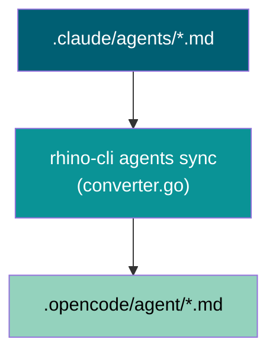

# Technical Documentation

## Current Architecture

### Claude Code → OpenCode Sync Pipeline



The sync pipeline transforms Claude frontmatter into OpenCode YAML. Model field handling
lives in `converter.go:ConvertModel()`:

```go
func ConvertModel(claudeModel string) string {
    model := strings.TrimSpace(claudeModel)
    switch model {
    case "sonnet", "opus":
        return "zai-coding-plan/glm-5.1"
    case "haiku":
        return "zai-coding-plan/glm-5-turbo"
    default:
        // Default to most capable model.
        // "inherit" is not a valid OpenCode value.
        return "zai-coding-plan/glm-5.1"
    }
}
```

**Key observation**: `"opus"` is already an explicit case — handled identically to
`"sonnet"`. Switching `repo-rules-maker` from omit to `model: sonnet` has zero impact on
OpenCode output (omit and sonnet both map to `glm-5.1`). The only change is in the source
Claude agent file and in the guarantee it provides.

### Model Tier Mapping (Full Picture)

| Claude Code alias | Claude Code model (April 2026)                     | OpenCode model ID             | GLM tier                 |
| ----------------- | -------------------------------------------------- | ----------------------------- | ------------------------ |
| `opus`            | `claude-opus-4-7` ($5/$25/MTok, 1M ctx)            | `zai-coding-plan/glm-5.1`     | 744B MoE, SWE-Bench 58.4 |
| `sonnet`          | `claude-sonnet-4-6` ($3/$15/MTok, 1M ctx)          | `zai-coding-plan/glm-5.1`     | same model               |
| `haiku`           | `claude-haiku-4-5-20251001` ($1/$5/MTok, 200k ctx) | `zai-coding-plan/glm-5-turbo` | purpose-built agentic    |
| `""` (omit)       | Inherits session model (tier-dependent)            | `zai-coding-plan/glm-5.1`     | same as opus/sonnet      |

**3-to-2 collapse**: Claude has three tiers; GLM (Z.ai Coding Plan) has two. `opus` and
`sonnet` collapse to the same GLM model because GLM-5.1 is the single top-tier option
(benchmarks ≈ Claude Opus 4.6, a prior-generation model, below current Opus 4.7 but
above Sonnet 4.6).

### ValidModels in rhino-cli

`apps/rhino-cli/internal/agents/types.go:ValidModels`:

```go
var ValidModels = map[string]bool{
    "":       true, // Empty is valid (inherits)
    "sonnet": true,
    "opus":   true,
    "haiku":  true,
}
```

All four values pass `validate:claude`. No code change needed.

### OpenCode Output Format

OpenCode agents use a different model field structure. After sync:

```yaml
# .opencode/agent/plan-maker.md (after sync — opus-tier agent with omitted model)
---
name: plan-maker
description: ...
model: zai-coding-plan/glm-5.1   # default — ConvertModel("") returns glm-5.1
tools:
  read: true
  write: true
  ...
---
```

## Changes Required

### Change 1: `governance/development/agents/model-selection.md`

**Section updates to apply**:

1. **Budget-Adaptive Inheritance block** — add after the Opus tier frontmatter example.
   Explain why omitting `model` is intentional (session inheritance adapts to user's
   account tier and token budget). Include account-tier table (Max/Team → Opus 4.7,
   Pro/Standard → Sonnet 4.6). Include warning: Do NOT add `model: opus`.

2. **Frontmatter example** — keep as omit (no `model` field). Surround with explanation
   that this is intentional budget-adaptive design.

3. **New section "OpenCode / GLM Equivalents"** — insert after "Tier Comparison Summary".
   Mapping table: omit/sonnet → `zai-coding-plan/glm-5.1`, haiku → `zai-coding-plan/glm-5-turbo`.
   3-to-2 tier collapse explanation. GLM-5.1 capability context.

4. **Model version table** — "Current Model Versions (April 2026)" table with Opus 4.7,
   Sonnet 4.6, Haiku 4.5-20251001; Haiku 3 retirement note (2026-04-19).

5. **Common Mistakes row** — "Adding `model: opus` to opus-tier agents" added. Problem:
   bypasses budget-adaptive inheritance. Correction: omit the field.

### Change 2: `CLAUDE.md`

**Plans Organization section** — add inline format description:

```markdown
**Default plan layout**: **five documents** — `README.md` (overview + navigation),
`brd.md` (business rationale), `prd.md` (product requirements + Gherkin acceptance
criteria), `tech-docs.md` (how), `delivery.md` (step-by-step checklist with `- [ ]`
items). Plan may collapse to single `README.md` only when trivially small (all content
≤ 1000 lines and condensed BRD + condensed PRD fit comfortably). See [Plans Organization
Convention](./governance/conventions/structure/plans.md) for full rules.
```

**Format Differences models row** — update:

```markdown
# BEFORE

- **Models**: Claude Code uses `sonnet`/`haiku` (or omits), OpenCode uses `zai-coding-plan/glm-5.1` (sonnet/opus/omitted), `zai-coding-plan/glm-5-turbo` (haiku)

# AFTER

- **Models**: Claude Code uses `sonnet`/`opus`/`haiku` (or omits for budget-adaptive inheritance); OpenCode uses `zai-coding-plan/glm-5.1` (opus/sonnet/omitted) and `zai-coding-plan/glm-5-turbo` (haiku). See [model-selection.md](./governance/development/agents/model-selection.md) for full tier mapping.
```

### Change 3: OpenCode re-sync

Run `npm run sync:claude-to-opencode` after all `.claude/agents/` changes. This is the
final step — it re-generates all `.opencode/agent/` files from updated sources. No manual
edits to `.opencode/agent/`.

## Validation Commands

```bash
# Validate Claude agent format
npm run validate:claude

# Validate sync consistency (Claude ↔ OpenCode match)
npm run validate:sync

# Dry-run sync (preview changes without writing)
npm run sync:dry-run

# Apply sync
npm run sync:claude-to-opencode

# rhino-cli unit tests (catch any fixture mismatches)
nx run rhino-cli:test:quick
```

## Risk Assessment

| Risk                                            | Likelihood | Impact | Mitigation                                    |
| ----------------------------------------------- | ---------- | ------ | --------------------------------------------- |
| rhino-cli tests have fixture with empty model   | Low        | Low    | Update fixture in test to use `model: sonnet` |
| A sub-agent silently gets wrong model today     | Medium     | Medium | This plan fixes it                            |
| Missed agent (still has empty model when wrong) | Low        | Low    | `validate:claude` + grep audit catches it     |
| OpenCode output different from expected         | Low        | Low    | `validate:sync` catches divergence            |

## Execution Context

This plan runs directly on `main` — no worktree needed (governance-only changes, no code).
`ose-primer` uses Trunk Based Development; direct commits to `main` are correct here.

## Dependencies

Tools required to execute the delivery plan:

- **Node.js 24.x + npm** — for `npm run validate:claude`, `npm run validate:sync`,
  `npm run sync:claude-to-opencode`. Managed by Volta; `npm install` installs the workspace.
- **Go toolchain** — required to build rhino-cli before any `npm run validate:*` or
  `npm run sync:*` script can run (these scripts call the rhino-cli binary). Install via
  `npm run doctor -- --fix`.
- **rhino-cli binary** — built from `apps/rhino-cli/` as part of `nx run rhino-cli:build`
  or implicitly by the npm scripts. `npm run doctor -- --fix` ensures Go is present.

**Setup sequence**:

```bash
npm install                  # install workspace deps
npm run doctor -- --fix      # converge Go + Node toolchains (required before validate/sync)
```

## Testing Strategy

Validation commands test that agent frontmatter parses correctly and that Claude↔OpenCode
sync is consistent:

- `npm run validate:claude` — parses every `.claude/agents/*.md` frontmatter; exit code 0
  means all model values are in `ValidModels` and no required fields are missing.
- `npm run validate:sync` — compares `.claude/agents/*.md` with `.opencode/agent/*.md`;
  exit code 0 means no drift between the two runtime configs.
- `nx run rhino-cli:test:quick` — runs rhino-cli unit tests including Gherkin BDD
  scenarios with fixture agents; catches fixture regressions when model values change.

**Pass criterion**: all three commands exit with code 0 and print zero error lines.

## Rollback

Each delivery phase has a corresponding commit. To revert:

- **Phase 1** (model-selection.md): `git revert <phase-1-sha>`
- **Phase 2** (CLAUDE.md): `git revert <phase-2-sha>`
- **Phase 3** (propagation): `git revert <phase-3-sha>`
- **Phase 4** (benchmark reference doc): `git revert <phase-4-sha>`
- **Phase 5** (agent tier correction): `git revert <phase-5-sha>`
- **Phase 6** (benchmark citation propagation): `git revert <phase-6-sha>`
- **Full rollback**: revert all commits in reverse order

No DB migrations, no infra changes, no compiled artifacts. A revert is safe at any phase
boundary — each phase commit is self-contained and reversible.

---

## Model Benchmark Data

Authoritative benchmark scores for all models used in this project. Every number below
is cited with source URL and date. Confidence levels: `[Verified]` = corroborated across
multiple independent sources; `[Self-reported]` = from vendor only, no independent
replication confirmed as of April 2026.

> **How to use**: These numbers inform tier assignments. SWE-bench Verified and GPQA
> Diamond are the most task-relevant benchmarks for coding agents. HumanEval is saturated
> at frontier level (90%+) and less discriminative.

### Claude Opus 4.7 (`claude-opus-4-7`)

**Primary source**: [Anthropic Models Overview](https://platform.claude.com/docs/en/about-claude/models/overview)
(official API docs, accessed 2026-04-19) ·
[Introducing Claude Opus 4.7](https://www.anthropic.com/news/claude-opus-4-7) (April 16, 2026)

| Benchmark          | Score                  | Confidence   | Source                                                          |
| ------------------ | ---------------------- | ------------ | --------------------------------------------------------------- |
| SWE-bench Verified | 87.6%                  | `[Verified]` | Third-party corroboration: VentureBeat, BenchLM.ai (2026-04-16) |
| SWE-bench Pro      | 64.3%                  | `[Verified]` | Official release post via VentureBeat (2026-04-16)              |
| GPQA Diamond       | 94.2%                  | `[Verified]` | Multiple aggregators citing official release (2026-04-16)       |
| CursorBench        | 70%                    | `[Verified]` | Official Anthropic release post (2026-04-16)                    |
| Context window     | 1M tokens              | —            | Official API docs (2026-04-19)                                  |
| Pricing            | $5/$25 per MTok in/out | —            | Official API docs (2026-04-19)                                  |

**Note**: System card PDF inaccessible at research time; numbers corroborated across
credible third-party outlets. Confirm against
[Claude Opus 4.7 System Card](https://www.anthropic.com/claude-opus-4-7-system-card) when accessible.

### Claude Sonnet 4.6 (`claude-sonnet-4-6`)

**Primary source**: [Anthropic Models Overview](https://platform.claude.com/docs/en/about-claude/models/overview) ·
[Introducing Claude Sonnet 4.6](https://www.anthropic.com/news/claude-sonnet-4-6) (2026-02-17) ·
[Claude Sonnet 4.6 System Card](https://www.anthropic.com/claude-sonnet-4-6-system-card)

| Benchmark              | Score                  | Confidence   | Source                                                             |
| ---------------------- | ---------------------- | ------------ | ------------------------------------------------------------------ |
| SWE-bench Verified     | 79.6%                  | `[Verified]` | Official release post (2026-02-17); 80.2% with prompt modification |
| OSWorld (computer use) | 72.5%                  | `[Verified]` | NxCode, Morph benchmarks citing Anthropic (2026-03-05)             |
| GPQA Diamond           | 89.9%                  | `[Verified]` | System card (10-trial avg, adaptive thinking, max effort)          |
| AIME 2025              | 95.6%                  | `[Verified]` | System card (10-trial avg, adaptive thinking, max effort)          |
| Context window         | 1M tokens              | —            | Official API docs (2026-04-19); beta                               |
| Pricing                | $3/$15 per MTok in/out | —            | Official API docs (2026-04-19)                                     |

### Claude Haiku 4.5 (`claude-haiku-4-5-20251001`)

**Primary source**: [Anthropic Models Overview](https://platform.claude.com/docs/en/about-claude/models/overview) ·
[Introducing Claude Haiku 4.5](https://www.anthropic.com/news/claude-haiku-4-5) (2025-10-15)

| Benchmark          | Score                 | Confidence             | Source                                                              |
| ------------------ | --------------------- | ---------------------- | ------------------------------------------------------------------- |
| SWE-bench Verified | 73.3%                 | `[Verified]`           | Official release post (2025-10-15); 50-trial avg, 128k think budget |
| GPQA Diamond       | 67.2%                 | `[Needs Verification]` | Artificial Analysis aggregator; not traced to system card           |
| AIME 2025          | 83.7%                 | `[Needs Verification]` | Aggregator-cited; primary source not confirmed                      |
| Context window     | 200k tokens           | —                      | Official API docs (2026-04-19)                                      |
| Pricing            | $1/$5 per MTok in/out | —                      | Official API docs (2026-04-19)                                      |

**Note**: GPQA/AIME figures circulate in aggregators but primary Haiku 4.5 system card
was not directly accessible. Treat `[Needs Verification]` scores as approximate until
confirmed.

### GLM-5.1 (`zai-coding-plan/glm-5.1`)

**Primary source**: [Z.ai GLM-5.1 release](https://officechai.com/ai/z-ai-glm-5-1-benchmarks-swe-bench-pro/) (OfficeChai, 2026-04-07) ·
[Awesome Agents review](https://awesomeagents.ai/reviews/review-glm-5-1/) (2026-04-17) ·
[WaveSpeedAI comparison](https://wavespeed.ai/blog/posts/glm-5-1-vs-claude-gpt-gemini-deepseek-llm-comparison/) (2026-03-30)

| Benchmark          | Score                       | Confidence        | Source                                                                  |
| ------------------ | --------------------------- | ----------------- | ----------------------------------------------------------------------- |
| SWE-bench Pro      | 58.4                        | `[Self-reported]` | Z.ai self-reported; no independent third-party replication (2026-04-17) |
| SWE-bench Verified | 77.8%                       | `[Self-reported]` | WaveSpeedAI citing Z.ai (2026-03-30)                                    |
| GPQA Diamond       | 86.2                        | `[Self-reported]` | OfficeChai citing Z.ai (2026-04-07)                                     |
| Arena.ai Code Elo  | 1530 (rank 3)               | `[Verified]`      | Arena.ai leaderboard (partial corroboration; 2026-04-17)                |
| Context window     | 200k tokens                 | —                 | Multiple sources (2026-04-07)                                           |
| Pricing            | $1.00/$3.20 per MTok in/out | —                 | OfficeChai (2026-04-07)                                                 |

**Critical flag**: As of 2026-04-17 "a fully independent evaluation on SWE-Bench Pro from
a third-party lab hasn't been published" (Awesome Agents review). SWE-bench Pro 58.4 is a
self-reported headline claim. Arena.ai Code Elo (rank 3) provides partial corroboration.

### GLM-5-turbo (`zai-coding-plan/glm-5-turbo`)

**Primary source**: [Z.ai GLM-5-turbo Developer Docs](https://docs.z.ai/guides/llm/glm-5-turbo) (official) ·
[OpenRouter GLM-5-turbo](https://openrouter.ai/z-ai/glm-5-turbo) (pricing)

| Benchmark                           | Score                       | Confidence        | Source                                                    |
| ----------------------------------- | --------------------------- | ----------------- | --------------------------------------------------------- |
| ZClawBench                          | 56.4                        | `[Self-reported]` | Proprietary Z.ai benchmark; no independent validation     |
| SWE-bench / GPQA / MMLU / HumanEval | N/A                         | —                 | **No standard benchmark scores published** for this model |
| Context window                      | 202k tokens                 | —                 | OpenRouter (2026-03-16)                                   |
| Pricing                             | $1.20/$4.00 per MTok in/out | —                 | OpenRouter (2026-03-16)                                   |

**Critical flag**: GLM-5-turbo has **no published scores on any standard academic
benchmark**. Its use as the OpenCode fast tier is a platform constraint (it's the only
alternative to GLM-5.1 in Z.ai Coding Plan), not a benchmark-validated choice. ZClawBench
is proprietary and unverifiable.

### Model Capability Summary (Coding-Agents Lens)

| Model             | SWE-bench Verified          | Tier relevance in this repo                                           |
| ----------------- | --------------------------- | --------------------------------------------------------------------- |
| Claude Opus 4.7   | 87.6% `[Verified]`          | Budget-adaptive inherit — Max/Team Premium sessions                   |
| Claude Sonnet 4.6 | 79.6% `[Verified]`          | Budget-adaptive inherit — Pro/Standard sessions; explicit sonnet-tier |
| Claude Haiku 4.5  | 73.3% `[Verified]`          | Explicit haiku-tier — deterministic/mechanical agents                 |
| GLM-5.1           | 77.8% `[Self-reported]`     | OpenCode equivalent for both opus- and sonnet-tier                    |
| GLM-5-turbo       | N/A (no standard benchmark) | OpenCode equivalent for haiku-tier                                    |

---

## Benchmark Reference Document Specification

**Target file**: `docs/reference/ai-model-benchmarks.md`

This document is the canonical benchmark reference for the project. It is created in
Phase 4 of delivery. Structure:

```
# AI Model Benchmarks Reference
(one-line description, last updated date)

## Purpose and Scope
(why this doc exists; links to model-selection.md)

## Benchmark Definitions
(SWE-bench Verified, SWE-bench Pro, GPQA Diamond, AIME, OSWorld — brief definitions
 and why each matters for coding agents)

## Claude Models (Anthropic)
### Claude Opus 4.7
### Claude Sonnet 4.6
### Claude Haiku 4.5
(per-model table: benchmark, score, confidence, source URL, date)
(pricing and context window)
(link to official system card)

## GLM Models (Z.ai Coding Plan / OpenCode)
### GLM-5.1
### GLM-5-turbo
(per-model table with confidence levels and self-reported caveats)
(official source URLs only)

## Model Selection Mapping
(cross-reference table linking to model-selection.md tiers)
(note: all benchmark citations in other docs link back to this file)

## Limitations and Caveats
(system card PDF inaccessibility; GLM-5.1 self-reported scores;
 GLM-5-turbo no standard benchmarks; accuracy-as-of date)

## Sources
(numbered reference list with full URLs and access dates)
```

**Citation format — path is relative to the referencing file's location**:

From `governance/development/agents/model-selection.md` (3 levels deep):

```markdown
[Score: 87.6% SWE-bench Verified](../../../docs/reference/ai-model-benchmarks.md#claude-opus-47)
(Source: Anthropic, April 2026)
```

From `.claude/agents/README.md` (2 levels deep):

```markdown
[Score: 87.6% SWE-bench Verified](../../docs/reference/ai-model-benchmarks.md#claude-opus-47)
(Source: Anthropic, April 2026)
```

Every benchmark claim in `model-selection.md` and `.claude/agents/README.md` MUST link to
this reference document. The reference document itself links to primary sources.

---

## Complete Agent Tier Mapping

All agents in `.claude/agents/` (excluding `README.md`). The **Change** column identifies
the 1 agent modified in Phase 5.

**Tier key**: `omit` = opus-inherit (budget-adaptive), `sonnet` = `model: sonnet`,
`haiku` = `model: haiku`

**Changes**: 1 downgrade OMIT→SONNET. Zero upgrades.

| Agent                        | Category      | Current | Recommended | Change          | Rationale                                                                                     |
| ---------------------------- | ------------- | ------- | ----------- | --------------- | --------------------------------------------------------------------------------------------- |
| `agent-maker`                | Meta/Maker    | sonnet  | sonnet      | —               | Template-driven agent scaffolding                                                             |
| `ci-checker`                 | CI/Checker    | sonnet  | sonnet      | —               | Rule-based CI standard validation (Nx targets, Docker, workflows)                             |
| `ci-fixer`                   | CI/Fixer      | sonnet  | sonnet      | —               | Apply CI compliance fixes                                                                     |
| `docs-checker`               | Docs/Checker  | sonnet  | sonnet      | —               | Factual correctness + consistency validation                                                  |
| `docs-file-manager`          | Docs/Fixer    | haiku   | haiku       | —               | Deterministic `git mv`/`git rm` + mechanical link updates                                     |
| `docs-fixer`                 | Docs/Fixer    | sonnet  | sonnet      | —               | Apply validated doc corrections                                                               |
| `docs-link-checker`          | Docs/Checker  | haiku   | haiku       | —               | URL accessibility check + cache management                                                    |
| `docs-maker`                 | Docs/Maker    | sonnet  | sonnet      | —               | Diátaxis-structured docs following defined templates                                          |
| `docs-tutorial-checker`      | Docs/Checker  | sonnet  | sonnet      | —               | Pedagogical structure + tutorial type compliance                                              |
| `docs-tutorial-fixer`        | Docs/Fixer    | sonnet  | sonnet      | —               | Apply tutorial fixes                                                                          |
| `docs-tutorial-maker`        | Docs/Maker    | omit    | omit        | —               | Open pedagogical design: narrative flow, learning progression, hands-on elements              |
| `plan-checker`               | Plans/Checker | sonnet  | sonnet      | —               | Completeness + accuracy validation against convention                                         |
| `plan-execution-checker`     | Plans/Checker | sonnet  | sonnet      | —               | Execution result validation against acceptance criteria                                       |
| `plan-fixer`                 | Plans/Fixer   | sonnet  | sonnet      | —               | Apply plan quality fixes                                                                      |
| `plan-maker`                 | Plans/Maker   | omit    | omit        | —               | Scope analysis, dependency mapping, strategic sequencing — open-ended                         |
| `readme-checker`             | Docs/Checker  | sonnet  | sonnet      | —               | Engagement + accessibility + structure validation                                             |
| `readme-fixer`               | Docs/Fixer    | sonnet  | sonnet      | —               | Apply README fixes                                                                            |
| `readme-maker`               | Docs/Maker    | sonnet  | sonnet      | —               | Structured README following tone + navigation guidelines                                      |
| `repo-rules-checker`         | Meta/Checker  | sonnet  | sonnet      | —               | Comprehensive repo governance validation                                                      |
| `repo-rules-fixer`           | Meta/Fixer    | sonnet  | sonnet      | —               | Apply governance fixes                                                                        |
| `repo-rules-maker`           | Meta/Maker    | omit    | sonnet      | **OMIT→SONNET** | Creates conventions following six-layer hierarchy — template/layer-driven, not open invention |
| `repo-workflow-checker`      | Meta/Checker  | sonnet  | sonnet      | —               | Workflow pattern compliance validation                                                        |
| `repo-workflow-fixer`        | Meta/Fixer    | sonnet  | sonnet      | —               | Apply workflow fixes                                                                          |
| `repo-workflow-maker`        | Meta/Maker    | sonnet  | sonnet      | —               | Template-driven workflow creation                                                             |
| `social-linkedin-post-maker` | Social/Maker  | sonnet  | sonnet      | —               | Rigid tone guide + template                                                                   |
| `specs-checker`              | Specs/Checker | sonnet  | sonnet      | —               | Gherkin + spec structure validation                                                           |
| `specs-fixer`                | Specs/Fixer   | sonnet  | sonnet      | —               | Apply spec fixes                                                                              |
| `specs-maker`                | Specs/Maker   | sonnet  | sonnet      | —               | Template-driven Gherkin scaffolding                                                           |
| `swe-clojure-dev`            | SWE/Dev       | omit    | omit        | —               | Production Clojure — deep FP idioms, REPL-driven reasoning                                    |
| `swe-code-checker`           | SWE/Checker   | sonnet  | sonnet      | —               | Code standard + Nx target validation                                                          |
| `swe-csharp-dev`             | SWE/Dev       | omit    | omit        | —               | Production C# — nullable refs, async/await, platform patterns                                 |
| `swe-dart-dev`               | SWE/Dev       | omit    | omit        | —               | Production Dart/Flutter — null safety, widget patterns                                        |
| `swe-e2e-dev`                | SWE/Dev       | sonnet  | sonnet      | —               | Pattern-driven Playwright: locators, fixtures, waits (no novel design)                        |
| `swe-elixir-dev`             | SWE/Dev       | omit    | omit        | —               | Production Elixir — OTP, functional patterns                                                  |
| `swe-fsharp-dev`             | SWE/Dev       | omit    | omit        | —               | Production F# — railway-oriented, discriminated unions                                        |
| `swe-golang-dev`             | SWE/Dev       | omit    | omit        | —               | Production Go — concurrency patterns, idiomatic simplicity                                    |
| `swe-java-dev`               | SWE/Dev       | omit    | omit        | —               | Production Java — Spring ecosystem, OOP patterns                                              |
| `swe-kotlin-dev`             | SWE/Dev       | omit    | omit        | —               | Production Kotlin — coroutines, null safety                                                   |
| `swe-python-dev`             | SWE/Dev       | omit    | omit        | —               | Production Python — Pythonic idioms, data processing                                          |
| `swe-rust-dev`               | SWE/Dev       | omit    | omit        | —               | Production Rust — ownership, zero-cost abstractions                                           |
| `swe-typescript-dev`         | SWE/Dev       | omit    | omit        | —               | Production TypeScript — type safety, modern patterns                                          |
| `swe-ui-checker`             | SWE/Checker   | sonnet  | sonnet      | —               | Token compliance, accessibility, responsive design validation                                 |
| `swe-ui-fixer`               | SWE/Fixer     | sonnet  | sonnet      | —               | Apply UI component fixes                                                                      |
| `swe-ui-maker`               | SWE/Maker     | omit    | omit        | —               | CVA variants + Radix + a11y + tests + Storybook simultaneously                                |
| `web-research-maker`         | Meta/Research | sonnet  | sonnet      | —               | Structured web research following citation pattern                                            |

**Tier totals after changes**:

| Tier                | Before | After  | Delta |
| ------------------- | ------ | ------ | ----- |
| Opus-inherit (omit) | 15     | 14     | −1    |
| Sonnet              | 28     | 29     | +1    |
| Haiku               | 2      | 2      | 0     |
| **Total**           | **45** | **45** | 0     |

**Note**: `validate:claude` is authoritative for the final count — run it to confirm the
exact number if the agent listing differs from the table above.

**Agent changing tier (1 total)**:

| Agent              | Direction   | Key reason                                                  |
| ------------------ | ----------- | ----------------------------------------------------------- |
| `repo-rules-maker` | OMIT→SONNET | Layer hierarchy templates drive output, not open creativity |
