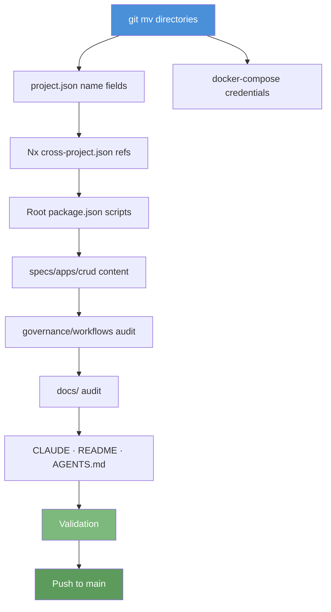

# Tech Docs: Rename `demo-*` → `crud-*`

## Architecture and rename strategy

### Directory moves — use `git mv`

`git mv` preserves file history. Always move directories, never copy-delete.

```bash
git mv apps/demo-be-golang-gin apps/crud-be-golang-gin
git mv specs/apps/demo specs/apps/crud
git mv infra/dev/demo-be-golang-gin infra/dev/crud-be-golang-gin
# … repeat for each directory
```

### String replacement — sed in-place

After directory moves, all internal string references still contain `demo`. A bulk
`find | xargs sed` sweep handles most of it. Run **after** `git mv` so file paths are
already correct.

```bash
# Example: update all JSON/YAML/MD strings inside the repo
find . \
  -not -path "./.git/*" \
  -not -path "./node_modules/*" \
  -not -path "./plans/done/*" \
  -not -path "./generated-reports/*" \
  -type f \( -name "*.json" -o -name "*.yaml" -o -name "*.yml" -o -name "*.md" \) \
  | xargs sed -i '' 's/demo-be-/crud-be-/g; s/demo-fe-/crud-fe-/g; s/demo-fs-/crud-fs-/g; s/demo_be_/crud_be_/g'
```

> Note: `sed -i ''` is macOS syntax. Linux uses `sed -i`.

Run a second targeted pass for residual strings:

```bash
# demo-contracts → crud-contracts (JSON name fields, dependsOn strings)
find . -not -path "./.git/*" -not -path "./node_modules/*" -not -path "./plans/done/*" \
  -type f -name "*.json" \
  | xargs sed -i '' 's/"demo-contracts"/"crud-contracts"/g'

# specs/apps/demo → specs/apps/crud (path strings in commands)
find . -not -path "./.git/*" -not -path "./node_modules/*" -not -path "./plans/done/*" \
  -type f \( -name "*.json" -o -name "*.yaml" -o -name "*.yml" -o -name "*.md" \) \
  | xargs sed -i '' 's|specs/apps/demo/|specs/apps/crud/|g'
```

### Source-language config files

Each backend app may have a hardcoded DB name in its app config (e.g.
`application.yml` for Spring Boot, `config.py` for FastAPI, `config.exs` for Elixir).
Run an additional sweep over all source file types:

```bash
find apps/crud-be-* -type f \
  \( -name "*.yml" -o -name "*.yaml" -o -name "*.py" -o -name "*.exs" \
     -o -name "*.conf" -o -name "*.toml" -o -name "*.properties" \
     -o -name "*.clj" -o -name "*.edn" -o -name "*.kts" -o -name "*.xml" \) \
  | xargs grep -l "demo_be_" \
  | xargs sed -i '' 's/demo_be_/crud_be_/g'
```

## File change map



## Affected file categories

| Category                      | Files                                    | Strategy                    |
| ----------------------------- | ---------------------------------------- | --------------------------- |
| App directories               | 17 dirs in `apps/`                       | `git mv`                    |
| Infra directories             | 15 dirs in `infra/dev/`                  | `git mv`                    |
| Specs tree                    | 1 root dir + all children                | `git mv` then content sweep |
| GitHub Actions workflow files | `.github/workflows/test-demo-*.yml` (15) | `git mv` + sed sweep        |
| Nx `project.json` `"name"`    | 18 files                                 | sed sweep                   |
| Nx `implicitDependencies`     | 18 files                                 | sed sweep                   |
| Nx `dependsOn` strings        | 18 files                                 | sed sweep                   |
| Nx target command paths       | 18 files                                 | sed sweep                   |
| `docker-compose*.yml` creds   | ~45 files                                | sed sweep                   |
| App source config files       | variable per app                         | targeted sed                |
| `package.json` scripts        | root + individual                        | sed sweep                   |
| `specs/apps/crud/` content    | openapi, gherkin, c4, README             | sed + manual review         |
| `governance/workflows/`       | audit first, then fix                    | grep + manual               |
| `governance/conventions/`     | audit first, then fix                    | grep + manual               |
| `docs/` tree                  | audit first, then fix                    | grep + manual               |
| `CLAUDE.md`                   | bulk + manual review                     | sed + manual                |
| Root `README.md`              | bulk + manual review                     | sed + manual                |
| `AGENTS.md`                   | audit                                    | grep + manual               |
| `plans/ideas.md`, backlog     | audit                                    | grep + manual               |

## Testing strategy

Run in this order — each gate catches a different failure class:

1. **`npx nx graph`** — catches broken Nx project graph (missing name, broken deps)
2. **`npx nx run-many -t codegen --projects=crud-*`** — catches broken contract
   pipeline (path or dependency errors)
3. **`npx nx affected -t typecheck`** — catches broken TypeScript import paths
4. **`npx nx affected -t lint`** — catches language-specific style violations from the
   rename
5. **`npx nx affected -t test:quick`** — catches broken unit tests and coverage
6. **`npx nx run crud-be-e2e:spec-coverage && npx nx run crud-fe-e2e:spec-coverage`**
   — catches broken Gherkin path references in spec-coverage targets
7. **`npm run lint:md`** — catches markdown violations introduced by edits
8. **`grep -r "demo-be-\|demo-fe-\|demo-fs-\|demo-contracts\|specs/apps/demo" . --include="*.json" --include="*.yaml" --include="*.md" | grep -v ".git/" | grep -v "node_modules/" | grep -v "plans/done/" | grep -v "generated-reports/"`**
   — final stale-reference check

## Dependencies

Execution prerequisites (all must be satisfied before Phase 1 begins):

- **`git`** — for `git mv` directory moves (Phases 1-3, 18b); must support `git mv`
- **`sed`** — for bulk string replacement sweeps (Phase 4-5); macOS syntax is `sed -i ''`,
  Linux syntax is `sed -i` (see inline note in Phase 4 commands)
- **`npm`** / **`npx nx`** — for Nx workspace validation and quality gates (Phases 20-22)
- **Node.js** managed by Volta (version pinned in `package.json`) — required for `npm install`
  and all Nx targets
- **Full polyglot toolchain** (Go, Java, Elixir, F#, Python, Rust, Kotlin, Clojure, C#,
  Dart, TypeScript) — required for `test:quick` quality gate in Phase 22; converge via
  `npm run doctor -- --fix` in Phase 0 and Phase 21

> **Phase ordering constraint**: All Phase 1-3 `git mv` operations must complete before
> Phase 4 bulk sed sweeps run. The sweeps operate on the new paths (`apps/crud-*`,
> `specs/apps/crud/`), which only exist after the directory moves.

## Rollback

All commits land directly on `main`. To roll back mid-execution: identify the last
good commit hash with `git log --oneline`, then `git revert` the unwanted commits
(prefer revert over reset to preserve history). Alternatively, `git reset --hard
<last-good-sha>` and force-push — only safe before others have pulled.
