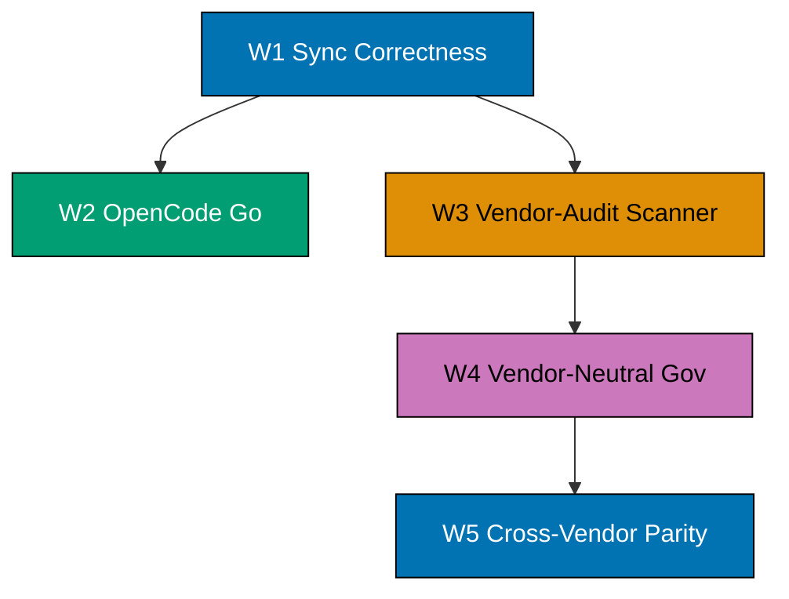
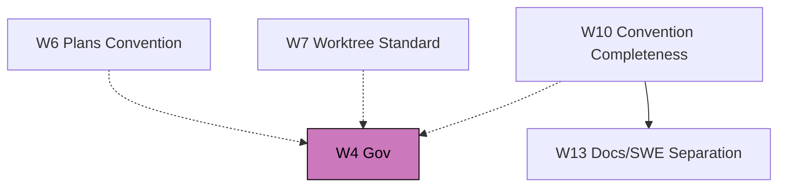
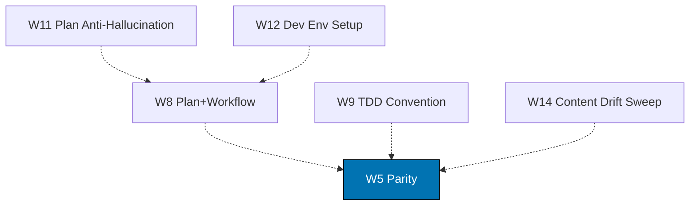

# Adopt ose-public Vendor-Neutrality, OpenCode Go, and Companion Tooling

## Overview

`ose-public` shipped a coherent batch of governance, agent, workflow, and
rhino-cli changes between 2026-04-30 and 2026-05-03 that turn `governance/`
into vendor-neutral prose, swap the OpenCode model provider from Z.ai to
OpenCode Go, fix the Claude Code ↔ OpenCode sync to write canonical
plural paths, and operationalize cross-vendor behavioral parity through
two new agents, one new workflow, and one new rhino-cli scanner. As the
upstream MIT template, ose-primer must not lag the downstream consumer:
this plan adopts the full batch into ose-primer in one coordinated effort.

The work decomposes into fourteen logically independent workstreams that
share execution order because each later workstream consumes invariants
the previous one establishes.

**Core sequence (W1–W5)**:

**Convention companions feeding W4 (W6/W7/W10)**:

**Workflow + quality companions feeding W5 (W8/W9/W11/W12/W14)**:

## Scope

**In scope** (ose-primer-only adoption from `ose-public`):

- **W1 — Sync correctness**: rhino-cli writes to `.opencode/agents/` and `.opencode/skills/`
  (plural) instead of singular paths; remove dual-population leftovers.
- **W2 — OpenCode Go provider**: `ConvertModel()` outputs `opencode-go/*` IDs;
  `.opencode/opencode.json` switches `model`/`small_model` and adds provider block;
  Z.ai MCPs removed; `.opencode/agents/*.md` regenerated.
- **W3 — rhino-cli vendor-audit scanner**: port `internal/governance/governance_vendor_audit{,_test}.go`,
  `cmd/governance.go`, `cmd/governance_vendor_audit{,_test}.go`; new Nx target
  `validate:governance-vendor-audit`; godog Gherkin scenarios under `specs/apps/rhino/cli/gherkin/`.
- **W4 — Vendor-neutral governance**: port the convention `governance/conventions/structure/governance-vendor-independence.md`
  (scoped for primer); neutralize `AGENTS.md` (canonical, with binding-example fences) and
  `CLAUDE.md` (Claude Code shim importing `@AGENTS.md`); remediate vendor terms across
  `governance/` until `rhino-cli governance vendor-audit governance/` returns zero violations.
- **W5 — Cross-vendor parity gate**: port `.claude/agents/repo-parity-{checker,fixer}.md`;
  port `governance/workflows/repo/repo-cross-vendor-parity-quality-gate.md`; add Nx target
  `validate:cross-vendor-parity`; wire into pre-push.
- **W6 — Plans convention refresh**: adopt the stricter 5-document-DEFAULT language with
  four explicit single-file exception criteria from `ose-public/governance/conventions/structure/plans.md`.
- **W7 — Worktree standard**: port the missing `governance/conventions/structure/worktree-path.md`
  convention; refresh `governance/development/workflow/worktree-setup.md` to match ose-public's
  current version.
- **W8 — Plan + workflow refresh**: adopt the latest `governance/workflows/plan/{plan-execution,
plan-quality-gate,README}.md` from ose-public; port the missing companion development workflows
  `governance/development/workflow/{ci-monitoring,ci-post-push-verification}.md`.
- **W9 — TDD convention**: port `governance/development/workflow/test-driven-development.md`
  (316 lines, Red→Green→Refactor mandate); cross-link from `implementation.md` and
  `governance/workflows/plan/plan-execution.md`; require all future plan delivery checklists
  to follow Red→Green→Refactor for code-touching items.
- **W10 — Convention completeness**: port two missing structure conventions —
  `governance/conventions/structure/no-last-updated.md` (29 lines, companion to
  no-date-metadata) and `governance/conventions/structure/programming-language-docs-separation.md`
  (846 lines, separates language docs from generic dev docs).
- **W11 — Plan anti-hallucination**: port
  `governance/development/quality/plan-anti-hallucination.md` (352 lines) — anti-hallucination
  guardrails that the `plan-checker` agent cites when validating plan claims.
- **W12 — Dev environment setup workflow**: refresh primer's existing
  `governance/workflows/infra/infra-development-environment-setup.md` (684 lines)
  against ose-public's `governance/workflows/infra/development-environment-setup.md`
  (619 lines) source. Filename remains primer-canonical per the workflow-naming
  convention; only body content syncs. Document `OPENCODE_GO_API_KEY` env-var setup
  (W2 dependency).
- **W13 — Docs/SWE separation enforcement**: port the
  `docs-software-engineering-separation` triad —
  `.claude/agents/docs-software-engineering-separation-checker.md` (511 lines),
  `.claude/agents/docs-software-engineering-separation-fixer.md` (476 lines), and
  `.claude/skills/docs-validating-software-engineering-separation/SKILL.md` (248 lines).
  Depends on W10 (the separation convention is the rule the checker enforces).
- **W14 — Content drift sweep**: refresh existing primer files that have diverged from
  ose-public's current versions — at minimum
  `governance/development/quality/code.md`, `governance/development/infra/nx-targets.md`,
  `governance/development/quality/three-level-testing-standard.md`. Full drift list
  enumerated by a baseline diff at the start of W14 (Phase 14A).

**Out of scope** (intentionally excluded):

- DDD bounded-context validators (`rhino-cli bc validate`, `ul validate`) —
  registry is product-specific (organiclever-web). Per `ose-primer-sync`
  classifier these don't propagate; future-plan if a polyglot demo ever needs them.
- caveman / cavemem MCP adoption — developer environment concern, not template scaffolding.
- Z.ai cleanup at the global user-config level — personal/billing concern, not template.
- Parent `ose-projects/` adoption of any of these changes — handled in a separate parent-side plan.

## Reading order

1. [brd.md](./brd.md) — why this batch matters and the cost of the drift across six workstreams
2. [prd.md](./prd.md) — per-workstream functional requirements, Gherkin acceptance criteria
3. [tech-docs.md](./tech-docs.md) — file-level porting map, decision log, rollback per workstream
4. [delivery.md](./delivery.md) — phase-by-phase execution checklist with one action per tick

## Required reading before execution

- ose-public source plans (canonical references):
  - [`2026-05-02__validate-claude-opencode-sync-correctness`](https://github.com/wahidyankf/ose-public/tree/main/plans/done/2026-05-02__validate-claude-opencode-sync-correctness)
  - [`2026-04-30__adopt-opencode-go`](https://github.com/wahidyankf/ose-public/tree/main/plans/done/2026-04-30__adopt-opencode-go)
  - [`2026-05-02__governance-vendor-independence`](https://github.com/wahidyankf/ose-public/tree/main/plans/done/2026-05-02__governance-vendor-independence)
  - [`2026-05-03__cross-vendor-agent-parity`](https://github.com/wahidyankf/ose-public/tree/main/plans/done/2026-05-03__cross-vendor-agent-parity)
  - [`2026-05-03__rhino-cli-skills-vendor-term`](https://github.com/wahidyankf/ose-public/tree/main/plans/done/2026-05-03__rhino-cli-skills-vendor-term)
- Inside an ose-primer-rooted Claude session, `../../ose-public/...` is empty per the
  bare-gitlink contract — read via the GitHub UI above, or open a parent-rooted
  Claude session for filesystem side-by-side diffing.
- [governance/development/infra/nx-targets.md](../../../governance/development/infra/nx-targets.md)
  for caching rules on the new `validate:governance-vendor-audit` and `validate:cross-vendor-parity` targets.
- [governance/development/quality/code.md](../../../governance/development/quality/code.md)
  for the pre-push contract.
- [governance/development/workflow/git-push-default.md](../../../governance/development/workflow/git-push-default.md)
  for the direct-to-main publish path used by every commit in this plan.

## Publish path

**Direct push to `origin main`** per [Git Push Default Convention](../../../governance/development/workflow/git-push-default.md)
Standards 1, 2, 6. No draft PR is opened — the user has not requested one for this plan.
Worktree is optional; if used, push via `git push origin HEAD:main` per Standard 6.

## Document navigation

| Document                       | Purpose                                                    |
| ------------------------------ | ---------------------------------------------------------- |
| [README.md](./README.md)       | Overview, scope, navigation (this file)                    |
| [brd.md](./brd.md)             | Business rationale, success measures, risks                |
| [prd.md](./prd.md)             | Functional requirements, Gherkin acceptance criteria       |
| [tech-docs.md](./tech-docs.md) | File-level porting map, decisions, rollback per workstream |
| [delivery.md](./delivery.md)   | Phased step-by-step execution checklist                    |
