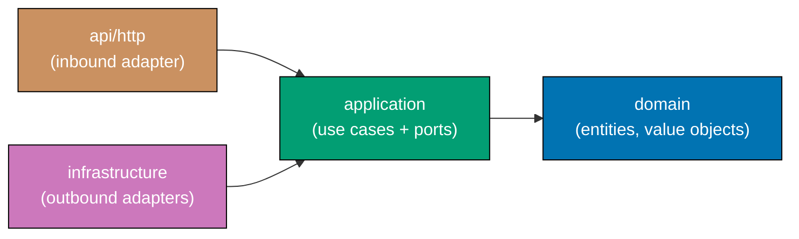

# Tech Docs — Adopt Hexagonal Architecture + DDD

## Architecture Overview

Hexagonal architecture (Ports and Adapters) separates an application into three concentric
zones. The innermost zone contains the domain model — pure business concepts with no
framework dependencies. The middle zone (application) orchestrates use cases through port
interfaces. The outer zone contains adapters that implement those ports using real
technology (HTTP, database, file system).

Domain-Driven Design augments this by organizing BE apps into bounded contexts. Each
context owns its slice of the domain model, application layer, infrastructure adapters, and
HTTP adapter. In the CRUD demo, there is one context named `expenses` — this makes the
structure explicit without requiring multiple contexts.

### Dependency Rule

Dependencies flow inward only:



The `domain/` layer has zero dependencies on any outer layer. The `application/` layer
depends only on `domain/`. Infrastructure and HTTP adapters depend on `application/`
(through port interfaces), but never on each other.

## Canonical Layer Naming

### CLI Apps

| Layer                    | Rust (`rhino-cli-rust`)          | Go (`rhino-cli-go`)         |
| ------------------------ | -------------------------------- | --------------------------- |
| Innermost (domain logic) | `src/domain/`                    | `internal/domain/`          |
| Use cases                | `src/application/`               | `internal/application/`     |
| Infrastructure adapters  | `src/infrastructure/`            | `internal/adapter/command/` |
| Entry point / CLI parser | `src/commands/` (already exists) | `cmd/` (already exists)     |

Go's `internal/` wrapper is compiler-enforced — packages inside `internal/` cannot be
imported by code outside the module. [Repo-grounded: confirmed `apps/rhino-cli-go/cmd/`
exists and Go uses `internal/` for all application code]

For `rhino-cli-go` the adapter layer is named `internal/adapter/command/` (not
`internal/infrastructure/`) to follow the hexagonal convention for CLI apps: the command
adapter parses flags and invokes application use cases.

### FE Apps

All four FE apps use identical layer names under their source root:

| Layer                                 | Path              |
| ------------------------------------- | ----------------- |
| Innermost (domain logic, types)       | `domain/`         |
| Use cases, state management           | `application/`    |
| External calls (API clients, storage) | `infrastructure/` |
| UI components, pages, routes          | `presentation/`   |

**Source roots by app** [Repo-grounded]:

| App                         | Source root                                   |
| --------------------------- | --------------------------------------------- |
| `crud-fe-ts-nextjs`         | `apps/crud-fe-ts-nextjs/src/`                 |
| `crud-fe-ts-tanstack-start` | `apps/crud-fe-ts-tanstack-start/src/`         |
| `crud-fe-dart-flutterweb`   | `apps/crud-fe-dart-flutterweb/lib/`           |
| `crud-fs-ts-nextjs`         | `apps/crud-fs-ts-nextjs/src/` (treated as FE) |

`crud-fs-ts-nextjs` is a fullstack Next.js app. It is treated as FE for layering purposes:
it has its own contract internally and does not consume a separate BE. The four layers apply
to its source root.

### BE Apps

All BE apps follow the bounded-context pattern. The single context is named `expenses`
(matching the CRUD demo domain). The outermost inbound adapter is always two levels:
`api/` containing `http/` — this matches ose-public exactly.

#### Full Language-Specific Directory Layout Table

| App                         | Root for layers                   | Domain                                   | Application                                   | Infrastructure                                   | HTTP adapter                                       |
| --------------------------- | --------------------------------- | ---------------------------------------- | --------------------------------------------- | ------------------------------------------------ | -------------------------------------------------- |
| `crud-be-rust-axum`         | `src/`                            | `contexts/expenses/domain/`              | `contexts/expenses/application/`              | `contexts/expenses/infrastructure/`              | `contexts/expenses/api/http/`                      |
| `crud-be-golang-gin`        | (repo root of app)                | `internal/contexts/expenses/domain/`     | `internal/contexts/expenses/application/`     | `internal/contexts/expenses/infrastructure/`     | `internal/contexts/expenses/api/http/`             |
| `crud-be-fsharp-giraffe`    | `src/DemoBeFsgi/`                 | `Contexts/Expenses/Domain/`              | `Contexts/Expenses/Application/`              | `Contexts/Expenses/Infrastructure/`              | `Contexts/Expenses/Api/Http/`                      |
| `crud-be-ts-effect`         | `src/`                            | `contexts/expenses/domain/`              | `contexts/expenses/application/`              | `contexts/expenses/infrastructure/`              | `contexts/expenses/api/http/`                      |
| `crud-be-python-fastapi`    | `src/crud_be_python_fastapi/`     | `contexts/expenses/domain/`              | `contexts/expenses/application/`              | `contexts/expenses/infrastructure/`              | `contexts/expenses/api/http/`                      |
| `crud-be-clojure-pedestal`  | `src/crud_be_cjpd/`               | `contexts/expenses/domain/`              | `contexts/expenses/application/`              | `contexts/expenses/infrastructure/`              | `contexts/expenses/api/http/`                      |
| `crud-be-java-vertx`        | `src/main/java/com/demobejavx/`   | `contexts/expenses/domain/`              | `contexts/expenses/application/`              | `contexts/expenses/infrastructure/`              | `contexts/expenses/api/http/`                      |
| `crud-be-java-springboot`   | `src/main/java/com/demobejasb/`   | `contexts/expenses/domain/`              | `contexts/expenses/application/`              | `contexts/expenses/infrastructure/`              | `contexts/expenses/api/http/`                      |
| `crud-be-kotlin-ktor`       | `src/main/kotlin/com/demobektkt/` | `contexts/expenses/domain/`              | `contexts/expenses/application/`              | `contexts/expenses/infrastructure/`              | `contexts/expenses/api/http/`                      |
| `crud-be-elixir-phoenix`    | `lib/`                            | `crud_be_exph/contexts/expenses/domain/` | `crud_be_exph/contexts/expenses/application/` | `crud_be_exph/contexts/expenses/infrastructure/` | `crud_be_exph_web/` (generated; IS the HTTP layer) |
| `crud-be-csharp-aspnetcore` | `src/DemoBeCsas/`                 | `Contexts/Expenses/Domain/`              | `Contexts/Expenses/Application/`              | `Contexts/Expenses/Infrastructure/`              | `Contexts/Expenses/Api/Http/`                      |

**Language-specific naming notes**:

- **F# and C#**: PascalCase directories to match .NET/F# conventions. Every other app uses
  lowercase.
- **Go BE**: The `internal/` wrapper is required by the Go compiler. All four layers are
  under `internal/contexts/expenses/`. The existing `cmd/server/` entry point is unchanged.
- **Elixir Phoenix**: Phoenix generates `lib/<app>_web/` as the HTTP layer. This directory
  already exists (`lib/crud_be_exph_web/`) and IS the `api/http` equivalent. Inner DDD layers
  are added under `lib/crud_be_exph/contexts/expenses/`.
- **Rust BE**: The `api/` directory contains a `mod.rs` plus the `http/` subdirectory with its
  own `mod.rs`. Two `.gitkeep` files required at `api/` and `api/http/` levels.
- **JVM (Java, Kotlin)**: Lowercase package names map to lowercase directories. New directories
  are siblings to existing packages — no existing packages are renamed in Phase 4.
- **Clojure**: Clojure namespaces use underscores; directories follow naturally. Existing
  `src/crud_be_cjpd/` is the root.

## Design Decisions

### DD-1: Empty directories use `.gitkeep`

New layer directories that contain no source code yet receive a `.gitkeep` file. Git does
not track empty directories; without `.gitkeep` the directories are invisible and the
structural intent cannot be committed.

### DD-2: Bounded context named `expenses`

All 11 BE apps use a single bounded context named `expenses`. This name reflects the CRUD
demo's primary domain entity. Using one name across all 11 apps makes cross-language
navigation predictable: the same path shape exists in every app.

### DD-3: No code moves in Phase 4

Phase 4 creates new bounded-context directories but does not move existing code into them.
Moving code risks breaking imports, test paths, and build configs across 11 apps
simultaneously. The structural intent is established by the directory shape; code migration
is a separate, per-app effort.

### DD-4: Elixir Phoenix exception

Phoenix generates `lib/<app>_web/` and `lib/<app>/` at project creation. The `_web` module
is already the HTTP adapter layer. Re-creating it as `api/http/` would conflict with
Phoenix's generated structure. The convention document (`hexagonal-architecture-be.md`)
explicitly documents this exception and rationale.

### DD-5: Go `internal/adapter/command/` for CLI (not `internal/infrastructure/`)

For a CLI tool the "infrastructure" concept is the command-line parser. The hexagonal
convention for CLI apps labels this adapter `adapter/command/` to make its role explicit.
This differs from BE apps where the outbound adapter directory is `infrastructure/`.

### DD-6: Governance document names match ose-public

The five governance documents use the same file names as their ose-public counterparts:
`hexagonal-architecture.md`, `hexagonal-architecture-cli.md`, `hexagonal-architecture-web.md`,
`hexagonal-architecture-be.md`, `openapi-contract-first.md`. This enables future mechanical
propagation from ose-public to ose-primer.

### DD-7: `crud-fs-ts-nextjs` treated as FE app

`crud-fs-ts-nextjs` is a fullstack Next.js app (React + Next.js API routes). For hexagonal
layering purposes it is treated identically to a standalone FE app. It generates its own
OpenAPI contract internally and does not consume a separate BE. DDD bounded-context structure
does not apply.

### DD-8: `openapi-contract-first.md` documents the existing `codegen` target convention

All BE apps already have a `codegen` Nx target [Repo-grounded: confirmed in
`apps/crud-be-rust-axum/project.json` and `apps/crud-be-golang-gin/project.json`]. The
governance document codifies the contract-first workflow and points to
`specs/apps/crud/containers/contracts/` as the single OpenAPI source of truth
[Repo-grounded: `specs/apps/crud/containers/contracts/openapi.yaml` exists].

## Governance Convention Documents (5)

All five documents go in `repo-governance/development/pattern/`. [Repo-grounded:
`repo-governance/development/pattern/README.md` exists and lists the current set of docs]

| File                            | Scope                                                                                       |
| ------------------------------- | ------------------------------------------------------------------------------------------- |
| `hexagonal-architecture.md`     | Shared principles, dependency rule diagram, terminology                                     |
| `hexagonal-architecture-cli.md` | CLI conventions — Rust and Go variants                                                      |
| `hexagonal-architecture-web.md` | FE conventions — TS/Next.js, TanStack Start, Dart/Flutter, fullstack Next.js                |
| `hexagonal-architecture-be.md`  | BE conventions — all 11 language variants, DDD bounded contexts, `api/http/` structure      |
| `openapi-contract-first.md`     | OpenAPI contract-first communication — single source of truth, codegen tooling, drift-check |

The `README.md` in `repo-governance/development/pattern/` is updated to index all five new
documents.

## OpenAPI Contract Infrastructure

The canonical OpenAPI spec lives at:

```
specs/apps/crud/containers/contracts/openapi.yaml
```

[Repo-grounded: path verified via `find`]

The bundled artifact is generated by the `crud-contracts:bundle` Nx target and lands at:

```
specs/apps/crud/containers/contracts/generated/openapi-bundled.yaml
```

[Repo-grounded: file exists at that path]

All 11 BE apps already have a `codegen` Nx target that reads the bundled spec and generates
language-specific contract types into `generated-contracts/` in each app. Phase 5 verifies
and documents this target for each BE app in the `openapi-contract-first.md` governance doc.

FE consumer apps (`crud-fe-ts-nextjs`, `crud-fe-ts-tanstack-start`) already have
`generated-contracts/` directories populated from their `codegen` targets
[Repo-grounded: `apps/crud-fe-ts-nextjs/src/generated-contracts/` and
`apps/crud-fe-ts-tanstack-start/src/generated-contracts/` exist].

`crud-fe-dart-flutterweb` codegen wiring is verified in Phase 5.

## File Impact Summary

### New files created

- `repo-governance/development/pattern/hexagonal-architecture.md` — _New file_
- `repo-governance/development/pattern/hexagonal-architecture-cli.md` — _New file_
- `repo-governance/development/pattern/hexagonal-architecture-web.md` — _New file_
- `repo-governance/development/pattern/hexagonal-architecture-be.md` — _New file_
- `repo-governance/development/pattern/openapi-contract-first.md` — _New file_
- `.gitkeep` files in each new layer directory across all 17 apps

### Modified files

- `repo-governance/development/pattern/README.md` — add entries for 5 new documents

### Files NOT touched

- Existing source files in any app — no code moves, no import changes
- `project.json` files — `codegen` target already exists in BE apps; Phase 5 verifies only
- Any test file — regression-free by design

## Dependencies

| Component                                                             | Version/Source                                            | Status          |
| --------------------------------------------------------------------- | --------------------------------------------------------- | --------------- |
| `specs/apps/crud/containers/contracts/openapi.yaml`                   | Repo [Repo-grounded]                                      | Already present |
| `specs/apps/crud/containers/contracts/generated/openapi-bundled.yaml` | Generated by `crud-contracts:bundle` [Repo-grounded]      | Already present |
| `codegen` Nx target                                                   | Already in all 11 BE `project.json` files [Repo-grounded] | Already present |
| `npm run doctor -- --fix`                                             | Polyglot toolchain convergence                            | Run in Phase 0  |

## Testing Strategy

This plan creates directory structure only — no new application logic is introduced.
The testing strategy focuses on:

1. **Regression testing** (Phase 0 baseline + post-phase verification): Run
   `npx nx run-many -t test:quick` before and after each phase. Any failure introduced by a
   structural change is caught immediately.

2. **Governance lint** (each Phase 1 file): Each convention document passes markdownlint
   (`npx nx run-many -t lint:md` or equivalent) with zero violations.

3. **Directory existence checks** (Phase 2-4 acceptance): For each new `.gitkeep` created,
   `bash test -f <path>` exits 0.

There are no new application-level unit tests or integration tests in this plan. Code-level
tests are introduced when existing code is later moved into the new layer directories, which
is out of scope.

## Rollback

If any phase introduces regressions:

1. Identify the failing test(s) and their import paths.
2. The only structural change is directory creation + `.gitkeep`. Roll back by removing the
   new directories (`git rm -r <dir>`).
3. The `repo-governance/development/pattern/` additions are pure-docs and do not affect test
   execution — they can remain even if app phases are rolled back.
4. Each phase ends with a CI-green commit, so rollback scope is bounded to one phase.
