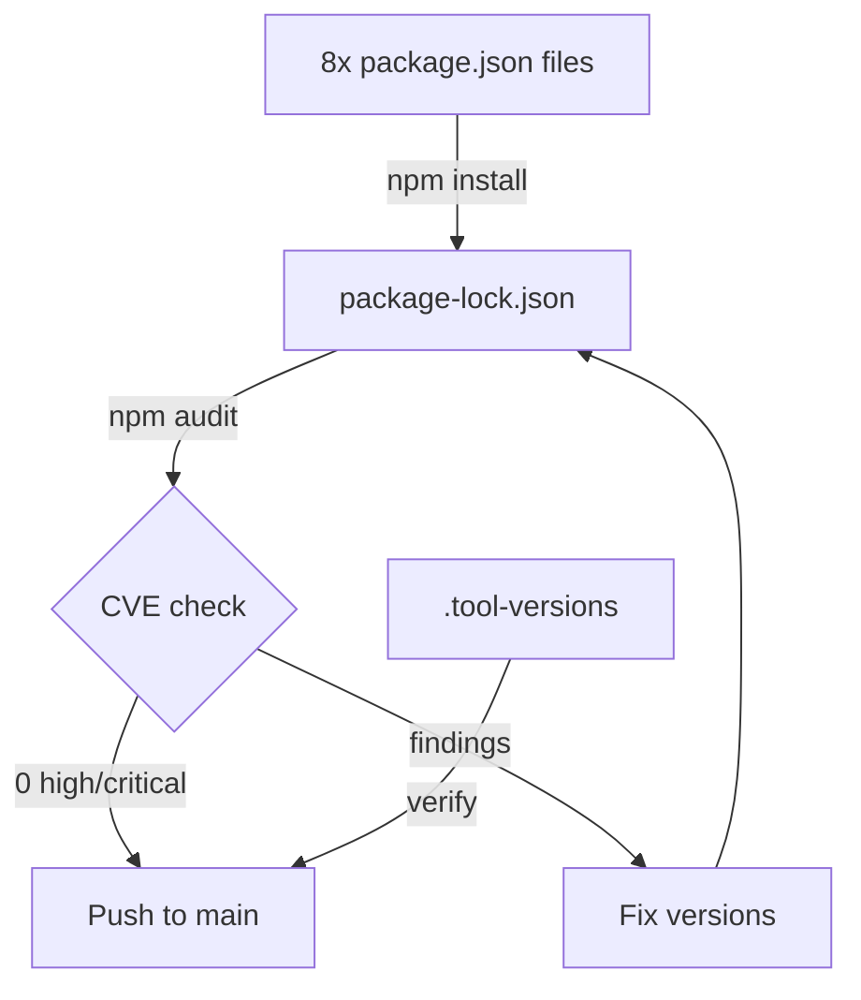
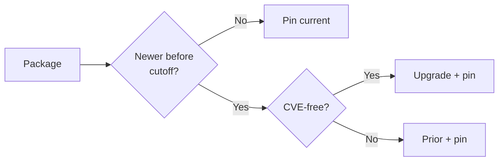

# Technical Documentation — Update and Pin All npm Dependencies

## Architecture Overview

This plan performs a pure manifest-editing operation — no application code changes, no
new abstractions, no architectural changes. The work touches eight `package.json` files,
the root `package-lock.json`, and `.tool-versions`.



## Eligibility Criteria (Decision Algorithm)

For every package in every `package.json`, the executor applies this decision tree:



**Cutoff date**: 2026-03-27 (two months before 2026-05-27).

**CVE source**: `npm audit` after install; cross-reference Snyk advisory database and GitHub
Security Advisories for packages with known historical issues.

## Pre-Researched Safe Targets (Root package.json)

The following table was verified on 2026-05-27 via npm registry and Snyk advisory checks.
All versions listed have release dates on or before 2026-03-27 and zero known high/critical CVEs.

[Web-cited — npm registry, verified 2026-05-27. Release dates can be independently confirmed via:
`npm view <package>@<version> time --json | grep <version>`
or via the npm registry API: `https://registry.npmjs.org/<package>/<version>`
(e.g., `https://registry.npmjs.org/@commitlint%2Fcli/20.5.0` to verify the 2026-03-15 release date)]

| Package                               | Current Declared | Resolved | Safe Target | Release Date | Notes                                                                                                                                     |
| ------------------------------------- | ---------------- | -------- | ----------- | ------------ | ----------------------------------------------------------------------------------------------------------------------------------------- |
| `@commitlint/cli`                     | `^20.1.0`        | `20.5.0` | `20.5.0`    | 2026-03-15   | No CVEs                                                                                                                                   |
| `@commitlint/config-conventional`     | `^20.0.0`        | `20.5.0` | `20.5.0`    | 2026-03-15   | No CVEs                                                                                                                                   |
| `@hey-api/client-fetch`               | `^0.13.1`        | `0.13.1` | `0.13.1`    | 2025-06-12   | No CVEs                                                                                                                                   |
| `@hey-api/openapi-ts`                 | `^0.94.2`        | `0.94.2` | `0.94.5`    | 2026-03-25   | No CVEs                                                                                                                                   |
| `@openapitools/openapi-generator-cli` | `^2.30.2`        | `2.30.2` | `2.31.0`    | 2026-03-24   | No CVEs in npm wrapper                                                                                                                    |
| `@redocly/cli`                        | `^2.22.1`        | `2.22.1` | `2.25.1`    | 2026-03-24   | 2.25.0 proactively updated deps for security hardening                                                                                    |
| `@stoplight/spectral-cli`             | `^6.15.0`        | `6.15.0` | `6.15.0`    | 2025-04-22   | No CVEs                                                                                                                                   |
| `eslint-plugin-jsx-a11y`              | `^6.10.2`        | `6.10.2` | `6.10.2`    | 2024-10-26   | No CVEs                                                                                                                                   |
| `husky`                               | `^9.1.7`         | `9.1.7`  | `9.1.7`     | 2024-11-18   | No CVEs                                                                                                                                   |
| `lint-staged`                         | `^16.2.6`        | `16.4.0` | `16.4.0`    | 2026-03-14   | No CVEs                                                                                                                                   |
| `markdownlint-cli2`                   | `^0.21.0`        | `0.21.0` | `0.22.0`    | 2026-03-22   | No CVEs                                                                                                                                   |
| `nx`                                  | `22.5.2` (exact) | `22.5.2` | `22.6.2`    | 2026-03-26   | Supply-chain attack GHSA-cxm3-wv7p-598c only affected 20.x/21.x; 22.6.4 introduced transitive Axios DoS (CVE-2026-25639) — stop at 22.6.2 |
| `prettier`                            | `^3.6.2`         | `3.8.1`  | `3.8.1`     | 2026-01-21   | No CVEs (eslint-config-prettier CVE-2025-54313 is a separate package)                                                                     |
| `prettier-plugin-tailwindcss`         | `^0.7.2`         | `0.7.2`  | `0.7.2`     | 2025-12-01   | No CVEs                                                                                                                                   |
| `tailwindcss` (dep)                   | `^4.2.1`         | `4.2.2`  | `4.2.2`     | 2026-03-18   | No CVEs                                                                                                                                   |
| `tsx`                                 | `^4.20.6`        | `4.21.0` | `4.21.0`    | 2025-11-30   | No CVEs                                                                                                                                   |

**Volta config** (`node: 24.13.1`, `npm: 11.10.1`): already exact-pinned — no change needed.

### nx Version Safety Note

nx 22.6.2 is the safe ceiling for this update pass:

- `nx@22.6.4` introduced a transitive Axios dependency that carries CVE-2026-25639 (DoS via
  malformed HTTP headers). [_Judgment call_ — the Snyk advisory URL for CVE-2026-25639 was not
  reachable as of 2026-05-27; the CVE identifier was sourced from pre-execution research and
  the GitHub issue thread https://github.com/nrwl/nx/issues/35145. Stop at 22.6.2 until the
  advisory is publicly indexed and independently verifiable.]
- The August 2025 supply-chain attack (GHSA-cxm3-wv7p-598c) targeted only the 20.x and 21.x
  branches; the 22.x branch was not affected. [Web-cited — GitHub Security Advisory
  https://github.com/advisories/GHSA-cxm3-wv7p-598c (accessed 2026-05-27). Excerpt: "Malicious
  versions of Nx were published. Severity: Critical. Affected: nx 21.5.0, 20.9.0, 20.10.0,
  21.6.0, 20.11.0, 21.7.0, 21.8.0, 20.12.0 — the 22.x branch is not listed as affected."]

## App-Level Package Update Methodology

Because app-level packages were not fully pre-researched (there are many packages across six
apps and two libs), the executor applies a systematic in-execution methodology:

### Step 1 — Enumerate outdated packages

```bash
# From the repo root (npm workspaces resolves per-workspace)
npm outdated --workspaces
```

This lists every package where the installed version differs from the latest registry version.

### Step 2 — For each outdated package, check release date

```bash
npm view <package>@<target-version> time --json | grep <target-version>
```

Accept the version only if the release date is on or before 2026-03-27. If not, walk back
to the previous version:

```bash
npm view <package> versions --json
```

Find the latest version with a release date on or before the cutoff.

### Step 3 — Cross-check CVE status

```bash
# After installing the candidate version in a test install, run:
npm audit --audit-level=high
```

If a finding appears for the candidate version, select the previous release that is both
within the cutoff date and CVE-free.

### Step 4 — Edit package.json

Replace the range-prefixed declaration with the exact target version string. Example:

```json
// Before
"vitest": "^4.1.0"

// After
"vitest": "4.1.0"
```

Remove `^` and `~` from ALL declarations including `dependencies`, `devDependencies`,
and `peerDependencies` where the repo controls the version (do not remove `*` from
workspace-internal cross-references like `"@open-sharia-enterprise/ts-ui-tokens": "*"`).

### Step 5 — Regenerate lockfile and audit

```bash
npm install      # regenerates package-lock.json
npm audit --audit-level=high   # must exit 0
```

## .tool-versions Methodology

Current content [Repo-grounded]:

```
erlang 27.3
elixir 1.19.5-otp-27
```

The executor verifies:

1. **Release date**: Check the Erlang/OTP and Elixir release pages for each declared version.
   Confirm the release date is on or before 2026-03-27.
2. **Security**: Check Erlang/OTP security advisories and Elixir security advisories for
   high/critical issues in the declared version.
3. **Update if eligible**: If a newer version satisfies both criteria, update `.tool-versions`.
   If not, retain the current version.

The erlang and elixir versions are managed by `asdf` (the `.tool-versions` standard) and do
not flow through `npm audit`. CVE verification must be done manually against upstream advisories.

## Dependencies and Tools

| Tool              | Purpose                                                | Version source                 |
| ----------------- | ------------------------------------------------------ | ------------------------------ |
| `npm`             | Workspace install, audit                               | Volta-pinned `11.10.1`         |
| `npx nx affected` | Run quality gates per affected project                 | Root `package.json` nx version |
| `npm audit`       | CVE scan of installed dependency tree                  | bundled with npm               |
| `npm outdated`    | Identify packages with newer registry versions         | bundled with npm               |
| `npm view`        | Query registry metadata (release dates, version lists) | bundled with npm               |

## Testing Strategy

This plan does not introduce new test code. The testing strategy is:

1. **Regression gate**: run `npx nx affected -t typecheck` and `npx nx affected -t lint`
   and `npx nx affected -t test:quick` after all pins are applied. All must pass. Any
   failure is a regression introduced by the dependency change and must be fixed before
   proceeding.

2. **Security gate**: `npm audit --audit-level=high` must exit 0. This is both a quality
   gate and an acceptance criterion (AC-4 in `prd.md`).

3. **CI gate**: All GitHub Actions workflows must pass after push to `main`. This is the
   final verification that the lockfile, type-checking, linting, and tests all succeed in
   a clean environment.

Per the [Test-Driven Development Convention](../../../repo-governance/development/workflow/test-driven-development.md),
new test code is written before implementation for feature changes. This plan is a
maintenance-only manifest edit with no new feature code, so no new tests are written. The
existing test suite is the regression safety net.

## Rollback Strategy

If any phase produces regressions that cannot be resolved within the scope of this plan:

1. Identify the specific package that introduced the regression via `git bisect` or by
   reverting individual package changes.
2. Pin that package to its previous resolved version instead of the upgrade target.
3. Re-run quality gates.
4. Document the skipped upgrade as a follow-up item in `plans/ideas.md`.

The entire change set is a single logical commit group. Reverting is straightforward via
`git revert` on the relevant commit.

## File Impact Summary

| File                                          | Change Type                                                                                                       |
| --------------------------------------------- | ----------------------------------------------------------------------------------------------------------------- |
| `package.json`                                | Edit — remove `^`/`~`, upgrade nx + lint-staged + markdownlint-cli2 + hey-api/openapi-ts + openapitools + redocly |
| `apps/crud-fe-ts-nextjs/package.json`         | Edit — pin all range prefixes                                                                                     |
| `apps/crud-fe-ts-tanstack-start/package.json` | Edit — pin all range prefixes                                                                                     |
| `apps/crud-fs-ts-nextjs/package.json`         | Edit — pin all range prefixes                                                                                     |
| `apps/crud-be-ts-effect/package.json`         | Edit — pin all range prefixes                                                                                     |
| `apps/crud-fe-e2e/package.json`               | Edit — pin all range prefixes                                                                                     |
| `apps/crud-be-e2e/package.json`               | Edit — pin all range prefixes                                                                                     |
| `libs/ts-ui/package.json`                     | Edit — pin all range prefixes                                                                                     |
| `libs/ts-ui-tokens/package.json`              | No changes (no declared deps)                                                                                     |
| `package-lock.json`                           | Regenerated by `npm install`                                                                                      |
| `.tool-versions`                              | Edit if newer eligible version found; retain if current is already eligible                                       |
