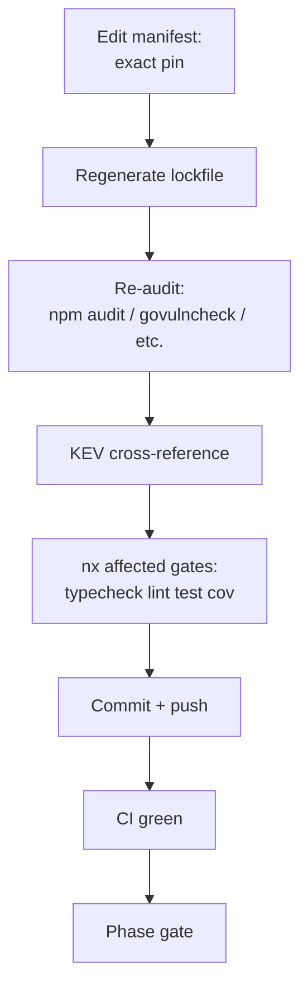

# Technical Documentation — Dependency Bump June 2026

All version, CVE, EPSS, KEV, and release-date claims below are `[Web-cited]` via the
[June 2026 clearance report][clearance-report] (which delegated verification to `web-research-maker`
against NVD, GHSA, Snyk, vendor pages, and the CISA KEV catalog). All manifest paths are
`[Repo-grounded]` and were confirmed to resolve in the current commit.

## Architecture and approach

The repository is a polyglot Nx monorepo with 11 language ecosystems plus Docker and GitHub
Actions. Dependency state is pinned in per-ecosystem manifests; the bump is applied ecosystem by
ecosystem, each followed by lockfile regeneration and re-audit. The data flow per ecosystem:

### Design decisions

1. **Security-first phase order.** Path C waivers and CVE-driven bumps run before pure-currency
   and infra phases. Rationale: a partial execution (operator stops at a phase gate) should land
   the highest-severity fixes first. Order: npm → .NET → Java/Spring Boot → pgjdbc consumers →
   Python → Elixir → Clojure/Pedestal → currency (Go, Rust, Kotlin, Java, Dart) → Docker → CI.

2. **Exact pins everywhere.** Every in-scope spec becomes an exact pin. Rationale: a template's
   pins are inherited by forks; floating tags produce non-reproducible builds. Caret/tilde/floating
   specifiers are forbidden post-bump and grep-gated.

3. **Rust stable channel = Path A (LTS-adjacent curated soak) for `rhino-cli-rust`.** Keep
   toolchain `1.95.0`. Rationale: the Rust stable release train is a curated, six-week-cadence
   channel with strong backward-compatibility guarantees; treating the current stable as an
   LTS-adjacent Path A pin is consistent with the policy's curated-channel handling. `crud-be-rust-axum`
   keeps its `rust-version = "1.94.0"` floor [Repo-grounded — `apps/crud-be-rust-axum/Cargo.toml:5`];
   only its crate caret specs convert to exact pins.

4. **Dart SDK stays within `^3.11.0`, pinned to `3.11.6`.** Rationale: 3.12.1 is post-cutoff;
   defer as a future opportunistic upgrade. Flutter SDK floor is raised to `>=3.44.0`, but any
   actual `flutter upgrade` is a `[HUMAN]` step (toolchain mutation outside manifest edits).

5. **`plug` gets an explicit exact pin.** It is currently a transitive dependency
   [Repo-grounded — not listed in `apps/crud-be-elixir-phoenix/mix.exs:55-79`]; CVE-2026-8468
   requires `1.19.2`, so an explicit pin is added to `mix.exs`.

6. **Erlang/OTP pin lives at the repo root.** The Erlang and Elixir versions are pinned in the
   root [`.tool-versions`][tool-versions-path] [Repo-grounded — `.tool-versions:1-2` = `erlang 27.3.3`,
   `elixir 1.19.5-otp-27`], NOT in the app folder. The Erlang bump edits that root file; Elixir
   stays `1.19.5-otp-27`.

7. **FluentAssertions FUNCTIONAL-HOLD.** Held at `7.2.2` (last Apache-2.0); 8.x switched to a paid
   commercial license — a Rule 5b functional/licensing defect for an MIT template.

## Per-ecosystem Security Clearance Status

### npm (`crud-fe-ts-nextjs`, `crud-fs-ts-nextjs`, `crud-fe-ts-tanstack-start`, `libs/ts-ui`, root)

| Package           | Current | Target                 | Path | KEV | EPSS | Clearance | CVE(s)                                                                                           |
| ----------------- | ------- | ---------------------- | ---- | --- | ---- | --------- | ------------------------------------------------------------------------------------------------ |
| next              | 16.2.1  | 16.2.7                 | B→C  | No  | n/a  | WAIVER    | 13 CVEs unpatched in 16.2.1; first patch 16.2.5/16.2.6 (post-cutoff)                             |
| react / react-dom | 19.2.4  | 19.2.7                 | A→C  | No  | n/a  | WAIVER    | CVE-2026-23870 DoS; fixed 19.2.6+ (post-cutoff)                                                  |
| Node.js (Volta)   | 24.13.1 | 24.16.0                | A    | No  | n/a  | CLEAR     | LTS Krypton patch (currency)                                                                     |
| root devDeps      | varies  | latest pre-cutoff only | A    | No  | n/a  | CLEAR     | bump only those with a newer pre-cutoff version; **tailwindcss STAYS 4.2.2** (4.3.0 post-cutoff) |

### .NET (`crud-be-csharp-aspnetcore`, `crud-be-fsharp-giraffe`)

| Package                               | Current  | Target           | Path | Clearance        | CVE(s)                                        |
| ------------------------------------- | -------- | ---------------- | ---- | ---------------- | --------------------------------------------- |
| global.json SDK (csharp)              | 10.0.103 | 10.0.108         | A    | CLEAR (patch-of) | CVE-2026-40372 (9.1 EoP) fixed runtime 10.0.7 |
| global.json SDK (fsharp)              | 10.0.201 | 10.0.204         | A    | CLEAR (patch-of) | CVE-2026-40372 (9.1)                          |
| Microsoft.\* 10.x NuGet refs          | 10.x     | 10.0.8           | A    | CLEAR            | aligned to patched runtime                    |
| Npgsql.EntityFrameworkCore.PostgreSQL | —        | 10.0.2           | A    | CLEAR            | currency                                      |
| EFCore.NamingConventions              | —        | 10.0.1           | A    | CLEAR            | currency                                      |
| FluentAssertions                      | 7.2.2    | **7.2.2 (HOLD)** | B    | FUNCTIONAL-HOLD  | 8.x paid commercial license (Rule 5b)         |

### JVM — Spring Boot (`crud-be-java-springboot`)

| Package                    | Current | Target | Path | Clearance | CVE(s)                                                                |
| -------------------------- | ------- | ------ | ---- | --------- | --------------------------------------------------------------------- |
| spring-boot-starter-parent | 4.0.4   | 4.0.6  | B→C  | WAIVER    | CVE-2026-40976 (9.1 CRITICAL Actuator auth bypass); 4.0.6 post-cutoff |

### JVM — pgjdbc consumers (`crud-be-java-vertx`, `crud-be-kotlin-ktor`, `crud-be-clojure-pedestal`)

| Project                | Package                   | Current  | Target   | Path | Clearance        | CVE(s)                                                     |
| ---------------------- | ------------------------- | -------- | -------- | ---- | ---------------- | ---------------------------------------------------------- |
| vertx, ktor            | postgresql JDBC           | 42.7.5   | 42.7.11  | B→C  | WAIVER           | CVE-2025-49146 (8.2 MITM) + CVE-2026-42198 (7.5 SCRAM DoS) |
| clojure-pedestal       | org.postgresql/postgresql | 42.7.10  | 42.7.11  | B→C  | WAIVER           | CVE-2026-42198 (7.5 SCRAM DoS)                             |
| ktor, clojure-pedestal | logback-classic           | 1.5.18   | 1.5.32   | B    | CLEAR (patch-of) | CVE-2025-11226 + CVE-2026-1225 (ACE)                       |
| vertx                  | jackson (core/databind)   | 2.18.3   | 2.18.6   | B    | CLEAR (patch-of) | GHSA-72hv-8253-57qq async-parser DoS                       |
| vertx                  | io.vertx:\*               | 4.5.12   | 4.5.26   | B    | CLEAR (patch-of) | HTTP smuggling + Netty CVEs (CVE-2026-33870/33871)         |
| ktor                   | sqlite-jdbc               | 3.49.1.0 | 3.51.3.0 | B    | CLEAR (patch-of) | underlying SQLite fixes                                    |
| clojure-pedestal       | org.xerial/sqlite-jdbc    | 3.51.2.0 | 3.51.3.0 | B    | CLEAR            | latest pre-cutoff                                          |
| ktor                   | flyway                    | 11.4.0   | 11.20.3  | B    | CLEAR (patch-of) | CVE-2025-27496, CVE-2024-6763, CVE-2025-55163              |

### Python (`crud-be-python-fastapi`)

| Package          | Current  | Target  | Path | KEV | EPSS  | Clearance        | CVE(s)                                                         |
| ---------------- | -------- | ------- | ---- | --- | ----- | ---------------- | -------------------------------------------------------------- |
| fastapi          | >=0.115  | 0.136.3 | B→C  | No  | <0.01 | WAIVER           | CVE-2026-48710 BadHost (6.5); Starlette ≥1.0.1 fix post-cutoff |
| python-multipart | >=0.0.12 | 0.0.26  | B→C  | No  | n/r   | WAIVER           | CVE-2026-40347 (5.3 DoS)                                       |
| pyjwt            | >=2.9    | 2.12.1  | B    | No  | 4.69% | CLEAR (patch-of) | CVE-2026-32597 (7.5) crit-header bypass; fix 2.12.0 pre-cutoff |

### Elixir (`crud-be-elixir-phoenix`, root `.tool-versions`)

| Package        | Current       | Target      | Path | Clearance        | CVE(s)                                           |
| -------------- | ------------- | ----------- | ---- | ---------------- | ------------------------------------------------ |
| postgrex       | >=0.0.0       | 0.22.2      | B→C  | WAIVER           | CVE-2026-32687 (7.5 SQLi via channel name)       |
| bandit         | ~> 1.5        | 1.11.1      | B→C  | WAIVER           | 5 CVEs (39804/39805/39807/42786/42788)           |
| plug (new pin) | transitive    | 1.19.2      | B→C  | WAIVER           | CVE-2026-8468 (8.2 multipart DoS)                |
| phoenix        | ~> 1.7        | 1.7.23      | A    | CLEAR (patch-of) | CVE-2026-32689 (8.7 long-poll DoS); fix 1.7.22   |
| erlang (root)  | 27.3.3        | 27.3.4.12   | A    | CLEAR (patch-of) | KEV CVE-2025-32433 already patched; +3 CVE fixes |
| elixir (root)  | 1.19.5-otp-27 | (unchanged) | —    | CLEAR            | stays pinned                                     |

### Clojure (`crud-be-clojure-pedestal`, `libs/clojure-openapi-codegen`)

| Package                              | Current | Target | Path | Clearance | CVE(s)                                                        |
| ------------------------------------ | ------- | ------ | ---- | --------- | ------------------------------------------------------------- |
| io.pedestal/pedestal.{service,jetty} | 0.7.2   | 0.8.1  | B→C  | WAIVER    | residual transitive Jetty CVE-2026-2332 (9.1) + CVE-2026-5795 |
| clojure                              | 1.12.0  | 1.12.5 | B→C  | WAIVER    | 1.12.5 post-cutoff (trivial residual-risk waiver)             |

### Go (`crud-be-golang-gin`, `rhino-cli-go`, `libs/golang-commons`)

| Project    | Package             | Current | Target  | Path | Clearance | CVE(s)                                                                   |
| ---------- | ------------------- | ------- | ------- | ---- | --------- | ------------------------------------------------------------------------ |
| golang-gin | golang.org/x/crypto | 0.48.0  | 0.52.0  | B→C  | WAIVER    | 13× GO-2026-50xx SSH CVEs; **verify `/ssh` subpkg import** to scope risk |
| golang-gin | golang-jwt/jwt/v5   | v5.2.2  | v5.3.1  | B    | CLEAR     | CVE-2025-30204 already patched at v5.2.2; currency                       |
| golang-gin | go directive        | 1.25.0  | 1.25.11 | A    | CLEAR     | latest supported-line patch                                              |

## Security Waivers (to propagate to the register on execution)

Every row below is appended to [`docs/reference/security-waivers.md`][waiver-register] during
execution (KEV + EPSS columns populated). Date = bump date; Sign-off = AI agent identity that
applies the waiver.

### Path C — WAIVER (security fix only post-cutoff)

| Package                              | Pinned Version | CVE(s) + Severity                                  | EPSS  | KEV | Release vs cutoff | Justification                                                  |
| ------------------------------------ | -------------- | -------------------------------------------------- | ----- | --- | ----------------- | -------------------------------------------------------------- |
| next                                 | 16.2.7         | 13 CVEs (various)                                  | n/a   | No  | post-cutoff       | first CVE-clean patch (16.2.5/16.2.6) is post-cutoff           |
| react / react-dom                    | 19.2.7         | CVE-2026-23870 (DoS)                               | n/a   | No  | post-cutoff       | fix 19.2.6+ is post-cutoff                                     |
| golang.org/x/crypto                  | 0.52.0         | 13× GO-2026-50xx SSH CVEs                          | <0.01 | No  | post-cutoff       | only fix is 0.52.0 (post-cutoff); low risk if `/ssh` unused    |
| spring-boot-starter-parent           | 4.0.6          | CVE-2026-40976 (9.1 CRITICAL)                      | n/r   | No  | post-cutoff       | Actuator auth bypass; fix 4.0.6 (2026-04-23)                   |
| postgresql JDBC                      | 42.7.11        | CVE-2025-49146 (8.2) + CVE-2026-42198 (7.5)        | low   | No  | post-cutoff       | MITM + SCRAM DoS; 42.7.11 post-cutoff                          |
| org.postgresql/postgresql            | 42.7.11        | CVE-2026-42198 (7.5)                               | low   | No  | post-cutoff       | SCRAM DoS; fix post-cutoff                                     |
| fastapi (→ starlette ≥1.0.1)         | 0.136.3        | CVE-2026-48710 (6.5)                               | <0.01 | No  | post-cutoff       | BadHost host-header auth bypass; Starlette fix post-cutoff     |
| python-multipart                     | 0.0.26         | CVE-2026-40347 (5.3)                               | n/r   | No  | post-cutoff       | DoS; fix 0.0.26 post-cutoff                                    |
| postgrex                             | 0.22.2         | CVE-2026-32687 (7.5)                               | n/r   | No  | post-cutoff       | SQLi via channel name; fix post-cutoff                         |
| bandit                               | 1.11.1         | 5 CVEs (39804/39805/39807/42786/42788)             | n/r   | No  | post-cutoff       | all <1.11.0 vulnerable; fix post-cutoff                        |
| plug                                 | 1.19.2         | CVE-2026-8468 (8.2)                                | n/r   | No  | post-cutoff       | multipart DoS; fix 1.19.2 post-cutoff                          |
| io.pedestal/pedestal.{service,jetty} | 0.8.1          | residual Jetty CVE-2026-2332 (9.1) + CVE-2026-5795 | n/r   | No  | post-cutoff       | no stable Pedestal bundles a clean Jetty; residual-risk waiver |
| clojure                              | 1.12.5         | none (currency)                                    | n/a   | No  | post-cutoff       | trivial post-cutoff currency; residual-risk waiver             |

### FUNCTIONAL-HOLD

| Package          | Held Version | Skipped Version | Reason                                             | Justification                                           |
| ---------------- | ------------ | --------------- | -------------------------------------------------- | ------------------------------------------------------- |
| FluentAssertions | 7.2.2        | 8.x             | 8.x relicensed to paid commercial (was Apache-2.0) | Rule 5b functional/licensing defect for an MIT template |

> **KEV note**: No in-scope pin carries an unpatched KEV-listed CVE. The only KEV CVE touching the
> inventory — CVE-2025-32433 (Erlang/OTP SSH RCE, CVSS 10.0, KEV `dateAdded` 2025-06-09) — is
> already patched at the current pin `27.3.3` [Web-cited]. No `(KEV-listed)` waiver row results.

## Currency targets (non-security, Path A/B CLEAR)

These are enumerated per ecosystem in [`delivery.md`](./delivery.md). Summary:

- **Go**: gin v1.12.0, gorm v1.31.1, gorm/driver/postgres v1.6.0, gorm/driver/sqlite v1.6.0,
  oapi-codegen/runtime v1.3.1, go-test-coverage v2.18.4; go directives 1.25.11 / 1.26.4.
- **Rust** `crud-be-rust-axum`: caret→exact (tokio 1.51.0, axum 0.8.8, sqlx 0.8.6, serde 1.0.228,
  serde_json 1.0.149, jsonwebtoken 9.3.1, bcrypt 0.15.1, uuid 1.23.0, chrono 0.4.44, thiserror
  2.0.18, anyhow 1.0.102, async-trait 0.1.89, tower 0.5.3, tower-http 0.6.8, tracing 0.1.44,
  tracing-subscriber 0.3.23, base64 0.22.1, http 1.4.0, http-body-util 0.1.3, cucumber 0.21.1).
  Avoid yanked axum 0.8.2 / sqlx 0.8.4 / tower-http 0.6.3/0.6.5.
- **Rust** `rhino-cli-rust`: current pins (from `apps/rhino-cli-rust/Cargo.toml` [Repo-grounded]):
  clap `4.6.1`, serde_json `1.0.150`, assert_cmd `2.2.2`, cucumber `0.23.0`,
  pulldown-cmark `0.13.4`, quick-xml `0.40.1`, tokio `1.49.0`. Targets (Path B / Rule 5a —
  post-cutoff pins reverted to latest pre-cutoff eligible version):
  clap `4.6.1`→`4.6.0`, serde_json `1.0.150`→`1.0.149`, assert_cmd `2.2.2`→`2.2.0`,
  cucumber `0.23.0`→`0.22.1`, pulldown-cmark `0.13.4`→`0.13.3`, quick-xml `0.40.1`→`0.39.2`
  (post-cutoff pins reverted to latest pre-cutoff eligible per dependency-bump policy Rule 5a);
  tokio `1.49.0`→`1.51.0` (bump to latest pre-cutoff; `1.51.0` released 2026-04-03,
  pre-cutoff [Web-cited via clearance report]). Toolchain `1.95.0` kept.
- **Kotlin** `crud-be-kotlin-ktor`: Kotlin 2.3.20, Ktor 3.4.1, Exposed 1.0.0 (breaking),
  Koin 4.2.0, kotlinx-datetime 0.8.0 (breaking), cucumber 7.34.x, java-jwt 4.5.2.
- **Java** `crud-be-java-vertx`: java-jwt 4.5.2, liquibase 4.31.1, cucumber 7.34.x.
- **Clojure**: cheshire 6.2.0, HikariCP 6.3.3, tools.build v0.10.13; libs snakeyaml 2.6,
  clj-kondo `2025.09.22` (latest pre-cutoff; current `2024.11.14` [Repo-grounded via `libs/clojure-openapi-codegen/deps.edn`]).
- **Elixir**: phoenix_ecto 4.7.0, ecto_sql 3.13.4, telemetry_metrics 1.1.0, telemetry_poller 1.3.0,
  gettext 1.0.2, jason 1.4.4, guardian 2.4.0, bcrypt_elixir 3.3.2, excoveralls 0.18.5, credo 1.7.17
  (2026-03-03), yaml_elixir 2.12.1 (2026-02-17, `elixir-openapi-codegen` lib only); convert `~>` floors to exact pins.
- **Dart** `crud-fe-dart-flutterweb`: dio 5.9.2, web 1.1.1, flutter_lints 6.0.0; Dart SDK 3.11.6.

## Testing strategy

- **Currency/CVE-only bumps** (no API change): verified by re-running each project's existing
  `test:quick` + `spec-coverage`; the Gherkin acceptance criteria map to `nx affected` gates.
- **Breaking upgrades** (Exposed 1.0, kotlinx-datetime 0.8): TDD-shaped (RED → GREEN → REFACTOR) in
  `delivery.md`; a failing test first reproduces the breaking API change before migration code.
- **Web frontends**: Playwright MCP manual behavioral assertions (`crud-fe-ts-nextjs`,
  `crud-fe-ts-tanstack-start`, `crud-fs-ts-nextjs`, `crud-fe-dart-flutterweb`).
- **Backend APIs**: curl health + endpoint assertions post-bump.

## Rollback

Each ecosystem phase is an isolated commit (or small thematic commit set). Rollback = `git revert`
of that ecosystem's commit(s) + lockfile regeneration. Phase gates ensure a phase is never left in
a half-applied state across a boundary.

## References

- [June 2026 clearance report][clearance-report]
- [Dependency Bump Stability & Safety Policy][policy]
- [Security Waivers Register][waiver-register]
- Root Erlang/Elixir pin → [`.tool-versions`][tool-versions-path]

[clearance-report]: ../../../generated-reports/repo-dependency-bump-planning__be6560__2026-06-04--13-24__report.md
[policy]: ../../../repo-governance/development/workflow/dependency-bump-policy.md
[waiver-register]: ../../../docs/reference/security-waivers.md
[tool-versions-path]: ../../../.tool-versions
