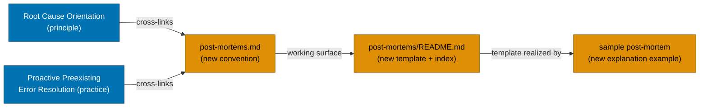

# Technical Documentation — Adopt Post-Mortem Convention

## Architecture

No code architecture is involved — this is a governance + documentation change. The "architecture"
is document placement within the six-layer governance hierarchy and the `docs/` Diátaxis structure,
adopted faithfully from the sibling `ose-infra` repository.

## Design Decisions

### Decision 1: Deliver as a structure convention, not a workflow or practice

Post-mortems are a **documentation structure** concern — location, naming, mandatory sections,
severity scale — which is exactly the charter of `repo-governance/conventions/structure/`
[Repo-grounded — siblings: `plans.md`, `file-naming.md`, `diataxis-framework.md`]. The
[Workflow Naming Convention](../../../repo-governance/conventions/structure/workflow-naming.md)'s
four-token restriction governs `repo-governance/workflows/` only and is irrelevant here:
conventions carry **no** type-token restriction. The sibling `ose-infra` repository ships this
exact file at `repo-governance/conventions/structure/post-mortems.md`; this plan matches it.

### Decision 2: Post-mortems live in the Diátaxis explanation tier

Post-mortems build conceptual understanding of how a system behaved under stress — they answer
"why did this happen?", which is the **explanation** tier of Diátaxis, not how-to or reference. The
`ose-infra` source is emphatic on this and lists `docs/how-to/post-mortems/` as an explicit FAIL
example [Repo-grounded — ose-infra/repo-governance/conventions/structure/post-mortems.md line 372].
The writer-facing surface therefore lives at `docs/explanation/post-mortems/` with the
template + index in `README.md` and the worked sample alongside it.

### Decision 3: Convention is authoritative; the explanation directory is the working surface

`repo-governance/conventions/structure/post-mortems.md` is the **authoritative governance rule**
(the full standard). `docs/explanation/post-mortems/README.md` is the **practical working surface**
(copy-paste template + index). When the two disagree, the convention wins. This split mirrors the
`ose-infra` original exactly.

### Decision 4: Sample scenario — backend DB connection-pool exhaustion

The sample depicts a backend service exhausting its database connection pool under load (a common,
relatable application failure mode) — generalizing the `ose-infra` examples away from
Tailscale/Proxmox to the app/service domain of `ose-primer`. It uses the placeholder service name
`sample-be-service` — verified to not collide with any real app under `apps/`
[Repo-grounded: `ls apps/ | grep sample` → no match]. Dated 2025-01-15. The Summary opens with an
explicit "illustrative example, not a real incident" banner.

### Decision 5: The 14 mandatory sections (kept identical to the `ose-infra` convention)

The convention prescribes these sections **in this order** (single source of truth in the
convention document; the template and the sample must include all of them). Optional sections
(Background, Supporting Data) are documented separately.

1. **Frontmatter** — including `doc_status` (`draft` → `reviewed` → `closed`).
2. **Metadata Table** — Incident date, Investigation date, Severity, Status, Author.
3. **Summary** — two to four sentences: what failed, duration, outcome.
4. **Impact** — services/users affected, duration, MTTD/MTTR.
5. **Detection** — how it was noticed, with a category label (Manual / Monitoring Alert /
   Automated Health Check / User Report).
6. **Timeline** — absolute timestamps with stated timezone (WIB, UTC+7).
7. **Root Cause** — the deepest systemic condition.
8. **Trigger** — the proximate event, distinct from root cause.
9. **Contributing Factors** — compounding systemic conditions (bullet list).
10. **Resolution & Mitigations** — applied fix vs open root-cause fix.
11. **Action Items** — table (`# | Action | Owner | Priority | Ticket | Status`) with P0/P1/P2.
12. **What Went Well** — including "where we got lucky".
13. **Lessons Learned** — two to five generalizable bullets.
14. **References** — logs, dashboards, related plans/post-mortems, external sources.

**Optional**: Background (may precede Summary when substantial context is needed), Supporting Data.

### Decision 6: Severity scale, blameless principle, and `doc_status` lifecycle copied verbatim

The authoritative severity scale (Sev-1 Critical, Sev-2 Major, Sev-3 Moderate, Sev-4 Minor), the
blameless "second story" framing, and the `doc_status` lifecycle are copied identically from the
`ose-infra` convention. Only paths and illustrative examples are adapted.

## File-Impact Map

| File                                                                               | Action     | Notes                                                          |
| ---------------------------------------------------------------------------------- | ---------- | -------------------------------------------------------------- |
| `repo-governance/conventions/structure/post-mortems.md`                            | **Create** | Authoritative convention. _New file_.                          |
| `repo-governance/conventions/structure/README.md`                                  | Edit       | Add alphabetical index entry under "Documents".                |
| `repo-governance/conventions/README.md`                                            | Edit       | Add alphabetical entry under the "🗂️ Structure" section.       |
| `docs/explanation/post-mortems/README.md`                                          | **Create** | Writer-facing template + index. _New file + new dir_.          |
| `docs/explanation/post-mortems/2025-01-15-sample-be-service-db-pool-exhaustion.md` | **Create** | Worked illustrative sample. _New file_.                        |
| `docs/explanation/README.md`                                                       | Edit       | Add a Post-Mortems subdir entry under the documentation index. |
| `repo-governance/principles/general/root-cause-orientation.md`                     | Edit       | Add reciprocal reference to the new convention.                |
| `repo-governance/development/practice/proactive-preexisting-error-resolution.md`   | Edit       | Add reciprocal reference to the new convention.                |

## Dependencies

- **No external libraries, services, or tools.** Markdown only.
- **Reference source**: the `ose-infra` post-mortem convention is the faithful-adoption source; its
  structure is reproduced here with adapted paths and examples.
- **Validation tooling**: Prettier + markdownlint (repo-wide), invoked via `npx`. No new Nx target.

## Testing Strategy

This is a documentation-only change with no executable behavior, so there are no unit/integration/
E2E tests. Verification is done via:

- **Markdown quality gate** — Prettier (no diff) + markdownlint (zero errors) on new/edited files.
- **Link integrity** — every relative cross-link verified with `Bash test -f` against the resolved
  path. The convention's in-repo `no-secrets` link must resolve to
  `repo-governance/development/quality/no-secrets-in-committed-files.md` (this repo's location,
  differing from `ose-infra`'s `conventions/security/` path).
- **Section completeness (14-section parity)** — `grep` assertions that the template page and the
  sample include each of the 14 mandatory section headings named in the convention document.
- **Governance quality gate** — the
  [repo-rules-quality-gate](../../../repo-governance/workflows/repo/repo-rules-quality-gate.md)
  workflow is run at `strict` mode over the new convention plus every index and back-link edit
  (Phase 5 of `delivery.md`). It must return `pass` — zero CRITICAL/HIGH/MEDIUM findings on two
  consecutive validations — with all such findings fixed via `repo-rules-fixer` before push.

The Gherkin acceptance criteria in `prd.md` map to these grep/test checks rather than to a test
runner; each scenario's "Then" clause is realized as a phase-gate check in `delivery.md`.

## Rollback

Each document is independent. Rollback is `git revert` of the relevant commit(s) plus removal of the
index entries — no migrations, no state, no downstream consumers at runtime.
