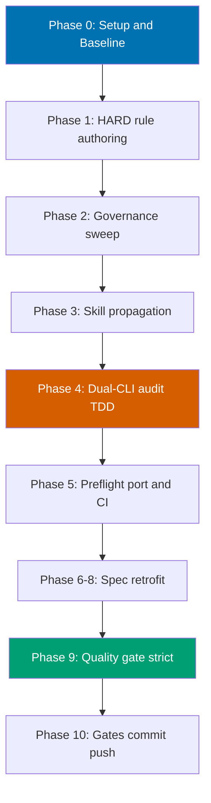

# Gherkin Step-Keyword Cardinality Rule

> Plan identifier: `gherkin-step-keyword-cardinality` — stage: `in-progress`.

## Context

The repository's Gherkin conventions today only **demonstrate** the canonical
single-`Given`/single-`When`/single-`Then` shape by example (the "Complete Syntax"
template in
[`repo-governance/development/infra/acceptance-criteria.md`](../../../repo-governance/development/infra/acceptance-criteria.md))
[Repo-grounded] but never state it as an explicit, enforceable rule. Authors and AI
agents are therefore free to write scenarios with multiple primary `When` or `Then`
keyword lines, which weakens the "one action / one behavior per scenario" norm and
makes the BDD-to-test mapping ambiguous. A deterministic pre-scan at authoring time
found exactly one such scenario already in the corpus
(`specs/apps/crud/behavior/web/gherkin/layout/responsive.feature`) [Repo-grounded].

This plan adds an **explicit HARD rule**: each `Scenario` uses exactly **one** primary
`Given`, **one** `When`, and **one** `Then` keyword line; every additional
precondition / action / outcome MUST be chained with `And` or `But`. `Background`
blocks and `Scenario Outline` `Examples` tables are explicitly exempt. The rule is
authored into the canonical convention, propagated across the governance surface (both
**with** and **without** `repo-rules-maker`), enforced by a new deterministic
`rhino-cli` audit command implemented in **both** CLI implementations (Rust canonical +
Go parity twin) per the
[Rhino CLI Dual-Implementation Parity Convention](../../../repo-governance/conventions/structure/rhino-cli-dual-implementation-parity.md)
[Repo-grounded], and retrofitted into the real `specs/**/*.feature` files that
violate it.

## Scope

**In scope**:

- Author the HARD rule in
  [`repo-governance/development/infra/acceptance-criteria.md`](../../../repo-governance/development/infra/acceptance-criteria.md)
  and normalize its illustrative snippets to conform.
- Broad governance sweep (via `repo-rules-maker`) across all Gherkin-referencing
  `repo-governance/` docs and the `plan-maker` / `plan-checker` / `repo-rules-checker`
  agent prompts.
- Manual propagation (without `repo-rules-maker`) of the two skill packages
  `.claude/skills/plan-writing-gherkin-criteria/SKILL.md` and
  `.claude/skills/plan-creating-project-plans/SKILL.md`, then `npm run generate:bindings`.
- A new deterministic standalone command `repo-governance gherkin-keyword-cardinality`
  implemented twice (Rust + Go, TDD in both languages), driven by a new Gherkin behavior
  contract under `specs/apps/rhino/behavior/cli/gherkin/repo-governance/`, with
  shadow-diff parity coverage and Nx `validate:` targets for both CLIs.
- Porting the Step 0.5 deterministic-preflight section from the `ose-public`
  `repo-rules-quality-gate` workflow into this repo's
  [`repo-rules-quality-gate.md`](../../../repo-governance/workflows/repo/repo-rules-quality-gate.md),
  adapted to this repo's standalone-command audit shape, then enumerating the new
  category.
- CI wiring (GitHub-hosted runners) so the audit runs on every push to `main`.
- Per-subtree retrofit of violating `specs/**/*.feature` files **and** their step
  definitions in lockstep (linter-driven discovery, graceful zero-offender handling).
- A `repo-rules-quality-gate` (strict) double-zero pass validating repo-wide consistency.

**Out of scope**:

- Changing the BDD-to-test mapping semantics beyond keyword cardinality.
- Rewriting scenarios for reasons other than keyword cardinality (no behavioral changes).
- Adding new feature files or new test coverage beyond what the contract + retrofit require.
- Any vendor-specific content in `repo-governance/` (harness-neutrality preserved).
- The BDD-library self-test fixtures `libs/elixir-cabbage/test/features/` and
  `libs/elixir-gherkin/test/fixtures/` (they test the Gherkin parser itself and are
  excluded from the linter scope).

## Approach Summary

The change is **purely internal** (governance + tooling). No external library or
version claims are involved, so web research was **skipped** — all factual claims in
this plan carry `[Repo-grounded]` or `[Judgment call]` confidence labels; there are no
`[Web-cited]` claims.

## Sibling Plans

This plan is part of a three-repo parity set created by the
[plan-multi-repo-parity-planning workflow](../../../repo-governance/workflows/plan/plan-multi-repo-parity-planning.md).
See the sibling plans for context (paths are repo-relative in each sibling repository):

- `ose-public`: `plans/in-progress/gherkin-step-keyword-cardinality/README.md`
- `ose-infra`: `plans/in-progress/gherkin-step-keyword-cardinality/README.md`

The full cross-repo deviation matrix (13 rows, 4 deliberate deviations) lives in
[`tech-docs.md`](./tech-docs.md) §"Cross-Repo Parity: Deviation Matrix", and the
plain-language rationale is delivered to
`docs/explanation/gherkin-step-keyword-cardinality-parity-decisions.md` in each repo.

## Plan Documents

- [`brd.md`](./brd.md) — Business Requirements (WHY).
- [`prd.md`](./prd.md) — Product Requirements (WHAT) — user stories + Gherkin
  acceptance criteria (the criteria themselves obey the new HARD rule).
- [`tech-docs.md`](./tech-docs.md) — Architecture, design decisions, file impact.
- [`delivery.md`](./delivery.md) — Phased delivery checklist (the executable blueprint).

## Definition of Done

All delivery checklist items ticked; the new HARD rule is authored, propagated
(with and without `repo-rules-maker`), and enforced by a green deterministic audit
implemented in both CLIs with byte-identical output (shadow-diff parity); the
Step 0.5 deterministic preflight is ported and enumerates the new category; all
violating `.feature` files and their step definitions are retrofitted; the
`repo-rules-quality-gate` (strict) passes with double-zero; local quality gates
(`npx nx affected -t typecheck lint test:quick spec-coverage`) and post-push CI are
green after the direct push to `origin main`; the plan is archived to `plans/done/`.
