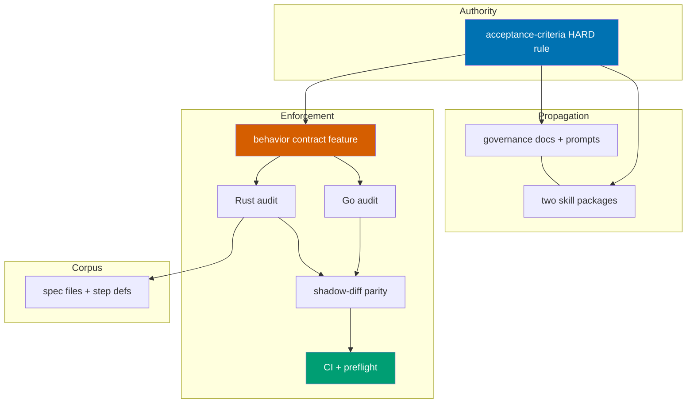

# Technical Documentation — Gherkin Step-Keyword Cardinality Rule

## Architecture Overview

Three coordinated artifacts: (1) governance text, (2) a deterministic dual-implementation
audit (Rust canonical + Go parity twin, one behavior contract), and (3) normalized spec
files. The audit is the enforcement backbone; the governance text is the authority; the
spec retrofit brings the corpus into compliance.



## Design Decisions

### DD-1: Standalone dual-implementation command (no audit orchestrator)

Unlike `ose-public`, this repo has **no** `audit_orchestrator.rs` — its deterministic
governance checks are standalone `repo-governance` subcommands, currently only
`vendor-audit` (Rust: `apps/rhino-cli-rust/src/internal/repo_governance/vendor_audit.rs`
dispatched via the `RepoGovernanceCommands` enum in `apps/rhino-cli-rust/src/cli.rs` and
`apps/rhino-cli-rust/src/commands/repo_governance.rs`; Go:
`apps/rhino-cli-go/internal/repo-governance/governance_vendor_audit.go` +
`apps/rhino-cli-go/cmd/governance_vendor_audit.go` registered on `repoGovernanceCmd` in
`apps/rhino-cli-go/cmd/governance.go`) [Repo-grounded — all six paths verified]. The new
`gherkin-keyword-cardinality` command mirrors that exact shape in both CLIs.
**Rationale**: reuses the established standalone-command pattern; the
[Dual-Implementation Parity Convention](../../../repo-governance/conventions/structure/rhino-cli-dual-implementation-parity.md)
[Repo-grounded] requires both implementations to land together (Rule 1) from one
behavior contract (Rule 2). This is deliberate deviation row 2 in the matrix below.

### DD-2: Spec-first contract; both implementations in one phase

Per parity Rule 2 the behavior contract is authored first:
`specs/apps/rhino/behavior/cli/gherkin/repo-governance/repo-governance-gherkin-keyword-cardinality.feature`
(_New file_, sibling: `repo-governance-vendor-audit.feature` [Repo-grounded]). Both
implementations then land in the **same delivery phase**. **Rationale**: parity Rule 1
forbids landing one implementation without the other, and the Rust cucumber runner in
`apps/rhino-cli-rust/tests/repo_governance.rs` auto-discovers every `.feature` in the
contract directory [Repo-grounded — `feature_dir()` joins
`../../specs/apps/rhino/behavior/cli/gherkin/repo-governance`], so a pause between
"contract + Go" and "Rust" would leave `rhino-cli-rust:test:integration` red. Merging
into one phase preserves the natural-pause rule instead of inventing an unsafe pause.

### DD-3: Deterministic output ordering in both implementations

Findings are emitted sorted by (file path, line number) in BOTH implementations.
**Rationale**: the Go `docs validate-mermaid` text formatter's map-iteration
non-determinism is a documented trap in the shadow-diff harness
(`apps/rhino-cli-rust/scripts/shadow-diff.sh`, "NOTE on docs text/markdown output")
[Repo-grounded]; designing sorted output up front lets the new command's shadow-diff
corpus cover text, json, and markdown formats without ordering carve-outs.

### DD-4: AI judgment criteria added to plan-checker + repo-rules-checker

In addition to the deterministic audit, the rule is added to the AI judgment criteria of
`.claude/agents/plan-checker.md` and `.claude/agents/repo-rules-checker.md` so authored
Gherkin in plans (not just `specs/**/*.feature`) is reviewed [Repo-grounded — both
agent files exist]. **Rationale**: the deterministic audit scans feature files only;
plan `prd.md` Gherkin lives outside that scope.

### DD-5: Per-subtree phased retrofit with gates

One delivery phase per spec subtree that owns `.feature` files: `specs/apps/rhino`,
`specs/apps/crud`, `specs/libs`. Each phase normalizes the feature files **and**
verifies their step definitions in lockstep, then gates on the binding projects'
`test:quick` + `spec-coverage` (where the target exists). **Rationale**: isolates
breakage per subtree; a broken binding surfaces at that subtree's gate, not repo-wide.

### DD-6: Linter-driven discovery with graceful zero-offender handling

Each retrofit phase runs the audit first; if a subtree reports zero offenders, the phase
makes no edits but still runs its gate. A deterministic pre-scan at authoring found
exactly **one** offending scenario:
`specs/apps/crud/behavior/web/gherkin/layout/responsive.feature`, scenario "Mobile
viewport hides sidebar behind a hamburger menu" (two primary `When`, two primary `Then`)
[Repo-grounded — heuristic scan of all 58 tracked `specs/**/*.feature` files at
authoring; the built audit is the authoritative check at execution]. The fix is
keyword-only (`When`→`And`, `Then`→`And`), leaving step text unchanged, so the five
binding step-definition files should not need text edits — but the gate verifies.

### DD-7: Propagation with AND without repo-rules-maker (distinct phases)

Phase 2 delegates the broad governance sweep to `repo-rules-maker`. Phase 3 edits the
two skill packages **by hand** (no `repo-rules-maker`) and re-syncs bindings via
`npm run generate:bindings` [Repo-grounded — script present in `package.json`].
**Rationale**: explicit requirement; also demonstrates the rule propagates correctly
through both channels.

### DD-8: Port the Step 0.5 deterministic preflight, adapted to standalone commands

This repo's [`repo-rules-quality-gate.md`](../../../repo-governance/workflows/repo/repo-rules-quality-gate.md)
has steps 1–6 with **no** Step 0.5 deterministic preflight [Repo-grounded]. The Step
0.5 section is ported from the `ose-public` sibling's quality-gate doc and adapted:
where `ose-public` invokes a single `repo-governance audit` orchestrator, this repo
enumerates its standalone deterministic commands (`repo-governance vendor-audit`,
`repo-governance gherkin-keyword-cardinality`) executed via the canonical Rust binary.
This is deliberate deviation row 6. **Rationale**: porting the preflight closes the
parity gap rather than wiring around it; adapting to standalone commands respects this
repo's no-orchestrator architecture (DD-1).

### DD-9: CI wiring on GitHub-hosted runners; push-to-main coverage

Push to `main` triggers only `validate-markdown.yml` [Repo-grounded — the only workflow
with `push: branches: [main]`; `pr-quality-gate.yml` fires on PRs; the 22 `test-*`
workflows are schedule/dispatch]. Because this plan pushes directly to `main`
(deviation row 8), the new audit is wired as an additional step in
`.github/workflows/validate-markdown.yml` running
`npx nx run rhino-cli-rust:validate:gherkin-keyword-cardinality`, and the existing
`parity` job in `pr-quality-gate.yml` covers the new command on PRs via the extended
shadow-diff `repo-governance` corpus. This is deliberate deviation row 7.

## File Impact

### New files

- `specs/apps/rhino/behavior/cli/gherkin/repo-governance/repo-governance-gherkin-keyword-cardinality.feature`
  — _New file_ — the behavior contract (scenarios themselves obey the one-each rule).
- `apps/rhino-cli-go/internal/repo-governance/governance_gherkin_keyword_cardinality.go`
  — _New file_ — Go audit logic (sibling: `governance_vendor_audit.go`).
- `apps/rhino-cli-go/internal/repo-governance/governance_gherkin_keyword_cardinality_test.go`
  — _New file_ — Go unit tests.
- `apps/rhino-cli-go/cmd/governance_gherkin_keyword_cardinality.go`
  — _New file_ — cobra command `gherkin-keyword-cardinality [path]` (sibling:
  `cmd/governance_vendor_audit.go`).
- `apps/rhino-cli-go/cmd/governance_gherkin_keyword_cardinality_test.go`
  — _New file_ — godog step definitions binding the contract (sibling:
  `cmd/governance_vendor_audit_test.go`; required because both spec-coverage targets
  scan the Go tree with `--shared-steps` [Repo-grounded — both `project.json`
  `spec-coverage` commands]).
- `apps/rhino-cli-rust/src/internal/repo_governance/gherkin_keyword_cardinality.rs`
  — _New file_ — Rust audit logic (sibling: `vendor_audit.rs`).

### Modified files (dual-CLI wiring)

- `apps/rhino-cli-rust/src/internal/repo_governance/mod.rs` — register the new module.
  [Repo-grounded — `mod.rs` exists]
- `apps/rhino-cli-rust/src/commands/repo_governance.rs` — add the
  `gherkin-keyword-cardinality` run function, usage block, and text/json/markdown
  formatters (with inline unit tests — this file is NOT in the `test:quick` llvm-cov
  ignore regex, so its lines count toward the 90% gate [Repo-grounded —
  `project.json` `test:quick` command]).
- `apps/rhino-cli-rust/src/cli.rs` — add the `GherkinKeywordCardinality` variant to the
  `RepoGovernanceCommands` enum and its dispatch arm (mirror `VendorAudit` at lines
  133–136 / 256–259). [Repo-grounded]
- `apps/rhino-cli-rust/tests/repo_governance.rs` — add cucumber-rs step functions for
  the new contract scenarios (the runner auto-discovers the new feature file).
  [Repo-grounded]
- `apps/rhino-cli-rust/scripts/shadow-diff.sh` — extend the `repo-governance` corpus
  (around the existing `vendor-audit` cases at ~line 689) with
  `gherkin-keyword-cardinality` cases. [Repo-grounded]
- `apps/rhino-cli-rust/project.json` + `apps/rhino-cli-go/project.json` — add a
  `validate:gherkin-keyword-cardinality` target each, mirroring
  `validate:repo-governance-vendor-audit`. [Repo-grounded — sibling target present in
  both files]
- `specs/apps/rhino/behavior/cli/gherkin/repo-governance/README.md` — add the new
  feature file to the domain table. [Repo-grounded]
- `.github/workflows/validate-markdown.yml` — add the audit step (DD-9). [Repo-grounded]
- `repo-governance/workflows/repo/repo-rules-quality-gate.md` — port the Step 0.5
  deterministic-preflight section and enumerate both categories (DD-8). [Repo-grounded]

### Modified files (governance authoring — via repo-rules-maker)

- `repo-governance/development/infra/acceptance-criteria.md` — author the HARD rule +
  normalize illustrative snippets. [Repo-grounded]
- `repo-governance/development/infra/bdd-spec-test-mapping.md` — reference the rule.
  [Repo-grounded]
- `repo-governance/conventions/structure/plans.md` — reference the rule where Gherkin
  acceptance criteria are discussed. [Repo-grounded]
- `repo-governance/development/infra/best-practices.md` — reference the rule.
  [Repo-grounded]
- `repo-governance/development/infra/anti-patterns.md` — add multi-keyword as an
  anti-pattern. [Repo-grounded]
- Other hits of `grep -rln -i gherkin repo-governance/` (38 files at authoring)
  reviewed case-by-case; only docs discussing scenario structure gain a reference.
  [Repo-grounded — grep executed at authoring]
- `.claude/agents/plan-maker.md`, `.claude/agents/plan-checker.md`,
  `.claude/agents/repo-rules-checker.md` — add to prompt / judgment criteria.
  [Repo-grounded — all three agent files exist]

### Modified files (manual propagation — without repo-rules-maker)

- `.claude/skills/plan-writing-gherkin-criteria/SKILL.md` — state the rule + normalize
  snippets. [Repo-grounded]
- `.claude/skills/plan-creating-project-plans/SKILL.md` — reference the rule. [Repo-grounded]
- Secondary bindings regenerated by `npm run generate:bindings`
  (`agents sync` + `agents emit-bindings` via the Rust CLI). [Repo-grounded —
  `package.json` script]

### Modified files (spec retrofit — discovered at execution)

- Known candidate offender:
  `specs/apps/crud/behavior/web/gherkin/layout/responsive.feature` (keyword-only fix).
  [Repo-grounded — heuristic pre-scan]
- Step-definition files binding that feature (verify, likely no text change needed):
  `apps/crud-fe-e2e/tests/steps/layout/responsive.steps.ts`,
  `apps/crud-fs-ts-nextjs/test/unit/fe-steps/layout/responsive.steps.tsx`,
  `apps/crud-fe-ts-nextjs/test/unit/steps/layout/responsive.steps.tsx`,
  `apps/crud-fe-ts-tanstack-start/src/test/unit/steps/layout/responsive.steps.tsx`,
  `apps/crud-fe-dart-flutterweb/test/unit/steps/responsive_steps_test.dart`.
  [Repo-grounded — `grep -rln "hamburger"` at authoring]
- Any further offenders the built audit discovers at execution. [Unverified — the audit
  is the authoritative check]

## Dependencies

- Existing dual-CLI command pattern (`vendor-audit` in both implementations).
  [Repo-grounded]
- Shadow-diff harness `apps/rhino-cli-rust/scripts/shadow-diff.sh` + `parity` CI job in
  `pr-quality-gate.yml`. [Repo-grounded]
- `npm run generate:bindings` for secondary-binding re-sync. [Repo-grounded]
- `repo-rules-quality-gate` workflow (strict mode). [Repo-grounded]

## Testing Strategy

- **Go audit** — TDD: RED unit tests in
  `apps/rhino-cli-go/internal/repo-governance/governance_gherkin_keyword_cardinality_test.go`
  (multi-`When` flagged; `Background` exempt; `Examples` exempt; doc-string/comment
  edge cases) → GREEN → REFACTOR. Gates: `npx nx run rhino-cli-go:test:unit`,
  `test:quick` (90% coverage via `test-coverage validate`), `test:integration`
  (godog, `-tags=integration`), `spec-coverage`. [Repo-grounded — target commands]
- **Rust audit** — TDD: RED unit tests in
  `gherkin_keyword_cardinality.rs` + inline formatter tests in
  `commands/repo_governance.rs` → GREEN → REFACTOR. Gates:
  `npx nx run rhino-cli-rust:test:unit`, `test:quick` (llvm-cov 90% lines),
  `test:integration` (cucumber-rs), `spec-coverage`. [Repo-grounded]
- **Parity** — extended shadow-diff `repo-governance` corpus must pass:
  `bash apps/rhino-cli-rust/scripts/shadow-diff.sh repo-governance`. The `parity` CI
  job covers it permanently on PRs. [Repo-grounded]
- **Per-subtree retrofit** — each phase gate runs the binding projects' `test:quick`
  - `spec-coverage` (where the target exists; `libs/ts-ui` and `libs/golang-commons`
    have no `spec-coverage` target [Repo-grounded — `project.json` of both]).
- **Repo-wide** — the ported Step 0.5 preflight + the strict `repo-rules-quality-gate`
  run the audit across all tracked `**/*.feature` files minus the aligned exclusion set
  (build outputs, `worktrees/`, `archived/`, BDD-library self-test fixtures — see
  deviation-matrix row 9; net scope in this repo today equals `specs/**/*.feature`,
  58 files) and must report zero findings.
- **Manual behavioral assertions** — not applicable: this plan touches no web UI or
  API runtime code (governance text, CLI tooling, and keyword-only spec-text edits),
  so no Playwright MCP / curl sections are required.

## Rollback

The change is additive (new rule, new audit command in both CLIs) plus mechanical spec
normalization. Rollback = `git revert` of the relevant thematic commits. No data
migrations, no schema changes.

## Research Note

Web research was **skipped** — this is a purely internal governance + tooling change with
no external library/version/API claims. All factual claims carry `[Repo-grounded]`,
`[Judgment call]`, or `[Unverified]` labels; there are no `[Web-cited]` claims.

## Cross-Repo Parity: Deviation Matrix

This plan is part of a three-repo parity set (`ose-public`, `ose-infra`, `ose-primer`)
produced by the
[plan-multi-repo-parity-planning workflow](../../../repo-governance/workflows/plan/plan-multi-repo-parity-planning.md).
Every cross-repo difference below carries a recorded decision and justification. Sibling
plans live in `ose-public` and `ose-infra`, each at
`plans/in-progress/gherkin-step-keyword-cardinality/`.

| #   | Dimension              | Decision                                                                                                                                                                                                                                                                      | Justification                                                                                                                                                                                  |
| --- | ---------------------- | ----------------------------------------------------------------------------------------------------------------------------------------------------------------------------------------------------------------------------------------------------------------------------- | ---------------------------------------------------------------------------------------------------------------------------------------------------------------------------------------------- |
| 1   | Plan handling          | `ose-public`: this existing plan updated in place; siblings: new plans authored                                                                                                                                                                                               | `ose-public` plan predates the parity run (0 items executed); discarding a validated plan wastes gated work                                                                                    |
| 2   | Linter architecture    | `ose-public` + `ose-infra`: new category in the existing `audit_orchestrator.rs` pattern; **`ose-primer` deviation**: standalone command implemented twice (Rust + Go) plus a Gherkin behavior contract in `specs/apps/rhino/`                                                | `ose-primer` has no audit orchestrator and its dual-implementation parity convention requires byte-identical Rust and Go CLIs driven by one behavior contract                                  |
| 3   | Retrofit phases        | Align: all repos run linter-driven retrofit with graceful zero-offender handling (DD-5)                                                                                                                                                                                       | Sibling corpora surveyed at zero violations, but the survey is AI-sampled; the linter is the authoritative check                                                                               |
| 4   | Governance sweep       | Align: `repo-rules-maker`-driven sweep in every repo                                                                                                                                                                                                                          | All three repos carry the agent                                                                                                                                                                |
| 5   | Skill propagation      | Align: manual edit of the two skill packages + `npm run generate:bindings` in every repo                                                                                                                                                                                      | All three repos carry both skills and the binding generator                                                                                                                                    |
| 6   | Quality-gate preflight | `ose-public`: add category to existing Step 0.5 preflight; **siblings deviation**: port the Step 0.5 deterministic-preflight section into their `repo-rules-quality-gate.md` first, then enumerate the category                                                               | Siblings' quality-gate workflows predate the preflight pattern; porting it closes the parity gap rather than wiring around it                                                                  |
| 7   | CI wiring              | Per-repo deviation: `ose-public` existing governance-audit CI path; `ose-infra` `validate-markdown.yml` on a self-hosted runner; `ose-primer` GitHub-hosted validation workflows + dual-CLI parity job                                                                        | CI topology differs per repo (private/self-hosted vs public/GitHub-hosted) and cannot be unified                                                                                               |
| 8   | `ose-primer` push mode | **Accepted deviation**: plans and execution results push directly to `ose-primer` `origin main`, bypassing the PR-only default of the ose-primer sync convention                                                                                                              | Invoker explicitly selected `worktree-to-main` for the whole parity set; `ose-primer`'s own git-push-default convention also defaults to direct main push                                      |
| 9   | Linter scan scope      | Align: repo-wide `**/*.feature` minus an aligned exclusion set (build outputs `bin/`, `build/`, `target/`, `dist/`, `node_modules/`; `worktrees/`; `archived/`; BDD-library self-test fixtures `libs/elixir-cabbage/test/features/` and `libs/elixir-gherkin/test/fixtures/`) | Net effect today equals `specs/**` in every repo, but future feature files outside `specs/` are caught; the Elixir fixtures test the Gherkin parser itself and may deliberately use odd shapes |
| 10  | Rationale doc location | Align: `docs/explanation/gherkin-step-keyword-cardinality-parity-decisions.md` in every repo                                                                                                                                                                                  | Matches the `ose-public` precedent set by the plan-domain-parity effort                                                                                                                        |
| 11  | Research               | Align: skipped in all repos                                                                                                                                                                                                                                                   | Purely internal governance + tooling change; no external claims                                                                                                                                |
| 12  | Stage / gate-mode      | Align: `in-progress` stage, `strict` gate-mode, double-zero required                                                                                                                                                                                                          | Parity set executes immediately after planning                                                                                                                                                 |

| 13 | Markdown-Gherkin coverage | Align: no deterministic markdown linter; plan-doc Gherkin (` ```gherkin ` fences in `prd.md` etc.) is caught by `plan-checker` AI judgment criteria (which `plan-quality-gate` invokes) and by `repo-rules-checker` judgment criteria during quality-gate sweeps; THIS plan's execution additionally retrofits active plans' (`plans/in-progress/`, `plans/backlog/`) markdown Gherkin to conform; `plans/done/` is exempt (immutable archive) | Invoker decision 2026-06-07: deterministic parsing of markdown fences is out of scope — AI judgment suffices; archived plans are immutable history (matches existing sweep exclusions for `plans/done/`) |

**Deviation count**: 4 deliberate deviations (rows 2, 6, 7, 8); 0 silent deviations.

**Local correction to row 3** [Repo-grounded]: in THIS repo the AI-sampled survey is
already superseded — the authoring-time deterministic pre-scan found one offending
scenario (`specs/apps/crud/behavior/web/gherkin/layout/responsive.feature`). The
matrix row stands as recorded for the parity set; the built audit remains the
authoritative check at execution.
