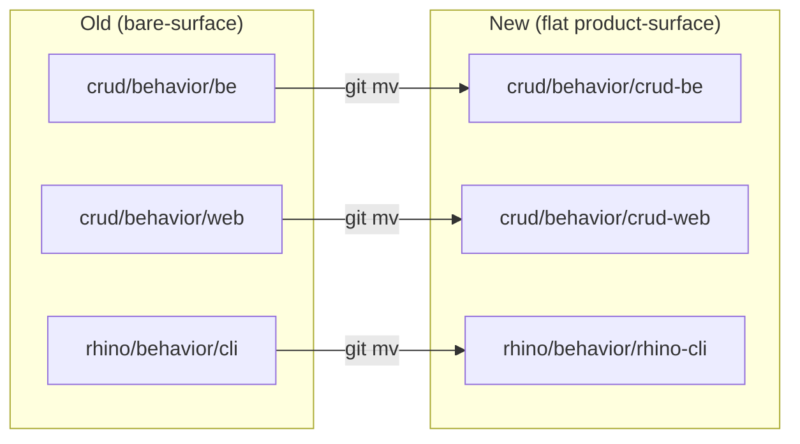

# Technical Documentation — standardize-app-spec-trees (ose-primer)

## Architecture Overview

ose-primer stores behavioral specs under a C4-aware five-folder layout per family
(`product`, `system-context`, `containers`, `components`, `behavior`). Only the **behavior** leaf is
restructured by this plan. Two families exist in this repo `[Repo-grounded]` (confirmed by
`find specs/apps -maxdepth 1 -type d` on 2026-06-11):

- `crud` — many backend impls + frontends + a fullstack app, all consuming **shared** Gherkin from
  `specs/apps/crud/behavior/be/gherkin/` and `specs/apps/crud/behavior/web/gherkin/`.
- `rhino` — single CLI family consuming `specs/apps/rhino/behavior/cli/gherkin/`.

### Rename map (flat product-surface)

| Family | Old behavior dir                 | New behavior dir                       |
| ------ | -------------------------------- | -------------------------------------- |
| crud   | `specs/apps/crud/behavior/be/`   | `specs/apps/crud/behavior/crud-be/`    |
| crud   | `specs/apps/crud/behavior/web/`  | `specs/apps/crud/behavior/crud-web/`   |
| rhino  | `specs/apps/rhino/behavior/cli/` | `specs/apps/rhino/behavior/rhino-cli/` |

`crud` is single-product multi-surface → the family name `crud` is the product token, giving
`crud-be` / `crud-web`. `rhino` is a single-surface echo family → `rhino-cli`. No `api` surface
exists in ose-primer, so no `api`→`be` rename is needed. `[Repo-grounded]`

## File-Impact Map (Consumer Inventory)

All paths and line numbers below were located via `Grep` across `apps/`, `specs/`,
`repo-governance/`, `docs/`, and `.claude/`/`.opencode/` on **2026-06-11**, excluding `node_modules/`,
`.nx/`, `plans/done/`, and the stale `worktrees/standardize-secrets-and-env/` checkout. Label key:
`[Repo-grounded]` = verified at this commit; `[Unverified]` = confirm at execution.

### crud — backend (`behavior/be` → `behavior/crud-be`)

The 11 `crud-be-*` backends + `crud-be-e2e` + the fullstack `crud-fs-ts-nextjs` all consume the
shared BE gherkin. Each `project.json` has: a `spec-coverage` command argument, a `spec-coverage`
`inputs` entry, and `test:unit`/`test:quick` `inputs` entries. `[Repo-grounded]`

| File                                          | Lines                    | What changes                                                                |
| --------------------------------------------- | ------------------------ | --------------------------------------------------------------------------- |
| `apps/crud-be-clojure-pedestal/project.json`  | 56, 72, 100, 102         | inputs + spec-coverage command arg + inputs                                 |
| `apps/crud-be-csharp-aspnetcore/project.json` | 55, 70, 98, 100          | inputs + spec-coverage command arg + inputs                                 |
| `apps/crud-be-elixir-phoenix/project.json`    | 54, 69, 104, 106         | inputs + spec-coverage command arg + inputs                                 |
| `apps/crud-be-fsharp-giraffe/project.json`    | 58, 73, 106, 108         | inputs + spec-coverage command arg + inputs                                 |
| `apps/crud-be-golang-gin/project.json`        | 52, 68, 103, 105         | inputs + spec-coverage command arg + inputs                                 |
| `apps/crud-be-java-springboot/project.json`   | 59, 74, 106, 108         | inputs + spec-coverage command arg + inputs                                 |
| `apps/crud-be-java-vertx/project.json`        | 59, 74, 106, 108         | inputs + spec-coverage command arg + inputs                                 |
| `apps/crud-be-kotlin-ktor/project.json`       | 55, 70, 98, 100          | inputs + spec-coverage command arg + inputs                                 |
| `apps/crud-be-python-fastapi/project.json`    | 56, 71, 99, 101          | inputs + spec-coverage command arg + inputs                                 |
| `apps/crud-be-rust-axum/project.json`         | 59, 77, 110, 112         | inputs + spec-coverage command arg + inputs                                 |
| `apps/crud-be-ts-effect/project.json`         | 46, 57, 66, 76, 104, 106 | cucumber-js feature glob (×2) + inputs + spec-coverage command arg + inputs |
| `apps/crud-be-e2e/project.json`               | 27, 36, 74, 76           | inputs (×2) + spec-coverage command arg + inputs                            |
| `apps/crud-be-e2e/playwright.config.ts`       | 5, 6                     | `featuresRoot` + `features` glob                                            |
| `apps/crud-fs-ts-nextjs/project.json`         | 62, 77                   | BE inputs (fullstack consumes BE gherkin too)                               |

BE README spec links (path cross-refs to update): `apps/crud-be-clojure-pedestal/README.md`,
`apps/crud-be-csharp-aspnetcore/README.md`, `apps/crud-be-elixir-phoenix/README.md`,
`apps/crud-be-fsharp-giraffe/README.md`, `apps/crud-be-golang-gin/README.md`,
`apps/crud-be-java-springboot/README.md`, `apps/crud-be-java-vertx/README.md`,
`apps/crud-be-kotlin-ktor/README.md`, `apps/crud-be-python-fastapi/README.md`,
`apps/crud-be-rust-axum/README.md`, `apps/crud-be-ts-effect/README.md`,
`apps/crud-be-e2e/README.md` (lines 11, 22, 153). `[Repo-grounded]`

`.features-gen/` regeneration: `apps/crud-be-e2e/.features-gen/` is generated from the e2e
playwright config — regenerate after the config edit, never hand-edit. `[Repo-grounded]` (only
this one `.features-gen` dir exists under `apps/`).

### crud — web (`behavior/web` → `behavior/crud-web`)

| File                                          | Lines          | What changes                                                  |
| --------------------------------------------- | -------------- | ------------------------------------------------------------- |
| `apps/crud-fe-dart-flutterweb/project.json`   | 60, 79, 87, 89 | inputs + spec-coverage command arg + inputs                   |
| `apps/crud-fe-ts-nextjs/project.json`         | 62, 76, 85, 87 | inputs + spec-coverage command arg + inputs                   |
| `apps/crud-fe-ts-tanstack-start/project.json` | 62, 76, 85, 87 | inputs + spec-coverage command arg + inputs                   |
| `apps/crud-fs-ts-nextjs/project.json`         | 63, 78         | web inputs (fullstack consumes web gherkin too)               |
| `apps/crud-fe-e2e/project.json`               | 20, 36, 67, 69 | inputs (×2) + spec-coverage command arg + inputs              |
| `apps/crud-fe-e2e/playwright.config.ts`       | 5, 6           | `featuresRoot` + `features` glob                              |
| `apps/crud-fe-e2e/README.md`                  | 3, 11, 25, 136 | spec links                                                    |
| `apps/crud-fe-ts-nextjs/README.md`            | —              | spec links (grep at execution; flagged in BE/web README list) |
| `apps/crud-fe-ts-tanstack-start/README.md`    | —              | spec links                                                    |
| `apps/crud-fe-dart-flutterweb/README.md`      | —              | spec links                                                    |
| `apps/crud-fs-ts-nextjs/README.md`            | 64, 65         | BE + FE Gherkin spec links                                    |

> `apps/crud-fe-ts-nextjs/test/unit/steps/**/*.steps.tsx` were matched by a broad grep for
> `specs/apps/crud/behavior` but inspection shows the matches are step files **under** the app, not
> path-literal references — confirm at execution whether any `.steps.tsx` hardcodes the gherkin path
> (playwright-bdd resolves features via `playwright.config.ts`, so step files normally do not).
> `[Unverified]`

### rhino — CLI (`behavior/cli` → `behavior/rhino-cli`)

The `rhino-cli` family is special: its **Rust unit tests hardcode the gherkin path as a default**,
so this family needs source edits (TDD-shaped), not just config strings. `[Repo-grounded]`

| File                                      | Lines    | What changes                                                                                    |
| ----------------------------------------- | -------- | ----------------------------------------------------------------------------------------------- |
| `apps/rhino-cli/project.json`             | 103, 106 | spec-coverage command arg + inputs                                                              |
| `apps/rhino-cli/tests/docs.rs`            | 5, 919   | doc comment + `.join("../../specs/apps/rhino/behavior/cli/gherkin/docs")`                       |
| `apps/rhino-cli/tests/agents.rs`          | 5, 695   | doc comment + `.join(...agents)`                                                                |
| `apps/rhino-cli/tests/env_validate.rs`    | 204      | `EnvValidateWorld::run("../../specs/apps/rhino/behavior/cli/gherkin/env/env-validate.feature")` |
| `apps/rhino-cli/tests/spec_coverage.rs`   | 4, 261   | doc comment + `.join(...spec-coverage)`                                                         |
| `apps/rhino-cli/tests/env.rs`             | 4, 948   | doc comment + `.join(...env)`                                                                   |
| `apps/rhino-cli/tests/test_coverage.rs`   | 4, 532   | doc comment + `.join(...test-coverage)`                                                         |
| `apps/rhino-cli/tests/java.rs`            | 4, 167   | doc comment + `.join(...java)`                                                                  |
| `apps/rhino-cli/tests/git.rs`             | 4, 287   | doc comment + `.join(...git)`                                                                   |
| `apps/rhino-cli/tests/doctor.rs`          | 4, 379   | doc comment + `.join(...system)`                                                                |
| `apps/rhino-cli/tests/repo_governance.rs` | 5, 298   | doc comment + `.join(...repo-governance)`                                                       |
| `apps/rhino-cli/tests/workflows.rs`       | 4, 190   | doc comment + `.join(...workflows)`                                                             |
| `apps/rhino-cli/tests/contracts.rs`       | 5, 254   | doc comment + `.join(...contracts)`                                                             |

> `apps/rhino-cli/target/**` binary matches are **build artifacts** (compiled `.bin` query-cache
> files) — they are not edited; they regenerate on the next build. `[Repo-grounded]`
> `apps/rhino-cli/src/internal/specs.rs` does NOT exist in ose-primer at authoring time (confirmed
> 2026-06-11); no rename needed. `[Repo-grounded]`

### specs/ READMEs and index files

| File                                                 | Lines         | What changes                                               |
| ---------------------------------------------------- | ------------- | ---------------------------------------------------------- |
| `specs/README.md`                                    | 30            | links to `apps/crud/behavior/be/gherkin` and `web/gherkin` |
| `specs/apps/crud/behavior/README.md`                 | —             | child surface links (grep at execution)                    |
| `specs/apps/crud/behavior/be/README.md`              | 108, 163, 179 | path examples + Nx input pattern (file moves with the dir) |
| `specs/apps/crud/behavior/be/gherkin/README.md`      | —             | path cross-refs (moves with dir)                           |
| `specs/apps/crud/behavior/web/README.md`             | —             | path cross-refs (moves with dir)                           |
| `specs/apps/crud/behavior/web/gherkin/README.md`     | 43            | references `behavior/be/gherkin`                           |
| `specs/apps/crud/components/be/component-be.md`      | 128           | link to `behavior/be/gherkin`                              |
| `specs/apps/rhino/README.md`                         | 71, 84        | path examples in "create a feature" steps                  |
| `specs/apps/rhino/components/cli/component-cli.md`   | 291           | link to `behavior/cli/gherkin/docs`                        |
| `specs/apps/rhino/behavior/README.md`                | —             | child surface link (grep at execution)                     |
| `specs/apps/rhino/behavior/cli/gherkin/**/README.md` | —             | self-relative links move with the dir                      |

### Governance + docs cross-references

These cite old bare-surface paths and must be rewritten to the flat product-surface form. Located
via `Grep` 2026-06-11. `[Repo-grounded]`

| File                                                                               | Lines                                           | What changes                                          |
| ---------------------------------------------------------------------------------- | ----------------------------------------------- | ----------------------------------------------------- |
| `repo-governance/conventions/structure/specs-directory-structure.md`               | 25, 100–102, 115–117                            | amendment target (see Phase G) + example paths        |
| `repo-governance/development/infra/ci-conventions.md`                              | 190, 192, 387                                   | `crud/behavior/be` + `behavior/web/gherkin` examples  |
| `repo-governance/development/infra/nx-targets.md`                                  | 404, 448, 452, 590, 595–604                     | crud-be example paths + per-language input table      |
| `repo-governance/development/infra/bdd-spec-test-mapping.md`                       | 91–93, 112, 181, 188, 193, 265                  | rhino `cli/gherkin` + crud `behavior/be`              |
| `repo-governance/development/quality/three-level-testing-standard.md`              | 18, 43, 80, 119, 135, 151, 400, 414             | crud `behavior/be`/`behavior/web`                     |
| `repo-governance/development/quality/specs-application-sync.md`                    | 156, 167, 191, 211, 254, 264                    | crud `behavior/be`                                    |
| `repo-governance/development/quality/feature-change-completeness.md`               | 144, 165                                        | crud `behavior/be`                                    |
| `repo-governance/workflows/specs/specs-quality-gate.md`                            | 8, 56, 92–94, 109, 279, 284, 292, 306, 318, 330 | crud `behavior/be`/`web` + rhino examples             |
| `repo-governance/conventions/writing/dynamic-collection-references.md`             | 165                                             | crud BE gherkin README path                           |
| `docs/explanation/software-engineering/automation-testing/tools/playwright/bdd.md` | 86, 87, 294                                     | crud `behavior/be` featuresRoot + features + link     |
| `docs/how-to/update-api-contract.md`                                               | 84                                              | crud `behavior/be`                                    |
| `docs/how-to/add-new-app.md`                                                       | 328                                             | crud `behavior/be` input                              |
| `docs/how-to/add-new-crud-backend.md`                                              | 133, 177, 183, 191, 202, 229, 340, 709, 732     | crud `behavior/be` (incl. docker volume mount L340)   |
| `docs/how-to/add-gherkin-scenario.md`                                              | 22, 31, 46, 104, 131                            | crud `behavior/be`                                    |
| `docs/how-to/run-crud-tests.md`                                                    | 168                                             | crud `behavior/be`                                    |
| `docs/reference/project-dependency-graph.md`                                       | 50, 210, 281                                    | crud `behavior/be` input + table                      |
| `README.md` (repo root)                                                            | 24                                              | `specs/apps/crud/behavior/be/gherkin/<name>/` mention |

### Agent definitions (`.claude/` source of truth)

| File                                                                                                      | Lines                     | What changes                                                                       |
| --------------------------------------------------------------------------------------------------------- | ------------------------- | ---------------------------------------------------------------------------------- |
| `.claude/agents/specs-checker.md`                                                                         | 37, 40, 51, 221, 238, 256 | example folder paths + **rule additions** (Phase G)                                |
| `.claude/agents/specs-maker.md`                                                                           | 42                        | example target path + scheme documentation (Phase G)                               |
| `.claude/agents/specs-fixer.md`                                                                           | 102                       | example file path `behavior/be/README.md`                                          |
| `.opencode/agents/specs-checker.md`, `.opencode/agents/specs-maker.md`, `.opencode/agents/specs-fixer.md` | —                         | **auto-generated** — regenerated by `npm run generate:bindings`, never hand-edited |

## Convention Amendment — Byte-Identical to ose-public

Decision 5 of the shared decisions brief: the ose-primer convention amendment text **must be
byte-identical** to the ose-public sibling plan's amendment, because conventions are
**bidirectional / identity** in the primer-sync classifier — a convention file that diverges between
the two repos breaks the sync identity check. `[Repo-grounded]` (the ose-public sibling plan at
`/Users/wkf/ose-projects/ose-public/plans/in-progress/standardize-app-spec-trees/` exists and amends
`repo-governance/conventions/structure/specs-directory-structure.md`, confirmed 2026-06-11).

**Authoritative source for the amendment wording**: the ose-public sibling plan's Phase G
amendment item is the single source of truth for the exact replacement text. At execution, copy the
amended subsection of
`repo-governance/conventions/structure/specs-directory-structure.md` from ose-public verbatim into
ose-primer. The amendment:

- Replaces the bare-surface naming guidance (around L77–120 of the current file) with a **flat
  product-surface** subsection: behavior dirs are
  `specs/apps/<family>/behavior/<product>-<surface>/gherkin/`.
- Adds the **`be`-over-`api`** rule: the backend perspective is always named `be`, never `api`.
- Adds worked examples covering multi-product, single-product multi-surface, and single-surface echo
  families.

The delivery Phase G gate **diffs** the amended ose-primer subsection against the ose-public
amended subsection; the gate fails unless the diff is empty.

## Delivery-Mode Deviation — main-to-main vs PR-only

**The deviation**: ose-primer's Sync Convention **Safety Invariant 6** mandates that _every mutation
reaching `ose-primer` MUST flow through a PR_ (PR-only). `[Repo-grounded]` — the canonical text lives
in the upstream source-of-truth at
`ose-public/repo-governance/conventions/structure/ose-primer-sync.md:217`:
_"`ose-primer` → PR-only: Every mutation reaching `ose-primer` MUST flow ..."_ (confirmed
2026-06-11). This plan instead delivers **main-to-main**: commit and push the plan docs and the
structural rename directly to ose-primer `main`, no PR.

**Why the invoker accepted the deviation** (decision 4 of the shared decisions brief): this plan is
a **docs-and-structure** change — plan markdown, a rationale doc, a convention amendment, agent-doc
updates, and `git mv` relocations with mechanical consumer-path rewiring. It introduces **no new
application behavior, no runtime code logic, and no config that changes deployed behavior**. The
`spec-coverage` tooling takes paths as arguments, so the rename is a pure path substitution. The risk
of a path-rewiring slip is caught locally by `nx affected -t spec-coverage test:quick` before push
and by CI after push — the PR review ceremony adds little risk reduction for a mechanical move.

**Why it is recorded**: Safety Invariant 6 is a hard default; bypassing it is a real deviation, so
it is logged here, in `brd.md` (business risk row), in the cross-repo deviation matrix below, and in
the rationale doc. The deviation is scoped to **this plan only** and does not relax the PR-only
default for any future ose-primer mutation.

## Cross-Repo Deviation Matrix

The standardization spans three repos. This matrix records where the three plans align and where
each repo deviates, with justification. Embedded verbatim per the multi-repo-parity workflow Step 6.

| Dimension                          | ose-public                                                      | ose-primer                                                                | ose-infra                         | Resolution + justification                                     |
| ---------------------------------- | --------------------------------------------------------------- | ------------------------------------------------------------------------- | --------------------------------- | -------------------------------------------------------------- |
| Multi-product family consolidation | ose-app + ose-platform -> ose                                   | none                                                                      | none                              | per-repo deviation: only ose-public has a multi-product family |
| Surface naming scheme              | flat product-surface                                            | flat product-surface                                                      | flat product-surface              | align: identical rule all repos                                |
| Backend perspective name           | be (rename api: ose-platform + ayokoding)                       | be (no api present)                                                       | be (no api present)               | align: be everywhere; only ose-public has api to fix           |
| Families restructured              | ose, organiclever, ayokoding, crane, rhino, wahidyankf          | crud, rhino                                                               | coralpolyp, rhino                 | per-repo: each repo restructures its own families              |
| Convention text authoring          | source-of-truth (authors amendment)                             | identical text (bidirectional/identity)                                   | independent copy, adapted wording | align public/primer; infra adapts (outside sync loop)          |
| Delivery mode                      | main-to-main                                                    | main-to-main (deviation from primer PR-only default, accepted: docs-only) | main-to-main                      | deviation recorded for primer                                  |
| Rationale doc location             | docs/explanation/standardize-app-spec-trees-parity-decisions.md | same                                                                      | same                              | align                                                          |
| Contracts project rename           | ose-app-contracts -> ose-contracts                              | none                                                                      | none                              | per-repo: only ose has a contracts rename                      |

## Design Decisions & Rationale

- **Flat product-surface over bare-surface** — the dir name states both product and perspective.
  `crud` is single-product, so the family name is the product token (`crud-be`, `crud-web`); `rhino`
  is a single-surface echo family (`rhino-cli`). Uniform across the ecosystem.
- **`be` over `api`** — ose-primer already uses `be` (no `api` surface), so this repo needs no
  rename for the rule; the amendment still carries the rule so the convention is identical to
  ose-public.
- **`git mv` for every relocation** — preserves blame/history across the move.
- **rhino source-default updates are TDD-shaped** — the Rust integration tests in
  `apps/rhino-cli/tests/*.rs` hardcode the old gherkin path; the RED step names the new path as the
  expected default before the swap, then GREEN makes the test green against the moved tree.
- **Phased per family** — each phase is a natural pause: independently green, safe to stop, clean to
  resume. crud-be and crud-web are split because they have distinct consumer sets.

## Toolchain Notes

- `spec-coverage` is driven by `cargo run ... -- spec-coverage validate <gherkin-dir> <project>`
  `[Repo-grounded]` (verified in every crud `project.json` and `apps/rhino-cli/project.json:103`);
  it takes the gherkin dir as an argument, so **no `rhino-cli` runtime code change** is required for
  the crud family — only `project.json` strings. The rhino family needs source edits because its own
  integration-test defaults hardcode the rhino gherkin path.
- The binding re-sync command is
  `npm run generate:bindings` `[Repo-grounded]` (`package.json:43`), which runs
  `rhino-cli agents sync && rhino-cli agents emit-bindings`. It regenerates `.opencode/agents/*` and
  `.amazonq/*` from the `.claude/` sources.
- playwright-bdd (`crud-be-e2e`) generates `.features-gen/` from `playwright.config.ts`. Regenerate
  (do not hand-edit) after the config rename.

## Rollback

Each phase is a discrete set of `git mv` + ref rewrites. To roll back a phase before its commit is
pushed: `git restore --staged --worktree specs/apps apps/` for the touched paths, or revert the
phase commit. Because moves use `git mv`, a revert restores the original tree exactly. No data is
deleted — only relocated.

## Open Questions

1. `apps/rhino-cli/src/internal/specs.rs` or equivalent path — the ose-public sibling plan notes a
   synthetic fixture path `specs/apps/x/behavior/cli/gherkin` in this module; this file does NOT
   exist in ose-primer at authoring time (confirmed 2026-06-11 via `find apps/rhino-cli/src -name
"specs.rs"`), so no rename is needed. `[Repo-grounded]` — verify at execution if a file is
   created between authoring and execution.
2. Whether any `apps/crud-fe-ts-nextjs/test/unit/steps/**/*.steps.tsx` file hardcodes the gherkin
   path (rather than resolving via `playwright.config.ts`). `[Unverified]` — grep at execution.
3. Whether `specs-maker.md` surface-profile templates need full rewrites or only example-path edits
   to express the flat product-surface scheme. `[Unverified]` — read the agent file at execution.
