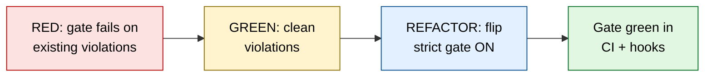
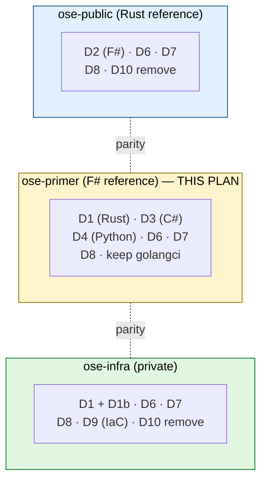

# lint-safety-parity (ose-primer)

> **Run type**: PLANNING ONLY for the parent multi-repo effort. This plan, however, is itself a
> fully executable five-document plan: once approved it is executed downstream via
> `plan-execution` to actually flip the strict gates ON in `ose-primer`. The parent
> `plan-multi-repo-parity-planning` workflow's terminal deliverable is this validated plan.

## Context

Three sibling repositories — [`ose-public`](https://github.com/wahidyankf/ose-public),
[`ose-primer`](https://github.com/wahidyankf/ose-primer), and `ose-infra` (private) — have
drifted apart on linting strictness and unsafe-Rust posture. The
`plan-multi-repo-parity-planning` workflow produced one plan per repo to bring them to **equal**
strictness. This is the **ose-primer** plan.

`ose-primer` is the downstream public template packaging the scaffolding layer (governance, AI
agents, skills, conventions, CI harness, polyglot demo apps). It is the **F# reference** for the
parity effort (its two F# projects already carry the target-standard strict stack), so it does
**no** F# work. It also has **active Go** (`apps/crud-be-golang-gin`, `libs/golang-commons`), so
it **keeps** its `.golangci.yml` while the other two repos remove their dead copies.

## Scope

### In scope (dimensions ose-primer executes)

- **D1** — Rust `forbid(unsafe_code)` + the full public `[lints]` standard on
  `apps/crud-be-rust-axum`. [Repo-grounded] The crate currently has **no `[lints]` table** and
  **no `forbid(unsafe_code)`**; no handwritten `unsafe` exists in `src/`.
- **D3** — C# strict gate on the two C# projects (`DemoBeCsas`, `DemoBeCsas.Tests`). [Repo-grounded]
  `TreatWarningsAsErrors` and `EnforceCodeStyleInBuild` are **already on**; the remaining gaps are
  `AnalysisLevel=latest-All` and enforcing `SonarAnalyzer.CSharp` at error severity.
- **D4** — Python strict on `apps/crud-be-python-fastapi`: swap `pyright` (`basic`) →
  `basedpyright` (`strict`) and expand the ruff `select` set.
- **D6** — Dockerfile lint (hadolint) across the repo.
- **D7** — Shell lint (shellcheck) across repo `scripts/`, `.husky/`, `.claude/hooks/`, and app
  entrypoint scripts.
- **D8** — GitHub Actions YAML lint (actionlint) across `.github/workflows/`.
- **M1** — record and honour the **ose-primer Sync Convention deviation** (main-to-main delivery
  bypasses the PR-only Safety Invariant; invoker explicitly approved).
- Rationale doc + governance/convention doc updates.

### Out of scope

- **D2 (F#)** — ose-primer is the F# reference; no F# work.
- **D5 (TS DDD import-boundaries)** — DROPPED from the whole effort; deferred to a dedicated future
  plan. The rationale doc documents the deferral and the exemption philosophy.
- **D9 (Terraform/Ansible/yamllint)** — ose-primer has no IaC; infra-only.
- **D10 (remove dead `.golangci.yml`)** — ose-primer **keeps** its `.golangci.yml` (active Go);
  no removal.
- Actual execution of sibling repos' plans (each repo executes its own).

## Approach summary

**Rollout policy = clean-then-gate** (locked). Each dimension first cleans existing violations as
TDD-shaped delivery steps (the failing gate is the RED test; cleanup is GREEN; flipping the gate
ON is REFACTOR), then enables the strict gate in both the CI quality-gate **and** the local
pre-commit/pre-push hooks. This prevents the first CI/hook run from breaking on the existing
backlog.

## Document map

| Document                       | Purpose                                                                |
| ------------------------------ | ---------------------------------------------------------------------- |
| [README.md](./README.md)       | This file — context, scope, navigation                                 |
| [brd.md](./brd.md)             | WHY — business rationale, impact, risks                                |
| [prd.md](./prd.md)             | WHAT — personas, user stories, Gherkin acceptance criteria             |
| [tech-docs.md](./tech-docs.md) | HOW — deviation matrix (verbatim), per-dimension configs, M1 deviation |
| [delivery.md](./delivery.md)   | DO — phased TDD checklist, worktree, quality gates, archival           |

## Sibling Plans

This plan is one of three in the `lint-safety-parity` family. Each repo references the other two:

- **ose-public**: `plans/in-progress/lint-safety-parity/README.md` [Repo-grounded] — exists at
  `/Users/wkf/ose-projects/ose-public/plans/in-progress/lint-safety-parity/README.md`. Covers D2
  (11 F# projects — largest), D6, D7, D8, D10 (remove). Public is the **Rust reference**.
- **ose-infra** (private): `plans/in-progress/lint-safety-parity/README.md` [Unverified] — expected
  sibling path; the infra plan was not yet present at authoring time. Covers D1 + D1b
  (`coralpolyp-be` + test refactor), D6, D7, D8, D9 (Terraform + Ansible + yamllint — largest),
  D10 (remove).

## Delivery mode

`main-to-main` — this plan and its execution push directly to `origin main`. For ose-primer this
deviates from the ose-primer Sync Convention's PR-only default; the deviation is **explicitly
approved by the invoker** and documented in [tech-docs.md](./tech-docs.md#m1--ose-primer-sync-convention-deviation)
and the rationale doc. See **M1** throughout.
