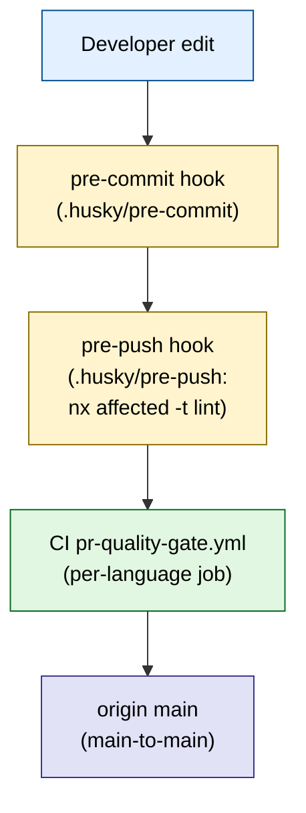
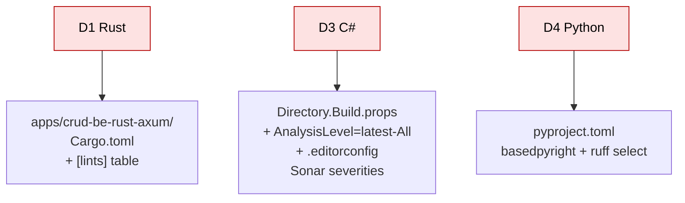
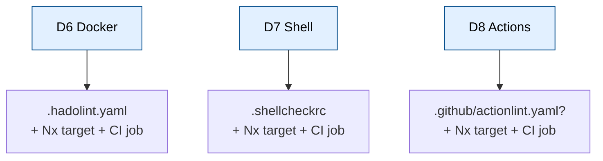

# Technical Documentation — lint-safety-parity (ose-primer)

## Architecture overview

This plan adds/strengthens static-analysis gates in `ose-primer` across six dimensions, wired
identically into three enforcement surfaces (matching how Prettier/markdownlint are already gated):



Language gates (D1/D3/D4) flow through existing Nx `lint`/`typecheck` targets already invoked by
`pr-quality-gate.yml` and `.husky/pre-push` (`npx nx affected -t typecheck lint test:quick
spec-coverage`). [Repo-grounded] Cross-cutting infra gates (D6/D7/D8) need **new** Nx targets on
`rhino-cli` (modeled on its existing `validate:*` targets such as `validate:links`,
`validate:mermaid` [Repo-grounded]) plus new CI jobs and hook wiring.





## Resolved deviation matrix (VERBATIM from the source-of-truth brief)

> The following matrix is reproduced **verbatim** from the parent effort's resolved-decisions
> brief. The **"primer executes?"** column marks which rows this plan acts on.

| #      | Dimension                                                   | Resolution                                                                                                                                                                                                                                                 | Which repos do work                                                                          | primer executes? |
| ------ | ----------------------------------------------------------- | ---------------------------------------------------------------------------------------------------------------------------------------------------------------------------------------------------------------------------------------------------------- | -------------------------------------------------------------------------------------------- | ---------------- |
| D1     | Rust `forbid(unsafe_code)` + full public `[lints]` standard | Align ALL Rust crates to public's verbatim standard                                                                                                                                                                                                        | primer: `crud-be-rust-axum`; infra: `coralpolyp-be`. public = reference (already compliant). | **YES**          |
| D1b    | Rust 2024 `env::set_var`/`remove_var` unsafe in tests       | Refactor tests to inject `Config` directly (no process-env mutation) → enables `forbid`                                                                                                                                                                    | infra: `coralpolyp-be/src/config.rs` test module                                             | NO (infra-only)  |
| D2     | F# strict stack                                             | Align public F# UP to primer's standard                                                                                                                                                                                                                    | public: all 11 F# projects. primer = reference (already strong).                             | NO (reference)   |
| D3     | C# strict baseline                                          | Add full strict gate                                                                                                                                                                                                                                       | primer: 2 C# projects                                                                        | **YES**          |
| D4     | Python strict                                               | Swap pyright→basedpyright strict + expand ruff                                                                                                                                                                                                             | primer: 1 Python project                                                                     | **YES**          |
| ~~D5~~ | ~~TS DDD import-boundaries~~                                | **DROPPED** from this effort — too language-divergent; deferred to a dedicated future plan. Document the deferral + exemption philosophy (DDD enforcement targets business-domain backends only; demo/content/frontend apps exempt) in each rationale doc. | none                                                                                         | NO (dropped)     |
| D6     | Dockerfile lint (hadolint)                                  | Add to all 3 repos                                                                                                                                                                                                                                         | all 3                                                                                        | **YES**          |
| D7     | Shell lint (shellcheck)                                     | Add to all 3 repos                                                                                                                                                                                                                                         | all 3                                                                                        | **YES**          |
| D8     | CI YAML lint (actionlint)                                   | Add to all 3 repos                                                                                                                                                                                                                                         | all 3                                                                                        | **YES**          |
| D9     | Terraform + Ansible/YAML lint                               | Add (tflint + `terraform fmt -check` + `terraform validate`; ansible-lint production+strict; yamllint)                                                                                                                                                     | infra ONLY (only repo with `.tf`/ansible)                                                    | NO (no IaC)      |
| D10    | Dead `.golangci.yml` (no active Go)                         | Remove from public + infra; KEEP primer's (has active Go)                                                                                                                                                                                                  | public, infra remove; primer keeps                                                           | NO (keeps it)    |

### Why ose-primer skips D1b, D2, D5, D9, D10

- **D1b** — only the infra `coralpolyp-be` test module mutates process-env under Rust 2024;
  ose-primer's `crud-be-rust-axum` has **no handwritten `unsafe`** [Repo-grounded: `grep -rn
  "unsafe" apps/crud-be-rust-axum/src` returns nothing], so `forbid(unsafe_code)` needs no test
  refactor here.
- **D2** — ose-primer's two F# projects already carry the target strict stack; primer **is** the
  F# reference. [Repo-grounded: `apps/crud-be-fsharp-giraffe/{src,tests}/*.fsproj` exist.]
- **D5** — dropped from the whole effort; deferred to a future plan. Exemption philosophy recorded
  in the rationale doc.
- **D9** — ose-primer has no `.tf` / Ansible. [Repo-grounded: no IaC under the repo.]
- **D10** — ose-primer has **active Go** (`apps/crud-be-golang-gin/go.mod`, `libs/golang-commons/go.mod`)
  [Repo-grounded], so its `.golangci.yml` is live and is **kept**.

## Current-state survey (Repo-grounded)

| Dimension  | Current state (verified)                                                                                                                                                                                                                                                  | Target                                                                                               |
| ---------- | ------------------------------------------------------------------------------------------------------------------------------------------------------------------------------------------------------------------------------------------------------------------------- | ---------------------------------------------------------------------------------------------------- |
| D1 Rust    | `Cargo.toml` has **no `[lints]` table**, edition 2021, `rust-version = 1.94.0`; lint target = `cargo clippy -- -D warnings`.                                                                                                                                              | Add verbatim public `[lints]` standard incl. `unsafe_code = "forbid"`; CI escalates `--all-targets`. |
| D3 C#      | `Directory.Build.props` already has `TreatWarningsAsErrors=true`, `EnforceCodeStyleInBuild=true`; **no `AnalysisLevel`**; `SonarAnalyzer.CSharp 10.8.0.113526` referenced but not enforced at error severity; lint target = `dotnet build /p:TreatWarningsAsErrors=true`. | Add `AnalysisLevel=latest-All`; enforce Sonar at error severity via `.editorconfig`.                 |
| D4 Python  | `pyproject.toml` uses `pyright 1.1.408` with `typeCheckingMode = "basic"`; ruff select = `E,F,I,N,UP,B,A,C4,PT`.                                                                                                                                                          | Swap to `basedpyright` strict; expand ruff select; add test per-file-ignores.                        |
| D6 Docker  | 30 Dockerfiles (excl. vendored); **no hadolint config**.                                                                                                                                                                                                                  | `.hadolint.yaml` (`failure-threshold: warning`); new Nx target + CI job + hook.                      |
| D7 Shell   | ~13 shell scripts under `scripts/`, `.husky/`, `.claude/hooks/`, app entrypoints; **no shellcheck config**.                                                                                                                                                               | `.shellcheckrc`; `shellcheck --severity=warning`; new Nx target + CI job + hook.                     |
| D8 Actions | 24 workflow YAMLs under `.github/workflows/`; **no actionlint**.                                                                                                                                                                                                          | actionlint + optional `.github/actionlint.yaml`; new Nx target + CI job + hook.                      |

> Counts are authoring-time estimates from `find` and are used only to size cleanup; the executor
> re-derives the exact lists during Phase 0.

## Per-dimension concrete strict configs (with research sources)

### D1 / Rust — target = public's existing crates verbatim

`[Web-cited]` Rust Edition Guide 2024 "Newly unsafe functions" —
<https://doc.rust-lang.org/edition-guide/rust-2024/newly-unsafe-functions.html> (accessed
2026-06-12): "std::env::set_var/remove_var are unsafe in Rust 2024 because POSIX setenv is not
thread-safe." Clippy configuration book — <https://doc.rust-lang.org/clippy/configuration.html>
(accessed 2026-06-12): "lint levels are configurable via the Cargo.toml `[lints]` table."
`[Repo-grounded]` the repo's own `docs/explanation/software-engineering/programming-languages/rust/code-quality-standards.md`
(present in ose-public at the same path).

Add verbatim to `apps/crud-be-rust-axum/Cargo.toml`:

```toml
[lints.rust]
unsafe_code = "forbid"

[lints.clippy]
pedantic = { level = "warn", priority = -1 }
nursery  = { level = "warn", priority = -1 }
unwrap_used                = "deny"
expect_used                = "deny"
panic                      = "deny"
undocumented_unsafe_blocks = "deny"
# documented allows that override pedantic at priority 0 (match public's set):
must_use_candidate = "allow"
missing_errors_doc = "allow"
missing_panics_doc = "allow"
```

- CI command (NOT redundant with the table — escalates warn-level groups):
  `cargo clippy --all-targets -- -D warnings`. The existing `crud-be-rust-axum:lint` target already
  runs `cargo fmt --check` + `cargo clippy -- -D warnings` [Repo-grounded]; update it to
  `--all-targets` so the warn-level pedantic/nursery groups become deny-on-CI.
- No D1b test refactor needed (no handwritten `unsafe` in `src/`).

### D3 / C# — primer

`[Web-cited]` Microsoft Learn "Code analysis in .NET" —
<https://learn.microsoft.com/en-us/dotnet/fundamentals/code-analysis/overview> (accessed
2026-06-12): "AnalysisLevel=latest-All enables all code-quality (CA) rules as warnings;
EnforceCodeStyleInBuild runs IDE code-style rules during CLI/CI builds."

Add to `apps/crud-be-csharp-aspnetcore/Directory.Build.props` (`TreatWarningsAsErrors` and
`EnforceCodeStyleInBuild` already present [Repo-grounded]):

```xml
<PropertyGroup>
  <TreatWarningsAsErrors>true</TreatWarningsAsErrors>
  <AnalysisLevel>latest-All</AnalysisLevel>   <!-- invoker held latest-All (max strict) -->
  <EnforceCodeStyleInBuild>true</EnforceCodeStyleInBuild>
</PropertyGroup>
```

- Enforce `SonarAnalyzer.CSharp` (+ optionally Meziantou.Analyzer, Roslynator) at error severity.
  SonarAnalyzer.CSharp `10.8.0.113526` is already referenced via `Directory.Packages.props` and the
  csproj `PackageReference` [Repo-grounded]; raise its severity to error in `.editorconfig`.
- `latest-All` is noisy on existing demo code → budget a larger cleanup backlog.

### D4 / Python — primer

`[Web-cited]` ruff rules — <https://docs.astral.sh/ruff/rules/> (accessed 2026-06-12): "rule
categories include E, W, F, B, UP, SIM, I, N, S, RUF, C4, T20, ANN." basedpyright —
<https://github.com/DetachHead/basedpyright> (accessed 2026-06-12): "a pyright fork with stricter
defaults and an 'all' mode above 'strict'."

- `basedpyright` with `typeCheckingMode = "strict"` (invoker chose swap from pyright). Replace the
  `pyright==1.1.408` dev dependency with `basedpyright` and change the `[tool.pyright]`/
  `[tool.basedpyright]` `typeCheckingMode` from `basic` to `strict`.
- ruff broad select: `E,W,F,B,UP,SIM,I,N,S,RUF,C4,T20,ANN` — EXCLUDE deprecated `ANN101`, `ANN102`;
  add `per-file-ignores` for tests (`S101`, `ANN`).

### D6 / Dockerfile (all 3)

`[Web-cited]` hadolint — <https://github.com/hadolint/hadolint> (accessed 2026-06-12):
"failure-threshold accepts error|warning|info|style|ignore; warning is the recommended CI gate."

- `.hadolint.yaml` with `failure-threshold: warning`, `trustedRegistries: [docker.io, ghcr.io]`,
  justified per-rule `ignore` (e.g. DL3008 for dev images).
- CI: `hadolint --failure-threshold warning <Dockerfile>` + local hook.

### D7 / Shell (all 3)

`[Web-cited]` shellcheck man page —
<https://github.com/koalaman/shellcheck/blob/master/shellcheck.1.md> (accessed 2026-06-12):
"--severity sets the minimum severity reported (error < warning < info < style); warning is the
pragmatic CI gate."

- `.shellcheckrc` (`shell=bash`, `external-sources=true`, justified disables).
- CI + hook: `shellcheck --severity=warning <scripts>`.

### D8 / GitHub Actions (all 3)

`[Web-cited]` actionlint — <https://github.com/rhysd/actionlint> (accessed 2026-06-12):
"type-checks ${{ }} expressions, validates runner labels and cron syntax, and integrates
shellcheck for run: scripts."

- actionlint in CI + local hook; optional `.github/actionlint.yaml` for config-variables. (Primer
  uses GitHub-hosted runners, so self-hosted runner labels are not required here.)

## Gating policy (locked)

- **Error-threshold in BOTH CI quality-gate AND local pre-commit/pre-push hooks**, matching how
  markdown/prettier are already gated [Repo-grounded: `.husky/pre-push` runs `npm run lint:md`].
- "Error threshold" operationally = fail on warning-and-above: shellcheck `--severity=warning`,
  hadolint `failure-threshold: warning`.
- **Clean-then-gate**: each dimension cleans violations FIRST (TDD: red gate → cleanup → flip),
  then enables the gate.

## M1 — ose-primer Sync Convention deviation

> **Prominent, deliberate deviation — explicitly approved by the invoker.**

The ose-primer Sync Convention mandates that **all** ose-primer mutations flow through a **draft
PR** (its PR-only Safety Invariant — referred to in the brief as "Safety Invariant 6"). Delivering
this plan **main-to-main** (pushing the plan files and, downstream, the gate changes directly to
`origin main`) **bypasses** that PR-only default.

- **Status**: ACCEPTED.
- **Authority**: the invoker explicitly approved pushing the primer plan directly to `origin main`.
- **Justification (verbatim from brief)**: "invoker explicit instruction; plan files are low-risk
  planning docs, not template-content mutations."
- **Recording requirement**: this deviation + justification is recorded **here** and in the
  rationale doc `docs/explanation/lint-safety-parity-decisions.md`. [Repo-grounded: the upstream
  ose-primer-sync convention is referenced from ose-public `AGENTS.md`; primer's own copy of the
  governance surface is consulted by the executor during delivery.]

```mermaid
%% M1 deviation: default vs approved path
flowchart LR
  subgraph default["Sync Convention default (bypassed)"]
    A["primer change"] --> B["draft PR"] --> C["review/merge"]
  end
  subgraph approved["M1 approved deviation"]
    D["primer change"] --> E["direct push to origin main"]
  end
  default -.M1 overrides.-> approved
  style default fill:#fde2e2,stroke:#b30000,color:#000
  style approved fill:#e2f7e2,stroke:#006b1f,color:#000
```

## File-impact summary

| File / path                                            | Change                                                                | New? |
| ------------------------------------------------------ | --------------------------------------------------------------------- | ---- |
| `apps/crud-be-rust-axum/Cargo.toml`                    | Add `[lints.rust]` + `[lints.clippy]` standard                        | edit |
| `apps/crud-be-rust-axum/project.json`                  | `lint` → `cargo clippy --all-targets -- -D warnings`                  | edit |
| `apps/crud-be-csharp-aspnetcore/Directory.Build.props` | Add `AnalysisLevel=latest-All`                                        | edit |
| `apps/crud-be-csharp-aspnetcore/.editorconfig`         | Raise Sonar rule severities to error                                  | edit |
| `apps/crud-be-python-fastapi/pyproject.toml`           | basedpyright strict + expanded ruff select + per-file-ignores         | edit |
| `.hadolint.yaml`                                       | hadolint config                                                       | new  |
| `.shellcheckrc`                                        | shellcheck config                                                     | new  |
| `.github/actionlint.yaml`                              | actionlint config (optional)                                          | new  |
| `apps/rhino-cli/project.json`                          | New `lint:dockerfiles`/`lint:shell`/`lint:actions` Nx targets         | edit |
| `.github/workflows/pr-quality-gate.yml`                | New hadolint/shellcheck/actionlint jobs + add to `quality-gate` needs | edit |
| `.husky/pre-commit` and/or `.husky/pre-push`           | Wire new infra-lint gates                                             | edit |
| `docs/explanation/lint-safety-parity-decisions.md`     | Rationale doc                                                         | new  |
| `repo-governance/development/infra/nx-targets.md`      | Document new lint targets                                             | edit |
| `docs/explanation/README.md`                           | Register new rationale doc                                            | edit |

> [Repo-grounded] `docs/explanation/` exists in ose-primer (verified `test -d docs/explanation`),
> so the rationale doc lands there directly — no tree creation needed.

## Dependencies (tooling)

- **hadolint** — Dockerfile linter (binary; install in CI via setup step).
- **shellcheck** — shell linter (binary).
- **actionlint** — GitHub Actions linter (binary).
- **basedpyright** — Python type-checker (pip/uv dev dependency, replaces pyright).
- Existing: Rust/clippy, .NET SDK ≥ 8 (TWAE for F#/C#), SonarAnalyzer.CSharp (already pinned).

## Testing strategy (TDD mapping)

Each Gherkin scenario in `prd.md` maps to a delivery step:

- **RED** = the gate failing on existing violations (or on a deliberately-injected violation for the
  "fails the build/gate" scenarios).
- **GREEN** = cleaning the violations.
- **REFACTOR/flip** = enabling the strict gate in config + Nx target + CI + hook.

Coverage by level: language gates (D1/D3/D4) verified via `nx run <project>:lint`/`:typecheck`;
infra gates (D6/D7/D8) verified via the new Nx targets and a deliberately-bad fixture removed after
verification.

## Rollback

Each dimension is independent and config-driven; rollback = revert the config/target/CI/hook edits
for that dimension. No data migrations, no irreversible steps.

## Research sources (cited from brief; `[Web-cited]`)

- Rust Edition Guide 2024 "Newly unsafe functions"; Clippy configuration book.
- Microsoft Learn "Code analysis in .NET" (AnalysisLevel/AnalysisMode, EnforceCodeStyleInBuild).
- docs.astral.sh/ruff; github.com/DetachHead/basedpyright.
- github.com/hadolint/hadolint; github.com/koalaman/shellcheck; github.com/rhysd/actionlint.
