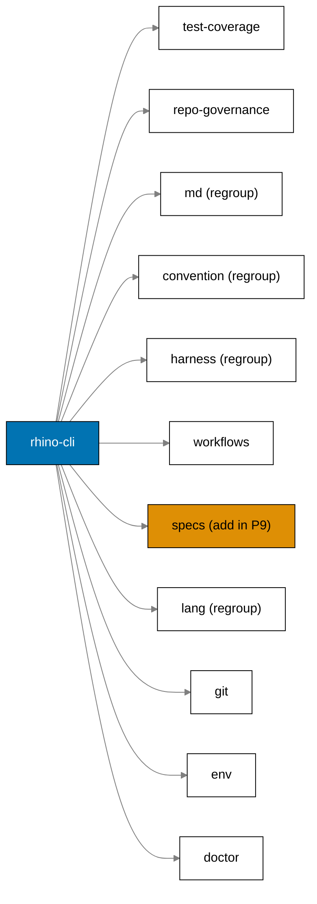
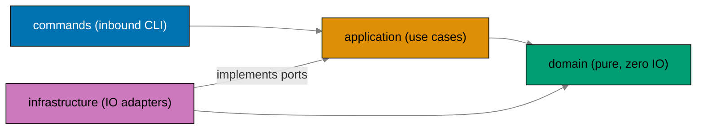
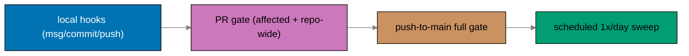
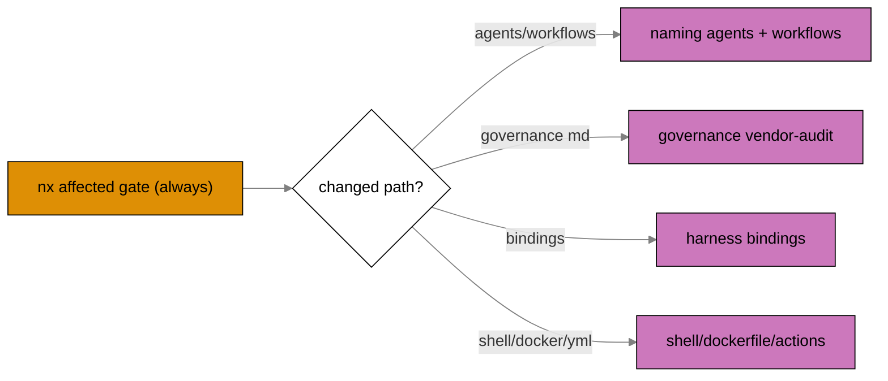
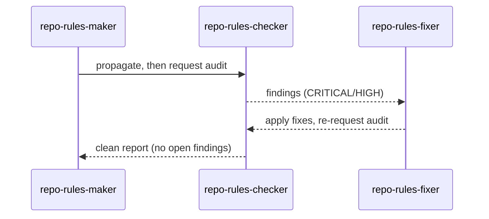
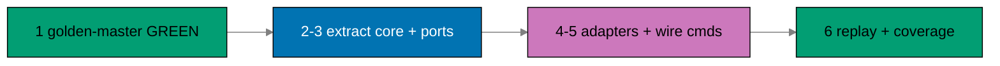
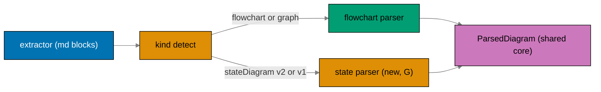
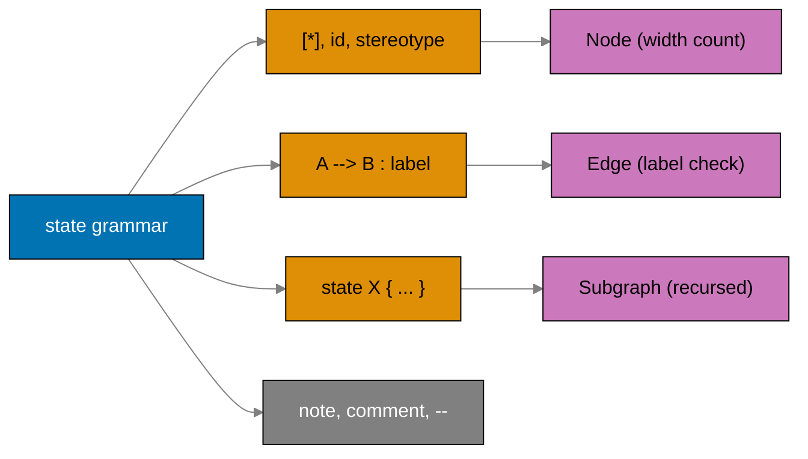

# Tech Docs — Standardize Repo Toolchain Parity (ose-primer)

This document explains **how** the convergence is built. The **why** lives in [brd.md](./brd.md);
the **what** lives in [prd.md](./prd.md). All claims are labeled with confidence; `[Repo-grounded]`
claims were verified against the current worktree, `[Web-cited]` against external docs accessed
2026-06-11.

This plan converges the **entire repository toolchain** — CI workflows, git hooks, the `rhino-cli`
CLI (architecture, command surface, Nx target names), and the governing docs — across `ose-public`,
`ose-infra`, and `ose-primer`. It supersedes the earlier CI-only scope. `ose-public` is the agreed
**reference repo** for the rhino-cli hexagonal migration (workstream C), the union command set
(workstream D), and the state-diagram golden corpus (workstream G): it authors those first; `ose-primer`
ports from it. For CI/hooks/target-naming/docs (workstreams A/B/E/F) there is **no single anchor** —
the target is a fixed best-of-breed union, and `ose-primer` closes only its own gaps.

## Reference Documents

- [CI/CD Conventions](../../../repo-governance/development/infra/ci-conventions.md) — the standard
  this plan aligns and extends.
- [GitHub Actions Workflow Naming Convention](../../../repo-governance/development/infra/github-actions-workflow-naming.md)
- [Nx Target Standards](../../../repo-governance/development/infra/nx-targets.md)
- Cross-Language Lint Strictness — `repo-governance/development/quality/cross-language-lint-strictness.md`
  (plain path, not a link: this doc does **not exist in ose-primer yet** — it is **created** in Phase 11)
- [CI Post-Push Verification](../../../repo-governance/development/workflow/ci-post-push-verification.md)
- [CI Monitoring](../../../repo-governance/development/workflow/ci-monitoring.md)
- [Test-Driven Development Convention](../../../repo-governance/development/workflow/test-driven-development.md)
- [Repo Rules Quality Gate workflow](../../../repo-governance/workflows/repo/repo-rules-quality-gate.md)
- `ci-checker` agent: [.claude/agents/ci-checker.md](../../../.claude/agents/ci-checker.md)
- `ci-fixer` agent: [.claude/agents/ci-fixer.md](../../../.claude/agents/ci-fixer.md)
- `repo-rules-maker` agent: [.claude/agents/repo-rules-maker.md](../../../.claude/agents/repo-rules-maker.md)

## Converged Toolchain Target (shared across the three-repo sibling set)

> The block below is embedded **verbatim** from the canonical contract
> (`standardize-repo-toolchain-parity`). All three sibling plans embed the identical text; per-repo
> differences live in the [Deviation Matrix](#deviation-matrix).

This is the **fixed end-state** every plan converges to — a static spec, no single anchor
for A/B/E/F. There is **no single anchor repo**: the target is the best-of-breed union
across the three toolchains as of 2026-06-12. For C/D, `ose-public` is the agreed
reference implementation (chosen for source-of-truth status per AGENTS.md), not a quality
ranking.

### A — CI workflows

| Dimension                      | Converged target                                                                                                                                                                                                                                                                                                                                                                                                                                                                                                                                                                                                                                                       |
| ------------------------------ | ---------------------------------------------------------------------------------------------------------------------------------------------------------------------------------------------------------------------------------------------------------------------------------------------------------------------------------------------------------------------------------------------------------------------------------------------------------------------------------------------------------------------------------------------------------------------------------------------------------------------------------------------------------------------- |
| `actions/checkout` major       | `@v6`                                                                                                                                                                                                                                                                                                                                                                                                                                                                                                                                                                                                                                                                  |
| Workflow file + `name:` naming | canonical scheme, identical across repos for every shared workflow: **file** = kebab-case `<verb>-<noun>[-<qualifier>].yml` (e.g. `validate-markdown.yml`, `publish-images.yml`, `_reusable-backend-lint.yml`); **`name:`** = Title Case matching the file (`Validate Markdown`); **job ids** = kebab-case; the PR-gate aggregate job keeps the branch-protection-required name (`Quality gate`) — any rename of a required-check job is paired with a `[HUMAN]` branch-protection update. **Heavy-test workflows** (Test Lifecycle Architecture) follow `test-and-deploy-{app-group}-development.yml` + `test-{app-group}-staging.yml` (staging absent in ose-primer) |
| Non-TS PR-gate test semantics  | `nx affected` (single-project governance gates may keep `run-many`)                                                                                                                                                                                                                                                                                                                                                                                                                                                                                                                                                                                                    |
| Reusable-workflow pattern      | adopted (`_reusable-*.yml` + thin callers)                                                                                                                                                                                                                                                                                                                                                                                                                                                                                                                                                                                                                             |
| Concurrency                    | canonical block on every workflow: `group: ${{ github.workflow }}-${{ github.ref }}`, `cancel-in-progress: ${{ github.event_name == 'pull_request' }}`                                                                                                                                                                                                                                                                                                                                                                                                                                                                                                                 |
| Lint-gate jobs                 | three tool-named CI jobs: `shellcheck`, `hadolint`, `actionlint`                                                                                                                                                                                                                                                                                                                                                                                                                                                                                                                                                                                                       |
| Governance jobs                | `naming` (where `.claude/agents/`) + `specs-gate` (where `specs/`)                                                                                                                                                                                                                                                                                                                                                                                                                                                                                                                                                                                                     |
| `specs:gherkin-cardinality`    | Nx target `specs:gherkin-cardinality-validation`, run in the **`specs-gate`** job (moved from the governance/markdown surface — `.feature` files live under `specs/`)                                                                                                                                                                                                                                                                                                                                                                                                                                                                                                  |
| Main-branch CI                 | the **full quality gate runs on `push` to `main`** (post-merge), not only on `pull_request`; `validate-*` workflows present + identically triggered everywhere                                                                                                                                                                                                                                                                                                                                                                                                                                                                                                         |
| Scheduled cadence              | governance/scheduled validators twice-daily WIB (`0 23 * * *`, `0 11 * * *`); **heavy-test CRON** (Test Lifecycle Architecture — `test:integration` + `test:e2e` per app-group) **2× WIB for ose-public + ose-infra, 1×/day for ose-primer**                                                                                                                                                                                                                                                                                                                                                                                                                           |

### B — Git hooks (canonical, identical behavior)

| Hook         | Converged target                                                                                                                                                                                                                                                                                                                                                                                                                                                                                                                                                                                                                                                         |
| ------------ | ------------------------------------------------------------------------------------------------------------------------------------------------------------------------------------------------------------------------------------------------------------------------------------------------------------------------------------------------------------------------------------------------------------------------------------------------------------------------------------------------------------------------------------------------------------------------------------------------------------------------------------------------------------------------ |
| `commit-msg` | `npx --no -- commitlint --edit "$1"`; commitlint config identical across repos                                                                                                                                                                                                                                                                                                                                                                                                                                                                                                                                                                                           |
| `pre-commit` | `git-identity-check.sh` → `check-no-env-staged.sh` → canonical staged-file lint (`shellcheck`/`hadolint`/`actionlint` on staged files, graceful skip if tool absent) → `rhino-cli git pre-commit` built with `--release` → **`nx affected -t test:quick`** (the app bundle **format + lint + typecheck + `test:unit`**, mocked; changed apps). **Infra-only deviation**: terraform/ansible/yamllint staged conditionals (IaC surface).                                                                                                                                                                                                                                   |
| `pre-push`   | **`nx affected -t specs:coverage test-coverage`** (per-app: every `.feature` implemented across unit+integration+e2e, + line-coverage threshold) → `nx affected -t specs:tree-validation specs:links-validation specs:counts-validation specs:adoption-validation` → `markdown:lint` → `env:validation` → conditional (changed-path-gated): `naming:harness-validation`, `naming:workflows-validation`, `governance:vendor-audit-validation`, `cross-vendor:parity-validation`, `harness:bindings-validation`. **`test:integration`/`test:e2e` are NOT here — CRON only ([Test Lifecycle Architecture](#test-lifecycle-architecture-spec-shared-three-level-testing)).** |

### C — rhino-cli architecture

| Dimension    | Converged target                                                                                                                                                                                                                                                   |
| ------------ | ------------------------------------------------------------------------------------------------------------------------------------------------------------------------------------------------------------------------------------------------------------------ |
| Architecture | hexagonal (hybrid kernel + per-feature vertical slices): `src/domain/` (pure, zero IO), `src/application/` (use cases + port defs), `src/infrastructure/` (outbound adapters), `src/commands/` (inbound CLI adapter) — identical layout across repos (see BLOCK 4) |
| Behavior     | output surface **frozen**; golden-master CLI suite byte-verifies against the Phase 0 baseline                                                                                                                                                                      |

### D — rhino-cli command surface (union superset, identical in all repos)

`TestCoverage`, `RepoGovernance`, `Convention`, `Md`, `Docs`, `Harness`, `Workflows`, `Specs`,
`Lang`, `Git`, `Env` (+ standalone `Doctor`). Port direction: contract/JVM commands (now under
`Specs`+`Lang`) → public (ref: infra/primer); `Specs` structural set → primer (ref: public/infra).
Even where a subcommand's surface is unused in a repo, the command exists for an identical CLI.

**Grouping principle — a command group = the scope it operates on** (Phase 9a regroup). Commands
are filed by their primary operation target: `repo-governance/`-exclusive ops under `repo-governance`;
`docs/`-exclusive ops under `docs` (none today — reserved); `specs/` ops under `specs`; general
markdown mechanics (any root) under `md`; repo-wide non-doc rule audits (code/config/single-file)
under `convention`; AI-harness config under `harness`; language-source checks under `lang`. This
drives the Phase 9 folds and moves below.

**Folds & moves** (all Phase 9a, reference-first):

- `SpecCoverage` → `specs validate coverage` (Nx `spec-coverage` → `specs:coverage`, the one
  per-project `specs:*` target). `Ddd` → `specs validate bc`/`specs validate ul`. `Contracts` →
  `specs clean java-imports`/`specs scaffold dart`. `gherkin-keyword-cardinality` → `specs validate
gherkin-cardinality` (`.feature` files live under `specs/`).
- `Docs` group → **`md`** (its validators are general markdown, multi-root — not `docs/`-specific).
  `frontmatter-audit` → `md validate frontmatter-dates`, `readme-index-audit` → `md validate
readme-index` (broad markdown scanners moved out of governance).
- `emoji-audit`/`license-audit`/`agents-md-size` → new **`convention`** group (repo-wide rule audits
  over code/config/single files, not a doc tree).
- `Agents` → **`harness`** (manages cross-harness bindings, not just agent defs). `Java` → **`lang`**
  (`lang java validate null-safety-annotations`, nested by language).

**Uniform grammar — `<group> [<language>] <verb> [<object>]`**: every read-only check is
`validate <object>`; `<group> audit` is the group run-all aggregate; generators/mutators use a
fixed verb set (`sync`/`emit`/`clean`/`scaffold`/`init`/`backup`/`restore`; `test-coverage`:
`validate`/`diff`/`merge`). Full before/after in
[§ (a-ter) BLOCK 11](#a-ter-rhino-cli-verb-first-subcommand-rename-beforeafter). The CLI grammar
deliberately diverges from the object-verb Nx target scheme (`{domain}:{work}`).

The union surface is 11 top-level groups plus standalone `doctor`. **Regroup** = the group is
renamed/reshaped from today's surface; **Add in P9** = the group is absent in `ose-primer` today
(ported from the public/infra reference):

| Group             | In `ose-primer` today | Handles                                                                                                                                                                | When/where triggered                                                                                                                                       |
| ----------------- | --------------------- | ---------------------------------------------------------------------------------------------------------------------------------------------------------------------- | ---------------------------------------------------------------------------------------------------------------------------------------------------------- |
| `test-coverage`   | yes                   | Code line-coverage from LCOV: threshold gate (`validate`), diff-coverage, multi-report merge.                                                                          | `validate` rides each project's `test:quick` → **pre-push** (affected) + **PR gate** per-language jobs (affected). `diff`/`merge` on-demand.               |
| `repo-governance` | yes (reduced)         | `repo-governance/`-**exclusive** audits only: `validate vendor` (vendor-neutrality), `validate layer-coherence`, `validate traceability`; `audit` runs all three.      | `validate vendor` → **pre-push** (changed-path); `repo-governance audit` → **scheduled CRON** sweep.                                                       |
| `convention`      | yes (regroup)         | Repo-wide rule audits over code/config/single files: `validate emoji` (forbidden-type emoji), `validate license` (`LICENSE` presence), `validate agents-md-size`.      | `convention audit` → **scheduled CRON** sweep + **PR gate** where wired; `validate emoji`/`license` repo-wide.                                             |
| `md`              | yes (regroup)         | General markdown mechanics, any root: `validate naming`/`frontmatter`/`frontmatter-dates`/`heading-hierarchy`/`links`/`mermaid`/`readme-index`; `audit` runs all.      | `mermaid`/`heading-hierarchy`/`links` → **pre-commit** (staged; links full); `markdown:lint` → **pre-push** + **PR gate** (full); broad audits → **CRON**. |
| `docs`            | reserved              | `docs/`-**exclusive** operations. None exist today — reserved bucket for future Diátaxis-specific validators.                                                          | — (no command).                                                                                                                                            |
| `harness`         | yes (was `agents`)    | AI-harness config (`.claude/` source + `.opencode/`/`.amazonq/` mirrors): `validate naming`/`claude`/`sync`/`bindings`/`duplication`; `sync opencode`; `emit amazonq`. | binding `sync` → **pre-commit** (auto-staged); `validate naming`/`bindings` → **pre-push** (changed-path) + **PR gate** `naming` job (full).               |
| `workflows`       | yes                   | Workflow-definition files under `repo-governance/workflows/`: `validate naming` (filename suffix + `name:`-field match).                                               | `naming:workflows-validation` → **pre-push** (changed-path) + **PR gate** `naming` job (full).                                                             |
| `specs`           | **Add in P9**         | `specs/` tree: `validate adoption`/`counts`/`links`/`tree`/`coverage`/`bc`/`ul`/`gherkin-cardinality` + contract codegen (`clean java-imports`, `scaffold dart`).      | structural validates + `coverage` → **pre-push** (affected); **PR gate** `specs-gate` job (full, now incl. `gherkin-cardinality`). Codegen on-demand.      |
| `lang`            | yes (was `java`)      | Language-source correctness checks: `java validate null-safety-annotations` (JVM annotations on generated code). Active in ose-primer (carries the JVM surface).       | Rides the JVM lint target at **pre-push**/**PR gate** (ose-primer carries Java apps).                                                                      |
| `git`             | yes                   | The Rust pre-commit engine the Husky hook wraps: identity, staged-file format, markdown link/lint/mermaid/heading, binding sync — one fast pass.                       | **Every commit** — the `pre-commit` Husky hook _is_ a thin wrapper over `rhino-cli git pre-commit`.                                                        |
| `env`             | yes                   | `.env` secret-file lifecycle (sanctioned path; agents may not touch real `.env`): `init`/`backup`/`restore` + `validate` (code↔config drift).                          | `validate` (`env:validation`) → **pre-push** + **push-to-main** (full). `init`/`backup`/`restore` manual on-demand.                                        |
| `doctor`          | yes                   | Local-toolchain probe: Node/Volta, Rust, language toolchains, lint tools — reports missing/wrong-version; `--fix` installs. Makes a fresh clone reproducible.          | On `npm install` (postinstall) + manual (`npm run doctor`, worktree init). Not a CI gate.                                                                  |

> Contract codegen (`specs clean java-imports`, `specs scaffold dart`) and `lang java validate
null-safety-annotations` are **active in ose-primer** (it carries the JVM/contract surface) — these
> are NOT dormant here. In `ose-public` they are dormant (no JVM source or generated contracts yet).



### E — Nx target naming (`{domain}:{work}`)

All `rhino-cli` governance/validation/lint/check targets follow `{domain}:{work}` (BLOCK 3),
identical in all three repos. Standard Nx project-lifecycle targets (`build`, `lint`,
`typecheck`, `test:unit`, `test:quick`, `test:integration`) keep their platform-convention
names; `spec-coverage` is renamed to `specs:coverage` repo-wide (all projects + callers).

### F — Governance docs

Every repo carries: a `## CI Parity Checklist` / toolchain-parity checklist in
`ci-conventions.md`; the hexagonal-CLI convention; the new `{domain}:{work}` target-naming
convention; the canonical git-hook-lifecycle convention; `cross-language-lint-strictness.md`.
The plan's final phase **updates all related docs, runs `repo-rules-maker` to propagate,
then runs the `repo-rules-quality-gate` workflow (repo-rules-checker → repo-rules-fixer loop)
until clean — before the plan is marked done**.

### G — Mermaid state-diagram validation (rhino-cli)

The `mermaid:validation` discipline (width rule: ≤4 nodes per rank; label rule: ≤30 chars
per `<br/>`-segment) currently applies **only to flowchart/graph diagrams** in all three
repos — `parse_diagram` returns node count `0` for every non-flowchart header, so
`stateDiagram-v2` / `stateDiagram` (v1) silently escape the gate. Converged target:

| Dimension             | Converged target                                                                                                                                                                 |
| --------------------- | -------------------------------------------------------------------------------------------------------------------------------------------------------------------------------- |
| State-diagram parsing | `state.rs` front-end parses `stateDiagram-v2` + `stateDiagram` (v1) into the shared `ParsedDiagram`; lives inside the Mermaid hexagonal slice's `domain/`                        |
| Width rule            | applies to state diagrams; `[*]` pseudostates + `<<choice>>`/`<<fork>>`/`<<join>>` stereotypes count toward the ≤4-per-rank width; composite `state X { }` = subgraph (recursed) |
| Label rule            | checks BOTH state display labels AND transition-edge labels (`A --> B : text`) against ≤30 (stricter than flowchart, which checks node labels only)                              |
| `direction`           | `TB\|BT\|LR\|RL` only (`TD` rejected — invalid for state diagrams); `LR`/`RL` map to the depth-as-horizontal axis like flowcharts                                                |
| Shared golden corpus  | one identical fixture set (`.md` + expected violation JSON) committed to all three repos' rhino-cli test suites — the machine-checked parity lock                                |
| Repo-wide cleanup     | every violating state diagram fixed repo-wide INCLUDING `plans/done/` and gate-excluded paths (D-CLEAN, aggressive)                                                              |
| Gate wiring           | UNCHANGED — state diagrams ride the existing `mermaid:validation` target / pre-commit / CI; they stop being skipped because the kind-detector recognizes their header            |

Reference-first: ose-public authors `state.rs` + the golden corpus; infra/primer mirror the
identical parser semantics + fixtures. **Depends on workstream C** — the Mermaid feature is
migrated into its hexagonal slice first, then state support is added to that slice. See
BLOCK 10 for the full design.

### Convergence status per repo (baseline 2026-06-12)

| Dimension                   | ose-public                           | ose-infra                                                     | ose-primer                                  |
| --------------------------- | ------------------------------------ | ------------------------------------------------------------- | ------------------------------------------- |
| A `checkout@v6`             | done                                 | gap `@v4`                                                     | done                                        |
| A non-TS `nx affected`      | gap `run-many`                       | done                                                          | done                                        |
| A reusable workflows        | done                                 | gap (monolith)                                                | done                                        |
| A concurrency               | gap (0)                              | gap (pr-gate 0 + 3 drifted)                                   | gap (0)                                     |
| A lint jobs tool-named      | gap (`shell`/`dockerfile`/`actions`) | gap (`infra-lint` combined)                                   | done (reference)                            |
| A gherkin target+CI         | gap                                  | done                                                          | done                                        |
| A `naming`+`specs-gate`     | done                                 | gap (both)                                                    | gap (`specs-gate`)                          |
| A full gate on push-to-main | gap                                  | gap                                                           | gap                                         |
| A scheduler 2× WIB          | done (mixed)                         | gap (1×)                                                      | gap (weekly)                                |
| B hooks canonical           | partial                              | partial (debug build; lint-staged-config.sh; no naming conds) | partial (`env:validate` name)               |
| C hexagonal arch            | gap (reference — do first)           | gap (port)                                                    | gap (port; placeholders only)               |
| D union commands            | gap (+`lang`, +`specs` codegen)      | done                                                          | gap (+`specs` structural)                   |
| E `{domain}:{work}` targets | gap                                  | gap                                                           | gap (incl. `env:validate`→`env:validation`) |
| F governance docs           | gap                                  | gap (missing lint-strictness doc)                             | gap (missing lint-strictness doc)           |
| G state-diagram validation  | gap (reference — authors corpus)     | gap (mirror)                                                  | gap (mirror)                                |

Legend: _done_ = at target (confirm only) · _gap_ = closed by this repo's plan · _partial_ = some sub-items done.

### ose-primer-specific reading of the convergence table

`ose-primer` is the **most converged sibling** on the A dimensions — it was the reference for the
tool-named lint-job scheme, and it already runs `nx affected` per-language, ships reusable workflows,
uses `actions/checkout@v6`, and wires the gherkin keyword-cardinality validator into CI. The converged
"what" lives in §A–§G above and the per-workstream rationale in the [Design Decisions](#design-decisions).
This section records only the **ose-primer-specific repo-grounded facts** that drive those decisions —
it does not restate the converged target.

- **A/B (CI + hooks)** — the concrete ose-primer CI **gaps** are: **no concurrency on any of its ~23
  workflows** (its main A gap — `grep -l "concurrency:" .github/workflows/*.yml` → 0); **no
  `specs-gate` job** (it carries the `naming` job but not `specs-gate`); and the **full quality gate
  on push-to-main** (`pr-quality-gate.yml` is `pull_request`-only today). The per-language
  `test-crud-*` app schedulers run weekly `0 10 * * 5` and **stay weekly** (a recorded portfolio
  cadence); ose-primer runs **no governance sweep**, so there is no 2× WIB cron to converge.
  **Confirm-only** (already at target): `nx affected` on every per-language job (`pr-quality-gate.yml`
  runs `npx nx affected ... --projects='tag:lang:*'` for
  golang/java/kotlin/fsharp/csharp/python/rust/elixir/clojure/dart), the tool-named lint jobs
  (`shellcheck`/`hadolint`/`actionlint` — ose-primer was the reference for this scheme), and the
  gherkin keyword-cardinality target + CI wiring (`validate:gherkin-keyword-cardinality` present). The
  hook convergence is in [D11](#d11--git-hook-convergence). [Repo-grounded —
  `.github/workflows/pr-quality-gate.yml` `on: pull_request` only; `apps/rhino-cli/project.json`]
- **Go RETAINED (full polyglot)** — ose-primer is the **polyglot template** and **keeps Go**: it
  carries `apps/crud-be-golang-gin/` and Go E2E coverage (`git ls-files '*.go' ':!:archived/**'` → 75
  files). There is **no Go-strip** in ose-primer — the language matrix stays the full polyglot set
  (TS, Go, JVM, .NET, Python, Rust, Elixir, Clojure, Dart). The PR-gate `nx affected` projects filter
  keeps the full per-language tag set. This is the ose-primer reading of the Deviation-Matrix
  Language-matrix row. [Repo-grounded: `apps/crud-be-golang-gin/`; 75 tracked `.go` files]
- **No image publishing** — ose-primer is a **demo/showcase template** that ships no deployable
  images, so it carries **no image-publishing workflow** (the lifecycle-table push-to-main row reads
  `primer: none`). [Repo-grounded — no `publish-images`/GHCR workflow under `.github/workflows/`]
- **C/G (hexagonal arch + state validation — PORT from `ose-public`)** — `ose-public` is the
  **reference** for both; ose-primer ports. ose-primer's rhino-cli carries a **placeholder hexagonal
  layout** (`src/domain/`, `src/application/`, `src/infrastructure/`, `src/commands/` exist) **still
  alongside a residual `src/internal/` tree** (the real logic lives there, incl.
  `src/internal/mermaid/`). The state-diagram escape hatch is
  `apps/rhino-cli/src/internal/mermaid/parser.rs` — the header regex matches only `flowchart|graph`,
  so `parse_diagram` returns count `0` for non-flowchart headers (see the
  `non_flowchart_returns_zero_count` test). The migration + state-front-end design are in
  [D7](#d7--hexagonal-architecture-port-from-ose-public), the
  [Hexagonal Architecture Design](#hexagonal-architecture-design-rhino-cli--reference-migration), and
  the [State-Diagram Validation Design](#mermaid-state-diagram-validation-design-workstream-g).
  [Repo-grounded — `apps/rhino-cli/src/internal/` present; `internal/mermaid/parser.rs`]
- **D (union commands + regroup — PORT from `ose-public`)** — ose-primer is missing the `specs`
  **structural set** (it carries `SpecCoverage` but not `Specs`/`Ddd`); current command set is
  TestCoverage, RepoGovernance, Docs, Agents, Workflows, **SpecCoverage**, Git, Env, **Java**,
  **Contracts** (it **already carries `Java` + `Contracts`**). The Phase 9a **scope-based regroup**
  reshapes this flat set → `md` (was `docs`), `repo-governance` (reduced), `convention`, `docs`
  (reserved), `harness` (was `agents`), `workflows`, `specs` (absorbs `spec-coverage` + the ported
  `ddd`/`contracts`/`gherkin` folds + the **new specs structural set**), `lang` (was `java`), `git`,
  `env`. So primer's D-port is the **`specs` structural set** (`validate adoption`/`counts`/`tree`/
  `links` + the `bc`/`ul` from the folded `ddd`), and `SpecCoverage` folds into `specs validate
coverage`. The port + rationalization decision is [D8](#d8--union-command-surface-add-specs--ddd).
  [Repo-grounded — `apps/rhino-cli/src/cli.rs` enumerates `SpecCoverage`, `Java`, `Contracts`; no
  `Specs`/`Ddd`]
- **E (target naming)** — `spec-coverage` is present in **every** app/lib `project.json`; the
  source-side names are the `validate:*` forms, and the env validator's **source name is `env:validate`**
  (not `validate:env`) → renames to `env:validation`. The full rename — incl. the Phase 9a re-domaining
  `validate:naming-agents`→`naming:harness-validation`, `ddd:*`/`gherkin:*`→`specs:*`, governance audit
  targets→`md:*`/`convention:*`, `java:*`→`lang:*` — is the
  [rename map](#domainwork-nx-target-rename-map) ([D9](#d9--domainwork-target-naming--spec-coveragespecscoverage)).
  [Repo-grounded — `apps/rhino-cli/project.json` carries `env:validate` and `spec-coverage`]
- **F (governance docs)** — `cross-language-lint-strictness.md` is **missing in ose-primer** and is
  **created** in Phase 11 (not merely confirmed); all other BLOCK 6 docs update in Phase 11
  ([D5](#d5--governance-alignment--citoolchain-parity-checklist),
  [D12](#d12--final-governance-gate-repo-rules-quality-gate)). [Repo-grounded — the doc is absent under
  `repo-governance/development/quality/`]

## Deviation Matrix

> The block below is embedded **verbatim** from the canonical contract.

Intentional per-repo differences — **recorded, not converged**.

| Deviation                             | ose-public                                    | ose-infra                                                         | ose-primer                                                             | Rationale                                                                                                                                                                                                                                                                           |
| ------------------------------------- | --------------------------------------------- | ----------------------------------------------------------------- | ---------------------------------------------------------------------- | ----------------------------------------------------------------------------------------------------------------------------------------------------------------------------------------------------------------------------------------------------------------------------------- |
| Runner target                         | `ubuntu-latest`                               | `[self-hosted, linux, ose-infra-runner]`                          | `ubuntu-latest`                                                        | infra needs warm Docker/Terraform/Ansible + on-prem reach                                                                                                                                                                                                                           |
| Language matrix                       | TS + F#/.NET + Rust                           | TS + Go + Rust                                                    | full polyglot (TS, Go, JVM, .NET, Python, Rust, Elixir, Clojure, Dart) | detection follows each repo's real portfolio; primer is the polyglot template. **ose-public has NO Go** — its only CLIs (`ayokoding-cli`, `ose-cli`) are Rust; Go survives only under `archived/`. Strip Go from ose-public CI matrix, doctor scope, and AGENTS.md (workstream A/F) |
| Container-image publishing            | yes (`publish-images.yml` → GHCR)             | yes (app/service images, self-hosted)                             | **NONE** — demo template; builds no container images                   | ose-primer is a demo/showcase template; it ships no deployable images, so it carries no image-publishing workflow                                                                                                                                                                   |
| `npm` install flag                    | `npm ci`                                      | `npm ci --ignore-scripts`                                         | `npm ci`                                                               | self-hosted hardening on the persistent infra runner                                                                                                                                                                                                                                |
| `setup-docker` composite              | absent                                        | present                                                           | absent                                                                 | hosted runners ship Docker; self-hosted must warm it                                                                                                                                                                                                                                |
| Rust toolchain action                 | `actions-rust-lang/setup-rust-toolchain@v1`   | `dtolnay/rust-toolchain@stable`                                   | `actions-rust-lang/setup-rust-toolchain@v1`                            | existing infra composite; kept to avoid churn                                                                                                                                                                                                                                       |
| IaC lint surface                      | absent                                        | `iac-lint` job + pre-push terraform/ansible/yamllint conditionals | absent                                                                 | infra-only — terraform/ansible/yaml exist only in ose-infra                                                                                                                                                                                                                         |
| App-deploy / scheduled-test workflows | 6 web-app deploy/test schedulers              | `test-coralpolyp`                                                 | 15 `test-crud-*` per-language                                          | each repo's app portfolio differs; only the governance scheduler cadence is converged                                                                                                                                                                                               |
| Heavy-test CRON cadence (BLOCK 13)    | **2× WIB**                                    | **2× WIB**                                                        | **1×/day**                                                             | primer is a demo template — lighter cadence for the integration/e2e CRON                                                                                                                                                                                                            |
| Staging area (heavy-test BLOCK 13)    | yes — builds staging container + staging test | yes — builds staging container + staging test                     | **NONE** — no staging container build, no staging test                 | primer has no staging area; runs development-level heavy tests only (consistent with the no-container-images deviation)                                                                                                                                                             |

Note: command-surface, architecture, and target names that were previously per-repo are now
**converged** (workstreams C/D/E) and are therefore NOT in this matrix.

## `{domain}:{work}` Nx Target Rename Map

> The block below is embedded **verbatim** from the canonical contract.

Canonical names (apply in all three repos; update every caller — hooks, workflows,
`package.json` scripts, docs):

| Current (varies by repo)                                             | Canonical `{domain}:{work}`            |
| -------------------------------------------------------------------- | -------------------------------------- |
| `validate:env` / `env:validate`                                      | `env:validation`                       |
| `validate:specs-tree`                                                | `specs:tree-validation`                |
| `validate:specs-links`                                               | `specs:links-validation`               |
| `validate:specs-counts`                                              | `specs:counts-validation`              |
| `validate:specs-adoption`                                            | `specs:adoption-validation`            |
| `validate:gherkin-keyword-cardinality`                               | `specs:gherkin-cardinality-validation` |
| `validate:links`                                                     | `links:validation`                     |
| `validate:mermaid`                                                   | `mermaid:validation`                   |
| `validate:heading-hierarchy`                                         | `headings:hierarchy-validation`        |
| `validate:naming-agents`                                             | `naming:harness-validation`            |
| `validate:naming-workflows`                                          | `naming:workflows-validation`          |
| `validate:repo-governance-vendor-audit`                              | `governance:vendor-audit-validation`   |
| `validate:cross-vendor-parity`                                       | `cross-vendor:parity-validation`       |
| `validate:harness-bindings` (or `npm run validate:harness-bindings`) | `harness:bindings-validation`          |
| `lint:shell` / inline shellcheck                                     | `shell:lint`                           |
| `lint:dockerfiles` / inline hadolint                                 | `dockerfile:lint`                      |
| `lint:actions` / inline actionlint                                   | `actions:lint`                         |
| `lint:md` (markdownlint)                                             | `markdown:lint`                        |
| `fmt:check`                                                          | `format:check`                         |
| `check:msrv`                                                         | `msrv:check`                           |
| `deny:check`                                                         | `deny:check` (already conformant)      |
| `spec-coverage` (every project)                                      | `specs:coverage`                       |

Unchanged (platform Nx lifecycle): `build`, `lint`, `typecheck`, `test:unit`, `test:quick`,
`test:integration`.

### ose-primer mapping notes

In `ose-primer` today the source-side names are mostly the `validate:*` forms (e.g.
`validate:specs-tree`, `validate:links`, `validate:naming-agents`, `validate:cross-vendor-parity`),
**except the env validator whose source name is `env:validate`** (not `validate:env`) and renames to
`env:validation` [Repo-grounded — `apps/rhino-cli/project.json` carries `env:validate`]; the lint
gates are the tool-named jobs (CI + pre-commit). `fmt:check`, `check:msrv`, `deny:check` are present
and rename to `format:check`, `msrv:check`, `deny:check` (last unchanged). `spec-coverage` is present
in **every** app/lib `project.json` and renames to `specs:coverage` repo-wide; every caller (the
pre-push hook, `pr-quality-gate.yml`, any `package.json` script, and docs) updates with it. The Phase 9a
regroup also re-domains several targets: `validate:naming-agents`→`naming:harness-validation`,
`ddd:*`/`gherkin:*`→`specs:*`, governance audit targets→`md:*`/`convention:*`, `java:*`→`lang:*` (full
list in the [§ (b) catalog](#b-nx-targets--validations--current--standardized-with-scope)). The
`gherkin-keyword-cardinality` target **already exists** in ose-primer under the source name
`validate:gherkin-keyword-cardinality` [Repo-grounded — `apps/rhino-cli/project.json`] and is
**renamed** to the canonical `specs:gherkin-cardinality-validation` in Phase 10 (it lives in `specs` —
`.feature` files do; it is not authored fresh — that is the ose-public path).

## Hexagonal Architecture Design (rhino-cli — reference migration)

> The block below is embedded **verbatim** from the canonical contract (salvaged from the
> now-folded `migrate-rhino-cli-to-hexagonal` primer plan). `ose-public` authors this reference
> migration first; `ose-infra` and `ose-primer` port the identical crate structure.

- **Layout**: hybrid kernel + per-feature vertical slices. `src/domain/` (pure, zero IO),
  `src/application/` (use cases + port trait defs), `src/infrastructure/` (outbound IO
  adapters), `src/commands/` (inbound CLI adapter). Dependency direction:
  commands → application → domain; infrastructure implements ports defined by application,
  depends on domain.
- **Shared-kernel rule (2+ consumers)**: a type/util enters the shared kernel only if used
  by 2+ features (e.g. `mermaid`, `cliout`); single-consumer items stay feature-local.
- **Ports**: Rust trait objects (`Box<dyn Trait>`), wired once at `main()`/`cli::run()`;
  no generics-for-injection. Name ports for the **domain role** (`StagedFileProvider`,
  `ToolProber`, `CoverageReader`), never the technology.
- **Maximal port depth** (accepted trade-off): every IO boundary (fs, process/exec, net)
  becomes a named port; domain stays pure. Over-engineering risk recorded in the convention.
- **Enforcement**: language tooling only — Rust module privacy + `cargo clippy -D warnings`
  (the `lint` target). No new import-direction lint.
- **Behavior-preserving recipe (per feature)**: (1) golden-master suite GREEN; (2) extract
  pure core to `domain/<feature>/`; (3) define inbound + outbound ports in
  `application/<feature>/`; (4) implement adapters in `infrastructure/<feature>/`; (5) wire
  `commands` to the use case; (6) re-run golden-master + unit/integration/coverage; update
  the coverage-ignore allowlist if a file moved. Migrate logic-rich features first; `git` is
  the pilot exemplar (already injects IO via a `Deps` struct).
- **Phase-ordering constraint**: shared kernel (`mermaid`, `cliout`) migrates early (before
  or with `docs`/`git`). IO-heavy features (envbackup, doctor, testcoverage, git) get their
  own phases; lighter features grouped.
- **Mermaid slice (absorbs the folded validator unification — workstream G prerequisite)**:
  the monolithic `apps/rhino-cli/src/internal/mermaid.rs` is migrated **once**, straight into
  hexagonal layers — there is NO intermediate 8-file directory split. Mapping: `domain/mermaid/`
  holds the kind-agnostic core (`ParsedDiagram`/`Node`/`Edge`/`Subgraph` types, the
  rank/width/depth `graph` computation, the width/label `validator` rules) plus the two pure
  front-end parsers (`flowchart` parser; `state` parser added by workstream G);
  `application/mermaid/` holds the validate use case + an extractor **port**;
  `infrastructure/mermaid/` holds the markdown-extractor adapter + the text/JSON `reporter`
  adapter; `commands/` keeps the `md validate mermaid` inbound adapter. Both parsers emit the
  same `ParsedDiagram`, so the width/label core is diagram-kind-agnostic — state support
  (workstream G) then falls out as a second front-end feeding the shared core. Behavior is
  byte-for-byte preserved (every existing flowchart test stays green) per the golden-master
  recipe above.
- **Convention doc**: `repo-governance/development/pattern/hexagonal-architecture-cli.md`.

The diagram below shows the BLOCK 4 dependency direction: `commands` → `application` → `domain`, with
`infrastructure` implementing the ports `application` defines and depending only on `domain`:



### ose-primer hexagonal migration mapping (port from `ose-public`)

ose-primer's rhino-cli carries a **placeholder hexagonal layout** — `src/domain/`, `src/application/`,
`src/infrastructure/`, and `src/commands/` directories already exist, but the real logic still lives
in a **residual `src/internal/` tree** (`src/internal/mermaid/`, `src/internal/cliout/`,
`src/internal/git/`, `src/internal/doctor/`, `src/internal/envbackup/`, `src/internal/envvalidate/`,
etc.) [Repo-grounded — `apps/rhino-cli/src/internal/` present alongside the hexagonal dirs]. ose-primer
**ports `ose-public`'s reference crate structure**, completing the migration of the residual
`src/internal/` logic into the hexagonal layers:

1. Captures a golden-master CLI corpus first (Phase 0) — every subcommand invocation + representative
   inputs, byte-recorded — and a shared-kernel/cliout/mermaid extraction map.
2. Moves the shared kernel (`mermaid`, `cliout`, and any 2+-consumer helper currently in
   `src/internal/`) into `src/domain/<kernel>/` + `src/application/` ports early.
3. Migrates per-feature in logic-rich-first order, `git` as the pilot, then groups the lighter
   validators (docs/specs/naming) and isolates the IO-heavy ones (envbackup, doctor, testcoverage).
4. Re-runs the golden-master + unit/integration/coverage after each feature group; updates the
   coverage-ignore allowlist whenever a file moves.

The target layout is **byte-structurally identical to `ose-public`'s reference** — ose-primer copies
it rather than designing independently, and the residual `src/internal/` tree is fully drained.

## Design Decisions

### D1 — `nx affected` for all per-language PR-gate jobs (confirm-only)

ose-primer's PR gate **already uses `nx affected` for every per-language job** — the TypeScript
exclude-job plus per-language jobs scoped by `--projects='tag:lang:golang'`, `tag:lang:java,tag:lang:kotlin`,
`tag:lang:fsharp,tag:lang:csharp`, `tag:lang:python`, `tag:lang:rust`, `tag:lang:elixir`,
`tag:lang:clojure`, `tag:lang:dart` all run `npx nx affected -t typecheck lint test:quick spec-coverage`
[Repo-grounded — `apps/rhino-cli`… see `.github/workflows/pr-quality-gate.yml` per-language jobs]. There
is **no `run-many`→`affected` conversion** in ose-primer; this dimension is **confirm-only**. (Go is
**retained** — ose-primer is the polyglot template; the `tag:lang:golang` job stays.)

### D2 — SHA-computation mechanism: keep inline `NX_BASE`/`NX_HEAD`

`nx affected` needs a base and head SHA. ose-primer already sets these inline on every affected
job [Repo-grounded — `.github/workflows/pr-quality-gate.yml` per-language jobs]:

```yaml
env:
  NX_BASE: origin/${{ github.base_ref }}
  NX_HEAD: ${{ github.sha }}
```

**Decision: keep the inline mechanism for the PR gate; do not adopt `nrwl/nx-set-shas@v5`.**
[Web-cited — Nx CI-setup docs, <https://nx.dev/docs/guides/nx-cloud/setup-ci>, accessed 2026-06-11].
For the **full gate added on `push`-to-main** (D9), the "last successful run" base is non-trivial; that
workflow either runs the full (non-affected) gate on `main` or computes the base via the prior
successful `main` SHA — decided in Phase 5, not assumed here.

### D3 — Canonical concurrency pattern

Add the GitHub-recommended concurrency block [Web-cited — GitHub Actions concurrency docs,
<https://docs.github.com/en/actions/how-tos/write-workflows/choose-when-workflows-run/control-workflow-concurrency>,
accessed 2026-06-11] to **every** workflow:

```yaml
concurrency:
  group: ${{ github.workflow }}-${{ github.event_name == 'pull_request' && github.event.pull_request.number || github.ref }}
  cancel-in-progress: ${{ github.event_name == 'pull_request' }}
```

The group key uses the PR number for `pull_request` events and the ref otherwise, so PR re-pushes
cancel the prior run while `push`-to-main and scheduled runs are keyed by ref and **not** cancelled
(cancel-in-progress is `true` only for PR events).

### D4 — `specs-gate` CI job + gherkin target (confirm/rename)

ose-primer's main Phase-4 work is **adding a `specs-gate` CI job** — it carries the `naming` validator
job but **no `specs-gate`** [Repo-grounded — `naming` job present, `specs-gate` absent in
`pr-quality-gate.yml`]. The `specs-gate` job runs the BDD spec-tree structural checks
(`specs:adoption`/`tree`/`counts`/`links` + `specs:gherkin-cardinality-validation`) as a single-project
governance gate, matching the converged §A target. The gherkin keyword-cardinality validator **already
exists and is wired into CI** in ose-primer (`validate:gherkin-keyword-cardinality` in
`apps/rhino-cli/project.json`, run by the markdown validator workflow) [Repo-grounded], so it is
**confirm-only** here and is **renamed** to the canonical `specs:gherkin-cardinality-validation` (it
moves to the `specs` group — `.feature` files live under `specs/` — and runs in the **`specs-gate`**
job) in Phase 10 (not authored fresh — that is the ose-public path).

### D5 — Governance alignment + CI/toolchain Parity Checklist

`ci-conventions.md` is the standard all three repos align to. This plan updates it so the per-language
PR-gate semantics read `nx affected`, documents the canonical concurrency pattern, documents the
tool-named lint-gate jobs (cross-referencing `cross-language-lint-strictness.md`), documents the
full-gate-on-push-to-main rule, and adds a **CI/toolchain Parity Checklist** enumerating the parity
invariants across all seven workstreams (A–G) and recording the deviations as decisions. The final
governance phase additionally runs `repo-rules-maker` + the `repo-rules-quality-gate` workflow as a
hard gate (D10).

### D6 — Lint-gate job tool-named scheme (confirm-only)

ose-primer's lint-gate jobs are **already tool-named** — `shellcheck`, `hadolint`, `actionlint`
[Repo-grounded — `pr-quality-gate.yml` declares `shellcheck:` and `hadolint:` jobs]. ose-primer was the
**reference** for this scheme, canonical across the set, so this dimension is **confirm-only** here —
no rename. The `cross-language-lint-strictness.md` doc that documents the scheme is **created** in
Phase 11 (it is missing in ose-primer), with its "CI job" column already using the tool names.

### D7 — Hexagonal architecture (port from `ose-public`)

`ose-public` is the reference implementation for the BLOCK 4 hexagonal layout; ose-primer **ports** it.
The migration is **behavior-preserving**: a golden-master CLI suite captured in Phase 0 byte-verifies
the output surface stays frozen through every feature move. ose-primer's rhino-cli carries a
**placeholder hexagonal layout** with a residual `src/internal/` tree, so the port completes the
migration of that residual logic into the hexagonal layers, copying `ose-public`'s reference crate
structure. ose-primer's C-phase depends on `ose-public`'s reference migration landing first; it is
sub-phased (golden-master capture → shared kernel → per-feature groups). Over-engineering risk
(maximal port depth) is accepted and recorded in the convention doc.

### D8 — Union command surface (add `Specs` + `Ddd`)

ose-primer is missing the `Specs` and `Ddd` subcommands present in the union superset, while it
**already carries `Java` + `Contracts`** [Repo-grounded — `apps/rhino-cli/src/cli.rs` enumerates
`SpecCoverage`, `Java`, `Contracts`; no `Specs`/`Ddd`]. This plan **ports** `Specs` + `Ddd` from
`ose-public`'s reference implementation rather than authoring fresh, so the CLI surface is
byte-identical across repos, and **folds `SpecCoverage` into the new `Specs` group**
(`spec-coverage validate` → `specs validate coverage`). ose-primer's `Java`/`Contracts` groups are
**confirm-only** (already present, dormant until a matching app pipeline activates them). This
workstream runs **after** the hexagonal migration (Phase 9 follows Phase 7) so the new commands land in
the hexagonal layout, not the residual flat one.

**Rationalization gate (decision: port-the-full-union, but de-duplicate first).** "Identical
surface" is a presence target, not a license to carry redundancy in triplicate. Before the surface
is frozen in Phase 9, run an explicit **keep / merge / delete pass** over the whole command tree —
the dispositions are catalogued in
[§ (a-bis) Command surface rationalization](#a-bis-command-surface-rationalization--overlap--deletion-candidates).
The merge/delete shortlist items (link engine, filename-convention core, binding generation,
binding parity, governance audit sharing, frontmatter parse sharing, and the residual
`test-coverage diff`/`merge` delete-candidates) are resolved **reference-first** in ose-public, and
ose-primer mirrors the consolidated surface — so parity is preserved against the _rationalized_
union, not the naïve one. **`env init`/`backup`/`restore` are KEPT** (not delete-candidates) — they
manage `.env` secret files (create from `.env.example`, back up, restore). Any command actually
removed is removed in all three repos in the same workstream-D pass; any merge keeps one shared
engine behind the catalogued subcommands. In ose-primer the **added** union groups are `Specs` + `Ddd`
(ported from ose-public; `SpecCoverage` folds into `Specs`); ose-primer's existing `Java`/`Contracts`
groups are confirm-only, dormant until a matching app pipeline activates them.

### D9 — `{domain}:{work}` target naming + `spec-coverage`→`specs:coverage`

Every governance/validation/lint/check target renames per the rename map — including
**`env:validate`→`env:validation`** (ose-primer's env validator source name is `env:validate`, not
`validate:env`) and `validate:gherkin-keyword-cardinality`→`specs:gherkin-cardinality-validation`
(re-domained to `specs` in the Phase 9a regroup), plus `validate:naming-agents`→`naming:harness-validation`.
The standard Nx lifecycle targets are untouched. `spec-coverage` renames to `specs:coverage`
**repo-wide** — it is present in every app/lib `project.json` [Repo-grounded] and is called by the
pre-push hook, `pr-quality-gate.yml`, and any `package.json` script. This is the highest-blast-radius
rename and is its own phase (Phase 10) with a caller-sweep checklist. The decision to do the rename
**after** the CLI work (C/D) avoids renaming targets that the migration is still touching.

### D10 — Full quality gate on `push` to `main`

Today `pr-quality-gate.yml` triggers on `pull_request` only [Repo-grounded]. The converged target
requires the **full quality gate to also run on `push` to `main`** (post-merge) so that a direct
worktree-to-main push (the repo's Trunk-Based-Development norm) is gated identically to a PR. This is
added in Phase 5 either by extending `pr-quality-gate.yml`'s `on:` to include `push: branches: [main]`
(with the affected-base adjusted per D2) or by a thin reusable-caller workflow — decided at
implementation, recorded in `ci-conventions.md`.

### D11 — Git-hook convergence

ose-primer's hooks are already close to BLOCK 1-B (tool-named lint on staged files +
`rhino-cli git pre-commit` in pre-commit; specs validators + naming conditionals in
pre-push) [Repo-grounded]. Phase 6 converges them to BLOCK 1-B **exactly** (incl. the `--release`
build of `rhino-cli git pre-commit`) and to the renamed targets
(this is where the pre-push target list first reads `specs:coverage` + `*-validation`, even though the
target _definitions_ are not renamed until Phase 10 — so Phase 6 introduces the canonical hook shape
and Phase 10 makes the referenced target names real; the two phases are sequenced so the hook is never
left pointing at a non-existent target — see the Phase 6/10 gate notes in delivery.md).

### D12 — Final governance gate (repo-rules quality gate)

Before the plan is marked done, Phase 11 runs `repo-rules-maker` to propagate the doc changes across
all surfaces, then runs the [`repo-rules-quality-gate`](../../../repo-governance/workflows/repo/repo-rules-quality-gate.md)
workflow (repo-rules-checker → repo-rules-fixer loop) until it reports clean. This is a **hard gate** —
the plan cannot reach Phase 12 (push + archival) with the repo-rules gate unsatisfied.

### D13 — Affected-first PR gate (whole-repo only by exception)

> The principle below is embedded **verbatim** from the canonical contract (BLOCK 9) and is also
> recorded as an invariant in the CI/toolchain Parity Checklist authored in Phase 11.

The PR quality gate runs **`nx affected` for everything that is affected-computable** — per-language
typecheck/lint/test/coverage and any project-scoped validator. A check runs **whole-repository ONLY
where correctness requires repo-wide scope**, and each such check is explicitly justified in the CI
Parity Checklist. Default = affected; whole-repo = documented exception.

| Check                                                                                                                                                           | Scope                                         | Why                                                      |
| --------------------------------------------------------------------------------------------------------------------------------------------------------------- | --------------------------------------------- | -------------------------------------------------------- |
| typecheck, lint, test:unit/quick/integration, `specs:coverage`                                                                                                  | **affected**                                  | project-scoped; affected graph is correct                |
| `shell:lint`, `dockerfile:lint`, `actions:lint`, `headings:hierarchy-validation`, `mermaid:validation`                                                          | **affected where computable** (changed files) | per-file checks — scope to changed/affected files        |
| `links:validation`                                                                                                                                              | **whole-repo**                                | links cross files; a change elsewhere can break one here |
| `specs:tree-validation`, `specs:counts-validation`, `naming:harness-validation`, `naming:workflows-validation`                                                  | **whole-repo**                                | repo-wide structural invariants                          |
| `governance:vendor-audit-validation`, `cross-vendor:parity-validation`, `harness:bindings-validation`, `specs:gherkin-cardinality-validation`, `env:validation` | **whole-repo**                                | cross-cutting governance/parity invariants               |

The plan must **move any check currently run whole-repo that is safely affected-computable onto
`nx affected`**, and keep the whole-repo set minimal and justified. In `ose-primer` the per-language
jobs already run `nx affected`; this means the per-file lint/validators (`shell:lint`,
`dockerfile:lint`, `actions:lint`, `headings:hierarchy-validation`, `mermaid:validation`) are scoped to
changed/affected files where computable, while the cross-file and structural-invariant checks
(`links:validation`, the `specs:*` structural checks, the `naming:*` and governance/parity validators)
stay whole-repo with the justification recorded above. Phase 4 adds the `specs-gate` job running the
whole-repo `specs:*` structural checks; Phase 5 confirms the affected-vs-whole-repo discipline on the
push-to-main gate; Phase 11 records the principle and the scope table in the CI/toolchain Parity
Checklist (see [§ D5](#d5--governance-alignment--citoolchain-parity-checklist)). [Repo-grounded for
the current whole-repo runs; affected-move targets confirmed against `apps/rhino-cli/project.json`]

### D14 — Canonical workflow + Actions `name:` scheme

Workflow file names, the `name:` field, and job ids converge on one scheme, **identical across the
three repos for every shared workflow** (recorded verbatim in the
[§A converged target](#a--ci-workflows)):

- **File** = kebab-case `<verb>-<noun>[-<qualifier>].yml` (e.g. `validate-markdown.yml`,
  `publish-images.yml`, `_reusable-backend-lint.yml`).
- **`name:`** = Title Case matching the file (`Validate Markdown`).
- **Job ids** = kebab-case.
- The PR-gate aggregate job keeps its branch-protection-required name (`Quality gate`).

This is a presence + spelling convergence, not a behavior change. In `ose-primer` Phase 1 renames any
workflow file, `name:` field, or job id that diverges from the scheme (ose-primer's `test-crud-*.yml`
workflows are the primary surface to audit against the kebab-case `<verb>-<noun>` + Title-Case `name:`

- kebab-case-job-id scheme).

**Branch-protection gotcha (recorded risk).** Renaming a job that is a **branch-protection
required-check** (notably the `Quality gate` aggregate) silently breaks the merge gate — GitHub keys
required checks by job name, so a renamed-but-still-green job no longer satisfies the rule. Any such
rename MUST be paired with a `[HUMAN]` branch-protection update (the human edits the required-check
list in repo settings; the agent cannot reach that out-of-band surface). The standing decision is to
**keep `Quality gate` as-is** to avoid the gotcha entirely; if a required-check job ever is renamed,
Phase 1 carries the paired `[HUMAN]` step and the prd/brd risk row tracks it. [Repo-grounded — the
`quality-gate` aggregate job at `.github/workflows/pr-quality-gate.yml`]

### CI lifecycle and pre-push validator routing

The converged CI lifecycle runs the same checks at escalating stages — local hooks first, then the PR
gate, then the post-merge push-to-main gate, then the scheduled governance sweep:



The table below is the per-stage breakdown — every command/test/gate each stage runs and its scope
(**affected** = `nx affected` / changed-or-staged files; **full** = whole-repo). Names are the
standardized post-convergence forms; the authoritative per-dimension specs are §A (CI), §B (hooks),
and [§ D13](#d13--affected-first-pr-gate-whole-repo-only-by-exception) (affected-first scope) — this
table is the consolidated "what runs when" view, not a re-specification.

| Stage                         | Trigger            | Checks (command) · scope                                                                                                                                                                                                                                                                                                                                                                                                                                                                                                                                                                                                    | Blocks?                   |
| ----------------------------- | ------------------ | --------------------------------------------------------------------------------------------------------------------------------------------------------------------------------------------------------------------------------------------------------------------------------------------------------------------------------------------------------------------------------------------------------------------------------------------------------------------------------------------------------------------------------------------------------------------------------------------------------------------------- | ------------------------- |
| **before-commit**             | `commit-msg` hook  | commitlint `--edit` — Conventional Commits format · message-only                                                                                                                                                                                                                                                                                                                                                                                                                                                                                                                                                            | local commit              |
| **pre-commit**                | Husky `pre-commit` | **`test:quick` = format + lint + typecheck + `test:unit`** (mocked) · `nx affected` (changed apps) · `git-identity-check.sh` · n/a · `check-no-env-staged.sh` · staged · `shell:lint`/`dockerfile:lint`/`actions:lint` (graceful skip if tool absent) · **staged** · `rhino-cli git pre-commit` → prettier format + agent-def validation + binding sync + `markdown:lint` + `mermaid:validation` + `headings:hierarchy-validation` · **staged**, and `links:validation` · **full**                                                                                                                                          | local commit              |
| **pre-push**                  | Husky `pre-push`   | **`specs:coverage`** (every `.feature` implemented across unit+integration+e2e) + **`test-coverage`** (line-coverage threshold) · `nx affected` · `nx affected -t specs:tree-validation specs:links-validation specs:counts-validation specs:adoption-validation` · **affected** · `markdown:lint` · **full** · `env:validation` · **full** · changed-path conditionals `naming:harness-validation`, `naming:workflows-validation`, `governance:vendor-audit-validation`, `cross-vendor:parity-validation`, `harness:bindings-validation` · **full**                                                                        | local push                |
| **PR quality gate**           | `pull_request`     | **everything pre-commit + pre-push run**: Prettier format · full · `shell:lint`/`dockerfile:lint`/`actions:lint` · full · per-language `nx affected -t test:quick specs:coverage test-coverage` (+ Rust `format:check`/`deny:check`/`msrv:check`) · **affected** (full polyglot, **Go retained** in ose-primer) · `markdown:lint` · full · `naming:harness-validation`+`naming:workflows-validation` · full · specs-gate `specs:adoption-validation`/`specs:tree-validation`/`specs:counts-validation`/`specs:links-validation`/`specs:gherkin-cardinality-validation` · full · aggregate **`Quality gate`** required check | **YES — gates the merge** |
| **push-to-main** (post-merge) | `push: main`       | the **full PR quality gate re-runs** (D10 converged target — affected computed vs the prior main SHA) · affected + full · plus `markdown:lint`, `env:validation` · full · image publish (public/infra; **primer: none**)                                                                                                                                                                                                                                                                                                                                                                                                    | post-merge signal         |
| **main CRON(s)**              | `schedule`         | **HEAVY TESTS — `test:integration` + `test:e2e` per app-group** (real deps; never run in any pre-merge stage) · **1×/day for ose-primer** (2× WIB public+infra); the dev heavy-test workflow (BLOCK 13 — **NO staging for ose-primer**) · governance/scheduled validators twice-daily WIB (`0 23 * * *`, `0 11 * * *`) · **full** (ose-primer runs no governance sweep today) · app deploy/test schedulers at per-portfolio cadence (weekly) · **full**                                                                                                                                                                     | deploy / alert            |

> **ose-primer reading of the table** (the table itself is the repo-neutral converged target):
> ose-primer **retains Go** in the PR-gate per-language jobs (the full polyglot template keeps Go).
> ose-primer runs the **heavy-test CRON (`test:integration` + `test:e2e`) at 1×/day** (not 2× WIB) and
> has **NO staging area** — it runs the **development-level heavy tests only** (the
> `test-and-deploy-{app-group}-development.yml` workflow **without** the staging-container-build step,
> and **no `test-{app-group}-staging.yml`**), consistent with its no-container-images deviation
> ([Deviation Matrix](#deviation-matrix), [Test Lifecycle Architecture](#test-lifecycle-architecture-spec-shared-three-level-testing)).
> ose-primer runs **no governance scheduler today**; its only CRON workflows are the weekly
> `test-crud-*` app schedulers (`0 10 * * 5`), which **stay weekly** (recorded deviation). ose-primer
> publishes **no container images** (the push-to-main image-publish item is "primer: none").

**`test:quick` is redefined** as the pre-commit bundle **format + lint + typecheck + `test:unit`**
(mocked) — fastest feedback at commit; **pre-push** carries the heavier coverage gates
(`specs:coverage` and `test-coverage`). **HARD RULE: `test:integration` + `test:e2e` run ONLY from
CRON** (heavy; real deps — see
[Test Lifecycle Architecture](#test-lifecycle-architecture-spec-shared-three-level-testing)) — never
pre-commit/pre-push/PR/push-to-main. **PR = pre-commit ∪ pre-push; push-to-main = PR gate** (re-run
post-merge per D10).

The local stages (before-commit → pre-commit → pre-push) are Husky-driven, fast, and mostly
**affected/staged**; only cross-cutting governance/markdown/env checks go **full**. The PR quality
gate is the merge-blocking authority (its aggregate `Quality gate` job is the branch-protection
required check); **push-to-main re-runs that same gate** post-merge to catch main-only drift (the D10
convergence item — today the PR gate is `pull_request`-only in all three repos). The `pre-push` hook
routes its conditional validators by changed path — only the validators whose inputs changed actually
fire (the affected gate always runs; the governance conditionals are gated):



### Repo-rules quality gate loop (Phase 11)

The Phase 11 hard gate runs `repo-rules-maker` to propagate, then loops checker → fixer until the
report is clean:



### Golden-master per-feature migration recipe

Each rhino-cli feature migrates by the BLOCK 4 six-step behavior-preserving recipe, bracketed by the
golden-master replay so the observable output never drifts:



## Exhaustive Catalog — Every rhino-cli Subcommand, Nx Target, and Validation (AS-IS → TO-BE)

This catalog is the explicit AS-IS → TO-BE reference for the standardization: it enumerates and
briefly explains **every rhino-cli subcommand, every Nx target, and every validation** that exists in
the repo family, with the standardized name and status for each. The rhino-cli subcommand rows were
built by reading `apps/rhino-cli/src/cli.rs` in **all three repos** (`ose-public`, `ose-infra`,
`ose-primer`) and taking the union; the Nx-target rows were confirmed against
`apps/rhino-cli/project.json` (ose-public). The standardized set is **identical in all three repos
post-convergence** — presence gaps are closed by workstreams A/D/E.

### (a) rhino-cli subcommands — descriptive reference (union surface)

The union is **11 top-level groups** plus the standalone `doctor`: `test-coverage`,
`repo-governance`, `convention`, `md`, `docs` (reserved), `harness`, `workflows`, `specs`, `lang`,
`git`, `env`. Each group = the **scope** it operates on (Phase 9a regroup). Current presence gaps:
`ose-primer` lacks the `specs` structural set (it carries `spec-coverage` only, no `Specs`/`Ddd`);
`ose-public` lacks `lang` + the `specs` contract-codegen commands; `ose-infra` carries all. All three converge to the
identical union. Commands below are shown in their **uniform verb-first spelling** (`<group> [<lang>]
<verb> [<object>]`); each says **what it does, what it inspects, and what failure it catches** —
written to be read cold, so this doubles as the glossary for every command in the lifecycle table.
The full current→new before/after is in §(a-ter).

**`test-coverage`** — code line-coverage utilities (works on LCOV reports produced by the test run).

- **`validate`** — Reads a project's LCOV report and checks its line-coverage percentage against a
  configured threshold (e.g. ≥90% for libraries), exiting non-zero if it falls below. This is the
  coverage half of each project's `test:quick` gate; it is what makes a PR fail when new code lands
  without tests.
- **`diff`** — Computes coverage for **only the lines changed** in the current diff ("diff
  coverage"), so a large legacy file with low overall coverage doesn't block a small well-tested
  change — the contributor is judged on the code they actually touched.
- **`merge`** — Combines several LCOV files into one report. Needed when a project's tests run in
  shards or as multiple suites, each emitting its own coverage file, that must be unioned before the
  threshold check.

**`md`** — general markdown mechanics applied to **any** `.md` regardless of location (multi-root
scanners; was the `docs` group + the two broad governance markdown audits). `md audit` runs them all.

- **`validate naming`** — Checks every markdown filename is lowercase-kebab-case (e.g.
  `add-new-app.md`, not `AddNewApp.md`), with `README.md` and metadata files exempt.
- **`validate frontmatter`** — Validates each doc's YAML frontmatter against the schema for its area
  (which keys are required, what types), catching a missing or malformed frontmatter field.
- **`validate frontmatter-dates`** (moved from `repo-governance frontmatter-audit`) — Flags **manually
  written date metadata** (a hand-typed `date:`/`lastUpdated:`). Dates must come from git history, not
  stale hand-maintained fields. Distinct from the schema check `validate frontmatter`.
- **`validate heading-hierarchy`** — On the prose allowlist, enforces exactly one `#` H1 per file and
  no skipped levels (no `##` → `####`). Keeps documents navigable.
- **`validate links`** — Resolves every relative markdown link against the filesystem and every
  `#fragment` against the target file's headings, catching a renamed/moved file that orphaned a link.
- **`validate mermaid`** — Enforces Mermaid render discipline so diagrams stay legible on mobile: ≤4
  nodes on any one rank, ≤30 chars per `<br/>`-separated label segment, one diagram per fenced block.
  After workstream G it covers state diagrams too, not just flowcharts.
- **`validate readme-index`** (moved from `repo-governance readme-index-audit`) — For each directory
  with a README index, checks the index links match the actual sibling markdown files — catching an
  index that forgot a new doc or still points at a deleted one.

**`repo-governance`** — deterministic (no-AI) audits **exclusive to the `repo-governance/` tree**
(after the regroup, the broad/code/config audits moved out to `md`/`convention`). `repo-governance
audit` runs all three.

- **`validate vendor`** — Scans `repo-governance/` markdown for forbidden vendor-specific terms
  (product names, tool brands). The governance layer must be vendor-neutral; vendor specifics belong
  only in platform-binding sections, and this catches leaks.
- **`validate layer-coherence`** — Cross-checks the governance docs' six-layer hierarchy for
  consistent layer numbering and naming, so two documents can't disagree about which layer a concept
  lives in.
- **`validate traceability`** — Checks that governance documents contain the required traceability
  sections (the back-links from a rule to the principle/convention it implements), so no governance
  doc floats without provenance.

**`convention`** — repo-wide rule audits that target **code/config or single files**, not a doc tree
(moved out of `repo-governance`; named `convention` to avoid confusion with programming linters).
`convention audit` runs all three.

- **`validate emoji`** — Scans file types where emoji are forbidden (`.json`/`.ts`/`.rs`/… source +
  config) for emoji codepoints. Catches an emoji accidentally pasted into code/config, which the emoji
  convention bans outside docs/markdown.
- **`validate license`** — Verifies every required per-directory `LICENSE` (under `apps/`+`libs/`)
  is present and carries the right text, catching a missing or wrong-license file before it ships.
- **`validate agents-md-size`** — Measures `AGENTS.md`'s byte size against the 30/35/40 KB warn/error
  tiers. `AGENTS.md` is the instruction file every AI agent loads first; if it grows past the budget
  agents start truncating it, so this fails the build before that happens.

**`docs`** — **reserved**. Operations exclusive to the `docs/` tree (Diátaxis structure) would live
here; no such command exists today (all current markdown validators are general — see `md`).

**`harness`** — validators and generators for the AI-harness config surface (`.claude/` is the source;
`.opencode/` and `.amazonq/` are generated). Renamed from `agents` — it manages cross-harness
bindings, not just agent defs. `harness audit` runs the validators.

- **`validate naming`** — Checks agent filenames carry the right suffix and that each `.claude/`
  agent has its matching `.opencode/` mirror — catching a half-added or mis-named agent.
- **`validate duplication`** (was `detect-duplication`) — Finds verbatim copy-pasted passages across
  agent and skill files, so shared text gets consolidated into one source instead of drifting.
- **`validate claude`** — Validates the structure/frontmatter of Claude Code agent and skill files
  under `.claude/` (the format the primary harness requires).
- **`validate sync`** — Confirms the generated `.opencode/` mirror is byte-for-byte what `.claude/`
  would produce — catching a hand-edit to the generated mirror or a forgotten regeneration.
- **`validate bindings`** — Validates the emitted `.amazonq/` bridge files and that every agent in the
  catalog is represented — catching an agent in `.claude/` that never made it into the Amazon Q binding.
- **`sync opencode`** — The generator (not a validator) that regenerates the `.opencode/` agent mirror
  from `.claude/`.
- **`emit amazonq`** — The generator that emits the Amazon Q Developer binding bridge under `.amazonq/`
  from `.claude/`, idempotently (re-running produces no diff).

**`workflows`** — validator for the workflow-definition files under `repo-governance/workflows/`.

- **`validate naming`** — Checks each workflow file's name suffix and that the filename matches the
  `name:` field declared in its frontmatter, catching a renamed file whose frontmatter wasn't updated.

**`specs`** — operations on the `specs/` tree (absorbs the former `spec-coverage`, `ddd`, `contracts`
groups + `gherkin-keyword-cardinality`). `specs audit` runs the validators.

- **`validate adoption`** — Confirms a given app has actually adopted BDD + DDD: the expected spec
  scaffolding (feature files, context registry) exists, catching an app added without its spec tree.
- **`validate counts`** — Checks every required spec subfolder holds at least one spec file, so a
  mandatory folder can't sit empty and silently skip its scenarios.
- **`validate links`** — Resolves markdown links **inside spec files** (a `specs/`-scoped link check),
  catching a broken reference between specs.
- **`validate tree`** — Validates the canonical C4-aware five-folder spec-tree shape (context →
  containers → components …), catching a spec folder placed at the wrong level.
- **`validate coverage`** (folded from `spec-coverage validate`) — Confirms **every scenario in every
  `.feature` is implemented in all three test levels — `test:unit`, `test:integration`, AND
  `test:e2e`** — for the owning app (per the [Test Lifecycle Architecture](#test-lifecycle-architecture-spec-shared-three-level-testing)).
  A scenario missing from any level fails the gate, so no acceptance criterion is left unexecuted at
  any fidelity. Runs **per-project** as `specs:coverage` — the one `specs:*` target that is
  per-project rather than rhino-cli-scoped (each app owns its own features + tests); it is the
  **pre-push** spec-coverage check.
- **`validate bc`** (folded from `ddd bc`) — Validates bounded-context **structural parity**: the
  contexts declared in `specs/apps/<app>/ddd/bounded-contexts.yaml` match the contexts implemented,
  catching a context added in code but never registered (or vice-versa).
- **`validate ul`** (folded from `ddd ul`) — Validates **ubiquitous-language** glossary parity: the
  glossary terms in the registry stay in sync with their definitions, catching glossary drift.
- **`validate gherkin-cardinality`** (moved from `repo-governance gherkin-keyword-cardinality`) —
  Parses every `.feature` file and flags scenarios that repeat a **primary** Gherkin keyword (a second
  `Given`/`When`/`Then` instead of `And`/`But`). Lives in `specs` because `.feature` files do.
- **`clean java-imports`** (folded from `contracts java-clean-imports`; **active in ose-primer** — it
  carries the contract surface) — Strips unused and same-package imports from generated Java contract
  files, cleaning codegen output.
- **`scaffold dart`** (folded from `contracts dart-scaffold`; **active in ose-primer**) — Generates
  the Dart package scaffolding (pubspec, lib layout) around generated contract types.

**`lang`** — language-specific **source** correctness checks, nested by language (was the `java`
group; **active in ose-primer** — it carries JVM apps).

- **`java validate null-safety-annotations`** — Checks Java packages carry the required null-safety
  annotations on generated/contract code. **Active in ose-primer** (it carries JVM apps). The `java`
  sub-namespace lets the group scale (`lang kotlin validate …`, etc.).

**`git`** — git-hook helper (the Rust engine the Husky hooks call).

- **`pre-commit`** — Runs all pre-commit checks in one fast Rust pass: git identity/config, staged-file
  formatting, markdown link + lint + mermaid + heading validation, and binding sync. The Husky
  `pre-commit` hook is a thin shell wrapper that just invokes this; consolidating the checks in Rust
  keeps the commit-time gate fast and identical across machines.

**`env`** — `.env` secret-file lifecycle helpers (the only commands that touch real `.env` files;
agents themselves may not — these are the sanctioned tooling path).

- **`init`** — Scaffolds local `.env` files from their committed `.env.example` templates, so a fresh
  clone gets the right env-var keys (with placeholder values) to fill in.
- **`backup`** — Copies the repository's `.env` files to a backup location before a risky operation
  that might overwrite them.
- **`restore`** — Restores `.env` files from a previous `backup`, recovering local secrets after a
  reset.
- **`validate`** — Checks **code↔config drift** for every surface declared in `env-contract.yaml`:
  each env var referenced in code must be declared in the contract and vice-versa. This is the
  `env:validation` gate; it catches a new `process.env.FOO` added in code without a matching contract
  entry (or a stale contract entry for a removed var).

**`doctor`** (standalone) — Probes the local machine for every required toolchain (Node/Volta, Rust,
the language toolchains, and the lint tools shellcheck/hadolint/actionlint) and reports anything
missing or at the wrong version; `npm run doctor -- --fix` installs or repairs them. This is what
makes a fresh clone or worktree reproducible before any other command runs.

### (a-bis) Command surface rationalization — overlap & deletion candidates

The union superset (subsection (a)) is the **presence** target — every repo carries the identical
command tree. But "carry the same set" should not mean "carry redundancy three times." This
subsection marks, for every subcommand, a **disposition**: `keep` (distinct, earns its place),
`merge-candidate` (overlaps a sibling; consolidate behind one engine), `delete-candidate` (no gate
or caller depends on it; evaluate for removal), or `dormant-in-public` (ported for CLI identity but
validates nothing in this repo until a matching app lands). These are **candidates surfaced for the
workstream D decision**, not auto-applied — the standing decision is full-union port (see
[§ D8](#d8--union-command-surface-add-specs--ddd)); rationalization runs as an
explicit keep/merge/delete pass _within_ Phase 9 before the surface is frozen.

> **Subcommands below use AS-IS (pre-regroup) names.** The Phase 9a **scope-based regroup** (§ (a-ter),
> group table in § D) is what _realizes_ several dispositions here: the `spec-coverage`/`ddd`/
> `contracts`/`gherkin` folds → `specs`; `docs`-group validators + the broad governance markdown
> audits → `md`; `emoji`/`license`/`agents-md-size` → `convention`; `agents` → `harness`; `java` →
> `lang`. Read this table as the _overlap analysis that motivated_ the regroup.

| Subcommand                                                                                                                                         | Disposition              | Overlaps / rationale                                                                                                                                                                                                                                                                        |
| -------------------------------------------------------------------------------------------------------------------------------------------------- | ------------------------ | ------------------------------------------------------------------------------------------------------------------------------------------------------------------------------------------------------------------------------------------------------------------------------------------- |
| `docs validate-links`                                                                                                                              | keep (engine owner)      | the general markdown-link resolver                                                                                                                                                                                                                                                          |
| `specs validate-links`                                                                                                                             | merge-candidate          | a path-scoped subset of `docs validate-links` (specs/ only); same link-resolution logic. Fold into one link engine invoked with a path scope, or have it call the `docs` core                                                                                                               |
| `links:validation` (repo-wide Nx target)                                                                                                           | keep                     | the whole-repo + `#fragment` anchor pass; wraps the same engine — keep as the target, drop the duplicate logic                                                                                                                                                                              |
| `docs validate-naming`                                                                                                                             | keep (engine owner)      | the kebab-case filename core                                                                                                                                                                                                                                                                |
| `agents validate-naming`                                                                                                                           | merge-candidate          | shares the filename-convention pass with `docs validate-naming`; adds agent-suffix + `.claude`↔`.opencode` mirror parity. Keep the agent-specific rule, share the filename core                                                                                                             |
| `workflows validate-naming`                                                                                                                        | merge-candidate          | same filename-convention pass + a frontmatter-name-consistency rule. Share the core; keep the workflow rule                                                                                                                                                                                 |
| `agents sync`                                                                                                                                      | merge-candidate          | regenerates the `.opencode/` binding from `.claude/`                                                                                                                                                                                                                                        |
| `agents emit-bindings`                                                                                                                             | merge-candidate          | regenerates the `.amazonq/` bridge from `.claude/`. `sync` + `emit-bindings` are the same "regenerate all downstream harness bindings" operation split by target; `npm run generate:bindings` already orchestrates both — collapse into one `harness generate bindings` (per-harness flags) |
| `agents validate-sync`                                                                                                                             | merge-candidate          | validates `.claude`↔`.opencode` parity                                                                                                                                                                                                                                                      |
| `agents validate-bindings`                                                                                                                         | merge-candidate          | validates the `.amazonq/` bridge + catalog coverage                                                                                                                                                                                                                                         |
| `agents validate-claude`                                                                                                                           | merge-candidate          | validates Claude format. These three + the `cross-vendor:parity-validation` and `harness:bindings-validation` Nx targets are five overlapping binding-parity checkers — consolidate into one binding-parity validator family with per-harness arms                                          |
| `repo-governance audit`                                                                                                                            | keep (aggregate)         | runs all governance audits and emits one JSON envelope. **Post-regroup it scopes to the `repo-governance`-group validators only** (vendor, layer-coherence, traceability); the moved audits get their own group aggregates (`md audit`, `convention audit`, `specs audit`)                  |
| `repo-governance {emoji,frontmatter,license,layer-coherence,traceability,readme-index,agents-md-size,vendor,gherkin-keyword-cardinality}-audit`    | keep (overlap-by-design) | each is subsumed by `audit` but retained for **granular** per-rule Nx targets / CI jobs. Justified overlap — but the aggregate and the individuals must share one implementation, not two copies of each rule                                                                               |
| `docs validate-frontmatter`                                                                                                                        | keep                     | frontmatter **schema** validation (area-specific)                                                                                                                                                                                                                                           |
| `repo-governance frontmatter-audit`                                                                                                                | evaluate                 | forbidden manual-date-metadata scan; partial overlap with `docs validate-frontmatter` (both parse frontmatter). Share the frontmatter parse, keep the two distinct rules                                                                                                                    |
| `env validate`                                                                                                                                     | keep                     | the code↔config drift gate (runs in hooks/CI)                                                                                                                                                                                                                                               |
| `env init` / `env backup` / `env restore`                                                                                                          | keep                     | manage `.env` secret files (create from `.env.example`, back up, restore). Not gate validators, but they earn their place as the sanctioned `.env` lifecycle utilities — **KEPT** (disposition flipped from delete-candidate)                                                               |
| `test-coverage validate`                                                                                                                           | keep                     | the line-coverage threshold gate                                                                                                                                                                                                                                                            |
| `test-coverage diff` / `test-coverage merge`                                                                                                       | evaluate                 | changed-line diff coverage + LCOV merge; confirm a live caller exists (Nx may handle coverage merge natively) — evaluate before freezing                                                                                                                                                    |
| `java validate-annotations`                                                                                                                        | dormant-in-public        | ose-public has no JVM source; ported for identical CLI surface but validates nothing here until a JVM app lands                                                                                                                                                                             |
| `contracts java-clean-imports` / `contracts dart-scaffold`                                                                                         | dormant-in-public        | ose-public has no generated-Java/Dart contracts; ported for identity, dormant until a contracts pipeline lands                                                                                                                                                                              |
| `spec-coverage validate`                                                                                                                           | fold into `specs`        | validates BDD specs under `specs/`, so it belongs in the `specs` group → `specs validate coverage` (target `specs:coverage`); `test-coverage` stays separate as the code-line concern                                                                                                       |
| all other groups (`ddd bc`/`ul`, `specs validate-{adoption,counts,tree}`, `git pre-commit`, `doctor`, `docs validate-{heading-hierarchy,mermaid}`) | keep                     | distinct purpose, no sibling overlap                                                                                                                                                                                                                                                        |

**Net rationalization shortlist** (resolve in Phase 9 before freezing the surface):

1. **Link engine** — one resolver behind `docs validate-links`; `specs validate-links` + `links:validation` reuse it (no duplicate link logic).
2. **Filename-convention core** — shared by `docs`/`agents`/`workflows` `validate-naming`; domain rules layered on top.
3. **Binding generation** — collapse `agents sync` + `agents emit-bindings` → `agents generate-bindings`.
4. **Binding parity** — collapse `agents validate-sync` + `validate-bindings` + `validate-claude` (+ the two parity Nx targets) → one binding-parity validator family.
5. **Governance audit** — `audit` and the nine granular audits share one rule implementation each.
6. **Frontmatter** — `docs validate-frontmatter` + `repo-governance frontmatter-audit` share the parse.
7. **Delete-candidates** — `test-coverage diff`/`merge` pending a usage check. (`env init`/`backup`/`restore` are **KEPT** — they manage `.env` secret files; no longer delete-candidates.)

This rationalization is **reference-first** like the rest of workstream D: ose-public decides the
keep/merge/delete dispositions, infra/primer mirror them so the consolidated surface stays identical.

> **ose-primer reading.** ose-primer **already carries `Java` + `Contracts`**, so after the regroup
> `java validate-annotations` (→ `lang java validate null-safety-annotations`) and `contracts
java-clean-imports`/`dart-scaffold` (→ `specs clean java-imports`/`specs scaffold dart`) are
> **active** here (not dormant), and **confirm-only** against the rationalized dispositions. The
> **added** union surface for ose-primer is the **`specs` structural set** (`validate adoption`/
> `counts`/`tree`/`links` + the `bc`/`ul` folded from `ddd`); `SpecCoverage` folds into `specs validate
coverage` exactly as the `spec-coverage validate` row prescribes.

### (a-ter) rhino-cli verb-first subcommand rename (before/after)

> The block below is embedded **verbatim** from the canonical contract (BLOCK 11). `ose-public`
> performs this rename in **Phase 9b** (reference-first); the siblings mirror the identical surface.

Chosen scheme: **uniform grammar** `<group> [<language>] <verb> [<object>]`. The verb leads (like
`git remote add`); the object follows. **Every read-only check is `validate <object>`; `audit` is the
group run-all aggregate; generators/mutators use a fixed verb set.** Deliberately diverges from the
object-verb Nx target scheme (`{domain}:{work}`). This rename **+ scope-based regroup** runs in
Phase 9 (reference-first), updates every caller (Nx `project.json`, `.husky/*`, `package.json`, docs)
and the golden-master corpus. The "After group" column shows the **final** group post-regroup.

| Before (group · subcommand)                   | After group       | After (uniform)                           |
| --------------------------------------------- | ----------------- | ----------------------------------------- |
| `test-coverage validate` / `diff` / `merge`   | `test-coverage`   | `validate` / `diff` / `merge` (unchanged) |
| `spec-coverage validate`                      | `specs`           | `validate coverage`                       |
| `docs validate-naming`                        | `md`              | `validate naming`                         |
| `docs validate-frontmatter`                   | `md`              | `validate frontmatter`                    |
| `docs validate-heading-hierarchy`             | `md`              | `validate heading-hierarchy`              |
| `docs validate-links`                         | `md`              | `validate links`                          |
| `docs validate-mermaid`                       | `md`              | `validate mermaid`                        |
| `repo-governance frontmatter-audit`           | `md`              | `validate frontmatter-dates`              |
| `repo-governance readme-index-audit`          | `md`              | `validate readme-index`                   |
| `repo-governance vendor-audit`                | `repo-governance` | `validate vendor`                         |
| `repo-governance layer-coherence`             | `repo-governance` | `validate layer-coherence`                |
| `repo-governance traceability-audit`          | `repo-governance` | `validate traceability`                   |
| `repo-governance emoji-audit`                 | `convention`      | `validate emoji`                          |
| `repo-governance license-audit`               | `convention`      | `validate license`                        |
| `repo-governance agents-md-size`              | `convention`      | `validate agents-md-size`                 |
| `repo-governance gherkin-keyword-cardinality` | `specs`           | `validate gherkin-cardinality`            |
| `repo-governance audit` (run-all)             | `repo-governance` | `audit` (now group-scoped run-all)        |
| `agents validate-naming`                      | `harness`         | `validate naming`                         |
| `agents validate-claude`                      | `harness`         | `validate claude`                         |
| `agents validate-sync`                        | `harness`         | `validate sync`                           |
| `agents validate-bindings`                    | `harness`         | `validate bindings`                       |
| `agents detect-duplication`                   | `harness`         | `validate duplication`                    |
| `agents sync`                                 | `harness`         | `sync opencode`                           |
| `agents emit-bindings`                        | `harness`         | `emit amazonq`                            |
| `workflows validate-naming`                   | `workflows`       | `validate naming`                         |
| `specs validate-adoption`                     | `specs`           | `validate adoption`                       |
| `specs validate-counts`                       | `specs`           | `validate counts`                         |
| `specs validate-links`                        | `specs`           | `validate links`                          |
| `specs validate-tree`                         | `specs`           | `validate tree`                           |
| `ddd bc`                                      | `specs`           | `validate bc`                             |
| `ddd ul`                                      | `specs`           | `validate ul`                             |
| `contracts java-clean-imports`                | `specs`           | `clean java-imports`                      |
| `contracts dart-scaffold`                     | `specs`           | `scaffold dart`                           |
| `java validate-annotations`                   | `lang`            | `java validate null-safety-annotations`   |
| `env init`/`backup`/`restore`/`validate`      | `env`             | unchanged (KEPT — `.env` secret mgmt)     |
| `git pre-commit`                              | `git`             | `pre-commit` (hook-stage name; unchanged) |
| `doctor`                                      | `doctor`          | unchanged (standalone)                    |

**`audit` aggregate**: any group with ≥2 `validate`s exposes a bare `<group> audit` that runs them
all — `md audit`, `repo-governance audit`, `convention audit`, `specs audit`, `harness audit`. The
`docs` group is **reserved** (no `docs/`-exclusive command today).

Controlled verb vocabulary after rename: `validate` (every check), `audit` (group run-all aggregate
only), `sync`, `emit`, `clean`, `scaffold`, `diff`, `merge`, `init`, `backup`, `restore`,
`pre-commit`, `doctor`. The old per-check verbs `detect`/`*-audit` are gone (collapsed into
`validate`). If workstream-9a MERGES `sync`+`emit` into one binding generator, the merged form is
`harness generate bindings` and those two rows collapse.

#### Before/after mandate

Every plan's tech-docs.md MUST present, side by side, the **before → after** for: (a) rhino-cli
subcommands (this block), (b) Nx target names (BLOCK 3 / catalog), and (c) the validation/target
**flow** (which command each gate invokes, pre- vs post-standardization). The Exhaustive Catalog
already carries AS-IS → TO-BE columns; this block adds the CLI subcommand axis and the flow axis.

### Before → After at a Glance

The three before→after axes the mandate requires, in one place. Axis (a) — rhino-cli subcommands —
is the table in [§ (a-ter)](#a-ter-rhino-cli-verb-first-subcommand-rename-beforeafter) above; axis
(b) — Nx target names — is the current → standardized column in [§ (b)](#b-nx-targets--validations--current--standardized-with-scope)
below; axis (c) — the **validation/target flow** — is the table here, showing which command each gate
invokes pre- vs post-standardization (the gate wiring is otherwise unchanged):

| Gate stage              | Invokes (before)                   | Invokes (after)                               |
| ----------------------- | ---------------------------------- | --------------------------------------------- |
| pre-commit / CI Mermaid | `rhino-cli docs validate-mermaid`  | `rhino-cli md validate mermaid`               |
| Nx Mermaid target       | `validate:mermaid`                 | `mermaid:validation`                          |
| pre-push / CI links     | `rhino-cli docs validate-links`    | `rhino-cli md validate links`                 |
| Nx links target         | `validate:links`                   | `links:validation`                            |
| pre-push specs tree     | `rhino-cli specs validate-tree`    | `rhino-cli specs validate tree`               |
| Nx specs-tree target    | `validate:specs-tree`              | `specs:tree-validation`                       |
| pre-push env            | `rhino-cli env validate`           | `rhino-cli env validate` (already verb-first) |
| Nx env target           | `validate:env`                     | `env:validation`                              |
| CI gherkin              | (no target)                        | `specs:gherkin-cardinality-validation`        |
| pre-push spec coverage  | `rhino-cli spec-coverage validate` | `rhino-cli specs validate coverage`           |

The CLI-subcommand axis (verb-first) and the Nx-target axis (`{domain}:{work}`) **deliberately
diverge** — the CLI reads like `git` (verb leads), the targets namespace by domain. The flow table
shows both axes moving together at each gate.

### (b) Nx targets & validations — current → standardized, with scope

One row per Nx target / validation: its current name, standardized `{domain}:{work}` name, run
**scope** (affected vs full, per [§ D13](#d13--affected-first-pr-gate-whole-repo-only-by-exception)),
and status. **What each one does is in §(a)** (the descriptive command reference) and §A/§B (CI/hook
specs) — this table is the rename + scope reference only, so the description is not repeated.
Confirmed against `apps/rhino-cli/project.json`; standard Nx lifecycle targets keep platform names.

| Current (ose-primer)                                                                         | Standardized `{domain}:{work}`                 | Scope                                   | Status                            |
| -------------------------------------------------------------------------------------------- | ---------------------------------------------- | --------------------------------------- | --------------------------------- |
| `build`/`install`/`run`/`lint`/`typecheck`/`fmt`/`test:unit`/`test:quick`/`test:integration` | unchanged (Nx lifecycle)                       | affected                                | unchanged                         |
| `fmt:check`                                                                                  | `format:check`                                 | affected                                | rename (E)                        |
| `check:msrv`                                                                                 | `msrv:check`                                   | affected                                | rename (E)                        |
| `deny:check`                                                                                 | `deny:check`                                   | affected                                | already conformant                |
| `spec-coverage`                                                                              | `specs:coverage`                               | affected (per-project)                  | rename (E)                        |
| `validate:specs-tree`                                                                        | `specs:tree-validation`                        | whole-repo (structural)                 | rename (E)                        |
| `validate:specs-links`                                                                       | `specs:links-validation`                       | whole-repo                              | rename (E)                        |
| `validate:specs-counts`                                                                      | `specs:counts-validation`                      | whole-repo (structural)                 | rename (E)                        |
| `validate:specs-adoption`                                                                    | `specs:adoption-validation`                    | whole-repo                              | rename (E)                        |
| `validate:naming-agents`                                                                     | `naming:harness-validation`                    | whole-repo (structural)                 | rename (E) + `agents`→`harness`   |
| `validate:naming-workflows`                                                                  | `naming:workflows-validation`                  | whole-repo (structural)                 | rename (E)                        |
| `validate:mermaid`                                                                           | `mermaid:validation`                           | affected/changed-file                   | rename (E) + state scope (G)      |
| `validate:links`                                                                             | `links:validation`                             | whole-repo                              | rename (E)                        |
| `validate:heading-hierarchy`                                                                 | `headings:hierarchy-validation`                | affected/changed-file                   | rename (E)                        |
| `validate:repo-governance-vendor-audit`                                                      | `governance:vendor-audit-validation`           | whole-repo                              | rename (E)                        |
| `validate:cross-vendor-parity`                                                               | `cross-vendor:parity-validation`               | whole-repo                              | rename (E)                        |
| `env:validate` (ose-primer's source name)                                                    | `env:validation`                               | whole-repo                              | rename (E)                        |
| `validate:gherkin-keyword-cardinality` (present in ose-primer)                               | `specs:gherkin-cardinality-validation`         | whole-repo                              | rename + moved to `specs` (9a)    |
| `ddd:bc-validation`                                                                          | `specs:bc-validation`                          | whole-repo (registry)                   | fold `ddd`→`specs` (9a)           |
| `ddd:ul-validation`                                                                          | `specs:ul-validation`                          | whole-repo (registry)                   | fold `ddd`→`specs` (9a)           |
| `governance:frontmatter-audit-validation`                                                    | `md:frontmatter-dates-validation`              | whole-repo                              | move governance→`md` (9a)         |
| `governance:readme-index-audit-validation`                                                   | `md:readme-index-validation`                   | whole-repo                              | move governance→`md` (9a)         |
| `governance:emoji-audit-validation`                                                          | `convention:emoji-validation`                  | whole-repo                              | move governance→`convention` (9a) |
| `governance:license-audit-validation`                                                        | `convention:license-validation`                | whole-repo                              | move governance→`convention` (9a) |
| `governance:agents-md-size-validation`                                                       | `convention:agents-md-size-validation`         | whole-repo (single file)                | move governance→`convention` (9a) |
| `java:annotations-validation` (active in ose-primer)                                         | `lang:java-null-safety-annotations-validation` | affected (JVM)                          | rename `java`→`lang` (9a)         |
| `validate:harness-bindings` (`npm run`)                                                      | `harness:bindings-validation`                  | whole-repo                              | rename (E)                        |
| `lint:dockerfiles` / inline hadolint                                                         | `dockerfile:lint`                              | affected/changed-file                   | rename/normalize (E)              |
| `lint:shell` / inline shellcheck                                                             | `shell:lint`                                   | affected/changed-file                   | rename/normalize (E)              |
| `lint:actions` / inline actionlint                                                           | `actions:lint`                                 | affected/changed-file                   | rename/normalize (E)              |
| `lint:md` (markdownlint, `npm run`)                                                          | `markdown:lint`                                | changed-file (staged) / whole-repo (CI) | rename/normalize (E)              |

## Mermaid State-Diagram Validation Design (workstream G)

> The block below is embedded **verbatim** from the canonical contract (BLOCK 10), salvaged from
> the now-folded `mermaid-state-diagram-validation` plan. `ose-public` authors the `state.rs`
> front-end + the shared golden corpus; `ose-infra` and `ose-primer` mirror the identical parser
> semantics + fixtures.

Salvaged from the folded `mermaid-state-diagram-validation` plan (deleted 2026-06-12). This
is the design for workstream G — adding state-diagram support to the `mermaid:validation`
discipline. The validator **unification** (monolith → hexagonal Mermaid slice) is NOT here —
it is absorbed into workstream C / Phase 7 per BLOCK 4. BLOCK 10 covers only the NEW state
behavior + corpus + cleanup added on top of the migrated slice.

### Trigger

`parse_diagram` returns node count `0` for every non-flowchart header
[Repo-grounded: `apps/rhino-cli/src/internal/mermaid/parser.rs` — ose-primer's mermaid module is already a directory], so an 11-state
`stateDiagram-v2 direction LR` chain renders far too wide for mobile yet passes the gate.
State diagrams are an unguarded escape hatch from the width discipline.

### Design decisions

- **D-TYPE — types in scope**: `stateDiagram-v2` and `stateDiagram` (v1) only; both share the
  same AST surface. Sequence/class/ER/gitGraph deferred to a future plan.
- **D-ARCH — added to the migrated slice**: state support is a second pure front-end
  (`state.rs`) in `domain/mermaid/`, feeding the same `ParsedDiagram` the flowchart parser
  emits. The width/label core is already kind-agnostic after the Phase 7 migration, so state
  support "falls out" — no core changes beyond wiring the state edges through the width axis.
- **D-LABEL — label rule covers state labels AND transition labels**: both state display
  labels and transition-edge labels (`A --> B : event text`) are checked against ≤30 (stricter
  than flowchart, which checks node labels only) — transition text materially affects render
  width.
- **D-MAP — structure→width**: `[*]` start/end pseudostates COUNT as nodes; composite
  `state X { ... }` blocks are treated as subgraphs (recursed; subgraph-density warning applies
  inside).
- **D-STEREO — stereotype nodes count**: `<<choice>>` (diamond), `<<fork>>`/`<<join>>` (bars),
  and their `[[...]]` aliases COUNT toward the ≤4-per-rank rule, consistent with `[*]`.
- **D-CLEAN — aggressive cleanup**: fix every violating state diagram repo-wide INCLUDING
  `plans/done/` and otherwise gate-excluded paths (maximum hygiene; diagram-only edits).

### Pinned grammar facts for `state.rs` (web-research-confirmed against mermaid.js.org + `stateDiagram.jison`)

- Headers: `stateDiagram-v2` and `stateDiagram` (v1) — same AST surface, both in scope.
- `direction`: `TB | BT | LR | RL` only — `TD` is NOT valid (unlike flowcharts); invalid/unknown
  defaults to `TB`. `LR`/`RL` swap width/depth axes exactly as flowchart `LR`.
- Arrows: only `-->` (optional `:` label suffix). Match `-->` BEFORE the `--` concurrency
  separator. `--` inside a composite body = concurrent-region separator (NOT a transition, NOT a
  node).
- States: bare id; `id : desc`; `state "desc" as id`; `[*]` start/end pseudostate (multiple
  allowed; start vs end by arrow side); composite `state X { ... }` (recursed); stereotype states
  (D-STEREO).
- Notes: `note left of X: ...` inline and `note right of X ... end note` multiline — free text,
  NOT parsed as states/labels/transitions, EXEMPT from the label rule.
- Comments: `%%...` (canonical) and `#...` (grammar-supported) — ignored.

### Shared golden corpus (the machine-checked parity lock)

One identical set of `.md` fixtures + expected violation JSON committed to all three repos'
rhino-cli test suites (under `apps/rhino-cli/tests/`; confirm exact subdir against the existing
`tests/**/*.rs` layout). Same input → same violations everywhere. Fixtures cover: over-wide LR
chain, compliant narrow chain, long state label, long transition label, `[*]`/stereotype
counting, composite-as-subgraph, note/comment/`--` exemption. ose-public authors the corpus
(reference-first); infra/primer commit the byte-identical fixtures.

### Gate wiring — UNCHANGED

State diagrams ride the existing `mermaid:validation` target (renamed from `validate:mermaid` in
workstream E), pre-commit hook, and CI workflow. No new wiring — they stop being skipped because
the kind-detector recognizes their header. No new crates (`regex`/`serde`/`anyhow` already used).
Coverage stays ≥90.

### Diagram-kind dispatch (markdown → shared `ParsedDiagram`)

After the Phase 7 migration, the Mermaid slice extracts fenced blocks, detects the diagram kind,
routes through the matching front-end parser, and both parsers emit the same `ParsedDiagram` that
the shared graph/validator/reporter core consumes:



### State grammar → `ParsedDiagram` mapping

The `state.rs` front-end maps each state-grammar construct onto the shared interchange types so
the kind-agnostic core can apply the width and label rules uniformly:



## File Impact

| File / area                                                                                    | Change                                                                                                                                                                                                                       | Phase    |
| ---------------------------------------------------------------------------------------------- | ---------------------------------------------------------------------------------------------------------------------------------------------------------------------------------------------------------------------------- | -------- |
| `.github/workflows/pr-quality-gate.yml`                                                        | add `specs-gate` job (Phase 4); add concurrency (Phase 2); workflow `name:`/job-id naming (Phase 1); confirm `nx affected` + tool-named lint jobs + push-to-main gate                                                        | 1, 2, 4  |
| `.github/workflows/validate-markdown.yml`                                                      | concurrency; confirm the existing gherkin validator step                                                                                                                                                                     | 2, 4     |
| `.github/workflows/validate-env.yml`                                                           | concurrency                                                                                                                                                                                                                  | 2        |
| `.github/workflows/test-crud-*.yml` (per-language schedulers)                                  | concurrency; app schedulers stay weekly (`0 10 * * 5`); ose-primer runs no governance sweep                                                                                                                                  | 2, 5     |
| `.github/workflows/test-and-deploy-{app-group}-development.yml` (per app-group)                | heavy-test CRON (Test Lifecycle Architecture): integration+e2e using Dockerfile/local; **NO staging-container-build step (ose-primer)**; **1×/day**                                                                          | 5        |
| (no `.github/workflows/test-{app-group}-staging.yml` in ose-primer)                            | **ose-primer has NO staging area** — it builds no staging container and runs no staging test (consistent with the no-container-images deviation)                                                                             | 5        |
| `.husky/commit-msg`, `.husky/pre-commit`, `.husky/pre-push`                                    | converge to BLOCK 1-B canonical; **pre-commit gains `test:quick` (format+lint+typecheck+`test:unit`); pre-push = `specs:coverage`+`test-coverage`**; reference renamed targets                                               | 6, 10    |
| `apps/*/project.json` (`test:unit`/`test:integration`/`test:e2e`/`test:quick`/`test-coverage`) | three-level test targets sharing `.feature` files; `test:quick` redefined; integration/e2e wired to CRON heavy-test workflows only                                                                                           | 6, 9, 10 |
| `apps/rhino-cli/src/domain/`, `src/application/`, `src/infrastructure/`, `src/commands/`       | hexagonal port (drain residual `src/internal/` into the hexagonal layers; mirror `ose-public`'s reference)                                                                                                                   | 7        |
| `apps/rhino-cli/src/domain/mermaid/state.rs` (+ width/label wiring)                            | NEW state front-end (workstream G) added to the migrated Mermaid slice; `stateDiagram-v2` + `stateDiagram` v1                                                                                                                | 8        |
| `apps/rhino-cli/tests/` (state golden corpus + harness)                                        | NEW golden corpus (`.md` fixtures + expected violation JSON) — mirrored byte-identical from `ose-public`'s reference corpus                                                                                                  | 8        |
| repo-wide `*.md` violating state diagrams (incl. `plans/done/`, gate-excluded paths)           | D-CLEAN aggressive cleanup of over-wide / over-long state diagrams (diagram-only edits)                                                                                                                                      | 8        |
| `apps/rhino-cli/src/commands/` (+`specs` structural; scope-based regroup)                      | port the `specs` structural set + regroup into the hexagonal layout (`docs`→`md`, `agents`→`harness`, `java`→`lang`; fold `ddd`/`contracts`/`spec-coverage`/`gherkin` into `specs`); `Java`/`Contracts` already present      | 9        |
| `apps/rhino-cli/project.json`                                                                  | new/renamed targets incl. `specs:gherkin-cardinality-validation`, `naming:harness-validation`, `specs:bc/ul-validation`, `md:*`, `convention:*`, `lang:*`; `env:validate`→`env:validation`; `spec-coverage`→`specs:coverage` | 10       |
| every other app/lib `project.json`                                                             | `spec-coverage`→`specs:coverage`                                                                                                                                                                                             | 10       |
| `package.json` scripts (any caller of renamed targets)                                         | update to renamed targets                                                                                                                                                                                                    | 10       |
| `repo-governance/development/infra/ci-conventions.md`                                          | converged standard + CI/toolchain Parity Checklist                                                                                                                                                                           | 5, 11    |
| `repo-governance/development/infra/nx-targets.md`                                              | `{domain}:{work}` naming + `specs:coverage`                                                                                                                                                                                  | 11       |
| `repo-governance/development/pattern/hexagonal-architecture-cli.md`                            | confirm/extend existing hexagonal-CLI convention (already present) for the rhino-cli reference + port-depth note                                                                                                             | 7, 11    |
| `repo-governance/conventions/formatting/diagrams.md`                                           | width/label rules + `mermaid:validation` enforcement now enumerate **state diagrams** (workstream G)                                                                                                                         | 11       |
| `repo-governance/development/quality/markdown.md` + `repository-validation.md`                 | note state diagrams are now in `mermaid:validation` scope (workstream G)                                                                                                                                                     | 11       |
| `repo-governance/development/infra/nx-target-naming.md` (or equivalent)                        | NEW `{domain}:{work}` convention                                                                                                                                                                                             | 11       |
| NEW git-hook-lifecycle convention under `repo-governance/development/workflow/`                | canonical commit-msg/pre-commit/pre-push                                                                                                                                                                                     | 11       |
| `repo-governance/development/quality/cross-language-lint-strictness.md`                        | **CREATE** (missing in ose-primer) — document the warning-threshold cross-language lint standard with the tool-named CI jobs                                                                                                 | 11       |
| `AGENTS.md`                                                                                    | Cross-Language Lint Gates, rhino-cli command surface (regrouped union: `md`/`convention`/`harness`/`specs`/`lang`), target naming (no Go change — ose-primer keeps its full polyglot matrix)                                 | 11       |
| `apps/rhino-cli/README.md`                                                                     | command surface + hexagonal architecture                                                                                                                                                                                     | 11       |
| governance dev/quality/infra/pattern index READMEs                                             | list the above                                                                                                                                                                                                               | 11       |
| `.claude/agents/ci-checker.md`, `.claude/agents/repo-rules-*.md`                               | parity-check additions (if warranted); re-sync bindings                                                                                                                                                                      | 5, 11    |

## Action-Version Reference (recorded for the converged target)

ose-primer is **already** on these majors [Repo-grounded for the ones present in ose-primer;
`[Web-cited — accessed 2026-06-11]` for "current major" status]. This dimension is a _done_ for
ose-primer (confirm only); the bump work falls to whichever sibling plan still trails (`ose-infra`).

| Action                                   | Current major | Notes                                                               |
| ---------------------------------------- | ------------- | ------------------------------------------------------------------- |
| `actions/checkout`                       | `@v6`         | ose-primer already uses `@v6`; v6 stores creds under `$RUNNER_TEMP` |
| `actions/setup-node`                     | `@v6`         | —                                                                   |
| `actions/setup-go`                       | `@v6`         | **retained in ose-primer** (full polyglot template keeps Go)        |
| `actions/setup-dotnet`                   | `@v5`         | only where a .NET surface exists                                    |
| `actions/cache`                          | `@v5`         | —                                                                   |
| `actions/upload-artifact`                | `@v7`         | must pair with `download-artifact@v8`; only if artifacts are used   |
| `actions/download-artifact`              | `@v8`         | pairs with `upload-artifact@v7`                                     |
| `actions-rust-lang/setup-rust-toolchain` | `@v1`         | ose-primer already uses this                                        |
| `Swatinem/rust-cache`                    | `@v2`         | ose-primer already uses this                                        |
| `nrwl/nx-set-shas`                       | `@v5`         | NOT adopted for the PR gate — see D2                                |

All "current major" statements above are [Web-cited — official GitHub Actions release pages,
accessed 2026-06-11].

## Test Lifecycle Architecture (spec-shared three-level testing)

> The block below is embedded **verbatim** from the canonical contract (BLOCK 13). All three sibling
> plans embed the identical text; per-repo cadence/staging differences live in the
> [Deviation Matrix](#deviation-matrix).

**Core principle — one set of specs, three fidelities.** Every app's behavior is specified **once**
as Gherkin `.feature` files under `specs/`. All **three** test levels consume the **same `.feature`
files**, so the BDD scenarios are the single source of truth, verified at increasing fidelity:

| Level                  | Dependencies                                                                                                                                                                    | Speed / where it runs                           |
| ---------------------- | ------------------------------------------------------------------------------------------------------------------------------------------------------------------------------- | ----------------------------------------------- |
| **`test:unit`**        | **Always mocked.** Runs **every** BDD scenario (must cover all `.feature` scenarios); may add conventional unit tests alongside, but BDD coverage is mandatory.                 | fast, cacheable → **pre-commit** (`test:quick`) |
| **`test:integration`** | Real deps **inside the same container/boundary only** — e.g. a backend service + **its own** Postgres. **One DB per service** (no shared-DB antipattern). **No** external APIs. | heavy → **CRON only**                           |
| **`test:e2e`**         | Same `.feature` scenarios; **may call any external dependency** when needed (real downstream services, external APIs, staging URLs).                                            | heaviest → **CRON only**                        |

**Why share the specs**: unit/integration/e2e exercising the identical scenarios guarantees the three
levels test the _same behavior_ at different fidelities — no drift between what unit tests check and
what e2e checks. The `.feature` files are the contract.

**Execution is via Nx project commands — always.** Each level is an Nx **target** on the owning
project (`test:unit`, `test:integration`, `test:e2e`, plus `test:quick`, `specs:coverage`,
`test-coverage`) and is run **only** through Nx — `nx affected -t <target>` in hooks/PR (changed
projects), `nx run-many -t test:integration test:e2e --projects=<app-group>` in the CRON heavy-test
workflows, `nx run <project>:<target>` for one project. **No level is invoked via direct tooling**
(no bare `jest`/`vitest`/`cargo test`/`playwright`/`go test` in hooks or workflows) — Nx owns
caching, affected-graph scoping, and dependency order.

**Uniform target surface — every project declares every lifecycle target (`echo` stub where N/A).**
**Every** Nx project's `project.json` declares the **full** target set — `format`, `lint`,
`typecheck`, `test:unit`, `test:integration`, `test:e2e`, `test:quick`, `specs:coverage`,
`test-coverage` (+ `build` where applicable) — even when a target doesn't apply to that project type,
in which case it is a **no-op `echo` stub that exits 0**. This guarantees `nx affected -t <target>`
and `nx run-many -t <target>` **never error on a missing target** and the lifecycle sweeps uniformly
across the whole graph. Example: a backend service (`organiclever-be`) has real `test:unit` +
`test:integration` but an **`echo` `test:e2e`** (the real e2e lives in the paired
`organiclever-be-e2e` project); an e2e project (`organiclever-be-e2e`) has a real `test:e2e` but
**`echo` `test:unit`/`test:integration`**. Each behavior is tested at the level that owns it, while
every project still answers every target.

**`specs:coverage` enforcement (rhino-cli).** `specs validate coverage` is extended to detect and
**enforce that every scenario in every `.feature` is implemented in all three levels** — unit,
integration, AND e2e — for the owning app. A scenario missing from any level fails the gate. It runs
per-project (the `specs:coverage` target) and is the **pre-push** spec-coverage check.

**Stage placement** (see the [CI lifecycle table](#ci-lifecycle-and-pre-push-validator-routing)):
`test:unit` → pre-commit (via `test:quick`); `specs:coverage` + `test-coverage` → pre-push; PR =
pre-commit ∪ pre-push; push-to-main = PR. **`test:integration` + `test:e2e` NEVER run pre-merge —
CRON only**, because they are heavy.

### Heavy-test workflows — three levels (development → staging → production)

Heavy tests (integration + e2e) run per **app-group** (a deployable family of related projects — e.g.
`organiclever` = web + be + contracts + their e2e; keyed off the Nx project graph, not a hardcoded
list). Two scheduled workflow files per app-group, plus manual prod:

| Level           | Workflow file                                                   | What it does                                                                                                                |
| --------------- | --------------------------------------------------------------- | --------------------------------------------------------------------------------------------------------------------------- |
| **development** | `.github/workflows/test-and-deploy-{app-group}-development.yml` | runs the heavy tests using **Dockerfile / local** deps; **builds the container image for staging** (ose-public + ose-infra) |
| **staging**     | `.github/workflows/test-{app-group}-staging.yml`                | runs the **same** heavy tests against the **staging URL**                                                                   |
| **production**  | (none — **manual** deploy for now)                              | production deploy is performed manually; no automated prod workflow yet                                                     |

**Cadence**: the development (and, where present, staging) heavy-test workflows run on `schedule` —
**2× WIB for ose-public + ose-infra, 1×/day for ose-primer**.

**Per-repo deviations** ([Deviation Matrix](#deviation-matrix)): **ose-primer** builds **NO** staging
container and runs **NO** staging test — it has **NO staging area**. It runs the
**development-level heavy tests ONLY** — the `test-and-deploy-{app-group}-development.yml` workflow
**without** the staging-container-build step, and **no `test-{app-group}-staging.yml`** — at **1×/day**,
consistent with its no-container-images / demo-template deviation. (The staging row of the workflow
table above is therefore **N/A for ose-primer**.) **ose-public + ose-infra** build the staging
container (development workflow) and run the staging workflow against the staging URL at 2× WIB.

## Testing Strategy

The plan mixes three kinds of change, each with its own TDD shape per the
[Test-Driven Development Convention](../../../repo-governance/development/workflow/test-driven-development.md):

- **CI-YAML / Nx-config / hooks** (verify-command-driven): **RED** = an assertion proving the
  undesired/absent state (`grep` proving no `concurrency:` block exists; no `specs-gate` job; a target
  under the old name); **GREEN** = the edit that flips it; **REFACTOR** = dedup/cleanup with the
  assertion still green. `actionlint` gates the workflow files; `npx nx run …` runs gate the Nx targets.
- **Rust code** (the hexagonal migration + union commands): classic Red→Green→Refactor on
  `cargo test`, **bracketed by the golden-master CLI suite** so the externally observable behavior is
  byte-frozen across every refactor.
- **Governance docs** (direct-action + acceptance criteria): the TDD convention's non-code carve-out.

### Golden-master CLI suite (rhino-cli migration)

Phase 0 captures a **golden-master corpus**: every `rhino-cli` subcommand invocation against a fixed
input fixture set, with stdout/stderr/exit-code byte-recorded. The hexagonal migration (Phase 7) and
the union-command port (Phase 9) must keep the corpus **byte-identical** — any diff is a regression
and blocks the phase gate. The suite is the safety net that lets the internal architecture move freely
while the output surface stays frozen (BLOCK 1-C "behavior frozen"). The corpus is re-run after every
feature group and at each phase gate; the coverage-ignore allowlist is updated whenever a source file
moves so coverage thresholds stay honest.

## Rollback

Each phase is an independent thematic commit (or commit group) pushed at its gate. Rollback =
`git revert` of the offending phase commit(s) on `origin main`. No schema, data, or deploy state is
touched. The two highest-risk phases (7 hexagonal migration, 10 target rename) are sub-phased into
independently revertible commits; the golden-master suite makes a partial migration safe to leave
in place between sessions (output surface unchanged at every committed checkpoint).

## Dependencies

No new runtime or build dependencies are introduced. The new Nx target wraps an **already-shipped**
rhino-cli command; the hexagonal migration and the `Java`/`Contracts` ports reuse existing crates and
port logic from the sibling repos. The
[Dependency Bump Policy](../../../repo-governance/development/workflow/dependency-bump-policy.md) is
therefore not triggered by this plan.
