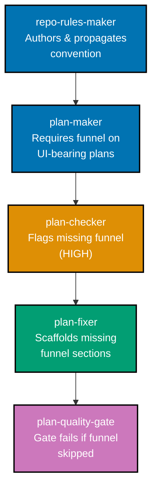

# Plan-Doc UI Mockup Convention

Establish a repository convention for embedding **draft / low-fidelity UI mockups** inside
Markdown plan documents (`plans/**`) so they render visually in **both** the VSCode editor and the
GitHub.com rendered view, with predictable diff and lint behaviour.

## Status

In progress (created 2026-06-16)

## Context

Plans that carry UI changes — such as a CRUD entity list + create/edit form screen shipped by
`apps/crud-fe-dart-flutterweb` — have no agreed way to show a draft of that UI inside the plan `.md`
files. Authors currently have to guess between inline HTML, MDX, PNG, SVG, Mermaid, or ASCII — each
with different rendering support across VSCode and GitHub.

A web-research pass (captured in [tech-docs.md](./tech-docs.md)) resolved the key unknowns:

- **GitHub's Markdown sanitizer strips inline CSS** (`style=`, `class`, `id`, `<style>`,
  `<script>`). Inline-HTML mockups render in VSCode but collapse to unstyled blobs on GitHub —
  asymmetric and misleading. Ruled out.
- **Mermaid has no wireframe diagram type** (requested 2020, still unbuilt) and the repo's own
  mermaid validator caps node width/label length, so it cannot represent a UI layout.
- **ASCII/Unicode wireframes in fenced code blocks** render identically everywhere, are perfectly
  diffable, need zero tooling, and match the repo's existing ASCII-tree convention.
- **Excalidraw `.excalidraw.png`** (image with embedded, re-editable scene JSON) renders on GitHub
  and in VSCode and stays editable — the high-fidelity companion to the ASCII wireframe.

The two are **paired, not alternatives**: a UI-bearing plan carries both a low-fidelity wireframe
(diffable structural source of truth) and a high-fidelity mockup (what it actually looks like) for
each screen, in separate labelled subsections.

This plan turns that research into a documented convention plus the agent/skill wiring that points
authors at it.

## Scope

**In scope:**

- A convention covering UI mockups in plan docs requiring **both tiers per screen**: a
  **low-fidelity ASCII/Unicode wireframe in a fenced code block** AND a **high-fidelity Excalidraw
  `.excalidraw.png`**, kept in separate labelled subsections.
- A **grounding rule**: survey the existing UI in the related app(s)/lib(s) (`libs/ts-ui`,
  `libs/ts-ui-tokens`, the target app, sibling screens) before drawing, so mockups reuse the real
  design system and flag any net-new component.
- A **design funnel**: diverge on ≥2 named low-fi alternatives → narrow to 2 hi-fi finalists →
  **name** the selected design → record the **rationale**, with **prior-art** research via
  `web-researcher` informing the alternatives.
- Explicit "do not use" guidance for inline HTML+CSS, MDX, Mermaid-as-wireframe, and `.excalidraw.svg`
  (font/CSP caveat) in plan docs, with the rendering rationale.
- **Enforcement** of all the above across the plan maker → checker → fixer chain and the
  `plan-quality-gate` workflow (a UI-bearing plan cannot pass the gate without its design funnel),
  plus the `plan-creating-project-plans` skill and its grilling gates.
- Authoring/propagating the rule across in-repo surfaces via **`repo-rules-maker`**, and validating
  this plan's integration with current rules via the **`plan-quality-gate`** workflow.
- Cross-repo adoption: this plan is the **ose-primer** instance of parallel
  `plan-doc-ui-mockup-convention` plans in all three sibling repos (ose-public, ose-infra,
  ose-primer), each grounded in the repo's own UI lib; ose-primer self-adopts via direct push to its
  `origin main` (explicit owner decision).

**Out of scope:**

- Building any actual CRUD screen UI (the worked example in this plan's `assets/` is illustrative
  only, not a production build task).
- Changing how production app UIs are rendered (this is about _plan documents_ only).
- A custom wireframe generator/tool or a new markdown lint rule (enforcement rides the existing
  plan checker/fixer chain, not a new linter).

## Approach Summary

1. **Phase 0 — Setup & baseline**: branch/worktree, green markdown lint baseline.
2. **Phase 1 — Plan self-validation**: run `plan-quality-gate` (strict) on this plan to confirm it
   integrates with current rules.
3. **Phase 2 — Convention via repo-rules-maker**: author the "UI Mockups in Plan Docs" rule and sweep
   every in-repo rule surface + re-sync bindings; `repo-rules-checker` clean.
4. **Phase 3 — Enforcement wiring**: plan-maker requires it, plan-checker flags it, plan-fixer
   scaffolds it, `plan-quality-gate` lists it; skill + grilling updated.
5. **Phase 4 — Worked example**: full funnel (prior art → alternatives → finalists → named selection
   → rationale) for a CRUD entity list + create/edit form screen, self-contained in this plan's own
   `assets/`.
6. **Phase 5 — Cross-repo parallel plans**: this repo is one of three parallel
   `plan-doc-ui-mockup-convention` instances (ose-public, ose-infra, ose-primer), each grounded in
   its own UI lib; all three pass strict `plan-quality-gate`.
7. **Phase 6 — Quality gates + archival**.

The convention enforcement chain — from authoring through validation to quality-gate — flows through
four agents:

## Documents

| Document                       | Purpose                                                    |
| ------------------------------ | ---------------------------------------------------------- |
| [brd.md](./brd.md)             | WHY — rationale, affected roles, success criteria, risks   |
| [prd.md](./prd.md)             | WHAT — requirements, decision rules, acceptance criteria   |
| [tech-docs.md](./tech-docs.md) | HOW — full research findings, comparison matrix, citations |
| [delivery.md](./delivery.md)   | DO — phased execution checklist                            |
| [assets/](./assets/README.md)  | Worked examples of both tiers (low-fi ASCII + hi-fi PNG)   |
