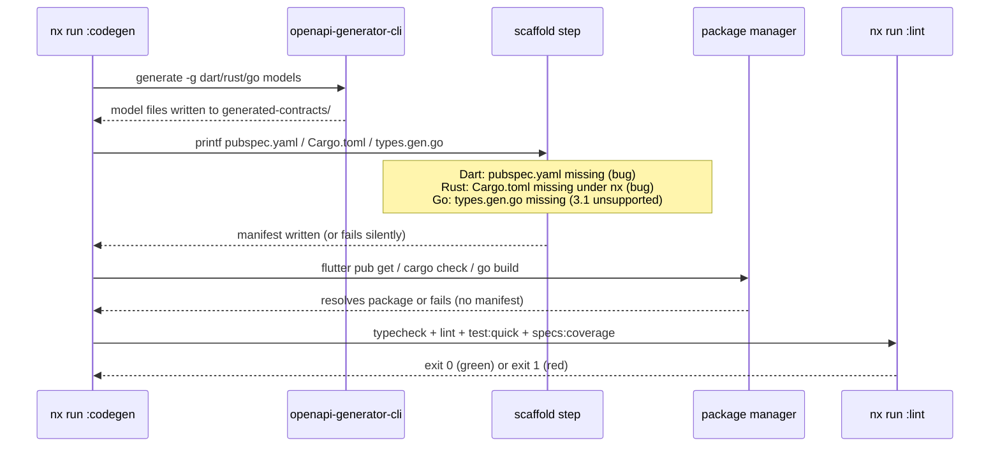

# Technical Documentation — Primer Polyglot Demo-App CI Restoration

## How the breakage stayed hidden

- `generated-contracts/` is **gitignored** [Repo-grounded] (`.gitignore:150: **/generated-contracts/`). It is produced by
  each app's `codegen` target, declared as a `dependsOn` of `typecheck`/`lint`/`test:quick`.
- Local working trees retained **stale-but-working** `generated-contracts/` from older (working) codegen
  runs, so local gates passed. Nx **caches** codegen outputs too, so even a `rm -rf` followed by a normal
  `nx run … :codegen` restores the cached artifact rather than regenerating — masking the bug. Reproduce
  the true CI behavior with `--skip-nx-cache` after `rm -rf …/generated-contracts`.
- CI checks out clean (no `generated-contracts/`, cold nx cache), so it regenerates and fails.
- The per-language matrix never built the demo apps until two 2026-06-19 changes coincided: the matrix
  `--projects` fix (`9ede6a70e`) made the jobs run their language's affected projects correctly, and a
  `rhino-cli` change (`researcher` role) made every demo app affected. That first honest, all-affected,
  cold-cache run exposed the latent breakage.

## Codegen orchestration overview

The diagram below shows the multi-step codegen flow shared across all four language targets. Each target
follows the same high-level sequence: nx invokes a `codegen` target which chains generator + manifest
scaffolding, then `lint`/`test` targets consume the output.



## Per-gate root-cause analysis

### .NET (C#/F#) — CVE DONE (commit `c82c66c6f`); codegen is Class B (CI-only)

> The SQLite CVE below is fixed and verified. Separately, the `.NET quality gate` on the fix commit shows a
> **Class B** failure: `CS2001: …/generated-contracts/src/Org.OpenAPITools/DemoBeCsas.Contracts/*.cs could
not be found`. The C# `codegen` (`openapi-generator -g csharp --global-property=models`) **succeeds fresh
> locally** (the `*.cs` model files are produced), so this is a CI-side ordering/environment issue — the C#
> build runs without the generated contracts present. Investigate the codegen `dependsOn` ordering under the
> cold-cache matrix and the first-run generator-JAR download, not the app code. See "Two failure classes".

#### SQLite CVE (fixed)

- `Microsoft.EntityFrameworkCore.Sqlite` 10.0.8 → `Microsoft.Data.Sqlite` → `SQLitePCLRaw.bundle_e_sqlite3`
  resolves the lowest satisfying version **2.1.11**, flagged `NU1903`
  (GHSA-2m69-gcr7-jv3q / CVE-2025-6965 — SQLite < 3.50.2 memory corruption).
  [Web-cited: GitHub Advisory Database, GHSA-2m69-gcr7-jv3q, https://github.com/advisories/GHSA-2m69-gcr7-jv3q,
  accessed 2026-06-19, excerpt: "There exists a vulnerability in SQLite versions before 3.50.2 where the
  number of aggregate terms could exceed the number of columns available. This could lead to a memory
  corruption issue." Affects SQLitePCLRaw.lib.e_sqlite3 ≤ 2.1.11; no 2.x patched version available.]
- **Fix applied**: pin a direct `PackageReference` to `SQLitePCLRaw.bundle_e_sqlite3` **3.0.3** (current
  stable as of 2026-05-07 [Web-cited: NuGet Gallery, https://www.nuget.org/packages/sqlitepclraw.bundle_e_sqlite3/,
  accessed 2026-06-19, excerpt: "Latest version 3.0.3, updated 5/7/2026"]; bundles SQLite 3.50.4 via
  `SourceGear.sqlite3` 3.50.4.5 [Web-cited: NuGet Gallery package dependency graph, same URL, excerpt:
  "Depends on SourceGear.sqlite3 >= 3.50.4.5"] — CVE-clean since SQLite ≥ 3.50.2 is unaffected per the
  advisory). C# uses Central Package Management → `PackageVersion` in
  `Directory.Packages.props` [Repo-grounded] + `PackageReference` in `DemoBeCsas.Tests.csproj` [Repo-grounded];
  F# pins inline in `DemoBeFsgi.fsproj` [Repo-grounded]. Verified: `dotnet build` of both test projects →
  0 errors, no `NU1903`.

### Dart — dormant `rhino-cli specs scaffold dart`

- `codegen` =
  `openapi-generator-cli generate -g dart … --global-property=models,modelDocs=false,apiDocs=false`
  (models-only — **no `pubspec.yaml`**) `&& rhino-cli specs scaffold dart --dir …/generated-contracts`
  `&& flutter pub get`.
- `rhino-cli specs scaffold dart` is a **dormant stub**: it prints
  `specs scaffold dart: dormant in ose-public (no Dart contract source …); pass.` and creates nothing
  (`apps/rhino-cli/src/commands/specs_scaffold_dart.rs`). A real implementation skeleton exists at
  `apps/rhino-cli/src/internal/contracts/dart_scaffold.rs` but is gated off.
- Net effect: no `pubspec.yaml` → `flutter pub get` fails: "No pubspec.yaml found for package
  crud_contracts". **Reproduced** with `--skip-nx-cache`.
- **Remediation options**:
  - (A) **App-level (preferred)**: have the dart `codegen` emit a complete package (drop `models`-only so
    `openapi-generator -g dart` produces a `pubspec.yaml`, or append a `printf`-based `pubspec.yaml` like
    the Rust target does its `Cargo.toml`). No shared-tooling change → preserves the `rhino-cli` mirror.
  - (B) **Activate `specs scaffold dart`** in `rhino-cli` (wire `dart_scaffold.rs`, make it runtime-detect
    contract source so it stays a no-op where none exists). Keeps the curated pubspec but **touches shared
    tooling** — must preserve byte-identical mirror (runtime-conditional, not source-divergent) and update
    the harness-compatibility checker. Higher blast radius.

### Rust — `Cargo.toml` missing under nx fresh

- `codegen` = `openapi-generator-cli generate -g rust … --global-property=models,…`
  `&& printf '[package]…' > …/Cargo.toml && printf 'pub mod models;' > …/src/lib.rs`
  `&& printf 'pub mod …;' > …/src/models/mod.rs`. Manifest + module wiring are created by **inline
  `printf`** after the generator (not via the dormant scaffold).
- Running the `openapi-generator` step **standalone** succeeds (exit 0; writes `src/models/*.rs`; `src/`
  exists). But the **nx-orchestrated** `codegen` fresh leaves **no `Cargo.toml`** → `cargo` lint/test fail.
- **Hypothesis (confirm in execution)**: the command uses `$(pwd)` for absolute paths; under nx the
  working directory and/or the `&&` chain behave differently than a direct shell run (e.g., cwd resolves to
  the project dir, or an earlier `&&` step exits non-zero and short-circuits before the `printf`s). Confirm
  by running the exact `codegen` command with `--skip-nx-cache --verbose` and inspecting cwd + per-step
  exit codes.
- **Remediation**: make manifest generation robust under nx — e.g., replace `$(pwd)` with the nx
  `{workspaceRoot}` token, split the chain into ordered steps that do not silently short-circuit, or move
  the manifest scaffolding into a small script the target invokes.

### Go — `oapi-codegen` vs OpenAPI 3.1

- `codegen` = `mkdir -p …/generated-contracts && oapi-codegen -generate types -package contracts -o
…/types.gen.go specs/apps/crud/containers/contracts/generated/openapi-bundled.yaml`. [Repo-grounded: verified in `apps/crud-be-golang-gin/project.json`]
- CI warns: "You are using an OpenAPI 3.1.x specification, which is not yet supported by oapi-codegen …".
  [Judgment call: observed in live CI run on 2026-06-19; no permalink URL captured — verify during Phase 4 execution]
  Fresh, `types.gen.go` is **missing** → `go build`/`golangci-lint` fail (no `contracts` package). [Repo-grounded: reproduced with `--skip-nx-cache`]
- **Remediation options**: (A) switch the Go types target to an OpenAPI-3.1-capable generator (e.g.,
  `openapi-generator -g go` models, matching the Rust/Dart pattern), or (B) add a 3.0 downconversion of the
  bundled spec feeding only the Go types step. Keep generated type names stable for the app code.

### Elixir — CI "errors on dependencies" (likely transient)

- CI: `** (Mix) Can't continue due to errors on dependencies` on `mix compile --warnings-as-errors`.
- **Not reproducible fresh locally**: `nx run crud-be-elixir-phoenix:typecheck --skip-nx-cache` after
  `rm -rf generated-contracts` exits 0; a full clean `mix compile --warnings-as-errors --force` is clean on
  Elixir 1.19.5. The 4-project elixir gate run-many exits 0 locally.
- **Likely** a CI deps-compile/network flake (dependency fetch/compile race). **Confirm**: reproduce with a
  fully clean `deps/` + `_build/` (`mix deps.clean --all && mix deps.get && mix compile`). If it recurs,
  identify the offending dep; if not, document as transient and rely on CI retry.
- Note: a harmless `:preferred_cli_env in def project is deprecated` warning is emitted (move to `def cli`)
  — cosmetic, not the failure cause, but worth clearing while here.

## Cross-repo parity invariant (critical constraint)

`rhino-cli` source is **byte-identical** across `ose-public`, `ose-primer`, `ose-infra` (verified during the
rename: same md5). The harness-compatibility checker enforces cross-vendor + cross-repo parity. Therefore:

- Prefer **app-level codegen fixes** (Dart option A, Rust manifest robustness, Go generator swap) that do
  **not** modify `rhino-cli`.
- If shared tooling must change (e.g., activating `specs scaffold dart`), keep the source **byte-identical**
  across repos and make behavior **runtime-conditional** (no-op when no contract source is present), and
  update the harness-compatibility checker + regenerate bindings in the same change.

## Reproduction recipe (per language)

```bash
cd ose-primer
rm -rf apps/<app>/generated-contracts
npx nx run <app>:codegen --skip-nx-cache    # or :lint to also build
# inspect: does the package manifest (pubspec.yaml / Cargo.toml / types.gen.go) exist?
```

## Files in play

- `.github/workflows/pr-quality-gate.yml` — per-language matrix (already corrected) [Repo-grounded]
- `apps/crud-fe-dart-flutterweb/project.json` — dart `codegen` command [Repo-grounded]
- `apps/crud-be-rust-axum/project.json` — rust `codegen` command (inline manifest printf) [Repo-grounded]
- `apps/crud-be-golang-gin/project.json` — go `codegen` command (`oapi-codegen`) [Repo-grounded]
- `apps/crud-be-elixir-phoenix/` + `libs/elixir-openapi-codegen/` — elixir codegen [Repo-grounded]
- `apps/crud-be-csharp-aspnetcore/Directory.Packages.props`, `…/DemoBeCsas.Tests.csproj`,
  `apps/crud-be-fsharp-giraffe/src/DemoBeFsgi/DemoBeFsgi.fsproj` — .NET CVE pin (done) [Repo-grounded]
- `apps/rhino-cli/src/commands/specs_scaffold_dart.rs`, `apps/rhino-cli/src/internal/contracts/dart_scaffold.rs`
  — dormant dart scaffold (only if Dart option B is chosen) [Repo-grounded]
