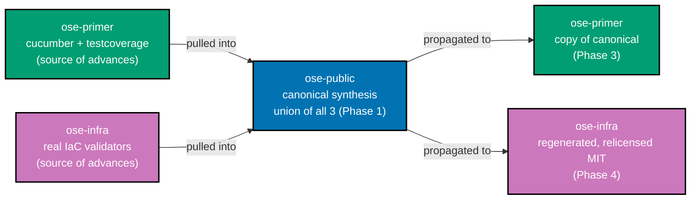
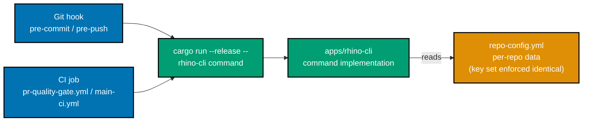

# Tech Docs — Unify rhino-cli, SDLC & Repo Structure (Second Pass)

## 1. Relationship to the First Plan

This plan **inherits the entire target standard** of the first plan
([tech-docs](../../done/2026-07-01__standardize-rhino-cli-sdlc-parity/tech-docs.md)) — the SDLC gate
mechanics (§1 lifecycle), the Nx target-name standard (§5), the testing-architecture standard (§4),
the harness coverage standard (§3.2), the target-standard synthesis (§7), and the divergence policy
(§7.1). Those are **not re-derived here**; they remain authoritative.

What this plan adds is a **second, stricter target** the first plan did not achieve: the standardized
layer must be **byte-identical**, including `apps/rhino-cli`'s own source, and every `⚠️`
"functionally-equivalent mechanism divergence" must converge. This document records the **verified
current state** (§2), the delta to close (§3), the **rhino-cli source-identity standard** (§4), the
canonical decisions (§5), the phase design (§6), and the divergence policy (§7).

## 2. Current State (Verified 2026-07-02)

A fresh three-repo read-only sweep (superseding all stale delivery.md "done" notes). ✅ = at target,
⚠️ = functionally-equivalent but mechanism-divergent, ❌ = divergent/incomplete.

### 2.1 rhino-cli source

| Aspect                        | public                                                                                                                                      | primer                                                                     | infra                                                                                                                                                                                                                                                                                                               | Verdict |
| ----------------------------- | ------------------------------------------------------------------------------------------------------------------------------------------- | -------------------------------------------------------------------------- | ------------------------------------------------------------------------------------------------------------------------------------------------------------------------------------------------------------------------------------------------------------------------------------------------------------------- | :-----: |
| `src/*.rs` file count         | 155                                                                                                                                         | 231                                                                        | 235                                                                                                                                                                                                                                                                                                                 |   ❌    |
| `src` diff vs public          | —                                                                                                                                           | 5 differ, 15 only-in-one                                                   | **100 differ, 51 only-in-one** (diff module naming)                                                                                                                                                                                                                                                                 |   ❌    |
| `cli.rs`                      | canonical (1193 ln)                                                                                                                         | **byte-identical to public**                                               | differs (1325 ln, +132)                                                                                                                                                                                                                                                                                             |   ❌    |
| `Cargo.toml` cucumber         | `0.23.0` (dep, **harness unwired**)                                                                                                         | `0.22.1` (**harness wired**, 11 `[[test]]`)                                | `0.23.0` (dep, **harness unwired**)                                                                                                                                                                                                                                                                                 |   ❌    |
| `[[test]]` harness blocks     | 0                                                                                                                                           | **11**                                                                     | 0                                                                                                                                                                                                                                                                                                                   |   ❌    |
| `tests/*.rs` files            | 4                                                                                                                                           | 12                                                                         | 4                                                                                                                                                                                                                                                                                                                   |   ❌    |
| `.feature` files (rhino tree) | **41** (dirs incl. `ddd`, `specs` — unique to public; `workflows` shared with primer)                                                       | 26 (dirs incl. `contracts`, `java`, `test-coverage`; also has `workflows`) | 22 (dirs incl. `contracts`, `java`, `test-coverage`; lacks `workflows`)                                                                                                                                                                                                                                             |   ❌    |
| `Cargo.lock`                  | distinct sha (42.1K)                                                                                                                        | distinct sha (41.9K)                                                       | distinct sha (42.3K)                                                                                                                                                                                                                                                                                                |   ❌    |
| `Cargo.lock` scope            | **own crate-level lockfile; no repo-root `Cargo.lock`; no `[workspace]` parent** → byte-identity achievable                                 | same (isolated crate)                                                      | same (isolated crate)                                                                                                                                                                                                                                                                                               |   ✅    |
| `license` field               | MIT                                                                                                                                         | MIT                                                                        | **LicenseRef-Proprietary** → relicense to MIT (D3)                                                                                                                                                                                                                                                                  |   ❌    |
| lint policy                   | strict (`deny` docs)                                                                                                                        | deferred `allow`                                                           | deferred `allow`                                                                                                                                                                                                                                                                                                    |   ❌    |
| `project.json` target KEYS    | 21                                                                                                                                          | 21                                                                         | 21                                                                                                                                                                                                                                                                                                                  |   ✅    |
| `project.json` coverage gate  | `--fail-under-lines 90`                                                                                                                     | `--fail-under-lines 90` (identical number)                                 | `--fail-under-lines 90` (identical number)                                                                                                                                                                                                                                                                          |   ✅    |
| `project.json` COMMANDS       | canonical                                                                                                                                   | minor differ                                                               | differ (deps:audit tool, env globs, **coverage `--ignore-filename-regex`** — a symptom of the divergent module layout, converges automatically once `src/` is byte-identical)                                                                                                                                       |   ❌    |
| `env/validate.rs` IaC kind    | **stub** (`kind: String`, `.as_str()` match on `"app"` only; any other kind `eprintln!`s "unknown surface kind ... skipped", zero findings) | **stub** (identical to public)                                             | **REAL** — typed `SurfaceKind::{App,Terraform,Ansible}` enum; `validate_terraform`/`validate_ansible` implemented + unit-tested (~90 ln each); two live surfaces declared in infra's own `repo-config.yml` (`kind: terraform`, `kind: ansible`); wired into `.husky/pre-push` + `validate-env.yml` on every push/PR |   ❌    |

**Interpretation**: public↔primer `cli.rs` is already byte-identical and the src delta is small (5
files + primer's extra testcoverage/cucumber). infra is a different refactor generation. The
"harness" divergence is narrower than the count suggests — **all three repos already ship `.feature`
specs and `tests/*.rs`; only the `[[test]]` harness registration (`harness = false` cucumber suites)
is primer-only.** But the `.feature` trees themselves **diverge structurally, not just in count**:
public carries `ddd`/`specs` feature dirs unique to it (public and primer share `workflows`, which only
infra lacks), while primer/infra additionally carry `contracts`/`java`/`test-coverage` dirs that
public lacks. Because these `.feature` dirs track
rhino-cli's own command surface, the three repos' rhino-cli command sets genuinely differ today.
primer is _ahead_ on cucumber harness + testcoverage; **infra is ahead on IaC env-drift validation**
— its `validate_terraform`/`validate_ansible` are real, tested, actively-gated logic, while
public/primer carry only a doc-comment "forward-scaffold" stub. Canonical synthesis is therefore
**best-of-three over the union of all three command surfaces**, not a copy of any one repo's tree
(see [§4](#4-rhino-cli-source-identity-standard) and [§11 Technical Risks](#11-technical-risks)).

### 2.2 SDLC wiring

| Surface                        | public                       | primer                       | infra                                                                                                                  | Verdict |
| ------------------------------ | ---------------------------- | ---------------------------- | ---------------------------------------------------------------------------------------------------------------------- | :-----: |
| `.husky/commit-msg`            | canonical                    | identical                    | identical                                                                                                              |   ✅    |
| `.husky/pre-commit`            | canonical                    | **byte-identical to public** | no shebang/`set -e`/Step comments; **inline tool-lint**                                                                |   ❌    |
| `.husky/pre-push`              | canonical                    | identical (modulo excludes)  | **`npx nx`/`npm run` wrappers** replace every `cargo run`                                                              |   ❌    |
| lint-staged `*.cs/.clj/.dart`  | native tools                 | `scripts/format-*.sh`        | `scripts/format-*.sh`                                                                                                  |   ⚠️    |
| lint-staged sh/Docker/actions  | present                      | present                      | **absent** (handled inline in pre-commit)                                                                              |   ❌    |
| canonical workflow filenames   | present                      | present                      | present                                                                                                                |   ✅    |
| `validate-markdown.yml` absent | ✅                           | ✅                           | ✅                                                                                                                     |   ✅    |
| `pr-quality-gate.yml` jobs     | **missing gherkin-card**     | canonical                    | Title-Case `name:`, **6 duplicated per-job `env:` NX_BASE/HEAD blocks** (public: 1 workflow-level block), extra md job |   ❌    |
| `main-ci.yml` jobs             | canonical                    | canonical                    | no standalone `compat-min-version`/`env-validate`; extra md                                                            |   ❌    |
| Codecov removed                | ✅                           | ✅                           | ✅                                                                                                                     |   ✅    |
| naming trigger path            | **`.opencode/agent/` (bug)** | **`.opencode/agent/` (bug)** | `.opencode/agents/`                                                                                                    |   ❌    |

### 2.3 config / targets / specs

| Surface                       | public                                                                                        | primer                     | infra                                                | Verdict |
| ----------------------------- | --------------------------------------------------------------------------------------------- | -------------------------- | ---------------------------------------------------- | :-----: |
| `repo-config.yml` body/schema | canonical                                                                                     | identical                  | identical                                            |   ✅    |
| `repo-config.yml` header cmt  | canonical                                                                                     | drops `env-injection` line | reworded coverage/specs/size cmts                    |   ❌    |
| `repo-config.yml` key-set     | **no automated schema-parity gate today** — key-set identity rests on review, not enforcement | same                       | same                                                 |   ❌    |
| mandatory-six + extras        | 29/29 clean                                                                                   | 26/26 clean                | **6 projects missing** deps:audit/compat:min-version |   ❌    |
| `namedInputs.specs` rollout   | **16/29**                                                                                     | **20/26**                  | **6/8**                                              |   ❌    |
| specs C4 structure            | 1 stale orphan (`golang-commons`)                                                             | complete                   | complete                                             |   ❌    |
| `coverage.projects` registry  | **omits 4 real projects**                                                                     | **omits 6 real projects**  | complete                                             |   ❌    |
| old 3 config files absent     | ✅                                                                                            | ✅                         | ✅                                                   |   ✅    |

> **Denominator note**: the mandatory-six and `namedInputs.specs` rows are counted against the full
> Nx project graph (public 29, primer 26, infra 8), not a directory-only scan of `apps/` and `libs/`
> (public 27, primer 25, infra 7). The directory-only scan structurally cannot see the `*-contracts`
> OpenAPI-spec projects — under `specs/apps/*/containers/contracts/` — that Nx registers outside
> `apps/`/`libs/` (`organiclever-contracts`/`ose-contracts` in public, `crud-contracts` in primer,
> `coralpolyp-contracts` in infra). All delivery items and gates in [§6](#6-phase-design) and
> `delivery.md` enumerate the full Nx project graph for exactly this reason.

Infra's 6 gap projects: `coralpolyp-contracts`, `coralpolyp-be-e2e`, `coralpolyp-fe-e2e` (all three
miss `deps:audit` + `compat:min-version`), `coralpolyp-fe` (miss `compat:min-version`), `libs/ts-ui`,
`libs/ts-ui-tokens` (both miss `deps:audit` + `compat:min-version`).

public's `namedInputs.specs` gaps: 13 projects (most `*-cli` except crane/rhino, most e2e — yet
`organiclever-be-e2e`/`ose-be-e2e` DO have it → internally inconsistent — plus the 2 contracts
projects `organiclever-contracts`/`ose-contracts`). primer gaps: 6 (`clojure-openapi-codegen`,
`elixir-cabbage`, `elixir-gherkin`, `elixir-openapi-codegen`, `ts-ui-tokens`, plus the contracts
project `crud-contracts`). infra gaps: 2 (`ts-ui-tokens`, plus the contracts project
`coralpolyp-contracts`).

public `coverage.projects` omits: `fsharp-crane-core`, `web-ui-token`, `organiclever-contracts`,
`ose-contracts` (registry lists 25; `nx show projects` = 29). primer `coverage.projects` omits the
same 6 projects flagged for the `namedInputs.specs` gap above — `clojure-openapi-codegen`,
`elixir-cabbage`, `elixir-gherkin`, `elixir-openapi-codegen`, `ts-ui-tokens`, `crud-contracts`
(registry lists 20; `nx show projects` = 26) — each owns a real `specs/**/behavior/gherkin` tree, so
this is a genuine omission, not a legitimate exemption (verified by diffing `nx show projects` against
the registry in both directions, and confirming infra's registry — 8/8, exact match — really is
complete by the same method). **Second-pass correction**: the first-draft audit called primer's
registry "complete"; a fresh diff against the working tree during Phase 0 execution found this false.

## 3. The Delta to Close

Everything with an ❌ or ⚠️ above. Grouped by owning phase:

- **Canonical synthesis (Phase 1, public)**: build the canonical rhino-cli as the **union** of all
  three command surfaces (public's `ddd`/`specs`/`workflows` + primer/infra's
  `contracts`/`java`/`test-coverage`); wire primer's cucumber harness (migrated to `0.23.0`) +
  reconcile the union `.feature`/`tests/*.rs` tree; pull primer's testcoverage module **and infra's
  real `validate_terraform`/`validate_ansible` env-drift validators (+ their tests)** into public;
  unify lint policy; drive repo-specific behaviour from `repo-config.yml`; fix the `.opencode/agent/`
  bug; canonicalize `repo-config.yml` header comment; add the `apps/rhino-cli/LICENSE` (MIT) file;
  add the `repo-config.yml` schema-parity gate.
- **public closeout (Phase 2)**: full `namedInputs.specs`; complete `coverage.projects`; delete the
  `golang-commons` orphan; add `gherkin-cardinality` to the PR gate.
- **primer propagation (Phase 3)**: copy the canonical rhino-cli (now the union superset) into
  primer; bump cucumber `0.22.1`→`0.23.0`; full `namedInputs.specs`; complete `coverage.projects`
  (same 6-project gap as `namedInputs.specs`, found during the Phase 0 re-audit); fix
  `.opencode/agent/` bug; agree `*.cs/.clj/.dart` mechanism.
- **infra propagation (Phase 4)**: regenerate rhino-cli to canonical; relicense to MIT; `npx nx`/`npm
run` → direct `cargo run`; inline tool-lint → lint-staged; pre-commit shebang/Step comments; add
  `compat-min-version`/`env-validate` jobs; verify/align `gherkin-cardinality` invocation style
  (already wired); lower-kebab workflow `name:`; add missing targets to 6 projects; full
  `namedInputs.specs`; wire cucumber.

## 4. rhino-cli Source-Identity Standard

The end-state: `apps/rhino-cli` is **100% byte-identical** across all three repos — **zero
carve-outs** (per Decisions 3 + 5). Achieved by:

1. **One canonical generation — best-of-THREE over the union command surface.** Synthesize in
   ose-public the best-of-**three**: public's strict lint policy + primer's cucumber harness +
   primer's testcoverage module + **infra's real `validate_terraform`/`validate_ansible` env-drift
   validators (and their `#[cfg(test)]` unit-test modules)** + the **union of every command surface**
   (public's `ddd`/`specs`/`workflows` verbs **and** primer/infra's `contracts`/`java`/`test-coverage`
   verbs) + the richest internal module tree. This becomes the canonical `src/`, `Cargo.toml`,
   `Cargo.lock`, `project.json`. Because the source is byte-identical, **every repo's rhino-cli binary
   carries the full command superset** — a command with no applicable projects in a given repo (e.g.
   `java` in public) is dormant, not absent. Skipping infra's contribution would make this a
   best-of-two synthesis that silently deletes infra's only real Terraform/Ansible env-drift
   capability during Phase 4's regeneration — see [§11 Technical Risks](#11-technical-risks).
   **Tiebreak rule** (makes the synthesis auditable): when the same unit exists in more than one repo
   with divergent implementations, the **most-evolved (most-refactored) variant wins by default** —
   usually primer's — **unless** another repo's variant has strictly more test coverage or carries a
   bugfix the others lack; **every deviation from most-evolved is logged in the Phase 1 synthesis
   ledger** with a one-line reason.
2. **Data-drive ALL repo-specific behaviour.** Everything that legitimately differs per repo —
   env-validation scan paths, domain-areas, ddd-areas — moves into `repo-config.yml` (the per-repo
   data file), so the Rust source **and** every `project.json` command string are identical.
   `application/repo_config/mod.rs` must read these rather than hard-code them; the `env:validation`
   target reads its scan paths from `repo-config.yml` (Decision 5) so infra's IaC globs are data,
   not a divergent command. The canonical `env::validate` dispatcher generalizes `SurfaceKind`
   handling from public/primer's hard-coded `"app"`-only match to infra's typed
   `App`/`Terraform`/`Ansible` dispatch, activated purely by which surfaces a repo **declares** in its
   own `repo-config.yml` — public and primer declare zero `terraform`/`ansible` surfaces, so the real
   validator code no-ops for them **by data, not by stub**, consistent with byte-identical source.
   **Config schema-parity is the real byte-identity boundary**: because the byte-identical source now
   reads config keys, a repo whose `repo-config.yml` is missing a required key (or carries an unknown
   one) is byte-identical yet runtime-broken. A new **`rhino-cli repo-config validate`** command (Phase
   1 deliverable) asserts all three `repo-config.yml` files carry an **identical key set** (values may
   differ); this converts the identity boundary from prose into an enforced check. The mechanism is a
   **strict deserialize** of `repo-config.yml` against the byte-identical `RepoConfig` struct
   (`#[serde(deny_unknown_fields)]` + required-non-empty checks on `harness`/`coverage.projects`, plus
   enum checks on `harness[].tier` and `coverage.projects[].levels`) — because the parsing struct
   itself is byte-identical source, each repo validating its **own** config against its **own** copy of
   that struct **is** cross-repo key-set parity, with no separate canonical-key-list artifact to keep
   in sync. It is wired **twice**: a **pre-commit** fast path (a `lint-staged` entry keyed to the
   `repo-config.yml` glob, so it only runs when that file is staged) for immediate feedback, and the
   existing **pre-push/PR** step as defense-in-depth against `--no-verify` bypasses and PR-only edits.
3. **No carve-outs.** infra's rhino-cli is relicensed to MIT (Decision 3). To keep the grant scope
   unambiguous inside infra's otherwise-proprietary tree, an **MIT `LICENSE` file scoped to
   `apps/rhino-cli/`** is added — and, so the `apps/rhino-cli/` tree stays byte-identical, the **same
   `apps/rhino-cli/LICENSE` file is added in all three repos** (public/primer are MIT-licensed
   already, so this is free there). The `Cargo.toml` `license` field then matches too. The
   self-hosted runner label lives in CI-workflow YAML, **not** in `apps/rhino-cli`, so it does not
   affect CLI byte-identity.
4. **cucumber harness is canonical — union `.feature` tree, migrated to 0.23.0.** primer's `tests/*.rs`
   (11 `[[test]]` harness=false suites), `tests/fixtures`, and `tests/golden-master` supply the
   canonical **harness structure**, but the `.feature` surface is the **reconciled union of all three
   repos' trees** (public's `ddd`/`specs`/`workflows` + primer/infra's `contracts`/`java`/
   `test-coverage`), not a verbatim copy of any one — copying primer's 26-file tree into public would
   delete public's `ddd`/`specs` features. Canonical cucumber version = **`0.23.0`** (public/infra's
   current pin, newer, 2-of-3 majority); primer's harness code, written against `0.22.1`, is
   **migrated up** to the `0.23.0` API — not copied verbatim. A union scenario that requires a
   toolchain a given repo lacks (e.g. a `java` scenario in public) is **tagged and skipped by data**
   so `cargo test` stays green in every repo, consistent with the SurfaceKind data-driven no-op
   pattern (§4 point 2).
5. **Round-trip regression guard.** public (155 src files) is the canonical seat, but primer (231) is
   the most evolved, so Phase 1 pulls primer's lead **into** public and Phase 3 re-propagates
   public→primer (primer→public→primer). To guarantee primer ⊇ current-primer, two guards run: a
   **behavior baseline** — Phase 0 snapshots primer's full rhino-cli behaviour (cucumber + golden +
   CLI `--help`/output) and freezes it; the Phase 3 gate asserts canonical-primer passes **all** of
   it — **and** a **file-accounting ledger** — Phase 1 records every primer symbol/file and accounts
   for each as ported, merged, or explicitly-dropped-with-reason; Phase 3 diffs against the ledger.

**Byte-identity acceptance** (Phase 5): `diff -rq apps/rhino-cli/src` empty pairwise; `diff` of
`Cargo.toml`/`Cargo.lock`/`project.json`/`LICENSE` **shows no differences** (zero carve-out lines);
`cargo test` cucumber suites pass in all three; `cargo test -p rhino-cli terraform_validator::` and
`cargo test -p rhino-cli ansible_validator::` pass in all three, confirming infra's real IaC
env-drift validators survived the synthesis and regeneration (not merely that the aggregate `cargo
test` run is green).

**Dependency position — the canonical-source flow**:

public is the upstream source of truth: primer's already-wired advances **and** infra's real IaC
validators flow _into_ public first (Phase 1), and public's canonical union result then flows _out_
to both siblings (Phases 3–4) — never primer→infra directly.

## 5. Canonical Decisions

### 5.1 First-grill decisions (user-ratified 2026-07-02, morning)

| #   | Decision                | Ratified choice                                                                                                                             |
| --- | ----------------------- | ------------------------------------------------------------------------------------------------------------------------------------------- |
| 1   | Canonical rhino-cli     | **synthesize in ose-public**, then propagate public→primer→infra                                                                            |
| 2   | Infra rhino-cli scope   | **full port**, isolated as gated Phase 4 — **required, not descopable** (Decision 7 below hardens this)                                     |
| 3   | Infra rhino-cli license | **relicense to MIT** — no license carve-out                                                                                                 |
| 4   | `*.cs/.clj/.dart` fmt   | **native tools inline** (`dotnet csharpier format`/`cljfmt fix`/`dart format`); primer+infra converge to public, drop `scripts/format-*.sh` |
| 5   | env-validation paths    | **data-driven from `repo-config.yml`** → `project.json` byte-identical → **zero rhino-cli carve-outs**                                      |

### 5.2 Second-grill decisions (user-ratified 2026-07-02, second pass)

| #   | Topic                    | Ratified choice                                                                                                                                                                                                                                                                                                                                    |
| --- | ------------------------ | -------------------------------------------------------------------------------------------------------------------------------------------------------------------------------------------------------------------------------------------------------------------------------------------------------------------------------------------------- |
| 6   | Cargo.lock identity      | **Keep in byte-identity** — verified achievable (isolated crate, own lockfile, no `[workspace]`); the current size divergence is real work, not a blocker                                                                                                                                                                                          |
| 7   | Descope vs identity      | **Ban descope** — byte-identity is non-negotiable; the Phase 4 escape hatch is removed. Phase 4 must converge or the plan does not archive                                                                                                                                                                                                         |
| 8   | Round-trip guard         | **Both** — behavior baseline (Phase 0 snapshot, Phase 3 must pass) **and** file-accounting ledger (Phase 1 records, Phase 3 diffs) — see §4 point 5                                                                                                                                                                                                |
| 9   | Synthesis tiebreak       | **Most-evolved-wins default**; deviations from most-evolved logged with a reason in the Phase 1 synthesis ledger — see §4 point 1                                                                                                                                                                                                                  |
| 10  | Config schema parity     | **`rhino-cli repo-config validate`** — strict-deserialize schema check (deny-unknown-fields + required/enum checks), giving identical key sets across all three `repo-config.yml` (values may differ) as an emergent property; enforced in **pre-commit** (fast path, file-scoped trigger) **and** pre-push/PR (defense-in-depth) — see §4 point 2 |
| 11  | Arming dormant gates     | **Phase 0 dry-run** — run the two fixed validators (naming trigger-path, `gherkin-cardinality`) against the current tree in all 3 repos first; existing violations become explicit remediation items before the gate is armed                                                                                                                      |
| 12  | MIT scope                | **`LICENSE` file scoped to `apps/rhino-cli/`**, identical file added in all three repos — see §4 point 3                                                                                                                                                                                                                                           |
| 13  | Golden master            | **Regenerate post-synthesis** — the golden-master is regenerated from the canonical rhino-cli after Phase 1, then frozen; it guards Phases 3–4 propagation, not the synthesis (which is guarded by the behavior baseline + unit + cucumber)                                                                                                        |
| 14  | Partial-completion pause | **Mid-plan pause invariant** — each phase gate asserts the just-touched repo passes its own full pre-push + PR gate before the plan may pause at that boundary                                                                                                                                                                                     |
| 15  | Cucumber direction       | **level up to 0.23.0** — adopt primer's wired harness everywhere migrated to the `0.23.0` API (not stripped, not copied verbatim); canonical `.feature` tree = **reconciled union** of all three — see §4 point 4                                                                                                                                  |

Net effect of 3 + 5 + 12: `apps/rhino-cli` (including `LICENSE`) is 100% byte-identical across all
three repos, no exceptions. Net effect of 7 + 14: no phase may leave a repo half-converged, and infra
convergence is required for archival.

## 6. Phase Design

**Phase/delivery flow** (gated — a phase does not start until the prior phase's gate passes; each gate
also enforces the mid-plan pause invariant, Decision 14):

```mermaid
%% Color Palette: Blue #0173B2, Orange #DE8F05, Teal #029E73, Purple #CC78BC — color-blind friendly, WCAG AA
flowchart LR
    P0["Phase 0<br/>Baseline, Re-Audit<br/>behavior baseline, gate dry-run<br/>(ose-public)"]:::blue
    G0{"Gate 0"}:::orange
    P1["Phase 1<br/>Canonical Synthesis<br/>union of all 3 (ose-public)"]:::blue
    G1{"Gate 1"}:::orange
    P2["Phase 2<br/>public Closeout"]:::blue
    G2{"Gate 2"}:::orange
    P3["Phase 3<br/>Propagate to ose-primer"]:::teal
    G3{"Gate 3"}:::orange
    P4["Phase 4<br/>Propagate to ose-infra<br/>(gated, required)"]:::purple
    G4{"Gate 4"}:::orange
    P5["Phase 5<br/>Cross-Repo Verify<br/>& Archival"]:::blue

    P0 --> G0 --> P1 --> G1 --> P2 --> G2 --> P3 --> G3 --> P4 --> G4 --> P5

    classDef blue fill:#0173B2,stroke:#000000,color:#FFFFFF,stroke-width:2px
    classDef teal fill:#029E73,stroke:#000000,color:#FFFFFF,stroke-width:2px
    classDef orange fill:#DE8F05,stroke:#000000,color:#FFFFFF,stroke-width:2px
    classDef purple fill:#CC78BC,stroke:#000000,color:#FFFFFF,stroke-width:2px
```

- **Phase 0 — Baseline, re-audit, behavior baseline & gate dry-run (public).** Install/doctor; run
  each repo's affected pre-push on a no-op to confirm a green starting point; commit the §2 matrices
  as evidence; **snapshot primer's rhino-cli behavior baseline** (cucumber + golden + CLI
  `--help`/output) as frozen evidence for the round-trip guard (Decision 8); **dry-run the two
  fixed validators** (naming trigger-path, `gherkin-cardinality`) against the current tree in all
  three repos and record any existing violations as explicit remediation items **before** those gates
  are armed (Decision 11); resolve any preexisting failure before work begins.
- **Phase 1 — Canonical synthesis (public).** Build the canonical rhino-cli as the **union** of all
  three command surfaces (cucumber migrated to `0.23.0` + testcoverage + infra's IaC validators +
  strict lints + data-driven repo-config + `apps/rhino-cli/LICENSE`), keeping a **synthesis ledger**
  (Decision 9) and a **file-accounting ledger** for primer's contributions (Decision 8); add the
  **`repo-config validate` schema-parity gate** wired at pre-commit and pre-push/PR (Decision 10); fix
  latent bugs; **regenerate the golden-master** from the
  canonical result (Decision 13); finalize canonical docs. RED/GREEN/REFACTOR for every rhino-cli
  source change with companion `.feature` specs.
- **Phase 2 — public closeout.** `namedInputs.specs` on all 29 projects; complete `coverage.projects`;
  delete orphan spec; add PR-gate `gherkin-cardinality`; canonicalize `repo-config.yml` header.
- **Phase 3 — primer propagation.** Copy canonical rhino-cli (the union superset) into primer; bump
  cucumber `0.22.1`→`0.23.0`; assert the round-trip guard (behavior baseline + ledger); full
  `namedInputs.specs`; fix `.opencode/agent/` bug; converge `*.cs/.clj/.dart` to native-tool
  formatters (drop `scripts/format-*.sh`).
- **Phase 4 — infra propagation (largest; gated, required).** Regenerate rhino-cli to canonical;
  **relicense to MIT** (+ `apps/rhino-cli/LICENSE`); **data-drive env-validation paths via
  `repo-config.yml`** (no project.json carve-out); converge `*.cs/.clj/.dart` to native-tool
  formatters; convert hooks to direct `cargo run`; move tool-lint to lint-staged; add pre-commit
  shebang/Step comments; add missing CI jobs; verify/align `gherkin-cardinality` (already wired);
  lower-kebab workflow `name:`; add missing targets to 6 projects; full `namedInputs.specs`; wire
  cucumber. Result: `apps/rhino-cli` byte-identical to public, zero carve-outs. **This phase is
  required — there is no descope path (Decision 7);** if the port is large, it is still completed, not
  dropped.
- **Phase 5 — cross-repo byte-identity verification + archival.** The `diff -rq` matrix, `jq` key +
  command comparison, hook diffs, cucumber pass in all three, parity table with zero `⚠️`.

Phases 3 and 4 copy this plan folder into the sibling repo at the start of the phase (per the
[multi-repo parity workflow](../../../repo-governance/workflows/plan/plan-multi-repo-parity-planning.md)),
so the same checklist drives execution there.

## 7. Divergence Policy (Allowed vs. Drift)

**Allowed divergence** (recorded, not flagged):

- App set & per-app deploy CRONs; language gate jobs; infra-only IaC gates
  (terraform/ansible/yamllint); self-hosted runner label; lint-staged formatter entries for languages
  present only in that repo. (All carried forward from the first plan.)
- **`apps/rhino-cli` has NO carve-outs** (Decisions 3 + 5 + 12) — `src/`, `Cargo.toml`, `Cargo.lock`,
  `project.json`, and `LICENSE` are 100% byte-identical across all three repos, including the full
  command superset. The self-hosted runner label is a CI-workflow-YAML concern, not part of
  `apps/rhino-cli`.
- `repo-config.yml` per-repo **data values** (domain-areas, ddd-areas, env-validation scan paths)
  differ; the **schema (key set — enforced by the schema-parity gate), header comment, and harness
  list** are identical.

**Drift** (MUST converge — the work): everything with ❌/⚠️ in §2 — rhino-cli source/Cargo/commands,
the union `.feature`/harness wiring, hook/CI mechanism, workflow `name:` casing + jobs,
`namedInputs.specs`, missing targets, `coverage.projects`, orphan spec, header comment, the two
latent bugs. **No `⚠️` is tolerated and no phase (including Phase 4) may be descoped.**

## 8. Evidence Sources

All §2 cells are Repo-grounded from the 2026-07-02 read-only sweep (three parallel per-surface
audits: rhino-cli identity, SDLC wiring, config/targets/specs), plus the second-pass verification
sweep that corrected the cucumber/`.feature` current-state (harness vs `.feature` distinction,
0.22.1↔0.23.0 version split, structural `.feature` tree divergence) and confirmed each rhino-cli is an
isolated crate with its own `Cargo.lock`. Phase 0 re-runs the sweep and commits its output so the
plan record is reproducible rather than resting on this document alone.

## 9. Architecture

At a system level, every SDLC gate check in any of the three repos resolves to the same invocation
chain: a **git hook** (`.husky/pre-commit` / `pre-push`) or a **CI job**
(`.github/workflows/pr-quality-gate.yml` / `main-ci.yml`) invokes **`cargo run --release --
<rhino-cli-command>`** directly (pre-this-plan, ose-infra instead wraps the same binary via `npx nx
run rhino-cli:*` / `npm run` — the mechanism drift Phase 4 removes) → the invocation reaches an
**`apps/rhino-cli` command implementation** → which reads **`repo-config.yml`** for any
repo-specific input (env-validation scan paths, domain-areas, ddd-areas, `coverage.projects`,
`specs.domain-areas`).

Because `repo-config.yml` is the single per-repo data file rhino-cli reads at runtime, keeping
`apps/rhino-cli`'s Rust source, `Cargo.toml`/`Cargo.lock`, `project.json`, and `LICENSE`
byte-identical does **not** require the tool's behavior to be identical — the data feeding it differs
by design (env-validation scan paths point at different repo layouts; domain-areas name different
apps; the schema-parity gate guarantees the key set is shared even as values differ). This is what
makes "byte-identical source, repo-appropriate behavior" possible: identity lives in the code,
divergence lives in the data (§4, §7).

## 10. File-Impact Analysis

Files created, modified, or deleted per repo. "Modified" on a directory means a subset of its files
change, not every file in it.

**ose-public** (Phases 0–2):

- Modified: `apps/rhino-cli/src/**` (add the union command surface pulled from primer/infra —
  `contracts`/`java`/`test-coverage` verbs; data-drive repo-specific behaviour; fix `.opencode/agent/`
  bug; unify lint policy; merge primer's testcoverage module; port infra's IaC validators)
- Modified: `apps/rhino-cli/Cargo.toml`, `Cargo.lock` (cucumber `0.23.0` harness wiring, lock
  regeneration)
- New: `apps/rhino-cli/LICENSE` (MIT, `apps/rhino-cli/`-scoped — added identically in all three repos)
- New/Modified: `apps/rhino-cli/tests/*.rs`, `tests/fixtures/**`, `tests/golden-master/**` (primer's
  harness structure migrated to `0.23.0`; golden-master **regenerated** from the canonical result)
- Modified: `specs/apps/rhino/behavior/rhino-cli/gherkin/**` (reconcile to the **union** of all three
  trees — public keeps `ddd`/`specs`/`workflows`, gains `contracts`/`java`/`test-coverage`; not a
  primer-verbatim copy)
- Deleted: `specs/libs/golang-commons/gherkin/**` (stale orphan)
- Modified: `repo-config.yml` (header-comment canonicalization; `coverage.projects` completion;
  env-validation data-driving)
- New: `apps/rhino-cli/src/commands/repo_config_validate.rs` + `cli.rs` additions (schema-parity
  gate — `rhino-cli repo-config validate` command + tests)
- Modified: `package.json` (`lint-staged` entry for `repo-config.yml` → `repo-config validate`)
- Modified: `.husky/pre-push` (`repo-config validate` step, defense-in-depth)
- Modified: `.github/workflows/pr-quality-gate.yml` (add `gherkin-cardinality` step)
- Modified: 13 other projects' `project.json` (add `namedInputs.specs`): `ayokoding-cli`, `ose-cli`,
  9 `*-fe-e2e`/`*-www-be-e2e`/`*-app-web-e2e` runners, plus the 2 contracts projects
  `organiclever-contracts` (`specs/apps/organiclever/containers/contracts/project.json`) and
  `ose-contracts` (`specs/apps/ose/containers/contracts/project.json`)
- Modified: `docs/reference/sdlc-gate-standard.md` (byte-identity standard + divergence policy update)
- Modified: `repo-governance/development/infra/nx-targets.md` (new "Cross-Repo rhino-cli
  Byte-Identity Standard" subsection — see delivery.md Phase 1's governance-docs item)
- Modified: `AGENTS.md` (Related Repositories pointer to the byte-identity standard — see
  delivery.md Phase 1's governance-docs item)

**ose-primer** (Phase 3):

- New: this plan folder, copied into `plans/in-progress/`
- Modified: `apps/rhino-cli/src/**` (copy of the canonical union superset — gains public's
  `ddd`/`specs` verbs; primer already carries `workflows`)
- Modified: `apps/rhino-cli/Cargo.toml` (cucumber `0.22.1`→`0.23.0`), `Cargo.lock`
- New: `apps/rhino-cli/LICENSE` (identical MIT file)
- Modified: `specs/apps/rhino/behavior/rhino-cli/gherkin/**` (reconcile to the union tree)
- Modified: `repo-config.yml` (primer's own data values)
- Modified: naming-validator trigger-path source/hook references (`.opencode/agent/`→
  `.opencode/agents/`)
- Modified: 6 projects' `project.json` (add `namedInputs.specs`): `clojure-openapi-codegen`,
  `elixir-cabbage`, `elixir-gherkin`, `elixir-openapi-codegen`, `ts-ui-tokens`, plus the contracts
  project `crud-contracts` (`specs/apps/crud/containers/contracts/project.json`)
- Modified: lint-staged config (converge `*.cs/.clj/.dart` to native formatters)
- Modified: `repo-governance/development/infra/nx-targets.md`, `AGENTS.md` (copy the canonicalized
  byte-identity standard subsection from public — see delivery.md Phase 3)
- Deleted: `scripts/format-*.sh`

**ose-infra** (Phase 4, gated, required):

- New: this plan folder, copied into `plans/in-progress/`
- Modified/regenerated: `apps/rhino-cli/src/**` (full regeneration to the canonical union form)
- Modified: `apps/rhino-cli/Cargo.toml` (license field → MIT), `Cargo.lock`, `project.json`
- New: `apps/rhino-cli/LICENSE` (identical MIT file — the `apps/rhino-cli/`-scoped grant inside the
  otherwise-proprietary tree)
- Modified: `specs/apps/rhino/behavior/rhino-cli/gherkin/**` (reconcile to the union tree)
- Modified: `repo-config.yml` (infra's IaC scan paths + domain/ddd areas as data)
- Modified: `.husky/pre-commit`, `.husky/pre-push` (convert to direct `cargo run`; move tool-lint to
  lint-staged; add shebang/`set -e`/Step comments)
- Modified: `.github/workflows/pr-quality-gate.yml`, `main-ci.yml` (add jobs, lower-kebab `name:`,
  remove the extra markdown job)
- Modified: 6 projects' `project.json` (add missing mandatory targets): `coralpolyp-contracts`
  (`specs/apps/coralpolyp/containers/contracts/project.json`), `coralpolyp-be-e2e`,
  `coralpolyp-fe-e2e`, `coralpolyp-fe`, `libs/ts-ui`, `libs/ts-ui-tokens`
- Modified: `ts-ui-tokens/project.json`, `coralpolyp-contracts/project.json` (add `namedInputs.specs`)
- Modified: `repo-governance/development/infra/nx-targets.md`, `AGENTS.md` (copy the canonicalized
  byte-identity standard subsection from public — see delivery.md Phase 4)
- Deleted: any remaining infra-only inline tool-lint blocks in `.husky/pre-commit`

**All three repos** (Phase 5): `plans/done/README.md` (add entry), `plans/in-progress/README.md`
(remove entry), `docs/reference/sdlc-gate-standard.md` (Parity Status table update).

## 11. Technical Risks

Distinct from `brd.md`'s Business Risks and `prd.md`'s Product Risks — these are implementation-level
risks specific to this document's technical approach:

- **Risk (identified, not theoretical): a best-of-two synthesis would silently delete infra's only
  real Terraform/Ansible env-drift validator.** `application/env/validate.rs` diverges in substance,
  not just naming — public/primer ship only a doc-comment "forward-scaffold" stub (`eprintln!`s and
  skips any surface `kind` other than `"app"`), while infra ships real, tested, actively-gated
  `validate_terraform`/`validate_ansible` implementations wired into every push/PR today. Because the
  stub no-ops instead of erroring, none of the plan's existing acceptance criteria (`diff -rq` empty,
  `cargo test` aggregate-green, `sh .husky/pre-push` exit 0) would detect the loss if Phase 4's
  regeneration replaced infra's file with the stubbed canonical. Mitigation: §4 point 1 makes the
  synthesis explicitly best-of-**three** (Phase 1 delivery item ports infra's validators + tests into
  the canonical `application/env/validate.rs`, generalizing `SurfaceKind` to a data-driven
  `app`/`terraform`/`ansible` dispatch); Phase 4's regeneration acceptance and Phase 4 Gate assert the
  ported `terraform_validator::`/`ansible_validator::` test modules pass in infra post-regeneration,
  not just an aggregate `cargo test` green.
- **Risk (identified in the second-pass sweep): the union `.feature` surface pulls a toolchain into a
  repo that lacks it.** The canonical `.feature` tree is the union of all three repos' trees, so
  public's `cargo test` would run primer/infra's `java`/`contracts` scenarios (and vice versa). If
  such a scenario shells out to a toolchain absent in that repo, `cargo test` turns red where it used
  to be green. Mitigation: union scenarios that require a repo-inapplicable toolchain are **tagged and
  skipped by data** (§4 point 4), the same no-op-by-data pattern as SurfaceKind; the Phase 1
  RED/GREEN cycle for the union tree asserts `cargo test -p rhino-cli` stays green in a repo that
  lacks the relevant toolchain. Residual risk: a scenario mis-tagged as universal would surface as a
  red gate, caught at the first phase gate rather than silently.
- **Risk: config schema drift makes byte-identical source runtime-broken in one repo.** Once the
  byte-identical source reads `repo-config.yml` keys (Decision 5), a repo missing a required key is
  identical-yet-broken. Mitigation: the schema-parity gate (§4 point 2, Phase 1 deliverable) asserts
  identical key sets across all three configs in every repo's pre-push/PR, converting the boundary
  from prose to an enforced check.
- **Risk: regenerating infra's `cli.rs` from a different module-naming generation silently changes
  behaviour the golden-master test doesn't cover.** infra's `cli.rs` is 132 lines longer than
  public's canonical form (§2.1) — some of that delta may encode infra-specific dispatch logic, not
  just naming. Mitigation: the golden-master is **regenerated from the canonical result post-Phase-1**
  (Decision 13), then the cucumber suite + golden-master run in the infra worktree before Phase 4's
  gate passes (§4 byte-identity acceptance); any behavioural delta the regenerated golden-master
  doesn't catch is a known residual risk this plan cannot eliminate mechanically.
- **Risk: the round-trip (primer→public→primer) regresses primer.** Making public (the smaller tree)
  canonical means Phase 1 imports primer's lead and Phase 3 re-propagates it; a dropped or
  restructured primer capability would regress primer. Mitigation: the dual round-trip guard
  (Decision 8 / §4 point 5) — a Phase-0 behavior baseline the Phase-3 gate must pass, plus a
  file-accounting ledger that forces every primer file to be ported/merged/explicitly-dropped.
- **Risk: data-driving `application/repo_config/mod.rs` reads breaks a code path not covered by the
  new `.feature` scenario.** The Phase 1 RED/GREEN/REFACTOR cycle adds one scenario for the
  config-driven read; it does not enumerate every call site that currently hard-codes a
  repo-specific literal. Mitigation: `cargo clippy -p rhino-cli -- -D warnings` plus the full
  `cargo test -p rhino-cli` suite run at every phase gate, which would fail on an
  unreachable/orphaned hard-coded branch.
- **Risk: `Cargo.lock` regeneration (Phase 1) shifts transitive dependency versions.** Freezing a new
  canonical `Cargo.lock` from a merged `Cargo.toml` (public's deps + primer's
  cucumber/tokio/thiserror) can resolve different transitive versions than any of the three repos
  currently have. Because each rhino-cli is an isolated crate with its own lockfile (no `[workspace]`
  parent — §2.1), byte-identity is achievable, but the resolved versions still need validating.
  Mitigation: `cargo test -p rhino-cli` + golden-master must pass on the newly-resolved lock before
  it is frozen as canonical (§4 "Freeze canonical artifacts").
- **Risk: arming the dormant naming validator red-lights already-committed files.** The
  `.opencode/agent/` bug has silently disabled the validator since the first plan, so existing files
  were never checked. Mitigation: the Phase 0 dry-run (Decision 11) runs the fixed validator against
  the current tree in all three repos and turns any existing violation into an explicit remediation
  item **before** the gate is armed; the Phase 1 regression scenario then asserts red-before/green-
  after in the same commit.

## 12. Rollback

Each phase is a git-mechanical checkpoint; reverting is a `git revert` of that phase's commit range
(per repo), applied inside each repo's `worktrees/<name>/` worktree.

- **Phase 0 (baseline/audit/behavior-baseline/dry-run)**: no source changes beyond the committed
  `audit/` evidence + behavior-baseline snapshot; revert with `git revert <audit-commit-sha>` if the
  audit itself needs correcting.
- **Phase 1 (public canonical synthesis)**: revert the synthesis commits (`git revert
<phase-1-commit-range>`) to restore public's pre-synthesis rhino-cli. Because Phases 3–4 propagate
  **from** Phase 1's output, if Phase 1 is reverted after Phase 3/4 have already landed, prefer (a)
  re-running Phase 1 to a corrected canonical form and re-propagating, over (b) reverting Phase 4
  then Phase 3 in that order to unwind the propagation first.
- **Phase 2 (public closeout)**: independently revertible (`git revert <phase-2-commit-range>`)
  without touching Phase 1's synthesis — `namedInputs.specs`, `coverage.projects`, the orphan-spec
  deletion, and the `gherkin-cardinality` step do not feed Phase 3/4.
- **Phase 3 (primer propagation)**: revert primer's propagation commit(s) in the primer repo; this
  does not affect public or infra.
- **Phase 4 (infra propagation — gated, required, no descope)**: Phase 4 has **no descope path**
  (Decision 7) — if the port proves large it is still completed, not dropped, and the plan does not
  archive until infra is byte-identical. If a partial regeneration is uncommitted in the infra
  worktree: `git reset --hard` (standard, same mechanism as public/primer); if commits already
  landed and need unwinding for a corrected re-port: `git revert <phase-4-commit-range>`, then
  re-run Phase 4. Phases 1–3 stand on their own and are not unwound.
- **Phase 5 (verification/archival)**: revert the archival `git mv` commit in each repo (`git revert
<archival-commit-sha>`) to restore the plan to `plans/in-progress/` if a post-archival regression is
  found before the next work session.

**General rule**: `ose-infra` is a normal, non-bare repository — rollback there uses the same
`git reset --hard` (uncommitted work) / `git revert` (landed commits) mechanics as `ose-public` and
`ose-primer`, no bare-repo-specific handling required. Every revert command above operates within one
repo's own worktree/checkout; this plan never issues a cross-repo revert.
