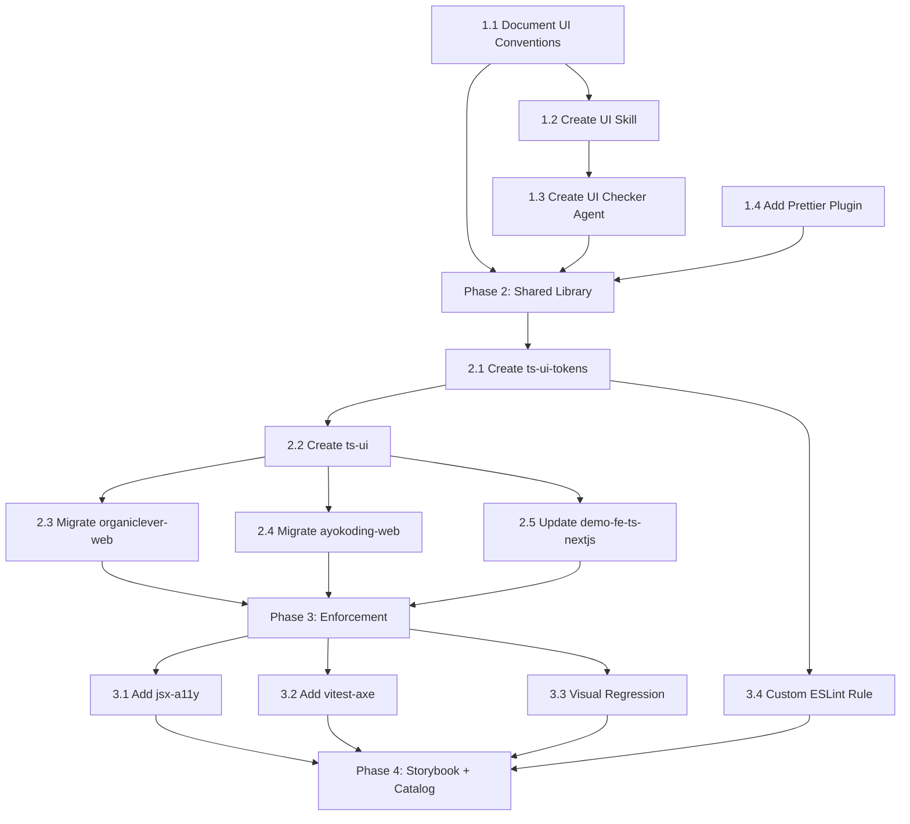

# Delivery Plan: UI Development Improvement

## Phase 1: Conventions + Skills (Foundation)

_Establish the knowledge layer before building infrastructure._

### 1.1 Document UI Conventions

- [ ] Create `governance/development/frontend/` directory
- [ ] Write `design-tokens.md` — token naming, categories, color tokens, spacing scale, radius,
  dark mode requirements, typography scale
- [ ] Write `component-patterns.md` — CVA variant pattern, Radix primitive composition, cn()
  usage, slot/asChild pattern, state coverage (default, hover, focus, active, disabled,
  loading, error, success)
- [ ] Write `accessibility.md` — WCAG AA requirements, focus-visible usage, reduced-motion
  support, aria attributes, label requirements, color-contrast rules, hit target sizes
- [ ] Write `styling.md` — Tailwind v4 conventions, class ordering, no inline styles in
  production apps, no !important, defensive CSS, container queries, mobile-first approach
- [ ] Add `governance/development/frontend/README.md` index
- [ ] Update `governance/development/README.md` to link frontend section

### 1.2 Create UI Development Skill

- [ ] Create `.claude/skills/swe-developing-frontend-ui/SKILL.md` with:
  - Frontmatter: `name` and `description` fields only (description triggers context-matching)
  - Design token reference (our actual CSS custom properties)
  - Component composition rules (shadcn/ui + Radix patterns)
  - Anti-pattern catalog (adapted from impeccable + repo-specific)
  - Accessibility checklist
  - Brand context (OrganicLever audience, OSE Platform personality)
- [ ] Create reference modules:
  - `reference/design-tokens.md` — actual token values and usage guide
  - `reference/component-patterns.md` — composition examples
  - `reference/anti-patterns.md` — what NOT to do (with examples)
  - `reference/accessibility.md` — a11y patterns and checklist
  - `reference/brand-context.md` — audience, personality, tone per app
- [ ] Run `npm run sync:claude-to-opencode` to sync skill to OpenCode

### 1.3 Create UI Checker Agent

- [ ] Create `.claude/agents/swe-ui-checker.md` with:
  - Tools: Read, Glob, Grep, Write, Bash
  - Model: sonnet (cost-effective for validation)
  - Skills: swe-developing-frontend-ui
  - Check dimensions: token compliance, accessibility, component patterns, dark mode,
    responsive design, anti-patterns
  - Report output to `generated-reports/`
- [ ] Run `npm run sync:claude-to-opencode` to sync agent to OpenCode

### 1.4 Add Prettier Tailwind Plugin

- [ ] Install `prettier-plugin-tailwindcss` as devDependency
- [ ] Add plugin to `.prettierrc.json` configuration (note: the config file is `.prettierrc.json`,
  not `.prettierrc`)
- [ ] Add `tailwindStylesheet` option to `.prettierrc.json` pointing to the CSS entry point for
  Tailwind v4 (e.g. `"tailwindStylesheet": "./apps/organiclever-web/src/app/globals.css"`);
  without this, the plugin defaults to Tailwind v3 behavior and may not sort classes correctly
- [ ] Run `npx prettier --write "apps/**/src/**/*.tsx"` and verify no unexpected diffs in git
- [ ] Verify `nx affected -t lint` passes for all TypeScript frontend apps after adding the plugin
- [ ] Verify pre-commit hook picks up the new plugin

### Phase 1 Validation

- [ ] All governance docs pass `npm run lint:md`
- [ ] Skill triggers correctly when editing `.tsx` files
- [ ] UI checker agent produces meaningful reports on existing components
- [ ] Prettier sorts Tailwind classes in staged files

---

## Phase 2: Shared Library (Infrastructure)

_Extract shared tokens and components into Nx libraries._

### 2.1 Create ts-ui-tokens Library

- [ ] Install `@nx/js` plugin: `npm install --save-dev @nx/js`
- [ ] Generate Nx library: `nx g @nx/js:library ts-ui-tokens --directory=libs/ts-ui-tokens`
- [ ] Extract common tokens from organiclever-web and ayokoding-web `globals.css`
- [ ] Create `src/tokens.css` with `@theme` definitions (source of truth)
- [ ] Create TypeScript token exports (`colors.ts`, `spacing.ts`, `typography.ts`, `radius.ts`)
- [ ] Add `project.json` with build target
- [ ] Document token usage in README.md

### 2.2 Create ts-ui Library

- [ ] Install `@nx/react` plugin: `npm install --save-dev @nx/react`
- [ ] Generate Nx library: `nx g @nx/react:library ts-ui --directory=libs/ts-ui`
- [ ] Set up shadcn/ui `components.json` pointing to this lib
- [ ] Move shared cn() utility from apps to `src/utils/cn.ts`
- [ ] Extract common components (Button, Card, Dialog, Input, Label, Alert)
- [ ] Reconcile component differences between apps (Button variants)
- [ ] Add unit tests with vitest-axe for each component
- [ ] Configure Storybook at library level

### 2.3 Migrate organiclever-web

- [ ] Replace `globals.css` tokens with import from ts-ui-tokens
- [ ] Update component imports to use `@open-sharia-enterprise/ts-ui`
- [ ] Keep app-specific components in `src/components/`
- [ ] Remove duplicated cn() utility
- [ ] Verify all existing tests pass
- [ ] Verify Storybook still works

### 2.4 Migrate ayokoding-web

- [ ] Replace `globals.css` base tokens with import from ts-ui-tokens
- [ ] Keep sidebar-specific tokens as app-level extensions
- [ ] Update shared component imports to use ts-ui
- [ ] Keep content-specific components (Breadcrumb, TOC, SidebarTree) local
- [ ] Verify all existing tests pass

### 2.5 Update demo-fe-ts-nextjs

- [ ] Add Tailwind v4 + ts-ui-tokens dependency
- [ ] Replace inline styles with Tailwind classes
- [ ] Import base components from ts-ui
- [ ] Update layout components to use shared patterns
- [ ] Add unit tests

### Phase 2 Validation

- [ ] `nx affected -t build` succeeds for all consuming apps
- [ ] `nx affected -t test:quick` passes for all consuming apps
- [ ] Token changes in ts-ui-tokens propagate to all apps
- [ ] No duplicate token definitions remain in app `globals.css` files

---

## Phase 3: Automated Enforcement (Quality Gate)

_Add programmatic checks to the existing CI pipeline._

### 3.1 Add eslint-plugin-jsx-a11y

- [ ] Install `eslint-plugin-jsx-a11y` as devDependency
- [ ] Configure in ESLint flat config for all TypeScript frontend apps
- [ ] Fix any existing violations
- [ ] Verify `nx affected -t lint` catches a11y issues

### 3.2 Add vitest-axe to Unit Tests

- [ ] Add `vitest-axe` as devDependency to root `package.json`: `npm install --save-dev vitest-axe`
- [ ] Verify `@testing-library/react` is already available in apps that consume `ts-ui` (it is in
  `organiclever-web` and `demo-fe-ts-nextjs`); no reinstall needed for those apps
- [ ] Create test helper: `src/test-utils/a11y.ts` with `expectAccessible()` utility
- [ ] Add accessibility tests to all shared components in ts-ui
- [ ] Add to test:unit pipeline — failures break test:quick

### 3.3 Add Playwright Visual Regression

- [ ] Create visual test suite for shared components
- [ ] Configure `toHaveScreenshot()` with appropriate thresholds
- [ ] Commit baseline screenshots to git under `apps/organiclever-web/e2e/screenshots/` using
  Playwright's built-in approach (simpler, no external service required)
- [ ] Integrate into `test:integration` target for frontend apps
- [ ] Document how to update baselines when intentional changes are made

### 3.4 Add Custom ESLint Rule for Token Usage

- [ ] Create custom ESLint rule or use existing plugin to flag:
  - Hardcoded hex colors in className strings
  - Hardcoded pixel values for spacing (where tokens exist)
  - `style=` props with color/spacing values
- [ ] Add to ESLint config for production apps (not demo apps initially)
- [ ] Fix existing violations

### Phase 3 Validation

- [ ] `nx affected -t lint` catches hardcoded design values
- [ ] `nx affected -t test:quick` includes a11y checks
- [ ] Visual regression tests catch unintended component changes
- [ ] Pre-push hook catches all new violations

---

## Phase 4: Component Catalog (Documentation)

_Make the design system browsable and self-documenting._

### 4.1 Expand Storybook for ts-ui

- [ ] Configure Storybook in `libs/ts-ui/.storybook/`
- [ ] Write stories for every exported component
- [ ] Include variant combinations, dark mode, responsive views
- [ ] Add `@storybook/addon-a11y` for inline accessibility checks
- [ ] Add `@storybook/addon-themes` for theme switching

### 4.2 Add Nx Target for Storybook

- [ ] Add `storybook` and `build-storybook` targets to ts-ui `project.json`
- [ ] Configure as cacheable target in `nx.json`
- [ ] Document how to run: `nx storybook ts-ui`

### 4.3 Component Documentation

- [ ] Add JSDoc comments to all exported components
- [ ] Document props, variants, and usage examples in stories
- [ ] Add "Do / Don't" examples for each component

### Phase 4 Validation

- [ ] `nx storybook ts-ui` launches with all components visible
- [ ] Accessibility panel shows no violations
- [ ] All variant combinations are covered in stories
- [ ] Documentation is clear enough for a new developer to use

---

## Dependency Graph

## Risk Considerations

| Risk | Impact | Mitigation |
| --- | --- | --- |
| Token reconciliation between apps | Token values differ subtly | Start with organiclever-web as canonical, document deviations |
| Breaking existing components during extraction | Regressions in production apps | Migrate one app at a time, run full test suite after each |
| Storybook version conflicts in monorepo | Build failures | Use consistent version, configure in root package.json |
| Visual regression flakiness | False positives in CI | Set appropriate pixel thresholds, use consistent CI environment |
| Skill triggers too broadly on TSX | Noise for non-UI files | Refine skill `description` wording to scope context-matching to UI component work |
