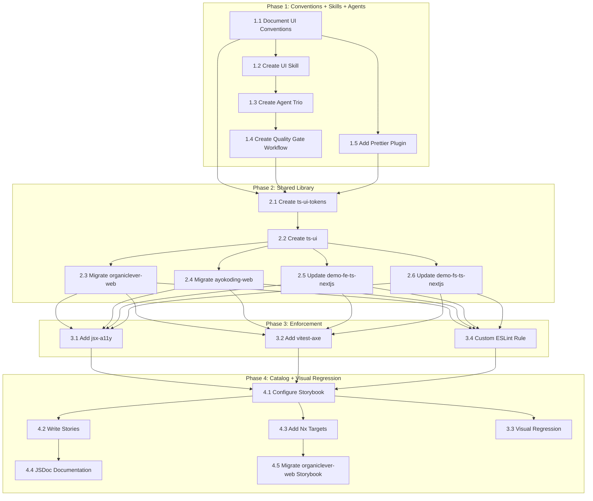

# Delivery Plan: UI Development Improvement

## Phase 1: Conventions + Skills + Agents (Foundation)

_Establish the knowledge layer before building infrastructure. No code changes to apps — only
governance docs, skill files, agent files, and Prettier config._

### 1.1 Document UI Conventions

**Goal**: Create `governance/development/frontend/` with four convention documents.

- [x] Create `governance/development/frontend/` directory
- [x] Write `governance/development/frontend/README.md` — index linking all four convention docs
- [x] Write `design-tokens.md`
- [x] Write `component-patterns.md`
- [x] Write `accessibility.md`
- [x] Write `styling.md`
- [x] Update `governance/development/README.md` to add a "Frontend" section linking to the new directory
- [x] Verify all new docs pass `npm run lint:md`

### 1.2 Create UI Development Skill

**Goal**: Create `.claude/skills/swe-developing-frontend-ui/` with SKILL.md and 5 reference modules.

- [x] Create `.claude/skills/swe-developing-frontend-ui/SKILL.md`
- [x] Create `reference/design-tokens.md`
- [x] Create `reference/component-patterns.md`
- [x] Create `reference/anti-patterns.md`
- [x] Create `reference/accessibility.md`
- [x] Create `reference/brand-context.md`
- [x] Run `npm run sync:claude-to-opencode` to sync skill to OpenCode

### 1.3 Create UI Agent Trio (Maker-Checker-Fixer)

**Goal**: Create all three agents following the established maker-checker-fixer pattern.

#### 1.3a Create swe-ui-checker (Green)

- [x] Create `.claude/agents/swe-ui-checker.md` with frontmatter:
  - `color: green`
  - `skills: [swe-developing-frontend-ui, repo-generating-validation-reports, repo-assessing-criticality-confidence, repo-applying-maker-checker-fixer]`
  - Body: seven check dimensions (token compliance, accessibility, color palette, component
    patterns, dark mode, responsive, anti-patterns) with severity levels and example violations
  - Report output to `generated-reports/` using `swe-ui__{uuid}__{timestamp}__audit.md` pattern
- [ ] Test agent against `apps/organiclever-web/src/components/ui/button.tsx`
- [ ] Verify report contains findings for: old Radix import, forwardRef pattern, missing data-slot

#### 1.3b Create swe-ui-fixer (Yellow)

- [ ] Create `.claude/agents/swe-ui-fixer.md` with frontmatter:
  - `name: swe-ui-fixer`
  - `description: Applies validated fixes from swe-ui-checker audit reports. Re-validates findings before applying changes. Use after reviewing swe-ui-checker output.`
  - `tools: Read, Write, Edit, Glob, Grep, Bash`
  - `model: sonnet`
  - `color: yellow`
  - `skills: [swe-developing-frontend-ui, repo-assessing-criticality-confidence, repo-applying-maker-checker-fixer, repo-generating-validation-reports]`
  - Body: fix capabilities table (what it can auto-fix vs. partial vs. manual), re-validation
    protocol, confidence-based application rules

#### 1.3c Create swe-ui-maker (Blue)

- [ ] Create `.claude/agents/swe-ui-maker.md` with frontmatter:
  - `name: swe-ui-maker`
  - `description: Creates UI components following all conventions — CVA variants, Radix composition, accessibility, responsive design, unit tests, and Storybook stories. Use when creating new shared components.`
  - `tools: Read, Write, Edit, Glob, Grep, Bash`
  - `model: sonnet`
  - `color: blue`
  - `skills: [swe-developing-frontend-ui, docs-applying-content-quality]`
  - Body: component creation checklist (file structure, CVA template, Radix usage, data-slot,
    unit test template with vitest-axe, Storybook story template, barrel export update)

#### 1.3d Register Agents

- [ ] Update `.claude/agents/README.md`:
  - Add `swe-ui-maker` under "Content Creation (Makers)"
  - Add `swe-ui-checker` under "Validation (Checkers)"
  - Add `swe-ui-fixer` under "Fixing (Fixers)"
- [x] Update `CLAUDE.md` AI Agents section
- [x] Run `npm run sync:claude-to-opencode` to sync all three agents to OpenCode

### 1.4 Create UI Quality Gate Workflow

**Goal**: Create `governance/workflows/ui/ui-quality-gate.md` following the established quality
gate pattern (modeled on `plan-quality-gate.md` and `ayokoding-web-general-quality-gate.md`).

- [x] Create `governance/workflows/ui/` directory
- [x] Create `governance/workflows/ui/README.md` — index for UI workflows
- [x] Create `governance/workflows/ui/ui-quality-gate.md`
- [x] Update `governance/workflows/README.md` to list the UI quality gate workflow
- [x] Verify workflow file passes `npm run lint:md`

### 1.5 Add Prettier Tailwind Plugin

**Goal**: Install and configure `prettier-plugin-tailwindcss` for deterministic class ordering.
**CI enforcement**: Flows through pre-commit hook (lint-staged runs Prettier on staged .tsx files).

- [x] Install: `npm install --save-dev prettier-plugin-tailwindcss`
- [x] Update `.prettierrc.json` to add plugin and tailwindStylesheet
- [x] Run initial format to establish baseline: `npx prettier --write "apps/**/src/**/*.tsx"`
- [x] Review git diff — class reordering only, no functional changes
- [x] Verify `nx affected -t lint` passes for all TypeScript frontend apps (33 projects, 0 errors)
- [ ] Verify pre-commit hook (`lint-staged`) picks up the plugin for `.tsx` files
- [ ] Commit the formatted files as a separate commit: `style: sort Tailwind classes with prettier-plugin-tailwindcss`

### Phase 1 Validation

- [x] All 5 governance docs exist and pass `npm run lint:md`
- [x] Skill SKILL.md exists with 5 reference modules
- [x] `npm run sync:claude-to-opencode` succeeds without errors (65 agents, 35 skills)
- [ ] UI checker agent produces a meaningful report when run against an existing component
- [ ] Prettier sorts Tailwind classes in staged `.tsx` files during pre-commit
- [x] `nx affected -t typecheck lint test:quick` passes (no regressions — 4 Java failures are pre-existing Java 25 env issue, unrelated to our changes)

---

## Phase 2: Shared Library (Infrastructure)

_Extract shared tokens and components into Nx libraries. One app migration at a time._

### 2.1 Create ts-ui-tokens Library

**Goal**: Centralize structural design tokens in an Nx library.

- [ ] Install Nx plugin: `npm install --save-dev @nx/js`
- [ ] Generate library: `nx g @nx/js:library libs/ts-ui-tokens`
- [ ] Verify generated `project.json` has a `build` target
- [ ] Create `src/tokens.css` with shared structural tokens:
  - Extract from organiclever-web `globals.css`: `--radius`, radius scale, base neutral colors
  - Define spacing scale: `--space-1: 0.25rem` through `--space-16: 4rem` (4pt system)
  - Define typography scale: `--text-xs` through `--text-4xl`
  - Include `@custom-variant dark (&:is(.dark *))` for dark mode support
  - Include border-color compatibility layer (Tailwind v4 migration)
  - Note: `@layer base { * { @apply border-border; } body { @apply bg-background text-foreground; } }`
    must remain in each app's own `globals.css` (not in shared tokens) — putting it in the
    shared file would apply it to all consumers including non-React apps like Flutter
- [ ] Create TypeScript token exports:
  - `src/colors.ts`: export token names as string constants (for programmatic access)
  - `src/spacing.ts`: export spacing scale as object
  - `src/typography.ts`: export type scale as object
  - `src/radius.ts`: export radius values as object
  - `src/index.ts`: barrel export
- [ ] Add `package.json` with name `@open-sharia-enterprise/ts-ui-tokens`
- [ ] Write `README.md` documenting:
  - What tokens are shared (structural) vs. per-project (brand)
  - How to import: `@import "@open-sharia-enterprise/ts-ui-tokens/tokens.css"`
  - How to override per-project: `@theme { --color-primary: hsl(H S% L%); }` in globals.css
  - The four customization layers (structural → brand → component extensions → Tailwind config)
  - Example: "Adding a new project" walkthrough showing complete globals.css
  - Why components use semantic tokens (`bg-primary`) not hardcoded colors — CSS cascade enables
    per-project theming without touching the shared lib
- [ ] Verify `nx build ts-ui-tokens` succeeds

### 2.2 Create ts-ui Library

**Goal**: Create shared React component library consuming tokens from ts-ui-tokens.

- [ ] Install Nx plugin: `npm install --save-dev @nx/react`
- [ ] Generate library: `nx g @nx/react:library libs/ts-ui`
- [ ] Add dependency on `@open-sharia-enterprise/ts-ui-tokens` in `package.json`
- [ ] Create `src/utils/cn.ts` with shared cn() utility:

  ```typescript
  import { type ClassValue, clsx } from "clsx";
  import { twMerge } from "tailwind-merge";
  export function cn(...inputs: ClassValue[]) {
    return twMerge(clsx(inputs));
  }
  ```

- [ ] Set up `components.json` for shadcn/ui CLI pointing to this library
- [ ] Extract initial 6 components (the intersection set + 2 commonly needed):
  - `src/components/alert/` — from ayokoding-web (more recent shadcn version)
  - `src/components/button/` — reconciled version (see reconciliation notes below)
  - `src/components/dialog/` — from ayokoding-web
  - `src/components/input/` — from ayokoding-web
  - `src/components/card/` — from organiclever-web (only place it exists)
  - `src/components/label/` — from organiclever-web (only place it exists)
- [ ] **Button reconciliation**: Merge the two Button implementations:
  - Use ayokoding-web's pattern: `React.ComponentProps`, `data-slot`, SVG auto-sizing, `aria-invalid`
  - Use ayokoding-web's 8 size variants (superset of organiclever-web's 4)
  - Use ayokoding-web's enhanced dark mode handling (explicit `dark:` prefixes)
  - Use `radix-ui` unified import (not `@radix-ui/react-slot`); note: use `Slot.Root`
    (not bare `Slot`) from the unified package
  - Keep all 6 variant types (default, destructive, outline, secondary, ghost, link)
- [ ] Configure `vitest.config.ts` with vitest-axe setup file and vitest-cucumber
- [ ] Create Gherkin specs for shared component behavior:
  - Create `specs/libs/ts-ui/gherkin/` directory structure
  - Write `.feature` files for each component's user-facing behavior (e.g.,
    `button/button.feature`: "Given a Button with variant destructive, When clicked, Then...")
  - Follow the existing `specs/apps/demo/fe/gherkin/` pattern
- [ ] Add Gherkin step definition files for each component (`button.steps.tsx`):
  - Load feature file via `@amiceli/vitest-cucumber` `loadFeature()`
  - Implement step definitions with `@testing-library/react` + mocked context
  - Follow the existing pattern from `demo-fe-ts-nextjs/test/unit/steps/`
- [ ] Add UI-specific test files for each component (`button.test.tsx`):
  - axe-core accessibility: `expect(await axe(container)).toHaveNoViolations()`
  - All variant combinations render without crashing
  - Supports `asChild` prop
  - Forwards `className` via cn()
  - Has `data-slot` attribute
  - Icon-only variants have accessible names
- [ ] Add `package.json` with name `@open-sharia-enterprise/ts-ui`
- [ ] Install `@amiceli/vitest-cucumber` as devDependency for Gherkin step definitions
- [ ] Configure `project.json` with targets: `build`, `lint`, `test:unit`, `test:quick`
- [ ] Verify `nx build ts-ui` and `nx run ts-ui:test:quick` succeed

### 2.3 Migrate organiclever-web

**Goal**: Replace app-local tokens and components with shared library imports.

- [ ] Add dependencies: `@open-sharia-enterprise/ts-ui-tokens`, `@open-sharia-enterprise/ts-ui`
- [ ] Update `globals.css`:
  - Replace `@theme { ... }` structural tokens with
    `@import "@open-sharia-enterprise/ts-ui-tokens/tokens.css"`
  - Keep brand-specific overrides in a local `@theme` block:
    `--color-primary: hsl(var(--primary))` etc. with `:root { --primary: 0 0% 9%; }`
  - Keep chart token definitions (chart-1 through chart-5)
  - Remove `@layer utilities { body { font-family: ... } }` — replace with `next/font`
- [ ] Update font loading: Add `next/font/google` import for body font in `layout.tsx`
- [ ] Update component imports: Replace `@/components/ui/button` with
      `@open-sharia-enterprise/ts-ui` for the 4 shared components (Alert, Button, Dialog, Input)
- [ ] Remove `src/lib/utils.ts` — import `cn` from `@open-sharia-enterprise/ts-ui` instead
- [ ] Delete migrated component files from `src/components/ui/` (Alert, Button, Dialog, Input)
- [ ] Keep app-specific components: AlertDialog, Card, Label, Table (still in `src/components/ui/`)
- [ ] Update Storybook stories: update imports in remaining stories for app-specific components
- [ ] Verify all existing tests pass: `nx run organiclever-web:test:quick`
- [ ] Verify Storybook still works: `nx storybook organiclever-web`
- [ ] Verify dev server works: `nx dev organiclever-web`, spot-check key pages

### 2.4 Migrate ayokoding-web

**Goal**: Replace app-local tokens and components with shared library imports.

- [ ] Add dependencies: `@open-sharia-enterprise/ts-ui-tokens`, `@open-sharia-enterprise/ts-ui`
- [ ] Update `globals.css`:
  - Replace structural tokens in `@theme` with import from ts-ui-tokens
  - Keep brand-specific overrides: blue primary, blue ring, etc.
  - Keep sidebar tokens (sidebar-background through sidebar-ring) — app-specific
  - Keep `@source` and `@plugin "@tailwindcss/typography"` directives
  - **Fix existing violations**: Replace hardcoded hex colors in code block CSS (`#f6f8fa`,
    `#24292e`, `#e1e4e8`) with CSS custom properties or token references
  - **Fix existing violations**: Remove `!important` from code block styles — use `@layer`
    specificity instead
- [ ] Update component imports: Replace `src/components/ui/button` etc. with shared lib
- [ ] Remove `src/lib/utils.ts` — import `cn` from shared lib
- [ ] Delete migrated component files from `src/components/ui/` (Alert, Button, Dialog, Input)
- [ ] Keep app-specific components: Badge, Command, DropdownMenu, ScrollArea, Separator, Sheet,
      Tabs, Tooltip, plus all content components (Breadcrumb, Footer, Header, etc.)
- [ ] Verify: `nx run ayokoding-web:test:quick`
- [ ] Verify dev server: `nx dev ayokoding-web`, check content pages render correctly

### 2.5 Update demo-fe-ts-nextjs

**Goal**: Replace inline styles with Tailwind + shared tokens.

- [ ] Add dependencies: `@tailwindcss/postcss`, `@tailwindcss/vite`,
      `@open-sharia-enterprise/ts-ui-tokens`, `@open-sharia-enterprise/ts-ui`
- [ ] Create `src/app/globals.css`:
  - `@import "tailwindcss"`
  - `@import "@open-sharia-enterprise/ts-ui-tokens/tokens.css"`
  - Minimal brand overrides (demo apps use neutral palette — may need no overrides)
- [ ] Import `globals.css` in `src/app/layout.tsx`
- [ ] Convert `src/components/layout/AppShell.tsx`:
  - Replace inline `style={{ display: 'flex', ... }}` with `className="flex ..."`
  - Replace `useBreakpoint()` JavaScript detection with Tailwind responsive prefixes
- [ ] Convert `src/components/layout/Header.tsx`: inline styles → Tailwind utilities
- [ ] Convert `src/components/layout/Sidebar.tsx`: inline styles → Tailwind utilities
- [ ] Import Button, Card, etc. from `@open-sharia-enterprise/ts-ui` where appropriate
- [ ] Remove `useBreakpoint()` hook if no longer needed
- [ ] Add/update unit tests for converted components
- [ ] Verify: `nx run demo-fe-ts-nextjs:test:quick`

### 2.6 Update demo-fs-ts-nextjs

**Goal**: Same approach as demo-fe-ts-nextjs.

- [ ] Add Tailwind v4 + shared token dependency
- [ ] Create globals.css with shared token import
- [ ] Convert any inline styles to Tailwind utilities
- [ ] Import shared components where appropriate
- [ ] Verify: `nx run demo-fs-ts-nextjs:test:quick`

### Phase 2 Validation

- [ ] `nx affected -t typecheck lint test:quick build` succeeds for all consuming apps
- [ ] `nx graph` shows dependency edges: ts-ui-tokens → ts-ui → {organiclever-web, ayokoding-web, demo-fe-ts-nextjs}
- [ ] No duplicate structural token definitions remain in any app's `globals.css`
- [ ] Each app's `globals.css` contains only brand-specific overrides and app-specific tokens
- [ ] No hardcoded hex colors remain in ayokoding-web's `globals.css`
- [ ] No `!important` declarations remain in ayokoding-web's `globals.css`
- [ ] All shared components use unified `radix-ui` import and `React.ComponentProps` pattern

---

## Phase 3: Automated Enforcement (Quality Gate)

_Add deterministic checks that are enforced by CI (git hooks + GitHub Actions). Every check
added here flows through the existing enforcement chain: pre-push runs `nx affected -t lint
test:quick`, PR quality gate runs the same in GitHub Actions. No workflow file changes needed —
adding rules to ESLint config and tests to vitest automatically enforces them._

### 3.1 Add eslint-plugin-jsx-a11y

**Goal**: Catch accessibility violations at lint time.
**CI enforcement**: Flows through `nx affected -t lint` in pre-push hook + PR quality gate.

- [ ] Install: `npm install --save-dev eslint-plugin-jsx-a11y`
- [ ] Update ESLint flat config in each TypeScript frontend app (`eslint.config.mjs`):

  ```javascript
  import jsxA11y from 'eslint-plugin-jsx-a11y';
  // Add to config array:
  jsxA11y.flatConfigs.recommended,
  ```

- [ ] Run `nx run-many -t lint --projects=organiclever-web,ayokoding-web,demo-fe-ts-nextjs` to
      find existing violations
- [ ] Fix all existing violations (expect: missing alt text, missing labels, etc.)
- [ ] Verify `nx affected -t lint` passes cleanly
- [ ] Commit fixes separately from config change: first config, then fixes

### 3.2 Add vitest-axe to Unit Tests

**Goal**: Automated accessibility assertions in component unit tests.
**CI enforcement**: Flows through `nx affected -t test:quick` in pre-push hook + PR quality gate.

- [ ] Install in root: `npm install --save-dev vitest-axe`
- [ ] Verify `@testing-library/react` is already available:
  - organiclever-web: yes (in devDependencies)
  - demo-fe-ts-nextjs: yes (in devDependencies)
  - ts-ui: add if not present from generator
- [ ] Create `libs/ts-ui/vitest.setup.ts`:

  ```typescript
  import "vitest-axe/extend-expect";
  ```

- [ ] Update `libs/ts-ui/vitest.config.ts` to include setup file:

  ```typescript
  setupFiles: ['./vitest.setup.ts'],
  ```

- [ ] Add `expectAccessible()` test helper in `libs/ts-ui/src/test-utils/a11y.ts`:

  ```typescript
  import { axe } from "vitest-axe";
  export async function expectAccessible(container: HTMLElement) {
    const results = await axe(container);
    expect(results).toHaveNoViolations();
  }
  ```

- [ ] Add accessibility tests to all 6 shared components in ts-ui
- [ ] Ensure test:unit includes a11y tests — failures break test:quick
- [ ] Verify: `nx run ts-ui:test:quick`

### 3.3 Add Playwright Visual Regression (Executes in Phase 4, After Step 4.1)

**CI enforcement**: Manual only initially (`nx run ts-ui:test:visual`). NOT added to pre-push
or PR quality gate — Playwright screenshots are OS-dependent and would fail on CI runners with
different fonts/rendering. Add to CI only after establishing Docker-based baselines or
sufficient pixel tolerance. See AD11 trade-off analysis.

**Goal**: Catch unintended visual changes to shared components.

**Note**: Although numbered 3.3, this step executes after Phase 4 step 4.1 (Configure Storybook)
because it uses Storybook URLs as test targets. See the dependency graph for execution order.

- [ ] Create `libs/ts-ui/e2e/` directory for component visual tests
- [ ] Create Playwright config for component screenshots:
  - Use Storybook URLs as test targets (e.g., `localhost:6006/iframe.html?id=button--default`)
  - **Prerequisite**: Storybook must be configured first (Phase 4, step 4.1). Run step 4.1
    before this step, or use a standalone test HTML page as an alternative.
  - Set `toHaveScreenshot()` threshold: `maxDiffPixelRatio: 0.01` (1% tolerance)
- [ ] Write visual tests for each shared component:
  - Default state, all variants, dark mode toggle, disabled state
  - **Three viewport sizes per component**: 375px (mobile), 768px (tablet), 1280px (desktop)
  - Screenshot naming: `{component}-{variant}-{theme}-{viewport}.png`
- [ ] Generate initial baseline screenshots: `npx playwright test --update-snapshots`
- [ ] Commit baselines to git under `libs/ts-ui/e2e/screenshots/`
- [ ] Add Nx target `test:visual` to ts-ui `project.json`
- [ ] Document baseline update process in `libs/ts-ui/README.md`:
  - When: after intentional visual changes
  - How: `nx run ts-ui:test:visual -- --update-snapshots`
  - Review: `git diff` on `.png` files before committing

**Trade-off note**: Git-committed screenshots add repository size but are simpler than SaaS
alternatives (Chromatic, Percy). With ~6 components × ~10 variants × 2 themes × 3 viewports
= ~360 screenshots at ~50KB each = ~18MB — larger but still acceptable for a monorepo. Can
be reduced by limiting viewport coverage to components that actually change across breakpoints.

### 3.4 Add Custom ESLint Rule for Token Usage

**Goal**: Prevent hardcoded design values in TSX files.
**CI enforcement**: Flows through `nx affected -t lint` in pre-push hook + PR quality gate.

- [ ] Create a custom ESLint rule in the shared ESLint config (or a local plugin file):
  - Rule name: `no-hardcoded-design-values`
  - Detect: hex colors in `className` strings (`#[0-9a-fA-F]{3,8}`)
  - Detect: hex/rgb/hsl in `style` prop objects
  - Detect: Tailwind arbitrary color values (`text-[#...]`, `bg-[#...]`, `border-[#...]`)
  - Error message: "Use a design token instead of hardcoded color value"
  - Severity: `error` for production apps, `warn` for demo apps
- [ ] Configure rule in ESLint flat config for frontend apps
- [ ] Fix existing violations (mainly in ayokoding-web code block CSS if not already fixed in Phase 2)
- [ ] Verify: `nx affected -t lint` passes cleanly

**Trade-off note**: This is a regex-based rule, not AST-based. It may produce false positives
for hex values in SVG data URIs, test fixtures, or commented code. These cases can be suppressed
with `// eslint-disable-next-line`. The simplicity of regex-based detection is worth the
occasional false positive vs. building a full AST visitor plugin.

### Phase 3 Validation

- [ ] `nx affected -t lint` catches hardcoded hex colors in TSX files
- [ ] `nx affected -t test:quick` includes a11y assertions for all shared components
- [ ] Visual regression tests run via `nx run ts-ui:test:visual` and catch visual changes
- [ ] Visual regression screenshots capture all 3 viewports (375px, 768px, 1280px)
- [ ] Accessibility test helper documents 44px mobile touch target minimum
- [ ] Pre-push hook (`nx affected -t typecheck lint test:quick`) catches all new violations
- [ ] Zero existing violations in the codebase after cleanup

---

## Phase 4: Component Catalog + Visual Regression

_Make the design system browsable, self-documenting, and visually tested._

### 4.1 Configure Storybook for ts-ui

**Goal**: Comprehensive component catalog for the shared library.

- [ ] Set up `libs/ts-ui/.storybook/main.ts`:
  - Framework: `@storybook/nextjs-vite` (matching organiclever-web's existing setup)
  - Stories glob: `../src/**/*.stories.@(ts|tsx)`
  - Add `@tailwindcss/vite` plugin for Tailwind v4 support
- [ ] Set up `libs/ts-ui/.storybook/preview.ts`:
  - Import shared tokens CSS
  - Configure dark mode support via `@storybook/addon-themes`
  - Set viewport presets: Mobile (375px), Tablet (768px), Desktop (1280px)
- [ ] Install Storybook addons:
  - `@storybook/addon-a11y` — inline accessibility checking
  - `@storybook/addon-themes` — light/dark mode toggle
  - `@storybook/addon-docs` — auto-generated docs from JSDoc/TypeScript types

### 4.2 Write Component Stories

**Goal**: Every exported component has complete story coverage.

- [ ] For each of the 6 shared components, create `.stories.tsx` with:
  - **Default**: Component in default state
  - **All Variants**: One story per variant (e.g., Button: default, destructive, outline,
    secondary, ghost, link)
  - **All Sizes**: One story per size (e.g., Button: default, xs, sm, lg, icon, icon-xs,
    icon-sm, icon-lg)
  - **Dark Mode**: Same stories with dark theme applied
  - **Disabled**: Component in disabled state
  - **With Icon**: Component with icon child (where applicable)
  - **Responsive**: Component at mobile/tablet/desktop viewports (where layout changes)
  - **Interactive**: Story with args controls for live manipulation
  - **Do/Don't**: Side-by-side correct vs. incorrect usage
- [ ] Organize stories in sidebar: group by category (Forms, Feedback, Layout, Navigation)
- [ ] Add story descriptions referencing convention docs

### 4.3 Add Nx Targets for Storybook

**Goal**: Run Storybook via standard Nx commands.

- [ ] Install Nx Storybook plugin: `npm install --save-dev @nx/storybook`
- [ ] Add `storybook` target to `libs/ts-ui/project.json`:

  ```json
  "storybook": {
    "executor": "@nx/storybook:storybook",
    "options": { "configDir": ".storybook", "port": 6006 }
  }
  ```

- [ ] Add `build-storybook` target:

  ```json
  "build-storybook": {
    "executor": "@nx/storybook:build",
    "options": { "configDir": ".storybook", "outputDir": "dist/storybook" }
  }
  ```

- [ ] Mark `build-storybook` as cacheable in `nx.json`
- [ ] Document: `nx storybook ts-ui` to start dev server, `nx build-storybook ts-ui` for static build

### 4.4 Add Component JSDoc Documentation

**Goal**: Types and descriptions visible in Storybook docs panel and editor tooltips.

- [ ] Add JSDoc comments to all exported component props interfaces
- [ ] Add JSDoc comments to all exported component functions
- [ ] Add JSDoc comments to all CVA variant type definitions
- [ ] Verify Storybook's auto-docs panel shows: description, props table, default values

### 4.5 Migrate organiclever-web Storybook (Optional)

**Goal**: Remove app-level Storybook if all stories are in shared lib.

- [ ] Move any remaining app-specific stories to appropriate location
- [ ] If all UI component stories are in `libs/ts-ui/`, remove `apps/organiclever-web/.storybook/`
- [ ] If app-specific stories remain, keep app-level Storybook alongside shared one
- [ ] Update organiclever-web README to point to `nx storybook ts-ui` for component reference

### Phase 4 Validation

- [ ] `nx storybook ts-ui` launches successfully with all 6 components visible
- [ ] Accessibility panel shows zero violations for all stories
- [ ] All variant × size combinations are covered in stories
- [ ] Dark mode toggle works for all stories
- [ ] Docs panel shows prop types, descriptions, and default values
- [ ] A new developer can find and understand any component by browsing the catalog

---

## Dependency Graph



**Parallelism opportunities**:

- Phase 1: Steps 1.1-1.4 are sequential, but 1.5 (Prettier plugin) is independent
- Phase 2: Steps 2.3-2.6 (app migrations) can run in parallel after 2.2
- Phase 3: Steps 3.1, 3.2, 3.4 can run in parallel; 3.3 depends on Phase 4 step 4.1 (Storybook)
- Phase 4: Steps 4.1 and 4.3 are parallel; 4.2 and 4.4 follow

## Risk Considerations

| Risk                                                                 | Likelihood | Impact | Mitigation                                                                                                                           |
| -------------------------------------------------------------------- | ---------- | ------ | ------------------------------------------------------------------------------------------------------------------------------------ |
| Token reconciliation between apps produces unexpected visual changes | Medium     | High   | Use organiclever-web as structural canonical; screenshot before/after each migration; per-app brand overrides preserve existing look |
| Breaking existing components during extraction                       | Medium     | High   | Migrate one app at a time; run full `test:quick` after each; keep app-specific components local                                      |
| Storybook version conflicts in monorepo                              | Low        | Medium | Pin version in root package.json; use same `@storybook/nextjs-vite` already in use                                                   |
| Visual regression flakiness in CI                                    | Medium     | Medium | Set 1% pixel threshold; use consistent CI environment; document baseline update process                                              |
| Skill triggers too broadly on TSX edits                              | Low        | Low    | Refine skill `description` wording to scope context-matching to UI component work                                                    |
| Prettier plugin reformats too aggressively                           | Low        | Medium | Run initial format as separate commit; review diff before merging; revert if unexpected changes                                      |
| Custom ESLint rule false positives                                   | Medium     | Low    | Start with `warn` severity; suppress known false positives; promote to `error` after stabilization                                   |
| shadcn/ui model tension (copy-own vs. shared)                        | Medium     | Medium | Clearly document that shared components are governed by ts-ui maintainers; app-specific extensions are app-owned                     |
