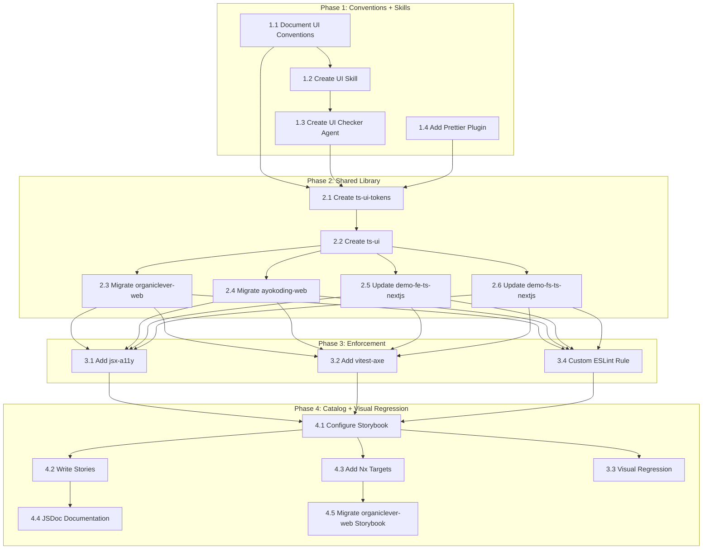

# Delivery Plan: UI Development Improvement

## Phase 1: Conventions + Skills (Foundation)

_Establish the knowledge layer before building infrastructure. No code changes to apps — only
governance docs, skill files, agent files, and Prettier config._

### 1.1 Document UI Conventions

**Goal**: Create `governance/development/frontend/` with four convention documents.

- [ ] Create `governance/development/frontend/` directory
- [ ] Write `governance/development/frontend/README.md` — index linking all four convention docs
- [ ] Write `design-tokens.md`:
  - Reference [Color Accessibility Convention](../../governance/conventions/formatting/color-accessibility.md)
    — all color tokens must produce WCAG AA compliant contrast ratios; chart/status colors
    must come from the mandatory accessible palette
  - Token categories: structural (radius, spacing, typography) vs. brand (primary, accent)
  - Naming convention: `--color-{name}` in `@theme`, `--{name}` as base HSL variable
  - The structural-vs-brand split: what goes in shared lib vs. app-level override
  - Dark mode: every visual token must have a `.dark` counterpart; verify contrast in both modes
  - When to create a new token vs. reuse an existing one (decision tree)
  - Code examples showing correct token usage in Tailwind utilities
  - Code examples showing the per-app override pattern
- [ ] Write `component-patterns.md`:
  - Reference [Simplicity Over Complexity](../../governance/principles/general/simplicity-over-complexity.md)
    — single-purpose components, minimum viable abstraction, Rule of Three for extraction
  - Reference [Explicit Over Implicit](../../governance/principles/software-engineering/explicit-over-implicit.md)
    — all props typed and documented, no hidden defaults, data-slot for explicit identity
  - Reference [Progressive Disclosure](../../governance/principles/content/progressive-disclosure.md)
    — basic usage first, advanced patterns (compound variants, asChild) in separate sections
  - File structure: `component-name/component-name.tsx`, `.variants.ts`, `.stories.tsx`, `.test.tsx`
  - CVA variant definitions: how to define variants, compound variants, default variants
  - Radix primitive composition: `import { Slot } from "radix-ui"` (unified package)
  - `React.ComponentProps<"element">` pattern (not `React.forwardRef`)
  - `cn()` utility: when to use, how to import from shared lib
  - `data-slot` attribute: required on all component root elements
  - Required states: default, hover, focus-visible, active, disabled, loading, error, success
  - asChild pattern: when and how to use `<Slot>` for composition
  - Code example: complete component following all patterns
- [ ] Write `accessibility.md`:
  - Reference [Accessibility First](../../governance/principles/content/accessibility-first.md)
    principle as the governing principle
  - Reference [Color Accessibility Convention](../../governance/conventions/formatting/color-accessibility.md)
    for the mandatory 5-color accessible palette (#0173B2, #DE8F05, #029E73, #CC78BC, #CA9161)
  - WCAG AA compliance: minimum requirements for all components (4.5:1 normal text, 3:1 UI)
  - `focus-visible` (not `focus`): only show focus ring for keyboard users
  - `prefers-reduced-motion`: required `@media` query or Tailwind `motion-reduce:` prefix
  - aria attributes by component type (button, dialog, input, menu, tooltip)
  - `<label>` required for every form input; `htmlFor` matching input `id`
  - `autocomplete` and `inputmode` attributes for form inputs
  - Minimum hit targets: 24px desktop, 44px mobile
  - No color-only status indicators: always include text labels and/or shapes
  - Image `alt` text: descriptive for informative images, empty for decorative
  - Color contrast: APCA preferred over WCAG 2.0 for perceptual accuracy
  - Keyboard navigation: all interactive elements reachable via Tab, activatable via Enter/Space
  - Screen reader compatibility: logical reading order, descriptive link text
- [ ] Write `styling.md`:
  - Reference [Implementation Workflow](../../governance/development/workflow/implementation.md)
    — make it work (utility classes) → make it right (extract patterns) → make it fast (optimize)
  - Tailwind v4 conventions: `@theme`, `@layer`, `@custom-variant`, `@source`, `@plugin`
  - Utility-first: use Tailwind classes in TSX, not CSS files (except `@layer base` in globals.css)
  - No `@apply` outside `@layer base` — it defeats the utility-first purpose
  - No `!important` — use `@layer` specificity or Tailwind modifiers instead
  - No inline `style=` props in production apps (demo-fe-ts-nextjs is exempt during Phase 2 migration)
  - Class ordering: managed by `prettier-plugin-tailwindcss` (automatic on save)
  - Defensive CSS: `overflow-hidden` on containers, `min-w-0` on flex children, `truncate` for text
  - Container queries (`@container`) preferred over viewport breakpoints where possible
  - Mobile-first: start with mobile styles, add `md:`, `lg:` for larger screens
  - Standard breakpoints: 375px (mobile), 768px (tablet), 1280px (desktop) — all components
    must look correct at these three widths
  - Touch targets: minimum 44px on mobile viewports (per Accessibility First principle)
  - No content hiding: content must be accessible at all viewports — adapt layout, don't amputate
  - Fluid typography: use `clamp()` or Tailwind responsive font sizes for text that scales
  - Font loading: use `next/font` for optimization, not CSS `font-family` declarations
- [ ] Update `governance/development/README.md` to add a "Frontend" section linking to the new directory
- [ ] Verify all new docs pass `npm run lint:md`

### 1.2 Create UI Development Skill

**Goal**: Create `.claude/skills/swe-developing-frontend-ui/` with SKILL.md and 5 reference modules.

- [ ] Create `.claude/skills/swe-developing-frontend-ui/SKILL.md`:
  - Frontmatter: `name: swe-developing-frontend-ui` and `description` fields only
  - Description text mentions: TSX, CSS, components, UI, design tokens, accessibility
  - Main body: overview of what the skill provides, when it triggers, how to use reference modules
  - Links to all 5 reference modules
  - Quick reference: most important do/don't rules (top 10)
- [ ] Create `reference/design-tokens.md`:
  - Actual CSS custom property names from our `globals.css` files
  - Both token formats documented (organiclever-web indirection vs. ayokoding-web direct)
  - Recommended usage: `bg-primary`, `text-muted-foreground`, `border-border`
  - Token-to-Tailwind mapping table (e.g., `--color-primary` → `bg-primary`, `text-primary`)
  - Spacing scale with pixel values and Tailwind utility names
- [ ] Create `reference/component-patterns.md`:
  - Complete Button example following all conventions
  - CVA variant definition template with TypeScript
  - Radix UI composition example (Dialog with trigger, content, close)
  - cn() usage patterns: conditional classes, responsive classes, variant overrides
  - Component file structure template
- [ ] Create `reference/anti-patterns.md`:
  - At least 12 anti-patterns with before/after code examples
  - Include the 12 patterns from tech-docs.md AD5
  - Each pattern: description, example violation (from our actual codebase where possible),
    correct approach, severity level
- [ ] Create `reference/accessibility.md`:
  - Component-type checklists (button, input, dialog, menu, tooltip, card)
  - ARIA attribute reference for each component type
  - Keyboard navigation requirements per component
  - Screen reader testing guidance
- [ ] Create `reference/brand-context.md`:
  - organiclever-web: business productivity, professional audience, neutral palette, data-heavy
  - ayokoding-web: educational, Indonesian tech community, approachable, content-focused, blue palette
  - demo apps: technical showcase, developer audience, minimal branding
  - oseplatform-web: Hugo/PaperMod, marketing, not applicable to component design
- [ ] Run `npm run sync:claude-to-opencode` to sync skill to OpenCode

### 1.3 Create UI Checker Agent

**Goal**: Create `swe-ui-checker` agent following maker-checker-fixer pattern.

- [ ] Create `.claude/agents/swe-ui-checker.md`:
  - Tools: Read, Glob, Grep, Write, Bash
  - Model: sonnet (cost-effective for validation; checker does not need opus reasoning depth)
  - Skills reference: `swe-developing-frontend-ui`
  - Input: path to component file or directory to audit
  - Output: report in `generated-reports/` using standard format
  - Six check dimensions with severity levels:
    1. Token compliance (HIGH): grep for hardcoded hex/rgb/hsl in TSX className and style props
    2. Accessibility (HIGH): check aria-*, role, focus-visible, labels, reduced-motion
    3. Component patterns (MEDIUM): verify CVA usage, cn() calls, data-slot, React.ComponentProps
    4. Dark mode (MEDIUM): verify dark variants exist for all visual tokens
    5. Responsive (LOW): check for mobile-first patterns, container queries
    6. Anti-patterns (VARIES): check against catalog from skill reference
  - Report format: criticality/confidence classification per finding
- [ ] Update `.claude/agents/README.md` to list `swe-ui-checker` under Validation agents
- [ ] Update `CLAUDE.md` AI Agents section to include `swe-ui-checker` under Validation
- [ ] Run `npm run sync:claude-to-opencode` to sync agent to OpenCode
- [ ] Test agent by running it against `apps/organiclever-web/src/components/ui/button.tsx`
- [ ] Verify report contains at least findings for: old Radix import, forwardRef pattern, missing data-slot

### 1.4 Add Prettier Tailwind Plugin

**Goal**: Install and configure `prettier-plugin-tailwindcss` for deterministic class ordering.

- [ ] Install: `npm install --save-dev prettier-plugin-tailwindcss`
- [ ] Update `.prettierrc.json` to add plugin and tailwindStylesheet:

  ```json
  {
    "printWidth": 120,
    "proseWrap": "preserve",
    "plugins": ["prettier-plugin-tailwindcss"],
    "tailwindStylesheet": "./apps/organiclever-web/src/app/globals.css"
  }
  ```

  Note: `tailwindStylesheet` is required for Tailwind v4 — without it, the plugin falls back
  to v3 behavior and may not sort classes correctly.

- [ ] Run initial format to establish baseline: `npx prettier --write "apps/**/src/**/*.tsx"`
- [ ] Review git diff — expect class reordering only, no functional changes
- [ ] Verify `nx affected -t lint` passes for all TypeScript frontend apps
- [ ] Verify pre-commit hook (`lint-staged`) picks up the plugin for `.tsx` files
- [ ] Commit the formatted files as a separate commit: `style: sort Tailwind classes with prettier-plugin-tailwindcss`

### Phase 1 Validation

- [ ] All 5 governance docs exist and pass `npm run lint:md`
- [ ] Skill SKILL.md exists with 5 reference modules
- [ ] `npm run sync:claude-to-opencode` succeeds without errors
- [ ] UI checker agent produces a meaningful report when run against an existing component
- [ ] Prettier sorts Tailwind classes in staged `.tsx` files during pre-commit
- [ ] `nx affected -t typecheck lint test:quick` passes (no regressions from Prettier changes)

---

## Phase 2: Shared Library (Infrastructure)

_Extract shared tokens and components into Nx libraries. One app migration at a time._

### 2.1 Create ts-ui-tokens Library

**Goal**: Centralize structural design tokens in an Nx library.

- [ ] Install Nx plugin: `npm install --save-dev @nx/js`
- [ ] Generate library: `nx g @nx/js:library libs/ts-ui-tokens`
- [ ] Verify generated `project.json` has a `build` target
- [ ] Create `src/tokens.css` with shared structural tokens:
  - Extract from organiclever-web `globals.css`: `--radius`, radius scale, base neutral colors
  - Define spacing scale: `--space-1: 0.25rem` through `--space-16: 4rem` (4pt system)
  - Define typography scale: `--text-xs` through `--text-4xl`
  - Include `@custom-variant dark (&:is(.dark *))` for dark mode support
  - Include border-color compatibility layer (Tailwind v4 migration)
  - Note: `@layer base { * { @apply border-border; } body { @apply bg-background text-foreground; } }`
    must remain in each app's own `globals.css` (not in shared tokens) — putting it in the
    shared file would apply it to all consumers including non-React apps like Flutter
- [ ] Create TypeScript token exports:
  - `src/colors.ts`: export token names as string constants (for programmatic access)
  - `src/spacing.ts`: export spacing scale as object
  - `src/typography.ts`: export type scale as object
  - `src/radius.ts`: export radius values as object
  - `src/index.ts`: barrel export
- [ ] Add `package.json` with name `@open-sharia-enterprise/ts-ui-tokens`
- [ ] Write `README.md` documenting: what tokens are shared, how to import, how to override per-app
- [ ] Verify `nx build ts-ui-tokens` succeeds

### 2.2 Create ts-ui Library

**Goal**: Create shared React component library consuming tokens from ts-ui-tokens.

- [ ] Install Nx plugin: `npm install --save-dev @nx/react`
- [ ] Generate library: `nx g @nx/react:library libs/ts-ui`
- [ ] Add dependency on `@open-sharia-enterprise/ts-ui-tokens` in `package.json`
- [ ] Create `src/utils/cn.ts` with shared cn() utility:

  ```typescript
  import { type ClassValue, clsx } from "clsx";
  import { twMerge } from "tailwind-merge";
  export function cn(...inputs: ClassValue[]) { return twMerge(clsx(inputs)); }
  ```

- [ ] Set up `components.json` for shadcn/ui CLI pointing to this library
- [ ] Extract initial 6 components (the intersection set + 2 commonly needed):
  - `src/components/alert/` — from ayokoding-web (more recent shadcn version)
  - `src/components/button/` — reconciled version (see reconciliation notes below)
  - `src/components/dialog/` — from ayokoding-web
  - `src/components/input/` — from ayokoding-web
  - `src/components/card/` — from organiclever-web (only place it exists)
  - `src/components/label/` — from organiclever-web (only place it exists)
- [ ] **Button reconciliation**: Merge the two Button implementations:
  - Use ayokoding-web's pattern: `React.ComponentProps`, `data-slot`, SVG auto-sizing, `aria-invalid`
  - Use ayokoding-web's 8 size variants (superset of organiclever-web's 4)
  - Use ayokoding-web's enhanced dark mode handling (explicit `dark:` prefixes)
  - Use `radix-ui` unified import (not `@radix-ui/react-slot`); note: use `Slot.Root`
    (not bare `Slot`) from the unified package
  - Keep all 6 variant types (default, destructive, outline, secondary, ghost, link)
- [ ] Configure `vitest.config.ts` with vitest-axe setup file
- [ ] Add unit tests for each component:
  - Renders without crashing
  - All variant combinations render
  - axe-core finds no a11y violations
  - Supports `asChild` prop
  - Forwards `className` via cn()
  - Has `data-slot` attribute
- [ ] Add `package.json` with name `@open-sharia-enterprise/ts-ui`
- [ ] Configure `project.json` with targets: `build`, `lint`, `test:unit`, `test:quick`
- [ ] Verify `nx build ts-ui` and `nx run ts-ui:test:quick` succeed

### 2.3 Migrate organiclever-web

**Goal**: Replace app-local tokens and components with shared library imports.

- [ ] Add dependencies: `@open-sharia-enterprise/ts-ui-tokens`, `@open-sharia-enterprise/ts-ui`
- [ ] Update `globals.css`:
  - Replace `@theme { ... }` structural tokens with
    `@import "@open-sharia-enterprise/ts-ui-tokens/tokens.css"`
  - Keep brand-specific overrides in a local `@theme` block:
    `--color-primary: hsl(var(--primary))` etc. with `:root { --primary: 0 0% 9%; }`
  - Keep chart token definitions (chart-1 through chart-5)
  - Remove `@layer utilities { body { font-family: ... } }` — replace with `next/font`
- [ ] Update font loading: Add `next/font/google` import for body font in `layout.tsx`
- [ ] Update component imports: Replace `@/components/ui/button` with
  `@open-sharia-enterprise/ts-ui` for the 4 shared components (Alert, Button, Dialog, Input)
- [ ] Remove `src/lib/utils.ts` — import `cn` from `@open-sharia-enterprise/ts-ui` instead
- [ ] Delete migrated component files from `src/components/ui/` (Alert, Button, Dialog, Input)
- [ ] Keep app-specific components: AlertDialog, Card, Label, Table (still in `src/components/ui/`)
- [ ] Update Storybook stories: update imports in remaining stories for app-specific components
- [ ] Verify all existing tests pass: `nx run organiclever-web:test:quick`
- [ ] Verify Storybook still works: `nx storybook organiclever-web`
- [ ] Verify dev server works: `nx dev organiclever-web`, spot-check key pages

### 2.4 Migrate ayokoding-web

**Goal**: Replace app-local tokens and components with shared library imports.

- [ ] Add dependencies: `@open-sharia-enterprise/ts-ui-tokens`, `@open-sharia-enterprise/ts-ui`
- [ ] Update `globals.css`:
  - Replace structural tokens in `@theme` with import from ts-ui-tokens
  - Keep brand-specific overrides: blue primary, blue ring, etc.
  - Keep sidebar tokens (sidebar-background through sidebar-ring) — app-specific
  - Keep `@source` and `@plugin "@tailwindcss/typography"` directives
  - **Fix existing violations**: Replace hardcoded hex colors in code block CSS (`#f6f8fa`,
    `#24292e`, `#e1e4e8`) with CSS custom properties or token references
  - **Fix existing violations**: Remove `!important` from code block styles — use `@layer`
    specificity instead
- [ ] Update component imports: Replace `src/components/ui/button` etc. with shared lib
- [ ] Remove `src/lib/utils.ts` — import `cn` from shared lib
- [ ] Delete migrated component files from `src/components/ui/` (Alert, Button, Dialog, Input)
- [ ] Keep app-specific components: Badge, Command, DropdownMenu, ScrollArea, Separator, Sheet,
  Tabs, Tooltip, plus all content components (Breadcrumb, Footer, Header, etc.)
- [ ] Verify: `nx run ayokoding-web:test:quick`
- [ ] Verify dev server: `nx dev ayokoding-web`, check content pages render correctly

### 2.5 Update demo-fe-ts-nextjs

**Goal**: Replace inline styles with Tailwind + shared tokens.

- [ ] Add dependencies: `@tailwindcss/postcss`, `@tailwindcss/vite`,
  `@open-sharia-enterprise/ts-ui-tokens`, `@open-sharia-enterprise/ts-ui`
- [ ] Create `src/app/globals.css`:
  - `@import "tailwindcss"`
  - `@import "@open-sharia-enterprise/ts-ui-tokens/tokens.css"`
  - Minimal brand overrides (demo apps use neutral palette — may need no overrides)
- [ ] Import `globals.css` in `src/app/layout.tsx`
- [ ] Convert `src/components/layout/AppShell.tsx`:
  - Replace inline `style={{ display: 'flex', ... }}` with `className="flex ..."`
  - Replace `useBreakpoint()` JavaScript detection with Tailwind responsive prefixes
- [ ] Convert `src/components/layout/Header.tsx`: inline styles → Tailwind utilities
- [ ] Convert `src/components/layout/Sidebar.tsx`: inline styles → Tailwind utilities
- [ ] Import Button, Card, etc. from `@open-sharia-enterprise/ts-ui` where appropriate
- [ ] Remove `useBreakpoint()` hook if no longer needed
- [ ] Add/update unit tests for converted components
- [ ] Verify: `nx run demo-fe-ts-nextjs:test:quick`

### 2.6 Update demo-fs-ts-nextjs

**Goal**: Same approach as demo-fe-ts-nextjs.

- [ ] Add Tailwind v4 + shared token dependency
- [ ] Create globals.css with shared token import
- [ ] Convert any inline styles to Tailwind utilities
- [ ] Import shared components where appropriate
- [ ] Verify: `nx run demo-fs-ts-nextjs:test:quick`

### Phase 2 Validation

- [ ] `nx affected -t typecheck lint test:quick build` succeeds for all consuming apps
- [ ] `nx graph` shows dependency edges: ts-ui-tokens → ts-ui → {organiclever-web, ayokoding-web, demo-fe-ts-nextjs}
- [ ] No duplicate structural token definitions remain in any app's `globals.css`
- [ ] Each app's `globals.css` contains only brand-specific overrides and app-specific tokens
- [ ] No hardcoded hex colors remain in ayokoding-web's `globals.css`
- [ ] No `!important` declarations remain in ayokoding-web's `globals.css`
- [ ] All shared components use unified `radix-ui` import and `React.ComponentProps` pattern

---

## Phase 3: Automated Enforcement (Quality Gate)

_Add programmatic checks to the CI pipeline. Fix existing violations before enabling rules._

### 3.1 Add eslint-plugin-jsx-a11y

**Goal**: Catch accessibility violations at lint time.

- [ ] Install: `npm install --save-dev eslint-plugin-jsx-a11y`
- [ ] Update ESLint flat config in each TypeScript frontend app (`eslint.config.mjs`):

  ```javascript
  import jsxA11y from 'eslint-plugin-jsx-a11y';
  // Add to config array:
  jsxA11y.flatConfigs.recommended,
  ```

- [ ] Run `nx run-many -t lint --projects=organiclever-web,ayokoding-web,demo-fe-ts-nextjs` to
  find existing violations
- [ ] Fix all existing violations (expect: missing alt text, missing labels, etc.)
- [ ] Verify `nx affected -t lint` passes cleanly
- [ ] Commit fixes separately from config change: first config, then fixes

### 3.2 Add vitest-axe to Unit Tests

**Goal**: Automated accessibility assertions in component unit tests.

- [ ] Install in root: `npm install --save-dev vitest-axe`
- [ ] Verify `@testing-library/react` is already available:
  - organiclever-web: yes (in devDependencies)
  - demo-fe-ts-nextjs: yes (in devDependencies)
  - ts-ui: add if not present from generator
- [ ] Create `libs/ts-ui/vitest.setup.ts`:

  ```typescript
  import 'vitest-axe/extend-expect';
  ```

- [ ] Update `libs/ts-ui/vitest.config.ts` to include setup file:

  ```typescript
  setupFiles: ['./vitest.setup.ts'],
  ```

- [ ] Add `expectAccessible()` test helper in `libs/ts-ui/src/test-utils/a11y.ts`:

  ```typescript
  import { axe } from 'vitest-axe';
  export async function expectAccessible(container: HTMLElement) {
    const results = await axe(container);
    expect(results).toHaveNoViolations();
  }
  ```

- [ ] Add accessibility tests to all 6 shared components in ts-ui
- [ ] Ensure test:unit includes a11y tests — failures break test:quick
- [ ] Verify: `nx run ts-ui:test:quick`

### 3.3 Add Playwright Visual Regression

**Goal**: Catch unintended visual changes to shared components.

- [ ] Create `libs/ts-ui/e2e/` directory for component visual tests
- [ ] Create Playwright config for component screenshots:
  - Use Storybook URLs as test targets (e.g., `localhost:6006/iframe.html?id=button--default`)
  - **Prerequisite**: Storybook must be configured first (Phase 4, step 4.1). Run step 4.1
    before this step, or use a standalone test HTML page as an alternative.
  - Set `toHaveScreenshot()` threshold: `maxDiffPixelRatio: 0.01` (1% tolerance)
- [ ] Write visual tests for each shared component:
  - Default state, all variants, dark mode toggle, disabled state
  - **Three viewport sizes per component**: 375px (mobile), 768px (tablet), 1280px (desktop)
  - Screenshot naming: `{component}-{variant}-{theme}-{viewport}.png`
- [ ] Generate initial baseline screenshots: `npx playwright test --update-snapshots`
- [ ] Commit baselines to git under `libs/ts-ui/e2e/screenshots/`
- [ ] Add Nx target `test:visual` to ts-ui `project.json`
- [ ] Document baseline update process in `libs/ts-ui/README.md`:
  - When: after intentional visual changes
  - How: `nx run ts-ui:test:visual -- --update-snapshots`
  - Review: `git diff` on `.png` files before committing

**Trade-off note**: Git-committed screenshots add repository size but are simpler than SaaS
alternatives (Chromatic, Percy). With ~6 components × ~10 variants × 2 themes × 3 viewports
= ~360 screenshots at ~50KB each = ~18MB — larger but still acceptable for a monorepo. Can
be reduced by limiting viewport coverage to components that actually change across breakpoints.

### 3.4 Add Custom ESLint Rule for Token Usage

**Goal**: Prevent hardcoded design values in TSX files.

- [ ] Create a custom ESLint rule in the shared ESLint config (or a local plugin file):
  - Rule name: `no-hardcoded-design-values`
  - Detect: hex colors in `className` strings (`#[0-9a-fA-F]{3,8}`)
  - Detect: hex/rgb/hsl in `style` prop objects
  - Detect: Tailwind arbitrary color values (`text-[#...]`, `bg-[#...]`, `border-[#...]`)
  - Error message: "Use a design token instead of hardcoded color value"
  - Severity: `error` for production apps, `warn` for demo apps
- [ ] Configure rule in ESLint flat config for frontend apps
- [ ] Fix existing violations (mainly in ayokoding-web code block CSS if not already fixed in Phase 2)
- [ ] Verify: `nx affected -t lint` passes cleanly

**Trade-off note**: This is a regex-based rule, not AST-based. It may produce false positives
for hex values in SVG data URIs, test fixtures, or commented code. These cases can be suppressed
with `// eslint-disable-next-line`. The simplicity of regex-based detection is worth the
occasional false positive vs. building a full AST visitor plugin.

### Phase 3 Validation

- [ ] `nx affected -t lint` catches hardcoded hex colors in TSX files
- [ ] `nx affected -t test:quick` includes a11y assertions for all shared components
- [ ] Visual regression tests run via `nx run ts-ui:test:visual` and catch visual changes
- [ ] Pre-push hook (`nx affected -t typecheck lint test:quick`) catches all new violations
- [ ] Zero existing violations in the codebase after cleanup

---

## Phase 4: Component Catalog (Documentation)

_Make the design system browsable and self-documenting._

### 4.1 Configure Storybook for ts-ui

**Goal**: Comprehensive component catalog for the shared library.

- [ ] Set up `libs/ts-ui/.storybook/main.ts`:
  - Framework: `@storybook/nextjs-vite` (matching organiclever-web's existing setup)
  - Stories glob: `../src/**/*.stories.@(ts|tsx)`
  - Add `@tailwindcss/vite` plugin for Tailwind v4 support
- [ ] Set up `libs/ts-ui/.storybook/preview.ts`:
  - Import shared tokens CSS
  - Configure dark mode support via `@storybook/addon-themes`
  - Set viewport presets: Mobile (375px), Tablet (768px), Desktop (1280px)
- [ ] Install Storybook addons:
  - `@storybook/addon-a11y` — inline accessibility checking
  - `@storybook/addon-themes` — light/dark mode toggle
  - `@storybook/addon-docs` — auto-generated docs from JSDoc/TypeScript types

### 4.2 Write Component Stories

**Goal**: Every exported component has complete story coverage.

- [ ] For each of the 6 shared components, create `.stories.tsx` with:
  - **Default**: Component in default state
  - **All Variants**: One story per variant (e.g., Button: default, destructive, outline,
    secondary, ghost, link)
  - **All Sizes**: One story per size (e.g., Button: default, xs, sm, lg, icon, icon-xs,
    icon-sm, icon-lg)
  - **Dark Mode**: Same stories with dark theme applied
  - **Disabled**: Component in disabled state
  - **With Icon**: Component with icon child (where applicable)
  - **Responsive**: Component at mobile/tablet/desktop viewports (where layout changes)
  - **Interactive**: Story with args controls for live manipulation
  - **Do/Don't**: Side-by-side correct vs. incorrect usage
- [ ] Organize stories in sidebar: group by category (Forms, Feedback, Layout, Navigation)
- [ ] Add story descriptions referencing convention docs

### 4.3 Add Nx Targets for Storybook

**Goal**: Run Storybook via standard Nx commands.

- [ ] Install Nx Storybook plugin: `npm install --save-dev @nx/storybook`
- [ ] Add `storybook` target to `libs/ts-ui/project.json`:

  ```json
  "storybook": {
    "executor": "@nx/storybook:storybook",
    "options": { "configDir": ".storybook", "port": 6006 }
  }
  ```

- [ ] Add `build-storybook` target:

  ```json
  "build-storybook": {
    "executor": "@nx/storybook:build",
    "options": { "configDir": ".storybook", "outputDir": "dist/storybook" }
  }
  ```

- [ ] Mark `build-storybook` as cacheable in `nx.json`
- [ ] Document: `nx storybook ts-ui` to start dev server, `nx build-storybook ts-ui` for static build

### 4.4 Add Component JSDoc Documentation

**Goal**: Types and descriptions visible in Storybook docs panel and editor tooltips.

- [ ] Add JSDoc comments to all exported component props interfaces
- [ ] Add JSDoc comments to all exported component functions
- [ ] Add JSDoc comments to all CVA variant type definitions
- [ ] Verify Storybook's auto-docs panel shows: description, props table, default values

### 4.5 Migrate organiclever-web Storybook (Optional)

**Goal**: Remove app-level Storybook if all stories are in shared lib.

- [ ] Move any remaining app-specific stories to appropriate location
- [ ] If all UI component stories are in `libs/ts-ui/`, remove `apps/organiclever-web/.storybook/`
- [ ] If app-specific stories remain, keep app-level Storybook alongside shared one
- [ ] Update organiclever-web README to point to `nx storybook ts-ui` for component reference

### Phase 4 Validation

- [ ] `nx storybook ts-ui` launches successfully with all 6 components visible
- [ ] Accessibility panel shows zero violations for all stories
- [ ] All variant × size combinations are covered in stories
- [ ] Dark mode toggle works for all stories
- [ ] Docs panel shows prop types, descriptions, and default values
- [ ] A new developer can find and understand any component by browsing the catalog

---

## Dependency Graph



**Parallelism opportunities**:

- Phase 1: Steps 1.1-1.3 are sequential, but 1.4 (Prettier plugin) is independent
- Phase 2: Steps 2.3-2.6 (app migrations) can run in parallel after 2.2
- Phase 3: All four steps (3.1-3.4) can run in parallel
- Phase 4: Steps 4.1 and 4.3 are parallel; 4.2 and 4.4 follow

## Risk Considerations

| Risk | Likelihood | Impact | Mitigation |
| --- | --- | --- | --- |
| Token reconciliation between apps produces unexpected visual changes | Medium | High | Use organiclever-web as structural canonical; screenshot before/after each migration; per-app brand overrides preserve existing look |
| Breaking existing components during extraction | Medium | High | Migrate one app at a time; run full `test:quick` after each; keep app-specific components local |
| Storybook version conflicts in monorepo | Low | Medium | Pin version in root package.json; use same `@storybook/nextjs-vite` already in use |
| Visual regression flakiness in CI | Medium | Medium | Set 1% pixel threshold; use consistent CI environment; document baseline update process |
| Skill triggers too broadly on TSX edits | Low | Low | Refine skill `description` wording to scope context-matching to UI component work |
| Prettier plugin reformats too aggressively | Low | Medium | Run initial format as separate commit; review diff before merging; revert if unexpected changes |
| Custom ESLint rule false positives | Medium | Low | Start with `warn` severity; suppress known false positives; promote to `error` after stabilization |
| shadcn/ui model tension (copy-own vs. shared) | Medium | Medium | Clearly document that shared components are governed by ts-ui maintainers; app-specific extensions are app-owned |
