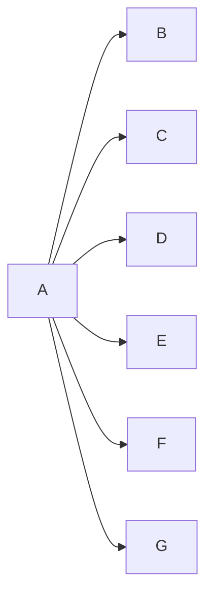
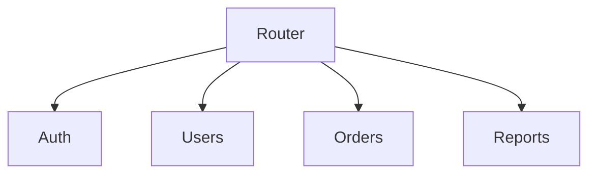
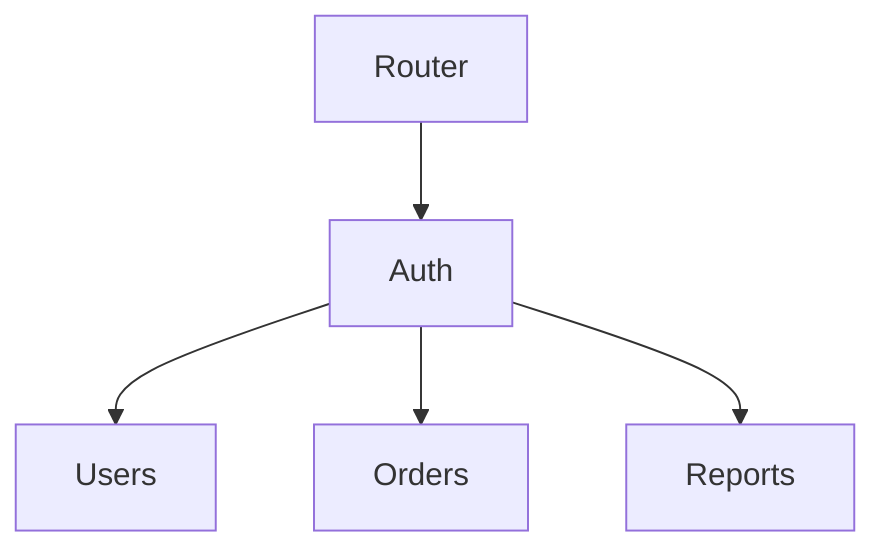
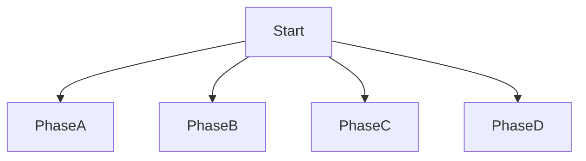
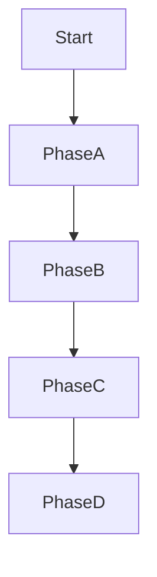

# Tech Docs — Fix Mermaid Validation and Violations

## Phase 0 — Direction-Aware Validator + Threshold Update (rhino-cli)

### Files to change

- `apps/rhino-cli/internal/mermaid/validator.go` — defaults + `ValidateBlocks` logic
- `apps/rhino-cli/internal/mermaid/validator_test.go` — fix broken tests + add LR cases
- `apps/rhino-cli/cmd/docs_validate_mermaid.go` — update CLI flag defaults

### Threshold changes

| Setting    | Old | New           | Rationale                                            |
| ---------- | --- | ------------- | ---------------------------------------------------- |
| `MaxWidth` | 3   | 4             | 3 was too strict; 4 allows common 4-branch patterns  |
| `MaxDepth` | 5   | `math.MaxInt` | No vertical limit — depth is unconstrained by design |

`DefaultValidateOptions()` change:

```go
// Before
return ValidateOptions{MaxLabelLen: 30, MaxWidth: 3, MaxDepth: 5}

// After
return ValidateOptions{MaxLabelLen: 30, MaxWidth: 4, MaxDepth: math.MaxInt}
```

Consequence of `MaxDepth: math.MaxInt`: the `complex_diagram` warning branch
(`horizontal > MaxWidth AND vertical > MaxDepth`) can never fire with default options
because no integer exceeds `math.MaxInt`. The `complex_diagram` infrastructure is
preserved for users who pass `--max-depth N` explicitly via CLI, but by default it is
inactive. All current `complex_diagram` warnings disappear after this change.

CLI flag defaults (`docs_validate_mermaid.go`):

```go
// --max-width: 3 → 4
// --max-depth: 5 → 0  (0 = no limit; map 0 → math.MaxInt in runValidateMermaid)
```

### Direction-aware logic change (`ValidateBlocks`)

```go
span := MaxWidth(diagram.Nodes, diagram.Edges)
depth := Depth(diagram.Nodes, diagram.Edges)

// LR/RL: rank columns flow left-to-right → depth is the horizontal dimension.
// TD/TB/BT (default): nodes per rank flow horizontally → span is horizontal.
var horizontal, vertical int
switch diagram.Direction {
case DirectionLR, DirectionRL:
    horizontal, vertical = depth, span
default:
    horizontal, vertical = span, depth
}

if horizontal > opts.MaxWidth && vertical > opts.MaxDepth {
    // complex_diagram warning (inactive with default MaxDepth=math.MaxInt)
    ...
} else if horizontal > opts.MaxWidth {
    // width_exceeded violation
    ...
}
```

### Existing tests that break (must update)

Three existing test cases use `defaultOpts` and will fail after the threshold change:

| Test name                         | Why it breaks                                     | Fix                                                    |
| --------------------------------- | ------------------------------------------------- | ------------------------------------------------------ |
| `"width at limit+1 violation"`    | span=4 — no longer violates at MaxWidth=4         | Use span=5 source                                      |
| `"both exceeded warning only"`    | span=4, depth=6 — horizontal(4) not > MaxWidth(4) | Use explicit `ValidateOptions{MaxWidth:3, MaxDepth:5}` |
| `"width only exceeded violation"` | span=4 — no longer violates at MaxWidth=4         | Use explicit opts or span=5 source                     |

Also add test that `"width exactly at limit no violation"` at span=4 passes (new
at-limit case for MaxWidth=4).

### New test sources needed

```go
// span5depth3Source: TD, span=5>4, depth=3 → width_exceeded with defaultOpts
// span=5: A→B,C,D,E,F; B→G

// lrDepth6Span2Source: LR, depth=6>4, span=2 → width_exceeded with defaultOpts
// chain A→B→C→D→E→F, plus A→G (span=2 at rank 1)

// lrSpan5Depth2Source: LR, span=5, depth=2 → no violation (span=vertical for LR)
// A→B,C,D,E,F (all at rank 1, depth=2)
```

### New direction-aware test cases

| Direction | Span | Depth | Opts                       | Expected                                     |
| --------- | ---- | ----- | -------------------------- | -------------------------------------------- |
| LR        | 2    | 6     | defaultOpts (MaxWidth=4)   | `width_exceeded` (LR horizontal=depth=6 > 4) |
| LR        | 5    | 2     | defaultOpts                | no violation (LR horizontal=depth=2 ≤ 4)     |
| TD        | 5    | 3     | defaultOpts                | `width_exceeded` (TD horizontal=span=5 > 4)  |
| TD        | 2    | 6     | defaultOpts                | no violation (TD horizontal=span=2 ≤ 4)      |
| TD        | 4    | —     | defaultOpts                | no violation (span=4 = MaxWidth=4, not >)    |
| LR        | 6    | 4     | `{MaxWidth:3, MaxDepth:5}` | `complex_diagram` warning                    |

### Verification

```bash
npx nx run rhino-cli:test:unit
npx nx run rhino-cli:test:quick

# Re-audit docs with updated validator
go run ./apps/rhino-cli/main.go docs validate-mermaid 2>&1 | tee local-temp/mermaid-audit-phase0.txt
grep -c "^✗" local-temp/mermaid-audit-phase0.txt
```

### Commit

```
fix(rhino-cli): make width_exceeded check direction-aware

For graph LR/RL, depth (rank columns) is the horizontal dimension.
For graph TD/TB/BT, span (nodes per rank) is the horizontal dimension.
Previously, span was always used, producing false positives on tall LR
diagrams and false negatives on deeply chained LR diagrams.
```

## Validator Rules

`rhino-cli docs validate-mermaid` scans every ` ```mermaid ` block in every `.md` file
under the repo root. For each block it builds an adjacency model and applies three rules:

| Rule              | Threshold (after Phase 0)                      | Severity              |
| ----------------- | ---------------------------------------------- | --------------------- |
| `width_exceeded`  | Horizontal dimension > 4 (direction-aware)     | ✗ Error               |
| `label_too_long`  | Any `<br/>`-split line > 30 raw chars          | ✗ Error               |
| `complex_diagram` | Horizontal > 4 **and** vertical > MaxDepth (∞) | ⚠ Inactive by default |

**Horizontal dimension** = direction-aware:

- `graph TD / TB / BT`: horizontal = **span** (nodes per rank row)
- `graph LR / RL`: horizontal = **depth** (number of rank columns)

**Vertical dimension** = the other axis (unconstrained by default; `MaxDepth=math.MaxInt`).

**Raw chars** = character count of each `<br/>`-split line segment before HTML-entity
decoding. `#40;` counts as 4 chars, not 1. A label `"Init<br/>PaymentGateway#40;id#41;"`
has two lines: `"Init"` (4) and `"PaymentGateway#40;id#41;"` (24) — the second is
the measured value.

## How the Validator Works

Source: `apps/rhino-cli/internal/mermaid/` + `apps/rhino-cli/cmd/docs_validate_mermaid.go`.

### Step 1 — File Collection

Without arguments, `collectMDDefaultDirs` scans these locations:

| Path          | Notes                          |
| ------------- | ------------------------------ |
| `docs/`       | All `.md` recursively          |
| `governance/` | All `.md` recursively          |
| `.claude/`    | All `.md` recursively          |
| Root `*.md`   | `README.md`, `CLAUDE.md`, etc. |

Excluded directories: `.next/`, `node_modules/`, `.git/`.

With explicit args (`docs validate-mermaid docs/ governance/`), only those paths are
walked. `--staged-only` and `--changed-only` flags scope to git-tracked changes.

### Step 2 — Block Extraction (`extractor.go:ExtractBlocks`)

Line-by-line scan. Opening fence: ` ```mermaid` or `~~~mermaid`. Closing fence:
` ``` ` or `~~~`. Captures raw source text, 1-based `StartLine`, and 0-based
`BlockIndex` within the file.

Only `flowchart` and `graph` headers trigger rules 1 and 2. All other Mermaid diagram
types (`sequenceDiagram`, `classDiagram`, `gantt`, `pie`, `gitGraph`, etc.) are
silently skipped — they are extracted but produce zero violations.

### Step 3 — Graph Parsing (`parser.go:ParseDiagram`)

Builds a node-and-edge model from the block source:

**What is skipped**:

- Lines starting with `subgraph` or equal to `end` are skipped entirely — they add
  nothing to the node or edge model.
- `classDef`, `class`, `style`, `click` lines fail all node patterns and are ignored.

**What is parsed**:

- **Edge lines** (contain `-->`, `---`, `-.->`, `==>`, `--o`, `--x`, `<-->`): split
  on the arrow token into segments. Each adjacent segment pair → a `(From, To)` edge.
  Edge-label syntax `A -- text --> B` is normalized to `A --> B` before splitting.
  **`&` parallel-edge syntax is not parsed** — only the first node of a multi-node
  segment is recognized; the rest are silently dropped.
- **Standalone node lines** (no arrow token): `A["Label"]`, `A(Label)`, `A{Label}`,
  etc. — node ID and label extracted using shape-specific regexes.
- **Direction** (`TD`, `LR`, `BT`, etc.) is captured but **has no effect on rank
  calculation**. The algorithm is graph-topology-driven.

Labels are normalized: surrounding quotes and backticks stripped.

### Step 4 — Rank Assignment (`graph.go:rankAssign`)

Kahn's BFS, longest-path variant:

1. Every node with **in-degree 0** (no incoming edges) starts at **rank 0**. This
   includes disconnected nodes, nodes declared only as standalone lines with no
   in-edges, and cycle-fallback nodes.
2. For each edge `From → To`: `rank[To] = max(rank[To], rank[From] + 1)`.
3. Nodes in cycles (never dequeued) fall back to rank 0.

**Width** = count of nodes sharing the same rank, maximized across all ranks.
**Depth** = number of distinct rank values.

### Step 5 — Rules Applied (`validator.go:ValidateBlocks`)

````
Rule 1  label_too_long   (Violation — exit 1):
  Split label on <br/>, <BR/>, <br>, <BR>, literal \n.
  Measure each segment by Unicode rune count.
  HTML entities are NOT decoded: #40; = 4 runes, not 1.
  If the longest segment > 30 runes → violation.

Rule 2a width_exceeded   (Violation — exit 1):
  If span > 3 AND depth ≤ 5 → violation.

Rule 2b complex_diagram  (Warning — exit 0):
  If span > 3 AND depth > 5 (BOTH exceeded) → warning, not error.

Rule 3  multiple_diagrams (Violation — exit 1):
  If one ```mermaid block contains > 1 flowchart/graph headers → violation.

  depth > 5 alone (span ≤ 3) → no output at all.
````

### Key Implications for Fixers

| Observation                                   | Implication                                                                                                                                                                                                                              |
| --------------------------------------------- | ---------------------------------------------------------------------------------------------------------------------------------------------------------------------------------------------------------------------------------------- |
| `subgraph`/`end` lines skipped by parser      | Visual `subgraph` blocks do **not** reduce BFS width. Standalone node declarations inside a subgraph with no incoming edges become rank-0 sources, potentially **increasing** width. Fix must be topological (real edges), not cosmetic. |
| Direction changes the checked axis            | After Phase 0: changing `graph TD` to `graph LR` switches the checked axis from span to depth. This is **Strategy 0** — the cheapest fix when `min(span, depth) ≤ 4`.                                                                    |
| `#40;` counts as 4 runes                      | Replace with literal `(` in quoted labels to save 3 chars per entity (Strategy 4a).                                                                                                                                                      |
| Any in-degree-0 node → rank 0                 | Adding a new node with no incoming edges adds to rank-0 width. Wire it in with an edge or it worsens span.                                                                                                                               |
| `complex_diagram` warning inactive by default | With `MaxDepth=math.MaxInt`, the both-exceeded branch never fires. Warning disappears with Phase 0. Strategy 5 is vestigial — skip it.                                                                                                   |

## Fix Strategy 0 — Direction Flip (`width_exceeded`) — try first

**Condition**: `min(span, depth) ≤ 4`

Choose the direction that puts the smaller dimension on the horizontal axis. Since
only horizontal is constrained (≤ 4), and vertical is unlimited, you always want:

- Use `graph TD` when `span ≤ depth` (span is horizontal for TD)
- Use `graph LR` when `depth < span` (depth is horizontal for LR)

If `min(span, depth) ≤ 4`, this is a **one-word fix** — change `TD` to `LR` or vice
versa. No structural changes, no semantic loss.

**Example**: `graph TD`, span=6, depth=3



Before (TD): horizontal=span=6 > 4 → violation.
After (LR): horizontal=depth=2 ≤ 4 → passes. One word changed.

**Limit**: if `min(span, depth) > 4`, both directions violate — use Strategy 1 or 2.

## Fix Strategy 1 — Sequential Chaining in Groups (`width_exceeded`)

When a node fans out to > 3 children and those children have a natural sequential or
hierarchical relationship, introduce intermediate grouping nodes connected by **real
edges** — not `subgraph` wrappers, which the parser skips.

> **Subgraph warning**: `subgraph` and `end` lines are skipped by the validator's
> parser. Standalone node declarations inside a subgraph that have no edges connecting
> them to the outer graph are rank-0 sources — they **increase** width, not reduce it.
> Always pair subgraph visual grouping with actual edge topology changes.

**Before** (span = 4 at rank 1 — four services all direct children of Router):



**After** — Auth is a prerequisite for downstream services; chain it:



Ranks: Router=0 (1), Auth=1 (1), Users/Orders/Reports=2 (3). Max width = 3. ✓

This only applies when the chain is semantically correct (Auth actually gates the others).
When no natural sequence exists, use **Strategy 2 (diagram splitting)** instead.

## Fix Strategy 2 — Diagram Splitting (`width_exceeded`, `complex_diagram`)

When a single diagram tries to show too many concerns simultaneously, split it
into 2–3 focused diagrams. Each diagram covers one slice of the whole picture.

- Label each diagram with a heading that names what slice it shows.
- Add a short sentence between diagrams to explain the relationship between slices.
- Do not re-draw nodes from diagram N in diagram N+1 — refer to them in prose.

Use this strategy when nodes at the wide level have no natural grouping — they are
genuinely distinct concerns that should have separate diagrams.

## Fix Strategy 3 — Sequential Chaining (`width_exceeded`)

When a fan-out diagram actually represents a sequence (steps, phases, pipeline
stages), chain the nodes sequentially instead of radiating from one source.

**Before** (span 4 — all phases fan out from Start):



**After** (span 1 — linear chain):



Use when the diagram's prose describes a sequential process, not parallel branches.

## Fix Strategy 4 — Label Shortening (`label_too_long`)

Two sub-strategies:

### 4a — Replace HTML entities with literal characters

Mermaid quoted-label syntax (`Node["text"]`) accepts literal `()` inside quotes.
Replace `#40;` with `(` and `#41;` with `)` — saves 3 chars per entity.

Before: `"PaymentGateway#40;id#41;"` = 24 raw chars (over limit at 30 with prefix)
After: `"PaymentGateway(id)"` = 18 raw chars

### 4b — Rephrase / abbreviate

Shorten without losing meaning. Move detailed description to surrounding prose.

| Too long                                                                | Shortened                                                | Chars saved |
| ----------------------------------------------------------------------- | -------------------------------------------------------- | ----------- |
| `"Find @Component/@Service/@Repository"` (36)                           | `"Scan @Component / @Service"` (27)                      | 9           |
| `"Domain Layer<br/>Aggregates, Entities, Value Objects"` (35 on line 2) | `"Domain Layer<br/>Aggregates, Entities"` (22 on line 2) | 13          |
| `"Wrapped: get user from database"` (31)                                | `"Wrapped: fetch user from DB"` (27)                     | 4           |

Rule: the diagram shows **structure**; prose explains **detail**. Move the dropped
detail into the paragraph immediately before or after the diagram.

## Strategy Selection Guide

```
Is the violation label_too_long?
  → Strategy 4a first (replace #40;/#41; with literal parens).
  → Still over? Strategy 4b (rephrase/abbreviate; move detail to prose).

Is the violation width_exceeded?
  Step 1 — try direction flip (Strategy 0, cheapest):
    Compute span and depth of the diagram.
    Is min(span, depth) ≤ 4?
      YES → flip to the direction that puts min(span,depth) on the horizontal axis.
             TD if span ≤ depth; LR if depth < span. Done.
      NO  → both dimensions > 4; structural fix needed. Continue:

  Step 2 — structural fix:
    Are the wide nodes genuinely sequential? → Strategy 3 (chain).
    Can they be staged through a real intermediate node? → Strategy 1.
    Otherwise → Strategy 2 (split into focused diagrams).
```

## Batch File Inventory

### Batch 1 — `programming-languages/typescript/` (18 files)

```
typescript/README.md
typescript/anti-patterns.md
typescript/best-practices.md
typescript/concurrency-and-parallelism.md
typescript/domain-driven-design.md
typescript/error-handling.md
typescript/finite-state-machine.md
typescript/functional-programming.md
typescript/idioms.md
typescript/interfaces-and-types.md
typescript/linting-and-formatting.md
typescript/memory-management.md
typescript/modules-and-dependencies.md
typescript/performance.md
typescript/security.md
typescript/test-driven-development.md
typescript/type-safety.md
typescript/web-services.md
```

### Batch 2 — `programming-languages/python/` (15 files)

```
python/README.md
python/anti-patterns.md
python/best-practices.md
python/classes-and-protocols.md
python/concurrency-and-parallelism.md
python/domain-driven-design.md
python/error-handling.md
python/finite-state-machine.md
python/idioms.md
python/linting-and-formatting.md
python/modules-and-dependencies.md
python/performance.md
python/security.md
python/test-driven-development.md
python/web-services.md
```

### Batch 3 — `programming-languages/golang/` (11 files)

```
golang/README.md
golang/api-standards.md
golang/code-quality-standards.md
golang/concurrency-standards.md
golang/ddd-standards.md
golang/dependency-standards.md
golang/design-patterns.md
golang/error-handling-standards.md
golang/performance-standards.md
golang/security-standards.md
golang/type-safety-standards.md
```

### Batch 4 — `platform-web/tools/jvm-spring-boot/` (10 files)

```
jvm-spring-boot/README.md
jvm-spring-boot/configuration.md
jvm-spring-boot/data-access.md
jvm-spring-boot/dependency-injection.md
jvm-spring-boot/domain-driven-design.md
jvm-spring-boot/observability.md
jvm-spring-boot/performance.md
jvm-spring-boot/rest-apis.md
jvm-spring-boot/security.md
jvm-spring-boot/testing.md
```

### Batch 5 — `platform-web/tools/elixir-phoenix/` (8 files)

```
elixir-phoenix/channels.md
elixir-phoenix/contexts.md
elixir-phoenix/data-access.md
elixir-phoenix/deployment.md
elixir-phoenix/liveview.md
elixir-phoenix/observability.md
elixir-phoenix/performance.md
elixir-phoenix/testing.md
```

### Batch 6 — `platform-web/tools/fe-react/` (8 files)

```
fe-react/README.md
fe-react/component-architecture.md
fe-react/data-fetching.md
fe-react/hooks.md
fe-react/performance.md
fe-react/routing.md
fe-react/security.md
fe-react/state-management.md
```

### Batch 7 — `platform-web/tools/fe-nextjs/` (6 files)

```
fe-nextjs/README.md
fe-nextjs/app-router.md
fe-nextjs/data-fetching.md
fe-nextjs/middleware.md
fe-nextjs/performance.md
fe-nextjs/rendering.md
```

### Batch 8 — `programming-languages/elixir/` (6 files)

```
elixir/README.md
elixir/ddd-standards.md
elixir/otp-application.md
elixir/otp-genserver.md
elixir/otp-supervisor.md
elixir/protocols-behaviours-standards.md
```

### Batch 9 — `architecture/c4-architecture-model/` (5 files)

```
c4-architecture-model/README.md
c4-architecture-model/bounded-context-visualization.md
c4-architecture-model/diagram-standards.md
c4-architecture-model/notation-standards.md
c4-architecture-model/nx-workspace-visualization.md
```

### Batch 10 — Remaining errors (14 files)

```
programming-languages/c-sharp/README.md
programming-languages/clojure/README.md
programming-languages/f-sharp/README.md
programming-languages/java/README.md
programming-languages/kotlin/README.md
programming-languages/rust/README.md
platform-web/tools/jvm-spring/README.md
platform-web/tools/jvm-spring/web-mvc.md
software-engineering/development/README.md
docs/how-to/organize-work.md
docs/reference/system-architecture/README.md
docs/reference/system-architecture/applications.md
docs/reference/system-architecture/components.md
docs/reference/system-architecture/deployment.md
```

## Architecture

The mermaid validator is a subcommand of `rhino-cli`, the repository's Go CLI tool
located at `apps/rhino-cli/`. It integrates into the quality pipeline as follows:

```
git push
  └─ .husky/pre-push
       └─ npx nx run rhino-cli:validate:mermaid
            └─ go run apps/rhino-cli/main.go docs validate-mermaid governance/ .claude/
```

The `validate:mermaid` Nx target (defined in `apps/rhino-cli/project.json`) passes
`governance/` and `.claude/` as explicit path arguments, scoping hook enforcement to
those directories. Running the validator without arguments (as done in this plan's
delivery steps) scans all default directories including `docs/`, providing the
full-repo quality check used to gate each batch.

## File-Impact Analysis

High-risk batches (most diagrams, highest semantic-loss risk):

- **Batch 1 (TypeScript, 18 files)** — largest batch; most likely to have complex
  domain-driven-design and architecture diagrams where subgraph grouping could obscure
  layer relationships. Re-read surrounding prose carefully for each fix.
- **Batch 4 (JVM Spring Boot, 10 files)** — Spring layered-architecture diagrams are
  semantically dense; splitting is preferable to grouping when layers are genuinely
  distinct.
- **Batch 9 (C4 Architecture, 5 files)** — C4 diagrams document system boundaries;
  any restructuring that merges containers or components risks losing architectural
  meaning. Prefer label shortening over structural changes here.
- **Batch 10 (Remaining, 14 files)** — spans multiple unrelated areas; validate each
  file in isolation; the batch grep pattern must include `software-engineering/development`.

Lower-risk batches (mostly label violations, fewer structural diagrams):

- Batches 5, 6, 7 (Elixir Phoenix, React, Next.js) — primarily `label_too_long`
  violations from HTML entities; Strategy 4a (entity replacement) resolves most without
  structural changes.

## Rollback

Each batch is a single commit. To undo a batch after push:

```bash
# Find the batch commit SHA
git log --oneline | grep "batch N/10"

# Revert the batch commit (creates a new revert commit, safe for main)
git revert <batch-commit-sha>

# Confirm the revert restored the violations
go run ./apps/rhino-cli/main.go docs validate-mermaid 2>&1 | grep "batch-area-path/"
```

Re-fix the affected file(s) with the correct strategy and commit again as batch N/10.
Do not use `git reset --hard` on `main` — revert is the safe path.

## Dependencies

- **Go** ≥ 1.21 — required to run rhino-cli. Verify: `go version`
- **ose-primer repo** at `/Users/wkf/ose-projects/ose-primer` (or equivalent clone)
- **rhino-cli source** at `apps/rhino-cli/` within the repo — no pre-built binary
  required; `go run` compiles on demand
- **npm** ≥ 10 and **Node.js** ≥ 20 — required for `npm install` and Nx commands
- No Docker required (this plan touches only markdown files)

## Tooling

```bash
# Validate entire repo
go run ./apps/rhino-cli/main.go docs validate-mermaid

# Validate single file (check exit code and grep)
go run ./apps/rhino-cli/main.go docs validate-mermaid 2>&1 | grep "path/to/file.md"

# Count remaining errors
go run ./apps/rhino-cli/main.go docs validate-mermaid 2>&1 | grep -c "^\(✗\|⚠\)"
```

## Commit Convention

One commit per batch:

```
fix(docs): fix mermaid violations in typescript/ docs (batch 1/10)
fix(docs): fix mermaid violations in python/ docs (batch 2/10)
...
fix(docs): fix mermaid violations in remaining docs (batch 10/10)
```
