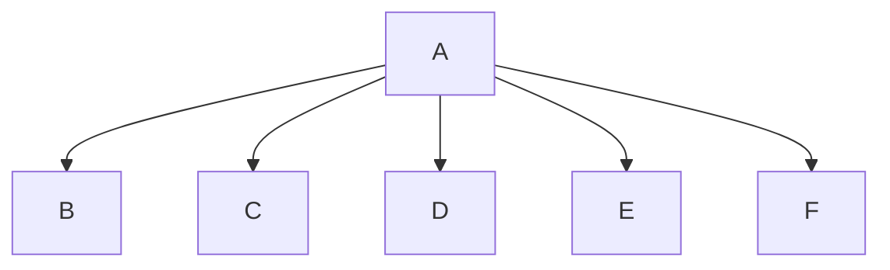
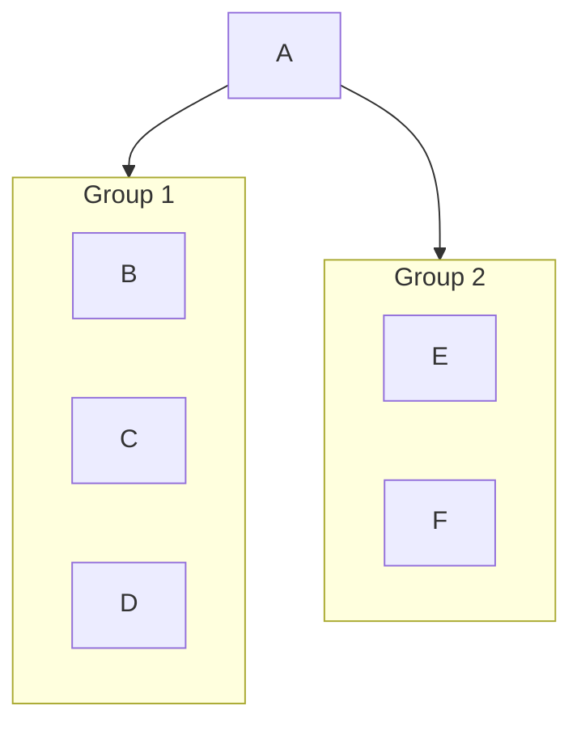
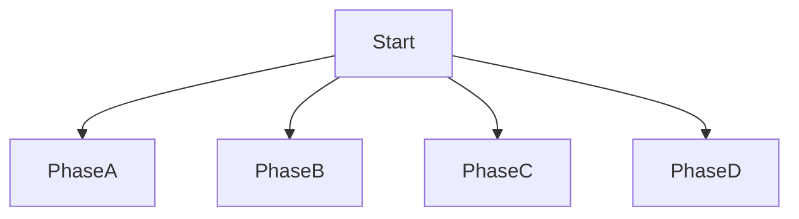
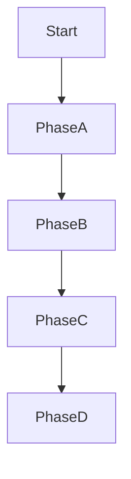

# Tech Docs — Fix Mermaid Violations

## Validator Rules

`rhino-cli docs validate-mermaid` scans every ` ```mermaid ` block in every `.md` file
under the repo root. For each block it builds an adjacency model and applies three rules:

| Rule              | Threshold                             | Severity  |
| ----------------- | ------------------------------------- | --------- |
| `width_exceeded`  | BFS level width > 3                   | ✗ Error   |
| `label_too_long`  | Any `<br/>`-split line > 30 raw chars | ✗ Error   |
| `complex_diagram` | Span > 3 **and** depth > 5 (both)     | ⚠ Warning |

**Span** = maximum number of nodes at any single BFS depth level across all connected
components. It is topology-driven, not direction-driven — changing `graph LR` to
`graph TD` alone does **not** fix width if multiple nodes share a BFS level.

**Raw chars** = character count of each `<br/>`-split line segment before HTML-entity
decoding. `#40;` counts as 4 chars, not 1. A label `"Init<br/>PaymentGateway#40;id#41;"`
has two lines: `"Init"` (4) and `"PaymentGateway#40;id#41;"` (24) — the second is
the measured value.

## Fix Strategy 1 — Subgraph Grouping (`width_exceeded`)

Group sibling nodes that share a parent into a `subgraph`. This collapses them into
one node at their parent's BFS level, reducing that level's width count.

**Before** (span = 5 at level 2):



**After** (span = 2 at level 1, then 3 at level 2 within subgraph):



Use this strategy when nodes at the wide level have a natural grouping (e.g.,
"infrastructure nodes", "domain services", "test phases").

## Fix Strategy 2 — Diagram Splitting (`width_exceeded`, `complex_diagram`)

When a single diagram tries to show too many concerns simultaneously, split it
into 2–3 focused diagrams. Each diagram covers one slice of the whole picture.

- Label each diagram with a heading that names what slice it shows.
- Add a short sentence between diagrams to explain the relationship between slices.
- Do not re-draw nodes from diagram N in diagram N+1 — refer to them in prose.

Use this strategy when nodes at the wide level have no natural grouping — they are
genuinely distinct concerns that should have separate diagrams.

## Fix Strategy 3 — Sequential Chaining (`width_exceeded`)

When a fan-out diagram actually represents a sequence (steps, phases, pipeline
stages), chain the nodes sequentially instead of radiating from one source.

**Before** (span 4 — all phases fan out from Start):



**After** (span 1 — linear chain):



Use when the diagram's prose describes a sequential process, not parallel branches.

## Fix Strategy 4 — Label Shortening (`label_too_long`)

Two sub-strategies:

### 4a — Replace HTML entities with literal characters

Mermaid quoted-label syntax (`Node["text"]`) accepts literal `()` inside quotes.
Replace `#40;` with `(` and `#41;` with `)` — saves 3 chars per entity.

Before: `"PaymentGateway#40;id#41;"` = 24 raw chars (over limit at 30 with prefix)
After: `"PaymentGateway(id)"` = 18 raw chars

### 4b — Rephrase / abbreviate

Shorten without losing meaning. Move detailed description to surrounding prose.

| Too long                                                                | Shortened                                                | Chars saved |
| ----------------------------------------------------------------------- | -------------------------------------------------------- | ----------- |
| `"Find @Component/@Service/@Repository"` (36)                           | `"Scan @Component / @Service"` (27)                      | 9           |
| `"Domain Layer<br/>Aggregates, Entities, Value Objects"` (35 on line 2) | `"Domain Layer<br/>Aggregates, Entities"` (22 on line 2) | 13          |
| `"Wrapped: get user from database"` (31)                                | `"Wrapped: fetch user from DB"` (27)                     | 4           |

Rule: the diagram shows **structure**; prose explains **detail**. Move the dropped
detail into the paragraph immediately before or after the diagram.

## Fix Strategy 5 — Topology Redesign (`complex_diagram`)

`complex_diagram` fires when BOTH span > 3 AND depth > 5. Fixing one dimension is
enough to downgrade from warning to nothing. Depth > 5 is common in pipeline diagrams;
span > 3 is common in service-map diagrams.

- Reduce depth: flatten intermediate nodes that are purely pass-through.
- Reduce span: apply Strategy 1 or 2.
- Acceptable to leave one dimension slightly over if the other is well within bounds,
  as long as the warning disappears (both must exceed to trigger).

## Strategy Selection Guide

```
Is the violation label_too_long?
  → Strategy 4a first (entity replacement), then 4b if still over.

Is the violation width_exceeded?
  → Are the wide nodes logically groupable?
      Yes → Strategy 1 (subgraph).
      No, but they're sequential → Strategy 3 (chain).
      No, genuinely parallel distinct concerns → Strategy 2 (split).

Is the violation complex_diagram?
  → Fix span first (Strategies 1–3). If depth is the easier axis, flatten instead.
```

## Batch File Inventory

### Batch 1 — `programming-languages/typescript/` (18 files)

```
typescript/README.md
typescript/anti-patterns.md
typescript/best-practices.md
typescript/concurrency-and-parallelism.md
typescript/domain-driven-design.md
typescript/error-handling.md
typescript/finite-state-machine.md
typescript/functional-programming.md
typescript/idioms.md
typescript/interfaces-and-types.md
typescript/linting-and-formatting.md
typescript/memory-management.md
typescript/modules-and-dependencies.md
typescript/performance.md
typescript/security.md
typescript/test-driven-development.md
typescript/type-safety.md
typescript/web-services.md
```

### Batch 2 — `programming-languages/python/` (15 files)

```
python/README.md
python/anti-patterns.md
python/best-practices.md
python/classes-and-protocols.md
python/concurrency-and-parallelism.md
python/domain-driven-design.md
python/error-handling.md
python/finite-state-machine.md
python/idioms.md
python/linting-and-formatting.md
python/modules-and-dependencies.md
python/performance.md
python/security.md
python/test-driven-development.md
python/web-services.md
```

### Batch 3 — `programming-languages/golang/` (10 files)

```
golang/README.md
golang/api-standards.md
golang/code-quality-standards.md
golang/concurrency-standards.md
golang/ddd-standards.md
golang/dependency-standards.md
golang/design-patterns.md
golang/error-handling-standards.md
golang/performance-standards.md
golang/security-standards.md
golang/type-safety-standards.md
```

### Batch 4 — `platform-web/tools/jvm-spring-boot/` (9 files)

```
jvm-spring-boot/README.md
jvm-spring-boot/configuration.md
jvm-spring-boot/data-access.md
jvm-spring-boot/dependency-injection.md
jvm-spring-boot/domain-driven-design.md
jvm-spring-boot/observability.md
jvm-spring-boot/performance.md
jvm-spring-boot/rest-apis.md
jvm-spring-boot/security.md
jvm-spring-boot/testing.md
```

### Batch 5 — `platform-web/tools/elixir-phoenix/` (8 files)

```
elixir-phoenix/channels.md
elixir-phoenix/contexts.md
elixir-phoenix/data-access.md
elixir-phoenix/deployment.md
elixir-phoenix/liveview.md
elixir-phoenix/observability.md
elixir-phoenix/performance.md
elixir-phoenix/testing.md
```

### Batch 6 — `platform-web/tools/fe-react/` (7 files)

```
fe-react/README.md
fe-react/component-architecture.md
fe-react/data-fetching.md
fe-react/hooks.md
fe-react/performance.md
fe-react/routing.md
fe-react/security.md
fe-react/state-management.md
```

### Batch 7 — `platform-web/tools/fe-nextjs/` (6 files)

```
fe-nextjs/README.md
fe-nextjs/app-router.md
fe-nextjs/data-fetching.md
fe-nextjs/middleware.md
fe-nextjs/performance.md
fe-nextjs/rendering.md
```

### Batch 8 — `programming-languages/elixir/` (5 files)

```
elixir/README.md
elixir/ddd-standards.md
elixir/otp-application.md
elixir/otp-genserver.md
elixir/otp-supervisor.md
elixir/protocols-behaviours-standards.md
```

### Batch 9 — `architecture/c4-architecture-model/` (5 files)

```
c4-architecture-model/README.md
c4-architecture-model/bounded-context-visualization.md
c4-architecture-model/diagram-standards.md
c4-architecture-model/notation-standards.md
c4-architecture-model/nx-workspace-visualization.md
```

### Batch 10 — Remaining errors (14 files)

```
programming-languages/c-sharp/README.md
programming-languages/clojure/README.md
programming-languages/f-sharp/README.md
programming-languages/java/README.md
programming-languages/kotlin/README.md
programming-languages/rust/README.md
platform-web/tools/jvm-spring/README.md
platform-web/tools/jvm-spring/web-mvc.md
software-engineering/development/README.md
docs/how-to/organize-work.md
docs/reference/system-architecture/README.md
docs/reference/system-architecture/applications.md
docs/reference/system-architecture/components.md
docs/reference/system-architecture/deployment.md
```

## Tooling

```bash
# Validate entire repo
go run ./apps/rhino-cli/main.go docs validate-mermaid

# Validate single file (check exit code and grep)
go run ./apps/rhino-cli/main.go docs validate-mermaid 2>&1 | grep "path/to/file.md"

# Count remaining errors
go run ./apps/rhino-cli/main.go docs validate-mermaid 2>&1 | grep -c "^\(✗\|⚠\)"
```

## Commit Convention

One commit per batch:

```
fix(docs): fix mermaid violations in typescript/ docs (batch 1/10)
fix(docs): fix mermaid violations in python/ docs (batch 2/10)
...
fix(docs): fix mermaid violations in remaining docs (batch 10/10)
```
