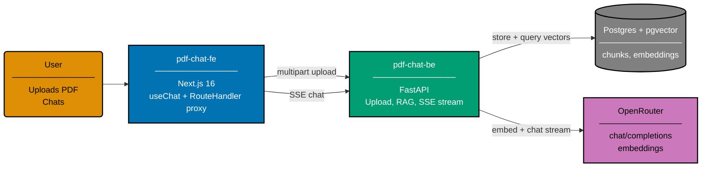

# Plan: Add `pdf-chat-*` Demo App Family

**Status**: In Progress
**Owner**: Maintainer
**Started**: 2026-04-26

## Purpose

Introduce a second demo family alongside `crud-*` — a four-app suite that demonstrates a
"chat with a PDF" interaction. Establishes the AI/RAG demo lane the template needs and
locks in conventions (multi-provider LLM routing via OpenRouter, RAG over pgvector, SSE
streaming) that future AI demos will reuse.

## Apps in scope

| App               | Type     | Stack                       | Port |
| ----------------- | -------- | --------------------------- | ---- |
| `pdf-chat-be`     | Backend  | Python 3.13 / FastAPI       | 8501 |
| `pdf-chat-fe`     | Frontend | TypeScript / Next.js 16     | 3501 |
| `pdf-chat-be-e2e` | E2E      | Playwright + playwright-bdd | n/a  |
| `pdf-chat-fe-e2e` | E2E      | Playwright + playwright-bdd | n/a  |

**Shared spec area**: `specs/apps/pdf-chat/` (mirrors `specs/apps/crud/` structure —
`c4/`, `be/gherkin/`, `fe/gherkin/`, `contracts/`).
**Shared contract project**: `pdf-chat-contracts` (Nx project at
`specs/apps/pdf-chat/contracts/`).
**Shared UI library**: `pdf-chat-fe` consumes `@open-sharia-enterprise/ts-ui` (source
at [libs/ts-ui/](../../../libs/ts-ui/)) for all primitives. No bespoke design system
inside `pdf-chat-fe`.

## Functional summary

1. User uploads one or more PDFs (≤25 MB each, multipart).
2. Backend extracts text (pypdf), chunks, embeds via OpenRouter
   `/api/v1/embeddings`, stores chunks + vectors in pgvector inside the existing
   Postgres docker-compose service.
3. User creates a chat **session** and attaches one or more uploaded PDFs to it
   (multi-document conversation).
4. User types a question; backend retrieves top-k relevant chunks **across all PDFs in
   the session**, builds prompt, streams answer via SSE.
5. Each user/assistant message is **persisted** to the session so the conversation
   survives reload, server restart, and tab close.
6. User picks the model — **Anthropic Claude Haiku 4.5** or **Google Gemini 2.5 Flash
   Lite** (Haiku-tier pairing) — both routed through OpenRouter.
7. UI streams tokens as they arrive (Vercel AI SDK 5 `useChat` + Next.js Route Handler
   proxy).
8. **Production guardrails** apply on every chat call: per-IP rate limit, content
   filter on input + streamed output, and per-session / per-day token cost cap.
   Exceeding any cap returns `429` with a structured error envelope.

## Non-goals

- Not a production-grade RAG system (no re-ranking, no hybrid search, no auth).
- No language re-implementations of the backend; this plan ships **one** backend
  (Python/FastAPI). Polyglot expansion is a separate future plan.

## Required reading (prerequisite)

Before starting any phase, read the repo-wide AI primer:

- [AI Application Development](../../../docs/explanation/software-engineering/ai-application-development/README.md)
  — tokens, embeddings, RAG, streaming SSE, multi-provider routing, persistent
  sessions, production guardrails, evaluation, cost. Anyone new to building
  LLM-backed apps **must** read this first; the rest of the plan assumes its
  vocabulary.

## Documents

- [Business rationale](./brd.md) — why this family, what it unblocks
- [Product requirements](./prd.md) — what done looks like, Gherkin acceptance criteria
- [Technical approach](./tech-docs.md) — architecture, RAG pipeline, contract design,
  schema, code shapes, citations
- [Delivery checklist](./delivery.md) — phase-by-phase execution steps

## High-level architecture

## Quality gates (must all pass before merge)

- `npx nx run pdf-chat-contracts:lint` exits 0
- `npx nx run-many -t codegen --projects=pdf-chat-be,pdf-chat-fe` exits 0
- `npx nx run pdf-chat-be:test:quick` passes with ≥90% line coverage
- `npx nx run pdf-chat-fe:test:quick` passes with ≥70% line coverage
- `npx nx run pdf-chat-be:test:integration` exits 0 (real Postgres + pgvector)
- `npx nx run pdf-chat-be-e2e:test:e2e` exits 0
- `npx nx run pdf-chat-fe-e2e:test:e2e` exits 0
- `npx nx run pdf-chat-be:spec-coverage` exits 0
- `npx nx run pdf-chat-fe:spec-coverage` exits 0
- `npm run lint:md` exits 0
- All four new apps appear in `nx graph` output

## Web research bedrock

This plan was authored after a web-research-maker pass on 2026-04-26 verifying:

- OpenRouter base URL, auth header, OpenAI-compatible request shape, model id format.
- Confirmed model ids: `anthropic/claude-haiku-4.5`, `anthropic/claude-sonnet-4.5`,
  `google/gemini-2.5-flash-lite`, `google/gemini-2.5-flash`. **Note**: dot-separated
  versions, not hyphens.
- PDF parsing license risk: PyMuPDF is **AGPL** — excluded. Plan uses `pypdf` (MIT) +
  optional `pdfplumber` (MIT) fallback for tables.
- Vector store: pgvector reuses the docker-compose Postgres pattern already shipped for
  every `crud-be-*` integration test environment.
- FastAPI streaming: `sse-starlette` `EventSourceResponse` is the idiomatic 2026 path.
- Next.js: `ai` SDK 5.x `useChat` + Next.js Route Handler proxy avoids writing a custom
  `ChatTransport`.
- OpenAPI 3.1 cannot natively describe SSE semantics; the contract uses
  `text/event-stream` with a prose annotation pending OpenAPI 3.2 tooling maturity.

See [tech-docs.md](./tech-docs.md) for full citations.
