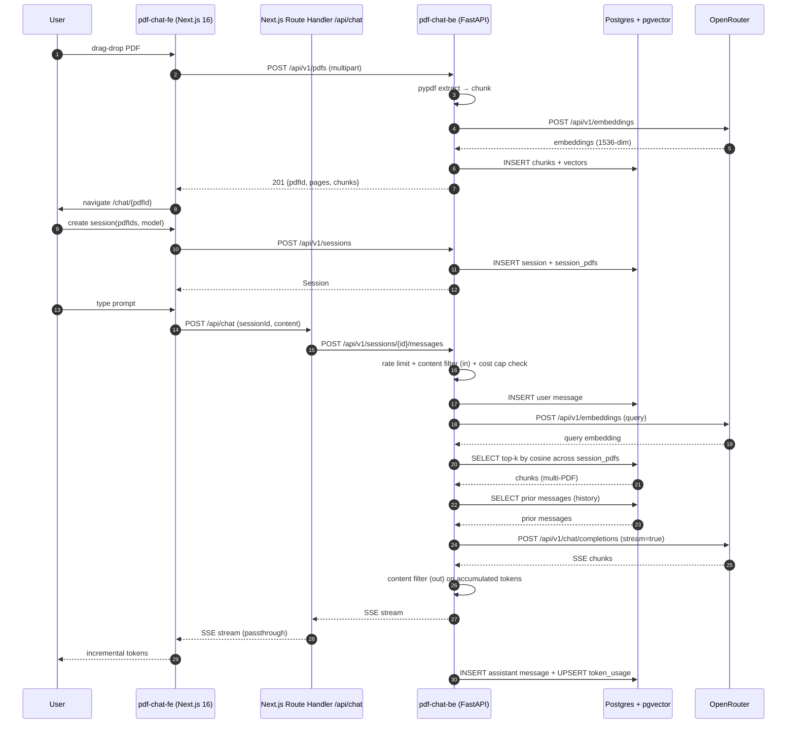
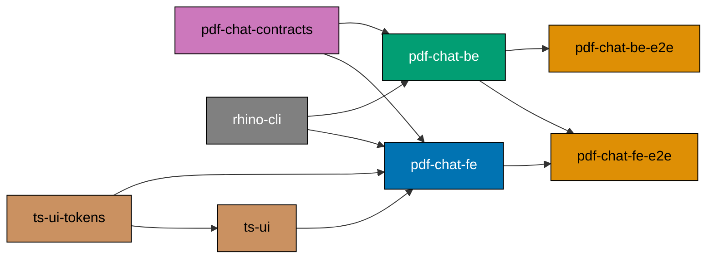

# Tech Docs: Add `pdf-chat-*` Demo App Family

## Architecture summary



## Stack decisions and rationale

| Concern                 | Choice                                                   | Why                                                                                                                                                                                                                                     |
| ----------------------- | -------------------------------------------------------- | --------------------------------------------------------------------------------------------------------------------------------------------------------------------------------------------------------------------------------------- |
| Backend language        | Python 3.13                                              | Matches existing `crud-be-python-fastapi` conventions; richest LLM/RAG ecosystem                                                                                                                                                        |
| Backend framework       | FastAPI + uvicorn                                        | Established in repo; native async; `StreamingResponse`/`sse-starlette` ergonomic                                                                                                                                                        |
| PDF text extraction     | `pypdf` (MIT) primary                                    | MIT-safe for an MIT-licensed template; PyMuPDF is AGPL and is **explicitly forbidden**                                                                                                                                                  |
| Optional table fallback | `pdfplumber` (MIT)                                       | Used only when a chunk is detected to be table-shaped; MIT license                                                                                                                                                                      |
| Chunking                | Naive token-window with overlap (800/100)                | Sufficient for a demo; explicitly out-of-scope for production-grade chunking                                                                                                                                                            |
| Embedding               | OpenRouter `/api/v1/embeddings`                          | Single egress; default `openai/text-embedding-3-small` (1536 dims)                                                                                                                                                                      |
| Vector DB               | pgvector on the existing Postgres image                  | Zero new infra; reuses CRUD's docker-compose pattern with a different image: `pgvector/pgvector:pg16`                                                                                                                                   |
| Chat completion         | OpenRouter `/api/v1/chat/completions` with `stream=true` | OpenAI-compatible, multi-provider routing in one place                                                                                                                                                                                  |
| Default chat model      | `anthropic/claude-haiku-4.5`                             | Verified routable via OpenRouter on 2026-04-26                                                                                                                                                                                          |
| Alternate chat model    | `google/gemini-2.5-flash-lite`                           | Closest Haiku-tier Gemini ($0.10/M in, $0.40/M out)                                                                                                                                                                                     |
| Streaming transport     | `sse-starlette.EventSourceResponse`                      | Idiomatic 2026; correct `event:`/`id:`/`retry:` field handling                                                                                                                                                                          |
| Frontend framework      | Next.js 16 App Router + TypeScript                       | Matches `crud-fe-ts-nextjs`; same toolchain, same lint, same vitest setup                                                                                                                                                               |
| Frontend UI base        | `@open-sharia-enterprise/ts-ui` (libs/ts-ui)             | **Mandatory** shared component library. Use `Button`, `Input`, `Card`, `Label`, `Dialog`, `Alert`, `cn`. No bespoke components in `pdf-chat-fe` for primitives that exist in `ts-ui`. Missing primitives must be added to `ts-ui` first |
| Frontend design tokens  | `@open-sharia-enterprise/ts-ui-tokens`                   | Imported once in `globals.css` (matches `crud-fe-ts-nextjs` pattern); semantic tokens only                                                                                                                                              |
| Frontend chat hook      | `@ai-sdk/react` `useChat` (ai SDK ^5)                    | Idiomatic 2026; proxy through Next.js Route Handler avoids custom `ChatTransport`                                                                                                                                                       |
| FE vector / state       | Plain React state, server-driven                         | No client-side persistence (matches non-goal)                                                                                                                                                                                           |
| E2E runner              | Playwright + playwright-bdd                              | Mirrors `crud-be-e2e` and `crud-fe-e2e`                                                                                                                                                                                                 |

## Repository layout (post-plan)

```
apps/
  pdf-chat-be/                      # Python/FastAPI backend
    src/pdf_chat_be/
      __init__.py
      main.py                       # FastAPI app
      config.py                     # pydantic-settings
      routers/
        pdfs.py                     # upload, list, delete
        sessions.py                 # CRUD sessions + POST messages (streams SSE)
        health.py
      services/
        pdf_extraction.py           # pypdf wrapper
        chunking.py                 # naive token chunker
        embedding.py                # OpenRouter embedding client
        vector_store.py             # pgvector queries (multi-PDF, session-scoped)
        rag.py                      # retrieve + prompt assemble (history-aware)
        openrouter_chat.py          # OpenRouter chat client w/ streaming
        sessions_service.py         # session lifecycle + message persistence
        rate_limiter.py             # slowapi-backed token bucket
        content_filter.py           # ContentFilter Protocol + RegexBlocklistFilter + Noop
        cost_cap.py                 # session + day token-budget enforcement
        token_counter.py            # tiktoken (in) + char-approx (out)
      infrastructure/
        repositories.py             # SQLAlchemy + asyncpg
        openrouter_client.py        # httpx wrapper
      auth/                         # (none — placeholder for future)
    tests/
      unit/
        steps/                      # pytest-bdd step defs (mocked)
        support/
      integration/
        steps/                      # pytest-bdd step defs (real DB, mocked OR)
        support/
      fixtures/
        sample.pdf
        openrouter.json             # cassette for MOCK_OPENROUTER
    alembic/                        # vector schema migration
    docker-compose.integration.yml  # pgvector image + test runner
    Dockerfile.integration
    pyproject.toml
    project.json
    .python-version
    README.md

  pdf-chat-fe/                      # Next.js 16 frontend (consumes libs/ts-ui)
    src/
      app/
        page.tsx                    # library — uses ts-ui Card, Button
        chat/[pdfId]/page.tsx       # chat — uses ts-ui Card, Input, Button
        api/chat/route.ts           # Route Handler proxy
        layout.tsx
        globals.css                 # imports @open-sharia-enterprise/ts-ui-tokens
      components/                   # PDF-chat-specific composites only
        UploadZone.tsx              # composes ts-ui Card + Button + Alert
        ChatTranscript.tsx          # composes ts-ui Card
        ChatComposer.tsx            # composes ts-ui Input + Button
        ModelSelector.tsx           # composes ts-ui Button + Label
      lib/
        api.ts                      # typed client over generated-contracts
        env.ts
      generated-contracts/          # codegen output (gitignored)
    test/
      unit/
        components/*.test.tsx
        steps/*                     # vitest-cucumber if used
    next.config.ts
    package.json
    project.json
    tsconfig.json
    vitest.config.ts
    README.md

  pdf-chat-be-e2e/                  # Playwright HTTP suite
    tests/
      steps/
      fixtures/
    .features-gen/
    package.json
    playwright.config.ts
    project.json
    README.md

  pdf-chat-fe-e2e/                  # Playwright UI suite
    tests/
      steps/
      fixtures/
    package.json
    playwright.config.ts
    project.json
    README.md

specs/apps/pdf-chat/
  README.md
  c4/
    context.md
    container.md
    component-be.md
    component-fe.md
    README.md
  be/
    README.md
    gherkin/
      README.md
      health/
        health-check.feature
      pdfs/
        upload.feature
        list.feature
        delete.feature
      chat/
        streaming.feature
        rag-retrieval.feature
        model-selection.feature
      test-support/
        test-api.feature
  fe/
    README.md
    gherkin/
      README.md
      library/
        library-list.feature
        delete-pdf.feature
      upload/
        drag-drop.feature
        validation.feature
      chat/
        chat-flow.feature
        model-toggle.feature
        streaming-display.feature
  contracts/
    openapi.yaml
    project.json
    README.md
    .spectral.yaml
    redocly.yaml
    paths/
      health.yaml
      pdfs.yaml
      chat.yaml
    schemas/
      pdf.yaml
      chat.yaml
      error.yaml
      health.yaml
    examples/
    generated/                      # gitignored

infra/dev/pdf-chat-be/
  docker-compose.dev.yml            # pgvector + dev backend, optional

.github/workflows/
  test-pdf-chat-be.yml
  test-pdf-chat-fe.yml
  test-pdf-chat-be-e2e.yml
  test-pdf-chat-fe-e2e.yml
```

## OpenAPI contract design

`specs/apps/pdf-chat/contracts/openapi.yaml` is OpenAPI 3.1 with the following
endpoints:

| Method | Path                                    | Tag      | Notes                                                   |
| ------ | --------------------------------------- | -------- | ------------------------------------------------------- |
| GET    | `/health`                               | Health   | Returns `HealthResponse`                                |
| POST   | `/api/v1/pdfs`                          | Pdfs     | `multipart/form-data` with `file` (binary)              |
| GET    | `/api/v1/pdfs`                          | Pdfs     | Returns `PdfListResponse`                               |
| DELETE | `/api/v1/pdfs/{pdfId}`                  | Pdfs     | Returns `204`                                           |
| POST   | `/api/v1/sessions`                      | Sessions | Body `CreateSessionRequest`; returns `Session`          |
| GET    | `/api/v1/sessions`                      | Sessions | Returns `SessionListResponse`                           |
| GET    | `/api/v1/sessions/{sessionId}`          | Sessions | Returns `SessionDetail` (session + messages)            |
| PATCH  | `/api/v1/sessions/{sessionId}`          | Sessions | Body `UpdateSessionRequest`                             |
| DELETE | `/api/v1/sessions/{sessionId}`          | Sessions | Returns `204` (cascades to messages, leaves PDFs alone) |
| POST   | `/api/v1/sessions/{sessionId}/messages` | Chat     | Body `PostMessageRequest`; response `text/event-stream` |

Error responses for chat: `429` with `error.code ∈ { "rate_limit_exceeded",
"token_budget_exceeded" }`, `422` with `error.code = "content_filter_blocked"`.
Out-of-stream errors during streaming surface as
`data: {"error": "<code>"}` followed by `data: [DONE]`.

### SSE shape in OpenAPI 3.1

OpenAPI 3.1 cannot natively describe streaming (3.2 will). The plan documents the
streaming endpoint with:

```yaml
responses:
  "200":
    description: |
      Server-sent events stream of incremental chat tokens.
      Each event has the shape `data: {"delta": "<text>"}` or `data: [DONE]`.
      OpenAPI 3.1 cannot describe the per-frame envelope, so the schema below
      describes a single frame; the response is a sequence of these frames.
    content:
      text/event-stream:
        schema:
          $ref: "./schemas/chat.yaml#/ChatStreamFrame"
```

A `ChatStreamFrame` schema models `{ "delta": string }` and a comment notes the
`[DONE]` sentinel. Codegen produces the frame type; the streaming reader is
hand-written in both the Python client (used by tests) and the TypeScript Route
Handler.

### Codegen targets

| Project       | Tool                              | Output path                                        |
| ------------- | --------------------------------- | -------------------------------------------------- |
| `pdf-chat-be` | `datamodel-codegen` (Pydantic v2) | `apps/pdf-chat-be/generated_contracts/__init__.py` |
| `pdf-chat-fe` | `@hey-api/openapi-ts`             | `apps/pdf-chat-fe/src/generated-contracts/`        |

Both `codegen` targets `dependsOn: ["pdf-chat-contracts:bundle"]` and feed their output
directories as Nx cache inputs for `typecheck` and `test:quick`.

## Backend internals

### Settings (`config.py`)

```python
from pydantic_settings import BaseSettings

class Settings(BaseSettings):
    openrouter_api_key: str
    openrouter_base_url: str = "https://openrouter.ai/api/v1"
    openrouter_default_model: str = "anthropic/claude-haiku-4.5"
    openrouter_embedding_model: str = "openai/text-embedding-3-small"
    database_url: str
    max_upload_mb: int = 25
    rag_top_k: int = 4
    mock_openrouter: bool = False
    enable_test_api: bool = False
    rate_limit_chat_per_minute: int = 20
    rate_limit_upload_per_minute: int = 60
    rate_limit_read_per_minute: int = 120
    enable_content_filter: bool = True
    content_filter_blocklist_path: str = "tests/fixtures/blocklist.txt"
    max_tokens_per_session: int = 200_000
    max_tokens_per_day: int = 2_000_000

    class Config:
        env_file = ".env"
```

### Vector schema (Alembic migration)

```sql
CREATE EXTENSION IF NOT EXISTS vector;

CREATE TABLE pdfs (
    id UUID PRIMARY KEY,
    filename TEXT NOT NULL,
    pages INT NOT NULL,
    uploaded_at TIMESTAMPTZ NOT NULL DEFAULT now()
);

CREATE TABLE pdf_chunks (
    id UUID PRIMARY KEY,
    pdf_id UUID NOT NULL REFERENCES pdfs(id) ON DELETE CASCADE,
    page INT NOT NULL,
    chunk_index INT NOT NULL,
    text TEXT NOT NULL,
    embedding vector(1536) NOT NULL
);

CREATE INDEX pdf_chunks_pdf_id_idx ON pdf_chunks(pdf_id);
CREATE INDEX pdf_chunks_embedding_idx ON pdf_chunks
    USING ivfflat (embedding vector_cosine_ops)
    WITH (lists = 100);

-- Sessions (persistent threads)
CREATE TABLE sessions (
    id UUID PRIMARY KEY,
    title TEXT NOT NULL,
    model TEXT NOT NULL,
    created_at TIMESTAMPTZ NOT NULL DEFAULT now(),
    updated_at TIMESTAMPTZ NOT NULL DEFAULT now()
);

-- Many-to-many session ↔ pdfs (multi-document conversation)
CREATE TABLE session_pdfs (
    session_id UUID NOT NULL REFERENCES sessions(id) ON DELETE CASCADE,
    pdf_id     UUID NOT NULL REFERENCES pdfs(id)     ON DELETE CASCADE,
    PRIMARY KEY (session_id, pdf_id)
);
CREATE INDEX session_pdfs_pdf_id_idx ON session_pdfs(pdf_id);

-- Persisted chat history
CREATE TABLE messages (
    id UUID PRIMARY KEY,
    session_id UUID NOT NULL REFERENCES sessions(id) ON DELETE CASCADE,
    role TEXT NOT NULL CHECK (role IN ('user','assistant','system')),
    content TEXT NOT NULL,
    status TEXT NOT NULL DEFAULT 'ok' CHECK (status IN ('ok','blocked','error')),
    input_tokens  INT NOT NULL DEFAULT 0,
    output_tokens INT NOT NULL DEFAULT 0,
    created_at TIMESTAMPTZ NOT NULL DEFAULT now()
);
CREATE INDEX messages_session_id_created_at_idx
    ON messages(session_id, created_at);

-- Per-session per-day token usage (cost cap accounting)
CREATE TABLE token_usage (
    session_id UUID NOT NULL REFERENCES sessions(id) ON DELETE CASCADE,
    usage_date DATE NOT NULL,
    input_tokens  INT NOT NULL DEFAULT 0,
    output_tokens INT NOT NULL DEFAULT 0,
    PRIMARY KEY (session_id, usage_date)
);
```

### Multi-document retrieval SQL

```sql
SELECT id, pdf_id, page, chunk_index, text,
       1 - (embedding <=> :query_embedding) AS similarity
FROM pdf_chunks
WHERE pdf_id IN (SELECT pdf_id FROM session_pdfs WHERE session_id = :session_id)
ORDER BY embedding <=> :query_embedding
LIMIT :k;
```

The `<=>` operator is pgvector's cosine distance; `1 - distance` gives similarity.
Retrieval is always session-scoped — per-PDF retrieval is **not** an endpoint.

### Guardrails layer

Three middlewares wrap every chat call. Order matters:

```python
# routers/sessions.py (chat handler, simplified)
@router.post("/api/v1/sessions/{session_id}/messages")
async def post_message(...):
    rate_limiter.check(request.client.host, "chat")            # 1. rate limit
    content_filter.scan_input(body.content)                     # 2. content filter (in)
    cost_cap.assert_session_under_cap(session_id)               # 3a. session cap
    cost_cap.assert_day_under_cap(date.today())                 # 3b. daily cap

    user_msg = await messages.persist(session_id, "user", body.content)

    async def event_gen():
        buffer = []
        async for token in openrouter_chat.stream(...):
            buffer.append(token)
            yield {"data": json.dumps({"delta": token})}
        full = "".join(buffer)
        try:
            content_filter.scan_output(full)                    # 2b. content filter (out)
        except ContentFilterBlocked:
            await messages.persist(session_id, "assistant", full, status="blocked")
            yield {"data": json.dumps({"error": "content_filter_blocked"})}
            yield {"data": "[DONE]"}
            return
        await messages.persist(session_id, "assistant", full,
                               input_tokens=count(prompt),
                               output_tokens=count(full))
        await cost_cap.record(session_id, date.today(), in_tok, out_tok)  # 3c. update
        yield {"data": "[DONE]"}

    return EventSourceResponse(event_gen())
```

#### Rate limit

`slowapi` with an in-memory storage backend (no Redis dependency for the demo). Limits
are configured per route via FastAPI dependencies. On limit exceeded, slowapi returns
`429` and FastAPI rewrites the body to the canonical `ErrorResponse` envelope via an
exception handler.

#### Content filter

`services/content_filter.py` exposes:

```python
class ContentFilter(Protocol):
    def scan_input(self, text: str) -> None: ...   # raises ContentFilterBlocked
    def scan_output(self, text: str) -> None: ...  # raises ContentFilterBlocked

class RegexBlocklistFilter(ContentFilter):
    def __init__(self, patterns: list[re.Pattern]): ...

class NoopFilter(ContentFilter):
    def scan_input(self, text): pass
    def scan_output(self, text): pass
```

`ENABLE_CONTENT_FILTER=false` swaps `RegexBlocklistFilter` for `NoopFilter`. Every test
ships with the noop unless the test explicitly exercises filtering. Production
deployments are expected to swap `RegexBlocklistFilter` for a real-provider
implementation (Anthropic moderation, OpenAI moderation) — the `Protocol` is the
extension seam.

#### Cost cap

```python
class CostCap:
    async def assert_session_under_cap(self, session_id):
        used = await db.scalar("SELECT COALESCE(SUM(input_tokens+output_tokens),0) "
                               "FROM token_usage WHERE session_id=:s",
                               {"s": session_id})
        if used >= settings.max_tokens_per_session:
            raise TokenBudgetExceeded("session")

    async def assert_day_under_cap(self, day):
        used = await db.scalar("SELECT COALESCE(SUM(input_tokens+output_tokens),0) "
                               "FROM token_usage WHERE usage_date=:d",
                               {"d": day})
        if used >= settings.max_tokens_per_day:
            raise TokenBudgetExceeded("day")

    async def record(self, session_id, day, in_tok, out_tok):
        await db.execute(
          """INSERT INTO token_usage(session_id, usage_date, input_tokens, output_tokens)
             VALUES (:s, :d, :i, :o)
             ON CONFLICT (session_id, usage_date)
             DO UPDATE SET input_tokens  = token_usage.input_tokens  + EXCLUDED.input_tokens,
                           output_tokens = token_usage.output_tokens + EXCLUDED.output_tokens""",
          {"s": session_id, "d": day, "i": in_tok, "o": out_tok})
```

Token counting uses `tiktoken` for OpenAI-family inputs and falls back to a rough
character-based approximation for Claude / Gemini outputs (the demo deliberately
trades accuracy for simplicity).

### SSE handler shape

The minimal handler shape is shown in the **Guardrails layer** section above. It uses
`sse_starlette.EventSourceResponse`, runs all three guardrail checks before streaming,
buffers tokens for an output content-filter pass, persists the assembled assistant
message, and updates `token_usage` in a single UPSERT. Any guardrail violation either
returns `429`/`422` before streaming starts or terminates the in-flight stream with a
`data: {"error": "<code>"}` frame followed by `data: [DONE]`.

### Mock OpenRouter

When `mock_openrouter=True`, both `openrouter_chat.stream()` and `embedding.embed()`
read from `tests/fixtures/openrouter.json` instead of issuing HTTP. The fixture maps:

```json
{
  "embeddings": { "default": [0.01, 0.02, ...] },
  "chat": {
    "default": ["Hello", " from", " the", " mock", " stream", "!"]
  }
}
```

Tests assert the _requests_ the backend would have made (model id, prompt content),
without burning real tokens.

## Frontend internals

### ts-ui consumption (mandatory)

`pdf-chat-fe` consumes `@open-sharia-enterprise/ts-ui` (source: `libs/ts-ui/`) as its
**only** UI primitive layer. The same posture as `crud-fe-ts-nextjs`. Rules:

- Add `"@open-sharia-enterprise/ts-ui": "*"` and `"@open-sharia-enterprise/ts-ui-tokens": "*"`
  to `apps/pdf-chat-fe/package.json` `dependencies`.
- `globals.css` first line: `@import "@open-sharia-enterprise/ts-ui-tokens/src/tokens.css";`
- Import primitives only from the package:
  `import { Button, Card, CardHeader, CardTitle, CardContent, Input, Label, Dialog, DialogContent, Alert, cn } from "@open-sharia-enterprise/ts-ui";`
- Do **not** re-implement `Button`, `Input`, `Card`, `Label`, `Dialog`, `Alert` inside
  `apps/pdf-chat-fe/src/components/`. Files in `components/` are demo-specific
  composites only (UploadZone, ChatTranscript, ChatComposer, ModelSelector).
- If a primitive is missing from `ts-ui` (e.g., `Textarea`, `Avatar`, `ScrollArea`),
  add it to `libs/ts-ui` first via `swe-ui-maker` following the
  [Component Patterns Convention](../../../governance/development/frontend/component-patterns.md),
  land that in its own commit, then consume it here. Do **not** inline a one-off in
  `pdf-chat-fe`.
- Add `pdf-chat-fe` to `libs/ts-ui`'s reverse-dependency list (Nx auto-tracks via
  imports; `nx graph` should show the edge after the first import).

Example composite (composes ts-ui primitives, owns demo-specific behaviour):

```tsx
// apps/pdf-chat-fe/src/components/ChatComposer.tsx
import { Button, Input, cn } from "@open-sharia-enterprise/ts-ui";

type Props = {
  disabled?: boolean;
  onSubmit: (text: string) => void;
};

export function ChatComposer({ disabled, onSubmit }: Props) {
  // … local state + Enter / Shift+Enter handling …
  return (
    <form
      className={cn("flex gap-2 border-t p-3", disabled && "opacity-60")}
      onSubmit={(e) => {
        e.preventDefault();
        // …
      }}
    >
      <Input name="prompt" placeholder="Ask the PDF…" disabled={disabled} />
      <Button type="submit" disabled={disabled}>
        Send
      </Button>
    </form>
  );
}
```

### Route Handler proxy (`/api/chat/route.ts`)

```ts
export const runtime = "nodejs";

export async function POST(req: Request) {
  const body = await req.json();
  const upstream = await fetch(`${process.env.PDF_CHAT_BE_URL}/api/v1/pdfs/${body.pdfId}/chat`, {
    method: "POST",
    headers: { "Content-Type": "application/json" },
    body: JSON.stringify({ messages: body.messages, model: body.model }),
  });
  return new Response(upstream.body, {
    status: upstream.status,
    headers: {
      "Content-Type": "text/event-stream",
      "Cache-Control": "no-cache",
      "X-Accel-Buffering": "no",
    },
  });
}
```

### `useChat` integration

```tsx
import { useChat } from "@ai-sdk/react";

const { messages, append, status } = useChat({
  api: "/api/chat",
  body: { pdfId, model },
  streamProtocol: "data", // raw SSE passthrough
});
```

When AI SDK 5's transport layer requires more nuance, swap to a custom `ChatTransport`
implementation. tech-docs records this as a known seam.

### Env vars (`apps/pdf-chat-fe/.env.example`)

```dotenv
PDF_CHAT_BE_URL=http://localhost:8501
NEXT_PUBLIC_DEFAULT_MODEL=anthropic/claude-haiku-4.5
```

## Three-level testing

| Level              | Runner                        | OpenRouter                                   | Postgres              | Coverage     |
| ------------------ | ----------------------------- | -------------------------------------------- | --------------------- | ------------ |
| `test:unit`        | pytest-bdd (BE) / vitest (FE) | Mocked                                       | None                  | Measured BE  |
| `test:integration` | pytest-bdd in docker-compose  | Mocked                                       | Real (pgvector image) | Not measured |
| `test:e2e`         | Playwright + playwright-bdd   | Mocked (default) or real (workflow_dispatch) | Real                  | Not measured |

Coverage is measured at `test:unit` for BE (≥90%) and at `test:quick` for FE (≥70%, via
vitest `--coverage`).

## Mandatory Nx targets per project

```text
pdf-chat-contracts:  lint, bundle, docs
pdf-chat-be:         codegen, typecheck, lint, build, test:unit, test:quick, test:integration, dev, start, spec-coverage
pdf-chat-fe:         codegen, typecheck, lint, build, test:unit, test:quick, dev, start, spec-coverage
pdf-chat-be-e2e:     install, lint, typecheck, test:quick, test:e2e, test:e2e:report, spec-coverage
pdf-chat-fe-e2e:     install, lint, typecheck, test:quick, test:e2e, test:e2e:report, spec-coverage
```

`pdf-chat-be:test:quick` invokes `rhino-cli test-coverage validate apps/pdf-chat-be/coverage/lcov.info 90`
identical to `crud-be-python-fastapi`.

`pdf-chat-fe:test:quick` invokes `rhino-cli test-coverage validate apps/pdf-chat-fe/coverage/lcov.info 70`.

## Mermaid: Nx project graph (post-plan)



## Web research citations (2026-04-26)

| Claim                                                    | Source                                                                                         |
| -------------------------------------------------------- | ---------------------------------------------------------------------------------------------- |
| OpenRouter base URL + auth + model id format             | <https://openrouter.ai/docs/api/reference/overview>                                            |
| `anthropic/claude-haiku-4.5` (dot, not hyphen)           | <https://openrouter.ai/anthropic/claude-haiku-4.5>                                             |
| `google/gemini-2.5-flash-lite` pricing $0.10/$0.40 per M | <https://openrouter.ai/google/gemini-2.5-flash-lite>                                           |
| PyMuPDF AGPL licensing trap                              | <https://artifex.com/licensing>                                                                |
| pypdf MIT license                                        | <https://pypi.org/project/pypdf/>                                                              |
| pgvector docker image `pgvector/pgvector:pg16`           | <https://hub.docker.com/r/pgvector/pgvector>                                                   |
| OpenRouter embeddings endpoint                           | <https://openrouter.ai/docs/api/api-reference/embeddings/create-embeddings>                    |
| `sse-starlette.EventSourceResponse` idiomatic SSE        | <https://pypi.org/project/sse-starlette/>                                                      |
| FastAPI `StreamingResponse` SSE pattern                  | <https://fastapi.tiangolo.com/tutorial/server-sent-events/>                                    |
| AI SDK 5 `useChat` + transport                           | <https://ai-sdk.dev/docs/reference/ai-sdk-ui/use-chat>                                         |
| AI SDK 5 announcement (breaking change from v4)          | <https://vercel.com/blog/ai-sdk-5>                                                             |
| OpenAPI 3.2 streaming improvements (`itemSchema`)        | <https://developerhub.io/blog/event-streaming-in-openapi-3-2-what-changed-and-why-it-matters/> |
| OpenAPI 3.1 multipart file upload                        | <https://www.speakeasy.com/openapi/content/file-uploads>                                       |

## Dependencies

Execution prerequisites:

- `git`, `npm`, `npx nx`, Volta-pinned Node.
- Python 3.13 via `uv` (already in doctor's required toolchain).
- Docker for `test:integration`.
- An `OPENROUTER_API_KEY` for any _real-API_ runs (E2E workflow_dispatch with
  `MOCK_OPENROUTER=false`); not needed for unit / integration / `test:quick`.

## Rollback

All commits land directly on `main`. To roll back: identify the last good commit hash
with `git log --oneline`, then `git revert` the unwanted commits in reverse order. The
plan is structured so each phase yields a green workspace at the end, so partial
rollback to any phase boundary is safe.

## Open questions tracked in delivery

- Whether to ship a doctor-managed `pgvector` Postgres image at the workspace level
  (would benefit future plans) — deferred to a follow-up plan.
- Whether the `pdf-chat-fe-e2e` suite should depend on `pdf-chat-be` running, or use a
  full mock — current decision: launch backend with `MOCK_OPENROUTER=true` for true
  end-to-end realism.
- Whether `pdf-chat-contracts` should ship a streaming type via `x-streaming` extension
  to nudge codegen — deferred until OpenAPI 3.2 tooling matures.
