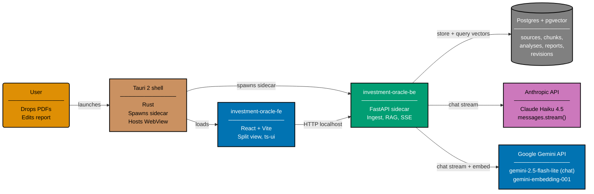

# Plan: Add `investment-oracle` Desktop Demo

**Status**: In Progress
**Owner**: Maintainer
**Started**: 2026-04-27

## Purpose

Introduce a second demo family alongside `crud-*` — a four-project desktop
suite that ingests financial reports (10-K filings, annual reports), generates
a structured investment thesis from them, and lets the reader edit the
resulting report either by hand or by prompting the model to rewrite a
specific section. Establishes the AI/RAG demo lane the template needs and
locks in conventions (direct vendor SDKs for Anthropic + Google, RAG over
pgvector, SSE streaming, Tauri 2 + Python sidecar packaging) that future AI
demos will reuse.

## Apps in scope

| Project                    | Type              | Stack                               | Port (dev)  |
| -------------------------- | ----------------- | ----------------------------------- | ----------- |
| `investment-oracle-be`     | Backend (sidecar) | Python 3.13 / FastAPI               | 8501        |
| `investment-oracle-fe`     | Desktop app       | Tauri 2 + React 19 + Vite 6 + ts-ui | 1420 (vite) |
| `investment-oracle-be-e2e` | Backend E2E       | Playwright + playwright-bdd         | n/a         |
| `investment-oracle-fe-e2e` | Frontend E2E      | Playwright + playwright-bdd         | n/a         |

**Shared spec area**: `specs/apps/investment-oracle/` (mirrors
`specs/apps/crud/` structure — `c4/`, `be/gherkin/`, `fe/gherkin/`,
`contracts/`).
**Shared contract project**: `investment-oracle-contracts` (Nx project at
`specs/apps/investment-oracle/contracts/`).
**Shared UI library**: `investment-oracle-fe` consumes
`@open-sharia-enterprise/ts-ui` (source at [libs/ts-ui/](../../../libs/ts-ui/))
for all primitives. No bespoke design system inside `investment-oracle-fe`.
**Shipped fixtures**: 4 financial-report PDFs (Apple FY2024 10-K, Microsoft
FY2024 annual report, Tesla FY2024 annual report, Berkshire Hathaway FY2024
annual report) live in [`fixture/`](./fixture/) for manual smoke and
integration tests.

## Functional summary

1. User launches the desktop app. Tauri shell spawns the Python sidecar on a
   localhost port, waits for `/health` to return 200.
2. Window opens in **split view**: left pane = **Sources**, right pane =
   **Report editor + Prompt input**.
3. User drags one or more PDFs into the Sources pane. Backend extracts text
   (`pypdf`), chunks, embeds via Google `gemini-embedding-001`
   (`output_dimensionality=768`), stores chunks + vectors in pgvector inside
   the `docker-compose.integration.yml` Postgres service.
4. User creates an **analysis**, attaches one or more uploaded sources to it.
5. User clicks **Generate report**. Backend retrieves top-k chunks across all
   attached sources, builds a structured prompt asking for six sections
   (Executive Summary, Financial Health, Growth, Risks, Valuation,
   Recommendation), streams the answer back via SSE. Right pane fills as
   tokens arrive.
6. User edits the resulting Markdown report manually in the right pane (full
   text editor — no rich-text formatting layer, just Markdown).
7. User selects a section heading and types a prompt:
   _"Make the Risks section more conservative."_ Backend applies the edit by
   sending the current section + the prompt to the model, streams the new
   section back, replaces the old one. Each save records a row in
   `report_revisions`.
8. User picks the chat model — **Anthropic Claude Haiku 4.5** (default,
   premium-quality small) or **Google Gemini 2.5 Flash-Lite** (cheap-tier
   alternative) — at any point. Embedding model is fixed at
   `gemini-embedding-001`.
   8a. User can toggle **"Include latest web grounding"** per analysis or
   per LLM edit. When on, the BE makes a single **Perplexity Sonar**
   call before the chat call with a prompt like _"Material recent
   developments, sentiment, and notable news for [company name],
   last 30 days"_ (using `search_recency_filter: "month"`). The
   returned text + citation URLs are pasted into the prompt as a
   `<web_grounding>` block, so the resulting report cites both
   `[PDF page N]` and `[Web: domain.com]` markers.
9. Persistent **not-investment-advice** disclaimer banner remains visible at
   the top of the window; demo output is reference-grade only.
10. Cost-cap and content-filter guardrails apply on every chat call;
    exceeding either returns a structured error with a banner in the FE.
    Per-IP rate limiting is **opt-in** for desktop (single user) but the code
    path is wired so a deployed-as-server variant inherits the same layer
    without changes.

## Indonesian data residency and PII masking

The demo treats Indonesia as a primary-target jurisdiction (UU PDP No.
27/2022; OJK POJK 11/POJK.03/2022 for banks; BSSN/Komdigi PSE
registration). This shapes two cross-cutting requirements that touch
every chat and embedding call:

- **Residency awareness** — every outbound LLM call carries an explicit
  residency tag describing where inference physically runs:
  `direct-us` (Anthropic / Gemini direct), `bedrock-jakarta-cris` (data
  at rest in ID, inference may cross), `bedrock-jakarta-in-region`
  (full on-shore — Opus 4.7 today), or `vertex-singapore` (Gemini
  fallback). The default chat path is `direct-us`; deployments with
  Indonesian-residency obligations swap in Bedrock Jakarta.
- **PII masking** — all text leaving the BE for any LLM endpoint passes
  through a `PIIMasker.mask()` step that replaces Indonesian PII (NIK,
  NPWP, phone, email, bank account, credit card) with numbered
  placeholders. The reverse map lives in memory only, scoped to the
  call. Streamed responses are run through `unmask()` before display
  and persistence so the user sees a coherent report. Masking is
  always-on for `direct-us` and `vertex-singapore`; it can be disabled
  per-call only when the chosen route is `bedrock-jakarta-in-region`
  (full on-shore inference makes raw PII inference legally permissible
  but operationally still discouraged).

See [tech-docs.md `Indonesian residency and PII masking`](./tech-docs.md#indonesian-residency-and-pii-masking)
for the Protocol definition, the default regex pattern set, the
integration point in the chat-call sequence, and the per-vendor
residency matrix.

## Non-goals

- Not a production-grade investment-research tool. Output is demo material;
  the disclaimer is permanent.
- Not multi-user. Sessions and analyses are local to one machine.
- Not auth-gated; the sidecar binds to `127.0.0.1` only.
- No language re-implementations of the backend; this plan ships **one**
  backend (Python/FastAPI) wrapped as a Tauri sidecar binary. Polyglot
  expansion is a separate future plan.
- No Tauri-shell automated E2E. The shell is verified by manual smoke;
  Playwright drives `vite preview` (FE in browser mode) and direct FastAPI
  calls (BE).

## Required reading (prerequisite)

Before starting any phase, read the repo-wide AI primer **and** the three
vendor primers:

- [AI Application Development](../../../docs/explanation/software-engineering/ai-application-development/README.md)
  — tokens, embeddings, RAG, streaming SSE, vendor choice, persistent
  sessions, production guardrails, evaluation, cost. Anyone new to building
  LLM-backed apps **must** read this first; the rest of the plan assumes its
  vocabulary.
- [Anthropic API Primer](../../../docs/explanation/software-engineering/ai-application-development/anthropic-api.md)
  — Claude model lineup, SDK install, streaming, PDF input, no embeddings.
- [Google Gemini API Primer](../../../docs/explanation/software-engineering/ai-application-development/google-gemini-api.md)
  — Gemini model lineup, the `google-genai` SDK, streaming, embeddings via
  `gemini-embedding-001`, 1 M-token context window.
- [OpenAI API Primer](../../../docs/explanation/software-engineering/ai-application-development/openai-api.md)
  — read for boundary framing; not used in this demo, but documents the
  fourth vendor lane (Responses API tool ecosystem, GPT-5.x and o3
  reasoning, hosted connectors).
- [Perplexity Sonar API Primer](../../../docs/explanation/software-engineering/ai-application-development/perplexity-api.md)
  — read for boundary framing; not used in this demo (private corpus, no
  live web grounding required) but the lane belongs in the executor's
  mental model.

## Documents

- [Business rationale](./brd.md) — why this family, what it unblocks
- [Product requirements](./prd.md) — what done looks like, Gherkin
  acceptance criteria
- [Technical approach](./tech-docs.md) — architecture, RAG pipeline, contract
  design, schema, Tauri sidecar packaging, code shapes, citations
- [Delivery checklist](./delivery.md) — phase-by-phase execution steps
- [Fixture PDFs](./fixture/README.md) — shipped sample 10-Ks for manual smoke

## High-level architecture

## Quality gates (must all pass before merge)

- `npx nx run investment-oracle-contracts:lint` exits 0
- `npx nx run-many -t codegen --projects=investment-oracle-be,investment-oracle-fe`
  exits 0
- `npx nx run investment-oracle-be:test:quick` passes with ≥ 90 % line coverage
- `npx nx run investment-oracle-fe:test:quick` passes with ≥ 70 % line coverage
- `npx nx run investment-oracle-be:test:integration` exits 0 (real Postgres +
  pgvector; mocked LLM/embedding HTTP)
- `npx nx run investment-oracle-be-e2e:test:e2e` exits 0
- `npx nx run investment-oracle-fe-e2e:test:e2e` exits 0
- `npx nx run investment-oracle-be:spec-coverage` exits 0
- `npx nx run investment-oracle-fe:spec-coverage` exits 0
- `npx nx run investment-oracle-fe:tauri-build` exits 0 on at least one
  platform (CI runs the macOS-arm64 lane; Windows + Linux are manual)
- `npm run lint:md` exits 0
- All four new projects appear in `nx graph` output

## Web research bedrock

This plan was authored after a web-research-maker pass on 2026-04-27
verifying:

- Anthropic model ids: `claude-haiku-4-5` (alias) /
  `claude-haiku-4-5-20251001` (dated). **Hyphens, not dots.** Sonnet 4.5 is
  legacy as of 2026-04; Sonnet 4.6 is the current mid tier with a 1 M-token
  context window. Anthropic does **not** ship an embedding endpoint.
- Google model ids: `gemini-2.5-flash-lite`, `gemini-2.5-flash`,
  `gemini-2.5-pro`. **Hyphens.** Stable ids carry no date suffix. Embedding
  model: `gemini-embedding-001`, default 3072 dims, configurable to
  768/1536/3072. The unified Python SDK is `google-genai` (1.73.1);
  `google-generativeai` is legacy. TypeScript SDK is `@google/genai`.
- Tauri 2.0 is GA (released 2024-10-02); current 2.10.x. Sidecar pattern uses
  `bundle.externalBin` in `tauri.conf.json` plus `tauri-plugin-shell` to
  spawn / kill the binary. PyInstaller `--onedir` (folder, not single-file)
  is the working pattern for FastAPI sidecars; `--onefile` breaks on heavy
  ML deps.
- SEC EDGAR filings are public information per the SEC Webmaster FAQ; the
  fixture folder ships four issuer-canonical PDFs covering FY2024 (Apple
  10-K, Microsoft AR, Tesla AR, Berkshire Hathaway AR).
- Perplexity Sonar is a separate vendor lane (web-grounded answers,
  citations) covered by its own primer doc; not used in this demo.

See [tech-docs.md](./tech-docs.md) for the full citation table with access
date 2026-04-27.
