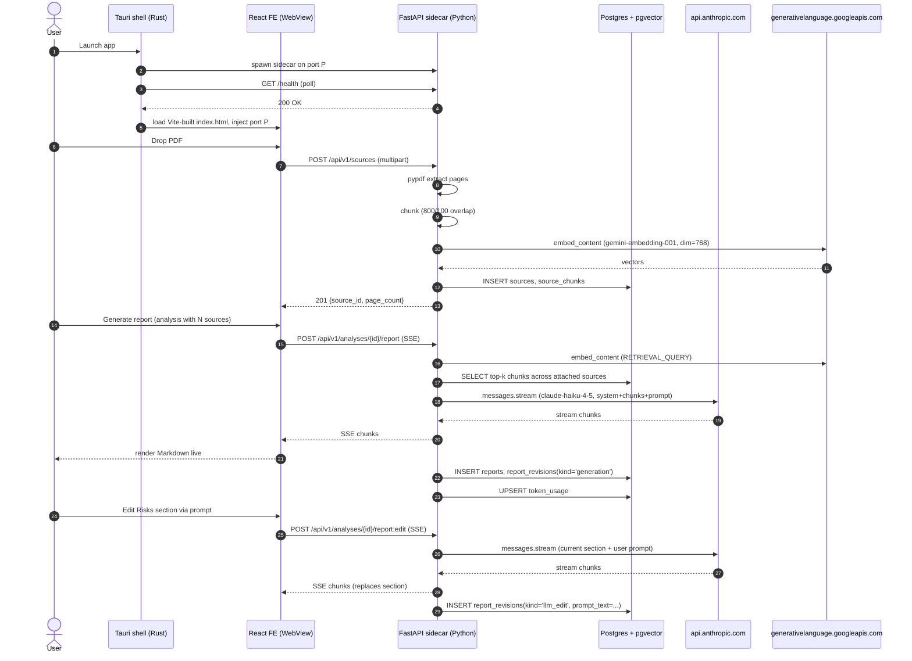
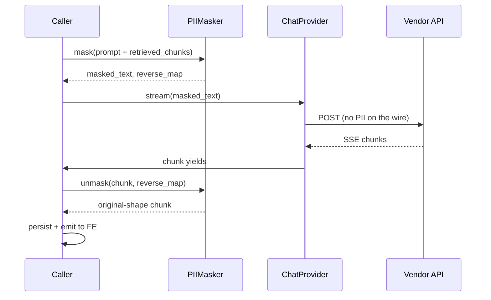
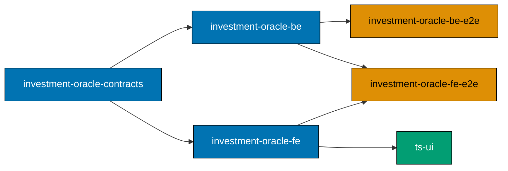

# Technical Approach: `investment-oracle`

## Reading this document

This is the implementation reference for the `investment-oracle` desktop
demo. It assumes the reader has read the six prerequisite primers
([AI](../../../docs/explanation/software-engineering/ai-application-development/README.md),
[Anthropic](../../../docs/explanation/software-engineering/ai-application-development/anthropic-api.md),
[Gemini](../../../docs/explanation/software-engineering/ai-application-development/google-gemini-api.md),
[OpenAI](../../../docs/explanation/software-engineering/ai-application-development/openai-api.md),
[Perplexity](../../../docs/explanation/software-engineering/ai-application-development/perplexity-api.md),
[Testing AI Applications](../../../docs/explanation/software-engineering/ai-application-development/testing-ai-apps.md))
and uses their vocabulary without redefining it. The mini-glossary below
covers the few project-local terms.

| Term                 | Plain definition                                                                                                                      |
| -------------------- | ------------------------------------------------------------------------------------------------------------------------------------- |
| Source               | One ingested PDF (a 10-K, an annual report). Not the same as a "session" — sources are reusable across analyses.                      |
| Analysis             | A named investigation that attaches one or more sources, holds one report, and accumulates revision history. Persistent in DB.        |
| Report               | The Markdown artifact a single analysis produces. Six fixed sections; mutable; revision-tracked.                                      |
| Revision             | One historical snapshot of a report's content. Has a `kind` (`generation`, `manual_edit`, `llm_edit`, `restore`) and timestamp.       |
| Section              | One of the six top-level Markdown blocks in a report. The unit the LLM rewrites in FR-8.                                              |
| Tauri shell          | The Rust-backed desktop wrapper from `tauri` 2.x. Hosts a WebView; spawns the sidecar; handles file dialogs, clipboard, OS chrome.    |
| Sidecar binary       | `investment-oracle-be` packaged via PyInstaller `--onedir`. The Tauri shell launches and kills it.                                    |
| Owners' earnings     | A free-cash-flow proxy that nets out maintenance capex (Buffett 1986). The system prompt references it; the demo does not compute it. |
| Permanent disclaimer | The "Demo output, not investment advice" banner that stays at the top of the FE for every analysis.                                   |
| Provider abstraction | A small `ChatProvider` Protocol that hides the difference between Anthropic and Gemini chat APIs.                                     |

## Architecture

The demo is one process tree on the user's machine. Tauri 2 is the entry
point. On launch the shell starts the sidecar binary on a free localhost
port; on quit it kills the sidecar. The sidecar talks to a Postgres
container started separately by docker-compose (the same image the rest of
the demo set already uses) and to two cloud APIs (Anthropic, Google).



In plain English:

- Tauri starts. Sidecar starts. FE loads. User drags PDFs. BE chunks +
  embeds + stores. User triggers report. BE retrieves + prompts + streams.
  FE renders. User tweaks. Each tweak is a revision in the DB.

## Stack decisions

| Layer             | Choice                                                                                 | Why                                                                                                                       |
| ----------------- | -------------------------------------------------------------------------------------- | ------------------------------------------------------------------------------------------------------------------------- |
| Desktop shell     | Tauri 2.10.x                                                                           | Rust-backed, smaller bundle than Electron; WebView2 / WebKit / WebKitGTK per platform; first-class sidecar pattern        |
| FE framework      | React 19 + Vite 6                                                                      | Smallest defensible bundle; Tauri scaffolds it directly; aligns with `crud-fe-ts-nextjs` reuse of React patterns          |
| FE design system  | `@open-sharia-enterprise/ts-ui` (mandatory)                                            | No bespoke primitives; one source of truth for Button, Input, Dialog, Tabs, etc. across the demo set                      |
| Markdown editor   | CodeMirror 6 + `@codemirror/lang-markdown`                                             | Fast, accessible, themeable; lighter than Monaco for a Markdown-only use case                                             |
| BE framework      | FastAPI                                                                                | OpenAPI-first, async-native, Pythonic; matches existing crud-be-python-fastapi precedent                                  |
| BE Python version | 3.13                                                                                   | Pinned in `apps/investment-oracle-be/.python-version`                                                                     |
| BE PDF parser     | `pypdf` (BSD-3-Clause)                                                                 | License-clean. PyMuPDF (AGPL) is **banned** — see BRD risk register                                                       |
| BE chat SDKs      | `anthropic@0.97`, `google-genai@1.73`                                                  | Official, pinned                                                                                                          |
| BE embedding      | `gemini-embedding-001` (768 dim)                                                       | Anthropic ships no embedding endpoint; Google's is the cheapest and supports Matryoshka truncation                        |
| Vector store      | `pgvector` extension on Postgres 16                                                    | Reuses `docker-compose.integration.yml` from crud-be; no new infra                                                        |
| ORM               | SQLAlchemy 2 async + `asyncpg`                                                         | Async-clean; matches existing crud-be-python-fastapi                                                                      |
| Streaming         | `sse-starlette.EventSourceResponse`                                                    | Idiomatic FastAPI SSE; the FE consumes via `@microsoft/fetch-event-source` because the EventSource browser API can't POST |
| Lint (BE)         | `ruff`                                                                                 | Single tool for lint + format; the standard in `crud-be-python-fastapi`                                                   |
| Typecheck (BE)    | `pyright`                                                                              | Stricter than mypy on inferred types; CI-friendly                                                                         |
| Test (BE)         | `pytest` + `pytest-bdd` + `pytest-asyncio` + `pytest-httpx` + `freezegun` + `coverage` | All four levels of test infrastructure                                                                                    |
| Test (FE)         | `vitest` + `@testing-library/react` + `oxlint` + `tsc`                                 | Aligns with `crud-fe-*` precedent                                                                                         |
| Sidecar packaging | PyInstaller `--onedir`                                                                 | `--onefile` breaks on heavy ML deps per Tauri community guidance; `--onedir` ships a folder under `src-tauri/binaries/`   |
| Rate limit        | `slowapi` (opt-in)                                                                     | Same dep as `crud-be-python-fastapi`; off by default for desktop                                                          |

Versions pinned at plan-author time (2026-04-27). Bump together via the
delivery checklist; any version drift is a finding.

## Repo layout

```text
apps/
├── investment-oracle-be/
│   ├── pyproject.toml              # ruff + pyright + pytest + sse-starlette + anthropic + google-genai + pypdf + slowapi
│   ├── investment_oracle_be/
│   │   ├── main.py                 # FastAPI app
│   │   ├── api/
│   │   │   ├── sources.py
│   │   │   ├── analyses.py
│   │   │   ├── report.py            # SSE endpoint
│   │   │   └── health.py
│   │   ├── domain/
│   │   │   ├── chat_provider.py    # Protocol + Anthropic + Gemini implementations
│   │   │   ├── embedder.py         # Gemini-only
│   │   │   ├── chunker.py
│   │   │   ├── retriever.py
│   │   │   ├── content_filter.py   # Protocol + regex impl
│   │   │   └── cost_cap.py
│   │   ├── prompts/
│   │   │   ├── report_generation.md
│   │   │   └── report_edit.md
│   │   ├── persistence/
│   │   │   ├── models.py            # SQLAlchemy models
│   │   │   └── alembic/
│   │   └── pyinstaller.spec         # --onedir spec
│   └── tests/
│       ├── unit/                    # ALL mocks, pytest-bdd; ≥ 90 % coverage measured here
│       ├── integration/             # Real Postgres + pgvector via docker-compose
│       └── fixtures/
│           └── cassettes/           # httpx_mock cassette JSONs
├── investment-oracle-fe/
│   ├── package.json                 # @anthropic-ai/sdk (typecheck only), @google/genai (typecheck only), vite, react, codemirror
│   ├── src-tauri/                   # Tauri 2 Rust crate
│   │   ├── tauri.conf.json
│   │   ├── Cargo.toml
│   │   ├── src/main.rs              # Sidecar spawn + kill
│   │   └── binaries/
│   │       └── investment-oracle-be-{target-triple}  # Built by PyInstaller; gitignored
│   └── src/                         # React + Vite FE
│       ├── App.tsx
│       ├── components/
│       │   ├── SourcesPanel.tsx
│       │   ├── ReportEditor.tsx     # CodeMirror 6 markdown
│       │   ├── PromptInput.tsx
│       │   ├── ModelSelector.tsx
│       │   ├── DisclaimerBanner.tsx
│       │   └── RevisionHistoryDrawer.tsx
│       ├── api/                     # generated from OpenAPI
│       └── lib/sse-client.ts        # @microsoft/fetch-event-source wrapper
├── investment-oracle-be-e2e/
│   ├── package.json
│   ├── playwright.config.ts
│   └── tests/                       # playwright-bdd consuming specs/.../be/gherkin/
└── investment-oracle-fe-e2e/
    ├── package.json
    ├── playwright.config.ts          # baseURL = http://localhost:1420 (vite preview)
    └── tests/                        # playwright-bdd consuming specs/.../fe/gherkin/
specs/apps/investment-oracle/
├── README.md
├── c4/                                # System Context, Container, Component
├── be/gherkin/
├── fe/gherkin/
└── contracts/
    ├── openapi.yaml                   # OpenAPI 3.1
    └── project.json                   # Nx codegen target
```

## OpenAPI endpoints

| Method | Path                                                   | Purpose                                           | Body / Stream                                          |
| ------ | ------------------------------------------------------ | ------------------------------------------------- | ------------------------------------------------------ |
| GET    | `/health`                                              | Sidecar liveness                                  | `{"status": "ok", "sidecar_version": "..."}`           |
| POST   | `/api/v1/sources`                                      | Upload PDF                                        | multipart/form-data; returns `{source_id, page_count}` |
| GET    | `/api/v1/sources`                                      | List ingested sources                             | array                                                  |
| DELETE | `/api/v1/sources/{id}`                                 | Remove source + its chunks                        | `204` or `409` if attached to an analysis              |
| POST   | `/api/v1/analyses`                                     | Create analysis with attached sources             | JSON                                                   |
| GET    | `/api/v1/analyses/{id}`                                | Get analysis + current report                     | JSON                                                   |
| POST   | `/api/v1/analyses/{id}/report`                         | Generate report                                   | **SSE** (`text/event-stream`)                          |
| PATCH  | `/api/v1/analyses/{id}/report`                         | Save manual edit                                  | JSON; writes a `manual_edit` revision                  |
| POST   | `/api/v1/analyses/{id}/report:edit`                    | LLM-rewrite a section                             | **SSE**; writes an `llm_edit` revision                 |
| GET    | `/api/v1/analyses/{id}/report/revisions`               | List revisions                                    | array                                                  |
| POST   | `/api/v1/analyses/{id}/report/revisions/{rid}:restore` | Restore a revision (creates a `restore` revision) | JSON                                                   |
| DELETE | `/api/v1/analyses/{id}`                                | Delete analysis + report, revisions, token_usage  | `200` or `404`; cascades to all child rows             |

OpenAPI 3.1 cannot fully describe SSE; the streaming endpoints are typed as
`text/event-stream` with a prose `description` block listing the event
shape. Generated client types hand-roll the SSE consumer; the rest is
codegen.

## Database schema

The schema is six tables in one Postgres database. The `vector` extension
is enabled by an init script in `docker-compose.integration.yml`.

```sql
CREATE EXTENSION IF NOT EXISTS vector;

CREATE TABLE sources (
  id            UUID PRIMARY KEY,
  filename      TEXT NOT NULL,
  sha256        BYTEA NOT NULL UNIQUE,
  page_count    INTEGER NOT NULL,
  byte_size     INTEGER NOT NULL,
  ingested_at   TIMESTAMPTZ NOT NULL DEFAULT now()
);

CREATE TABLE source_chunks (
  id            UUID PRIMARY KEY,
  source_id     UUID NOT NULL REFERENCES sources(id) ON DELETE CASCADE,
  page          INTEGER NOT NULL,
  text          TEXT NOT NULL,
  embedding     VECTOR(768) NOT NULL
);
CREATE INDEX source_chunks_embedding_ivfflat
  ON source_chunks USING ivfflat (embedding vector_cosine_ops) WITH (lists = 100);
CREATE INDEX source_chunks_source_id ON source_chunks(source_id);

CREATE TABLE analyses (
  id            UUID PRIMARY KEY,
  name          TEXT NOT NULL,
  model         TEXT NOT NULL,                -- "claude-haiku-4-5" | "gemini-2.5-flash-lite"
  created_at    TIMESTAMPTZ NOT NULL DEFAULT now(),
  updated_at    TIMESTAMPTZ NOT NULL DEFAULT now()
);

CREATE TABLE analysis_sources (
  analysis_id   UUID NOT NULL REFERENCES analyses(id) ON DELETE CASCADE,
  source_id     UUID NOT NULL REFERENCES sources(id) ON DELETE RESTRICT,
  PRIMARY KEY (analysis_id, source_id)
);

CREATE TABLE reports (
  id            UUID PRIMARY KEY,
  analysis_id   UUID NOT NULL UNIQUE REFERENCES analyses(id) ON DELETE CASCADE,
  content_md    TEXT NOT NULL,
  updated_at    TIMESTAMPTZ NOT NULL DEFAULT now()
);

CREATE TABLE report_revisions (
  id            UUID PRIMARY KEY,
  report_id     UUID NOT NULL REFERENCES reports(id) ON DELETE CASCADE,
  kind          TEXT NOT NULL,                -- 'generation' | 'manual_edit' | 'llm_edit' | 'restore'
  content_md    TEXT NOT NULL,
  prompt_text   TEXT,                          -- non-null only for kind='llm_edit'
  section       TEXT,                          -- non-null only for kind='llm_edit'
  created_at    TIMESTAMPTZ NOT NULL DEFAULT now()
);
CREATE INDEX report_revisions_report_id_created_at
  ON report_revisions(report_id, created_at DESC);

CREATE TABLE token_usage (
  id            UUID PRIMARY KEY,
  analysis_id   UUID REFERENCES analyses(id) ON DELETE CASCADE,
  usage_date    DATE NOT NULL DEFAULT current_date,
  provider      TEXT NOT NULL,                -- 'anthropic' | 'google'
  input_tokens  INTEGER NOT NULL,
  output_tokens INTEGER NOT NULL,
  estimated_usd NUMERIC(10, 6) NOT NULL
);
CREATE INDEX token_usage_analysis_date ON token_usage(analysis_id, usage_date);
```

Why these tables: `sources` and `source_chunks` separate ingest data from
the per-analysis state. `analyses` + `analysis_sources` are the M:N tie
that makes multi-document RAG natural. `reports` is 1:1 with an analysis
because every analysis owns exactly one current report; revision history
lives in `report_revisions` so restoring is free. `token_usage` is the
ledger the cost cap reads.

## Multi-source retrieval SQL

```sql
SELECT sc.id, sc.source_id, sc.page, sc.text,
       1 - (sc.embedding <=> :q) AS similarity
FROM source_chunks sc
WHERE sc.source_id IN (
  SELECT source_id FROM analysis_sources WHERE analysis_id = :a
)
ORDER BY sc.embedding <=> :q
LIMIT :k;
```

`<=>` is pgvector's cosine-distance operator (range [0, 2], smaller is
better). The `1 - distance` column is the more readable cosine
**similarity** (range [-1, 1], larger is better) the prompt builder uses
to decide whether to include a chunk at all (drop chunks with similarity
below 0.3).

## Provider abstraction

The `ChatProvider` Protocol hides the gulf between Anthropic's `messages`
API and Gemini's `generateContent`. Two implementations.

```python
from typing import Protocol, AsyncIterator
from dataclasses import dataclass

@dataclass(frozen=True)
class ChatRequest:
    model: str
    system: str
    messages: list[dict]   # [{"role": "user"|"assistant", "content": str}, ...]
    max_tokens: int

@dataclass(frozen=True)
class ChatChunk:
    delta_text: str
    finish_reason: str | None = None

@dataclass(frozen=True)
class ChatUsage:
    input_tokens: int
    output_tokens: int

class ChatProvider(Protocol):
    async def stream(self, req: ChatRequest) -> AsyncIterator[ChatChunk]: ...
    def usage_from_last(self) -> ChatUsage: ...

class AnthropicChatProvider:
    """Wraps anthropic.AsyncAnthropic.messages.stream()."""

class GeminiChatProvider:
    """Wraps google.genai.Client().aio.models.generate_content_stream()."""
```

The `embedder` interface is similar but Gemini-only; no Protocol because
there is no second implementation to hide behind.

## Indonesian residency and PII masking

### Residency posture matrix

| Profile                     | What runs in Indonesia                                | What crosses the border                                                                  | Masking required? |
| --------------------------- | ----------------------------------------------------- | ---------------------------------------------------------------------------------------- | ----------------- |
| `direct-us` (default)       | Nothing                                               | All chat / embedding / Sonar payloads (api.{anthropic,googleapis,perplexity,openai}.com) | **Yes**           |
| `bedrock-jakarta-cris`      | Data at rest in `ap-southeast-3`                      | Inference compute (may route to any AWS region)                                          | **Yes**           |
| `bedrock-jakarta-in-region` | Both data at rest and inference (Opus 4.7 only today) | None                                                                                     | Bypass allowed    |
| `vertex-singapore`          | Nothing (Singapore is offshore from Indonesia)        | All payloads (asia-southeast1)                                                           | **Yes**           |

The selected profile drives one decision: whether `PIIMasker` runs.
Everywhere except `bedrock-jakarta-in-region`, masking is mandatory.

### `PIIMasker` Protocol

```python
from typing import Protocol
from dataclasses import dataclass

@dataclass(frozen=True)
class MaskedText:
    text: str
    reverse_map: dict[str, str]   # {"[NIK_001]": "1234567890123456", ...}

class PIIMasker(Protocol):
    def mask(self, raw: str) -> MaskedText: ...
    def unmask(self, masked: str, reverse_map: dict[str, str]) -> str: ...

class IndonesianRegexMasker:
    """
    Default impl. Detects NIK, NPWP, phone (Indonesia), email, bank
    account, credit card. Returns masked text plus a numbered
    placeholder reverse map. Streaming-safe: feed each chunk through
    .mask() with a shared reverse_map dict so cross-chunk patterns
    survive split boundaries (rare but real).
    """
```

### Integration in the call sequence



The reverse map lives only in the BE process for the duration of the
chat call. It is not persisted, not logged, and not returned to the FE.

### `WebGrounder` Protocol (optional Perplexity layer)

```python
@dataclass(frozen=True)
class WebGroundingResult:
    text: str
    citations: list[str]    # source URLs surfaced by the vendor
    cost_estimate_usd: float

class WebGrounder(Protocol):
    async def ground(
        self,
        query: str,
        *,
        recency: str = "month",
        domain_allowlist: list[str] | None = None,
    ) -> WebGroundingResult: ...

class PerplexityGrounder:
    """
    Default impl. Single sonar.chat.completions call with
    search_recency_filter and search_domain_filter. PIIMasker is
    NOT applied here because the input is built from issuer names
    + section labels, never user-provided PII.
    """
```

`ReportGenerator.generate(analysis, *, with_web_grounding: bool)`
orchestrates: retrieve PDF chunks → optionally call `WebGrounder` →
mask the combined prompt via `PIIMasker` → stream chat via
`ChatProvider` → unmask chunks → persist with `web_citations` JSONB
column populated when web grounding ran.

### Schema additions

The `report_revisions` table gains one column:

```sql
ALTER TABLE report_revisions
  ADD COLUMN web_citations JSONB;
```

Stored shape: `[{"url": "...", "title": "...", "retrieved_at": "..."}]`,
or `NULL` when the revision was generated/edited without web grounding.

The `token_usage` table gains two columns:

```sql
ALTER TABLE token_usage
  ADD COLUMN residency_profile TEXT NOT NULL DEFAULT 'direct-us',
  ADD COLUMN search_fee_usd NUMERIC(10, 6) NOT NULL DEFAULT 0;
```

`residency_profile` records which lane a given call took (for audit
and DPIA reporting). `search_fee_usd` separately records Perplexity's
per-request search fee so the cost cap and billing UI can surface it
distinctly from token cost.

## Code shapes

### Anthropic chat — Python (sidecar)

```python
from anthropic import AsyncAnthropic

client = AsyncAnthropic()  # reads ANTHROPIC_API_KEY

async def stream_anthropic(model: str, system: str, messages: list[dict]):
    async with client.messages.stream(
        model=model,                               # "claude-haiku-4-5"
        max_tokens=4096,
        system=system,
        messages=messages,
    ) as stream:
        async for event in stream:
            if event.type == "content_block_delta" and event.delta.type == "text_delta":
                yield event.delta.text
        final = await stream.get_final_message()
        yield_usage(final.usage.input_tokens, final.usage.output_tokens)
```

### Gemini chat + embed — Python

```python
from google import genai
from google.genai import types

client = genai.Client()  # reads GOOGLE_API_KEY

async def stream_gemini(model: str, system: str, messages: list[dict]):
    contents = format_messages(system, messages)  # vendor-specific format helper
    stream = await client.aio.models.generate_content_stream(
        model=model,                               # "gemini-2.5-flash-lite"
        contents=contents,
    )
    async for chunk in stream:
        yield chunk.text or ""
    # gemini reports usage on the final chunk via usage_metadata

async def embed_chunk(text: str, *, query: bool = False):
    resp = await client.aio.models.embed_content(
        model="gemini-embedding-001",
        contents=[text],
        config=types.EmbedContentConfig(
            output_dimensionality=768,
            task_type="RETRIEVAL_QUERY" if query else "RETRIEVAL_DOCUMENT",
        ),
    )
    return resp.embeddings[0].values
```

### FE SSE consumer — TypeScript

```ts
import { fetchEventSource } from "@microsoft/fetch-event-source";

export async function streamReport(analysisId: string, onChunk: (text: string) => void, onDone: () => void) {
  const port = window.__INVESTMENT_ORACLE_PORT__; // injected by Tauri shell
  await fetchEventSource(`http://127.0.0.1:${port}/api/v1/analyses/${analysisId}/report`, {
    method: "POST",
    headers: { "Content-Type": "application/json" },
    body: JSON.stringify({}),
    onmessage(ev) {
      if (ev.data === "[DONE]") {
        onDone();
        return;
      }
      onChunk(JSON.parse(ev.data).delta);
    },
  });
}
```

The browser's native `EventSource` cannot POST; `fetch-event-source` is the
standard workaround.

### Tauri sidecar spawn — Rust

```rust
use tauri::Manager;
use tauri_plugin_shell::ShellExt;
use tauri_plugin_shell::process::CommandChild;
use std::sync::Mutex;

struct SidecarHandle(Mutex<Option<CommandChild>>);

fn main() {
    tauri::Builder::default()
        .plugin(tauri_plugin_shell::init())
        .manage(SidecarHandle(Mutex::new(None)))
        .setup(|app| {
            let port = pick_free_port();
            let sidecar_cmd = app
                .shell()
                .sidecar("investment-oracle-be")?
                .args(["--port", &port.to_string()]);
            let (mut rx, child) = sidecar_cmd.spawn()?;
            app.state::<SidecarHandle>().0.lock().unwrap().replace(child);

            // Pump stdout/stderr to Tauri logger; inject port into the WebView.
            let app_handle = app.handle().clone();
            tauri::async_runtime::spawn(async move {
                while let Some(_event) = rx.recv().await { /* ... */ }
            });
            Ok(())
        })
        .on_window_event(|window, event| {
            if let tauri::WindowEvent::CloseRequested { .. } = event {
                if let Some(child) = window.app_handle().state::<SidecarHandle>().0.lock().unwrap().take() {
                    let _ = child.kill();
                }
            }
        })
        .run(tauri::generate_context!())
        .expect("error while running tauri application");
}
```

`tauri.conf.json` declares the sidecar binary:

```json
{
  "bundle": {
    "externalBin": ["binaries/investment-oracle-be"]
  }
}
```

The actual file under `src-tauri/binaries/` carries a target-triple
suffix per Tauri's sidecar rules (e.g.,
`investment-oracle-be-aarch64-apple-darwin`). PyInstaller produces a folder
of binaries (`--onedir`) and the spec file copies them into place at build
time.

## Guardrails

| Layer                 | Status        | Why                                                                                                    |
| --------------------- | ------------- | ------------------------------------------------------------------------------------------------------ |
| Cost cap              | required      | Per-analysis and per-day USD budget; rejects with `429 token_budget_exceeded` when exceeded.           |
| Content filter        | required      | Pre-call regex blocklist on user prompt; per-chunk regex blocklist on streamed output. Protocol-typed. |
| Per-IP rate limit     | opt-in        | Off by default (single-user desktop); `RATE_LIMIT_ENABLED=true` switches on slowapi for server use.    |
| Disclaimer banner     | required (FE) | "Demo output, not investment advice" stays at the top of the window for every analysis.                |
| System-prompt refusal | required      | The system prompt instructs the model to refuse direct buy/sell recommendations.                       |

## Test strategy

### BE — three levels

| Level              | Mocks                        | Real                                            | Tooling                                                     | Cacheable           |
| ------------------ | ---------------------------- | ----------------------------------------------- | ----------------------------------------------------------- | ------------------- |
| `test:unit`        | All vendor HTTP, all I/O     | Service code (in-process)                       | pytest + pytest-bdd; ruff; pyright; coverage.py LCOV ≥ 90 % | yes                 |
| `test:integration` | Vendor HTTP only (cassettes) | Postgres + pgvector; pypdf on real fixture PDFs | pytest + pytest-bdd; freezegun; consumes same Gherkin       | no — `cache: false` |
| `test:e2e`         | Vendor HTTP only             | Postgres + pgvector + real FastAPI HTTP         | Playwright + playwright-bdd                                 | no                  |

`test:quick` = `test:unit` + coverage validation (`rhino-cli test-coverage validate`).

### FE — two levels

| Level       | Mocks                               | Real                                         | Tooling                                                          | Cacheable |
| ----------- | ----------------------------------- | -------------------------------------------- | ---------------------------------------------------------------- | --------- |
| `test:unit` | All BE HTTP via MSW; all Tauri APIs | React component code                         | vitest + @testing-library/react; oxlint; tsc strict; LCOV ≥ 70 % | yes       |
| `test:e2e`  | None                                | `vite preview` build of FE + real FastAPI BE | Playwright + playwright-bdd                                      | no        |

There is no `test:integration` on FE (canonical per `crud-fe-*`). The FE is
TypeScript-strict end-to-end (no `any`, no `@ts-ignore`).

### LLM-test determinism

LLM output is non-deterministic. CI runs that touch real vendor APIs are
non-deterministic and cost money. Both belong outside the green path. The
strategy:

**Sources of non-determinism the demo must absorb**:

1. Wording (token-by-token sampling).
2. Token count (output length varies even at `temperature=0`).
3. Streaming chunk boundaries.
4. Vendor-side model updates (a "haiku 4.5" today is not byte-identical to
   "haiku 4.5" a month from now).
5. Vendor-side latency.
6. Embedding-vector floating-point drift across SDK versions (rare).
7. ivfflat approximate retrieval — same query may return slightly
   different top-k order across runs.

**Allowed assertion patterns**:

1. **Outbound-request fingerprint.** Assert the request the SDK _built_
   (model id, system prompt content, message list, retrieved chunk text,
   max_tokens). The fingerprint is fully deterministic given the inputs.
2. **Side-effect assertions.** Assert what was written to Postgres
   (`reports.content_md` non-empty, `report_revisions` row created with
   correct `kind` and `prompt_text`, `token_usage` row upserted).
3. **Structural shape.** Assert the response is well-formed SSE (frames
   blank-line-separated, ends with `[DONE]`), JSON matches the contract
   schema, status code is 200.
4. **Snapshot of cassette responses.** Because the cassette itself is
   deterministic, snapshotting against the cassette response is
   deterministic too. Useful for regression on prompt-builder logic.

**Forbidden assertion pattern**:

- Asserting on **content** of a real LLM response. Even a "the response
  contains the word 'risk'" assertion will eventually flake.

**Mock cassette structure**:

```json
{
  "url": "https://api.anthropic.com/v1/messages",
  "method": "POST",
  "match_request": {
    "model": "claude-haiku-4-5",
    "system_contains": "structured Markdown report"
  },
  "response": {
    "status": 200,
    "stream": [
      "event: content_block_delta\ndata: {\"delta\": {\"type\": \"text_delta\", \"text\": \"## Executive Summary\\n\\n\"}}\n\n",
      "event: content_block_delta\ndata: {\"delta\": {\"type\": \"text_delta\", \"text\": \"Apple shows...\"}}\n\n",
      "event: message_stop\ndata: {}\n\n"
    ]
  }
}
```

Cassettes live in `apps/investment-oracle-be/tests/fixtures/cassettes/`
and are committed.

**Real-vendor smoke** runs as a separate workflow (workflow-dispatch +
weekly schedule). It only asserts (a) HTTP 200, (b) at least one chunk
arrived, (c) the SSE stream terminated cleanly. Never on prose. Both
vendors are exercised; failures are reported but do not block merges.

**ivfflat handling**: tests against pgvector top-k results assert
**membership** (returned ids ⊆ expected set) and never order. This is
documented inline in the affected tests so future readers know the
constraint is intentional.

## Tauri build matrix

| Platform            | Triple                     | CI? | Bundle             |
| ------------------- | -------------------------- | --- | ------------------ |
| macOS Apple silicon | `aarch64-apple-darwin`     | yes | .app + .dmg        |
| macOS Intel         | `x86_64-apple-darwin`      | no  | .app + .dmg        |
| Windows x64         | `x86_64-pc-windows-msvc`   | no  | .msi + .exe (NSIS) |
| Linux x64           | `x86_64-unknown-linux-gnu` | no  | .AppImage + .deb   |

CI ships only macOS-arm64 to keep the matrix small. Other platforms are
manual builds documented in delivery; the codebase is platform-agnostic.

## Citations (web research, 2026-04-27)

| Topic                            | Source                                                                     | Excerpt                                                                                                                      |
| -------------------------------- | -------------------------------------------------------------------------- | ---------------------------------------------------------------------------------------------------------------------------- |
| Anthropic model ids              | <https://platform.claude.com/docs/en/about-claude/models/overview>         | "Claude API alias: `claude-haiku-4-5`; Claude API ID: `claude-haiku-4-5-20251001`"                                           |
| Anthropic SDK Python             | <https://pypi.org/project/anthropic/>                                      | "Released: Apr 23, 2026 — version 0.97.0"                                                                                    |
| Anthropic SDK TypeScript         | <https://www.npmjs.com/package/@anthropic-ai/sdk>                          | "@anthropic-ai/sdk 0.90.0, last published April 26, 2026"                                                                    |
| Anthropic streaming              | <https://platform.claude.com/docs/en/build-with-claude/streaming>          | "`with client.messages.stream(...) as stream:`"                                                                              |
| Anthropic no embeddings          | <https://platform.claude.com/docs/en/build-with-claude/embeddings>         | "Anthropic does not offer its own embedding model."                                                                          |
| Anthropic PDF support            | <https://platform.claude.com/docs/en/build-with-claude/pdf-support>        | "Maximum pages per request: 100 for models with a 200k-token context window"                                                 |
| Gemini model ids                 | <https://ai.google.dev/gemini-api/docs/models/gemini-2.5-flash-lite>       | "Model ID: `gemini-2.5-flash-lite`"                                                                                          |
| Gemini SDK Python                | <https://pypi.org/project/google-genai/>                                   | "google-genai 1.73.1, released April 14, 2026"                                                                               |
| Gemini SDK TypeScript            | <https://github.com/googleapis/js-genai>                                   | "Package name on npm is `@google/genai`"                                                                                     |
| Gemini embedding                 | <https://developers.googleblog.com/gemini-embedding-available-gemini-api/> | "gemini-embedding-001 produces vectors with 3072 dimensions by default … recommended 768, 1536, or 3072"                     |
| Gemini context window            | <https://ai.google.dev/gemini-api/docs/models/gemini-2.5-flash>            | "input capacity of 1,048,576 tokens"                                                                                         |
| Tauri 2 GA                       | <https://v2.tauri.app/blog/tauri-20/>                                      | "Tauri v2 was released as a stable release on October 2, 2024."                                                              |
| Tauri sidecar pattern            | <https://v2.tauri.app/develop/sidecar/>                                    | "`{\"bundle\": {\"externalBin\": [\"binaries/my-sidecar\"]}}` … `app.shell().sidecar(\"my-sidecar\").unwrap().spawn()`"      |
| PyInstaller --onedir for FastAPI | <https://aiechoes.substack.com/p/building-production-ready-desktop>        | "single-binary (`--onefile`) mode causes DLL load failures for heavy ML deps"                                                |
| SEC EDGAR public information     | <https://www.sec.gov/about/webmaster-frequently-asked-questions>           | "Information presented on sec.gov is considered public information and may be copied or further distributed."                |
| Damodaran DCF framework          | <https://pages.stern.nyu.edu/~adamodar/pdfiles/DSV2/Ch2.pdf>               | "A DCF is a tool that allows you to assess how much you would pay for a business…"                                           |
| Buffett owners' earnings         | <https://www.berkshirehathaway.com/letters/1986.html>                      | "Owner earnings represent (a) reported earnings plus (b) depreciation, depletion … less (c) maintenance capex" (1986 letter) |
| Porter Five Forces               | <https://hbr.org/1979/03/how-competitive-forces-shape-strategy>            | Original 1979 HBR article by Michael Porter establishing the framework                                                       |

Access date for all rows: **2026-04-27**.

## Nx graph (target shape)


