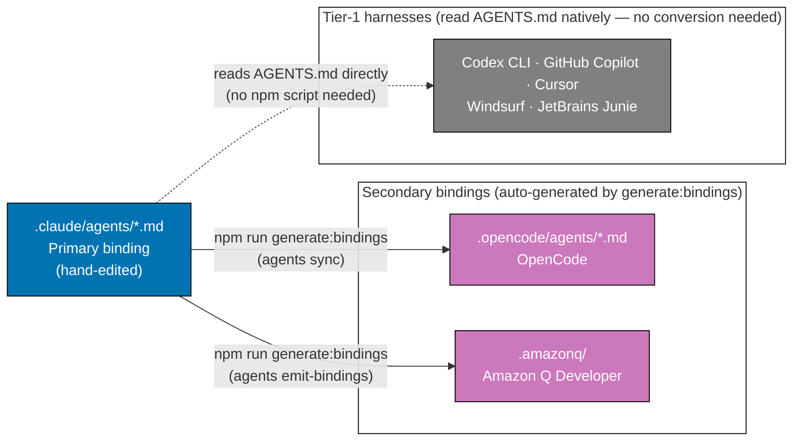

# Blueprint: Harness/Vendor Neutrality for ose-primer

**Status**: In Progress
**Project**: `package.json`, `repo-governance/`, `.claude/`, `apps/rhino-cli-rust/`, `apps/rhino-cli-go/`

> **Adoption note**: This plan is adapted from the upstream `ose-public` plan
> `plans/done/2026-05-25__harness-vendor-neutrality-blueprint`. It is **not a blind copy** —
> it is re-grounded against ose-primer's actual repository state. The key divergences from
> upstream are recorded in [tech-docs.md §Upstream-vs-ose-primer Divergences](./tech-docs.md#upstream-vs-ose-primer-divergences).

## Purpose

This plan is a **blueprint** — a framework defining what harness/vendor neutrality means in this
repository, where it applies, how it is enforced, and how it propagates. It is not just a script
rename; the npm script rename is the **first concrete deliverable** under the blueprint.

Future deliverables (new harnesses, new shared artifacts, new governance gaps) are governed by
this same blueprint without requiring a new plan.

---

## What is a Coding-Agent Harness?

A **coding-agent harness** is a tool that an AI coding agent uses to load repository-specific
instructions and configuration. Each harness reads a different set of binding files:

| Harness            | Binding format                     | Location                                 | Tier          |
| ------------------ | ---------------------------------- | ---------------------------------------- | ------------- |
| Claude Code        | YAML frontmatter agent definitions | `.claude/agents/*.md` (primary source)   | Primary       |
| OpenCode           | Converted agent definitions        | `.opencode/agents/*.md` (auto-generated) | Secondary     |
| Amazon Q Developer | Bridge config + rules pointer      | `.amazonq/` (auto-generated)             | Secondary     |
| Tier-1 native      | Read `AGENTS.md` natively          | repo root                                | Tier-1 native |

[Repo-grounded: ose-primer ships `.claude/`, `.opencode/`, and `.amazonq/` binding directories;
`AGENTS.md` is the canonical root instruction surface]

**Tier model**:

- **Primary** (`.claude/`): hand-edited source of truth for agent definitions
- **Secondary** (`.opencode/`, `.amazonq/`): auto-generated from primary by `rhino-cli`; require
  `npm run generate:bindings` after each primary edit
- **Tier-1 native**: read `AGENTS.md` directly from repo root; `generate:bindings` does NOT need
  to run for them — they always see the current primary instruction surface



---

## What is Harness/Vendor Neutrality?

**Harness neutrality** means that shared, load-bearing artifacts — npm script names, shared
config keys, instruction prose in `repo-governance/`, `AGENTS.md` — must not encode any single
harness's vendor name.

**Why it matters**: Shared artifacts serve all harnesses equally. If an npm script is named after
one harness, contributors using other harnesses are misled into thinking the script doesn't apply
to them, and automated checks miss other harnesses' coverage.

**The rule**: Name the **operation**, not the **vendor**. Use `generate:bindings`, not
`sync:claude-to-opencode`. Use "secondary binding generation", not "sync to OpenCode".

This is enforced by:

- [Governance Vendor-Independence Convention](../../../repo-governance/conventions/structure/governance-vendor-independence.md)
  [Repo-grounded]
- [Multi-Harness Binding Convention](../../../repo-governance/conventions/structure/multi-harness-binding.md)
  [Repo-grounded]
- `rhino-cli repo-governance vendor-audit` — scans governance prose for vendor names outside
  exempt sections [Repo-grounded: `apps/rhino-cli-rust/src/internal/repo_governance/vendor_audit.rs`]

---

## Vendor-Neutral Zones vs. Vendor-Specific Zones

### Vendor-Neutral Zone (must not name specific harnesses)

| Artifact                 | Why neutral                                                    |
| ------------------------ | -------------------------------------------------------------- |
| `package.json` scripts   | Serves all harnesses; contributors of any harness run them     |
| `repo-governance/` prose | Governance applies to all harnesses equally                    |
| `AGENTS.md`              | Primary instruction surface for all native harnesses           |
| Shared npm script names  | Must describe the operation, not the target harness            |
| Nx target names          | Project-level operations, not harness-specific                 |
| CI workflow steps        | Run identically regardless of which harness a contributor uses |

### Vendor-Specific Zone (may name harnesses — intentional)

| Artifact                                        | Why vendor-specific is correct                          |
| ----------------------------------------------- | ------------------------------------------------------- |
| `.claude/agents/*.md`                           | Claude Code platform binding; format is Claude-specific |
| `.opencode/agents/*.md`                         | OpenCode platform binding; format is OpenCode-specific  |
| `.amazonq/`                                     | Amazon Q bridge files; format is Amazon-Q-specific      |
| `CLAUDE.md` (Platform Binding Examples section) | Intentionally vendor-specific per convention            |
| `AGENTS.md` (Platform Binding Examples section) | Exempt section — vendor names allowed here              |
| `docs/reference/platform-bindings.md`           | Catalogs concrete bindings — names are accurate there   |

[Repo-grounded: `repo-governance/conventions/structure/governance-vendor-independence.md`]

---

## Blueprint Principles and Rules

### Rule 1: npm scripts must be vendor-neutral

Every npm script in `package.json` that generates, validates, or operates on artifacts shared
across harnesses must name the **operation**, not the harness:

```
# WRONG — encodes two vendor names
"sync:claude-to-opencode": "..."

# CORRECT — names the operation
"generate:bindings": "..."
```

[Judgment call: ecosystem convention uses plain `generate` (Prisma, GraphQL Code Generator,
OpenAPI Generator) but the colon-namespace `generate:bindings` adds useful clarity for a monorepo
with multiple generate targets. Not yet an ecosystem standard — design decision.]

### Rule 2: Governance prose must pass vendor-audit

All files under `repo-governance/` must pass `rhino-cli repo-governance vendor-audit`. Vendor
product names are only permitted in the `Platform Binding Examples` section,
`docs/reference/platform-bindings.md`, and plan files under `plans/`.

### Rule 3: Shared config keys must be harness-neutral

Any key in a shared config file (e.g., `nx.json`, `package.json`) that controls a cross-harness
operation must use harness-neutral naming.

### Rule 4: One convention, no variants

When a harness-neutral name is adopted (e.g., `generate:bindings`), every repository that needs
the same operation adopts the same name. No `sync:bindings`, no `emit:all`. One convention,
propagated, no forks.

### Rule 5: Primary binding may be vendor-specific

The primary binding (`.claude/`) is intentionally Claude Code-specific. It is the source of truth
and its format is Claude Code's agent definition format. The rule only applies to the **shared
zone**.

---

## Current Problems This Blueprint Resolves (Phase 1)

### Problem 1: Silent correctness gap

`npm run sync:claude-to-opencode` only runs `agents sync` (OpenCode). It never runs
`agents emit-bindings` (Amazon Q). Every agent instruction that says "run
`sync:claude-to-opencode` after editing agents" silently leaves Amazon Q bindings stale.
[Repo-grounded: `package.json` — `sync:claude-to-opencode` ends at `agents sync`]

The cross-vendor parity Invariant 3 check in `repo-parity-checker` uses:

```bash
npm run sync:claude-to-opencode && git diff --quiet .opencode/
```

It passes even when `.amazonq/` is out of date — a correctness hole in the parity gate.
[Repo-grounded: `.claude/agents/repo-parity-checker.md` Invariant 3 tool string]

### Problem 2: Vendor-locked naming

`sync:claude-to-opencode` encodes two vendor names (Claude, OpenCode) in a script that lives in
the shared `package.json`. The repo's governance explicitly requires vendor neutrality in shared
artifacts. [Repo-grounded: `repo-governance/conventions/structure/multi-harness-binding.md`]

### Problem 3: Ecosystem name mismatch

The `generate:` namespace is used in comparable projects (Prisma uses `generate`, GraphQL Code
Generator uses `codegen`, OpenAPI Generator uses `generate`) for artifact generation pipelines.
The word `sync` describes a push/pull operation with a remote — not artifact generation. The word
`emit` is compiler-internal (rustc, tsc) — not idiomatic for user-facing npm scripts.
[Judgment call: `generate:bindings` is our design decision, not a web-confirmed idiom.]

---

## First Concrete Deliverable: `generate:bindings`

**Replace `sync:claude-to-opencode` with `generate:bindings`** across the entire repo:

```json
"generate:bindings": "nx run rhino-cli-rust:build --skip-nx-cache && ./apps/rhino-cli-rust/dist/rhino-cli agents sync && ./apps/rhino-cli-rust/dist/rhino-cli agents emit-bindings"
```

- `sync:claude-to-opencode` is **fully removed** — hard delete, no alias, no passthrough
- All documentation and agent definition references updated in the same delivery batch
- Cross-vendor parity Invariant 3 updated to:
  `npm run generate:bindings && git diff --quiet .opencode/ .amazonq/`

**See**: [Delivery Checklist](./delivery.md) for execution steps.

### Why hard-delete (no alias)

All references are updated in the same delivery batch (Phases 2–3 in delivery.md). A grep-verify
step confirms zero remaining references before the commit. Because the rename sweep and the
script deletion land together, there is no window where the old name is referenced but missing.
A deprecated alias would leave dead weight that future checkers flag as a finding. Clean break is
simpler. [Judgment call]

### Why a single `nx ... build` then sequential `&&`

ose-primer invokes rhino-cli via `nx run rhino-cli-rust:build --skip-nx-cache &&
./apps/rhino-cli-rust/dist/rhino-cli ...` (not `cargo run`). The build runs **once**, then
`agents sync` and `agents emit-bindings` run sequentially against the freshly-built binary:

1. Build once — no point rebuilding between the two subcommands
2. Sequential `&&` short-circuits: if the build or `agents sync` fails, `emit-bindings` is not run
3. Sequential order makes debug output readable (no interleaved stdout)

[Judgment call: build-once-then-sequential is correct here]

---

## Scope of This Deliverable

### In Scope

- Add `generate:bindings` npm script covering both `agents sync` AND `agents emit-bindings`
- **Hard-delete** `sync:claude-to-opencode` (no alias, no passthrough)
- Update `validate:config` to use `generate:bindings`
- Update all governance documentation under `repo-governance/`
- Update all agent definition files under `.claude/agents/` (and skills under `.claude/skills/`)
- Update `CLAUDE.md`, `AGENTS.md`, root `README.md`, and `docs/reference/platform-bindings.md`
- Update both dual-CLI parity scripts (`apps/rhino-cli-rust/scripts/`, `apps/rhino-cli-go/scripts/`)
- **Merge `repo-cross-vendor-parity-*` into `repo-harness-compatibility-*`** so ose-primer has
  exactly ONE harness-compat workflow and ONE checker/fixer pair (identical structure to
  `ose-public`): the 5 cross-vendor parity invariants become Phase 0 of the harness-compat checker,
  and Invariant 3 is the corrected `npm run generate:bindings && git diff --quiet .opencode/ .amazonq/`.
  Delete the parity workflow + parity agents (+ their `.opencode/` mirrors).
- Run `repo-rules-maker` + `repo-rules-quality-gate` to confirm governance propagation
- Run vendor-audit to confirm zero vendor names outside exempt sections

### Out of Scope

- Renaming rhino-cli CLI subcommands (`agents sync`, `agents emit-bindings`)
- Adding new npm scripts beyond `generate:bindings` (e.g., dry-run variants)
- Removing `sync:agents`, `sync:skills`, `sync:dry-run` targeted scripts
- Any new harness support
- Changing Rust (`apps/rhino-cli-rust/src/`) or Go (`apps/rhino-cli-go/`) CLI logic
- Deleting the `validate-cross-vendor-parity.sh` scripts, their `validate:cross-vendor-parity` Nx
  targets, or the pre-push guard line — these SURVIVE the merge (they are the deterministic
  pre-push byte guard, decoupled from the agent/workflow layer, exactly as in `ose-public`)

---

## Governance Placement and Vendor-Neutrality

All governance documentation for this change lives in `repo-governance/` and **must be
vendor-neutral**. Hard requirement from the
[Governance Vendor-Independence Convention](../../../repo-governance/conventions/structure/governance-vendor-independence.md).
[Repo-grounded]

- Documentation updated under `repo-governance/` must describe `generate:bindings` in
  vendor-neutral terms: "secondary binding generation", "generate all harness bindings", not
  "sync to OpenCode" or "emit Amazon Q bridges"
- The vendor-audit scanner (`rhino-cli repo-governance vendor-audit`) must pass after this plan
  lands
- `repo-rules-maker` is invoked (Phase 5 of delivery) to confirm whether the multi-harness-binding
  convention already covers the harness-neutral npm script naming pattern or whether a new entry
  is needed. Note: ose-primer's AD8 slot already documents Dual-Implementation Byte-Parity, so any
  new naming rule must NOT reuse the AD8 number. [Repo-grounded:
  `repo-governance/conventions/structure/multi-harness-binding.md` §AD8]

---

## Single Harness-Compat Workflow (parity merge)

ose-primer currently carries TWO overlapping gates — `repo-cross-vendor-parity-quality-gate` (5
deterministic invariants) and `repo-harness-compatibility-quality-gate` (external drift) — plus four
agents (`repo-parity-checker`/`repo-parity-fixer` + the harness-compat pair). `ose-public` already
collapsed these into ONE workflow and ONE checker/fixer pair, where the parity invariants run as the
checker's deterministic **Phase 0** before the Phase 1 web-research drift pass.

This plan brings ose-primer to the same end-state: merge the parity workflow and agents into the
harness-compat trio, then delete the parity files. The corrected Invariant 3
(`npm run generate:bindings && git diff --quiet .opencode/ .amazonq/`) lands in the merged
harness-compat **checker's Phase 0** — the natural home for the correctness-gap fix. The
deterministic `validate-cross-vendor-parity.sh` scripts, their `validate:cross-vendor-parity` Nx
targets, and the pre-push guard line SURVIVE unchanged in role (they are the pre-push byte guard,
decoupled from the agent/workflow layer — exactly as in `ose-public`). [Repo-grounded: `ose-public`
merged trio]

---

## Adoption Across the ose-\* Ecosystem

`ose-primer` is the downstream public template. It receives propagated governance/agent changes
from `ose-public` and is itself the upstream for downstream forks. The `generate:bindings`
convention applies to every repository in the ose-\* family that ships AI agent bindings and uses
`rhino-cli` for secondary binding generation.

**No duplication rule**: downstream forks inherit ONE `generate:bindings` script — same operation
name, not a variant. [Judgment call: propagation is copy-identical, no drift expected]

---

## Ongoing Blueprint Enforcement

| Enforcement mechanism                               | Frequency                 | Blocks what                              |
| --------------------------------------------------- | ------------------------- | ---------------------------------------- |
| `rhino-cli repo-governance vendor-audit`            | Every governance edit     | Vendor names in neutral zone             |
| `repo-rules-quality-gate` (strict mode)             | After governance sweeps   | Inconsistent/contradictory rules         |
| `repo-harness-compatibility-quality-gate` (Phase 0) | Periodic / on demand      | Parity-invariant drift (the single gate) |
| `validate:cross-vendor-parity` (pre-push guard)     | Every push                | Stale secondary bindings byte-drift      |
| Invariant 3 (generate:bindings + diff)              | Phase 0 of harness-compat | Stale `.opencode/` or `.amazonq/`        |

---

## Related Documents

- [BRD](./brd.md) — Business rationale and success metrics
- [PRD](./prd.md) — User stories and acceptance criteria
- [Technical Documentation](./tech-docs.md) — Implementation details, divergences, file-impact
- [Delivery Checklist](./delivery.md) — Sequential execution steps with quality gates

## Related Files

- [Plans Convention](../../../repo-governance/conventions/structure/plans.md)
- [Multi-Harness Binding Convention](../../../repo-governance/conventions/structure/multi-harness-binding.md)
- [Governance Vendor-Independence Convention](../../../repo-governance/conventions/structure/governance-vendor-independence.md)
- [rhino-cli Dual-Implementation Parity Convention](../../../repo-governance/conventions/structure/rhino-cli-dual-implementation-parity.md)
- [Harness Compatibility Quality Gate](../../../repo-governance/workflows/repo/repo-harness-compatibility-quality-gate.md)
  — the single harness-compat gate (cross-vendor parity is its Phase 0 after this plan)
