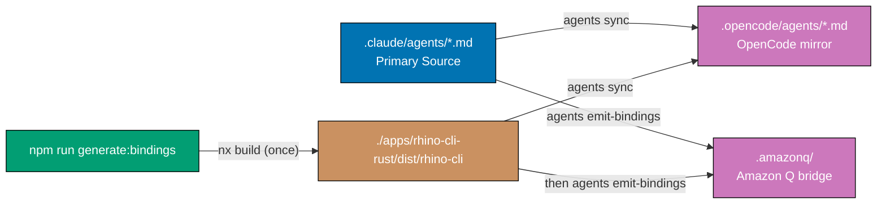

# Technical Documentation: Harness/Vendor Neutrality Blueprint — Phase 1

## Architecture Overview



## Upstream-vs-ose-primer Divergences

This plan is adapted from `ose-public/plans/done/2026-05-25__harness-vendor-neutrality-blueprint`.
The following divergences were re-grounded against ose-primer's actual state — **do not assume
upstream paths or file lists apply here**.

| Concern                                 | ose-public (upstream)                                                      | ose-primer (this repo)                                                                                       |
| --------------------------------------- | -------------------------------------------------------------------------- | ------------------------------------------------------------------------------------------------------------ |
| rhino-cli location                      | `apps/rhino-cli/` (single Rust impl)                                       | `apps/rhino-cli-rust/` **and** `apps/rhino-cli-go/` (dual-impl byte-parity pair)                             |
| CLI invocation                          | `cargo run --release --quiet --manifest-path apps/rhino-cli/Cargo.toml --` | `nx run rhino-cli-rust:build --skip-nx-cache && ./apps/rhino-cli-rust/dist/rhino-cli`                        |
| Parity invariant location               | Merged into `repo-harness-compatibility-*`                                 | Kept separate: `repo-cross-vendor-parity-quality-gate.md` + `repo-parity-checker`/`repo-parity-fixer` agents |
| Invariant 3 host                        | `repo-harness-compatibility-checker.md`                                    | `repo-parity-checker.md` (tool string `npm run sync:claude-to-opencode && git diff --quiet .opencode/`)      |
| `AGENTS.md` occurrences                 | 0 (no edit)                                                                | 1 (must edit)                                                                                                |
| Root `README.md`                        | not listed                                                                 | 1 occurrence (must edit)                                                                                     |
| `.claude/skills/README.md`              | not listed                                                                 | 1 occurrence (must edit)                                                                                     |
| `docs/reference/ai-model-benchmarks.md` | 1 occurrence                                                               | 0 occurrences (no such reference) — skip                                                                     |
| `repo-rules-quality-gate.md`            | 1 occurrence                                                               | 0 occurrences (file exists, no sync reference) — skip the edit, still run the gate in Phase 5                |
| AD8 slot in multi-harness-binding       | upstream added "Harness-Neutral npm Script Naming" as AD8                  | ose-primer's AD8 is already **Dual-Implementation Byte-Parity** — a new naming rule must NOT reuse AD8       |
| Parity scripts                          | one (`apps/rhino-cli/scripts/`)                                            | two (`apps/rhino-cli-rust/scripts/` + `apps/rhino-cli-go/scripts/`), each with 2 occurrences                 |

## Current State (Before)

### package.json scripts (relevant subset) [Repo-grounded]

```json
"sync:claude-to-opencode": "nx run rhino-cli-rust:build --skip-nx-cache && ./apps/rhino-cli-rust/dist/rhino-cli agents sync",
"sync:agents":             "nx run rhino-cli-rust:build --skip-nx-cache && ./apps/rhino-cli-rust/dist/rhino-cli agents sync --agents-only",
"sync:skills":             "nx run rhino-cli-rust:build --skip-nx-cache && ./apps/rhino-cli-rust/dist/rhino-cli agents sync --skills-only",
"sync:dry-run":            "nx run rhino-cli-rust:build --skip-nx-cache && ./apps/rhino-cli-rust/dist/rhino-cli agents sync --dry-run",
"validate:sync":           "nx run rhino-cli-rust:build --skip-nx-cache && ./apps/rhino-cli-rust/dist/rhino-cli agents validate-sync",
"validate:opencode":       "npm run validate:sync",
"validate:config":         "npm run validate:claude && npm run sync:claude-to-opencode && npm run validate:opencode"
```

No npm script wraps `agents emit-bindings`. [Repo-grounded: `package.json`]

### rhino-cli subcommands [Repo-grounded: `apps/rhino-cli-rust/src/cli.rs`, `apps/rhino-cli-go/cmd/`]

- `agents sync` → writes `.opencode/agents/*.md`
- `agents emit-bindings` → writes `.amazonq/` bridge (`cli-agents/ose-default.json`,
  `rules/00-agents-md.md`). Present in **both** the Rust (`run_emit_bindings`) and Go
  (`runEmitBindings`) implementations.

### Files referencing `sync:claude-to-opencode` [Repo-grounded: grep 2026-05-25]

Source-of-truth (hand-edited) files:

| File                                                                        | Count | Reference type                                    |
| --------------------------------------------------------------------------- | ----- | ------------------------------------------------- |
| `package.json`                                                              | 2     | Definition + `validate:config`                    |
| `CLAUDE.md`                                                                 | 1     | Instruction                                       |
| `AGENTS.md`                                                                 | 1     | Instruction                                       |
| `README.md` (root)                                                          | 1     | Reference                                         |
| `docs/reference/platform-bindings.md`                                       | 1     | Reference                                         |
| `repo-governance/development/agents/ai-agents.md`                           | 5     | Instruction                                       |
| `repo-governance/development/agents/model-selection.md`                     | 1     | Instruction                                       |
| `repo-governance/development/quality/code.md`                               | 2     | Instruction                                       |
| `repo-governance/conventions/structure/multi-harness-binding.md`            | 1     | Instruction (AD8 regenerated-data note)           |
| `repo-governance/workflows/repo/repo-harness-compatibility-quality-gate.md` | 1     | Auto-fixable-scope note                           |
| `repo-governance/workflows/repo/repo-cross-vendor-parity-quality-gate.md`   | 3     | Invariant 3 description                           |
| `apps/rhino-cli-rust/scripts/validate-cross-vendor-parity.sh`               | 2     | Shell invocation + error message                  |
| `apps/rhino-cli-go/scripts/validate-cross-vendor-parity.sh`                 | 2     | Shell invocation + error message                  |
| `.claude/agents/agent-maker.md`                                             | 1     | Description frontmatter                           |
| `.claude/agents/README.md`                                                  | 2     | Instruction                                       |
| `.claude/agents/repo-harness-compatibility-fixer.md`                        | 1     | Instruction                                       |
| `.claude/agents/repo-parity-checker.md`                                     | 2     | Invariant 3 tool string (incl. `.opencode/` diff) |
| `.claude/agents/repo-parity-fixer.md`                                       | 3     | Description + body instruction                    |
| `.claude/agents/repo-rules-fixer.md`                                        | 1     | Instruction                                       |
| `.claude/agents/web-research-maker.md`                                      | 1     | Reference                                         |
| `.claude/skills/agent-developing-agents/SKILL.md`                           | 1     | Skill instruction                                 |
| `.claude/skills/README.md`                                                  | 1     | Reference                                         |

Auto-generated mirrors (regenerated by `generate:bindings` — **do NOT hand-edit** unless a
residual survives sync):

| File                                                   | Source                                  |
| ------------------------------------------------------ | --------------------------------------- |
| `.opencode/agents/agent-maker.md`                      | `.claude/agents/agent-maker.md`         |
| `.opencode/agents/repo-harness-compatibility-fixer.md` | `.claude/agents/…`                      |
| `.opencode/agents/repo-parity-checker.md`              | `.claude/agents/repo-parity-checker.md` |
| `.opencode/agents/repo-parity-fixer.md`                | `.claude/agents/repo-parity-fixer.md`   |
| `.opencode/agents/repo-rules-fixer.md`                 | `.claude/agents/repo-rules-fixer.md`    |
| `.opencode/agents/web-research-maker.md`               | `.claude/agents/web-research-maker.md`  |

Total: ~36 occurrences across 22 source-of-truth files (plus 6 auto-generated mirror files).

## Target State (After)

### package.json scripts (proposed)

```json
"generate:bindings":       "nx run rhino-cli-rust:build --skip-nx-cache && ./apps/rhino-cli-rust/dist/rhino-cli agents sync && ./apps/rhino-cli-rust/dist/rhino-cli agents emit-bindings",
"sync:agents":             "nx run rhino-cli-rust:build --skip-nx-cache && ./apps/rhino-cli-rust/dist/rhino-cli agents sync --agents-only",
"sync:skills":             "nx run rhino-cli-rust:build --skip-nx-cache && ./apps/rhino-cli-rust/dist/rhino-cli agents sync --skills-only",
"sync:dry-run":            "nx run rhino-cli-rust:build --skip-nx-cache && ./apps/rhino-cli-rust/dist/rhino-cli agents sync --dry-run",
"validate:sync":           "nx run rhino-cli-rust:build --skip-nx-cache && ./apps/rhino-cli-rust/dist/rhino-cli agents validate-sync",
"validate:opencode":       "npm run validate:sync",
"validate:config":         "npm run validate:claude && npm run generate:bindings && npm run validate:opencode"
```

`sync:claude-to-opencode` is **removed entirely** — no deprecated alias, no passthrough.

### Why build once, then sequential `&&`

`agents emit-bindings` reads no output from `agents sync`. The `nx run rhino-cli-rust:build`
prefix produces the binary once; both subcommands then run against `./apps/rhino-cli-rust/dist/rhino-cli`:

1. Build once — rebuilding between subcommands wastes time
2. Sequential `&&` short-circuits: a build or `agents sync` failure stops before `emit-bindings`
3. Sequential order keeps debug output readable

[Judgment call: build-once-then-sequential is correct here]

### Why keep `sync:agents`, `sync:skills`, `sync:dry-run`

These targeted scripts are used during development when only partial regeneration is needed. They
are scoped operations, not aliases for `generate:bindings`. [Judgment call]

## Design Decisions

### Decision 1: Hard-delete `sync:claude-to-opencode` (no deprecated alias)

All references are updated in the same delivery batch (Phases 2–3). A grep-verify step confirms
zero remaining references before the commit. Because the rename sweep and the script deletion land
together, the repo is never in a broken intermediate state. A deprecated alias would leave dead
weight that future checkers flag as a finding. [Judgment call]

### Decision 2: `generate:bindings` runs both sync AND emit-bindings

`generate:bindings` must be the single command contributors run after any `.claude/` change. If it
omitted `agents sync`, OpenCode would be stale; if it omitted `emit-bindings`, Amazon Q would be
stale. Both must run. [Judgment call]

### Decision 3: No changes to rhino-cli source (Rust or Go)

The CLI subcommands are implementation details. Only the npm wrapper, docs, and parity-check tool
strings change. No Rust/Go logic change, no Cargo.toml/go.mod change. This keeps scope tight.
[Judgment call]

### Decision 4: Extend Invariant 3 to `.amazonq/`, in the parity gate (not harness-compat)

ose-primer keeps cross-vendor parity in `repo-cross-vendor-parity-quality-gate.md` and
`repo-parity-checker`/`repo-parity-fixer` (upstream merged these into harness-compat). The
correctness-gap fix — `npm run generate:bindings && git diff --quiet .opencode/ .amazonq/` — lands
in `repo-parity-checker.md` Invariant 3 plus the parity gate workflow. The harness-compat workflow
gets only the incidental name swap. [Repo-grounded]

### Decision 5: Parity shell scripts get name-only replacement

`validate-cross-vendor-parity.sh` (Rust + Go) check `git diff --quiet -- .opencode/agents/`, which
is their narrower opencode-parity scope. Replacing the script-name reference (`generate:bindings`)
is sufficient; the `.opencode/agents/` diff scope is intentionally narrow and unchanged. [Judgment
call: minimal, mirrors upstream's script handling]

## File-Impact Analysis

### `package.json` [MODIFY]

- Add `generate:bindings` entry with the full `nx build && agents sync && agents emit-bindings` chain
- **Delete** `sync:claude-to-opencode` entirely (hard delete — no alias)
- Change `validate:config` to use `generate:bindings`

### `repo-governance/development/agents/ai-agents.md` [MODIFY] — 5 locations → `generate:bindings`

### `repo-governance/development/agents/model-selection.md` [MODIFY] — 1 location

### `repo-governance/development/quality/code.md` [MODIFY] — 2 locations

### `repo-governance/conventions/structure/multi-harness-binding.md` [MODIFY] — 1 location (AD8 regenerated-data note)

### `repo-governance/workflows/repo/repo-cross-vendor-parity-quality-gate.md` [MODIFY]

Three locations. Invariant 3 description gains `agents emit-bindings` semantics and `.amazonq/`
coverage; the regen tool string changes to `npm run generate:bindings`.

### `repo-governance/workflows/repo/repo-harness-compatibility-quality-gate.md` [MODIFY] — 1 location (name swap only)

### `docs/reference/platform-bindings.md` [MODIFY] — 1 location

### `CLAUDE.md`, `AGENTS.md`, `README.md` (root) [MODIFY] — 1 location each

### `apps/rhino-cli-rust/scripts/validate-cross-vendor-parity.sh` [MODIFY] — 2 locations (invocation + error message)

### `apps/rhino-cli-go/scripts/validate-cross-vendor-parity.sh` [MODIFY] — 2 locations (invocation + error message)

### `.claude/agents/repo-parity-checker.md` [MODIFY]

Two locations: description frontmatter + Invariant 3 tool string. Invariant 3 changes from
`npm run sync:claude-to-opencode && git diff --quiet .opencode/` to
`npm run generate:bindings && git diff --quiet .opencode/ .amazonq/`.

### `.claude/agents/repo-parity-fixer.md` [MODIFY] — 3 locations (description + body)

### `.claude/agents/agent-maker.md` [MODIFY] — 1 location (description frontmatter)

### `.claude/agents/README.md` [MODIFY] — 2 locations

### `.claude/agents/repo-harness-compatibility-fixer.md` [MODIFY] — 1 location

### `.claude/agents/repo-rules-fixer.md` [MODIFY] — 1 location

### `.claude/agents/web-research-maker.md` [MODIFY] — 1 location

### `.claude/skills/agent-developing-agents/SKILL.md` [MODIFY] — 1 location

### `.claude/skills/README.md` [MODIFY] — 1 location

### `.opencode/agents/*.md` [AUTO-UPDATED]

All `.opencode/` agent mirrors are regenerated by `npm run generate:bindings` after the `.claude/`
edits. No manual edits unless a residual survives sync (grep `.opencode/` in Phase 3; fix manually
if found, e.g. a non-synced README).

## Dependencies

- No new npm packages, Rust crates, or Go modules
- No new rhino-cli subcommands
- Requires rhino-cli to be buildable via `nx run rhino-cli-rust:build` (existing dependency)

## Rollback

If `generate:bindings` breaks something:

1. `git revert` the delivery commits — restores `package.json`, all docs, and agent definitions in
   one operation
2. `.opencode/` and `.amazonq/` artifacts can be regenerated by running
   `nx run rhino-cli-rust:build && ./apps/rhino-cli-rust/dist/rhino-cli agents sync` (and
   `emit-bindings`) directly

Risk is low — documentation + npm script change with no rhino-cli logic change.

## Quality Gates

After delivery:

```bash
# 1. generate:bindings works end-to-end
npm run generate:bindings

# 2. Both secondary bindings are clean
git diff --quiet .opencode/ .amazonq/

# 3. No stale old name (source-of-truth zones)
grep -r "sync:claude-to-opencode" repo-governance/ .claude/ docs/ apps/ CLAUDE.md AGENTS.md README.md package.json \
  | grep -v "generated-reports\|dist/\|target/\|worktrees/\|/coverage/"
# Expected: zero matches

# 4. validate:config still works
npm run validate:config

# 5. validate:harness-bindings (deterministic binding parity)
npm run validate:harness-bindings

# 6. Affected Nx quality gate
npx nx affected -t typecheck lint test:quick

# 7. Markdown lint
npm run lint:md

# 8. vendor-audit passes
./apps/rhino-cli-rust/dist/rhino-cli repo-governance vendor-audit repo-governance/
```
